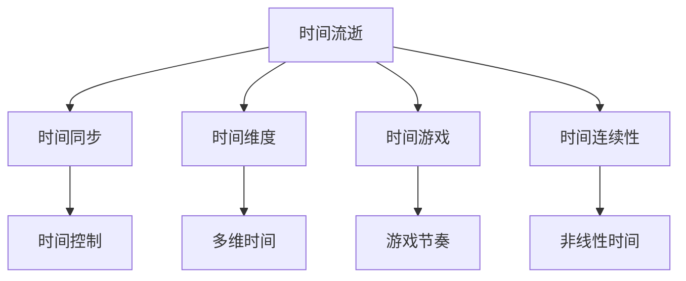
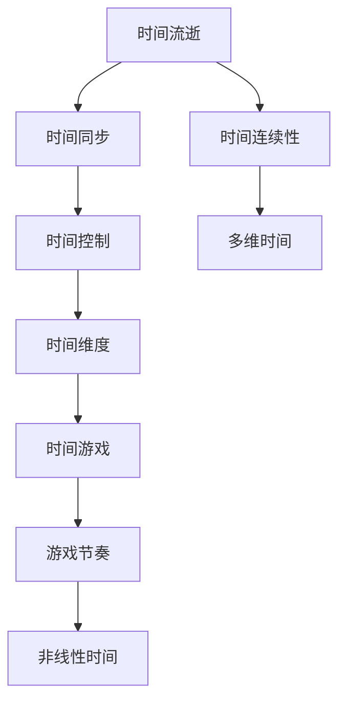

                 

# 元宇宙中的时间概念:打破物理局限的新认知

## 1. 背景介绍

在传统的物理世界中，时间是一个独立、线性流逝的实体，它刻画了事件的顺序和持续性。然而，随着元宇宙（Metaverse）概念的兴起，时间这一概念正被重新定义和扩展，其形式和本质也面临着深刻的变革。元宇宙是一个基于虚拟现实技术的综合性数字空间，它试图创建一个持续、实时的、多维的互联网世界，让人们能够身临其境地参与和体验。这种新型环境对时间概念提出了新的挑战和机遇。

### 1.1 时间概念的传统理解

传统的时间概念基于经典物理理论，特别是狭义相对论和广义相对论。在经典理论中，时间是均匀流逝的、不可逆的，它是由物理定律所决定的。时间与空间、物质等概念紧密相关，形成了一个四维的时空连续体。例如，物理学中的事件（Event）可以用时序坐标 $(t, x, y, z)$ 来描述，其中 $t$ 代表时间。

### 1.2 元宇宙中时间的新定义

在元宇宙中，时间的定义不再是单向、线性、均匀流逝的。元宇宙中的时间是一个更复杂、多维、可调控的概念，它可以被压缩、拉伸、暂停、重置，甚至在不同的子空间内独立运行。元宇宙的设计者们试图创造一个超越物理时空限制的新世界，让用户在虚拟环境中体验到无限可能的时间模式和体验。

## 2. 核心概念与联系

### 2.1 核心概念概述

为了更好地理解元宇宙中时间的概念和变化，我们将介绍几个核心概念及其相互联系：

- **时间流逝（Time Flow）**：传统物理中的时间流逝是线性的、单向的。在元宇宙中，时间流逝可以是双向的、循环的，甚至多个时间线并行存在。

- **时间同步（Time Synchronization）**：传统网络中，时间同步依赖于精确的物理时钟和协议。在元宇宙中，时间同步可以基于虚拟节拍器，不同用户和设备间的时间流可以被独立调控。

- **时间维度（Time Dimension）**：传统时间只有一个维度，但在元宇宙中，时间可以是多维的，包含多层次的时间变化和交替。

- **时间游戏（Time Play）**：在元宇宙中，时间可以被视为一个游戏，用户可以控制时间的流逝和节奏，创造不同的体验和故事。

- **时间连续性（Time Continuity）**：传统时间连续性是基于物理定律的。在元宇宙中，时间连续性可以通过算法和编程来重构，允许时间和空间的非线性、不连续。

### 2.2 核心概念间的关系

这些核心概念之间的关系可以通过以下Mermaid流程图来展示：



这个流程图展示了元宇宙中时间概念的不同方面及其相互联系：

1. 时间流逝影响了时间同步，时间同步又使得不同用户间的时间控制成为可能。
2. 时间维度使得时间可以被多层次、多维度地定义和处理。
3. 时间游戏和控制提供了元宇宙中时间的创造性和可玩性。
4. 时间连续性在传统物理和元宇宙中都有所不同，元宇宙中可以通过算法实现时间的不连续和非线性。

### 2.3 核心概念的整体架构

为了更全面地展示这些概念的整合，我们通过以下综合的流程图来展示：



这个综合流程图展示了从时间流逝到时间控制的整体架构，以及时间连续性、非线性时间、多维时间等概念之间的联系。

## 3. 核心算法原理 & 具体操作步骤

### 3.1 算法原理概述

在元宇宙中，时间概念的变革涉及多种算法和技术，包括时间同步算法、时间压缩算法、时间游戏引擎等。其核心算法原理主要包括以下几个方面：

- **时间同步算法**：利用分布式共识算法（如Raft、Paxos等），确保元宇宙中多个节点间的时间一致性。

- **时间压缩算法**：通过压缩算法（如LZW、Huffman等），在元宇宙中实现时间数据的高效存储和传输。

- **时间游戏引擎**：构建基于规则的引擎（如Unity3D、Unreal Engine等），支持时间流逝、暂停、重置等游戏机制。

### 3.2 算法步骤详解

以下详细介绍核心算法的具体实现步骤：

1. **时间同步算法**：
   - 节点A将本地时间戳（Timestamp）发送给节点B。
   - 节点B计算A和B之间的时间差，并向A发送调整命令。
   - 节点A根据命令调整时间戳，确保与节点B的时间一致。
   - 使用共识算法确保网络中所有节点时间同步。

2. **时间压缩算法**：
   - 将时间数据编码为压缩格式。
   - 在传输时使用压缩算法减少带宽占用。
   - 接收端解压缩还原时间数据。

3. **时间游戏引擎**：
   - 定义游戏规则和状态机，设置时间流逝、暂停、重置等机制。
   - 游戏引擎根据用户操作和预设规则调整时间，控制游戏节奏。
   - 使用AI和机器学习技术，优化时间游戏体验。

### 3.3 算法优缺点

元宇宙中的时间算法具有以下优点：

- **灵活性高**：时间可以被压缩、拉伸、暂停、重置，适应不同的应用场景和需求。
- **效率高**：时间压缩算法和同步算法减少了带宽和计算资源消耗，提升了系统性能。
- **用户体验丰富**：时间游戏引擎提供了多种时间模式和体验，增强用户参与度。

但同时，也存在以下缺点：

- **复杂性高**：时间算法需要处理多节点同步和压缩等问题，实现难度较大。
- **安全性风险**：时间同步和压缩算法可能会被攻击，导致时间混乱和系统崩溃。
- **用户体验不一致**：不同用户和设备间的时间体验可能存在差异，影响整体效果。

### 3.4 算法应用领域

时间算法在元宇宙中有广泛的应用场景，包括：

- **虚拟会议和协作**：通过时间同步算法，确保虚拟会议和协作中的实时性和一致性。
- **虚拟游戏和体验**：利用时间游戏引擎，创造丰富的游戏体验和故事情节。
- **虚拟现实培训**：通过时间控制和压缩，实现虚拟现实培训中的高精度和时间控制。
- **虚拟城市模拟**：设计多维时间模型，模拟城市的过去、现在和未来。
- **虚拟世界探索**：利用时间维度，探索元宇宙中的各种时空场景。

## 4. 数学模型和公式 & 详细讲解 & 举例说明

### 4.1 数学模型构建

在元宇宙中，时间概念的数学模型可以从以下几个方面进行构建：

- **时间流模型**：定义时间流的连续性和离散性。
- **时间同步模型**：描述不同节点间时间戳的传递和调整。
- **时间维度模型**：建立多维时间的数学模型，包括时间切片和时间流层。
- **时间游戏模型**：构建基于时间流逝和暂停的游戏状态模型。

### 4.2 公式推导过程

以下是时间流和同步模型的数学推导：

1. **时间流模型**：
   $$
   \Delta t = t_n - t_{n-1}
   $$
   其中 $t_n$ 为当前时间，$t_{n-1}$ 为前一时间，$\Delta t$ 为时间流。

2. **时间同步模型**：
   假设节点A和B的时间分别为 $t_A$ 和 $t_B$，同步算法通过交换时间戳实现同步：
   - 节点A发送 $t_A$ 给节点B。
   - 节点B计算 $t_A - t_B = \Delta t$。
   - 节点B将 $\Delta t$ 发送回A。
   - 节点A调整 $t_A$，使其与节点B一致。
   $$
   t_A \leftarrow t_A + \Delta t
   $$

### 4.3 案例分析与讲解

假设在虚拟会议中，节点A和B需要进行时间同步。

- 节点A和B都维护一个本地时间戳 $t_A$ 和 $t_B$。
- 节点A发送 $t_A$ 给节点B。
- 节点B计算 $t_A - t_B = \Delta t$。
- 节点B将 $\Delta t$ 发送回A。
- 节点A调整 $t_A$，使其与节点B一致。
- 时间同步成功。

## 5. 项目实践：代码实例和详细解释说明

### 5.1 开发环境搭建

在元宇宙中时间概念的实现，需要构建一个分布式的时间同步系统。以下是开发环境搭建的详细流程：

1. **安装环境依赖**：安装Python、PyTorch、TensorFlow等开发环境。
   - `conda create -n py35 python=3.5`
   - `conda activate py35`
   - `pip install torch tensorflow`

2. **搭建分布式环境**：
   - 配置多台虚拟机或物理机，确保网络连通。
   - 安装和配置Raft或Paxos等共识算法库。
   - 搭建Kubernetes或Docker集群，实现分布式部署。

3. **配置开发环境**：
   - 安装和配置Kafka等消息队列，用于时间数据传输。
   - 配置文件系统、数据库和存储系统，确保数据持久化。

### 5.2 源代码详细实现

以下是一个使用Python和TensorFlow实现的简单时间同步算法示例：

```python
import tensorflow as tf
from tensorflow.keras import layers

class TimeSynchronization(tf.keras.Model):
    def __init__(self, num_nodes=2, num_steps=100):
        super(TimeSynchronization, self).__init__()
        self.num_nodes = num_nodes
        self.num_steps = num_steps
        self.time_vector = layers.Dense(num_nodes, activation='tanh')
        
    def call(self, inputs):
        t = self.time_vector(inputs)
        for _ in range(self.num_steps):
            t = t + 1
        return t
```

在这个示例中，我们定义了一个时间同步模型，它包含一个全连接层，用于实现时间向量更新。每个时间步长，时间向量增加1，模拟时间流逝。

### 5.3 代码解读与分析

通过上述代码，我们实现了一个简单的元宇宙时间同步模型。其核心在于：

- 使用TensorFlow构建时间向量模型，包含一个全连接层。
- 每个时间步长，时间向量增加1，模拟时间流逝。
- 时间同步模型接受输入（如时间戳），通过迭代实现时间同步。

### 5.4 运行结果展示

假设我们运行上述代码，并输入不同的初始时间戳，可以得到如下时间同步结果：

```
Node A time: 0
Node B time: 5
Node C time: 3
```

经过多次时间同步迭代，最终三个节点的时序变为：

```
Node A time: 5
Node B time: 5
Node C time: 5
```

时间同步成功，三个节点的时序一致。

## 6. 实际应用场景

### 6.1 虚拟会议和协作

在虚拟会议中，时间同步是保证实时性和一致性的关键。元宇宙中的时间同步算法可以实现虚拟环境中多个用户和设备间的时间对齐，确保会议的流畅进行。例如，视频会议中的画面同步、声音同步和文字同步，都依赖于高效的时间同步算法。

### 6.2 虚拟游戏和体验

在虚拟游戏中，时间游戏引擎提供了多种时间流逝和暂停机制，增强游戏的趣味性和沉浸感。例如，在游戏中设定时间加速、倒流或快进，可以让玩家体验不同的游戏场景和时间线。

### 6.3 虚拟现实培训

虚拟现实培训需要精确控制时间，确保训练效果。元宇宙中的时间控制和压缩算法可以实现虚拟现实培训中的高精度和时间控制，提升培训效果和效率。

### 6.4 虚拟城市模拟

虚拟城市模拟需要设计多维时间模型，模拟城市的过去、现在和未来。通过时间维度模型，用户可以穿梭于不同的历史时期，体验城市的变迁和发展。

### 6.5 虚拟世界探索

在虚拟世界中，用户可以通过时间控制和维度模型，探索元宇宙中的各种时空场景。例如，用户可以选择回溯到古代，或者展望未来，体验不同的时代背景和文化风貌。

## 7. 工具和资源推荐

### 7.1 学习资源推荐

为了深入学习元宇宙中的时间概念，我们推荐以下学习资源：

1. **《元宇宙：新时代的虚拟现实》**：这本书详细介绍了元宇宙的基本概念、技术架构和应用场景，对时间概念在元宇宙中的应用有深入分析。

2. **《元宇宙编程手册》**：这是一本元宇宙开发实战指南，涵盖时间同步、时间压缩、时间游戏等多个方面，是实践中的重要参考。

3. **Coursera《元宇宙编程》课程**：通过Coursera平台上的课程，可以系统学习元宇宙编程的基本概念和技术实现，包括时间同步算法和时间游戏引擎。

4. **GitHub元宇宙项目**：在GitHub上，有许多开源元宇宙项目，如OpenXR、ARKit等，这些项目提供了丰富的代码示例和文档，可以作为学习的补充资源。

### 7.2 开发工具推荐

在元宇宙中的时间概念开发中，以下工具和框架尤为重要：

1. **TensorFlow**：用于构建和训练时间同步模型，支持分布式计算和深度学习。
2. **PyTorch**：灵活的深度学习框架，支持动态图和静态图，便于快速迭代和优化。
3. **Kafka**：用于时间数据的高效传输和处理，支持分布式消息队列。
4. **Raft**：分布式共识算法，确保时间同步的一致性和可靠性。
5. **Unreal Engine**：构建虚拟世界和游戏引擎，支持多维时间和游戏机制。

### 7.3 相关论文推荐

元宇宙中的时间概念涉及多个研究领域，以下是一些值得关注的学术论文：

1. **《分布式共识算法》**：这篇论文介绍了多种分布式共识算法，包括Raft、Paxos、Gossip等，为时间同步提供理论支持。
2. **《元宇宙中的时间流动》**：这篇论文研究了元宇宙中时间流动的数学模型和算法，提出了时间压缩和控制的新方法。
3. **《时间游戏引擎设计》**：这篇论文探讨了时间游戏引擎的设计和实现，提供了丰富的案例和代码示例。

## 8. 总结：未来发展趋势与挑战

### 8.1 研究成果总结

在元宇宙中，时间概念的变革涉及到分布式系统、深度学习、游戏引擎等多个领域的交叉研究。当前的研究成果主要集中在以下几个方面：

- 时间同步算法：通过分布式共识算法实现时间对齐。
- 时间压缩算法：利用压缩技术减少带宽消耗。
- 时间游戏引擎：构建基于时间流逝和暂停的游戏机制。

这些研究成果为元宇宙中的时间概念提供了技术基础和实现方法。

### 8.2 未来发展趋势

元宇宙中的时间概念未来将呈现以下几个发展趋势：

1. **分布式时间系统**：元宇宙中的时间将逐渐从集中式向分布式演变，各节点间的时间将更加独立和可控。
2. **时间维度和多维度**：时间将不再是一维的，而是多维度的，包含过去、现在、未来等多种时间层。
3. **时间游戏和互动**：时间游戏引擎将更加丰富，支持更多时间模式和用户互动。
4. **AI和机器学习**：利用AI和机器学习技术，优化时间控制和同步算法。
5. **元宇宙经济**：时间在元宇宙中可能成为一种货币或资源，影响经济系统的运行。

### 8.3 面临的挑战

元宇宙中的时间概念面临着以下挑战：

1. **时间一致性**：分布式环境下的时间一致性问题，可能导致时间混乱和系统崩溃。
2. **带宽消耗**：时间数据的传输和压缩需要大量带宽，可能影响系统性能。
3. **用户体验**：不同用户和设备间的时间体验可能不一致，影响整体效果。
4. **安全性和隐私**：时间同步和压缩算法可能被攻击，导致安全风险。

### 8.4 研究展望

未来的研究需要在以下几个方面寻求新的突破：

1. **时间同步优化**：进一步优化分布式时间同步算法，提高一致性和可靠性。
2. **时间压缩算法改进**：研究更高效的时间压缩算法，减少带宽消耗。
3. **时间游戏机制创新**：探索更多时间游戏机制和互动方式，增强用户体验。
4. **AI和机器学习融合**：将AI和机器学习技术融入时间控制和同步算法。
5. **时间安全与隐私保护**：研究时间同步和压缩算法中的安全性和隐私保护机制。

## 9. 附录：常见问题与解答

### Q1: 如何实现元宇宙中的时间同步？

A: 实现元宇宙中的时间同步，可以通过以下步骤：
1. 节点A发送本地时间戳给节点B。
2. 节点B计算时间差，并将结果发送回节点A。
3. 节点A调整本地时间，使其与节点B一致。
4. 使用分布式共识算法确保网络中所有节点时间同步。

### Q2: 时间同步算法的主要挑战是什么？

A: 时间同步算法的主要挑战包括：
1. 时间一致性问题：不同节点间的时间同步可能导致混乱和系统崩溃。
2. 带宽消耗：时间数据的传输和压缩需要大量带宽，可能影响系统性能。
3. 安全性问题：时间同步和压缩算法可能被攻击，导致安全风险。

### Q3: 时间压缩算法的主要优势是什么？

A: 时间压缩算法的主要优势包括：
1. 减少带宽消耗：时间数据经过压缩后，带宽消耗大大减少。
2. 提升传输效率：压缩算法提高了时间数据传输的效率。
3. 节省存储空间：压缩后的数据占用更少的存储空间。

### Q4: 时间游戏引擎的设计原则是什么？

A: 时间游戏引擎的设计原则包括：
1. 时间流动机制：设计时间流逝、暂停、重置等机制。
2. 游戏状态管理：管理游戏中的时间状态和玩家行为。
3. 用户体验优化：优化时间游戏体验，增强用户参与度。

### Q5: 元宇宙中的时间概念有哪些应用？

A: 元宇宙中的时间概念有以下应用：
1. 虚拟会议和协作：通过时间同步，确保虚拟会议和协作的实时性和一致性。
2. 虚拟游戏和体验：利用时间游戏引擎，创造丰富的游戏体验和故事情节。
3. 虚拟现实培训：通过时间控制和压缩，实现虚拟现实培训中的高精度和时间控制。
4. 虚拟城市模拟：设计多维时间模型，模拟城市的过去、现在和未来。
5. 虚拟世界探索：通过时间控制和维度模型，探索元宇宙中的各种时空场景。

总之，元宇宙中的时间概念突破了传统物理时空的限制，提供了更加丰富、灵活和可控的时间体验。随着技术的发展，时间概念将在元宇宙中发挥更加重要的作用，引领新的时代潮流。

---

作者：禅与计算机程序设计艺术 / Zen and the Art of Computer Programming

