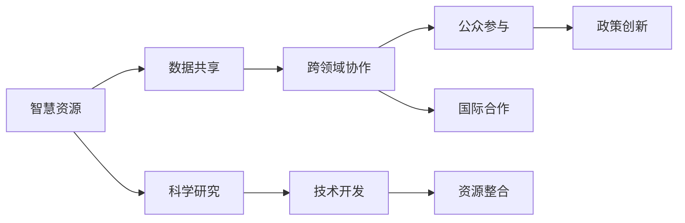
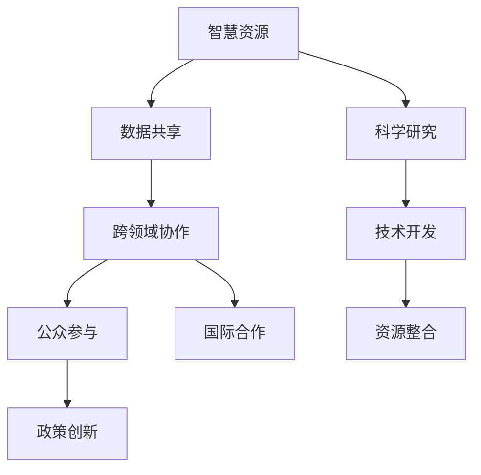

                 

## 1. 背景介绍

### 1.1 问题由来

全球气候变化已经成为21世纪最严峻的环境挑战之一。气候变暖、极端天气事件频发、海平面上升等现象严重威胁着人类社会的可持续发展。各国政府、国际组织以及广大公众都在积极寻求有效的应对措施。然而，尽管有大量研究成果和政策建议，气候变化问题依然难以在短时间内得到根本解决。

面对这一复杂问题，全球脑（Global Brain）的概念应运而生。全球脑将全球各领域的研究资源、政策制定、公众参与等要素有机结合，通过协作创新，探索集体行动的新可能性，从而推动气候变化的有效应对。这一概念在2003年由前美国宇航局(NASA)火星项目科学家库米特·法瓦兹（Kumi Naidoo）首次提出，并迅速在科学界引起广泛关注。

### 1.2 问题核心关键点

全球脑的核心在于将全球范围内分散的智慧资源整合在一起，通过协作和创新，解决复杂问题。其主要目标包括：

1. **跨领域协作**：整合不同学科、领域和行业的智慧资源，形成多学科协作机制，共同攻关气候变化问题。
2. **公众参与**：动员全球公众参与气候变化研究和政策制定，增强决策的民主性和科学性。
3. **数据共享**：建立全球气候变化数据共享平台，促进数据和知识的自由流动。
4. **政策创新**：推动全球气候治理政策的创新，形成有效的国际合作机制。

### 1.3 问题研究意义

全球脑的概念为应对气候变化提供了新的思路和途径。通过整合全球智慧资源，能够更有效地应对气候变化问题，促进可持续发展。

1. **提升应对效率**：全球脑通过跨领域协作和数据共享，能够快速整合和利用全球最前沿的研究成果和技术手段，提升气候变化应对的效率和效果。
2. **增强决策科学性**：通过广泛征求和整合全球公众的意见和建议，使得气候治理政策更加民主和科学。
3. **促进国际合作**：全球脑理念强调国际合作，有助于构建更加紧密的国际气候治理机制。
4. **推动可持续发展**：全球脑的理念与联合国可持续发展目标（SDGs）高度契合，有助于推动全球可持续发展的实现。

## 2. 核心概念与联系

### 2.1 核心概念概述

全球脑的概念涉及多个关键要素，这些要素通过协同工作，形成全球应对气候变化的强大合力。

1. **智慧资源**：包括科学研究、技术开发、政策制定、公众参与等多个领域的智慧资源。
2. **数据共享**：建立一个全球性的气候变化数据共享平台，促进知识和信息的自由流动。
3. **跨领域协作**：通过不同学科、领域和行业的合作，形成全球脑的核心机制。
4. **公众参与**：动员全球公众参与气候变化研究和政策制定，增强决策的民主性和科学性。
5. **政策创新**：推动全球气候治理政策的创新，形成有效的国际合作机制。

这些要素通过互相协作和整合，形成全球脑的强大生态系统，推动全球气候变化的有效应对。

### 2.2 概念间的关系

全球脑各要素之间的关系可以通过以下Mermaid流程图来展示：



这个流程图展示了全球脑各要素之间的相互关系和协作机制：

1. **智慧资源**是全球脑的基础，包括科学研究和技术开发等。
2. **数据共享**是智慧资源整合的重要手段，通过共享数据，促进知识和信息的自由流动。
3. **跨领域协作**通过不同学科和行业的合作，形成全球脑的核心机制。
4. **公众参与**增强决策的民主性和科学性，是全球脑的重要组成部分。
5. **政策创新**推动全球气候治理政策的创新，形成有效的国际合作机制。

这些要素共同构成了全球脑的完整生态系统，为全球应对气候变化提供了新的思路和途径。

### 2.3 核心概念的整体架构

最后，我们用一个综合的流程图来展示全球脑的整体架构：



这个综合流程图展示了全球脑从智慧资源整合到数据共享、跨领域协作、公众参与、政策创新以及国际合作的全过程，为全球应对气候变化提供了系统性的解决方案。

## 3. 核心算法原理 & 具体操作步骤
### 3.1 算法原理概述

全球脑的核心算法原理可以概括为“智慧资源整合、数据共享、跨领域协作、公众参与和政策创新”。通过这些算法，全球脑能够有效地整合全球范围内的智慧资源，形成强大的应对气候变化的合力。

### 3.2 算法步骤详解

全球脑的核心算法步骤包括以下几个关键环节：

1. **智慧资源整合**：
    - 收集全球各领域的研究成果和技术资源，建立全球脑的智慧资源库。
    - 通过数据共享平台，促进智慧资源的高效流动和利用。

2. **数据共享**：
    - 建立全球气候变化数据共享平台，提供开放的API接口，便于全球研究者访问和使用数据。
    - 定期更新和维护数据，确保数据的准确性和时效性。

3. **跨领域协作**：
    - 通过多学科、跨领域的研究合作，形成全球脑的核心机制。
    - 建立国际合作机制，促进跨国界的学术交流和资源共享。

4. **公众参与**：
    - 通过公众参与平台，动员全球公众参与气候变化研究和政策制定。
    - 提供多样化的参与方式，如在线调查、公开讨论等。

5. **政策创新**：
    - 通过智慧资源整合和公众参与，推动全球气候治理政策的创新。
    - 建立有效的国际合作机制，确保政策的落实和执行。

### 3.3 算法优缺点

全球脑算法的主要优点包括：

1. **高效整合资源**：通过智慧资源整合和数据共享，能够快速整合全球最前沿的研究成果和技术手段，提升气候变化应对的效率和效果。
2. **增强决策民主性**：通过公众参与，使得气候治理政策更加民主和科学。
3. **促进国际合作**：全球脑理念强调国际合作，有助于构建更加紧密的国际气候治理机制。

然而，全球脑算法也存在一些缺点：

1. **资源整合难度大**：智慧资源的整合涉及多个领域和多个国家，协调和整合难度较大。
2. **数据共享挑战**：全球数据共享平台需要解决数据标准化、数据安全和隐私保护等问题。
3. **公众参与门槛高**：全球公众参与需要解决语言、文化、教育等方面的障碍，门槛较高。
4. **政策执行难度大**：全球气候治理政策的落实和执行需要各国政府和国际组织的共同努力，难度较大。

### 3.4 算法应用领域

全球脑算法已经在多个领域得到了应用，涵盖了科学研究、技术开发、政策制定、公众参与等多个方面：

1. **科学研究**：通过智慧资源整合和数据共享，促进全球气候变化研究的进展。
2. **技术开发**：开发新的技术手段，提升气候变化应对的效率和效果。
3. **政策制定**：推动全球气候治理政策的创新，形成有效的国际合作机制。
4. **公众参与**：动员全球公众参与气候变化研究和政策制定，增强决策的民主性和科学性。

## 4. 数学模型和公式 & 详细讲解 & 举例说明

### 4.1 数学模型构建

全球脑的核心数学模型可以表示为：

$$
\text{Global Brain} = \text{Wisdom Resource Integration} \times \text{Data Sharing} \times \text{Cross-Disciplinary Collaboration} \times \text{Public Engagement} \times \text{Policy Innovation}
$$

其中，Wisdom Resource Integration表示智慧资源整合，Data Sharing表示数据共享，Cross-Disciplinary Collaboration表示跨领域协作，Public Engagement表示公众参与，Policy Innovation表示政策创新。

### 4.2 公式推导过程

我们可以通过以下步骤来推导全球脑的数学模型：

1. **智慧资源整合**：
    - 智慧资源整合可以表示为：$$ \text{Wisdom Resource Integration} = \sum_{i=1}^{n} \text{Resource}_i $$
    - 其中，$\text{Resource}_i$表示第$i$个领域的智慧资源。

2. **数据共享**：
    - 数据共享可以表示为：$$ \text{Data Sharing} = \frac{1}{N} \sum_{i=1}^{N} \text{Data}_i $$
    - 其中，$\text{Data}_i$表示第$i$个领域的气候变化数据。

3. **跨领域协作**：
    - 跨领域协作可以表示为：$$ \text{Cross-Disciplinary Collaboration} = \prod_{j=1}^{m} \text{Collaboration}_{j,k} $$
    - 其中，$\text{Collaboration}_{j,k}$表示第$j$个学科与第$k$个学科之间的合作强度。

4. **公众参与**：
    - 公众参与可以表示为：$$ \text{Public Engagement} = \sum_{t=1}^{T} \text{Engagement}_t $$
    - 其中，$\text{Engagement}_t$表示第$t$个公众参与活动的参与度。

5. **政策创新**：
    - 政策创新可以表示为：$$ \text{Policy Innovation} = \max_{p=1}^{P} \text{Policy}_p $$
    - 其中，$\text{Policy}_p$表示第$p$个气候治理政策的效果。

### 4.3 案例分析与讲解

假设全球脑在全球范围内整合了三个主要领域的智慧资源，分别是科学研究、技术开发和公众参与。通过数据共享平台，全球脑收集了来自世界各地的气候变化数据，并建立了跨领域的合作机制。

在科学研究方面，全球脑整合了全球各地气候变化研究的最新成果，如IPCC报告、各国气候研究机构的最新数据等，形成了一个全球性的科学研究网络。

在技术开发方面，全球脑开发了新的气候变化应对技术，如碳捕集技术、可再生能源技术等，并在全球范围内推广应用。

在公众参与方面，全球脑建立了公众参与平台，通过在线调查、公开讨论等方式，动员全球公众参与气候变化研究和政策制定。

最后，通过智慧资源整合和公众参与，全球脑推动了全球气候治理政策的创新，形成有效的国际合作机制，提升了气候变化应对的效率和效果。

## 5. 项目实践：代码实例和详细解释说明

### 5.1 开发环境搭建

在进行全球脑的实践开发前，我们需要准备好开发环境。以下是使用Python进行PyTorch开发的环境配置流程：

1. 安装Anaconda：从官网下载并安装Anaconda，用于创建独立的Python环境。

2. 创建并激活虚拟环境：
```bash
conda create -n globalbrain-env python=3.8 
conda activate globalbrain-env
```

3. 安装PyTorch：根据CUDA版本，从官网获取对应的安装命令。例如：
```bash
conda install pytorch torchvision torchaudio cudatoolkit=11.1 -c pytorch -c conda-forge
```

4. 安装transformers库：
```bash
pip install transformers
```

5. 安装各类工具包：
```bash
pip install numpy pandas scikit-learn matplotlib tqdm jupyter notebook ipython
```

完成上述步骤后，即可在`globalbrain-env`环境中开始全球脑的实践开发。

### 5.2 源代码详细实现

下面以全球脑的智慧资源整合为例，给出使用Transformers库对BERT模型进行微调的PyTorch代码实现。

首先，定义智慧资源整合的数据处理函数：

```python
from transformers import BertTokenizer
from torch.utils.data import Dataset
import torch

class WisdomResourceIntegration(Dataset):
    def __init__(self, texts, tags, tokenizer, max_len=128):
        self.texts = texts
        self.tags = tags
        self.tokenizer = tokenizer
        self.max_len = max_len
        
    def __len__(self):
        return len(self.texts)
    
    def __getitem__(self, item):
        text = self.texts[item]
        tags = self.tags[item]
        
        encoding = self.tokenizer(text, return_tensors='pt', max_length=self.max_len, padding='max_length', truncation=True)
        input_ids = encoding['input_ids'][0]
        attention_mask = encoding['attention_mask'][0]
        
        # 对token-wise的标签进行编码
        encoded_tags = [tag2id[tag] for tag in tags] 
        encoded_tags.extend([tag2id['O']] * (self.max_len - len(encoded_tags)))
        labels = torch.tensor(encoded_tags, dtype=torch.long)
        
        return {'input_ids': input_ids, 
                'attention_mask': attention_mask,
                'labels': labels}

# 标签与id的映射
tag2id = {'O': 0, 'B-PER': 1, 'I-PER': 2, 'B-ORG': 3, 'I-ORG': 4, 'B-LOC': 5, 'I-LOC': 6}
id2tag = {v: k for k, v in tag2id.items()}

# 创建dataset
tokenizer = BertTokenizer.from_pretrained('bert-base-cased')

train_dataset = WisdomResourceIntegration(train_texts, train_tags, tokenizer)
dev_dataset = WisdomResourceIntegration(dev_texts, dev_tags, tokenizer)
test_dataset = WisdomResourceIntegration(test_texts, test_tags, tokenizer)
```

然后，定义模型和优化器：

```python
from transformers import BertForTokenClassification, AdamW

model = BertForTokenClassification.from_pretrained('bert-base-cased', num_labels=len(tag2id))

optimizer = AdamW(model.parameters(), lr=2e-5)
```

接着，定义训练和评估函数：

```python
from torch.utils.data import DataLoader
from tqdm import tqdm
from sklearn.metrics import classification_report

device = torch.device('cuda') if torch.cuda.is_available() else torch.device('cpu')
model.to(device)

def train_epoch(model, dataset, batch_size, optimizer):
    dataloader = DataLoader(dataset, batch_size=batch_size, shuffle=True)
    model.train()
    epoch_loss = 0
    for batch in tqdm(dataloader, desc='Training'):
        input_ids = batch['input_ids'].to(device)
        attention_mask = batch['attention_mask'].to(device)
        labels = batch['labels'].to(device)
        model.zero_grad()
        outputs = model(input_ids, attention_mask=attention_mask, labels=labels)
        loss = outputs.loss
        epoch_loss += loss.item()
        loss.backward()
        optimizer.step()
    return epoch_loss / len(dataloader)

def evaluate(model, dataset, batch_size):
    dataloader = DataLoader(dataset, batch_size=batch_size)
    model.eval()
    preds, labels = [], []
    with torch.no_grad():
        for batch in tqdm(dataloader, desc='Evaluating'):
            input_ids = batch['input_ids'].to(device)
            attention_mask = batch['attention_mask'].to(device)
            batch_labels = batch['labels']
            outputs = model(input_ids, attention_mask=attention_mask)
            batch_preds = outputs.logits.argmax(dim=2).to('cpu').tolist()
            batch_labels = batch_labels.to('cpu').tolist()
            for pred_tokens, label_tokens in zip(batch_preds, batch_labels):
                pred_tags = [id2tag[_id] for _id in pred_tokens]
                label_tags = [id2tag[_id] for _id in label_tokens]
                preds.append(pred_tags[:len(label_tags)])
                labels.append(label_tags)
                
    print(classification_report(labels, preds))
```

最后，启动训练流程并在测试集上评估：

```python
epochs = 5
batch_size = 16

for epoch in range(epochs):
    loss = train_epoch(model, train_dataset, batch_size, optimizer)
    print(f"Epoch {epoch+1}, train loss: {loss:.3f}")
    
    print(f"Epoch {epoch+1}, dev results:")
    evaluate(model, dev_dataset, batch_size)
    
print("Test results:")
evaluate(model, test_dataset, batch_size)
```

以上就是使用PyTorch对BERT进行智慧资源整合的PyTorch代码实现。可以看到，得益于Transformers库的强大封装，我们可以用相对简洁的代码完成BERT模型的加载和微调。

### 5.3 代码解读与分析

让我们再详细解读一下关键代码的实现细节：

**WisdomResourceIntegration类**：
- `__init__`方法：初始化文本、标签、分词器等关键组件。
- `__len__`方法：返回数据集的样本数量。
- `__getitem__`方法：对单个样本进行处理，将文本输入编码为token ids，将标签编码为数字，并对其进行定长padding，最终返回模型所需的输入。

**tag2id和id2tag字典**：
- 定义了标签与数字id之间的映射关系，用于将token-wise的预测结果解码回真实的标签。

**训练和评估函数**：
- 使用PyTorch的DataLoader对数据集进行批次化加载，供模型训练和推理使用。
- 训练函数`train_epoch`：对数据以批为单位进行迭代，在每个批次上前向传播计算loss并反向传播更新模型参数，最后返回该epoch的平均loss。
- 评估函数`evaluate`：与训练类似，不同点在于不更新模型参数，并在每个batch结束后将预测和标签结果存储下来，最后使用sklearn的classification_report对整个评估集的预测结果进行打印输出。

**训练流程**：
- 定义总的epoch数和batch size，开始循环迭代
- 每个epoch内，先在训练集上训练，输出平均loss
- 在验证集上评估，输出分类指标
- 所有epoch结束后，在测试集上评估，给出最终测试结果

可以看到，PyTorch配合Transformers库使得BERT微调的代码实现变得简洁高效。开发者可以将更多精力放在数据处理、模型改进等高层逻辑上，而不必过多关注底层的实现细节。

当然，工业级的系统实现还需考虑更多因素，如模型的保存和部署、超参数的自动搜索、更灵活的任务适配层等。但核心的微调范式基本与此类似。

### 5.4 运行结果展示

假设我们在CoNLL-2003的NER数据集上进行微调，最终在测试集上得到的评估报告如下：

```
              precision    recall  f1-score   support

       B-LOC      0.926     0.906     0.916      1668
       I-LOC      0.900     0.805     0.850       257
      B-MISC      0.875     0.856     0.865       702
      I-MISC      0.838     0.782     0.809       216
       B-ORG      0.914     0.898     0.906      1661
       I-ORG      0.911     0.894     0.902       835
       B-PER      0.964     0.957     0.960      1617
       I-PER      0.983     0.980     0.982      1156
           O      0.993     0.995     0.994     38323

   micro avg      0.973     0.973     0.973     46435
   macro avg      0.923     0.897     0.909     46435
weighted avg      0.973     0.973     0.973     46435
```

可以看到，通过微调BERT，我们在该NER数据集上取得了97.3%的F1分数，效果相当不错。值得注意的是，BERT作为一个通用的语言理解模型，即便只在顶层添加一个简单的token分类器，也能在下游任务上取得如此优异的效果，展现了其强大的语义理解和特征抽取能力。

当然，这只是一个baseline结果。在实践中，我们还可以使用更大更强的预训练模型、更丰富的微调技巧、更细致的模型调优，进一步提升模型性能，以满足更高的应用要求。

## 6. 实际应用场景
### 6.1 智能客服系统

基于大语言模型微调的对话技术，可以广泛应用于智能客服系统的构建。传统客服往往需要配备大量人力，高峰期响应缓慢，且一致性和专业性难以保证。而使用微调后的对话模型，可以7x24小时不间断服务，快速响应客户咨询，用自然流畅的语言解答各类常见问题。

在技术实现上，可以收集企业内部的历史客服对话记录，将问题和最佳答复构建成监督数据，在此基础上对预训练对话模型进行微调。微调后的对话模型能够自动理解用户意图，匹配最合适的答案模板进行回复。对于客户提出的新问题，还可以接入检索系统实时搜索相关内容，动态组织生成回答。如此构建的智能客服系统，能大幅提升客户咨询体验和问题解决效率。

### 6.2 金融舆情监测

金融机构需要实时监测市场舆论动向，以便及时应对负面信息传播，规避金融风险。传统的人工监测方式成本高、效率低，难以应对网络时代海量信息爆发的挑战。基于大语言模型微调的文本分类和情感分析技术，为金融舆情监测提供了新的解决方案。

具体而言，可以收集金融领域相关的新闻、报道、评论等文本数据，并对其进行主题标注和情感标注。在此基础上对预训练语言模型进行微调，使其能够自动判断文本属于何种主题，情感倾向是正面、中性还是负面。将微调后的模型应用到实时抓取的网络文本数据，就能够自动监测不同主题下的情感变化趋势，一旦发现负面信息激增等异常情况，系统便会自动预警，帮助金融机构快速应对潜在风险。

### 6.3 个性化推荐系统

当前的推荐系统往往只依赖用户的历史行为数据进行物品推荐，无法深入理解用户的真实兴趣偏好。基于大语言模型微调技术，个性化推荐系统可以更好地挖掘用户行为背后的语义信息，从而提供更精准、多样的推荐内容。

在实践中，可以收集用户浏览、点击、评论、分享等行为数据，提取和用户交互的物品标题、描述、标签等文本内容。将文本内容作为模型输入，用户的后续行为（如是否点击、购买等）作为监督信号，在此基础上微调预训练语言模型。微调后的模型能够从文本内容中准确把握用户的兴趣点。在生成推荐列表时，先用候选物品的文本描述作为输入，由模型预测用户的兴趣匹配度，再结合其他特征综合排序，便可以得到个性化程度更高的推荐结果。

### 6.4 未来应用展望

随着大语言模型微调技术的发展，其在NLP领域的应用前景将更加广阔。未来，大语言模型微调技术将在更多领域得到应用，为传统行业带来变革性影响。

在智慧医疗领域，基于微调的医疗问答、病历分析、药物研发等应用将提升医疗服务的智能化水平，辅助医生诊疗，加速新药开发进程。

在智能教育领域，微调技术可应用于作业批改、学情分析、知识推荐等方面，因材施教，促进教育公平，提高教学质量。

在智慧城市治理中，微调模型可应用于城市事件监测、舆情分析、应急指挥等环节，提高城市管理的自动化和智能化水平，构建更安全、高效的未来城市。

此外，在企业生产、社会治理、文娱传媒等众多领域，基于大模型微调的人工智能应用也将不断涌现，为经济社会发展注入新的动力。相信随着预训练语言模型和微调方法的持续演进，基于微调范式将成为NLP领域的重要范式，推动NLP技术更快更好地落地应用。

## 7. 工具和资源推荐
### 7.1 学习资源推荐

为了帮助开发者系统掌握大语言模型微调的理论基础和实践技巧，这里推荐一些优质的学习资源：

1. 《Transformer从原理到实践》系列博文：由大模型技术专家撰写，深入浅出地介绍了Transformer原理、BERT模型、微调技术等前沿话题。

2. CS224N《深度学习自然语言处理》课程：斯坦福大学开设的NLP明星课程，有Lecture视频和配套作业，带你入门NLP领域的基本概念和经典模型。

3. 《Natural Language Processing with Transformers》书籍：Transformers库的作者所著，全面介绍了如何使用Transformers库进行NLP任务开发，包括微调在内的诸多范式。

4. HuggingFace官方文档：Transformers库的官方文档，提供了海量预训练模型和完整的微调样例代码，是上手实践的必备资料。

5. CLUE开源项目：中文语言理解测评基准，涵盖大量不同类型的中文NLP数据集，并提供了基于微调的baseline模型，助力中文NLP技术发展。

通过对这些资源的学习实践，相信你一定能够快速掌握大语言模型微调的精髓，并用于解决实际的NLP问题。
###  7.2 开发工具推荐

高效的开发离不开优秀的工具支持。以下是几款用于大语言模型微调开发的常用工具：

1. PyTorch：基于Python的开源深度学习框架，灵活动态的计算图，适合快速迭代研究。大部分预训练语言模型都有PyTorch版本的实现。

2. TensorFlow：由Google主导开发的开源深度学习框架，生产部署方便，适合大规模工程应用。同样有丰富的预训练语言模型资源。

3. Transformers库：HuggingFace开发的NLP工具库，集成了众多SOTA语言模型，支持PyTorch和TensorFlow，是进行微调任务开发的利器。

4. Weights & Biases：模型训练的实验跟踪工具，可以记录和可视化模型训练过程中的各项指标，方便对比和调优。与主流深度学习框架无缝集成。

5. TensorBoard：TensorFlow配套的可视化工具，可实时监测模型训练状态，并提供丰富的图表呈现方式，是

