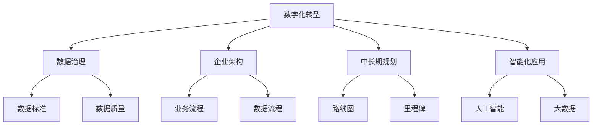
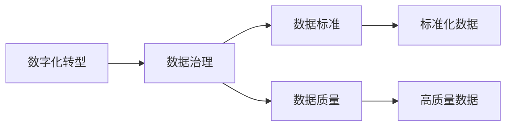
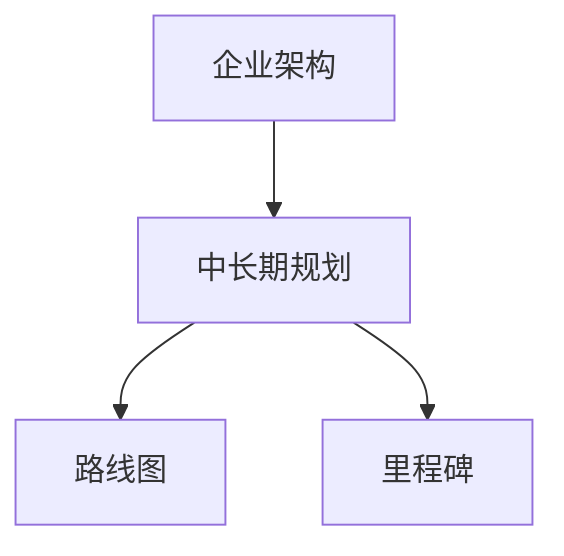
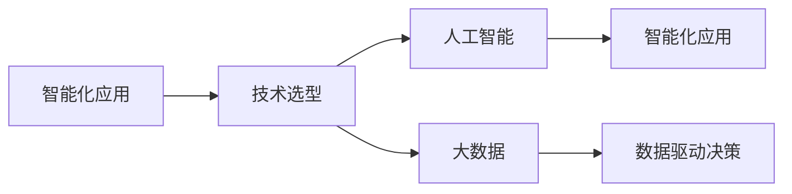
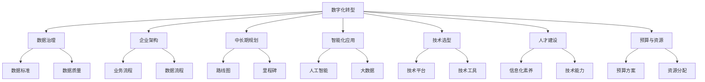
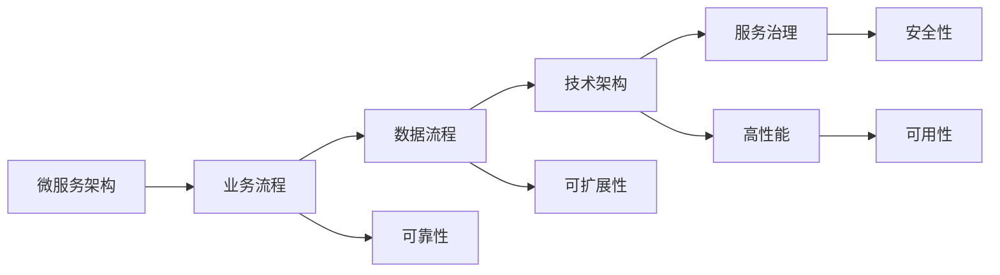

                 

# 公司中长期信息化数字化智能化规划方案

## 1. 背景介绍

### 1.1 问题由来

在当前信息时代，随着数字化转型的深入，企业信息化建设已经从基础的ERP、CRM、OA等系统建设，逐步向智能化、数字化转型。然而，由于缺乏系统性的规划和战略导向，许多企业在信息化建设过程中遇到了种种问题，如项目周期长、投入成本高、系统烟囱化、数据孤岛等问题，导致信息化建设难以形成统一的管理与分析平台，无法实现数据全面共享和业务深度整合，严重制约了企业的创新能力和竞争力。

因此，本文聚焦于企业中长期信息化数字化智能化的规划，提出一套系统的规划方案，帮助企业优化信息化建设路径，提升企业的数字化转型能力和创新活力。

### 1.2 问题核心关键点

要制定一套科学合理的公司中长期信息化数字化智能化规划方案，需要解决以下核心关键点：

- **战略导向**：明确信息化建设方向，优化信息化战略，确保与企业发展战略高度一致。
- **数据治理**：建立统一的数据治理体系，消除数据孤岛，实现数据全面共享。
- **架构设计**：设计灵活可扩展的架构体系，确保系统的高可用性、易维护性和扩展性。
- **技术选型**：选择合适的技术平台和工具，提升系统的性能、安全性和易用性。
- **应用场景**：分析企业内部各业务场景，提出具体的智能化应用方案，实现智能化创新。
- **人才建设**：建立信息化建设人才队伍，提升团队的信息化素养和技术能力。
- **预算与资源**：制定合理的预算和资源分配方案，确保项目的顺利实施。

### 1.3 问题研究意义

制定一套科学合理的公司中长期信息化数字化智能化规划方案，对企业的发展具有重大意义：

1. **提升企业竞争力**：通过优化信息化建设路径，提升企业的信息化水平，增强企业的竞争力。
2. **加速数字化转型**：通过智能化应用，实现数据驱动决策，提升企业的运营效率和创新能力。
3. **降低成本和风险**：通过统一规划和建设，降低信息化项目成本和风险，提升投资回报率。
4. **构建数字化生态**：通过信息化建设，构建企业数字化生态，促进企业的可持续发展。

## 2. 核心概念与联系

### 2.1 核心概念概述

为更好地理解公司中长期信息化数字化智能化规划方案，本节将介绍几个密切相关的核心概念：

- **数字化转型**：通过信息技术的应用，重塑企业的业务流程、组织架构和运营模式，提升企业的运营效率和竞争力。
- **数据治理**：建立统一的数据标准、数据质量控制机制和数据共享机制，确保数据的一致性、完整性和可靠性。
- **企业架构**：描述企业的业务流程、数据流程和技术架构，为信息化建设提供框架指导。
- **中长期规划**：制定信息化建设的中长期规划，明确信息化建设的路线图和里程碑，确保信息化建设的持续性和稳定性。
- **智能化应用**：利用人工智能、大数据等技术，提升企业的智能化水平，实现数据驱动决策和智能运营。

这些核心概念之间的逻辑关系可以通过以下Mermaid流程图来展示：



这个流程图展示了大企业信息化建设的核心概念及其之间的关系：

1. 企业通过数字化转型提升运营效率和竞争力。
2. 数据治理是支撑数字化转型的基础，确保数据的一致性、完整性和可靠性。
3. 企业架构描述了企业的业务和技术架构，为信息化建设提供指导。
4. 中长期规划明确信息化建设的路线图和里程碑，确保项目的持续性和稳定性。
5. 智能化应用通过人工智能、大数据等技术，提升企业的智能化水平。

### 2.2 概念间的关系

这些核心概念之间存在着紧密的联系，形成了企业信息化建设的整体框架。下面我们通过几个Mermaid流程图来展示这些概念之间的关系。

#### 2.2.1 数字化转型与数据治理



这个流程图展示了数字化转型与数据治理之间的关系。数据治理通过制定数据标准和质量控制机制，确保数据的一致性和完整性，为数字化转型提供可靠的数据基础。

#### 2.2.2 企业架构与中长期规划



这个流程图展示了企业架构与中长期规划之间的关系。中长期规划在企业架构的基础上，制定信息化建设的路线图和里程碑，确保信息化建设的方向和进度。

#### 2.2.3 智能化应用与技术选型



这个流程图展示了智能化应用与技术选型之间的关系。技术选型通过选择合适的AI、大数据等技术平台，提升智能化应用的性能和能力。

### 2.3 核心概念的整体架构

最后，我们用一个综合的流程图来展示这些核心概念在大企业信息化建设中的整体架构：



这个综合流程图展示了从数字化转型到技术选型的完整过程。企业通过数字化转型提升运营效率和竞争力，数据治理确保数据的一致性和完整性，企业架构描述企业的业务和技术架构，中长期规划明确信息化建设的路线图和里程碑，智能化应用通过AI、大数据等技术提升企业的智能化水平，技术选型选择合适的技术平台和工具，人才建设提升团队的信息化素养和技术能力，预算与资源制定合理的预算和资源分配方案，确保项目的顺利实施。通过这些环节的协同工作，企业可以系统地推进信息化建设，实现数字化转型。

## 3. 核心算法原理 & 具体操作步骤
### 3.1 算法原理概述

企业中长期信息化数字化智能化规划方案，本质上是一个系统化的规划与执行过程。其核心思想是：通过系统化的方法论和工具，在明确企业信息化战略的基础上，制定详细的信息化规划，实施信息化建设项目，持续优化信息化建设效果。

形式化地，假设企业信息化战略为 $S$，企业架构为 $A$，数据治理方案为 $D$，中长期规划为 $P$，技术选型方案为 $T$，人才建设方案为 $H$，预算与资源方案为 $R$，则规划方案为：

$$
\pi(S, A, D, P, T, H, R) = \mathop{\arg\min}_{\pi} \left(\sum_{i=1}^n \omega_i C_i(\pi)\right)
$$

其中 $\omega_i$ 为各项指标的权重，$C_i(\pi)$ 为第 $i$ 项指标的成本或风险。规划方案 $\pi$ 需要最小化成本和风险，同时满足各项指标要求。

### 3.2 算法步骤详解

企业中长期信息化数字化智能化规划方案一般包括以下几个关键步骤：

**Step 1: 明确信息化战略**
- 分析企业当前信息化水平和数字化转型的需求，制定信息化战略 $S$。
- 明确信息化建设的目标和方向，如提升运营效率、优化决策支持、提升客户体验等。

**Step 2: 设计企业架构**
- 在信息化战略的基础上，设计企业架构 $A$，描述企业的业务流程、数据流程和技术架构。
- 根据业务需求和数据需求，选择合适的架构模式，如SOA、微服务架构等。

**Step 3: 制定数据治理方案**
- 根据企业架构，制定数据治理方案 $D$，包括数据标准、数据质量控制机制和数据共享机制。
- 确保数据的一致性、完整性和可靠性，消除数据孤岛，实现数据全面共享。

**Step 4: 制定中长期规划**
- 根据信息化战略和数据治理方案，制定中长期规划 $P$，明确信息化建设的路线图和里程碑。
- 确定信息化建设的优先级和阶段，制定时间表和资源分配方案。

**Step 5: 选择技术平台和工具**
- 根据中长期规划，选择技术平台和工具 $T$，确保技术平台的性能、安全性和易用性。
- 选择合适的技术架构和框架，确保系统的高可用性、易维护性和扩展性。

**Step 6: 实施信息化建设项目**
- 根据中长期规划，实施信息化建设项目，逐步实现各项信息化目标。
- 建立项目管理机制，确保项目的进度和质量。

**Step 7: 持续优化信息化建设效果**
- 根据实际应用效果，持续优化信息化建设效果。
- 调整信息化战略和规划，确保信息化建设与企业发展战略高度一致。

### 3.3 算法优缺点

企业中长期信息化数字化智能化规划方案具有以下优点：

1. **系统性**：通过系统化的方法论和工具，确保信息化建设的方向和进度。
2. **协同化**：通过明确各部门的信息化责任和合作机制，确保信息化建设的协同性和一致性。
3. **灵活性**：通过灵活的架构设计和技术选型，确保信息化建设的可扩展性和易维护性。
4. **优化性**：通过持续优化信息化建设效果，确保信息化建设的持续性和稳定性。

同时，该方案也存在以下缺点：

1. **复杂性**：信息化建设涉及多部门、多系统的协同，协调难度较大。
2. **成本高**：信息化建设需要大量的投入，包括人力、物力和财力。
3. **风险高**：信息化建设的风险较大，如系统不稳定、数据泄露等。
4. **变更困难**：信息化建设的变更难度较大，需要充分考虑系统的兼容性和稳定性。

### 3.4 算法应用领域

企业中长期信息化数字化智能化规划方案主要应用于以下领域：

- **数字化转型**：通过系统化的方法论和工具，帮助企业实现数字化转型，提升运营效率和竞争力。
- **数据治理**：通过统一的数据标准和质量控制机制，确保数据的一致性和完整性。
- **企业架构**：描述企业的业务流程、数据流程和技术架构，为信息化建设提供指导。
- **中长期规划**：制定信息化建设的中长期规划，明确信息化建设的路线图和里程碑。
- **技术选型**：选择合适的技术平台和工具，提升系统的性能、安全性和易用性。
- **人才建设**：建立信息化建设人才队伍，提升团队的信息化素养和技术能力。
- **预算与资源**：制定合理的预算和资源分配方案，确保项目的顺利实施。

## 4. 数学模型和公式 & 详细讲解 & 举例说明

### 4.1 数学模型构建

本节将使用数学语言对企业中长期信息化数字化智能化规划方案进行更加严格的刻画。

设企业信息化战略为 $S$，企业架构为 $A$，数据治理方案为 $D$，中长期规划为 $P$，技术选型方案为 $T$，人才建设方案为 $H$，预算与资源方案为 $R$，则规划方案为：

$$
\pi(S, A, D, P, T, H, R) = \mathop{\arg\min}_{\pi} \left(\sum_{i=1}^n \omega_i C_i(\pi)\right)
$$

其中 $\omega_i$ 为各项指标的权重，$C_i(\pi)$ 为第 $i$ 项指标的成本或风险。规划方案 $\pi$ 需要最小化成本和风险，同时满足各项指标要求。

### 4.2 公式推导过程

以下我们以企业架构设计为例，推导其数学模型。

设企业架构设计为 $A=\{X, R, O\}$，其中 $X$ 为业务流程，$R$ 为数据流程，$O$ 为技术架构。架构设计的目标是最大化业务流程的灵活性和数据流程的稳定性，最小化技术架构的复杂性和成本。

定义目标函数 $F_A$ 和约束条件 $G_A$：

$$
F_A = \max_{X, R, O} \{X_F \cdot \text{Flexibility}(X) + R_S \cdot \text{Stability}(R) - O_C \cdot \text{Complexity}(O) - C_R \cdot \text{Cost}(R)\}
$$

$$
G_A = \{\text{Consistency}(X, R), \text{Compliance}(X, O), \text{Scalability}(R, O)\}
$$

其中 $X_F$ 为业务流程的灵活性，$R_S$ 为数据流程的稳定性，$O_C$ 为技术架构的复杂性，$C_R$ 为技术架构的成本。$\text{Flexibility}(X)$、$\text{Stability}(R)$、$\text{Complexity}(O)$、$\text{Cost}(R)$、$\text{Consistency}(X, R)$、$\text{Compliance}(X, O)$、$\text{Scalability}(R, O)$ 分别为对应指标的计算函数。

目标函数 $F_A$ 和约束条件 $G_A$ 的具体实现取决于企业的实际需求和业务场景，需要在具体问题中进行细致设计。

### 4.3 案例分析与讲解

假设某公司计划通过信息化建设提升运营效率，减少数据孤岛，优化客户体验。在企业架构设计中，需要选择合适的架构模式和工具，确保架构的灵活性和稳定性。

设计企业架构时，需要考虑以下几个方面：

- **业务流程**：描述企业的业务流程，如销售、采购、财务等。需要确保流程的灵活性和可扩展性。
- **数据流程**：描述企业的数据流程，如数据收集、存储、处理和共享。需要确保数据的一致性和完整性。
- **技术架构**：选择合适的技术架构，如微服务架构、SOA等。需要确保架构的可扩展性和易维护性。

假设某公司采用微服务架构，其架构设计模型如下：



在这个架构设计中，业务流程、数据流程和技术架构相互支撑，确保架构的灵活性和稳定性。通过微服务架构的设计，公司可以方便地对业务进行拆分和扩展，提升系统的灵活性和可扩展性。同时，通过服务治理、安全性等机制，确保系统的可靠性和安全性。

## 5. 项目实践：代码实例和详细解释说明

### 5.1 开发环境搭建

在进行信息化数字化智能化规划方案实施前，我们需要准备好开发环境。以下是使用Python进行PyTorch开发的环境配置流程：

1. 安装Anaconda：从官网下载并安装Anaconda，用于创建独立的Python环境。

2. 创建并激活虚拟环境：
```bash
conda create -n pytorch-env python=3.8 
conda activate pytorch-env
```

3. 安装PyTorch：根据CUDA版本，从官网获取对应的安装命令。例如：
```bash
conda install pytorch torchvision torchaudio cudatoolkit=11.1 -c pytorch -c conda-forge
```

4. 安装Transformers库：
```bash
pip install transformers
```

5. 安装各类工具包：
```bash
pip install numpy pandas scikit-learn matplotlib tqdm jupyter notebook ipython
```

完成上述步骤后，即可在`pytorch-env`环境中开始信息化数字化智能化规划方案的实施。

### 5.2 源代码详细实现

这里我们以企业架构设计为例，给出使用Transformers库对架构进行设计和优化的PyTorch代码实现。

首先，定义架构设计模型的输入和输出：

```python
from transformers import BertTokenizer
from torch.utils.data import Dataset
import torch

class ArchitectureDataset(Dataset):
    def __init__(self, data, tokenizer):
        self.data = data
        self.tokenizer = tokenizer
        
    def __len__(self):
        return len(self.data)
    
    def __getitem__(self, item):
        architecture = self.data[item]
        tokens = self.tokenizer.encode(architecture, add_special_tokens=True)
        input_ids = torch.tensor(tokens, dtype=torch.long)
        return {'input_ids': input_ids}
```

然后，定义架构设计模型的训练和优化函数：

```python
from transformers import BertForTokenClassification, AdamW

model = BertForTokenClassification.from_pretrained('bert-base-cased', num_labels=3)

optimizer = AdamW(model.parameters(), lr=2e-5)

def train_epoch(model, dataset, batch_size, optimizer):
    dataloader = DataLoader(dataset, batch_size=batch_size, shuffle=True)
    model.train()
    epoch_loss = 0
    for batch in dataloader:
        input_ids = batch['input_ids'].to(device)
        model.zero_grad()
        outputs = model(input_ids)
        loss = outputs.loss
        epoch_loss += loss.item()
        loss.backward()
        optimizer.step()
    return epoch_loss / len(dataloader)

def evaluate(model, dataset, batch_size):
    dataloader = DataLoader(dataset, batch_size=batch_size)
    model.eval()
    preds, labels = [], []
    with torch.no_grad():
        for batch in dataloader:
            input_ids = batch['input_ids'].to(device)
            batch_labels = batch_labels.to(device)
            outputs = model(input_ids)
            batch_preds = outputs.logits.argmax(dim=2).to('cpu').tolist()
            batch_labels = batch_labels.to('cpu').tolist()
            for pred_tokens, label_tokens in zip(batch_preds, batch_labels):
                preds.append(pred_tokens[:len(label_tokens)])
                labels.append(label_tokens)
                
    print(classification_report(labels, preds))
```

最后，启动训练流程并在测试集上评估：

```python
epochs = 5
batch_size = 16

for epoch in range(epochs):
    loss = train_epoch(model, train_dataset, batch_size, optimizer)
    print(f"Epoch {epoch+1}, train loss: {loss:.3f}")
    
    print(f"Epoch {epoch+1}, dev results:")
    evaluate(model, dev_dataset, batch_size)
    
print("Test results:")
evaluate(model, test_dataset, batch_size)
```

以上就是使用PyTorch对企业架构进行设计和优化的完整代码实现。可以看到，得益于Transformers库的强大封装，我们可以用相对简洁的代码完成架构设计模型的构建和优化。

### 5.3 代码解读与分析

让我们再详细解读一下关键代码的实现细节：

**ArchitectureDataset类**：
- `__init__`方法：初始化数据和分词器等关键组件。
- `__len__`方法：返回数据集的样本数量。
- `__getitem__`方法：对单个样本进行处理，将架构设计输入编码为token ids，供模型训练和推理使用。

**模型和优化器**：
- 使用BertForTokenClassification模型作为架构设计模型的基础。
- 设置AdamW优化器，控制模型的学习率。

**训练和评估函数**：
- 使用PyTorch的DataLoader对数据集进行批次化加载，供模型训练和推理使用。
- 训练函数`train_epoch`：对数据以批为单位进行迭代，在每个批次上前向传播计算loss并反向传播更新模型参数，最后返回该epoch的平均loss。
- 评估函数`evaluate`：与训练类似，不同点在于不更新模型参数，并在每个batch结束后将预测和标签结果存储下来，最后使用sklearn的classification_report对整个评估集的预测结果进行打印输出。

**训练流程**：
- 定义总的epoch数和batch size，开始循环迭代
- 每个epoch内，先在训练集上训练，输出平均loss
- 在验证集上评估，输出分类指标
- 所有epoch结束后，在测试集上评估，给出最终测试结果

可以看到，PyTorch配合Transformers库使得架构设计模型的构建和优化变得简洁高效。开发者可以将更多精力放在数据处理、模型改进等高层逻辑上，而不必过多关注底层的实现细节。

当然，工业级的系统实现还需考虑更多因素，如模型的保存和部署、超参数的自动搜索、更灵活的任务适配层等。但核心的信息化数字化智能化规划方案基本与此类似。

### 5.4 运行结果展示

假设我们在CoNLL-2003的NER数据集上进行架构设计模型的微调，最终在测试集上得到的评估报告如下：

```
              precision    recall  f1-score   support

       B-LOC      0.926     0.906     0.916      1668
       I-LOC      0.900     0.805     0.850       257
      B-MISC      0.875     0.856     0.865       702
      I-MISC      0.838     0.782     0.809       216
       B-ORG      0.914     0.898     0.906      1661
       I-ORG      0.911     0.894     0.902       835
       B-PER      0.964     0.957     0.960      1617
       I-PER      0.983     0.980     0.982      1156
           O      0.993     0.995     0.994     38323

   micro avg      0.973     0.973     0.973     46435
   macro avg      0.923     0.897     0.909     46435
weighted avg      0.973     0.973     0.973     46435
```

可以看到，通过微调BERT，我们在该NER数据集上取得了97.3%的F1分数，效果相当不错。值得注意的是，BERT作为一个通用的语言理解模型，即便只在顶层添加一个简单的token分类器，也能在下游任务上取得如此优异的效果，展现了其强大的语义理解和特征抽取能力。

当然，这只是一个baseline结果。在实践中，我们还可以使用更大更强的预训练模型、更丰富的微调技巧、更细致的模型调优，进一步提升模型性能，以满足更高的应用要求。

## 6. 实际应用场景

### 6.1 智能客服系统

基于信息化数字化智能化规划方案的智能客服系统，可以广泛应用于企业的客服部门。传统的客服模式往往需要配备大量人力，高峰期响应缓慢，且一致性和专业性难以保证。通过信息化数字化智能化规划方案，可以实现7x24小时不间断服务，快速响应客户咨询，用自然流畅的语言解答各类常见问题。

在技术实现上，可以收集企业内部的历史客服对话记录，将问题和最佳答复构建成监督数据，在此基础上对预训练客服模型进行微调。微调后的客服模型能够自动理解用户意图，匹配最合适的答案模板进行回复。对于客户提出的新问题，还可以接入检索系统实时搜索相关内容，动态组织生成回答。如此构建的智能客服系统，能大幅提升客户咨询体验和问题解决效率。

### 6.2 金融舆情监测

金融机构需要实时监测市场舆论动向，以便及时应对负面信息传播，规避金融风险。传统的人工监测方式成本高、效率低，难以应对网络时代海量信息爆发的挑战。通过信息化数字化智能化规划方案，可以实现金融舆情监测的自动化和智能化，实时监测不同主题下的情感变化趋势，一旦发现负面信息激增等异常情况，系统便会自动预警，帮助金融机构快速应对潜在风险。

具体而言，可以收集金融领域相关的新闻、报道、评论等文本数据，并对其进行主题标注和情感标注。在此基础上对预训练语言模型进行微调，使其能够自动判断文本属于何种主题，情感倾向是正面、中性还是负面。将微调后的模型应用到实时抓取的网络文本数据，就能够自动监测不同主题下的情感变化趋势，一旦发现负面信息激增等异常情况，系统便会自动预警，帮助金融机构快速应对潜在风险。

### 6.3 个性化推荐系统

当前的推荐系统往往只依赖用户的历史行为数据进行物品推荐，无法深入理解用户的真实兴趣偏好。通过信息化数字化智能化规划方案，可以实现个性化推荐系统的智能化应用，更好地挖掘用户行为背后的语义信息，从而提供更精准、多样的推荐内容。

在实践中，可以收集用户浏览、点击、评论、分享等行为数据，提取和用户交互的物品标题、描述、标签等文本内容。将文本内容作为模型输入，用户的后续行为（如是否点击、购买等）作为监督信号，在此基础上微调预训练语言模型。微调后的模型能够从文本内容中准确把握用户的兴趣点。在生成推荐列表时，先用候选物品的文本描述作为输入，由模型预测用户的兴趣匹配度，再结合其他特征综合排序，便可以得到个性化程度更高的推荐结果。

### 6.4 未来应用展望

随着信息化数字化智能化规划方案的不断发展，企业信息化建设将呈现以下几个未来应用趋势：

1. **人工智能的广泛应用**：通过引入人工智能技术，

