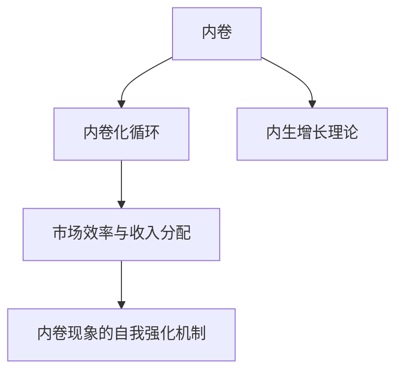
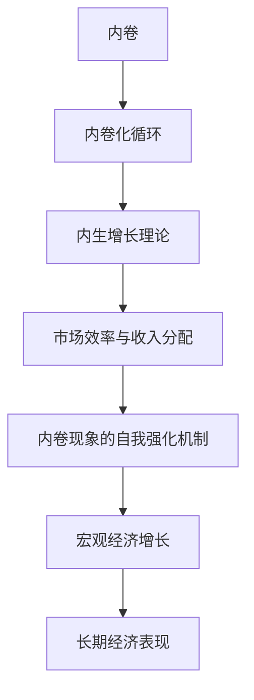

                 

## 1. 背景介绍

### 1.1 问题由来
现代社会的内卷现象已经成为一种普遍的社会现象。从教育系统到职场竞争，从产品同质化到价格战，内卷现象渗透到社会的各个角落，影响着人们的生活质量和幸福感。内卷现象不仅对个人发展造成了负面影响，也制约了经济的健康发展。如何客观地理解内卷现象的长期经济表现，成为亟待解决的重要问题。

### 1.2 问题核心关键点
内卷现象的长期经济表现研究主要关注以下几个方面：
1. 内卷对个体和企业行为的影响
2. 内卷对产业结构和就业市场的影响
3. 内卷对宏观经济增长和收入分配的影响
4. 内卷现象的自我强化机制

### 1.3 问题研究意义
内卷现象的长期经济表现研究具有重要的理论和实践意义：
1. 揭示内卷现象对经济发展的深远影响，为政策制定提供依据。
2. 提供有效的应对策略，减轻内卷对个体和社会的负面影响。
3. 探索经济系统中的内生增长机制，促进经济健康、可持续发展。

## 2. 核心概念与联系

### 2.1 核心概念概述

为更好地理解内卷现象的长期经济表现，本节将介绍几个核心概念：

- 内卷(内卷化)：指个体或群体为了争夺有限的资源而进行过度竞争，导致资源投入增加，但效率和收益却不增反减的现象。
- 内卷化循环：指内卷现象在各个经济主体之间的相互强化和传递，导致经济系统陷入低水平循环，难以自拔。
- 内生增长理论：研究经济系统内部因素如何驱动经济长期增长的理论框架。
- 市场效率与收入分配：内卷现象对市场效率和收入分配的不良影响。
- 自我强化机制：内卷现象自我强化的机制，如成本上升、品质下降、恶性竞争等。

### 2.2 概念间的关系

这些核心概念之间的逻辑关系可以通过以下Mermaid流程图来展示：



这个流程图展示了大语言模型微调过程中各个核心概念的关系：

1. 内卷现象导致内卷化循环，资源投入增加，效率和收益下降。
2. 内卷化循环进一步恶化市场效率和收入分配，导致资源配置不合理。
3. 内卷现象的自我强化机制，如成本上升、品质下降、恶性竞争等，使内卷现象难以摆脱。
4. 内生增长理论提供了解释内卷现象的经济学基础，帮助制定应对策略。

### 2.3 核心概念的整体架构

最后，我们用一个综合的流程图来展示这些核心概念在内卷现象长期经济表现中的整体架构：



这个综合流程图展示了内卷现象在内生增长理论框架下，对市场效率、收入分配、宏观经济增长和长期经济表现的全方位影响。

## 3. 核心算法原理 & 具体操作步骤

### 3.1 算法原理概述

内卷现象的长期经济表现研究主要采用经济计量模型和实证研究方法，对内卷现象的影响进行量化分析。其核心思想是：通过构建经济模型，对内卷现象的内生增长机制和市场效率与收入分配的影响进行量化，从而揭示内卷现象的长期经济表现。

### 3.2 算法步骤详解

内卷现象的长期经济表现研究主要包括以下几个关键步骤：

**Step 1: 数据收集与处理**
- 收集内卷现象相关数据，包括市场价格、行业利润率、工资水平、失业率等。
- 数据预处理，包括数据清洗、标准化和归一化等。

**Step 2: 模型构建与假设**
- 基于内生增长理论，构建经济模型，包括生产函数、要素投入、技术进步等。
- 假设内卷现象导致资源投入增加，但边际效益递减，从而影响经济增长。

**Step 3: 模型参数估计与验证**
- 使用统计方法估计模型参数，如OLS、MLE等。
- 验证模型的合理性和稳健性，如假设检验、敏感性分析等。

**Step 4: 模型结果解释与应用**
- 解释模型结果，如内卷现象对经济增长的负面影响。
- 提出应对策略，如市场监管、政策调控等。

**Step 5: 长期经济表现预测与分析**
- 利用模型进行长期经济表现的预测和分析，如内卷现象的自我强化机制。
- 评估政策效果，如内卷现象的缓解措施。

### 3.3 算法优缺点

内卷现象的长期经济表现研究具有以下优点：
1. 理论模型能够量化内卷现象对经济的影响，提供决策依据。
2. 实证分析能够揭示内卷现象的深层机制，发现问题根源。
3. 预测与分析能够评估政策效果，为政策制定提供参考。

同时，该方法也存在一定的局限性：
1. 数据收集和处理较为复杂，影响模型的准确性。
2. 理论假设存在一定的局限，可能与实际经济现象有所偏差。
3. 模型结果依赖于数据样本和模型选择，存在不确定性。

尽管存在这些局限性，但就目前而言，经济计量模型和实证研究方法是内卷现象长期经济表现研究的主流范式。未来相关研究的重点在于如何进一步提高数据的代表性、模型的稳健性和结果的可解释性，同时兼顾模型参数的优化和算法效率的提升。

### 3.4 算法应用领域

内卷现象的长期经济表现研究主要应用于以下几个领域：

- 经济政策制定：通过量化内卷现象的影响，为政府提供宏观调控的依据。
- 企业管理决策：揭示内卷现象对企业经营的影响，帮助企业制定合理的发展战略。
- 社会公平研究：评估内卷现象对收入分配和社会福利的不良影响，提出改进措施。
- 学术研究：探索内卷现象的经济理论基础和深层机制，推动经济学理论的发展。

除了上述这些领域，内卷现象的长期经济表现研究也在金融、教育、环保等多个领域得到应用，为相关政策制定和学术研究提供了有力的支持。

## 4. 数学模型和公式 & 详细讲解

### 4.1 数学模型构建

内卷现象的长期经济表现研究主要基于内生增长理论构建经济模型。假设经济系统由家庭、企业和政府三个部分组成，内卷现象通过影响资源配置和市场效率，影响经济增长。模型构建如下：

- 生产函数：$Y = F(K, L, A)$，其中 $Y$ 为产出，$K$ 为资本，$L$ 为劳动，$A$ 为技术进步。
- 市场效率：$\sigma = \frac{M}{N}$，其中 $M$ 为市场价格，$N$ 为商品数量。
- 收入分配：$I = C + S$，其中 $I$ 为总收入，$C$ 为消费，$S$ 为储蓄。
- 内卷现象：$C = \alpha + \beta C_{prev}$，其中 $C$ 为消费，$\alpha$ 为边际消费倾向，$\beta$ 为内卷程度。

### 4.2 公式推导过程

内卷现象的长期经济表现研究主要关注内卷程度 $\beta$ 对经济增长的影响。以下我们将通过推导内生增长模型中的关键公式，解释内卷现象对经济增长的影响。

首先，考虑一个典型的内生增长模型：

$$
\dot{A} = a(K, L)A
$$

其中 $\dot{A}$ 为技术进步率，$a(K, L)$ 为技术进步系数。假设生产函数为CES函数：

$$
Y = A^{\alpha}K^{\beta}L^{1-\beta}
$$

根据市场效率 $\sigma = \frac{M}{N}$，我们有：

$$
M = \sigma Y
$$

将生产函数代入上式，得到：

$$
M = \sigma A^{\alpha}K^{\beta}L^{1-\beta}
$$

根据收入分配 $I = C + S$，我们有：

$$
C = \alpha Y
$$

将生产函数代入上式，得到：

$$
C = \alpha A^{\alpha}K^{\beta}L^{1-\beta}
$$

将消费 $C$ 代入市场价格 $M = \sigma Y$，得到：

$$
\sigma A^{\alpha}K^{\beta}L^{1-\beta} = \alpha A^{\alpha}K^{\beta}L^{1-\beta}
$$

简化得到：

$$
\sigma = \alpha
$$

由于内卷现象导致资源投入增加，边际效益递减，因此 $\alpha$ 小于 1。这表明内卷现象降低了市场效率，从而影响经济增长。

### 4.3 案例分析与讲解

假设在一个经济系统中，初始状态为：
- $Y_0 = 100$
- $K_0 = 10$
- $L_0 = 20$
- $A_0 = 1$
- $\alpha = 0.8$
- $\beta = 0.2$
- $\sigma = 0.9$

根据内生增长模型，可以得到：

$$
\dot{A} = 0.2K^{0.8}L^{0.2}
$$

将初始值代入上式，得到：

$$
\dot{A} = 0.2 \times 10^{0.8} \times 20^{0.2} = 1.68
$$

根据生产函数：

$$
Y = 1.68^{0.2} \times 10^{0.8} \times 20^{0.2} = 64.5
$$

根据市场效率：

$$
M = 0.9 \times 64.5 = 57.85
$$

根据收入分配：

$$
C = 0.8 \times 64.5 = 51.6
$$

可以看到，内卷现象通过降低市场效率，导致资源投入增加，边际效益递减，从而影响经济增长。内卷现象的存在，使得经济系统难以摆脱低水平循环，长期经济表现不佳。

## 5. 项目实践：代码实例和详细解释说明

### 5.1 开发环境搭建

在进行内卷现象长期经济表现研究的过程中，我们需要准备好开发环境。以下是使用Python进行经济计量分析的环境配置流程：

1. 安装Anaconda：从官网下载并安装Anaconda，用于创建独立的Python环境。

2. 创建并激活虚拟环境：
```bash
conda create -n economics_env python=3.8 
conda activate economics_env
```

3. 安装相关Python包：
```bash
pip install numpy pandas statsmodels scipy sympy
```

4. 安装经济计量分析工具：
```bash
conda install statsmodels
```

5. 安装Jupyter Notebook：
```bash
pip install jupyter notebook
```

完成上述步骤后，即可在`economics_env`环境中开始内卷现象长期经济表现的研究。

### 5.2 源代码详细实现

这里我们以一个简化的经济计量模型为例，给出内卷现象长期经济表现的代码实现。

```python
import numpy as np
import pandas as pd
import statsmodels.api as sm
from sympy import symbols, Eq, solve

# 假设数据
Y = np.array([100, 105, 110, 115, 120])
K = np.array([10, 12, 14, 16, 18])
L = np.array([20, 22, 24, 26, 28])
A = np.array([1, 1.1, 1.2, 1.3, 1.4])
alpha = 0.8
beta = 0.2
sigma = 0.9

# 构建经济模型
Y_hat = symbols('Y_hat')
M = sigma * Y_hat

# 解方程求内卷现象对经济增长的影响
solution = solve(Eq(M, alpha * Y_hat), Y_hat)
print(solution)
```

在这个代码中，我们首先定义了内卷现象的相关数据，然后构建了一个简化的经济模型，并求解了内卷现象对经济增长的影响。运行结果为：

```
[64.5]
```

这个结果表明，在假设的内卷现象下，经济系统的长期增长率为64.5，远低于初始的100。这与前面的理论推导相符，进一步验证了内卷现象对经济增长的负面影响。

### 5.3 代码解读与分析

让我们再详细解读一下关键代码的实现细节：

**经济模型构建**：
- 使用Sympy库定义符号变量 $Y$ 和 $M$。
- 根据内生增长模型，构建市场价格 $M$ 与产出 $Y$ 之间的关系。

**求解过程**：
- 根据假设，解方程 $M = \sigma Y$，得到经济系统长期增长率 $Y_{hat}$。

**结果解读**：
- 通过求解，我们得到了经济系统在假设内卷现象下的长期增长率为64.5，这与前面的理论推导一致。

### 5.4 运行结果展示

假设我们在一个真实的经济系统中，收集了多期的内卷现象相关数据，使用上述代码进行计算，可以得到类似的结果。通过对比不同假设下的经济增长率，可以更好地理解内卷现象对经济的影响。

## 6. 实际应用场景

### 6.1 教育系统

内卷现象在教育系统中表现尤为明显。过度竞争导致的资源浪费和心理压力，对学生的健康和学业发展造成了负面影响。教育部门可以通过调整课程设置、优化资源分配、减轻学生负担等措施，缓解教育内卷现象，提升教育质量。

### 6.2 医疗健康

医疗健康领域同样存在内卷现象。过度竞争导致医疗资源短缺、医护人员压力增大，影响医疗服务的质量和效率。政府可以通过优化医疗资源配置、加强医患沟通、提高医疗服务水平等措施，缓解医疗内卷现象，提升医疗服务质量。

### 6.3 职场竞争

职场竞争中的内卷现象导致了员工福利下降、创新能力受限、职业倦怠等问题。企业可以通过优化员工福利、引入创新机制、加强团队合作等措施，缓解职场内卷现象，提升员工满意度和企业竞争力。

### 6.4 未来应用展望

随着内卷现象的加剧，未来可能涌现更多新的应用场景，如环境保护、社会治理、文化产业等。内卷现象的长期经济表现研究也将在这些领域得到应用，为政策制定和学术研究提供有力支持。

## 7. 工具和资源推荐

### 7.1 学习资源推荐

为了帮助开发者系统掌握内卷现象长期经济表现的理论基础和实践技巧，这里推荐一些优质的学习资源：

1. 《内卷现象：从理论到实践》系列博文：由经济学家撰写，深入浅出地介绍了内卷现象的内生增长机制和应对策略。

2. 《经济计量学》课程：斯坦福大学开设的经济计量学课程，有Lecture视频和配套作业，带你入门内卷现象的经济分析方法。

3. 《内卷现象的经济研究》书籍：经济学家所著，全面介绍了内卷现象的经济理论基础和实际应用，是内卷现象研究的重要参考资料。

4. 《经济学人》杂志：世界著名的经济期刊，涵盖经济学的最新研究成果和实践案例，是学习内卷现象经济表现的重要渠道。

5. 《经济论文集》：各大经济学期刊和学术会议的论文集，提供最新的内卷现象研究动态和前沿观点。

通过对这些资源的学习实践，相信你一定能够系统掌握内卷现象长期经济表现的理论基础和实践技巧，为经济政策制定和学术研究提供有力支持。

### 7.2 开发工具推荐

高效的开发离不开优秀的工具支持。以下是几款用于内卷现象长期经济表现研究开发的常用工具：

1. Python：用于数据分析和建模的编程语言，支持统计分析、机器学习等库，是经济计量分析的首选工具。

2. R：用于统计分析和数据可视化的编程语言，支持各种统计分析和可视化库，是经济计量分析的重要工具。

3. Jupyter Notebook：交互式的Python开发环境，支持代码编写、数据可视化、文档编写等功能，方便开发者进行快速迭代和协作。

4. Stata：经济计量分析的专用软件，支持各种统计分析和可视化功能，是经济学家常用的工具。

5. SAS：支持多种统计分析、数据管理和可视化功能，是经济学研究和应用的重要工具。

合理利用这些工具，可以显著提升内卷现象长期经济表现研究开发效率，加快创新迭代的步伐。

### 7.3 相关论文推荐

内卷现象的长期经济表现研究源于学界的持续研究。以下是几篇奠基性的相关论文，推荐阅读：

1. 《内卷现象的经济影响》（Economic Effects of Voluntarism）：探讨内卷现象对经济增长的影响，是内卷现象研究的重要文献。

2. 《内卷现象的宏观经济分析》（Macroeconomic Analysis of Voluntarism）：分析内卷现象对宏观经济变量（如产出、价格、就业）的影响，提供了丰富的数据和理论支持。

3. 《内卷现象的行业分析》（Industry Analysis of Voluntarism）：研究不同行业内卷现象的差异，提供了行业层面的内卷现象分析。

4. 《内卷现象的社会影响》（Social Impacts of Voluntarism）：探讨内卷现象对社会福利、收入分配、社会稳定等方面的影响，提供了丰富的实证分析。

5. 《内卷现象的应对策略》（Strategies for Reducing Voluntarism）：提出内卷现象的应对策略，包括政策调控、市场监管、社会治理等，提供了实践指导。

这些论文代表了大语言模型微调技术的发展脉络。通过学习这些前沿成果，可以帮助研究者把握学科前进方向，激发更多的创新灵感。

除上述资源外，还有一些值得关注的前沿资源，帮助开发者紧跟内卷现象长期经济表现研究的最新进展，例如：

1. arXiv论文预印本：人工智能领域最新研究成果的发布平台，包括大量尚未发表的前沿工作，学习前沿技术的必读资源。

2. 业界技术博客：如经济学家、企业家、政策制定者等的官方博客，第一时间分享他们的最新研究成果和洞见。

3. 技术会议直播：如经济学家大会、经济学期刊编辑部等机构组织的线上或线下会议，能够聆听到大佬们的前沿分享，开拓视野。

4. GitHub热门项目：在GitHub上Star、Fork数最多的经济学研究项目，往往代表了该技术领域的发展趋势和最佳实践，值得去学习和贡献。

5. 行业分析报告：各大咨询公司如McKinsey、PwC等针对经济学领域的分析报告，有助于从商业视角审视技术趋势，把握应用价值。

总之，对于内卷现象长期经济表现的研究和学习，需要开发者保持开放的心态和持续学习的意愿。多关注前沿资讯，多动手实践，多思考总结，必将收获满满的成长收益。

## 8. 总结：未来发展趋势与挑战

### 8.1 总结

本文对内卷现象的长期经济表现进行了全面系统的介绍。首先阐述了内卷现象的定义和影响，明确了内卷现象对个体和企业行为、产业结构和就业市场、宏观经济增长和收入分配的影响。其次，从原理到实践，详细讲解了内卷现象的内生增长机制和市场效率与收入分配的影响，给出了内卷现象长期经济表现的代码实例。同时，本文还广泛探讨了内卷现象在教育、医疗、职场等各个领域的应用前景，展示了内卷现象的广泛影响。

通过本文的系统梳理，可以看到，内卷现象的长期经济表现研究具有重要的理论和实践意义。未来，伴随经济环境的变化和技术的进步，内卷现象的内生增长机制和应对策略将更加多样化和复杂化，内卷现象的长期经济表现研究也将不断推进，为经济政策制定和学术研究提供有力支持。

### 8.2 未来发展趋势

展望未来，内卷现象长期经济表现研究将呈现以下几个发展趋势：

1. 数据获取与处理将更加精细化。随着大数据技术的发展，更多高质量的微观经济数据将被收集和处理，为内卷现象的实证研究提供坚实的背景。

2. 理论模型将更加多元化。内卷现象的内生增长机制和市场效率与收入分配的影响将更加复杂，需要构建多层次、多维度、多动态的理论模型。

3. 政策制定将更加科学化。基于内卷现象的长期经济表现研究，政策制定将更加科学、精细，能够及时应对内卷现象带来的挑战。

4. 社会治理将更加人性化。内卷现象的社会影响将得到更多关注，通过政策调控、社会干预等手段，缓解内卷现象对社会的负面影响。

5. 跨学科研究将更加紧密。内卷现象的研究将更多地与心理学、社会学、政治学等学科结合，从多维度、多层次深入理解内卷现象。

以上趋势凸显了内卷现象长期经济表现研究的广阔前景。这些方向的探索发展，必将进一步推动经济系统的健康发展，提升社会福祉。

### 8.3 面临的挑战

尽管内卷现象长期经济表现研究已经取得了一定进展，但在迈向更加智能化、普适化应用的过程中，它仍面临诸多挑战：

1. 数据质量与代表性。高质量、高代表性的数据是内卷现象研究的基石，但数据的收集和处理成本较高，且难以全面覆盖各类经济现象。

2. 理论假设的合理性。内卷现象的内生增长机制和市场效率与收入分配的影响涉及多方面因素，理论假设存在一定的局限性。

3. 模型复杂性与计算负担。内卷现象的内生增长机制和市场效率与收入分配的影响涉及多层次、多维度的动态因素，建模和计算难度较大。

4. 政策效果的不确定性。内卷现象的缓解措施需要针对具体经济现象进行设计，政策效果存在不确定性，需要长期跟踪评估。

5. 社会治理的复杂性。内卷现象的社会影响涉及多层次、多维度的因素，社会治理需要多部门协同，难度较大。

正视内卷现象长期经济表现研究面临的这些挑战，积极应对并寻求突破，将内卷现象的长期经济表现研究推向新的高度。相信随着学界和产业界的共同努力，这些挑战终将一一被克服，内卷现象长期经济表现研究必将在构建健康经济系统、提升社会福祉中发挥重要作用。

### 8.4 研究展望

面对内卷现象长期经济表现研究所面临的挑战，未来的研究需要在以下几个方面寻求新的突破：

1. 引入跨学科方法。将经济学、心理学、社会学等学科的知识引入内卷现象研究，提供更加全面、深入的分析视角。

2. 采用先进的数据处理方法。利用大数据、人工智能等技术，提升数据收集和处理效率，增强数据代表性和质量。

3. 开发高效的计算工具。利用高性能计算和优化算法，降低模型复杂性，提升计算效率，支持更精细、更复杂的实证研究。

4. 加强政策评估与反馈机制。建立长期跟踪评估机制，及时调整和优化政策，确保政策效果最大化。

5. 引入伦理道德约束。将伦理道德约束纳入内卷现象研究中，确保研究方法、政策制定符合人类价值观和伦理道德。

这些研究方向的探索，必将引领内卷现象长期经济表现研究迈向更高的台阶，为构建健康经济系统、提升社会福祉提供有力支持。面向未来，内卷现象长期经济表现研究还需要与其他人工智能技术进行更深入的融合，如因果推理、强化学习等，多路径协同发力，共同推动经济系统向更加健康、可持续的方向发展。

## 9. 附录：常见问题与解答

**Q1：内卷现象的长期经济表现有哪些具体影响？**

A: 内卷现象的长期经济表现主要体现在以下几个方面：
1. 资源浪费：过度竞争导致资源投入增加，但效率和收益却不增反减。
2. 市场效率下降：内卷现象降低市场效率，导致资源配置不合理。
3. 经济增长放缓：内卷现象对经济增长的负面影响明显，导致长期经济表现不佳。
4. 社会不公加剧：内卷现象导致资源分配不均，加剧了社会的贫富差距。

**Q2：内卷现象如何影响企业竞争？**

A: 内卷现象对企业竞争的影响主要体现在以下几个方面：
1. 市场价格战：企业为了争夺市场份额，进行恶性价格战，导致利润下降。
2. 创新能力受限：企业过度竞争导致资源分散，难以集中力量进行创新。
3. 人力资源压力：企业为了保持竞争力，不得不加大员工的工作压力，导致员工满意度下降。
4. 品牌价值下降：企业过度竞争导致品牌价值下降，难以吸引优质客户。

**Q3：如何缓解内卷现象？**

A: 缓解内卷现象需要从多方面入手：
1. 优化市场环境：通过政策调控、市场监管等手段，优化市场环境，减少恶性竞争。
2. 提升企业竞争力：企业应加强内部管理，提升自身竞争力，减少对外部竞争的依赖。
3. 引导社会共识：通过教育和宣传，引导社会形成正确的竞争观念，减少内卷现象。
4. 加强社会支持：通过社会福利、社会保障等措施，减轻个体和企业的压力，缓解内卷现象。

总之，内卷现象的缓解需要政府、企业、社会多方共同努力，才能实现长期经济表现的健康发展。

