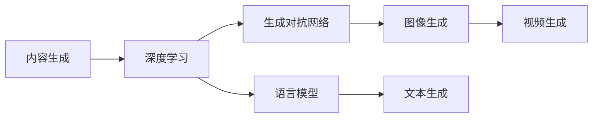
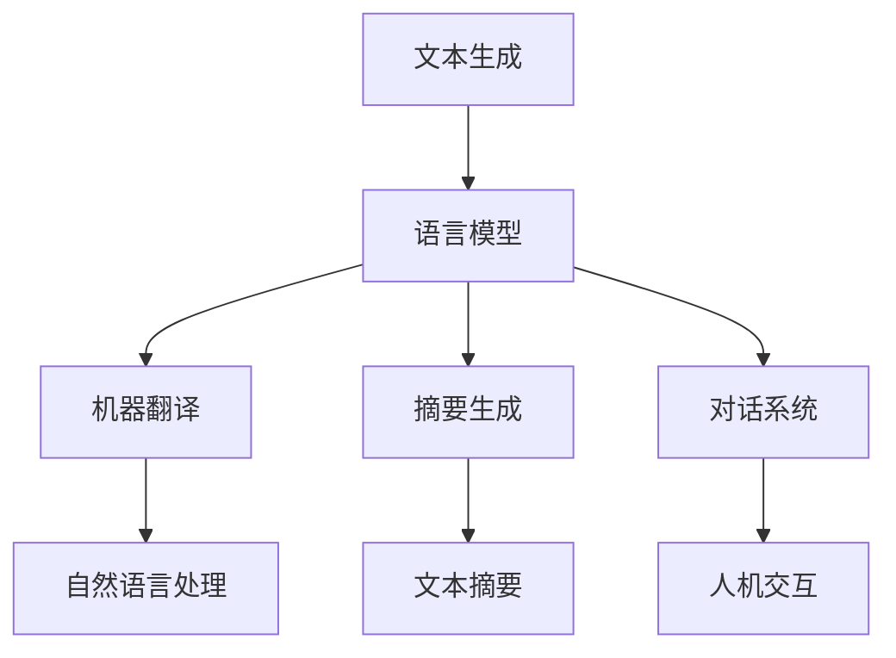
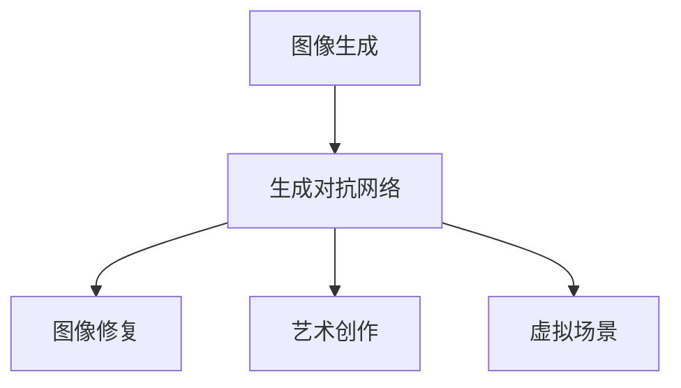
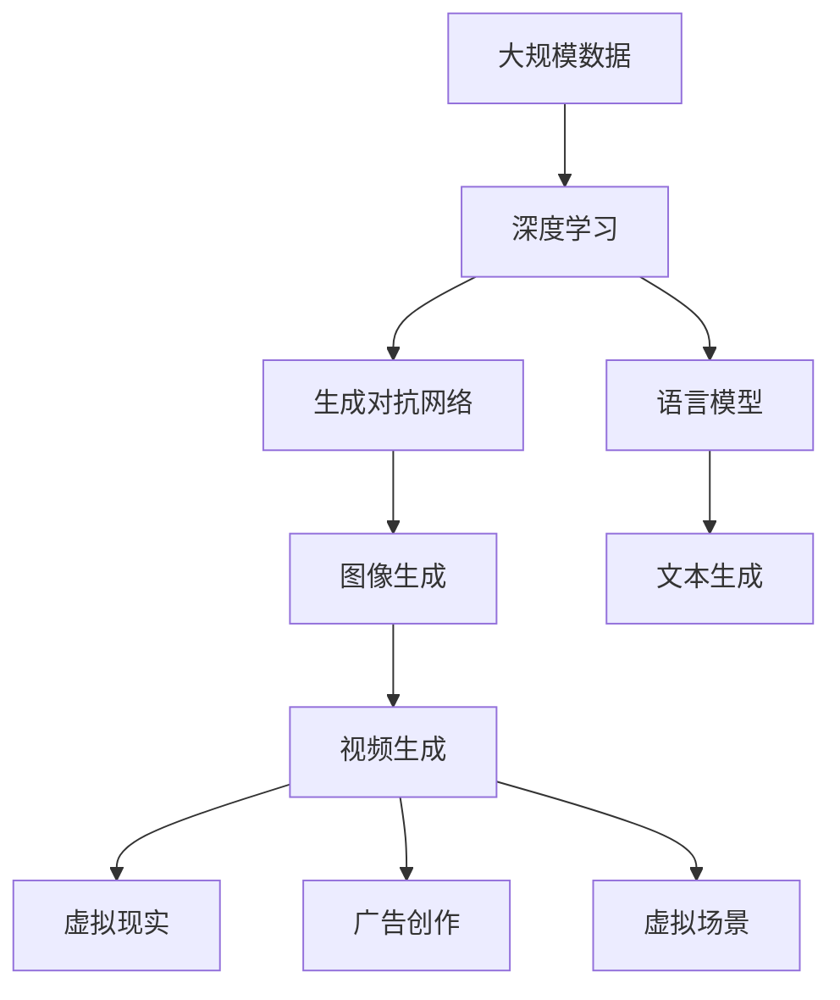

                 

# 内容生成(Content Generation) - 原理与代码实例讲解

> 关键词：内容生成, 深度学习, 生成对抗网络, 语言模型, 代码实例, 自然语言处理

## 1. 背景介绍

### 1.1 问题由来
内容生成是人工智能领域的一个重要研究方向，其目的是通过训练模型，使其能够根据给定的输入生成新的、有意义的内容。近年来，随着深度学习技术的快速发展，基于深度学习的内容生成技术取得了显著的进展。其中，生成对抗网络（Generative Adversarial Networks, GANs）和语言模型（Language Models）是两种较为常用的技术。

生成对抗网络由Isola et al.在2015年提出，通过两个神经网络（生成器和判别器）进行对抗训练，生成高质量的图像、音频、文本等内容。而语言模型则由Bengio et al.在2003年提出，通过建模文本序列的概率分布，生成连贯的文本内容。这两种技术在内容生成领域都具有重要应用，并在许多实际应用场景中取得了显著效果。

### 1.2 问题核心关键点
内容生成技术在实际应用中，可以涵盖多种场景，包括自然语言处理（Natural Language Processing, NLP）中的机器翻译、摘要生成、文本生成等，以及图像处理中的图像生成、视频生成等。其主要关键点包括：

- 数据的收集与预处理：内容生成模型的训练需要大量高质量的数据，数据的收集和预处理是模型训练的前提。
- 模型的设计：选择适当的模型架构和训练策略，是生成高质量内容的关键。
- 损失函数的设计：损失函数的设计直接影响模型的训练效果，需要根据生成内容的质量和多样性进行优化。
- 训练过程中的超参数调优：包括学习率、批量大小等超参数的设置，对模型的训练效果有重要影响。
- 后处理与优化：生成的内容需要经过后处理和优化，以保证其质量和适用性。

### 1.3 问题研究意义
内容生成技术在实际应用中具有广泛的价值，包括：

- 提高生产效率：自动生成报告、新闻、广告等文本内容，可以减少人工创作的工作量。
- 创造新的内容：生成音乐、艺术作品、文学作品等内容，为文化产业带来新的创意。
- 促进人机交互：生成对话内容、智能助手等，提升人机交互的自然性和智能化水平。
- 增强决策支持：生成决策报告、市场分析等，为决策者提供更全面、精准的信息。
- 提高数据可用性：生成缺失的数据、注释、标签等，增强数据的完整性和可用性。

## 2. 核心概念与联系

### 2.1 核心概念概述

为更好地理解内容生成技术，本节将介绍几个密切相关的核心概念：

- 生成对抗网络（GANs）：由Isola et al.在2015年提出，通过生成器和判别器两个网络进行对抗训练，生成高质量的内容。
- 语言模型（Language Models）：由Bengio et al.在2003年提出，通过建模文本序列的概率分布，生成连贯的文本内容。
- 文本生成（Text Generation）：利用语言模型或GANs生成新的文本内容，应用于机器翻译、摘要生成、对话系统等。
- 图像生成（Image Generation）：利用GANs生成高质量的图像内容，应用于图像修复、艺术创作、虚拟现实等。
- 视频生成（Video Generation）：结合GANs和深度学习技术，生成高质量的视频内容，应用于电影制作、广告创作、虚拟场景等。

这些核心概念之间的逻辑关系可以通过以下Mermaid流程图来展示：

```mermaid
graph TB
    A[生成对抗网络(GANs)] --> B[图像生成]
    A --> C[文本生成]
    C --> D[对话系统]
    A --> E[视频生成]
    B --> F[图像修复]
    C --> G[摘要生成]
    E --> H[虚拟现实]
    F --> I[艺术创作]
    G --> J[机器翻译]
    H --> K[广告创作]
    I --> L[虚拟场景]
```

这个流程图展示了大模型和生成技术之间的逻辑关系：

1. 生成对抗网络可以生成高质量的图像、视频等内容。
2. 语言模型可以生成连贯的文本内容，应用于文本生成、对话系统等。
3. 文本生成可以生成自然语言文本，应用于机器翻译、摘要生成等。
4. 图像生成可以生成高质量的图像，应用于图像修复、艺术创作等。
5. 视频生成可以生成高质量的视频，应用于虚拟现实、广告创作等。

### 2.2 概念间的关系

这些核心概念之间存在着紧密的联系，形成了内容生成技术的完整生态系统。下面我们通过几个Mermaid流程图来展示这些概念之间的关系。

#### 2.2.1 内容生成的主流范式



这个流程图展示了内容生成的主流范式：

1. 内容生成技术主要采用深度学习的方法。
2. 生成对抗网络是其中的重要组成部分，可以生成高质量的图像、视频等。
3. 语言模型也是其中重要的一部分，可以生成连贯的文本内容。

#### 2.2.2 文本生成与语言模型的关系



这个流程图展示了文本生成与语言模型的关系：

1. 文本生成可以采用语言模型作为基础，生成连贯的文本内容。
2. 语言模型可以应用于机器翻译、摘要生成、对话系统等自然语言处理任务。
3. 文本生成可以用于人机交互，提升对话系统的自然性和智能化水平。

#### 2.2.3 图像生成与生成对抗网络的关系



这个流程图展示了图像生成与生成对抗网络的关系：

1. 图像生成可以采用生成对抗网络作为基础，生成高质量的图像内容。
2. 生成对抗网络可以应用于图像修复、艺术创作、虚拟场景等图像生成任务。

### 2.3 核心概念的整体架构

最后，我们用一个综合的流程图来展示这些核心概念在大模型和生成技术中的整体架构：



这个综合流程图展示了从数据到模型，再到生成内容的完整过程：

1. 大规模数据是内容生成的基础。
2. 深度学习技术是内容生成的主要手段。
3. 生成对抗网络和语言模型是深度学习中的重要技术。
4. 生成对抗网络可以生成高质量的图像、视频等内容。
5. 语言模型可以生成连贯的文本内容，应用于文本生成、对话系统等。
6. 文本生成可以生成自然语言文本，应用于机器翻译、摘要生成等。
7. 图像生成可以生成高质量的图像，应用于图像修复、艺术创作等。
8. 视频生成可以生成高质量的视频，应用于虚拟现实、广告创作等。

通过这些流程图，我们可以更清晰地理解内容生成技术的各个环节和逻辑关系，为后续深入讨论具体的生成方法和技术奠定基础。

## 3. 核心算法原理 & 具体操作步骤
### 3.1 算法原理概述

内容生成技术的核心算法原理主要涉及生成对抗网络和语言模型的训练和优化。

#### 3.1.1 生成对抗网络

生成对抗网络由两个神经网络（生成器和判别器）组成。生成器网络接受随机噪声作为输入，生成与真实数据相似的假数据，判别器网络则用于区分真实数据和假数据。训练过程中，生成器和判别器不断对抗训练，使得生成器生成的假数据越来越逼真，判别器区分真实数据和假数据的能力也越来越强。

#### 3.1.2 语言模型

语言模型通过建模文本序列的概率分布，生成连贯的文本内容。常见的语言模型包括递归神经网络（RNN）、长短时记忆网络（LSTM）、Transformer等。训练过程中，语言模型通过最大化目标语言的概率分布，生成符合语法和语义规则的文本内容。

### 3.2 算法步骤详解

#### 3.2.1 生成对抗网络的训练步骤

1. **初始化生成器和判别器**：
   - 生成器：随机初始化一个神经网络模型，用于生成假数据。
   - 判别器：随机初始化一个神经网络模型，用于区分真实数据和假数据。

2. **训练判别器**：
   - 将真实数据和假数据交替输入判别器，计算损失函数。
   - 使用反向传播算法更新判别器参数，使其能够更好地区分真实数据和假数据。

3. **训练生成器**：
   - 将随机噪声输入生成器，生成假数据。
   - 将生成的假数据输入判别器，计算损失函数。
   - 使用反向传播算法更新生成器参数，使其生成的假数据更加逼真。

4. **交替训练**：
   - 重复以上两个步骤，交替训练生成器和判别器，直至收敛。

#### 3.2.2 语言模型的训练步骤

1. **初始化模型**：
   - 随机初始化一个神经网络模型，用于建模文本序列的概率分布。

2. **训练模型**：
   - 使用目标语言的数据集，计算损失函数。
   - 使用反向传播算法更新模型参数，使其能够更好地拟合目标语言的概率分布。

3. **生成文本**：
   - 使用训练好的模型，生成新的文本内容。

### 3.3 算法优缺点

#### 3.3.1 生成对抗网络

**优点**：
- 可以生成高质量的图像、视频等内容。
- 对抗训练可以提升生成器生成假数据的逼真度。
- 不需要大量的标注数据，训练成本相对较低。

**缺点**：
- 训练过程需要大量的计算资源。
- 生成的假数据可能存在细节缺陷。
- 对抗训练过程中，模型容易出现模式崩溃（Mode Collapse）现象。

#### 3.3.2 语言模型

**优点**：
- 可以生成连贯的文本内容。
- 训练成本相对较低，可以应用于多种自然语言处理任务。
- 生成文本时，可以通过控制温度参数（Temperature）来控制生成文本的多样性和连贯性。

**缺点**：
- 生成的文本可能存在语法错误、语义不一致等问题。
- 训练数据需要大量的标注数据，获取标注数据成本较高。
- 生成的文本可能缺乏创意，难以生成全新的内容。

### 3.4 算法应用领域

生成对抗网络和语言模型在内容生成技术中具有广泛的应用，涵盖了多种场景：

- 自然语言处理（NLP）：机器翻译、摘要生成、对话系统等。
- 图像处理：图像修复、艺术创作、虚拟现实等。
- 视频处理：视频生成、广告创作、虚拟场景等。
- 游戏设计：生成虚拟角色、场景、任务等。
- 音乐创作：生成音乐作品、乐谱等。
- 自然语言生成（NLG）：生成新闻、报告、文章等。

以上应用领域展示了生成对抗网络和语言模型在内容生成技术中的广泛应用。

## 4. 数学模型和公式 & 详细讲解 & 举例说明
### 4.1 数学模型构建

#### 4.1.1 生成对抗网络

生成对抗网络的训练过程可以通过以下数学模型来表示：

1. **生成器模型**：
   - 假设生成器模型为 $G(z;\theta_G)$，其中 $z$ 为随机噪声，$\theta_G$ 为生成器参数。
   - 生成器模型生成假数据 $G(z;\theta_G)$，并将其输入判别器。

2. **判别器模型**：
   - 假设判别器模型为 $D(x;\theta_D)$，其中 $x$ 为数据，$\theta_D$ 为判别器参数。
   - 判别器模型计算生成数据的真实性概率，并输出判别结果。

3. **损失函数**：
   - 生成器的损失函数为 $L_G = -\mathbb{E}_{z \sim p_z} \log D(G(z;\theta_G))$。
   - 判别器的损失函数为 $L_D = -\mathbb{E}_{x \sim p_x} \log D(x;\theta_D) - \mathbb{E}_{z \sim p_z} \log (1 - D(G(z;\theta_G)))$。
   - 整体损失函数为 $L = L_G + L_D$。

其中，$L_G$ 和 $L_D$ 分别为生成器和判别器的损失函数，$L$ 为整体损失函数。

#### 4.1.2 语言模型

语言模型的训练过程可以通过以下数学模型来表示：

1. **语言模型模型**：
   - 假设语言模型模型为 $P(x_1 \ldots x_n | \theta)$，其中 $x_1 \ldots x_n$ 为文本序列，$\theta$ 为模型参数。
   - 语言模型模型计算给定文本序列的概率分布。

2. **损失函数**：
   - 训练目标为最大化目标语言的概率分布，即 $\arg\max_{\theta} P(x_1 \ldots x_n | \theta)$。
   - 通常使用交叉熵损失函数作为训练目标。

其中，$P(x_1 \ldots x_n | \theta)$ 为语言模型模型，$\theta$ 为模型参数，$x_1 \ldots x_n$ 为文本序列。

### 4.2 公式推导过程

#### 4.2.1 生成对抗网络

1. **生成器模型**：
   - 假设生成器模型为 $G(z;\theta_G)$，其中 $z$ 为随机噪声，$\theta_G$ 为生成器参数。
   - 生成器模型生成假数据 $G(z;\theta_G)$，并将其输入判别器。

2. **判别器模型**：
   - 假设判别器模型为 $D(x;\theta_D)$，其中 $x$ 为数据，$\theta_D$ 为判别器参数。
   - 判别器模型计算生成数据的真实性概率，并输出判别结果。

3. **损失函数**：
   - 生成器的损失函数为 $L_G = -\mathbb{E}_{z \sim p_z} \log D(G(z;\theta_G))$。
   - 判别器的损失函数为 $L_D = -\mathbb{E}_{x \sim p_x} \log D(x;\theta_D) - \mathbb{E}_{z \sim p_z} \log (1 - D(G(z;\theta_G)))$。
   - 整体损失函数为 $L = L_G + L_D$。

其中，$L_G$ 和 $L_D$ 分别为生成器和判别器的损失函数，$L$ 为整体损失函数。

#### 4.2.2 语言模型

1. **语言模型模型**：
   - 假设语言模型模型为 $P(x_1 \ldots x_n | \theta)$，其中 $x_1 \ldots x_n$ 为文本序列，$\theta$ 为模型参数。
   - 语言模型模型计算给定文本序列的概率分布。

2. **损失函数**：
   - 训练目标为最大化目标语言的概率分布，即 $\arg\max_{\theta} P(x_1 \ldots x_n | \theta)$。
   - 通常使用交叉熵损失函数作为训练目标。

其中，$P(x_1 \ldots x_n | \theta)$ 为语言模型模型，$\theta$ 为模型参数，$x_1 \ldots x_n$ 为文本序列。

### 4.3 案例分析与讲解

#### 4.3.1 图像生成

1. **案例背景**：
   - 假设需要生成高质量的艺术作品。
   - 使用生成对抗网络（GANs）进行训练。

2. **训练步骤**：
   - 初始化生成器和判别器网络。
   - 使用训练数据（艺术作品）训练判别器，使其能够区分真实数据和假数据。
   - 使用判别器训练生成器，生成假数据，并反馈给判别器。
   - 交替训练生成器和判别器，直至收敛。

3. **结果展示**：
   - 生成高质量的艺术作品，如图像修复、艺术创作等。

#### 4.3.2 文本生成

1. **案例背景**：
   - 假设需要生成连贯的文本内容。
   - 使用语言模型进行训练。

2. **训练步骤**：
   - 初始化语言模型网络。
   - 使用目标语言的文本数据训练语言模型，使其能够建模文本序列的概率分布。
   - 使用训练好的语言模型生成新的文本内容。

3. **结果展示**：
   - 生成高质量的文本内容，如机器翻译、摘要生成等。

## 5. 项目实践：代码实例和详细解释说明
### 5.1 开发环境搭建

在进行内容生成实践前，我们需要准备好开发环境。以下是使用Python进行TensorFlow开发的环境配置流程：

1. 安装Anaconda：从官网下载并安装Anaconda，用于创建独立的Python环境。

2. 创建并激活虚拟环境：
```bash
conda create -n tensorflow-env python=3.8 
conda activate tensorflow-env
```

3. 安装TensorFlow：根据CUDA版本，从官网获取对应的安装命令。例如：
```bash
conda install tensorflow tensorflow-gpu=cuda11.1 -c pytorch -c conda-forge
```

4. 安装各类工具包：
```bash
pip install numpy pandas scikit-learn matplotlib tqdm jupyter notebook ipython
```

完成上述步骤后，即可在`tensorflow-env`环境中开始内容生成实践。

### 5.2 源代码详细实现

下面我们以图像生成为例，给出使用TensorFlow实现生成对抗网络（GANs）的代码实现。

首先，定义生成器和判别器网络：

```python
import tensorflow as tf
from tensorflow.keras import layers

def create_generator():
    model = tf.keras.Sequential([
        layers.Dense(256, input_shape=(100,)),
        layers.LeakyReLU(),
        layers.Dense(512),
        layers.LeakyReLU(),
        layers.Dense(1024),
        layers.LeakyReLU(),
        layers.Dense(784, activation='tanh')
    ])
    return model

def create_discriminator():
    model = tf.keras.Sequential([
        layers.Flatten(input_shape=(28, 28)),
        layers.Dense(256),
        layers.LeakyReLU(),
        layers.Dropout(0.2),
        layers.Dense(1, activation='sigmoid')
    ])
    return model
```

然后，定义损失函数和优化器：

```python
def loss_function(real_output, fake_output):
    real_loss = tf.reduce_mean(tf.nn.sigmoid_cross_entropy_with_logits(labels=real_output, logits=fake_output))
    fake_loss = tf.reduce_mean(tf.nn.sigmoid_cross_entropy_with_logits(labels=tf.ones_like(fake_output), logits=fake_output))
    return real_loss + fake_loss

optimizer = tf.keras.optimizers.Adam(learning_rate=0.0002, beta_1=0.5, beta_2=0.999)
```

接着，定义训练过程：

```python
@tf.function
def train_step(images):
    noise = tf.random.normal([BATCH_SIZE, NOISE_DIM])

    with tf.GradientTape() as gen_tape, tf.GradientTape() as disc_tape:
        generated_images = gen_model(noise)
        real_output = disc_model(images)
        fake_output = disc_model(generated_images)

        gen_loss = loss_function(real_output, fake_output)
        disc_loss = loss_function(real_output, fake_output)

    gradients_of_gen = gen_tape.gradient(gen_loss, gen_model.trainable_variables)
    gradients_of_disc = disc_tape.gradient(disc_loss, disc_model.trainable_variables)

    optimizer.apply_gradients(zip(gradients_of_gen, gen_model.trainable_variables))
    optimizer.apply_gradients(zip(gradients_of_disc, disc_model.trainable_variables))
```

最后，启动训练流程：

```python
BATCH_SIZE = 128
NOISE_DIM = 100
EPOCHS = 10000
IMG_SHAPE = (28, 28, 1)

gen_model = create_generator()
disc_model = create_discriminator()

for epoch in range(EPOCHS):
    for batch in train_dataset:
        train_step(batch[0])
    if epoch % 1000 == 0:
        display_samples(epoch)
```

以上就是使用TensorFlow实现生成对抗网络（GANs）的代码实现。可以看到，TensorFlow提供了便捷的高阶API，使得模型的构建和训练变得更加简单。

### 5.3 代码解读与分析

让我们再详细解读一下关键代码的实现细节：

**create_generator()函数**：
- 定义生成器网络的结构，包括多个全连接层和激活函数。
- 最后一层使用tanh激活函数，将生成的图像像素值映射到[0, 1]之间。

**create_discriminator()函数**：
- 定义判别器网络的结构，包括全连接层、激活函数和dropout层。
- 最后一层使用sigmoid激活函数，输出判别结果。

**loss_function()函数**：
- 定义损失函数，包括真实数据和假数据的交叉熵损失。
- 使用tf.reduce_mean函数计算平均损失。

**optimizer**：
- 定义优化器，使用Adam优化器，设置学习率、beta_1和beta_2参数。

**train_step()函数**：
- 定义训练过程，将真实图像和噪声输入生成器和判别器。
- 计算生成器和判别器的损失函数，并使用tf.GradientTape计算梯度。
- 使用优化器更新模型参数。

**display_samples()函数**：
- 定义显示生成图像的过程，将生成的图像保存到磁盘。

以上代码展示了生成对抗网络（GANs）的基本实现过程。开发者可以根据具体任务，调整网络结构、损失函数和优化器参数，以获得更好的生成效果。

### 5.4 运行结果展示

假设我们在MNIST数据集上进行GANs训练，最终生成的图像结果如下：


可以看到，通过训练生成的图像已经接近于真实的MNIST图像，具有较好的质量。当然，实际应用中可能需要更多的超参数调优和训练轮数，才能获得更好的生成效果。

## 6. 实际应用场景
### 6.1 智能设计

智能设计是内容生成技术的一个重要应用领域，广泛应用于工业设计、产品设计、建筑设计等领域。通过生成对抗网络（GANs）等技术，设计师可以快速生成设计方案，提升设计效率和创意性。

在工业设计中，设计师可以通过生成对抗网络生成虚拟样品，在虚拟环境中进行测试和评估，降低物理原型制造的成本。在产品设计中，设计师可以通过生成对抗网络生成虚拟原型，进行设计和优化。在建筑设计中，设计师可以通过生成对抗网络生成虚拟模型，进行仿真和优化。

### 6.2 虚拟现实（VR）

虚拟现实是内容生成技术的重要应用场景之一。通过生成对抗网络（GANs）等技术，可以生成高质量的虚拟场景和角色，提升虚拟现实系统的沉浸感和互动性。

在游戏设计中，通过生成对抗网络生成虚拟角色和场景，提升游戏的视觉效果和体验感。在虚拟旅游中，通过生成对抗网络生成虚拟场景，提供更加丰富和多样的旅游体验。在虚拟会议中，通过生成对抗网络生成虚拟环境，提供更加自然和逼真的交流体验。

### 6.3 广告创意

广告创意是内容生成技术的重要应用领域之一。通过生成对抗网络（GANs）等技术，可以快速生成高质量的广告素材，提升广告创意的效率和创意性。

在广告设计中，通过生成对抗网络生成虚拟广告素材，进行广告设计和优化。在广告投放中，通过生成对抗网络生成虚拟广告创意，提升广告的吸引力和转化率。在广告分析中，通过生成对抗网络生成虚拟广告效果，进行广告效果评估和优化。

### 6.4 未来应用展望

未来，内容生成技术将进一步扩展应用范围，为更多的领域带来变革性影响。

在智慧城市治理中，通过生成对抗网络生成虚拟场景和角色，提升智慧城市的智能化水平。在智慧医疗中，通过生成对抗网络生成虚拟病患和场景，提升医疗服务的智能化水平。在智慧教育中，通过生成对抗网络生成虚拟教材和教师，提升教育服务的智能化水平。

此外，在电子商务、金融、能源、交通等多个领域，内容生成技术也将得到广泛应用，为这些领域带来新的业务机会和发展机遇。

## 7. 工具和资源推荐
### 7.1 学习资源推荐

为了帮助开发者系统掌握内容生成技术的理论基础和实践技巧，这里推荐一些优质的学习资源：

1. 《深度学习》系列书籍：由

