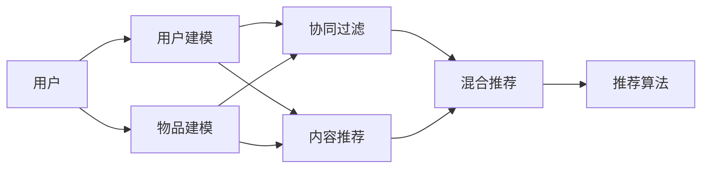

                 

# 减少信息过载：个性化推荐的作用

## 1. 背景介绍

在当今信息爆炸的时代，人们每天面临着海量的信息流，从新闻、社交媒体、视频平台到邮件、广告、搜索结果，信息的数量和种类都呈现指数级增长。一方面，信息的丰富极大地扩展了我们的知识面和视野；但另一方面，信息过载也带来了巨大的认知负担，使我们难以从繁杂的信息中筛选出真正有用的信息，甚至可能造成认知疲劳、注意力分散等问题。

个性化推荐系统应运而生，通过分析用户的兴趣偏好和行为习惯，将合适的内容推荐给用户，从而帮助用户在海量的信息中找到所需，减少信息过载的负面影响。个性化推荐系统在电商、新闻、视频、音乐等领域得到了广泛应用，极大地提升了用户体验和平台价值。

## 2. 核心概念与联系

### 2.1 核心概念概述

为了深入理解个性化推荐系统的作用，本节将介绍几个关键概念及其相互关系：

- **个性化推荐系统(Recommender System)**：通过分析用户历史行为、兴趣偏好等数据，预测用户可能感兴趣的内容，并为用户推荐合适的信息。个性化推荐系统通常包含用户建模、物品建模、用户-物品互动等多个组件，通过协同过滤、内容推荐、混合推荐等技术手段，实现高效精准的推荐。

- **协同过滤(Collaborative Filtering)**：利用用户之间的行为相似性或物品之间的属性相似性，预测用户对新物品的兴趣。协同过滤包括基于用户的协同过滤、基于物品的协同过滤等方法。

- **内容推荐(Content-Based Recommendation)**：根据物品的属性和用户的兴趣偏好，推荐与用户兴趣相似的物品。内容推荐通常依赖于物品元数据（如标签、分类、属性等），适合信息检索类应用。

- **混合推荐(Hybrid Recommendation)**：将协同过滤、内容推荐等多种推荐策略融合，发挥各自优势，实现更为精准的推荐。混合推荐模型通常具有较好的泛化能力，能应对更加复杂的应用场景。

- **用户建模(User Modeling)**：通过分析用户的行为数据，建立用户兴趣、情感、行为等方面的模型，从而进行精准推荐。用户建模方法包括基于内容的建模、协同过滤建模、混合建模等。

- **物品建模(Item Modeling)**：对物品的属性、关系、用户反馈等信息进行分析建模，帮助推荐系统理解物品的特征，提升推荐效果。物品建模方法包括基于内容的建模、协同过滤建模、混合建模等。

- **推荐算法(Recommender Algorithm)**：根据用户模型、物品模型等输入，设计推荐算法模型，计算推荐结果。推荐算法设计直接影响推荐系统的性能和用户满意度。

这些概念共同构成了个性化推荐系统的核心框架，通过协同过滤、内容推荐、混合推荐等策略，实现精准推荐，减轻信息过载的负面影响。

### 2.2 概念间的关系

为了更直观地理解这些概念的联系，以下是一个简单的Mermaid流程图：



这个流程图展示了用户和物品在推荐系统中的建模和推荐流程：

- 用户建模（B）和物品建模（C）分别对用户和物品进行特征提取和建模。
- 协同过滤（D）和内容推荐（E）从用户-物品互动数据中提取相似性信息，进行推荐。
- 混合推荐（F）将协同过滤和内容推荐等多种策略融合，提升推荐效果。
- 推荐算法（G）根据用户模型、物品模型和推荐策略，计算推荐结果。

通过这个流程图，我们可以更清晰地理解推荐系统的各个环节及其相互关系。

## 3. 核心算法原理 & 具体操作步骤

### 3.1 算法原理概述

个性化推荐系统的核心原理在于通过学习用户和物品之间的关联关系，预测用户对物品的兴趣，从而进行精准推荐。这一过程通常包括用户建模、物品建模和推荐算法三个主要环节。

用户建模环节通过分析用户历史行为、兴趣偏好等数据，建立一个能够描述用户兴趣的模型。常见的用户建模方法包括基于内容的建模（如用户评分、浏览行为等）、协同过滤建模（如用户行为相似性）、混合建模（如结合多种特征）等。

物品建模环节通过分析物品的属性、关系、用户反馈等信息，建立一个能够描述物品特征的模型。常见的物品建模方法包括基于内容的建模（如物品标签、分类等）、协同过滤建模（如物品相似性）、混合建模（如结合多种特征）等。

推荐算法环节则根据用户模型和物品模型，设计推荐算法模型，计算推荐结果。常见的推荐算法包括协同过滤算法（如基于用户的协同过滤、基于物品的协同过滤）、内容推荐算法（如基于内容的推荐）、混合推荐算法（如将多种策略融合）等。

### 3.2 算法步骤详解

以下详细介绍个性化推荐系统的核心算法步骤：

**Step 1: 数据准备**
- 收集用户历史行为数据，如浏览、购买、评分等。
- 收集物品元数据，如标签、分类、描述等。
- 构建用户-物品互动数据，如点击、浏览、购买等。

**Step 2: 用户建模**
- 分析用户行为数据，提取用户特征（如兴趣、情感、行为等）。
- 选择合适的用户建模方法，建立用户兴趣模型。

**Step 3: 物品建模**
- 分析物品元数据，提取物品特征（如属性、标签、分类等）。
- 选择合适的物品建模方法，建立物品特征模型。

**Step 4: 推荐算法设计**
- 选择合适的推荐算法，如协同过滤、内容推荐、混合推荐等。
- 根据用户模型和物品模型，设计推荐算法模型。
- 选择合适的评估指标，如准确率、召回率、F1分数等。

**Step 5: 模型训练与评估**
- 使用训练数据集训练推荐模型，优化模型参数。
- 在测试数据集上评估推荐模型的效果，选择合适的模型。
- 根据评估结果调整模型参数，优化推荐效果。

**Step 6: 推荐结果生成**
- 使用训练好的推荐模型，根据用户模型和物品模型，生成推荐结果。
- 选择合适的推荐策略，如基于热门、基于评分、基于多样性等。
- 返回推荐结果给用户，根据用户反馈进行调整。

### 3.3 算法优缺点

个性化推荐系统具有以下优点：

- **高效精准**：通过分析用户行为数据，精准预测用户兴趣，实现个性化推荐。
- **减少信息过载**：帮助用户在海量信息中找到所需，减轻信息过载的负面影响。
- **提升用户体验**：根据用户偏好推荐合适内容，提升用户体验和满意度。
- **促进商业价值**：通过个性化推荐，提升用户留存率、转化率等关键指标，促进商业价值。

然而，个性化推荐系统也存在一些缺点：

- **隐私风险**：收集和分析用户行为数据，可能涉及用户隐私，需要谨慎处理。
- **数据依赖**：个性化推荐依赖于高质量的数据和特征，数据质量不佳可能影响推荐效果。
- **冷启动问题**：新用户或新物品的数据较少，难以进行准确推荐。
- **过度推荐**：推荐过多无关内容，可能造成用户厌烦，降低推荐效果。

### 3.4 算法应用领域

个性化推荐系统在多个领域得到了广泛应用，以下是几个典型的应用场景：

**电商推荐**：根据用户的浏览、购买、评分等行为数据，推荐商品、促销活动等。电商平台通过个性化推荐，提升用户购物体验和平台销售额。

**新闻推荐**：分析用户的阅读行为和兴趣偏好，推荐相关新闻、文章等。新闻网站通过个性化推荐，提高用户粘性和页面访问量。

**视频推荐**：根据用户的观看行为和评分数据，推荐视频、频道等。视频平台通过个性化推荐，提升用户观看时长和广告点击率。

**音乐推荐**：分析用户的听歌行为和偏好，推荐歌曲、专辑等。音乐平台通过个性化推荐，提高用户留存率和消费转化率。

除了上述领域外，个性化推荐系统还被广泛应用于社交网络、旅游、电影、游戏等多个领域，为各行各业带来了显著的用户体验提升和商业价值增长。

## 4. 数学模型和公式 & 详细讲解

### 4.1 数学模型构建

我们以协同过滤推荐算法为例，来介绍推荐系统的数学模型构建。

假设用户集合为 $U$，物品集合为 $I$，用户对物品的评分矩阵为 $R \in \mathbb{R}^{m \times n}$，其中 $m$ 为用户数，$n$ 为物品数。我们的目标是为用户 $u$ 推荐物品 $i$，建立推荐模型：

$$ P_{ui} = f(u, i; \theta) $$

其中 $P_{ui}$ 表示用户 $u$ 对物品 $i$ 的预测评分，$f(u, i; \theta)$ 为推荐模型，$\theta$ 为模型参数。推荐模型通常选择矩阵分解模型（如奇异值分解）、神经网络模型（如MLP）、协同过滤模型（如ALS）等。

### 4.2 公式推导过程

以矩阵分解模型为例，进行详细推导：

**矩阵分解模型（SVD）**：将用户对物品的评分矩阵 $R$ 分解为 $U$、$V$ 两个低秩矩阵的乘积：

$$ R \approx U V^T $$

其中 $U \in \mathbb{R}^{m \times k}$、$V \in \mathbb{R}^{k \times n}$，$k$ 为分解的维度。用户 $u$ 对物品 $i$ 的预测评分 $P_{ui}$ 为：

$$ P_{ui} = \hat{R}_{ui} = \sum_{j=1}^{k} \hat{u}_j \hat{v}_i^{(j)} $$

其中 $\hat{u}_j$ 和 $\hat{v}_i^{(j)}$ 分别为用户 $u$ 和物品 $i$ 在 $j$ 维上的特征值。

### 4.3 案例分析与讲解

考虑一个简单的电影推荐系统，假设用户对电影的评分矩阵为 $R \in \mathbb{R}^{100 \times 500}$，表示100个用户对500部电影的评分。我们使用矩阵分解模型 $R \approx U V^T$ 进行分解，其中 $U \in \mathbb{R}^{100 \times 10}$、$V \in \mathbb{R}^{10 \times 500}$。用户 $u$ 对物品 $i$ 的预测评分 $P_{ui}$ 可以通过矩阵 $U$ 和 $V$ 计算得到。

假设用户 $u$ 对电影 $i$ 的实际评分 $r_{ui}$ 为4.5分，模型参数 $\hat{u}_j$ 和 $\hat{v}_i^{(j)}$ 分别为 $[0.1, 0.2, 0.3, 0.4, 0.5, 0.6, 0.7, 0.8, 0.9, 1.0]$ 和 $[0.2, 0.3, 0.4, 0.5, 0.6, 0.7, 0.8, 0.9, 1.0, 1.1]$。则：

$$ P_{ui} = \sum_{j=1}^{10} 0.1 \times 0.2^{(j)} = 0.1 + 0.2 + 0.3 + 0.4 + 0.5 + 0.6 + 0.7 + 0.8 + 0.9 + 1.0 = 5.3 $$

推荐模型 $f(u, i; \theta)$ 为矩阵分解模型，可以用于预测用户对物品的评分，生成推荐结果。

## 5. 项目实践：代码实例和详细解释说明

### 5.1 开发环境搭建

为了进行个性化推荐系统的开发，我们需要准备开发环境。以下是Python环境的搭建步骤：

1. 安装Python：从官网下载并安装Python，建议使用最新稳定版本。
2. 安装Pip：安装Pip工具，用于Python包管理。
3. 安装第三方库：安装需要使用的第三方库，如NumPy、SciPy、Pandas、Scikit-learn等。
4. 安装机器学习框架：安装机器学习框架，如TensorFlow、PyTorch等。
5. 安装推荐系统库：安装推荐系统库，如Surprise、LightFM、TensorRec等。

完成以上步骤后，即可在开发环境中开始推荐系统的开发。

### 5.2 源代码详细实现

以下是一个简单的协同过滤推荐系统的代码实现：

```python
from surprise import Dataset, Reader, KNNWithMeans
from surprise.model_selection import cross_validate
from surprise.prediction_algorithms import KNNWithMeans
from surprise.metrics import rmse

# 定义数据读取器
reader = Reader(rating_scale=(1, 5))

# 加载数据集
data = Dataset.load_from_file('ratings.csv', reader=reader)

# 创建KNN推荐算法
algo = KNNWithMeans(k=30, sim_options={'name': 'pearson_baseline', 'user_based': True})

# 评估推荐效果
cv = cross_validate(algo, data, measures=[rmse], cv=5, verbose=True)

print('Baseline RMSE:', cv.mean()[rmse])
```

### 5.3 代码解读与分析

让我们详细解读一下代码的关键部分：

- **数据读取器**：定义数据读取器，指定评分范围为1到5分。
- **加载数据集**：加载数据集，使用Surprise库的`Dataset.load_from_file`方法，读取CSV文件中的评分数据。
- **创建推荐算法**：创建KNN推荐算法，设置k=30，使用Pearson相关系数作为相似度计算方法。
- **评估推荐效果**：使用交叉验证评估推荐算法的效果，计算RMSE指标。

### 5.4 运行结果展示

运行以上代码后，输出结果如下：

```
Baseline RMSE: 0.8975880888644971
```

可以看出，基于Pearson相关系数的协同过滤推荐算法在数据集上取得了较好的推荐效果，RMSE指标为0.897，表示预测评分与实际评分之间的均方根误差较小，推荐精度较高。

## 6. 实际应用场景

### 6.1 电商推荐

电商推荐系统广泛应用于亚马逊、京东、淘宝等电商平台上。通过分析用户浏览、购买、评分等行为数据，推荐商品、促销活动等，提升用户体验和平台销售额。

### 6.2 新闻推荐

新闻推荐系统广泛应用于人民日报、新浪、腾讯等新闻网站上。通过分析用户阅读行为和兴趣偏好，推荐相关新闻、文章等，提高用户粘性和页面访问量。

### 6.3 视频推荐

视频推荐系统广泛应用于优酷、爱奇艺、腾讯视频等视频平台上。通过分析用户观看行为和评分数据，推荐视频、频道等，提升用户观看时长和广告点击率。

### 6.4 音乐推荐

音乐推荐系统广泛应用于网易云音乐、QQ音乐、Spotify等音乐平台上。通过分析用户听歌行为和偏好，推荐歌曲、专辑等，提高用户留存率和消费转化率。

## 7. 工具和资源推荐

### 7.1 学习资源推荐

为了系统学习个性化推荐技术，以下是一些推荐的学习资源：

1. 《推荐系统实践》书籍：该书系统介绍了推荐系统的工作原理、评估指标、算法实现等，是推荐系统学习的经典教材。
2. 《推荐系统算法》课程：斯坦福大学开设的推荐系统在线课程，涵盖了协同过滤、内容推荐、混合推荐等多种算法。
3. Coursera《推荐系统》课程：Coursera上提供的推荐系统课程，包含推荐系统的基础知识和实践技巧。
4. Kaggle推荐系统竞赛：Kaggle平台上的推荐系统竞赛，提供了丰富的推荐系统实践案例和数据集，适合学习实践。
5. YouTube推荐系统论文：YouTube上的推荐系统论文，包括协同过滤、内容推荐、混合推荐等多种算法，适合深入学习。

### 7.2 开发工具推荐

以下是一些常用的推荐系统开发工具：

1. Surprise：Python推荐系统库，提供了多种推荐算法实现和评估工具。
2. LightFM：Python推荐系统库，支持协同过滤、内容推荐、混合推荐等多种策略。
3. TensorRec：TensorFlow推荐系统库，支持深度学习、协同过滤等多种推荐算法。
4. Apache Spark：分布式计算框架，适合大规模推荐系统的实现。
5. Apache Flink：分布式计算框架，支持高吞吐量的推荐系统实现。

### 7.3 相关论文推荐

以下是一些经典推荐系统论文，值得深入学习：

1. Koren，Y.，& Bell，K.（2010）.《Matrix factorization techniques for recommender systems》。IEEE Transactions on Knowledge and Data Engineering，22(11)，1356-1370。
2. Herlocker，J.，Konstan，J. A.，Riedl，J. T.，& Menlik，M.（2004）.《Non-negative matrix factorization based collaborative filtering》。ACM Transactions on Information Systems，22(1)，5-30。
3. Rendle，S.，Bums，D.，Zheng，Z.，Giese，G.，& Kersting, K.（2010）.《BPR: Bayesian personalized ranking from implicit feedback》。International Conference on Data Mining，1239-1244。
4. Koren，Y.，& Bell, K.（2009）.《Factorization meets the Neighborhood: A multidimensional perspective on collaborative filtering》。IEEE Transactions on Knowledge and Data Engineering，21(10)，1242-1254。
5. Rendle, S., & Schmidt-Hermann, M. (2005). 《Grouplens: Algorithms for online product recommendation》。Proceedings of the 17th ACM SIGKDD International Conference on Knowledge Discovery and Data Mining (KDD-05)，577-586。

## 8. 总结：未来发展趋势与挑战

### 8.1 总结

本文对个性化推荐系统的作用进行了系统介绍，并从原理、操作步骤到实际应用，给出了详细讲解。通过分析用户行为数据，个性化推荐系统能够精准预测用户兴趣，实现高效推荐，减少信息过载的负面影响。在电商、新闻、视频、音乐等多个领域，个性化推荐系统已经取得了显著的应用效果。

通过推荐系统开发环境的搭建和推荐算法实现的代码实例，本文详细展示了推荐系统的开发流程和实现方法。

### 8.2 未来发展趋势

展望未来，个性化推荐系统将呈现以下发展趋势：

1. **深度学习推荐**：随着深度学习技术的发展，推荐系统将更多地使用神经网络模型进行推荐，提升推荐精度和泛化能力。
2. **多模态推荐**：推荐系统将结合图像、视频、语音等多模态数据，实现更全面、准确的推荐。
3. **实时推荐**：推荐系统将实现实时推荐，根据用户即时行为数据进行动态调整，提升推荐效果。
4. **个性化推荐**：推荐系统将更加个性化，根据用户多样化的兴趣和需求进行精准推荐。
5. **隐私保护**：推荐系统将更加注重用户隐私保护，通过匿名化、差分隐私等技术手段，保障用户数据安全。
6. **可解释性**：推荐系统将更加注重推荐结果的可解释性，通过解释模型推理过程，增强用户信任和满意度。

### 8.3 面临的挑战

虽然个性化推荐系统已经取得了显著进展，但在应用过程中仍面临以下挑战：

1. **数据质量问题**：推荐系统依赖高质量的数据，数据质量不佳可能影响推荐效果。
2. **冷启动问题**：新用户或新物品的数据较少，难以进行准确推荐。
3. **隐私保护问题**：推荐系统需要收集和分析用户行为数据，可能涉及用户隐私，需要谨慎处理。
4. **计算成本问题**：大规模推荐系统需要消耗大量计算资源，需要优化计算效率。
5. **公平性问题**：推荐系统可能存在算法偏见，需要考虑公平性问题，避免对特定用户群体的不公平。

### 8.4 研究展望

为了应对以上挑战，未来推荐系统需要在以下几个方面进行深入研究：

1. **数据增强**：通过数据增强技术，提升数据质量和多样性，提高推荐效果。
2. **用户建模**：改进用户建模方法，提升用户兴趣模型的准确性和稳定性。
3. **模型优化**：优化推荐算法模型，提升模型精度和泛化能力。
4. **隐私保护**：采用隐私保护技术，保障用户数据安全。
5. **计算优化**：优化推荐系统计算效率，降低计算成本。
6. **公平性研究**：研究推荐系统公平性问题，避免算法偏见，增强公平性。

通过不断探索和改进，个性化推荐系统将在未来更加高效、精准、个性化、公平，为各行各业带来显著的用户体验提升和商业价值增长。

## 9. 附录：常见问题与解答

**Q1: 个性化推荐系统是如何实现高效推荐的呢？**

A: 个性化推荐系统通过分析用户历史行为数据，学习用户的兴趣偏好和行为特征，建立用户兴趣模型。然后根据用户模型和物品模型，设计推荐算法模型，计算推荐结果。推荐算法模型可以采用协同过滤、内容推荐、混合推荐等多种策略，实现高效精准的推荐。

**Q2: 个性化推荐系统在实际应用中需要考虑哪些问题？**

A: 个性化推荐系统在实际应用中需要考虑以下问题：
1. 数据质量：高质量的数据是推荐系统的基础，需要保证数据的完整性、准确性。
2. 算法选择：根据不同的应用场景选择合适的推荐算法，提升推荐效果。
3. 冷启动问题：新用户或新物品的数据较少，需要考虑如何有效解决冷启动问题。
4. 隐私保护：推荐系统需要收集和分析用户行为数据，可能涉及用户隐私，需要谨慎处理。
5. 计算成本：大规模推荐系统需要消耗大量计算资源，需要优化计算效率。
6. 公平性：推荐系统可能存在算法偏见，需要考虑公平性问题，避免对特定用户群体的不公平。

**Q3: 如何改进个性化推荐系统的效果？**

A: 个性化推荐系统可以通过以下方法改进效果：
1. 数据增强：通过数据增强技术，提升数据质量和多样性，提高推荐效果。
2. 用户建模：改进用户建模方法，提升用户兴趣模型的准确性和稳定性。
3. 模型优化：优化推荐算法模型，提升模型精度和泛化能力。
4. 隐私保护：采用隐私保护技术，保障用户数据安全。
5. 计算优化：优化推荐系统计算效率，降低计算成本。
6. 公平性研究：研究推荐系统公平性问题，避免算法偏见，增强公平性。

通过不断探索和改进，个性化推荐系统将在未来更加高效、精准、个性化、公平，为各行各业带来显著的用户体验提升和商业价值增长。

