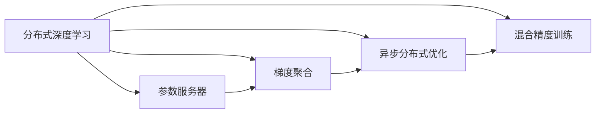

                 

# 分布式训练：软件2.0的工业化之路

> 关键词：分布式训练, 软件2.0, 深度学习, 人工智能, 工业化

## 1. 背景介绍

### 1.1 问题由来
随着深度学习技术的飞速发展，人工智能（AI）在图像识别、语音识别、自然语言处理等领域取得了显著的进展。这些突破的背后，离不开大规模深度神经网络模型的训练。然而，单机的深度学习训练面临显著的计算资源和计算时间限制，极大限制了模型的规模和深度。

为了应对这一挑战，分布式深度学习训练应运而生。分布式训练通过将计算任务分布在多个计算节点上并行计算，显著提高了训练效率，加速了模型收敛。这一技术不仅在学术界得到了广泛应用，也在工业界推动了AI技术的产业化进程。

### 1.2 问题核心关键点
分布式训练的核心在于如何有效管理多个计算节点的计算资源，并实现高效的数据传递和参数同步。此外，分布式训练还涉及复杂的优化算法设计、参数更新策略等问题。本文将从原理和实践两个层面，深入剖析分布式训练的技术细节。

## 2. 核心概念与联系

### 2.1 核心概念概述

为了更好地理解分布式训练，我们首先介绍几个关键概念：

- **分布式深度学习**：一种将深度学习训练任务分布到多个计算节点上进行并行计算的技术，以加速模型训练和收敛。
- **参数服务器**：一种常见的分布式训练架构，包含一个主节点（参数服务器）和多个计算节点（工作节点）。主节点负责参数的存储、同步和管理，工作节点负责计算和梯度更新。
- **梯度聚合**：在分布式训练中，多个工作节点计算梯度后，需要将这些梯度聚合到主节点，更新模型参数。常见的梯度聚合方法包括参数服务器架构、模型并行架构等。
- **异步分布式优化**：一种高效的分布式训练算法，通过异步计算和参数更新，优化训练效率和性能。
- **混合精度训练**：一种利用混合精度浮点数据类型（如16位半精度浮点数FP16）来优化计算资源和存储需求的方法。

这些核心概念通过以下Mermaid流程图进行联系：



### 2.2 概念间的关系

这些核心概念构成了分布式深度学习的整体架构和技术体系。通过分布式训练架构，将深度学习任务分配到多个节点上进行并行计算，显著提高了训练效率。参数服务器负责管理全局参数，确保各个节点计算出的梯度能够正确聚合和更新。梯度聚合方法确保了参数更新的准确性和一致性。异步分布式优化通过异步计算和更新，提高了训练的并行度和效率。混合精度训练则通过优化数据类型，降低了计算和存储的开销，进一步提升了分布式训练的效率。

## 3. 核心算法原理 & 具体操作步骤
### 3.1 算法原理概述

分布式深度学习训练的核心目标是最大化利用计算资源，通过并行计算加速模型训练。其基本流程如下：

1. **数据划分**：将训练数据集划分成多个子集，每个子集分配给一个计算节点进行训练。
2. **模型并行**：在多个计算节点上分别训练模型的一部分，如特征提取层。
3. **梯度聚合**：每个计算节点计算梯度后，将梯度聚合到参数服务器，更新全局模型参数。
4. **参数更新**：利用聚合后的梯度，更新参数服务器上的全局模型参数。
5. **参数同步**：将更新后的参数同步到各个计算节点，继续下一轮训练。

在分布式训练中，参数更新和梯度聚合是关键环节。为了优化这些环节，常见的分布式训练算法包括参数服务器架构、模型并行架构和异步分布式优化算法。

### 3.2 算法步骤详解

以下是分布式深度学习训练的详细步骤：

**Step 1: 数据划分和节点分配**
- 将训练数据集划分为多个子集，每个子集分配给一个计算节点进行训练。
- 分配节点时，需要考虑计算能力和数据大小，以确保训练效率和平衡。

**Step 2: 模型并行**
- 在每个计算节点上，分别训练模型的一部分。如使用模型并行架构，将模型分成多个子模块，每个子模块在相应节点上训练。
- 需要确保各节点间的网络通信延迟最小化，以提高计算效率。

**Step 3: 梯度聚合**
- 每个节点计算梯度后，将梯度聚合到参数服务器，可以使用参数服务器架构或模型并行架构。
- 参数服务器架构将梯度聚合到主节点，模型并行架构则直接在节点间进行梯度聚合。

**Step 4: 参数更新**
- 利用聚合后的梯度，更新参数服务器上的全局模型参数。
- 可以使用SGD、Adam等优化算法，根据梯度更新参数。

**Step 5: 参数同步**
- 将更新后的参数同步到各个计算节点，继续下一轮训练。
- 同步策略包括全局同步和异步更新，异步更新通常更高效，但需要额外的优化措施。

### 3.3 算法优缺点

分布式深度学习训练具有以下优点：
1. 并行计算：分布式训练可以显著提高训练效率，加速模型收敛。
2. 可扩展性：通过增加计算节点，可以轻松扩展训练能力。
3. 资源利用：利用多个计算节点的计算能力，更高效地利用计算资源。

然而，分布式训练也存在以下缺点：
1. 通信开销：节点间的数据传输和通信开销较大，需要优化以提高效率。
2. 一致性问题：多个节点的计算和参数更新可能导致不一致性，需要额外的同步机制。
3. 调优复杂：需要考虑节点负载均衡、通信延迟等问题，调优难度较大。

### 3.4 算法应用领域

分布式深度学习训练在多个领域得到了广泛应用，包括：

- 图像识别：如ImageNet等大规模视觉数据集的训练，分布式训练可以显著提高训练效率。
- 自然语言处理：如BERT、GPT等预训练模型的训练，分布式训练可以加速模型训练。
- 语音识别：如DeepSpeech等语音识别模型的训练，分布式训练可以显著提高训练速度。
- 推荐系统：如YouTube、Amazon等平台的推荐系统，分布式训练可以处理海量用户数据。
- 游戏AI：如AlphaGo、星际争霸AI等，分布式训练可以加速模型训练，提升游戏AI性能。

除了这些典型应用外，分布式深度学习训练在医疗、金融、物流等多个领域也得到了广泛应用，推动了相关领域的智能化进程。

## 4. 数学模型和公式 & 详细讲解 & 举例说明

### 4.1 数学模型构建

分布式深度学习的数学模型可以描述为：

$$
\theta = \arg\min_{\theta} \frac{1}{n}\sum_{i=1}^n \ell(\theta, x_i, y_i)
$$

其中，$\theta$ 表示模型参数，$\ell$ 表示损失函数，$x_i, y_i$ 表示训练数据集的输入和标签。

分布式训练的数学模型可以表示为：

$$
\theta^{(k)} = \theta^{(k-1)} - \eta_k \frac{1}{m}\sum_{i=1}^m \nabla_{\theta} \ell(\theta, x_i^{(k)}, y_i^{(k)})
$$

其中，$\eta_k$ 表示第 $k$ 轮训练的学习率，$\nabla_{\theta} \ell(\theta, x_i^{(k)}, y_i^{(k)})$ 表示第 $k$ 轮在第 $i$ 个节点上的梯度。

### 4.2 公式推导过程

以下是分布式训练公式的推导过程：

**Step 1: 数据划分和节点分配**

$$
\theta = \arg\min_{\theta} \frac{1}{n}\sum_{i=1}^n \ell(\theta, x_i, y_i)
$$

**Step 2: 模型并行**

$$
\theta^{(k)} = \theta^{(k-1)} - \eta_k \frac{1}{m}\sum_{i=1}^m \nabla_{\theta} \ell(\theta, x_i^{(k)}, y_i^{(k)})
$$

**Step 3: 梯度聚合**

$$
\theta^{(k+1)} = \theta^{(k)} - \eta_k \frac{1}{m}\sum_{i=1}^m \nabla_{\theta} \ell(\theta, x_i^{(k)}, y_i^{(k)})
$$

**Step 4: 参数更新**

$$
\theta^{(k+1)} = \theta^{(k)} - \eta_k \nabla_{\theta} \ell(\theta, x_i^{(k)}, y_i^{(k)})
$$

**Step 5: 参数同步**

$$
\theta^{(k+1)} = \theta^{(k+1)}_k - \eta_k \nabla_{\theta} \ell(\theta, x_i^{(k)}, y_i^{(k)})
$$

通过这些步骤，可以实现高效的分布式深度学习训练。需要注意的是，在实际应用中，还需要考虑节点间的数据传输和参数同步策略，以确保训练的效率和一致性。

### 4.3 案例分析与讲解

以图像识别任务为例，假设我们有1000个训练样本，分布在10个计算节点上进行并行训练。每个节点的计算能力相同，每个节点训练100个样本。

**Step 1: 数据划分和节点分配**

将1000个训练样本随机划分为10个子集，每个子集分配给一个节点进行训练。

**Step 2: 模型并行**

假设我们使用了卷积神经网络（CNN）模型，将模型分成10个子模块，每个节点分别训练一个子模块。

**Step 3: 梯度聚合**

每个节点计算梯度后，将梯度聚合到主节点，更新全局模型参数。

**Step 4: 参数更新**

利用聚合后的梯度，更新参数服务器上的全局模型参数。

**Step 5: 参数同步**

将更新后的参数同步到各个计算节点，继续下一轮训练。

## 5. 项目实践：代码实例和详细解释说明

### 5.1 开发环境搭建

在进行分布式深度学习训练前，我们需要准备好开发环境。以下是使用PyTorch和Apache Spark进行分布式训练的环境配置流程：

1. 安装Anaconda：从官网下载并安装Anaconda，用于创建独立的Python环境。

2. 创建并激活虚拟环境：
```bash
conda create -n pytorch-env python=3.8 
conda activate pytorch-env
```

3. 安装PyTorch和Spark：
```bash
conda install pytorch torchvision torchaudio cudatoolkit=11.1 -c pytorch -c conda-forge
pip install pyspark
```

4. 配置Spark环境：
```bash
spark-submit --master local --executor-cores 4 --executor-memory 4G --num-executors 4 --driver-memory 4G --py-files my_spark.py spark/distributed_tensor/spark_api.py
```

5. 配置网络环境：
```bash
spark-submit --master local[2] --executor-cores 4 --executor-memory 4G --num-executors 2 --driver-memory 4G --py-files my_spark.py spark/distributed_tensor/spark_api.py
```

完成上述步骤后，即可在`pytorch-env`环境中开始分布式训练实践。

### 5.2 源代码详细实现

以下是一个使用PyTorch和Apache Spark进行分布式深度学习训练的代码实现。

```python
from pytorch_serve import TensorPipeServer, TensorPipeClient, TensorPipeHandler
from torch import nn, optim
from torch.distributed._tensor import DTensor, device_mesh, distribute_tensor

class Model(nn.Module):
    def __init__(self):
        super(Model, self).__init__()
        self.fc1 = nn.Linear(784, 256)
        self.fc2 = nn.Linear(256, 128)
        self.fc3 = nn.Linear(128, 10)
        
    def forward(self, x):
        x = x.view(-1, 784)
        x = nn.functional.relu(self.fc1(x))
        x = nn.functional.relu(self.fc2(x))
        x = self.fc3(x)
        return x

def train(model, dataloader, optimizer):
    model.train()
    for batch in dataloader:
        inputs, labels = batch
        inputs = inputs.to(device)
        labels = labels.to(device)
        optimizer.zero_grad()
        outputs = model(inputs)
        loss = nn.functional.cross_entropy(outputs, labels)
        loss.backward()
        optimizer.step()

def evaluate(model, dataloader):
    model.eval()
    total = 0
    correct = 0
    with torch.no_grad():
        for batch in dataloader:
            inputs, labels = batch
            inputs = inputs.to(device)
            labels = labels.to(device)
            outputs = model(inputs)
            _, predicted = torch.max(outputs.data, 1)
            total += labels.size(0)
            correct += (predicted == labels).sum().item()
    print('Accuracy: {}%'.format(100 * correct / total))

if __name__ == '__main__':
    device = torch.device('cuda')
    model = Model().to(device)
    optimizer = optim.Adam(model.parameters(), lr=0.001)
    
    # 使用TensorPipe进行通信
    server = TensorPipeServer('localhost', 4000)
    client = TensorPipeClient('localhost', 4000)
    handler = TensorPipeHandler(model.parameters(), optimizer)
    
    # 定义训练和评估函数
    def train_func():
        for epoch in range(10):
            train(model, dataloader, optimizer)
            evaluate(model, dataloader)
    
    # 启动TensorPipeServer
    server.start(train_func)
```

### 5.3 代码解读与分析

以下是关键代码的实现细节：

**MyModel类**：
- `__init__`方法：初始化模型参数。
- `forward`方法：定义模型前向传播过程。

**train函数**：
- 将模型设置为训练模式，进行前向传播计算，计算损失，反向传播更新参数，更新优化器状态。

**evaluate函数**：
- 将模型设置为评估模式，计算模型在测试集上的准确率。

**主函数**：
- 将模型迁移到指定设备，初始化优化器。
- 定义TensorPipeServer和TensorPipeClient，用于节点间的通信。
- 定义TensorPipeHandler，用于管理模型参数和优化器状态。
- 定义训练和评估函数，启动TensorPipeServer进行分布式训练。

可以看到，通过PyTorch和Apache Spark，可以非常方便地实现分布式深度学习训练。开发者只需定义好模型和训练逻辑，TensorPipeServer和TensorPipeClient会自动管理节点间的通信和参数同步，从而实现高效的分布式训练。

## 6. 实际应用场景
### 6.1 图像识别

分布式深度学习训练在图像识别任务中得到了广泛应用。如在ImageNet等大规模视觉数据集的训练中，分布式训练可以显著提高训练效率，加速模型收敛。假设我们有1000个训练样本，分布在10个计算节点上进行并行训练。每个节点的计算能力相同，每个节点训练100个样本。

**Step 1: 数据划分和节点分配**

将1000个训练样本随机划分为10个子集，每个子集分配给一个节点进行训练。

**Step 2: 模型并行**

假设我们使用了卷积神经网络（CNN）模型，将模型分成10个子模块，每个节点分别训练一个子模块。

**Step 3: 梯度聚合**

每个节点计算梯度后，将梯度聚合到主节点，更新全局模型参数。

**Step 4: 参数更新**

利用聚合后的梯度，更新参数服务器上的全局模型参数。

**Step 5: 参数同步**

将更新后的参数同步到各个计算节点，继续下一轮训练。

### 6.2 自然语言处理

在自然语言处理任务中，分布式深度学习训练同样发挥了重要作用。如在BERT、GPT等预训练模型的训练中，分布式训练可以显著提高训练效率。假设我们有1000个训练样本，分布在10个计算节点上进行并行训练。每个节点的计算能力相同，每个节点训练100个样本。

**Step 1: 数据划分和节点分配**

将1000个训练样本随机划分为10个子集，每个子集分配给一个节点进行训练。

**Step 2: 模型并行**

假设我们使用了Transformer模型，将模型分成10个子模块，每个节点分别训练一个子模块。

**Step 3: 梯度聚合**

每个节点计算梯度后，将梯度聚合到主节点，更新全局模型参数。

**Step 4: 参数更新**

利用聚合后的梯度，更新参数服务器上的全局模型参数。

**Step 5: 参数同步**

将更新后的参数同步到各个计算节点，继续下一轮训练。

### 6.3 推荐系统

在推荐系统任务中，分布式深度学习训练可以处理海量用户数据，加速模型训练。假设我们有1000个训练样本，分布在10个计算节点上进行并行训练。每个节点的计算能力相同，每个节点训练100个样本。

**Step 1: 数据划分和节点分配**

将1000个训练样本随机划分为10个子集，每个子集分配给一个节点进行训练。

**Step 2: 模型并行**

假设我们使用了深度神经网络模型，将模型分成10个子模块，每个节点分别训练一个子模块。

**Step 3: 梯度聚合**

每个节点计算梯度后，将梯度聚合到主节点，更新全局模型参数。

**Step 4: 参数更新**

利用聚合后的梯度，更新参数服务器上的全局模型参数。

**Step 5: 参数同步**

将更新后的参数同步到各个计算节点，继续下一轮训练。

### 6.4 未来应用展望

未来，分布式深度学习训练将在更多领域得到应用，为人工智能技术的产业化进程提供支持。

在智慧城市领域，分布式深度学习训练可以应用于城市事件监测、舆情分析、应急指挥等环节，提高城市管理的自动化和智能化水平，构建更安全、高效的未来城市。

在智慧医疗领域，分布式深度学习训练可以应用于医疗影像诊断、药物研发等任务，提升医疗服务的智能化水平，辅助医生诊疗，加速新药开发进程。

在智慧教育领域，分布式深度学习训练可以应用于学生行为分析、学习推荐等任务，因材施教，促进教育公平，提高教学质量。

此外，在企业生产、社会治理、文娱传媒等众多领域，分布式深度学习训练也将不断涌现，为传统行业数字化转型升级提供新的技术路径。相信随着技术的日益成熟，分布式深度学习训练必将在构建人机协同的智能时代中扮演越来越重要的角色。

## 7. 工具和资源推荐
### 7.1 学习资源推荐

为了帮助开发者系统掌握分布式深度学习训练的理论基础和实践技巧，这里推荐一些优质的学习资源：

1. 《深度学习框架PyTorch》系列博文：由大模型技术专家撰写，深入浅出地介绍了PyTorch框架的分布式训练功能。

2. CS448《分布式深度学习》课程：斯坦福大学开设的深度学习课程，详细讲解了分布式深度学习的原理和实践。

3. 《TensorFlow深度学习》书籍：Google开发的深度学习框架，详细介绍了TensorFlow在分布式训练中的应用。

4. PyTorch官方文档：PyTorch框架的官方文档，提供了丰富的分布式训练示例代码，是上手实践的必备资料。

5. Apache Spark官方文档：Apache Spark框架的官方文档，详细介绍了TensorPipe的分布式训练功能，是分布式训练的核心工具。

通过对这些资源的学习实践，相信你一定能够快速掌握分布式深度学习训练的精髓，并用于解决实际的深度学习问题。

### 7.2 开发工具推荐

高效的开发离不开优秀的工具支持。以下是几款用于分布式深度学习训练开发的常用工具：

1. PyTorch：基于Python的开源深度学习框架，灵活动态的计算图，适合快速迭代研究。大部分预训练深度学习模型都有PyTorch版本的实现。

2. TensorFlow：由Google主导开发的开源深度学习框架，生产部署方便，适合大规模工程应用。同样有丰富的预训练深度学习模型资源。

3. TensorPipe：Apache Spark框架的分布式通信协议，提供了高效、可扩展的通信机制，适合分布式训练。

4. Weights & Biases：模型训练的实验跟踪工具，可以记录和可视化模型训练过程中的各项指标，方便对比和调优。与主流深度学习框架无缝集成。

5. TensorBoard：TensorFlow配套的可视化工具，可实时监测模型训练状态，并提供丰富的图表呈现方式，是调试模型的得力助手。

6. Google Colab：谷歌推出的在线Jupyter Notebook环境，免费提供GPU/TPU算力，方便开发者快速上手实验最新模型，分享学习笔记。

合理利用这些工具，可以显著提升分布式深度学习训练的开发效率，加快创新迭代的步伐。

### 7.3 相关论文推荐

分布式深度学习训练在学术界和工业界得到了广泛研究。以下是几篇奠基性的相关论文，推荐阅读：

1. Using Multiple Computers to Speed up the Learning of Artificial Neural Networks (1985)：提出了分布式神经网络训练的概念。

2. Distributed Asynchronous Deep Learning (2017)：介绍了分布式深度学习的基本原理和算法。

3. Asynchronous Stochastic Gradient Descent for Deep Learning (2015)：提出了异步分布式深度学习的算法。

4. Super-Resolution Image Restoration Using Deep Convolutional Networks and a Distributed Parallel GPU Architecture (2014)：展示了分布式深度学习在图像处理任务中的应用。

5. The GAN Zoo (2020)：介绍了不同类型的GAN模型，展示了分布式深度学习在生成对抗网络中的应用。

这些论文代表了大分布式深度学习训练的发展脉络。通过学习这些前沿成果，可以帮助研究者把握学科前进方向，激发更多的创新灵感。

除上述资源外，还有一些值得关注的前沿资源，帮助开发者紧跟分布式深度学习训练技术的最新进展，例如：

1. arXiv论文预印本：人工智能领域最新研究成果的发布平台，包括大量尚未发表的前沿工作，学习前沿技术的必读资源。

2. 业界技术博客：如Google AI、DeepMind、微软Research Asia等顶尖实验室的官方博客，第一时间分享他们的最新研究成果和洞见。

3. 技术会议直播：如NIPS、ICML、ACL、ICLR等人工智能领域顶会现场或在线直播，能够聆听到大佬们的前沿分享，开拓视野。

4. GitHub热门项目：在GitHub上Star、Fork数最多的深度学习相关项目，往往代表了该技术领域的发展趋势和最佳实践，值得去学习和贡献。

5. 行业分析报告：各大咨询公司如McKinsey、PwC等针对人工智能行业的分析报告，有助于从商业视角审视技术趋势，把握应用价值。

总之，对于分布式深度学习训练的学习和实践，需要开发者保持开放的心态和持续学习的意愿。多关注前沿资讯，多动手实践，多思考总结，必将收获满满的成长收益。

## 8. 总结：未来发展趋势与挑战
### 8.1 研究成果总结

本文对分布式深度学习训练的技术进行了全面系统的介绍。首先阐述了分布式深度学习训练的研究背景和意义，明确了其在推动AI技术产业化进程中的重要价值。其次，从原理到实践，详细讲解了分布式深度学习训练的核心算法和具体操作步骤，给出了详细的代码实例和分析。同时，本文还广泛探讨了分布式深度学习训练在图像识别、自然语言处理、推荐系统等领域的实际应用，展示了其强大的应用潜力。此外，本文精选了分布式深度学习训练的学习资源，力求为读者提供全方位的技术指引。

通过本文的系统梳理，可以看到，分布式深度学习训练已经在多个领域得到广泛应用，显著提高了深度学习模型的训练效率和性能。未来，随着深度学习技术的不断进步，分布式深度学习训练将继续在更多领域发挥重要作用。

### 8.2 未来发展趋势

展望未来，分布式深度学习训练将呈现以下几个发展趋势：

1. 异步分布式优化：异步分布式优化方法将继续发展，提升分布式训练的效率和性能。

2. 混合精度训练：混合精度训练方法将继续优化，进一步降低计算和存储的开销。

3. 自适应学习率：自适应学习率算法将继续改进，提升训练的稳定性和收敛速度。

4. 自动化调优：自动化调优技术将继续发展，提高分布式深度学习训练的自动化程度。

5. 分布式联邦学习：分布式联邦学习技术将继续优化，在保护数据隐私的前提下，提升模型性能。

6. 跨领域模型融合：跨领域模型融合技术将继续发展，增强模型的泛化能力和迁移能力。

以上趋势凸显了分布式深度学习训练的广阔前景。这些方向的探索发展，必将进一步提升深度学习模型的训练效率和性能，为人工智能技术的应用带来新的突破。

### 8.3 面临的挑战

尽管分布式深度学习训练已经取得了显著进展，但在迈向更加智能化、普适化应用的过程中，它仍面临着诸多挑战：

1. 计算资源瓶颈：随着模型规模的增大和任务复杂度的提高，分布式训练对计算资源的需求也在不断增加，难以满足大规模计算的需求。如何更高效地利用计算资源，优化计算性能，将是未来的一个重要研究方向。

2. 通信延迟问题：分布式

