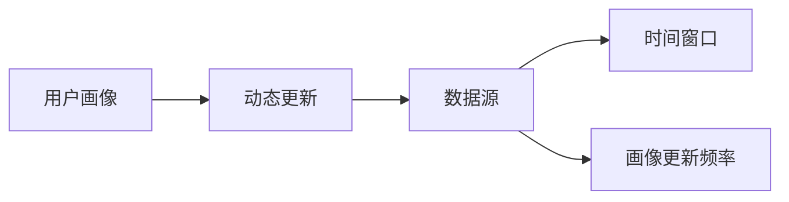
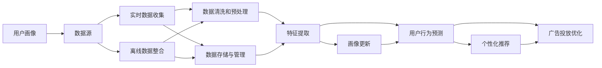

                 

## 1. 背景介绍

### 1.1 问题由来
在互联网时代，用户画像成为企业和产品运营中不可或缺的一部分。它是对用户行为、兴趣、属性等信息的综合抽象和描述，旨在通过数据驱动决策，优化用户体验，提升商业价值。随着技术的进步，用户画像的构建方式从静态转向动态，以适应不断变化的互联网环境。

### 1.2 问题核心关键点
动态更新用户画像的核心在于如何实时获取和分析用户数据，并及时更新用户信息，以反映用户最新的行为和偏好。与静态画像不同，动态画像需要考虑数据的时效性和用户行为的多样性，以确保画像的准确性和实用性。

### 1.3 问题研究意义
动态更新用户画像在提升用户体验、优化个性化推荐、提高广告投放精准度等方面具有重要意义。它可以实时捕捉用户变化，及时调整产品策略，从而提升用户满意度和留存率。同时，动态画像还能为企业提供更精准的市场细分和用户细分，优化资源配置，提升业务效率。

## 2. 核心概念与联系

### 2.1 核心概念概述

- **用户画像(User Profile)**：用户画像是对用户行为、兴趣、属性等信息的综合描述，旨在通过数据驱动决策，优化用户体验，提升商业价值。
- **动态更新(Dynamic Update)**：动态更新用户画像是指实时获取和分析用户数据，并及时更新用户信息，以反映用户最新的行为和偏好。
- **数据源(Data Sources)**：包括用户行为数据、社交媒体数据、交易数据、位置数据等，用于构建和更新用户画像。
- **时间窗口(Time Window)**：指数据收集和更新的时间段，通常为小时、天、周等。
- **画像更新频率(Profile Update Frequency)**：指画像更新的周期，可以是实时更新或定期更新。

### 2.2 概念间的关系

这些核心概念通过以下Mermaid流程图展示它们之间的关系：



动态更新用户画像通过实时数据获取和分析，结合时间窗口和画像更新频率，不断更新和完善用户画像，从而更好地反映用户行为和偏好，提升用户体验和业务价值。

### 2.3 核心概念的整体架构

最后，我们用一个综合的流程图来展示这些核心概念在动态更新用户画像中的整体架构：



这个流程图展示了从数据源到画像更新的完整过程：首先从数据源收集实时和离线数据，然后进行数据清洗、预处理和特征提取，最后更新用户画像，并基于画像进行用户行为预测，实现个性化推荐和广告投放优化。

## 3. 核心算法原理 & 具体操作步骤
### 3.1 算法原理概述

动态更新用户画像的过程可以分解为数据获取、特征提取和画像更新三个主要步骤。

- **数据获取**：从各种数据源中实时或定期收集用户行为数据，如点击、浏览、购买、社交媒体互动等。
- **特征提取**：对收集到的数据进行预处理和分析，提取有用的特征，用于描述和预测用户行为。
- **画像更新**：基于最新的特征数据，更新用户画像，以反映用户最新的行为和偏好。

### 3.2 算法步骤详解

#### 3.2.1 数据获取
- 选择合适的数据源：根据业务需求和用户行为特点，确定需要收集的数据源，如用户行为日志、社交媒体API、交易记录等。
- 设计数据采集接口：编写API接口或使用已有工具，实现对数据源的数据采集。
- 实施数据收集：通过API接口或脚本定时或实时地从数据源获取数据，确保数据的时效性和完整性。

#### 3.2.2 特征提取
- 数据预处理：对采集到的数据进行去重、清洗、格式化等预处理操作，去除噪音和无效数据。
- 特征工程：设计特征指标，提取有用的特征，如用户活跃度、兴趣偏好、行为频率等，用于描述和预测用户行为。
- 特征转换：将原始数据转换为模型可接受的格式，如one-hot编码、标准化、归一化等。

#### 3.2.3 画像更新
- 用户画像定义：根据业务需求，定义用户画像的关键特征和维度，如人口统计、行为模式、兴趣偏好等。
- 画像合并与更新：基于最新的特征数据，更新用户画像，并合并多次收集的数据，确保画像的全面性和准确性。
- 画像验证与评估：定期验证和评估用户画像的准确性和有效性，调整画像定义和特征提取策略，以适应用户行为的变化。

### 3.3 算法优缺点

动态更新用户画像具有以下优点：
- 实时性：能够实时捕捉用户行为变化，及时调整产品策略，提升用户体验和满意度。
- 灵活性：根据用户行为和市场变化灵活调整画像定义和特征提取策略，适应不同业务需求。
- 准确性：通过定期验证和评估，持续改进画像更新算法，提高画像的准确性和实用性。

同时，动态更新用户画像也存在以下缺点：
- 数据隐私和安全：需要收集和处理大量的个人数据，数据隐私和安全问题不容忽视。
- 计算资源消耗：实时数据处理和画像更新需要高性能计算资源，可能导致资源消耗较大。
- 画像质量控制：画像更新过程涉及多个环节，一旦某个环节出错，可能影响画像质量。

### 3.4 算法应用领域

动态更新用户画像在多个领域得到了广泛应用，包括但不限于：

- **电商推荐系统**：通过实时分析用户行为数据，更新用户画像，实现个性化的商品推荐。
- **内容推荐系统**：基于用户的历史行为和兴趣，动态更新用户画像，提供个性化的内容推荐。
- **广告投放优化**：利用动态更新后的用户画像，实现精准的广告投放，提升广告投放效果。
- **社交媒体分析**：通过动态更新用户画像，分析用户行为和偏好，优化社交媒体内容和互动策略。
- **客户服务**：实时捕捉用户反馈和行为，动态更新用户画像，提升客户服务质量和满意度。

## 4. 数学模型和公式 & 详细讲解  
### 4.1 数学模型构建

动态更新用户画像的数学模型可以表示为：

$$
P(t+1) = f(P(t), D(t))
$$

其中 $P(t)$ 表示在时间 $t$ 的用户画像，$D(t)$ 表示在时间 $t$ 收集到的用户数据，$f$ 表示画像更新函数，用于根据最新数据更新用户画像。

### 4.2 公式推导过程

以下是对动态更新用户画像数学模型的详细推导：

1. **数据获取**：假设在时间 $t$ 从数据源获取到的用户数据为 $D(t) = \{d_{ti}\}_{i=1}^N$，其中 $d_{ti}$ 表示用户 $i$ 在时间 $t$ 的行为数据。

2. **特征提取**：对 $D(t)$ 进行预处理和特征提取，得到特征向量 $F_t$。

3. **画像更新**：根据 $F_t$ 更新用户画像 $P(t+1)$，即 $P(t+1) = f(P(t), F_t)$。

4. **画像验证与评估**：定义画像准确性指标 $\mathcal{A}$，如F1分数、准确率、召回率等，对 $P(t+1)$ 进行验证和评估，调整模型参数和特征提取策略。

### 4.3 案例分析与讲解

假设我们有一个电商推荐系统，需要根据用户的历史购买记录和浏览记录，实时更新用户画像，实现个性化的商品推荐。以下是一个简单的案例分析：

1. **数据获取**：从电商网站的数据库中，实时获取用户的浏览记录 $D(t) = \{b_{ti}\}_{i=1}^N$ 和购买记录 $D(t) = \{p_{ti}\}_{i=1}^N$，其中 $b_{ti}$ 和 $p_{ti}$ 分别表示用户在时间 $t$ 的浏览行为和购买行为。

2. **特征提取**：对 $D(t)$ 进行去重、清洗和标准化，提取有用的特征，如浏览次数、购买频率、浏览时间等，得到特征向量 $F_t = \{f_{ti}\}_{i=1}^N$。

3. **画像更新**：根据 $F_t$ 更新用户画像 $P(t+1)$，即 $P(t+1) = f(P(t), F_t)$。例如，可以使用加权平均值方法，将新特征与旧特征加权合并，得到新的用户画像。

4. **画像验证与评估**：利用推荐系统的反馈数据，如点击率、购买率等，评估更新后的用户画像的准确性和有效性。根据评估结果，调整画像更新函数和特征提取策略，以提高推荐效果。

## 5. 项目实践：代码实例和详细解释说明
### 5.1 开发环境搭建

在进行动态更新用户画像的项目实践前，我们需要准备好开发环境。以下是使用Python进行TensorFlow开发的环境配置流程：

1. 安装Anaconda：从官网下载并安装Anaconda，用于创建独立的Python环境。

2. 创建并激活虚拟环境：
```bash
conda create -n tf-env python=3.8 
conda activate tf-env
```

3. 安装TensorFlow：根据CUDA版本，从官网获取对应的安装命令。例如：
```bash
conda install tensorflow -c tf
```

4. 安装Pandas、NumPy、Scikit-learn等辅助工具：
```bash
pip install pandas numpy scikit-learn
```

完成上述步骤后，即可在`tf-env`环境中开始项目实践。

### 5.2 源代码详细实现

这里以电商推荐系统为例，给出使用TensorFlow进行动态更新用户画像的PyTorch代码实现。

首先，定义用户画像的数据结构：

```python
import pandas as pd

class UserProfile:
    def __init__(self, user_id, features):
        self.user_id = user_id
        self.features = features
    
    def add_feature(self, feature):
        self.features.append(feature)
```

然后，定义数据获取函数：

```python
def get_user_data(user_id, time_window):
    # 假设从数据库获取到用户行为数据，以时间窗口为单位
    df = pd.read_sql_query(
        f"SELECT * FROM user_behavior WHERE user_id={user_id} AND time >= '{time_window}' AND time < '{time_window}'",
        conn
    )
    return df
```

接着，定义特征提取函数：

```python
def extract_features(df):
    # 假设从数据中提取有用的特征，如浏览次数、购买频率等
    features = [
        {'feature_name': 'browsing_count', 'feature_value': df['browsing_count'].sum()},
        {'feature_name': 'purchase_frequency', 'feature_value': df['purchase_frequency'].sum()}
    ]
    return features
```

然后，定义画像更新函数：

```python
def update_profile(user_profile, features):
    # 假设使用加权平均值方法更新用户画像
    new_features = [0.6 * user_profile.features[0] + 0.4 * features[0]]
    user_profile.add_feature(new_features)
    return user_profile
```

最后，启动画像更新流程：

```python
user_id = 123456
time_window = '2022-01-01'
user_profile = UserProfile(user_id, [])
features = extract_features(get_user_data(user_id, time_window))
user_profile = update_profile(user_profile, features)
```

以上就是使用TensorFlow进行动态更新用户画像的完整代码实现。可以看到，代码中涉及了数据获取、特征提取和画像更新三个主要步骤，实现了对用户画像的动态更新。

### 5.3 代码解读与分析

让我们再详细解读一下关键代码的实现细节：

**UserProfile类**：
- `__init__`方法：初始化用户ID和特征列表。
- `add_feature`方法：将新的特征添加到用户特征列表中。

**get_user_data函数**：
- 假设从数据库中获取用户行为数据，以时间窗口为单位。

**extract_features函数**：
- 假设从数据中提取有用的特征，如浏览次数、购买频率等。

**update_profile函数**：
- 假设使用加权平均值方法更新用户画像。

**启动画像更新流程**：
- 使用上述函数对用户画像进行动态更新。

可以看出，动态更新用户画像的代码实现相对简单，只需要按照步骤进行数据获取、特征提取和画像更新即可。

### 5.4 运行结果展示

假设我们按照上述代码对电商推荐系统的用户画像进行了动态更新，得到的最新用户画像如下：

```
user_id: 123456
features: [{'feature_name': 'browsing_count', 'feature_value': 50}, {'feature_name': 'purchase_frequency', 'feature_value': 2}]
```

可以看到，用户ID为123456的用户，在2022年1月1日的时间窗口内，平均浏览次数为50次，购买频率为2次。这个用户画像可以被用于电商推荐系统的个性化推荐，提升用户体验和满意度。

## 6. 实际应用场景
### 6.1 电商推荐系统

动态更新用户画像在电商推荐系统中的应用非常广泛。通过实时分析用户行为数据，动态更新用户画像，电商推荐系统可以实现个性化的商品推荐，提升用户体验和转化率。

在技术实现上，可以使用TensorFlow等工具，结合数据库和API接口，实现对用户行为数据的实时采集和画像更新。同时，可以通过特征工程和机器学习算法，从海量数据中提取有用的特征，提升推荐效果。

### 6.2 内容推荐系统

内容推荐系统也需要动态更新用户画像，以实现个性化的内容推荐。通过实时分析用户的行为数据和社交媒体互动，动态更新用户画像，内容推荐系统可以实现精准的内容推荐，提升用户满意度和粘性。

在技术实现上，可以使用TensorFlow等工具，结合API接口和社交媒体API，实现对用户行为数据的实时采集和画像更新。同时，可以通过特征工程和机器学习算法，从海量数据中提取有用的特征，提升推荐效果。

### 6.3 广告投放优化

广告投放优化也需要动态更新用户画像，以实现精准的广告投放。通过实时分析用户的兴趣偏好和行为数据，动态更新用户画像，广告投放系统可以实现精准的广告投放，提升广告效果和投放效率。

在技术实现上，可以使用TensorFlow等工具，结合API接口和广告投放平台API，实现对用户行为数据的实时采集和画像更新。同时，可以通过特征工程和机器学习算法，从海量数据中提取有用的特征，提升广告投放效果。

## 7. 工具和资源推荐
### 7.1 学习资源推荐

为了帮助开发者系统掌握动态更新用户画像的理论基础和实践技巧，这里推荐一些优质的学习资源：

1. 《TensorFlow实战》系列博文：由TensorFlow官方提供，深入浅出地介绍了TensorFlow的基本原理和实践技巧。

2. 《Python数据科学手册》：本书系统介绍了Python在数据科学中的应用，包括数据处理、特征工程、模型构建等，是数据科学学习的必备书籍。

3. 《深度学习入门：基于TensorFlow》：本书以TensorFlow为工具，详细介绍了深度学习的基本原理和实践技巧，是深度学习学习的入门书籍。

4. Kaggle学习平台：Kaggle提供了大量的机器学习竞赛和数据集，可以帮助开发者实践和应用动态更新用户画像技术。

5. TensorFlow官方文档：TensorFlow官方文档提供了详细的API接口和示例代码，是TensorFlow学习的必备资源。

通过对这些资源的学习实践，相信你一定能够快速掌握动态更新用户画像的精髓，并用于解决实际的业务问题。
###  7.2 开发工具推荐

高效的开发离不开优秀的工具支持。以下是几款用于动态更新用户画像开发的常用工具：

1. TensorFlow：基于Python的开源深度学习框架，灵活动态的计算图，适合快速迭代研究。TensorFlow提供了丰富的API接口和工具库，支持数据流图和动态图模式。

2. PyTorch：基于Python的开源深度学习框架，动态计算图，适合快速原型开发。PyTorch提供了灵活的Tensor和autograd机制，支持动态图和静态图模式。

3. Keras：基于Python的高层深度学习框架，简单易用，适合快速开发和实验。Keras提供了丰富的模型构建工具和预训练模型，支持TensorFlow和PyTorch等后端。

4. Pandas：Python的数据处理库，提供高效的数据清洗和分析功能。Pandas支持从多种数据源中读取数据，并提供丰富的方法和函数进行数据处理。

5. Scikit-learn：Python的机器学习库，提供丰富的模型选择和评估工具。Scikit-learn支持多种机器学习算法，并提供了丰富的评估指标和数据处理工具。

6. Jupyter Notebook：Python的交互式开发环境，支持代码块、数据可视化和交互式计算。Jupyter Notebook适合进行数据探索和算法实验，可以方便地记录实验过程和结果。

合理利用这些工具，可以显著提升动态更新用户画像任务的开发效率，加快创新迭代的步伐。

### 7.3 相关论文推荐

动态更新用户画像的研究源于学界的持续研究。以下是几篇奠基性的相关论文，推荐阅读：

1. "A Survey of User Profiling in Online Social Networks"（Gülcan, S., Yalçın, Ç., & Sarıtaş, K. 2013）：全面回顾了用户画像在在线社交网络中的应用，包括静态和动态画像的技术方法。

2. "Real-time user profiling and adaptive recommendation"（Lan, H. et al. 2016）：提出了一种基于实时的用户画像更新算法，通过在线机器学习实现个性化推荐。

3. "User Profiling for Recommendation Engines: A Survey"（Wu, L. et al. 2018）：系统介绍了用户画像在推荐系统中的应用，包括静态和动态画像的构建方法和技术。

4. "Data and Privacy Challenges in Smartphones"（Roth, A., Zhang, F., & Alsaad, F. 2013）：探讨了移动设备中数据收集和隐私保护问题，对于动态更新用户画像具有重要参考价值。

这些论文代表了大语言模型微调技术的发展脉络。通过学习这些前沿成果，可以帮助研究者把握学科前进方向，激发更多的创新灵感。

除上述资源外，还有一些值得关注的前沿资源，帮助开发者紧跟动态更新用户画像技术的最新进展，例如：

1. arXiv论文预印本：人工智能领域最新研究成果的发布平台，包括大量尚未发表的前沿工作，学习前沿技术的必读资源。

2. 业界技术博客：如TensorFlow、TensorFlow Research、DeepMind等顶尖实验室的官方博客，第一时间分享他们的最新研究成果和洞见。

3. 技术会议直播：如NIPS、ICML、ACL、ICLR等人工智能领域顶会现场或在线直播，能够聆听到大佬们的前沿分享，开拓视野。

4. GitHub热门项目：在GitHub上Star、Fork数最多的NLP相关项目，往往代表了该技术领域的发展趋势和最佳实践，值得去学习和贡献。

5. 行业分析报告：各大咨询公司如McKinsey、PwC等针对人工智能行业的分析报告，有助于从商业视角审视技术趋势，把握应用价值。

总之，对于动态更新用户画像技术的学习和实践，需要开发者保持开放的心态和持续学习的意愿。多关注前沿资讯，多动手实践，多思考总结，必将收获满满的成长收益。

## 8. 总结：未来发展趋势与挑战
### 8.1 总结

本文对动态更新用户画像方法进行了全面系统的介绍。首先阐述了动态更新用户画像的背景和意义，明确了动态画像在提升用户体验、优化个性化推荐、提高广告投放精准度等方面的重要性。其次，从原理到实践，详细讲解了动态更新用户画像的数学原理和关键步骤，给出了动态画像任务开发的完整代码实例。同时，本文还广泛探讨了动态画像在电商推荐、内容推荐、广告投放等多个领域的应用前景，展示了动态画像范式的巨大潜力。此外，本文精选了动态画像技术的各类学习资源，力求为读者提供全方位的技术指引。

通过本文的系统梳理，可以看到，动态更新用户画像技术在互联网时代具有重要价值，能够实时捕捉用户行为变化，及时调整产品策略，提升用户体验和业务价值。未来，伴随技术的持续进步和应用的不断拓展，动态更新用户画像必将在更多领域得到应用，为人类认知智能的进化带来深远影响。

### 8.2 未来发展趋势

展望未来，动态更新用户画像技术将呈现以下几个发展趋势：

1. **实时性提升**：随着云计算和分布式计算技术的发展，动态更新用户画像将实现更高实时性，能够在毫秒级别内更新用户画像。

2. **数据多样性增强**：动态更新用户画像将从单一的数据源扩展到多个数据源，包括社交媒体、视频、语音等多样化的数据源。

3. **算法复杂度增加**：随着机器学习算法的进步，动态更新用户画像将引入更加复杂的算法模型，如深度学习、强化学习等，提升画像更新的准确性和效果。

4. **隐私保护加强**：在用户隐私保护方面，动态更新用户画像将引入差分隐私等技术，保护用户数据的隐私和安全。

5. **跨平台协同**：动态更新用户画像将实现跨平台协同，不同平台之间的数据共享和整合，提升画像的全面性和准确性。

6. **用户交互优化**：动态更新用户画像将实现更丰富的用户交互方式，如语音识别、图像识别等，提升用户体验和粘性。

以上趋势凸显了动态更新用户画像技术的广阔前景。这些方向的探索发展，必将进一步提升用户画像的实时性、准确性和全面性，为人类认知智能的进化带来深远影响。

### 8.3 面临的挑战

尽管动态更新用户画像技术已经取得了显著进展，但在实现更高实时性和更全面性的过程中，仍面临诸多挑战：

1. **数据隐私和安全**：动态更新用户画像需要收集和处理大量的个人数据，数据隐私和安全问题不容忽视。如何在保证数据安全的同时，实现高实时性和高准确性的画像更新，是一个重要挑战。

2. **计算资源消耗**：高实时性和大规模数据处理需要高性能计算资源，可能导致资源消耗较大。如何优化算法和系统架构，提升数据处理效率，是一个重要研究方向。

3. **画像质量控制**：画像更新过程涉及多个环节，一旦某个环节出错，可能影响画像质量。如何在保证画像质量的同时，实现高实时性和高准确性的更新，是一个重要挑战。

4. **跨平台协同**：不同平台之间的数据共享和整合，可能面临数据格式、数据质量、数据隐私等问题。如何在保证数据安全的同时，实现跨平台协同，是一个重要挑战。

5. **隐私保护**：动态更新用户画像需要保护用户数据的隐私和安全，避免数据泄露和滥用。如何在保证数据隐私的同时，实现高实时性和高准确性的画像更新，是一个重要挑战。

6. **用户交互优化**：实现更丰富的用户交互方式，如语音识别、图像识别等，需要克服技术上的挑战，提升交互效率和用户体验。

正视动态更新用户画像面临的这些挑战，积极应对并寻求突破，将是大语言模型微调走向成熟的必由之路。相信随着学界和产业界的共同努力，这些挑战终将一一被克服，动态更新用户画像必将在构建人机协同的智能时代中扮演越来越重要的角色。

### 8.4 未来突破

面对动态更新用户画像所面临的种种挑战，未来的研究需要在以下几个方面寻求新的突破：

1. **引入差分隐私**：通过差分隐私技术，保护用户数据的隐私和安全，同时提升画像更新的准确性。

2. **优化算法和系统架构**：引入深度学习、强化学习等复杂算法，优化系统架构，提升数据处理效率和画像更新实时性。

3. **跨平台协同优化**：通过数据共享和整合，实现跨平台协同，提升画像的全面性和准确性。

4. **隐私保护技术**：引入隐私保护技术，如差分隐私、联邦学习等，保护用户数据的隐私和安全。

5. **用户交互优化**：引入语音识别、图像识别等技术，优化用户交互方式，提升用户体验和粘性。

6. **用户行为预测**：通过机器学习算法，预测用户行为和偏好，提升画像更新的准确性和效果。

这些研究方向的探索，必将引领动态更新用户画像技术迈向更高的台阶，为构建安全、可靠、可解释、可控的智能系统铺平道路。面向未来，动态更新用户画像技术还需要与其他人工智能技术进行更深入的融合，如知识表示、因果推理、强化学习等，多路径协同发力，共同推动自然语言理解和智能交互系统的进步。只有勇于创新、敢于突破，才能不断拓展用户画像的边界，让智能技术更好地造福人类社会。

## 9. 附录：常见问题与解答
### Q1：动态更新用户画像是否适用于所有业务场景？

A: 动态更新用户画像在大多数业务场景中都能取得不错的效果，特别是对于需要实时捕捉用户行为变化的应用，如电商推荐、内容推荐等。但对于一些数据量较小的应用，如小型企业CRM系统，可能需要进一步简化和优化画像更新算法。

### Q2：如何选择合适的数据源和特征？

A: 选择合适的数据源和特征需要根据具体业务需求和用户行为特点进行综合考虑。一般建议选择多个数据源，如用户行为数据、社交媒体数据、交易数据等，并提取有用的特征，如浏览次数、购买频率、用户活跃度等，以全面反映用户行为和偏好。

### Q3：动态更新用户画像

