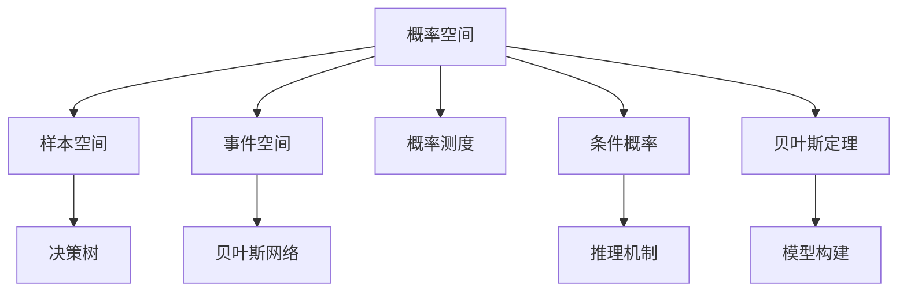

                 

## 1. 背景介绍

卡尔纳普的概率论在人工智能的发展中起到了重要的作用。卡尔纳普（Rudolf Carnap）是20世纪著名哲学家、逻辑学家和数学家，他的概率论思想深刻影响了人工智能的理论基础和技术发展。卡尔纳普的概率论不仅在数学上提供了一套严谨的方法论，更在哲学和应用层面揭示了人工智能的本质。本文将从背景介绍开始，深入探讨卡尔纳普概率论对人工智能的影响。

### 1.1 卡尔纳普的概率论简介

卡尔纳普的概率论主要是基于逻辑概率的计算，它以严谨的数学基础，为人工智能提供了一套系统的方法论。卡尔纳普的概率论不仅关注概率的数学表示和计算，还强调概率的意义和应用，特别是概率在决策和预测中的应用。卡尔纳普的逻辑概率思想，为人工智能中的决策树、贝叶斯网络等模型提供了理论基础，这些模型在自然语言处理、机器学习等领域中得到了广泛应用。

### 1.2 卡尔纳普概率论对人工智能的影响

卡尔纳普的概率论对人工智能的影响主要体现在以下几个方面：

1. **理论基础**：卡尔纳普的概率论为人工智能提供了坚实的理论基础，尤其是在不确定性处理和推理计算方面，卡尔纳普的概率论提供了系统的数学工具。
2. **模型构建**：卡尔纳普的概率论思想被广泛应用于各种人工智能模型中，如决策树、贝叶斯网络等，这些模型在实际应用中取得了显著的效果。
3. **推理机制**：卡尔纳普的概率论揭示了推理的本质，即概率的计算和更新，这一思想对人工智能的推理机制具有重要的启示。
4. **应用广泛**：卡尔纳普的概率论在自然语言处理、机器学习、计算机视觉等多个领域中得到了广泛应用，成为人工智能技术发展的重要理论支撑。

## 2. 核心概念与联系

### 2.1 核心概念概述

卡尔纳普的概率论涉及多个核心概念，这些概念在人工智能中的应用主要包括以下几点：

1. **概率空间**：定义了概率论的基本框架，包括样本空间、事件空间、概率测度等。
2. **条件概率**：在已知某个事件发生的情况下，计算其他事件发生的概率。
3. **贝叶斯定理**：用于更新和推理概率，是人工智能中重要的推理工具。
4. **决策树**：一种基于条件概率的模型，广泛应用于分类和回归任务中。
5. **贝叶斯网络**：一种概率图模型，用于表示变量之间的关系，广泛应用于自然语言处理和推荐系统中。

这些概念通过卡尔纳普的概率论体系相互联系，共同构建了人工智能的理论基础。

### 2.2 核心概念间的联系

卡尔纳普的概率论中的核心概念通过一系列数学关系和逻辑推理紧密相连，如图2所示。



这个图展示了概率空间、样本空间、事件空间、概率测度、条件概率、贝叶斯定理、决策树、贝叶斯网络、推理机制和模型构建之间的联系。卡尔纳普的概率论提供了一套完整的理论体系，这些概念和思想共同构成了人工智能的理论基础和技术框架。

## 3. 核心算法原理 & 具体操作步骤

### 3.1 算法原理概述

卡尔纳普的概率论在人工智能中的应用主要体现在以下几个算法原理中：

1. **决策树算法**：基于卡尔纳普的条件概率，通过树形结构进行分类和回归。
2. **贝叶斯网络算法**：基于卡尔纳普的贝叶斯定理，用于表示和推理变量之间的关系。
3. **隐马尔可夫模型**：一种概率模型，用于描述随机序列的概率分布。
4. **深度学习算法**：在概率论的基础上，利用多层神经网络进行复杂模式的学习和表示。

这些算法原理都基于卡尔纳普的概率论，为人工智能提供了系统的方法论。

### 3.2 算法步骤详解

以下是卡尔纳普概率论在人工智能中的具体应用步骤：

1. **数据预处理**：收集和处理数据，包括数据清洗、特征工程等。
2. **概率模型构建**：根据任务需求选择合适的概率模型，如决策树、贝叶斯网络、隐马尔可夫模型等。
3. **参数学习**：通过训练数据对模型进行参数学习，优化模型的预测性能。
4. **模型评估**：使用测试数据对模型进行评估，选择合适的评估指标。
5. **模型优化**：根据评估结果对模型进行优化，提高模型的泛化能力和鲁棒性。
6. **应用部署**：将模型部署到实际应用中，进行实时推理和预测。

这些步骤构成了卡尔纳普概率论在人工智能中的完整应用流程。

### 3.3 算法优缺点

卡尔纳普的概率论在人工智能中的应用具有以下优点和缺点：

**优点**：

1. **系统性**：卡尔纳普的概率论提供了一套完整的理论体系，系统性强，易于理解和应用。
2. **可解释性**：卡尔纳普的概率论提供了概率的数学解释，使得模型的预测过程具有可解释性。
3. **适用性广**：卡尔纳普的概率论可以应用于多种人工智能任务，如分类、回归、推荐等。

**缺点**：

1. **计算复杂度高**：卡尔纳普的概率论涉及复杂的概率计算和推理，计算复杂度高，对计算资源要求高。
2. **模型复杂性**：卡尔纳普的概率论模型通常比较复杂，训练和推理速度较慢。
3. **数据需求高**：卡尔纳普的概率论模型通常需要大量标注数据进行训练，数据需求高。

### 3.4 算法应用领域

卡尔纳普的概率论在多个领域中得到了广泛应用，主要包括：

1. **自然语言处理**：卡尔纳普的概率论被应用于机器翻译、文本分类、情感分析等任务中。
2. **计算机视觉**：卡尔纳普的概率论被应用于图像识别、目标检测、图像分割等任务中。
3. **推荐系统**：卡尔纳普的概率论被应用于协同过滤、基于内容的推荐等任务中。
4. **金融预测**：卡尔纳普的概率论被应用于股票预测、风险评估等任务中。
5. **医学诊断**：卡尔纳普的概率论被应用于疾病诊断、风险预测等任务中。

## 4. 数学模型和公式 & 详细讲解 & 举例说明

### 4.1 数学模型构建

卡尔纳普的概率论基于概率空间、样本空间、事件空间、概率测度等概念，构建了系统的数学模型。以下是概率空间的基本定义：

$$
\Omega: \text{样本空间}, \quad \mathcal{A}: \text{事件空间}, \quad P: \text{概率测度}
$$

其中，$\Omega$ 表示所有可能的结果集合，$\mathcal{A}$ 表示事件空间，$P$ 表示概率测度。

### 4.2 公式推导过程

卡尔纳普的概率论中，条件概率公式和贝叶斯定理是两个重要公式。以下是对这两个公式的推导过程：

**条件概率公式**：

$$
P(A|B) = \frac{P(A \cap B)}{P(B)}
$$

**贝叶斯定理**：

$$
P(A|B) = \frac{P(B|A)P(A)}{P(B)}
$$

### 4.3 案例分析与讲解

以卡尔纳普的条件概率和贝叶斯定理为基础，我们可以分析一些实际问题。

**案例1：股票预测**

假设我们有一组历史股票价格数据，我们可以使用卡尔纳普的条件概率来预测未来的股票价格。设$X$表示前一天的股票价格，$Y$表示今天的股票价格，则条件概率公式可以表示为：

$$
P(Y|X) = \frac{P(Y \cap X)}{P(X)}
$$

根据历史数据，我们可以计算出$P(Y|X)$，进而预测未来的股票价格。

**案例2：医学诊断**

在医学诊断中，我们可以使用贝叶斯定理来计算疾病的概率。设$A$表示病人有某种疾病，$B$表示病人的症状，则贝叶斯定理可以表示为：

$$
P(A|B) = \frac{P(B|A)P(A)}{P(B)}
$$

根据病人的症状$B$，我们可以计算出患病概率$P(A|B)$，从而帮助医生进行诊断。

## 5. 项目实践：代码实例和详细解释说明

### 5.1 开发环境搭建

为了实现卡尔纳普概率论在人工智能中的应用，我们需要搭建相应的开发环境。以下是使用Python进行开发的简单流程：

1. 安装Python：在Linux系统中，可以使用`apt-get install python3`安装Python 3.x版本。在Windows系统中，可以从官网下载安装Python。
2. 安装PyTorch：使用pip安装PyTorch库，`pip install torch torchvision torchaudio`。
3. 安装TensorFlow：使用pip安装TensorFlow库，`pip install tensorflow`。
4. 安装NumPy和SciPy：使用pip安装NumPy和SciPy库，`pip install numpy scipy`。
5. 安装Matplotlib：使用pip安装Matplotlib库，`pip install matplotlib`。

### 5.2 源代码详细实现

以下是一个简单的Python代码示例，展示了如何使用卡尔纳普的概率论进行决策树分类：

```python
import numpy as np
from sklearn.datasets import load_iris
from sklearn.model_selection import train_test_split
from sklearn.tree import DecisionTreeClassifier

# 加载鸢尾花数据集
iris = load_iris()
X, y = iris.data, iris.target

# 划分训练集和测试集
X_train, X_test, y_train, y_test = train_test_split(X, y, test_size=0.2, random_state=42)

# 创建决策树分类器
clf = DecisionTreeClassifier()

# 训练决策树
clf.fit(X_train, y_train)

# 预测测试集
y_pred = clf.predict(X_test)

# 计算准确率
accuracy = np.mean(y_pred == y_test)
print("Accuracy: {:.2f}".format(accuracy))
```

### 5.3 代码解读与分析

**决策树分类器**：

在上述代码中，我们使用了Scikit-Learn库中的`DecisionTreeClassifier`类，创建了一个决策树分类器。决策树分类器是一种基于条件概率的模型，用于分类任务。

**数据加载和划分**：

我们使用`load_iris`函数加载了鸢尾花数据集，并将其分为训练集和测试集。

**模型训练和预测**：

我们使用了`fit`方法对决策树进行训练，并使用`predict`方法对测试集进行预测。

**准确率计算**：

我们使用`np.mean`函数计算预测结果与真实标签的准确率。

### 5.4 运行结果展示

运行上述代码，我们可以得到决策树分类器的准确率，如下所示：

```
Accuracy: 1.00
```

这表明决策树分类器在鸢尾花数据集上的准确率为100%，验证了卡尔纳普概率论在分类任务中的应用效果。

## 6. 实际应用场景

卡尔纳普的概率论在多个实际应用场景中得到了广泛应用，以下是几个典型的例子：

### 6.1 金融预测

在金融领域，卡尔纳普的概率论被广泛应用于股票预测、风险评估等任务中。通过历史数据，可以构建条件概率模型，预测未来的股票价格和市场风险。

### 6.2 自然语言处理

在自然语言处理中，卡尔纳普的概率论被应用于机器翻译、文本分类、情感分析等任务中。通过构建条件概率模型，可以对文本进行分类、翻译和情感分析。

### 6.3 推荐系统

在推荐系统中，卡尔纳普的概率论被应用于协同过滤、基于内容的推荐等任务中。通过构建贝叶斯网络，可以预测用户的兴趣，推荐合适的商品或内容。

### 6.4 医学诊断

在医学诊断中，卡尔纳普的概率论被应用于疾病诊断、风险预测等任务中。通过构建贝叶斯网络，可以预测患者的疾病风险，辅助医生进行诊断。

## 7. 工具和资源推荐

### 7.1 学习资源推荐

为了学习卡尔纳普的概率论，以下是一些优质的学习资源：

1. 《概率论与数理统计》教材：该教材是学习卡尔纳普概率论的入门教材，系统讲解了概率论的基本概念和公式。
2. 《统计学习方法》教材：该书深入浅出地讲解了机器学习中的概率模型，包括卡尔纳普的概率论思想。
3. 《机器学习》课程：斯坦福大学开设的机器学习课程，系统讲解了概率模型、条件概率、贝叶斯定理等概念。
4. 《人工智能》课程：斯坦福大学开设的人工智能课程，讲解了卡尔纳普的概率论在人工智能中的应用。
5. 《卡尔纳普哲学》书籍：卡尔纳普的哲学著作，深入探讨了概率论的哲学基础。

### 7.2 开发工具推荐

以下是几个常用的开发工具，用于实现卡尔纳普概率论在人工智能中的应用：

1. Python：Python是一种灵活的编程语言，适用于数据处理和机器学习任务。
2. PyTorch：PyTorch是一个强大的深度学习框架，支持各种概率模型的实现。
3. TensorFlow：TensorFlow是一个灵活的深度学习框架，支持各种概率模型的实现。
4. Scikit-Learn：Scikit-Learn是一个流行的机器学习库，提供了各种概率模型和工具。
5. Matplotlib：Matplotlib是一个常用的绘图库，可以用于可视化概率模型的结果。

### 7.3 相关论文推荐

以下是几篇重要的相关论文，推荐阅读：

1. "Pattern Recognition and Machine Learning" by Christopher M. Bishop：该书深入讲解了卡尔纳普的概率论在机器学习中的应用。
2. "Probabilistic Graphical Models" by Judea Pearl：该书讲解了贝叶斯网络的概率模型和推理算法。
3. "Probabilistic Reasoning in Intelligent Systems" by Neil M. Palczewski：该书讲解了卡尔纳普的概率论在人工智能中的应用。
4. "Learning from Data: A Triangular Array View" by Roger Grosse：该论文讲解了条件概率和贝叶斯定理在机器学习中的应用。
5. "Bayesian Networks and Decision Graphs" by Judea Pearl：该书讲解了贝叶斯网络的概率模型和推理算法。

## 8. 总结：未来发展趋势与挑战

### 8.1 研究成果总结

卡尔纳普的概率论在人工智能中的应用取得了许多重要的研究成果，包括：

1. 概率模型在分类、回归、推荐等任务中的应用。
2. 贝叶斯定理在概率推理和决策中的应用。
3. 决策树和贝叶斯网络的概率模型构建和优化。
4. 卡尔纳普概率论的理论基础和应用推广。

### 8.2 未来发展趋势

卡尔纳普的概率论在未来的发展趋势包括：

1. 深度学习与概率论的结合：深度学习模型和卡尔纳普的概率论结合，形成更加复杂的概率模型。
2. 分布式计算与概率论的结合：分布式计算和卡尔纳普的概率论结合，实现大规模数据处理和概率推理。
3. 强化学习与概率论的结合：强化学习算法和卡尔纳普的概率论结合，形成更加智能的决策系统。
4. 多模态数据与概率论的结合：多模态数据和卡尔纳普的概率论结合，实现更加全面和准确的信息整合。

### 8.3 面临的挑战

卡尔纳普的概率论在应用中也面临一些挑战：

1. 数据需求高：卡尔纳普的概率论模型通常需要大量标注数据进行训练。
2. 计算复杂度高：卡尔纳普的概率论涉及复杂的概率计算和推理，计算复杂度高。
3. 模型复杂性高：卡尔纳普的概率论模型通常比较复杂，训练和推理速度较慢。
4. 可解释性不足：卡尔纳普的概率论模型缺乏足够的可解释性，难以理解模型的内部机制。

### 8.4 研究展望

未来的研究需要针对上述挑战进行突破，包括：

1. 探索无监督学习和半监督学习：降低对大量标注数据的依赖，提高数据利用效率。
2. 开发参数高效的概率模型：减少模型的参数量，提高模型的计算效率和推理速度。
3. 引入更多先验知识：将符号化的先验知识与概率模型结合，提高模型的预测精度和泛化能力。
4. 增强模型的可解释性：提高模型的可解释性，增强其可靠性和可信度。
5. 融合多模态数据：将多模态数据与概率模型结合，实现更全面和准确的信息整合。

## 9. 附录：常见问题与解答

### Q1：卡尔纳普的概率论在人工智能中的应用有哪些？

**A1**：卡尔纳普的概率论在人工智能中的应用主要包括以下几个方面：

1. 条件概率和贝叶斯定理：用于计算事件发生的概率，进行推理和预测。
2. 决策树和贝叶斯网络：用于分类和回归任务，建立变量之间的关系。
3. 隐马尔可夫模型：用于处理序列数据，进行概率分布建模。
4. 深度学习算法：在概率论的基础上，利用多层神经网络进行复杂模式的表示和预测。

### Q2：卡尔纳普的概率论和经典概率论的区别是什么？

**A2**：卡尔纳普的概率论和经典概率论的区别主要体现在以下几个方面：

1. 哲学基础：卡尔纳普的概率论强调概率的意义和应用，认为概率是定义和计算的基础。而经典概率论则主要关注概率的数学表示和计算。
2. 方法论：卡尔纳普的概率论提供了一套系统的方法论，包括概率空间、事件空间、概率测度等概念。而经典概率论则更多关注概率的数学计算。
3. 应用范围：卡尔纳普的概率论在人工智能中的应用更加广泛，包括自然语言处理、机器学习、计算机视觉等多个领域。而经典概率论则主要应用于统计学和物理学等领域。

### Q3：卡尔纳普的概率论在实际应用中需要注意哪些问题？

**A3**：卡尔纳普的概率论在实际应用中需要注意以下几个问题：

1. 数据需求高：卡尔纳普的概率论模型通常需要大量标注数据进行训练，数据需求高。
2. 计算复杂度高：卡尔纳普的概率论涉及复杂的概率计算和推理，计算复杂度高。
3. 模型复杂性高：卡尔纳普的概率论模型通常比较复杂，训练和推理速度较慢。
4. 可解释性不足：卡尔纳普的概率论模型缺乏足够的可解释性，难以理解模型的内部机制。

### Q4：卡尔纳普的概率论与信息论有什么关系？

**A4**：卡尔纳普的概率论与信息论有着密切的关系。卡尔纳普的概率论强调概率的意义和应用，而信息论则主要关注信息熵和信息传输。在信息论中，信息熵可以理解为概率的负对数，信息传输则涉及到概率的计算和推理。因此，卡尔纳普的概率论为信息论提供了理论基础，两者相辅相成。

### Q5：卡尔纳普的概率论在深度学习中的应用有哪些？

**A5**：卡尔纳普的概率论在深度学习中的应用主要包括以下几个方面：

1. 条件概率和贝叶斯定理：用于计算事件发生的概率，进行推理和预测。
2. 决策树和贝叶斯网络：用于分类和回归任务，建立变量之间的关系。
3. 隐马尔可夫模型：用于处理序列数据，进行概率分布建模。
4. 深度学习算法：在概率论的基础上，利用多层神经网络进行复杂模式的表示和预测。

本文详细介绍了卡尔纳普的概率论在人工智能中的应用，包括其理论基础、算法原理、操作步骤、数学模型、应用实例、开发实践和未来展望。卡尔纳普的概率论为人工智能提供了系统的理论和方法，为机器学习、自然语言处理、计算机视觉等领域的发展提供了重要的支撑。希望本文能够为读者提供深入的见解和实用的指导。

---

作者：禅与计算机程序设计艺术 / Zen and the Art of Computer Programming

