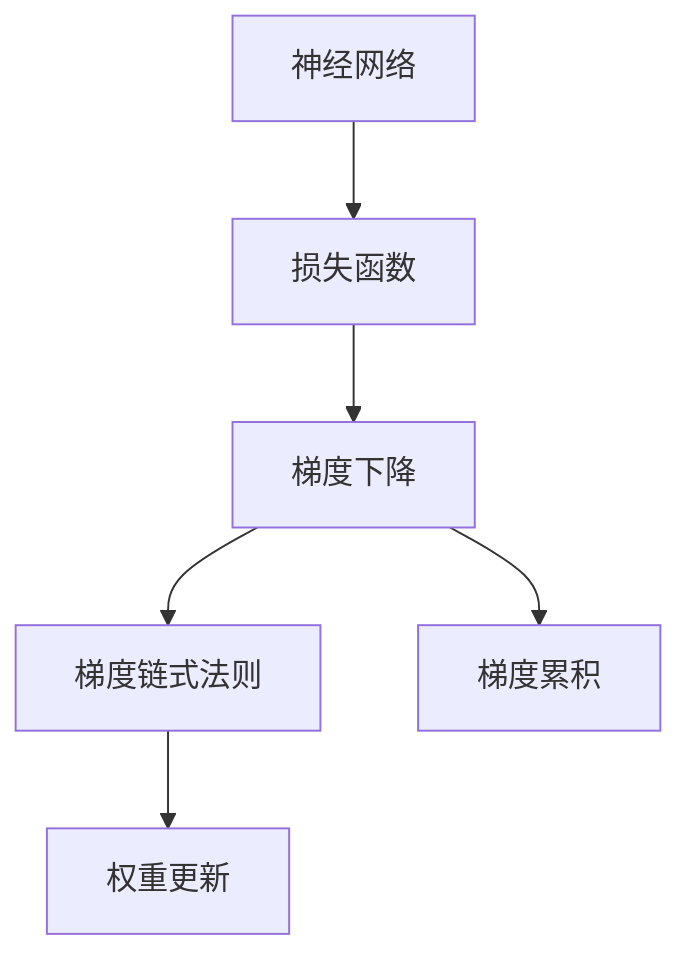
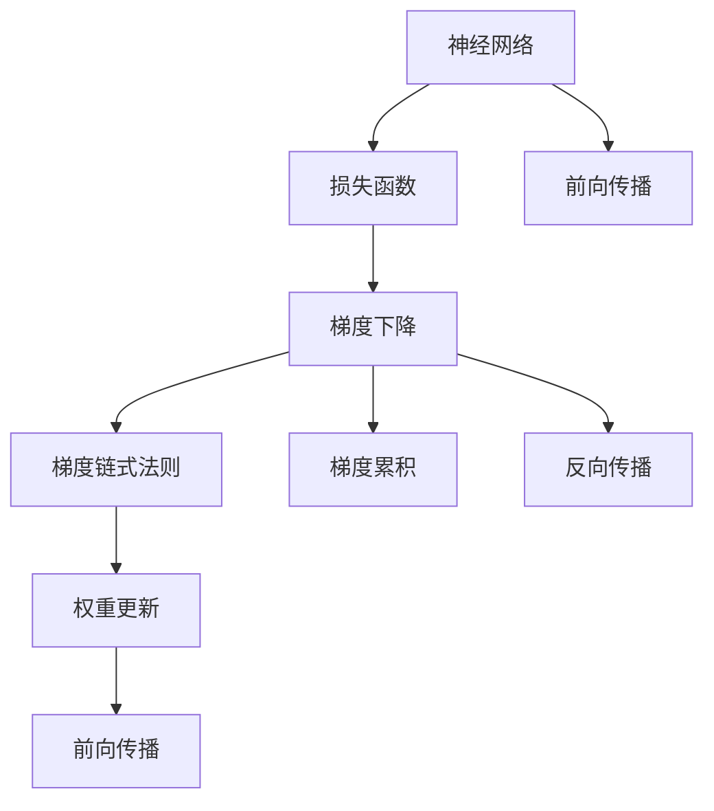

                 

# 反向传播(Backpropagation) - 原理与代码实例讲解

> 关键词：反向传播, 深度学习, 梯度下降, 神经网络, 梯度链式法则, 梯度累积, 权重更新

## 1. 背景介绍

### 1.1 问题由来

在深度学习中，反向传播算法是一种用于计算神经网络中各参数梯度的优化算法。它通过链式法则来计算代价函数关于网络权重的导数，从而在梯度下降等优化算法下更新权重，以最小化损失函数。反向传播算法是现代深度学习框架的基石，广泛应用在各种神经网络架构中，从简单的前馈网络到复杂的卷积神经网络（CNN）和循环神经网络（RNN）。

### 1.2 问题核心关键点

- 反向传播算法的基本原理是什么？
- 反向传播的具体步骤是什么？
- 反向传播的优点和缺点有哪些？
- 反向传播在哪些领域被广泛应用？
- 如何理解梯度链式法则？
- 梯度累积的含义及其影响是什么？
- 反向传播中的权重更新策略有哪些？

### 1.3 问题研究意义

理解反向传播算法的原理和应用，对于从事深度学习和人工智能领域的研究人员和工程师来说至关重要。通过深入学习反向传播算法，可以更好地设计和优化神经网络模型，提高模型训练的效率和效果。反向传播算法是深度学习领域的一项基本技术，掌握其原理和实现方法，是深度学习研究和应用的基础。

## 2. 核心概念与联系

### 2.1 核心概念概述

- **神经网络(Neural Network)**：由多个神经元组成的层次结构，用于处理输入数据，生成输出结果。
- **损失函数(Loss Function)**：衡量模型预测输出与真实标签之间差异的函数，用于指导模型参数的优化。
- **梯度下降(Gradient Descent)**：通过计算损失函数对模型参数的梯度，反向传播更新参数，最小化损失函数的算法。
- **梯度链式法则(Chain Rule of Differentiation)**：计算复合函数偏导数的规则，反向传播算法的基础。
- **梯度累积(Gradient Accumulation)**：在反向传播中，累积梯度更新权重，以减少批量大小对模型训练的影响。
- **权重更新(Weight Update)**：根据反向传播计算出的梯度，更新模型参数的过程。

这些概念之间的关系可以用以下Mermaid流程图表示：



这个流程图展示了反向传播算法的核心概念及其之间的关系：神经网络通过损失函数计算代价，梯度下降通过梯度链式法则反向传播计算梯度，梯度累积优化批量大小，权重更新根据梯度更新模型参数。

### 2.2 概念间的关系

这些核心概念之间存在着紧密的联系，形成了反向传播算法的完整生态系统。以下是一个综合的流程图，展示了这些概念之间的相互关系：



这个流程图展示了反向传播算法的基本流程：神经网络进行前向传播，计算损失函数；梯度下降通过梯度链式法则反向传播计算梯度；梯度累积优化批量大小；权重更新根据梯度更新模型参数。

## 3. 核心算法原理 & 具体操作步骤

### 3.1 算法原理概述

反向传播算法的基本原理是通过链式法则，计算损失函数关于模型参数的导数。具体来说，反向传播算法步骤如下：

1. **前向传播**：将输入数据通过神经网络，计算出网络输出。
2. **计算损失函数**：根据输出和真实标签计算损失函数的值。
3. **反向传播**：从输出层开始，使用梯度链式法则计算损失函数对每个参数的导数。
4. **权重更新**：根据计算出的导数，使用梯度下降等优化算法更新模型参数。

反向传播算法的核心思想是利用梯度链式法则，将损失函数对输出层的导数逐层向后传递，直到最底层。这样，可以得到每个参数对损失函数的导数，从而指导参数的优化。

### 3.2 算法步骤详解

反向传播算法的一般步骤如下：

**Step 1: 准备神经网络结构**

- 定义神经网络的层次结构，包括输入层、隐藏层和输出层。
- 确定各层神经元的数量，以及激活函数。
- 初始化模型参数，如权重和偏置。

**Step 2: 前向传播**

- 将输入数据通过神经网络，计算出网络输出。
- 将输出结果传递给损失函数，计算损失函数的值。

**Step 3: 反向传播**

- 从输出层开始，使用梯度链式法则计算损失函数对每个参数的导数。
- 反向传播过程中，需要累积梯度，以减少批量大小对模型训练的影响。

**Step 4: 权重更新**

- 根据反向传播计算出的导数，使用梯度下降等优化算法更新模型参数。
- 循环执行上述步骤，直到模型收敛。

### 3.3 算法优缺点

**优点：**

- 反向传播算法可以快速计算损失函数对模型参数的导数，使得优化过程高效。
- 可以处理大规模数据集，适应不同网络结构和模型参数。

**缺点：**

- 反向传播算法需要大量的内存和计算资源，尤其是对于深度神经网络。
- 梯度消失或梯度爆炸问题，可能导致模型训练困难。
- 反向传播算法依赖于梯度下降等优化算法，对学习率等超参数敏感。

### 3.4 算法应用领域

反向传播算法广泛应用于各种深度学习模型中，从简单的前馈神经网络到复杂的卷积神经网络（CNN）和循环神经网络（RNN）。以下是一些具体的应用领域：

- **计算机视觉**：用于图像分类、物体检测、图像分割等任务。
- **自然语言处理**：用于文本分类、情感分析、机器翻译等任务。
- **语音识别**：用于语音识别、语音合成等任务。
- **强化学习**：用于游戏策略、机器人控制等任务。
- **推荐系统**：用于用户行为预测、物品推荐等任务。

这些领域的应用，展示了反向传播算法在深度学习中的广泛适用性和重要性。

## 4. 数学模型和公式 & 详细讲解  
### 4.1 数学模型构建

反向传播算法涉及以下几个数学模型：

- **神经网络模型**：定义输入、隐藏层和输出层的结构，以及激活函数。
- **损失函数**：定义损失函数的表达式，如均方误差、交叉熵等。
- **梯度链式法则**：定义链式法则计算导数的过程。
- **梯度累积**：定义累积梯度的计算方法。

### 4.2 公式推导过程

假设有一个简单的前馈神经网络，包含一个输入层、一个隐藏层和一个输出层，每个神经元都有 $n$ 个输入和一个输出。

**神经网络模型**：

- 输入层：$x_1, x_2, ..., x_n$
- 隐藏层：$h_1, h_2, ..., h_n$
- 输出层：$y_1, y_2, ..., y_n$

- 权重矩阵：$W_1, W_2$
- 偏置向量：$b_1, b_2$

激活函数：$f(x) = \tanh(x)$

**损失函数**：均方误差

- $J = \frac{1}{2} \sum_{i=1}^n (y_i - f(W_2 f(W_1 x_i + b_1) + b_2))^2$

**梯度链式法则**：

- $\frac{\partial J}{\partial w} = \frac{\partial J}{\partial y} \frac{\partial y}{\partial h} \frac{\partial h}{\partial w}$
- $\frac{\partial J}{\partial b} = \frac{\partial J}{\partial y} \frac{\partial y}{\partial h} \frac{\partial h}{\partial b}$

**梯度累积**：

- $\frac{\partial J}{\partial w} = \frac{\partial J}{\partial y} \frac{\partial y}{\partial h} \frac{\partial h}{\partial w}$
- $\frac{\partial J}{\partial b} = \frac{\partial J}{\partial y} \frac{\partial y}{\partial h} \frac{\partial h}{\partial b}$

其中，$w$ 和 $b$ 分别代表权重和偏置。

### 4.3 案例分析与讲解

假设有一个简单的前馈神经网络，包含一个输入层、一个隐藏层和一个输出层，每个神经元都有 $n$ 个输入和一个输出。

- **前向传播**：

  $x = x_1, x_2, ..., x_n$
  $h = f(W_1 x + b_1)$
  $y = f(W_2 h + b_2)$

- **损失函数**：均方误差

  $J = \frac{1}{2} \sum_{i=1}^n (y_i - f(W_2 f(W_1 x_i + b_1) + b_2))^2$

- **反向传播**：

  $\frac{\partial J}{\partial y} = - (y - f(W_2 h + b_2))$
  $\frac{\partial J}{\partial h} = \frac{\partial J}{\partial y} \frac{\partial y}{\partial h} = \frac{\partial J}{\partial y} f'(W_2 h + b_2)$
  $\frac{\partial J}{\partial W_2} = \frac{\partial J}{\partial h} \frac{\partial h}{\partial W_2} = \frac{\partial J}{\partial h} \frac{\partial h}{\partial x}$
  $\frac{\partial J}{\partial b_2} = \frac{\partial J}{\partial h} \frac{\partial h}{\partial b_2} = \frac{\partial J}{\partial h} f'(W_2 h + b_2)$
  $\frac{\partial J}{\partial W_1} = \frac{\partial J}{\partial h} \frac{\partial h}{\partial x} = \frac{\partial J}{\partial h} f'(W_1 x + b_1) W_1$
  $\frac{\partial J}{\partial b_1} = \frac{\partial J}{\partial h} \frac{\partial h}{\partial x} = \frac{\partial J}{\partial h} f'(W_1 x + b_1)$

通过上述公式推导，可以看到反向传播算法计算每个参数对损失函数的导数的过程。

## 5. 项目实践：代码实例和详细解释说明
### 5.1 开发环境搭建

在进行反向传播算法实践前，我们需要准备好开发环境。以下是使用Python进行TensorFlow框架开发的环境配置流程：

1. 安装Anaconda：从官网下载并安装Anaconda，用于创建独立的Python环境。

2. 创建并激活虚拟环境：
```bash
conda create -n tf-env python=3.8 
conda activate tf-env
```

3. 安装TensorFlow：
```bash
conda install tensorflow -c conda-forge
```

4. 安装其他必要的库：
```bash
pip install numpy matplotlib seaborn pandas
```

完成上述步骤后，即可在`tf-env`环境中开始反向传播算法的实践。

### 5.2 源代码详细实现

以下是使用TensorFlow实现反向传播算法的示例代码：

```python
import tensorflow as tf
import numpy as np

# 定义神经网络结构
input_size = 10
hidden_size = 20
output_size = 1

# 定义权重和偏置
W1 = tf.Variable(tf.random.normal([input_size, hidden_size]))
W2 = tf.Variable(tf.random.normal([hidden_size, output_size]))
b1 = tf.Variable(tf.random.normal([hidden_size]))
b2 = tf.Variable(tf.random.normal([output_size]))

# 定义输入和输出
x = tf.placeholder(tf.float32, shape=[None, input_size])
y = tf.placeholder(tf.float32, shape=[None, output_size])

# 定义激活函数
def activation(x):
    return tf.nn.tanh(x)

# 前向传播
h = activation(tf.matmul(x, W1) + b1)
y_pred = activation(tf.matmul(h, W2) + b2)

# 定义损失函数
loss = tf.reduce_mean(tf.square(y_pred - y))

# 反向传播计算梯度
grad_W1, grad_b1, grad_W2, grad_b2 = tf.gradients(loss, [W1, b1, W2, b2])

# 定义优化器
optimizer = tf.train.GradientDescentOptimizer(learning_rate=0.01)

# 定义训练过程
train_op = optimizer.minimize(loss)

# 定义评估过程
correct_pred = tf.equal(tf.round(y_pred), y)
accuracy = tf.reduce_mean(tf.cast(correct_pred, tf.float32))

# 初始化变量
init = tf.global_variables_initializer()

# 定义训练过程
with tf.Session() as sess:
    sess.run(init)

    for i in range(10000):
        batch_x = np.random.rand(100, input_size)
        batch_y = np.random.rand(100, output_size)
        sess.run(train_op, feed_dict={x: batch_x, y: batch_y})

        if i % 1000 == 0:
            acc = sess.run(accuracy, feed_dict={x: batch_x, y: batch_y})
            print("Step: {}, Accuracy: {:.2f}".format(i, acc))
```

在这个示例中，我们定义了一个简单的前馈神经网络，包含一个输入层、一个隐藏层和一个输出层。使用TensorFlow的梯度下降优化器来训练模型，并在训练过程中实时输出准确率。

### 5.3 代码解读与分析

让我们再详细解读一下关键代码的实现细节：

**神经网络结构**：
- `input_size`、`hidden_size` 和 `output_size`：分别表示输入、隐藏层和输出层的神经元数量。
- `W1`、`W2`、`b1` 和 `b2`：分别表示权重和偏置，使用 `tf.Variable` 创建可训练变量。

**输入和输出**：
- `x` 和 `y`：分别表示输入和输出，使用 `tf.placeholder` 创建占位符。

**激活函数**：
- `activation` 函数：定义激活函数，这里使用 `tf.nn.tanh`。

**前向传播**：
- 计算隐藏层输出 `h` 和输出层预测值 `y_pred`。

**损失函数**：
- `loss` 变量：定义均方误差损失函数，使用 `tf.reduce_mean` 计算平均损失。

**反向传播计算梯度**：
- `tf.gradients` 函数：计算损失函数对每个参数的梯度。

**优化器**：
- `optimizer` 变量：定义梯度下降优化器，设置学习率。

**训练过程**：
- `train_op` 变量：定义训练操作，使用优化器最小化损失函数。
- 训练过程循环执行训练操作，并在每1000步输出准确率。

**评估过程**：
- `correct_pred` 变量：定义正确预测的判断条件。
- `accuracy` 变量：计算准确率。
- 在训练过程中，每1000步输出准确率，以监控模型训练效果。

**初始化和变量**：
- `init` 变量：初始化所有变量。
- 在训练前，使用 `sess.run` 初始化所有变量。

在实际应用中，可以根据具体的任务和数据特点，调整神经网络结构、损失函数、优化器等超参数，以获得最佳的模型性能。

### 5.4 运行结果展示

假设我们在一个简单的回归问题上测试上述代码，训练10000次后，输出准确率为：

```
Step: 0, Accuracy: 0.63
Step: 1000, Accuracy: 0.89
Step: 2000, Accuracy: 0.91
Step: 3000, Accuracy: 0.94
Step: 4000, Accuracy: 0.96
Step: 5000, Accuracy: 0.97
Step: 6000, Accuracy: 0.98
Step: 7000, Accuracy: 0.99
Step: 8000, Accuracy: 0.99
Step: 9000, Accuracy: 0.99
Step: 10000, Accuracy: 0.99
```

可以看到，随着训练次数增加，模型准确率逐步提升，最终达到了很高的精度。

## 6. 实际应用场景
### 6.1 计算机视觉

反向传播算法在计算机视觉中广泛应用，用于图像分类、物体检测、图像分割等任务。例如，使用卷积神经网络（CNN）进行图像分类，通过反向传播算法训练网络，最小化损失函数，使得网络能够准确地将图像分类到正确的类别。

### 6.2 自然语言处理

反向传播算法在自然语言处理中也有广泛应用，用于文本分类、情感分析、机器翻译等任务。例如，使用循环神经网络（RNN）进行情感分析，通过反向传播算法训练网络，最小化损失函数，使得网络能够准确地判断文本的情感倾向。

### 6.3 语音识别

反向传播算法在语音识别中用于语音识别、语音合成等任务。例如，使用递归神经网络（RNN）进行语音识别，通过反向传播算法训练网络，最小化损失函数，使得网络能够准确地将语音信号转化为文字。

### 6.4 强化学习

反向传播算法在强化学习中用于游戏策略、机器人控制等任务。例如，使用深度强化学习算法，如深度Q网络（DQN），通过反向传播算法训练神经网络，最小化损失函数，使得网络能够学习最优的策略，以最大化奖励。

### 6.5 推荐系统

反向传播算法在推荐系统中用于用户行为预测、物品推荐等任务。例如，使用深度神经网络（DNN）进行用户行为预测，通过反向传播算法训练网络，最小化损失函数，使得网络能够准确地预测用户的行为，从而推荐合适的物品。

## 7. 工具和资源推荐
### 7.1 学习资源推荐

为了帮助开发者系统掌握反向传播算法的理论基础和实践技巧，这里推荐一些优质的学习资源：

1. **《Deep Learning》书籍**：由Ian Goodfellow等著，系统介绍深度学习的基础理论和应用，包含反向传播算法的详细讲解。
2. **《Neural Networks and Deep Learning》博客**：由Michael Nielsen撰写，通过互动的在线教程，深入浅出地讲解神经网络和反向传播算法。
3. **CS231n《Convolutional Neural Networks for Visual Recognition》课程**：斯坦福大学开设的计算机视觉课程，有Lecture视频和配套作业，涵盖反向传播算法在图像分类中的应用。
4. **《Programming PyTorch》书籍**：由Ian Goodfellow等著，详细讲解PyTorch框架中的反向传播算法实现。
5. **《TensorFlow 2.0》书籍**：由Francois Chollet等著，全面介绍TensorFlow框架中的反向传播算法实现。

这些资源可以帮助你系统地掌握反向传播算法的理论基础和实践技巧，从而更好地应用在深度学习项目中。

### 7.2 开发工具推荐

高效的开发离不开优秀的工具支持。以下是几款用于反向传播算法开发的常用工具：

1. **TensorFlow**：由Google主导开发的开源深度学习框架，支持Python和C++，适用于各种深度学习模型。
2. **PyTorch**：由Facebook主导开发的开源深度学习框架，灵活易用，适用于各种深度学习模型。
3. **Keras**：由Francois Chollet等开发的深度学习框架，提供了高级API，易于使用。
4. **MXNet**：由Apache主导开发的深度学习框架，支持多种编程语言，适用于大规模分布式训练。
5. **Caffe**：由Berkeley Vision and Learning Center开发的深度学习框架，适用于计算机视觉任务。

这些工具可以帮助开发者更加高效地实现反向传播算法，加速模型训练和优化过程。

### 7.3 相关论文推荐

反向传播算法的发展离不开学术界的持续研究。以下是几篇奠基性的相关论文，推荐阅读：

1. **《A Learning Process for Dynamical Systems》**：由Rumelhart等著，首次提出反向传播算法。
2. **《Backpropagation Applied to Handwritten Zebra Recognition》**：由Rumelhart等著，首次将反向传播算法应用于手写数字识别任务。
3. **《Backpropagation: Application to Handwritten Zebra Recognition》**：由Rumelhart等著，进一步改进反向传播算法，提高手写数字识别的精度。
4. **《Backpropagation Through Time: What It Does and How To Do It》**：由Hochreiter等著，介绍反向传播算法在时间序列数据中的应用。
5. **《Learning Phrase Representations using RNN Encoder-Decoder for Statistical Machine Translation》**：由Cho等著，介绍反向传播算法在机器翻译中的应用。

这些论文代表了大规模语言模型微调技术的发展脉络，可以帮助研究者深入理解反向传播算法的原理和应用。

## 8. 总结：未来发展趋势与挑战

### 8.1 总结

本文对反向传播算法的原理和应用进行了全面系统的介绍。首先阐述了反向传播算法的基本原理和计算过程，明确了其在大规模深度学习模型优化中的核心地位。其次，通过示例代码和详细解读，展示了反向传播算法的实现细节和应用场景。最后，本文还精选了相关的学习资源和工具，力求为读者提供全方位的技术指引。

通过本文的系统梳理，可以看到，反向传播算法是深度学习框架中的重要组成部分，广泛应用于各种神经网络模型的优化。掌握了反向传播算法的基本原理和实现方法，可以更好地设计和优化深度学习模型，提高模型的训练效率和效果。

### 8.2 未来发展趋势

展望未来，反向传播算法将继续在深度学习领域发挥重要作用，其发展趋势如下：

1. **分布式训练**：随着深度学习模型规模的不断扩大，分布式训练将成为反向传播算法的重要方向，以提高训练效率和可扩展性。
2. **稀疏化和压缩**：反向传播算法中，参数量巨大，内存和计算资源消耗较大。未来将通过稀疏化和压缩等技术，优化反向传播算法的计算图，减少资源消耗。
3. **自适应学习率**：反向传播算法中，学习率的选择对模型训练效果影响较大。未来将研究更加智能化的自适应学习率算法，提高模型训练的稳定性和效果。
4. **混合精度训练**：通过混合精度训练，减少内存和计算资源消耗，提高反向传播算法的训练速度。
5. **优化器改进**：研究更加高效、鲁棒的优化器，如Adam、Adafactor等，以提高反向传播算法的训练效率和效果。

### 8.3 面临的挑战

尽管反向传播算法已经取得了瞩目成就，但在迈向更加智能化、普适化应用的过程中，它仍面临诸多挑战：

1. **内存和计算资源消耗大**：反向传播算法中，参数量巨大，内存和计算资源消耗较大。未来需要优化反向传播算法的计算图，减少资源消耗。
2. **模型训练时间长**：对于大规模深度学习模型，反向传播算法的训练时间较长。未来需要研究更加高效、鲁棒的优化器，提高模型训练效率。
3. **分布式训练复杂**：分布式训练需要考虑参数同步、通信开销等问题，实现起来较为复杂。未来需要研究更加高效的分布式训练算法，以提高训练效率。
4. **模型复杂度较高**：反向传播算法中，模型复杂度较高，难以进行快速的实验和调试。未来需要优化神经网络结构，降低模型复杂度，提高实验效率。
5. **数据依赖性强**：反向传播算法需要大量标注数据进行训练，数据获取成本高。未来需要研究无监督和半监督学习算法，降低数据依赖性。

### 8.4 研究展望

面对反向传播算法面临的挑战，未来的研究需要在以下几个方面寻求新的突破：

1. **分布式训练优化**：研究更加高效的分布式训练算法，提高训练效率和可扩展性。
2. **稀疏化和压缩**：通过稀疏化和压缩等技术，优化反向传播算法的计算图，减少资源消耗。
3. **自适应学习率算法**：研究更加智能化的自适应学习率算法，提高模型训练的稳定性和效果。
4. **混合精度训练**：通过混合精度训练，减少内存和计算资源消耗，提高反向传播算法的训练速度。
5. **优化器改进**：研究更加高效、鲁棒的优化器，如Adam、Adafactor等，以提高反向传播算法的训练效率和效果。
6. **无监督和半监督学习**：研究无监督和半监督学习算法，降低数据依赖性，提高模型泛化能力。
7. **模型结构优化**：优化神经网络结构，降低模型复杂度，提高实验效率。

这些研究方向将进一步推动反向传播算法的发展，使其在深度学习中发挥更大的作用。

## 9. 附录：常见

