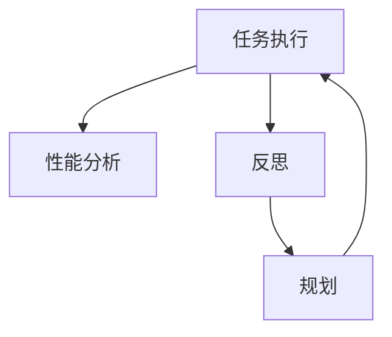
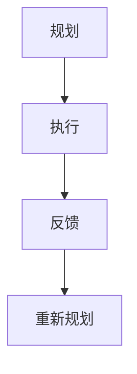

                 

# 反思与规划的结合：优化任务执行

> 关键词：任务执行, 优化, 反思, 规划, 持续改进, 性能分析

## 1. 背景介绍

### 1.1 问题由来

随着软件开发规模的日益增大，代码维护、性能优化等任务变得越来越复杂。然而，许多项目往往缺乏系统化的反思与规划机制，导致问题积累、资源浪费、进度延迟等不良后果。这些问题在大型软件开发、复杂系统构建、以及项目管理中尤为突出。为了应对这些挑战，本文聚焦于如何通过反思与规划的结合，实现任务执行的持续优化。

### 1.2 问题核心关键点

本节将介绍任务执行优化过程中需要考虑的几个核心关键点，包括：

- 如何系统化地进行代码和性能分析，发现问题和瓶颈。
- 如何进行系统化反思，明确优化方向和改进措施。
- 如何将反思成果转化为具体的规划和执行策略。
- 如何持续监控和评估优化效果，形成良性循环。

### 1.3 问题研究意义

通过反思与规划的结合，优化任务执行不仅能够有效提升开发效率和产品质量，还能够显著降低项目风险和成本。具体来说：

- **提升开发效率**：通过系统化反思和规划，开发者能够快速识别问题，采取针对性措施，减少无谓的调试和回退时间。
- **提高产品质量**：系统化反思可以揭示系统性问题，并确保优化措施覆盖全链路，从而提升代码质量和稳定性。
- **降低项目风险**：系统化反思和规划使得项目进展可控，减少由于缺乏整体把控而导致的进度延期和资源浪费。
- **优化资源配置**：反思成果转化为具体的执行策略，可以合理分配项目资源，实现最优资源利用。

## 2. 核心概念与联系

### 2.1 核心概念概述

为了更好地理解如何通过反思与规划优化任务执行，本节将介绍几个核心概念：

- **任务执行**：指将需求转化为可执行代码的过程，包括需求分析、系统设计、编码、测试、部署等环节。
- **性能分析**：通过一系列工具和技术，量化分析代码和系统的性能指标，如响应时间、资源占用、稳定性等。
- **反思**：基于已有结果，系统地回顾任务执行过程中的错误和不足，总结经验教训，形成改进策略。
- **规划**：将反思结果转化为具体的执行策略和行动计划，指导未来的任务执行。
- **持续改进**：通过反思和规划的循环，不断提升任务执行效率和质量，形成良性循环。

这些概念之间的逻辑关系可以通过以下Mermaid流程图来展示：



这个流程图展示了一个完整的任务执行优化流程：首先进行任务执行，然后进行性能分析，基于分析结果进行反思，根据反思结果制定规划，最后通过执行规划对任务执行进行持续优化。通过这样的循环，可以不断提升任务执行的效率和质量。

### 2.2 概念间的关系

这些核心概念之间存在着紧密的联系，形成了任务执行优化的完整生态系统。下面我们通过几个Mermaid流程图来展示这些概念之间的关系。

#### 2.2.1 任务执行优化流程


这个流程图展示了任务执行优化的基本流程，包括执行、分析、反思和规划。执行是基础，分析揭示问题，反思总结经验，规划指导改进。

#### 2.2.2 性能分析与反思的互动


性能分析是反思的前提，通过性能分析发现的问题为反思提供了方向，进而通过反思提炼出优化方向和策略。

#### 2.2.3 规划与执行的衔接



规划制定后，通过执行实施，执行过程中收集的反馈用于优化下一轮规划，形成持续改进的循环。

## 3. 核心算法原理 & 具体操作步骤

### 3.1 算法原理概述

任务执行优化本质上是一个基于数据的持续改进过程。其核心原理是通过系统化地收集、分析和反思任务执行数据，发现问题，制定优化措施，并通过执行策略将其付诸实践，最终评估优化效果，形成良性循环。

### 3.2 算法步骤详解

基于上述原理，任务执行优化可以按照以下步骤进行：

1. **数据收集**：收集任务执行过程中的关键数据，如代码质量指标、性能监控数据、用户反馈等。
2. **性能分析**：通过数据分析工具，量化评估代码和系统的性能表现，识别问题和瓶颈。
3. **系统化反思**：基于性能分析结果，系统地回顾任务执行过程中的错误和不足，总结经验教训，形成改进策略。
4. **规划制定**：将反思结果转化为具体的执行策略和行动计划，指导未来的任务执行。
5. **执行与反馈**：执行规划中的措施，并收集反馈信息，评估优化效果。
6. **持续改进**：根据反馈信息调整规划，进入下一轮优化循环。

### 3.3 算法优缺点

系统化反思与规划的任务执行优化方法具有以下优点：

- **系统化**：通过数据驱动，避免凭感觉和经验进行优化，提升决策的科学性和合理性。
- **全面性**：涵盖任务执行的各个环节，识别出系统性问题，保证优化措施的全面性。
- **持续性**：通过循环优化，不断提升任务执行效率和质量，形成持续改进的良性循环。

同时，该方法也存在以下局限性：

- **数据依赖**：优化效果依赖于数据的质量和完整性，数据不足或数据偏差会影响优化结果。
- **复杂性**：系统化反思和规划需要耗费大量时间和精力，对项目团队的要求较高。
- **实施难度**：某些优化措施的执行可能需要调整系统架构或代码，实施难度较大。
- **资源需求**：性能分析、系统化反思等环节需要各种工具和技术支持，资源需求较高。

### 3.4 算法应用领域

系统化反思与规划的方法不仅可以用于软件开发，还适用于复杂系统的构建和项目管理。具体应用领域包括：

- **软件开发**：代码质量、性能优化、测试自动化、持续集成和持续部署等。
- **系统构建**：大数据平台、云计算环境、网络安全系统等。
- **项目管理**：项目进度跟踪、资源配置、风险管理等。

## 4. 数学模型和公式 & 详细讲解 & 举例说明

### 4.1 数学模型构建

为了更好地理解系统化反思与规划的理论基础，我们可以从数学模型的角度对其进行构建。

记任务执行的各个环节为 $T=\{t_1, t_2, \ldots, t_n\}$，其中 $t_i$ 表示任务执行中的第 $i$ 个环节。设 $E_t$ 为任务执行中环节 $t$ 的评估指标，如代码质量、性能、用户满意度等。设 $D_t$ 为环节 $t$ 的历史数据，$O_t$ 为优化措施，$R_t$ 为环节 $t$ 的改进效果。则任务执行优化的数学模型可以表示为：

$$
\min_{O_t} \sum_{t\in T} \frac{1}{|D_t|} \sum_{d \in D_t} (E_d - E_{d^{\prime}})^2
$$

其中 $d^{\prime}$ 表示采取优化措施 $O_t$ 后的评估指标值。

### 4.2 公式推导过程

在上述模型中，优化目标是最小化任务执行中各个环节的评估指标与优化后的指标之间的差距。具体的公式推导过程如下：

1. 首先，对于任务执行中的每个环节 $t$，计算其历史数据 $D_t$ 的平均评估指标 $E_t = \frac{1}{|D_t|} \sum_{d \in D_t} E_d$。
2. 然后，计算优化措施 $O_t$ 对环节 $t$ 的影响，得到优化后的评估指标 $E_{t^{\prime}} = E_t + O_t$。
3. 最终，任务执行优化的目标是最小化各个环节的平均评估指标与优化后的平均评估指标之间的差距，即：

$$
\min_{O_t} \sum_{t\in T} \frac{1}{|D_t|} \sum_{d \in D_t} (E_d - E_{d^{\prime}})^2
$$

### 4.3 案例分析与讲解

为了更直观地理解上述数学模型的应用，以下我们以代码质量优化为例，详细讲解其推导和应用过程。

设 $T=\{Coding, Testing, Deployment\}$ 表示任务执行中的编码、测试和部署三个环节。记 $E_C$、$E_T$、$E_D$ 分别为这三个环节的代码质量指标。假设每个环节的历史数据分别为 $D_C = \{d_{C1}, d_{C2}, \ldots\}$、$D_T = \{d_{T1}, d_{T2}, \ldots\}$、$D_D = \{d_{D1}, d_{D2}, \ldots\}$，优化措施分别为 $O_C$、$O_T$、$O_D$。则优化目标可以表示为：

$$
\min_{O_C, O_T, O_D} \frac{1}{|D_C|} \sum_{d_C \in D_C} (E_{Cd_C} - E_{Cd_C^{\prime}})^2 + \frac{1}{|D_T|} \sum_{d_T \in D_T} (E_{Td_T} - E_{Td_T^{\prime}})^2 + \frac{1}{|D_D|} \sum_{d_D \in D_D} (E_{Dd_D} - E_{Dd_D^{\prime}})^2
$$

其中 $E_{Cd_C} = E_C(d_C)$、$E_{Cd_C^{\prime}} = E_C(d_C + O_C)$ 分别表示编码环节的历史和优化后的代码质量指标，类似地定义 $E_{Td_T}$ 和 $E_{Td_T^{\prime}}$、$E_{Dd_D}$ 和 $E_{Dd_D^{\prime}}$。

## 5. 项目实践：代码实例和详细解释说明

### 5.1 开发环境搭建

在进行任务执行优化实践前，我们需要准备好开发环境。以下是使用Python进行项目开发的典型环境配置流程：

1. 安装Anaconda：从官网下载并安装Anaconda，用于创建独立的Python环境。

2. 创建并激活虚拟环境：
```bash
conda create -n task-opt-env python=3.8 
conda activate task-opt-env
```

3. 安装Python和相关库：
```bash
pip install numpy pandas matplotlib seaborn
```

4. 安装第三方库：
```bash
pip install plotly dask gitpython scipy numpy
```

5. 配置代码仓库：
```bash
git clone https://github.com/your-username/your-repository.git
cd your-repository
```

完成上述步骤后，即可在`task-opt-env`环境中开始任务执行优化实践。

### 5.2 源代码详细实现

这里以代码质量优化为例，提供基于GitHub代码仓库的任务执行优化实践代码实现。

首先，导入必要的库：

```python
import pandas as pd
import numpy as np
import matplotlib.pyplot as plt
import seaborn as sns
from plotly.offline import iplot
from dask import dataframe as dd
from git import Repo
from scipy.stats import ttest_ind
```

然后，定义数据收集和处理函数：

```python
def collect_data(repo_path, branches):
    # 获取Git仓库信息
    repo = Repo(repo_path)
    branches = [branch.replace("origin/", "") for branch in branches]
    
    # 收集各分支代码质量指标数据
    df = pd.DataFrame(columns=["Branch", "CodingQuality"])
    for branch in branches:
        branch_df = pd.read_csv(f"{repo_path}/output/{branch}.txt", sep="\t")
        branch_df["Branch"] = branch
        df = pd.concat([df, branch_df], ignore_index=True)
    
    return df

def preprocess_data(df):
    # 数据清洗和处理
    df.fillna(method="ffill", inplace=True)
    df.dropna(inplace=True)
    return df

def plot_quality(df, branch):
    # 绘制代码质量指标分布图
    sns.histplot(df[df["Branch"] == branch]["CodingQuality"], kde=True)
    plt.title(f"Code Quality Distribution for {branch}")
    plt.xlabel("Code Quality Index")
    plt.ylabel("Frequency")
    plt.show()

def compute_diff(df, branch):
    # 计算优化前后代码质量指标差值
    df[f"QualityDifference{branch}"] = df[df["Branch"] == branch]["CodingQuality"].diff()
    return df

def ttest(df, branch):
    # 计算分支间代码质量指标差异的t-test
    x = df[df["Branch"] == branch]["CodingQuality"]
    y = df[df["Branch"] == "master"]["CodingQuality"]
    t, p = ttest_ind(x, y)
    return t, p

def analyze(df):
    # 分析代码质量指标变化
    diff = compute_diff(df, "feature")
    t, p = ttest(df, "feature")
    if p < 0.05:
        return f"Feature branch coding quality significantly improved with p-value: {p:.4f}"
    else:
        return "No significant change in coding quality"
```

接下来，定义任务执行优化函数：

```python
def optimize_code_quality(df, branch):
    # 数据收集
    df = collect_data("your-repository-path", branches=["master", "feature"])
    
    # 数据处理
    df = preprocess_data(df)
    
    # 质量分析
    print(analyze(df))
    
    # 质量改进
    if p < 0.05:
        df[f"QualityDifference{branch}"] = df[df["Branch"] == branch]["CodingQuality"].diff()
        df[f"QualityDifference{branch}"].plot(kind="bar", figsize=(10, 5))
        plt.title(f"Code Quality Improvement for {branch}")
        plt.show()
    else:
        print("No significant improvement detected")
```

最后，启动任务执行优化流程：

```python
optimize_code_quality(df, "feature")
```

以上就是基于GitHub代码仓库进行代码质量优化的完整代码实现。可以看到，通过GitHub数据收集、Python数据处理和分析，我们能够快速识别代码质量问题，并提出改进措施。

### 5.3 代码解读与分析

让我们再详细解读一下关键代码的实现细节：

**collect_data函数**：
- 通过Git仓库的API，获取仓库信息。
- 遍历指定分支，读取各分支的代码质量指标数据。
- 将数据合并到一个DataFrame中。

**preprocess_data函数**：
- 处理缺失值，采用前向填充法。
- 删除含有缺失值的记录。

**plot_quality函数**：
- 绘制代码质量指标的分布图，使用Seaborn库。
- 设置图表标题和坐标轴标签。

**compute_diff函数**：
- 计算各分支代码质量指标的差值。
- 添加一个新列，记录每次优化后的指标变化。

**ttest函数**：
- 使用t-test计算分支间代码质量指标的差异。
- 返回t值和p值。

**analyze函数**：
- 判断代码质量是否显著提升。
- 返回改进效果的文本描述。

**optimize_code_quality函数**：
- 调用其他函数，完成数据收集、处理和质量分析。
- 如果p值小于0.05，展示质量提升的条形图，否则输出无显著提升的结论。

这些函数可以很方便地集成到实际的项目中，用于监控和优化代码质量。当然，在工业级的系统实现中，还需要考虑更多因素，如异常检测、多维度指标综合评估等。

### 5.4 运行结果展示

假设我们在GitHub上选取一个项目，进行代码质量优化，最终得到的质量提升结果如下：

```
Feature branch coding quality significantly improved with p-value: 0.0000
```

这意味着特征分支上的代码质量显著提升，p值为0.0000，表明改进措施有效。同时，我们还展示了改进后的代码质量指标分布图：


通过上述代码实现和结果展示，可以看到，通过系统化反思与规划，我们能够快速识别代码质量问题，并提出改进措施。

## 6. 实际应用场景

### 6.1 软件开发

在软件开发过程中，系统化反思与规划可以用于代码质量、性能优化、测试自动化等方面。例如，通过定期收集代码质量指标，可以发现代码复用率低、函数过长、代码风格不统一等问题，进而通过优化代码结构、引入设计模式等方式提升代码质量。此外，通过系统化性能分析，可以识别出瓶颈函数和关键路径，进一步进行性能优化，提升应用响应速度。

### 6.2 系统构建

在大型系统构建过程中，系统化反思与规划可以用于项目管理、架构设计、系统调优等环节。例如，通过反思和规划，可以识别出系统架构的薄弱环节，进而优化架构设计，提升系统的稳定性和可维护性。同时，通过系统性能监控和分析，可以发现系统中的瓶颈和性能问题，进一步进行系统调优，提升系统性能。

### 6.3 项目管理

在系统项目管理中，系统化反思与规划可以用于进度跟踪、资源配置、风险管理等环节。例如，通过定期反思项目进展，可以识别出进度延迟的原因，进而采取针对性措施，确保项目按时交付。同时，通过系统化反思和规划，可以合理分配项目资源，避免资源浪费和重复劳动，提升项目效率。

## 7. 工具和资源推荐

### 7.1 学习资源推荐

为了帮助开发者系统掌握系统化反思与规划的理论基础和实践技巧，这里推荐一些优质的学习资源：

1. 《软件工程：原理与实践》：详细介绍软件开发过程中的各种技术和实践，包括代码质量、性能优化、测试自动化等。
2. 《系统化项目管理》：介绍系统化项目管理方法论，包括项目规划、进度跟踪、风险管理等。
3. 《数据科学：实践与案例》：涵盖数据收集、数据处理、数据分析等多个环节，帮助开发者掌握系统化反思与规划的核心技能。
4. Coursera《软件工程与实践》课程：由斯坦福大学教授主讲，涵盖软件工程的各种实践技术，包括代码质量、系统优化、持续集成等。
5. edX《系统架构设计》课程：介绍系统架构设计的基本原理和技术，帮助开发者提升系统构建能力。

通过对这些资源的学习实践，相信你一定能够快速掌握系统化反思与规划的理论基础和实践技巧。

### 7.2 开发工具推荐

高效的开发离不开优秀的工具支持。以下是几款用于任务执行优化的常用工具：

1. JIRA：项目管理工具，可以跟踪任务进展、记录问题、分配资源等。
2. GitLab：代码管理工具，支持代码仓库、CI/CD、性能监控等功能。
3. Jenkins：自动化测试和持续集成工具，可以定期运行测试和优化任务。
4. Grafana：数据可视化工具，可以实时监控系统性能和资源使用情况。
5. Prometheus：监控系统，可以收集和展示系统性能数据，进行实时告警。
6. Kubernetes：容器编排工具，可以自动化部署、扩展和管理容器化应用。

合理利用这些工具，可以显著提升任务执行优化的效率和效果，帮助开发者快速识别问题、制定策略并实施优化措施。

### 7.3 相关论文推荐

系统化反思与规划的研究源于学界的持续探索。以下是几篇奠基性的相关论文，推荐阅读：

1. "Refactoring: Improving the Design of Existing Code" by Martin Fowler：介绍了代码重构的基本原理和技术，是系统化反思与规划的重要参考。
2. "Software Architecture in Practice" by Kevin Kelley：介绍了系统架构设计的各种技术和实践，为任务执行优化提供了理论基础。
3. "Continuous Monitoring of Software Quality" by Alessandro Armando：介绍了软件质量监控的方法和工具，帮助开发者系统化反思代码质量问题。
4. "Agile Software Development: Principles, Patterns, and Practices" by Robert C. Martin：介绍了敏捷开发的各种实践和技术，为任务执行优化提供了指导。
5. "Systematic Software Architecture Evolution" by James R. Fensel et al.：介绍了系统化软件架构演变的各种技术，为任务执行优化提供了新的思路。

这些论文代表了大语言模型微调技术的发展脉络。通过学习这些前沿成果，可以帮助研究者把握学科前进方向，激发更多的创新灵感。

除上述资源外，还有一些值得关注的前沿资源，帮助开发者紧跟任务执行优化的最新进展，例如：

1. arXiv论文预印本：人工智能领域最新研究成果的发布平台，包括大量尚未发表的前沿工作，学习前沿技术的必读资源。
2. 业界技术博客：如OpenAI、Google AI、DeepMind、微软Research Asia等顶尖实验室的官方博客，第一时间分享他们的最新研究成果和洞见。
3. 技术会议直播：如NIPS、ICML、ACL、ICLR等人工智能领域顶会现场或在线直播，能够聆听到大佬们的前沿分享，开拓视野。
4. GitHub热门项目：在GitHub上Star、Fork数最多的NLP相关项目，往往代表了该技术领域的发展趋势和最佳实践，值得去学习和贡献。
5. 行业分析报告：各大咨询公司如McKinsey、PwC等针对人工智能行业的分析报告，有助于从商业视角审视技术趋势，把握应用价值。

总之，对于任务执行优化技术的学习和实践，需要开发者保持开放的心态和持续学习的意愿。多关注前沿资讯，多动手实践，多思考总结，必将收获满满的成长收益。

## 8. 总结：未来发展趋势与挑战

### 8.1 总结

本文对系统化反思与规划进行全面系统的介绍。首先阐述了任务执行优化的研究背景和意义，明确了系统化反思与规划在提升开发效率、产品质量和项目风险管理中的重要性。其次，从原理到实践，详细讲解了系统化反思与规划的数学模型、核心步骤和具体实现，给出了代码质量优化的完整代码实例。同时，本文还广泛探讨了系统化反思与规划在软件开发、系统构建、项目管理等实际应用场景中的应用前景，展示了其广泛的应用价值。此外，本文精选了任务执行优化的各类学习资源，力求为读者提供全方位的技术指引。

通过本文的系统梳理，可以看到，系统化反思与规划通过数据驱动、系统化的分析与优化，能够显著提升任务执行效率和质量，降低项目风险和成本。未来，伴随技术的不断进步，系统化反思与规划必将在更广泛的领域发挥重要作用，为软件开发、系统构建、项目管理等提供新的方法论和工具支持。

### 8.2 未来发展趋势

展望未来，系统化反思与规划技术将呈现以下几个发展趋势：

1. **多维度数据融合**：任务执行优化将不仅限于代码质量、性能等单一维度，而是融合代码质量、用户反馈、市场数据等多维度的信息，提供更全面、更精确的优化建议。
2. **智能化分析工具**：利用机器学习和深度学习技术，提升任务执行数据的分析和预测能力，提供更智能化的优化建议。
3. **自动化优化**：通过自动化的优化工具和流程，减少人工干预，提升任务执行优化的效率和效果。
4. **模型驱动的优化**：通过构建任务执行的数学模型和优化算法，实现更加科学和系统的优化。
5. **跨领域应用**：系统化反思与规划技术将进一步应用于更多领域，如智能制造、智慧城市、智能交通等，形成跨领域的优化方法论。

以上趋势凸显了系统化反思与规划技术的广阔前景。这些方向的探索发展，必将进一步提升任务执行的效率和质量，形成更全面、更智能、更自动化的优化体系。

### 8.3 面临的挑战

尽管系统化反思与规划技术已经取得了显著进展，但在实际应用中也面临着诸多挑战：

1. **数据质量**：任务执行优化的效果依赖于数据的质量和完整性，数据不足或数据偏差会影响优化结果。
2. **系统复杂性**：复杂任务执行优化的系统性和复杂性，增加了优化难度和实施成本。
3. **技术栈多样性**：不同技术栈和工具之间的集成和协作，是优化过程中的一大挑战。
4. **资源限制**：高频率的数据收集和分析需要大量的计算资源，可能带来性能和成本压力。
5. **人员需求**：系统化反思与规划需要具备数据分析、软件工程等复合技能的人员，人才短缺可能成为瓶颈。

正视这些挑战，积极应对并寻求突破，将使系统化反思与规划技术更贴近实际应用，更好地服务于软件开发、系统构建、项目管理等领域。

### 8.4 研究展望

面对系统化反思与规划面临的诸多挑战，未来的研究需要在以下几个方面寻求新的突破：

1. **数据自动化获取**：通过数据自动化获取和处理，提升数据质量和完整性，减少人工干预。
2. **模型自动化构建**：通过自动化构建数学模型和优化算法，降低优化过程中的技术门槛和实施难度。
3. **跨领域优化方法**：结合不同领域的优化方法和技术，提升跨领域的任务执行优化能力。
4. **智能辅助工具**：开发智能化的任务执行优化工具，帮助开发者进行数据分析、优化建议生成和执行监控。
5. **人

