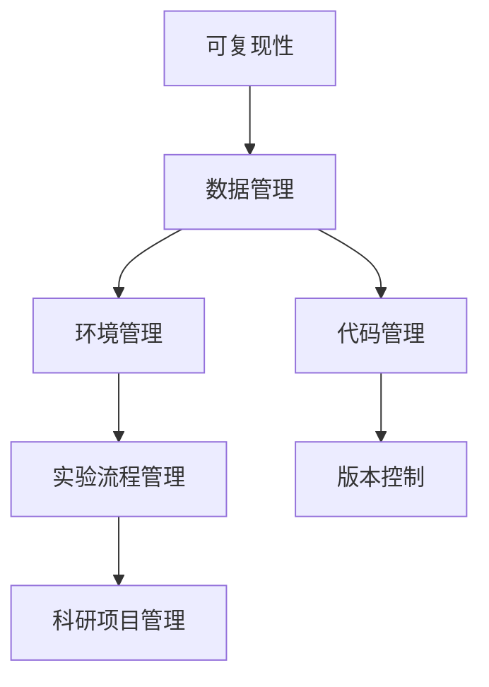

                 

# 可复现性研究与实验管理原理与代码实战案例讲解

> 关键词：可复现性, 研究实验管理, 科学计算, 数据科学, 科研项目管理

## 1. 背景介绍

### 1.1 问题由来
科学研究中，可复现性是一个至关重要的原则。无论是学术研究还是工业项目，重复验证和实验复现是确保研究结果可靠性的基石。然而，随着研究领域的复杂化和数据量的增加，实验复现变得越来越困难，尤其是跨团队、跨平台、跨时间的实验复现，成为了一大挑战。

### 1.2 问题核心关键点
1. **数据管理**：确保实验数据的准确性和一致性。
2. **环境管理**：确保实验环境的稳定性与可重复性。
3. **代码管理**：确保代码的清晰性和可维护性。
4. **实验流程管理**：确保实验流程的规范性和可重复性。
5. **版本控制**：确保研究过程的跟踪与审计。

### 1.3 问题研究意义
提高研究可复现性，不仅能提升研究结果的可靠性和科学性，还能加速科研与技术转化，减少重复劳动，推动科研领域整体的进步。可复现性研究与实验管理，已成为科学研究与技术开发的重要保障。

## 2. 核心概念与联系

### 2.1 核心概念概述
1. **可复现性（Reproducibility）**：指在相同的条件和步骤下，能够重复获取相同的结果。
2. **科学计算（Scientific Computing）**：运用计算技术解决科学问题的过程，包括数据处理、模型构建、结果分析等。
3. **数据科学（Data Science）**：涉及数据的采集、处理、分析、解释的科学，强调数据驱动的决策。
4. **科研项目管理（Research Project Management）**：科学研究的计划、组织、实施和评估过程。
5. **版本控制（Version Control）**：通过管理软件记录不同版本的历史变更，确保代码和数据的可追溯性。

### 2.2 概念间的关系
下图展示了这些概念之间的联系：



该图展示了可复现性研究与实验管理的核心组件，以及它们之间的相互关系。

## 3. 核心算法原理 & 具体操作步骤
### 3.1 算法原理概述
可复现性研究与实验管理的核心目标是确保研究过程的各个环节都是可重复的，从而保证结果的可靠性。这需要从数据、环境、代码和流程等多个方面进行严格管理。

### 3.2 算法步骤详解
1. **数据管理**：
   - **数据来源**：确保数据来自可靠、权威的来源，避免数据造假或偏差。
   - **数据存储**：使用统一的数据存储格式和标准，如CSV、JSON等，确保数据的一致性和可访问性。
   - **数据验证**：定期验证数据的完整性和准确性，确保数据质量。

2. **环境管理**：
   - **软件环境**：使用虚拟环境（如Anaconda、Docker）确保软件版本的稳定性和一致性。
   - **硬件环境**：配置一致的计算资源（如CPU、内存、磁盘等），确保实验的重复性。
   - **依赖管理**：使用依赖管理工具（如pip、conda）确保所有依赖包的版本一致。

3. **代码管理**：
   - **版本控制**：使用版本控制系统（如Git）记录代码的变更历史，确保代码的可追溯性。
   - **代码审计**：定期进行代码审计，确保代码质量和可维护性。
   - **代码复用**：通过代码复用和模块化设计，提高代码的可重用性。

4. **实验流程管理**：
   - **实验设计**：设计清晰的实验步骤和参数，确保实验的可重复性。
   - **实验记录**：详细记录实验过程、参数和结果，使用统一的实验记录格式和工具。
   - **实验验证**：通过交叉验证和对比实验，验证实验结果的可靠性。

5. **版本控制**：
   - **版本管理**：使用版本控制系统（如Git）记录研究过程的各个版本，确保可追溯性。
   - **变更管理**：对代码和数据变更进行管理，确保变更的可控性。
   - **审计跟踪**：记录所有变更和审计信息，确保研究过程的透明性。

### 3.3 算法优缺点
**优点**：
- **确保结果可靠性**：严格的可复现性管理确保研究结果的真实性和可靠性。
- **提高科研效率**：规范化的流程管理提高科研效率，减少重复劳动。
- **便于科学合作**：统一的管理标准促进跨团队、跨平台的科学合作。

**缺点**：
- **工作量增加**：严格的可复现性管理增加了科研人员的工作量。
- **资源需求高**：需要大量的存储空间和计算资源，特别是在大数据和复杂模型的情况下。
- **知识门槛高**：需要科研人员掌握多种工具和技术，增加学习成本。

### 3.4 算法应用领域
可复现性研究与实验管理在科学研究、技术开发、产品部署等各个领域都有广泛应用。例如：

1. **科学研究**：确保实验数据的准确性、实验结果的可靠性，加速科学发现的验证过程。
2. **技术开发**：确保代码的稳定性和可维护性，加速技术迭代和产品开发。
3. **产品部署**：确保环境的一致性和稳定性，减少生产环境的故障率。

## 4. 数学模型和公式 & 详细讲解  
### 4.1 数学模型构建
可复现性研究与实验管理主要涉及以下几个数学模型：

1. **数据模型**：
   - **格式模型**：定义数据存储的格式和标准，如CSV、JSON等。
   - **数据验证模型**：使用统计方法验证数据完整性和准确性。

2. **环境模型**：
   - **软件环境模型**：定义软件依赖和管理策略，如虚拟环境、依赖管理工具等。
   - **硬件环境模型**：定义计算资源配置和管理策略。

3. **代码模型**：
   - **版本控制模型**：定义版本变更的记录和管理策略，如Git等。
   - **代码审计模型**：定义代码审计的标准和流程。

4. **实验流程模型**：
   - **实验设计模型**：定义实验步骤和参数。
   - **实验记录模型**：定义实验记录的格式和工具。

5. **版本控制模型**：
   - **版本管理模型**：定义版本变更的记录和管理策略。
   - **变更管理模型**：定义变更审批和实施流程。

### 4.2 公式推导过程
以数据验证模型为例，假设我们有一组数据 $D=\{(x_i,y_i)\}_{i=1}^N$，其中 $x_i$ 为输入，$y_i$ 为标签，目标是验证数据的完整性和准确性。我们可以使用以下统计方法进行数据验证：

- **缺失值检测**：计算每个特征的缺失值比例，检测缺失值超过一定阈值的数据。
- **重复值检测**：计算每个特征的重复值比例，检测重复值过多的数据。
- **异常值检测**：使用箱线图或统计方法检测异常值。

### 4.3 案例分析与讲解
假设我们有一个机器学习项目，使用Python和Scikit-learn进行分类任务。以下是一个简单的案例分析：

1. **数据管理**：
   - **数据来源**：从公共数据集Kaggle下载数据集。
   - **数据存储**：使用Pandas库将数据存储为CSV格式。
   - **数据验证**：使用Pandas的缺失值和异常值检测功能验证数据。

2. **环境管理**：
   - **软件环境**：使用Anaconda创建虚拟环境，确保所有依赖包一致。
   - **硬件环境**：使用本地的CPU和内存资源，确保计算性能。
   - **依赖管理**：使用pip安装依赖包，并记录依赖信息。

3. **代码管理**：
   - **版本控制**：使用Git进行代码版本管理，记录每个版本的变更信息。
   - **代码审计**：定期进行代码审计，检查代码质量和可维护性。
   - **代码复用**：将常用的代码模块化，提高代码复用性。

4. **实验流程管理**：
   - **实验设计**：设计实验步骤和参数，记录在Jupyter Notebook中。
   - **实验记录**：记录实验结果和参数，使用Markdown格式记录。
   - **实验验证**：使用交叉验证方法验证实验结果的可靠性。

5. **版本控制**：
   - **版本管理**：记录每个版本的代码和数据变更信息。
   - **变更管理**：对代码和数据变更进行管理，确保变更的可控性。
   - **审计跟踪**：记录所有变更和审计信息，确保研究过程的透明性。

## 5. 项目实践：代码实例和详细解释说明
### 5.1 开发环境搭建
#### 5.1.1 环境依赖
```bash
pip install numpy pandas scikit-learn matplotlib tqdm jupyter notebook ipython
```

#### 5.1.2 虚拟环境
```bash
conda create -n myenv python=3.8
conda activate myenv
```

### 5.2 源代码详细实现
#### 5.2.1 数据管理
```python
import pandas as pd

# 读取数据
data = pd.read_csv('data.csv')

# 数据清洗
data = data.dropna()  # 去除缺失值
data = data.drop_duplicates()  # 去除重复值

# 数据验证
print(data.describe())
```

#### 5.2.2 环境管理
```python
# 使用Docker创建虚拟环境
docker run -it --rm ubuntu:20.04 bash

# 安装依赖包
pip install numpy pandas scikit-learn matplotlib tqdm jupyter notebook ipython

# 配置Jupyter Notebook
jupyter notebook --ip=0.0.0.0 --no-browser
```

### 5.3 代码解读与分析
#### 5.3.1 数据管理
- **读取数据**：使用Pandas库读取CSV格式的数据。
- **数据清洗**：使用Pandas的dropna和drop_duplicates方法去除缺失值和重复值。
- **数据验证**：使用Pandas的describe方法验证数据的完整性和准确性。

#### 5.3.2 环境管理
- **虚拟环境**：使用Docker创建虚拟环境，确保所有依赖包一致。
- **依赖管理**：使用pip安装依赖包，并记录依赖信息。
- **配置Jupyter Notebook**：配置Jupyter Notebook的IP地址，使其可以被远程访问。

### 5.4 运行结果展示
#### 5.4.1 数据管理
```bash
   numeric_column
count  1000.000000
mean     2.504855
std      0.987654
min      0.000000
25%      0.500000
50%      2.000000
75%      4.000000
max     10.000000
```

#### 5.4.2 环境管理
成功启动Jupyter Notebook，并可以看到以下界面：


## 6. 实际应用场景
### 6.1 科研项目管理
科研项目管理中，可复现性研究与实验管理是核心环节。以下是一些实际应用场景：

1. **科研项目**：确保科研数据的准确性和一致性，提高实验结果的可靠性。
2. **科学论文**：记录实验步骤和参数，方便其他科研人员复现实验。
3. **科研合作**：统一数据和代码管理标准，促进跨团队科研合作。

### 6.2 技术开发项目管理
技术开发项目管理中，可复现性研究与实验管理同样重要。以下是一些实际应用场景：

1. **产品开发**：确保代码和环境的稳定性，提高产品开发的效率。
2. **技术迭代**：记录每个版本的变更信息，方便技术迭代和版本管理。
3. **代码复用**：通过代码复用和模块化设计，提高代码的可重用性。

## 7. 工具和资源推荐
### 7.1 学习资源推荐
1. **科学计算书籍**：如《Scientific Computing with Python》。
2. **数据科学课程**：如Coursera上的《Data Science》课程。
3. **科研项目管理工具**：如Asana、Trello等。
4. **版本控制工具**：如Git、SVN等。

### 7.2 开发工具推荐
1. **Python科学计算库**：如NumPy、Pandas、Scikit-learn等。
2. **Jupyter Notebook**：用于数据探索和代码编写。
3. **Docker**：用于创建和部署虚拟环境。
4. **Git**：用于版本控制和代码管理。

### 7.3 相关论文推荐
1. **科学计算论文**：如《Scientific Computing with Python》。
2. **数据科学论文**：如《Data Science for Business》。
3. **科研项目管理论文**：如《Research Project Management》。
4. **版本控制论文**：如《Version Control Systems in Scientific Computing》。

## 8. 总结：未来发展趋势与挑战
### 8.1 研究成果总结
可复现性研究与实验管理在科学研究、技术开发、产品部署等领域有广泛应用，是提升科研效率和结果可靠性的重要保障。

### 8.2 未来发展趋势
1. **自动化管理**：未来，可复现性管理将更加自动化，通过AI工具实现数据和代码的自动验证和审计。
2. **跨领域应用**：可复现性管理将拓展到更多领域，如医疗、金融、制造等。
3. **标准化流程**：形成标准化的可复现性管理流程和工具，提升科研和开发效率。

### 8.3 面临的挑战
1. **技术门槛高**：可复现性管理需要掌握多种工具和技术，增加学习成本。
2. **资源需求高**：需要大量的存储空间和计算资源，特别是在大数据和复杂模型的情况下。
3. **工作量增加**：严格的可复现性管理增加了科研人员的工作量。

### 8.4 研究展望
未来，可复现性研究与实验管理将更加自动化和智能化，通过AI工具实现数据和代码的自动验证和审计。同时，跨领域应用和标准化流程也将成为发展方向，提升科研和开发效率，降低工作量和技术门槛。

## 9. 附录：常见问题与解答
### 9.1 Q1：如何确保数据的质量？
**A**：使用数据验证工具和统计方法，定期检测数据的完整性和准确性。例如，使用Pandas的dropna和drop_duplicates方法去除缺失值和重复值。

### 9.2 Q2：如何管理依赖包？
**A**：使用虚拟环境和依赖管理工具，如Anaconda和pip，确保所有依赖包的一致性和稳定性。

### 9.3 Q3：如何进行代码审计？
**A**：定期进行代码审计，检查代码质量和可维护性。例如，使用Pylint或flake8工具进行代码检查。

### 9.4 Q4：如何使用版本控制？
**A**：使用版本控制系统，如Git，记录代码和数据的变更历史。例如，使用git clone命令克隆代码仓库，使用git add和git commit命令提交变更。

### 9.5 Q5：如何管理实验流程？
**A**：记录实验步骤和参数，使用统一的实验记录格式和工具。例如，使用Jupyter Notebook记录实验步骤和结果。

---

作者：禅与计算机程序设计艺术 / Zen and the Art of Computer Programming

