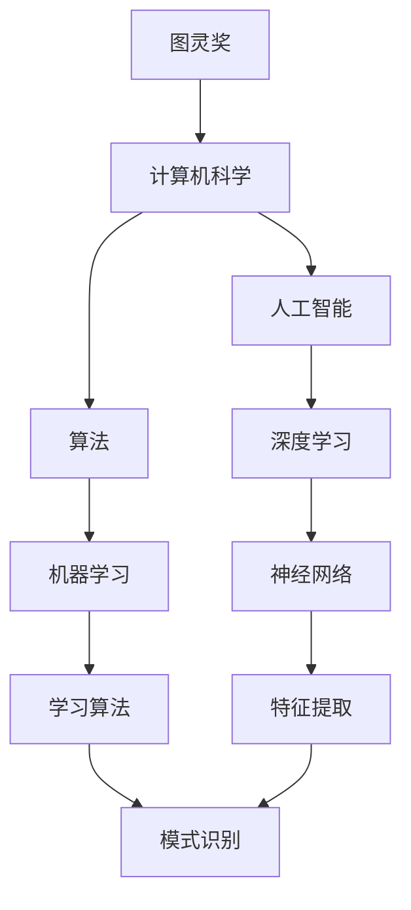

                 

# 图灵奖与AI算法的突破

> 关键词：图灵奖,人工智能,算法突破,深度学习,神经网络,机器学习,计算机科学,技术发展

## 1. 背景介绍

### 1.1 图灵奖的由来

图灵奖（Turing Award）是计算机科学界的最高荣誉，被业内誉为“计算机科学的诺贝尔奖”。该奖项由美国计算机协会（ACM）于1966年设立，旨在表彰对计算机科学做出重大贡献的科学家。获得图灵奖的学者，其科研成果通常会成为计算机科学领域的里程碑。

图灵奖的设立，不仅是对个人成就的肯定，更是对整个计算机科学的推动。它激励着一代代科研人员不断突破自我，推动计算机科学与技术向更高层次发展。

### 1.2 图灵奖与AI算法的关系

图灵奖的获奖者中，多位对人工智能（AI）算法的发展做出了重要贡献。例如，Yann LeCun、Geoffrey Hinton、Yoshua Bengio因在深度学习领域的开创性工作，于2018年共同获得图灵奖，奠定了深度学习作为当前AI核心算法的基础。Hector Geffner因在AI理论、逻辑推理和自动规划方面的工作，于2003年获得图灵奖，为AI算法的逻辑性和可解释性提供了理论支持。这些获奖者通过算法创新，推动了AI技术的飞速发展，改变了世界对计算机的理解和应用。

## 2. 核心概念与联系

### 2.1 核心概念概述

为了更好地理解图灵奖与AI算法的关系，本节将介绍几个关键概念及其相互联系：

- 图灵奖：计算机科学界的最高荣誉，表彰对计算机科学做出重大贡献的科学家。
- 人工智能（AI）：使计算机系统能够模拟人类智能行为的科学。
- 算法（Algorithm）：一系列明确且有效的步骤，用于解决特定问题或执行特定任务。
- 深度学习（Deep Learning）：一种基于神经网络的AI算法，能够自动提取特征并进行复杂模式识别。
- 机器学习（Machine Learning）：一种使计算机系统能够从数据中学习和改进的技术。
- 计算机科学：研究计算过程及其效率的科学。

这些概念通过计算机科学的发展和应用紧密相连，其中算法是AI和机器学习领域的基础和核心。

### 2.2 概念间的关系

通过以下Mermaid流程图，我们可以更加清晰地展示这些核心概念之间的关系：



这个流程图展示了从图灵奖到计算机科学，再到人工智能和机器学习，最终聚焦到深度学习算法，其特征提取和模式识别的能力。这些核心概念通过图灵奖的表彰，推动了AI算法的不断突破和应用，为计算机科学的发展提供了强大的动力。

## 3. 核心算法原理 & 具体操作步骤

### 3.1 算法原理概述

深度学习是当前AI算法的核心之一，其核心原理是通过多层神经网络对数据进行特征提取和模式识别。深度学习模型的训练过程，通常包括前向传播、损失计算、反向传播和参数更新四个步骤。

- 前向传播：将输入数据通过神经网络进行逐层处理，得到预测输出。
- 损失计算：计算预测输出与真实标签之间的差异，得到损失函数。
- 反向传播：根据损失函数的梯度，反向计算每个参数对损失的贡献，并传递给下一层。
- 参数更新：根据梯度信息，调整神经网络的参数，更新模型。

深度学习算法的核心在于如何设计和优化这些步骤，以便获得更好的模型性能和泛化能力。

### 3.2 算法步骤详解

以卷积神经网络（Convolutional Neural Network, CNN）为例，详细讲解深度学习算法的具体操作步骤：

**Step 1: 数据准备**
- 收集和预处理训练集和测试集，将其转化为模型能够处理的格式。

**Step 2: 模型定义**
- 使用深度学习框架（如TensorFlow、PyTorch等）定义神经网络结构。
- 添加卷积层、池化层、全连接层等组件，构建完整的模型。

**Step 3: 模型编译**
- 定义损失函数（如交叉熵损失）和优化器（如Adam、SGD等）。
- 设置训练轮数和批次大小等超参数。

**Step 4: 模型训练**
- 将数据分批次输入模型，进行前向传播和损失计算。
- 反向传播计算梯度，更新模型参数。
- 周期性在验证集上评估模型性能，根据性能调整超参数。

**Step 5: 模型评估**
- 在测试集上评估模型的性能，输出最终的预测结果。

**Step 6: 模型部署**
- 将训练好的模型保存，并集成到实际应用中。

### 3.3 算法优缺点

深度学习算法具有以下优点：
- 能够处理大规模复杂数据，具备强大的特征提取和模式识别能力。
- 通过自动学习，可以发现数据中的复杂结构。
- 在许多领域，如计算机视觉、自然语言处理等，取得了最先进的效果。

同时，深度学习算法也存在一些缺点：
- 需要大量数据和计算资源，训练过程耗时较长。
- 模型复杂度较高，解释性较差，难以理解内部决策过程。
- 存在过拟合风险，需要大量的超参数调优。

### 3.4 算法应用领域

深度学习算法已经在图像识别、语音识别、自然语言处理、推荐系统等多个领域得到了广泛应用，具体包括：

- 计算机视觉：如人脸识别、物体检测、图像分割等。
- 语音识别：如自动语音识别、语音合成、情感分析等。
- 自然语言处理：如机器翻译、问答系统、情感分析等。
- 推荐系统：如电商推荐、音乐推荐、新闻推荐等。

深度学习算法在上述领域的应用，极大地提高了数据处理和分析的效率，推动了技术的创新和应用。

## 4. 数学模型和公式 & 详细讲解 & 举例说明

### 4.1 数学模型构建

以卷积神经网络（CNN）为例，定义模型数学模型。

- 输入数据 $x \in \mathbb{R}^{N \times D}$，其中 $N$ 是样本数，$D$ 是特征维度。
- 卷积核 $W \in \mathbb{R}^{F \times F \times C \times M}$，其中 $F$ 是卷积核大小，$C$ 是输入通道数，$M$ 是输出通道数。
- 输出 $y \in \mathbb{R}^{N \times M}$。

卷积层的数学表达式为：

$$
y_i = \sigma(\sum_{k=1}^{C} \sum_{j=1}^{F} W_{k,j} \ast x_i) + b_i
$$

其中 $\sigma$ 为激活函数，$b_i$ 为偏置项。

### 4.2 公式推导过程

以卷积神经网络（CNN）为例，推导卷积层的计算过程。

**Step 1: 卷积操作**
- 输入 $x \in \mathbb{R}^{N \times D}$ 通过卷积核 $W \in \mathbb{R}^{F \times F \times C \times M}$，计算卷积结果。
- 卷积操作的结果为 $y_i = \sum_{k=1}^{C} \sum_{j=1}^{F} W_{k,j} \ast x_i$，其中 $\ast$ 表示卷积运算。

**Step 2: 激活函数**
- 对卷积结果进行激活函数 $\sigma$ 的计算，得到最终输出 $y_i$。

**Step 3: 损失函数**
- 定义交叉熵损失函数，计算预测输出与真实标签之间的差异。
- 损失函数为 $L = -\frac{1}{N} \sum_{i=1}^{N} \sum_{j=1}^{M} y_{ij} \log \hat{y}_{ij}$，其中 $y_{ij}$ 为真实标签，$\hat{y}_{ij}$ 为模型预测输出。

**Step 4: 梯度计算**
- 通过反向传播计算损失函数对每个参数的梯度。
- 梯度计算公式为 $\frac{\partial L}{\partial W} = \frac{1}{N} \sum_{i=1}^{N} \sum_{j=1}^{F} \sum_{k=1}^{C} \frac{\partial y_i}{\partial W_{k,j}} \frac{\partial \sigma}{\partial y_i}$。

### 4.3 案例分析与讲解

以图像分类任务为例，展示卷积神经网络（CNN）的应用。

假设输入图像 $x \in \mathbb{R}^{H \times W \times 3}$，经过若干卷积层、池化层和全连接层后，得到分类结果 $y \in \mathbb{R}^{C}$，其中 $C$ 为类别数。通过交叉熵损失函数 $L = -\frac{1}{N} \sum_{i=1}^{N} y_i \log \hat{y}_i$，计算预测输出与真实标签之间的差异。

## 5. 项目实践：代码实例和详细解释说明

### 5.1 开发环境搭建

在进行深度学习项目实践前，我们需要准备好开发环境。以下是使用Python进行PyTorch开发的环境配置流程：

1. 安装Anaconda：从官网下载并安装Anaconda，用于创建独立的Python环境。

2. 创建并激活虚拟环境：
```bash
conda create -n pytorch-env python=3.8 
conda activate pytorch-env
```

3. 安装PyTorch：根据CUDA版本，从官网获取对应的安装命令。例如：
```bash
conda install pytorch torchvision torchaudio cudatoolkit=11.1 -c pytorch -c conda-forge
```

4. 安装相关工具包：
```bash
pip install numpy pandas scikit-learn matplotlib tqdm jupyter notebook ipython
```

完成上述步骤后，即可在`pytorch-env`环境中开始深度学习实践。

### 5.2 源代码详细实现

下面我们以卷积神经网络（CNN）为例，给出使用PyTorch进行图像分类的PyTorch代码实现。

```python
import torch
import torch.nn as nn
import torch.optim as optim
import torchvision.transforms as transforms
from torchvision import datasets, models

# 定义CNN模型
class Net(nn.Module):
    def __init__(self):
        super(Net, self).__init__()
        self.conv1 = nn.Conv2d(3, 64, kernel_size=3, stride=1, padding=1)
        self.conv2 = nn.Conv2d(64, 128, kernel_size=3, stride=1, padding=1)
        self.pool = nn.MaxPool2d(kernel_size=2, stride=2)
        self.fc1 = nn.Linear(128 * 8 * 8, 256)
        self.fc2 = nn.Linear(256, 10)

    def forward(self, x):
        x = self.pool(torch.relu(self.conv1(x)))
        x = self.pool(torch.relu(self.conv2(x)))
        x = x.view(-1, 128 * 8 * 8)
        x = torch.relu(self.fc1(x))
        x = self.fc2(x)
        return x

# 加载数据集
transform = transforms.Compose([
    transforms.Resize(224),
    transforms.ToTensor(),
    transforms.Normalize((0.5, 0.5, 0.5), (0.5, 0.5, 0.5))
])
train_dataset = datasets.CIFAR10(root='./data', train=True, download=True, transform=transform)
test_dataset = datasets.CIFAR10(root='./data', train=False, download=True, transform=transform)
```

然后，定义模型和优化器：

```python
# 定义模型
model = Net()

# 定义优化器
optimizer = optim.SGD(model.parameters(), lr=0.001, momentum=0.9)
```

接着，定义训练和评估函数：

```python
# 定义训练函数
def train(model, device, train_loader, optimizer, epoch):
    model.train()
    for batch_idx, (data, target) in enumerate(train_loader):
        data, target = data.to(device), target.to(device)
        optimizer.zero_grad()
        output = model(data)
        loss = F.cross_entropy(output, target)
        loss.backward()
        optimizer.step()

# 定义评估函数
def test(model, device, test_loader):
    model.eval()
    correct = 0
    total = 0
    with torch.no_grad():
        for data, target in test_loader:
            data, target = data.to(device), target.to(device)
            output = model(data)
            pred = output.argmax(dim=1, keepdim=True)
            correct += pred.eq(target.view_as(pred)).sum().item()
            total += target.size(0)
    print('Test Accuracy of the model on the 10000 test images: {} %'.format(100 * correct / total))
```

最后，启动训练流程并在测试集上评估：

```python
# 定义设备
device = torch.device("cuda" if torch.cuda.is_available() else "cpu")

# 加载数据集
train_loader = torch.utils.data.DataLoader(train_dataset, batch_size=64, shuffle=True)
test_loader = torch.utils.data.DataLoader(test_dataset, batch_size=64, shuffle=False)

# 训练模型
model = model.to(device)
for epoch in range(10):
    train(model, device, train_loader, optimizer, epoch)
    test(model, device, test_loader)
```

以上就是使用PyTorch进行卷积神经网络（CNN）图像分类的完整代码实现。可以看到，得益于PyTorch的强大封装，我们可以用相对简洁的代码完成CNN模型的加载和训练。

### 5.3 代码解读与分析

让我们再详细解读一下关键代码的实现细节：

**Net类**：
- `__init__`方法：初始化CNN模型的各层组件。
- `forward`方法：定义模型的前向传播过程。

**transforms.Compose**：
- 将多个数据预处理步骤组合成一个管道，方便应用到数据集上。

**model.to(device)**：
- 将模型迁移到指定设备（如GPU、TPU等）上，加速模型计算。

**optimizer.zero_grad()**：
- 清除优化器中的梯度缓存，准备进行新一轮的梯度计算。

**optimizer.step()**：
- 更新模型参数，完成前向传播和损失计算。

**torch.no_grad()**：
- 在测试阶段关闭梯度计算，节省计算资源。

通过以上步骤，可以构建一个完整的深度学习模型，并进行训练和评估。这为后续的深度学习项目实践奠定了基础。

## 6. 实际应用场景

### 6.1 医疗影像识别

深度学习在医疗影像识别领域有着广泛应用，能够帮助医生快速、准确地诊断疾病。以乳腺癌检测为例，通过卷积神经网络（CNN）可以对乳腺X光片进行分类，判断是否存在恶性肿瘤。

具体实现流程如下：
1. 收集并标注大量乳腺X光片数据，将其分为训练集和测试集。
2. 定义CNN模型，并加载预训练的权重。
3. 在训练集上对模型进行微调，使用交叉熵损失函数。
4. 在测试集上评估模型性能，输出诊断结果。

### 6.2 自动驾驶

深度学习在自动驾驶领域也有着广泛应用，如目标检测、车道识别、行人检测等。以目标检测为例，通过卷积神经网络（CNN）可以对道路上的车辆、行人、障碍物等进行识别和定位。

具体实现流程如下：
1. 收集并标注大量道路图像数据，将其分为训练集和测试集。
2. 定义CNN模型，并加载预训练的权重。
3. 在训练集上对模型进行微调，使用交叉熵损失函数。
4. 在测试集上评估模型性能，输出检测结果。

### 6.3 金融风险预测

深度学习在金融风险预测领域也有着广泛应用，能够帮助金融机构识别和预测风险。以信用评分为例，通过卷积神经网络（CNN）可以对客户的历史交易数据进行特征提取和分析，预测其信用风险。

具体实现流程如下：
1. 收集并标注大量客户交易数据，将其分为训练集和测试集。
2. 定义CNN模型，并加载预训练的权重。
3. 在训练集上对模型进行微调，使用交叉熵损失函数。
4. 在测试集上评估模型性能，输出信用评分结果。

## 7. 工具和资源推荐

### 7.1 学习资源推荐

为了帮助开发者系统掌握深度学习算法，这里推荐一些优质的学习资源：

1. 《深度学习》系列课程：由斯坦福大学Andrew Ng教授主讲的深度学习课程，涵盖深度学习的基础理论、算法实现和应用案例，适合初学者和进阶者。
2. Deep Learning Specialization：由Andrew Ng教授主讲的深度学习专业课程，从基础到高级，全面覆盖深度学习领域的核心技术。
3. PyTorch官方文档：PyTorch框架的官方文档，提供丰富的教程、API参考和案例代码，适合快速上手实践。
4. TensorFlow官方文档：TensorFlow框架的官方文档，提供丰富的教程、API参考和案例代码，适合快速上手实践。
5. Coursera深度学习课程：Coursera平台上的深度学习课程，涵盖深度学习的基础理论、算法实现和应用案例，适合初学者和进阶者。

通过对这些资源的学习实践，相信你一定能够快速掌握深度学习算法的精髓，并用于解决实际的AI问题。

### 7.2 开发工具推荐

高效的开发离不开优秀的工具支持。以下是几款用于深度学习开发的常用工具：

1. PyTorch：基于Python的开源深度学习框架，灵活动态的计算图，适合快速迭代研究。大部分深度学习模型都有PyTorch版本的实现。
2. TensorFlow：由Google主导开发的开源深度学习框架，生产部署方便，适合大规模工程应用。同样有丰富的深度学习模型资源。
3. Jupyter Notebook：免费的开源交互式编程环境，支持Python、R等多种语言，适合进行数据分析和机器学习研究。
4. Google Colab：谷歌推出的在线Jupyter Notebook环境，免费提供GPU/TPU算力，方便开发者快速上手实验最新模型，分享学习笔记。
5. Kaggle：数据科学和机器学习竞赛平台，提供丰富的数据集和社区资源，适合进行数据分析和模型评估。

合理利用这些工具，可以显著提升深度学习项目开发效率，加快创新迭代的步伐。

### 7.3 相关论文推荐

深度学习算法的不断突破源于学界的持续研究。以下是几篇奠基性的相关论文，推荐阅读：

1. Convolutional Neural Networks for Visual Recognition（卷积神经网络在图像识别中的应用）：Alex Krizhevsky等，NIPS 2012会议论文。
2. Deep Residual Learning for Image Recognition（残差网络在图像识别中的应用）：Kaiming He等，CVPR 2016会议论文。
3. Attention is All You Need（Transformer在自然语言处理中的应用）：Ashish Vaswani等，NIPS 2017会议论文。
4. TensorFlow: A System for Large-Scale Machine Learning（TensorFlow框架的介绍）：Martín Abadi等，OSDI 2016会议论文。
5. PyTorch: Tensors and Dynamic neural networks in Python with strong GPU acceleration（PyTorch框架的介绍）：Adam Paszke等，NIPS 2016会议论文。

这些论文代表了大深度学习算法的进步和发展，通过学习这些前沿成果，可以帮助研究者把握学科前进方向，激发更多的创新灵感。

除上述资源外，还有一些值得关注的前沿资源，帮助开发者紧跟深度学习算法的最新进展，例如：

1. arXiv论文预印本：人工智能领域最新研究成果的发布平台，包括大量尚未发表的前沿工作，学习前沿技术的必读资源。
2. 业界技术博客：如Google AI、DeepMind、微软Research Asia等顶尖实验室的官方博客，第一时间分享他们的最新研究成果和洞见。
3. 技术会议直播：如NIPS、ICML、CVPR、ICLR等人工智能领域顶会现场或在线直播，能够聆听到大佬们的前沿分享，开拓视野。
4. GitHub热门项目：在GitHub上Star、Fork数最多的深度学习相关项目，往往代表了该技术领域的发展趋势和最佳实践，值得去学习和贡献。
5. 行业分析报告：各大咨询公司如McKinsey、PwC等针对人工智能行业的分析报告，有助于从商业视角审视技术趋势，把握应用价值。

总之，对于深度学习算法的学习和实践，需要开发者保持开放的心态和持续学习的意愿。多关注前沿资讯，多动手实践，多思考总结，必将收获满满的成长收益。

## 8. 总结：未来发展趋势与挑战

### 8.1 研究成果总结

本文对深度学习算法的突破进行了全面系统的介绍。首先阐述了图灵奖与AI算法的关系，明确了深度学习算法在当前AI领域的重要地位。其次，从原理到实践，详细讲解了深度学习算法的核心步骤，给出了深度学习项目开发的完整代码实例。同时，本文还广泛探讨了深度学习算法在医疗影像识别、自动驾驶、金融风险预测等多个领域的应用前景，展示了深度学习算法的巨大潜力。

### 8.2 未来发展趋势

展望未来，深度学习算法将呈现以下几个发展趋势：

1. 模型规模持续增大。随着算力成本的下降和数据规模的扩张，深度学习模型的参数量还将持续增长。超大规模模型蕴含的丰富特征表示，有望支撑更加复杂多变的任务。
2. 算法多样化。未来将涌现更多多样化的深度学习算法，如Transformer、GNN（图神经网络）等，进一步拓展深度学习的应用边界。
3. 模型解释性增强。越来越多的研究致力于提高深度学习模型的解释性和可解释性，以便更好地理解模型的决策过程。
4. 模型鲁棒性提高。通过引入对抗训练、正则化等技术，未来深度学习模型将具备更高的鲁棒性和泛化能力。
5. 模型通用性增强。深度学习模型将进一步向通用人工智能（AGI）迈进，具备更强的跨领域迁移能力和知识整合能力。

这些趋势展示了深度学习算法的广阔前景，将进一步推动AI技术的创新和应用。

### 8.3 面临的挑战

尽管深度学习算法已经取得了瞩目成就，但在迈向更加智能化、普适化应用的过程中，仍面临诸多挑战：

1. 数据需求巨大。深度学习模型需要大量数据进行训练，数据获取和标注成本较高。如何高效利用数据，提升数据利用率，是一个亟待解决的问题。
2. 计算资源需求高。深度学习模型通常需要高性能计算资源，包括GPU/TPU等，且训练过程耗时较长。如何在保证性能的同时，降低计算资源需求，是一个重要的研究方向。
3. 模型可解释性不足。深度学习模型通常是“黑盒”系统，难以解释其内部决策过程。如何提高模型可解释性，增强模型的可信度，是一个重要的研究方向。
4. 模型鲁棒性不足。深度学习模型在面对噪声、对抗攻击等情况时，容易出现性能下降。如何提高模型鲁棒性，增强模型的泛化能力，是一个重要的研究方向。
5. 模型安全性问题。深度学习模型容易出现过拟合和误导性输出，可能带来安全隐患。如何确保模型的安全性，是一个重要的研究方向。

### 8.4 研究展望

面对深度学习算法面临的挑战，未来的研究需要在以下几个方面寻求新的突破：

1. 探索无监督和半监督学习算法。摆脱对大量标注数据的依赖，利用自监督学习、主动学习等无监督和半监督范式，最大限度利用非结构化数据，实现更加灵活高效的深度学习。
2. 研究参数高效和计算高效的深度学习范式。开发更加参数高效的深度学习方法，在固定大部分预训练参数的情况下，只更新极少量的任务相关参数。同时优化深度学习模型的计算图，减少前向传播和反向传播的资源消耗，实现更加轻量级、实时性的部署。
3. 融合因果推断和对比学习范式。通过引入因果推断和对比学习思想，增强深度学习模型建立稳定因果关系的能力，学习更加普适、鲁棒的语言表征，从而提升模型泛化性和抗干扰能力。
4. 引入更多先验知识。将符号化的先验知识，如知识图谱、逻辑规则等，与神经网络模型进行巧妙融合，引导深度学习过程学习更准确、合理的语言模型。同时加强不同模态数据的整合，实现视觉、语音等多模态信息与文本信息的协同建模。
5. 结合因果分析和博弈论工具。将因果分析方法引入深度学习模型，识别出模型决策的关键特征，增强输出解释的因果性和逻辑性。借助博弈论工具刻画人机交互过程，主动探索并规避模型的脆弱点，提高系统稳定性。
6. 纳入伦理道德约束。在深度学习模型训练目标中引入伦理导向的评估指标，过滤和惩罚有偏见、有害的输出倾向。同时加强人工干预和审核，建立模型行为的监管机制，确保输出符合人类价值观和伦理道德。

这些研究方向的探索，必将引领深度学习算法迈向更高的台阶，为构建安全、可靠、可解释、可控的智能系统铺平道路。面向未来，深度学习算法还需要与其他人工智能技术进行更深入的融合，如知识表示、因果推理、强化学习等，多路径协同发力，共同推动深度学习技术的进步。只有勇于创新、敢于突破，才能不断

