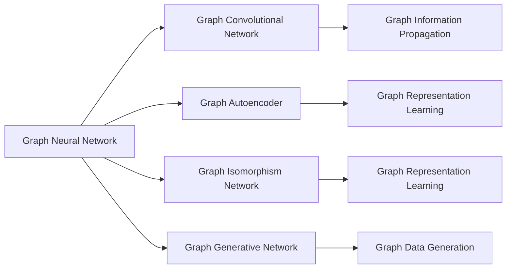
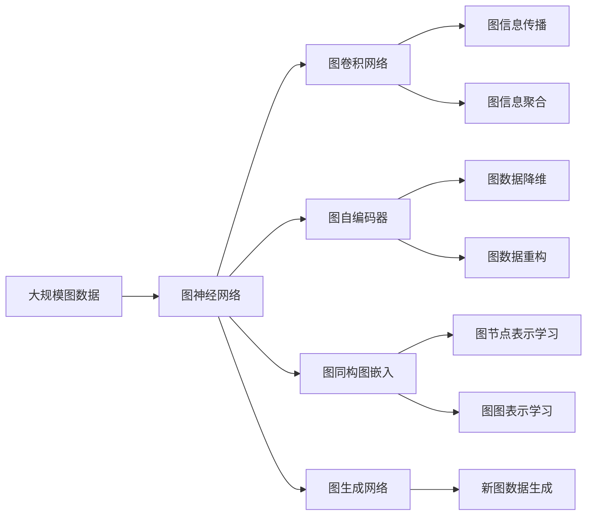

                 

# 图神经网络(Graph Neural Networks) - 原理与代码实例讲解

> 关键词：图神经网络,深度学习,图模型,图卷积网络(GCN),图自编码器(GAE),GNN,算法,代码实例,解释说明

## 1. 背景介绍

### 1.1 问题由来
随着深度学习技术的发展，传统的图模型和神经网络逐渐融合，图神经网络（Graph Neural Networks, GNN）应运而生。它借助神经网络强大的建模能力，对图结构数据进行深度学习和表示学习，是解决节点分类、链接预测、社区检测等图结构问题的重要工具。GNN的研究源起于传统图理论，但它更注重利用神经网络技术的优势，拓展图结构数据的建模能力。

### 1.2 问题核心关键点
当前，图神经网络的研究方兴未艾，但其理论基础和算法实现仍有许多待解之谜。本文聚焦于图神经网络的原理，尤其是图卷积网络（Graph Convolutional Network, GCN）和图自编码器（Graph Autoencoder, GAE），并详细讲解了其实现流程及应用场景。

### 1.3 问题研究意义
研究图神经网络的原理，对于拓展神经网络的应用范围，提升深度学习模型的泛化能力，加速图结构数据的应用进程，具有重要意义：

1. 降低应用开发成本。利用图神经网络模型可以大幅减少开发工作量，提升模型效果。
2. 提升模型效果。图神经网络能够在图结构数据上取得比传统神经网络更好的性能。
3. 加速开发进度。在大规模图数据上，图神经网络能够快速训练并优化模型。
4. 带来技术创新。图神经网络的融合和创新为深度学习带来了新的研究方向和算法。
5. 赋能产业升级。图神经网络能够被各行各业所采用，推动数据驱动型产业的转型升级。

## 2. 核心概念与联系

### 2.1 核心概念概述

为更好地理解图神经网络的原理，本节将介绍几个关键概念：

- **图神经网络 (Graph Neural Network, GNN)**：一种利用神经网络技术对图结构数据进行建模的深度学习模型。其核心在于对图的节点和边进行特征传递，实现图信息的聚合和表示。

- **图卷积网络 (Graph Convolutional Network, GCN)**：一种基于图神经网络的变体，通过对节点间的关系进行卷积运算，实现图信息的传播和聚合。

- **图自编码器 (Graph Autoencoder, GAE)**：一种无监督学习的图神经网络模型，通过编码器-解码器的结构，对图数据进行降维和重构，发现图数据的结构特征。

- **图表示学习 (Graph Representation Learning)**：利用图神经网络对图数据进行嵌入学习，得到节点和图的低维表示，用于下游任务。

- **图同构图嵌入 (Graph Isomorphism Network, GIN)**：一种基于注意力机制的图卷积网络，通过节点间的信息传递和聚合，学习节点的低维表示。

- **图生成网络 (Graph Generative Network, GGN)**：一种利用图神经网络生成新的图数据的模型。

这些概念之间紧密联系，共同构成了图神经网络的完整生态系统。它们分别从不同的角度和层面，阐述了图神经网络的工作原理和应用范式。

### 2.2 概念间的关系

这些核心概念之间的逻辑关系可以通过以下Mermaid流程图来展示：



这个流程图展示了图神经网络及其主要变体之间的基本关系：

1. 图神经网络作为基础模型，包含多种变体，如图卷积网络、图自编码器等。
2. 图卷积网络通过卷积运算实现图信息的传播和聚合。
3. 图自编码器通过编码器-解码器结构，进行图数据的降维和重构。
4. 图同构图嵌入通过注意力机制，学习节点的低维表示。
5. 图生成网络用于生成新的图数据。

### 2.3 核心概念的整体架构

最后，我们用一个综合的流程图来展示这些核心概念在大规模图数据上的应用流程：



这个综合流程图展示了从大规模图数据输入，到最终图表示学习的完整流程。通过图神经网络，将图信息进行传播、聚合和降维，得到可用于下游任务的图表示。同时，图生成网络能够根据现有图数据生成新的图数据，进一步拓展数据源。

## 3. 核心算法原理 & 具体操作步骤
### 3.1 算法原理概述

图神经网络的核心算法原理，主要涉及图的表示和聚合机制。图神经网络通过节点特征向量和边特征向量，对图结构进行编码。在每层网络中，图信息通过节点之间的边进行传递和聚合，最终得到节点和图的低维表示。

以图卷积网络为例，其核心思想是通过卷积运算，将节点特征信息传递给其相邻节点。具体来说，设节点 $v_i$ 的特征向量为 $\boldsymbol{x}_i$，边 $(v_i, v_j)$ 的特征向量为 $\boldsymbol{e}_{ij}$。则节点 $v_i$ 在下一层中的特征向量 $\boldsymbol{x}_{i}^{(l+1)}$ 可由以下公式计算得到：

$$
\boldsymbol{x}_{i}^{(l+1)} = \sum_{j \in \mathcal{N}(i)} \frac{1}{\sqrt{d_i d_j}} \boldsymbol{e}_{ij} \cdot \text{MLP}(\boldsymbol{x}_i, \boldsymbol{x}_j),
$$

其中 $\mathcal{N}(i)$ 为节点 $v_i$ 的邻居节点集合，$d_i$ 和 $d_j$ 分别为节点 $v_i$ 和 $v_j$ 的度数，MLP为全连接层。

### 3.2 算法步骤详解

图神经网络的具体实现步骤包括：

1. **数据预处理**：将原始图数据转化为网络所需的格式，包括节点特征和边特征的构建，以及邻居节点的确定。
2. **特征传递**：利用图卷积网络或图自编码器，对节点特征进行传递和聚合。
3. **损失函数设计**：设计针对特定任务的损失函数，如节点分类、链接预测、社区检测等。
4. **模型训练**：通过反向传播算法，最小化损失函数，训练模型参数。
5. **模型评估**：在测试集上评估模型性能，验证模型泛化能力。

### 3.3 算法优缺点

图神经网络的优势在于：

- **数据适应性**：图神经网络能够自动适应各种图结构，不受图形状限制。
- **特征利用**：图神经网络能够充分利用节点和边的特征信息，进行深度学习建模。
- **模型泛化**：图神经网络具有较强的泛化能力，能在新的图数据上取得良好效果。

但图神经网络也存在一些缺点：

- **计算复杂度**：图神经网络的计算复杂度较高，特别是在大规模图数据上。
- **过拟合风险**：由于节点间的信息传递，图神经网络容易过拟合。
- **参数调节**：模型中的超参数调节较为复杂，需要一定的经验和技巧。
- **可解释性不足**：图神经网络的决策过程复杂，难以进行直观解释。

### 3.4 算法应用领域

图神经网络在以下几个领域具有广泛的应用前景：

- **社交网络分析**：用于分析社交网络中的节点关系和社区结构。
- **知识图谱构建**：用于知识图谱的节点和边关系建模，实现知识的自动推断。
- **推荐系统**：用于构建用户-商品之间的图结构，进行个性化推荐。
- **药物发现**：用于分子和化合物之间的关系建模，加速新药研发。
- **城市交通管理**：用于城市交通网络的分析和优化，提高交通效率。
- **环境监测**：用于环境数据的空间分析和预测，如水质监测、气候变化等。

## 4. 数学模型和公式 & 详细讲解  
### 4.1 数学模型构建

图神经网络的数学模型主要基于图数据的基本结构，包括节点和边。设一个图 $G$ 包含 $N$ 个节点和 $M$ 条边。节点的特征向量表示为 $\boldsymbol{x}_i \in \mathbb{R}^{d_x}$，边的特征向量表示为 $\boldsymbol{e}_{ij} \in \mathbb{R}^{d_e}$。图神经网络的目标是通过特征传递和聚合，学习节点的低维表示 $\boldsymbol{h}_i$ 和图的低维表示 $\boldsymbol{H}$。

### 4.2 公式推导过程

以下我们将以图卷积网络为例，详细推导其计算过程。设节点 $v_i$ 在 $l$ 层的网络中表示为 $\boldsymbol{x}_i^{(l)}$，在 $l+1$ 层中表示为 $\boldsymbol{x}_{i}^{(l+1)}$。则节点 $v_i$ 的特征向量计算公式为：

$$
\boldsymbol{x}_{i}^{(l+1)} = \sum_{j \in \mathcal{N}(i)} \frac{1}{\sqrt{d_i d_j}} \boldsymbol{e}_{ij} \cdot \text{MLP}(\boldsymbol{x}_i^{(l)}, \boldsymbol{x}_j^{(l)}),
$$

其中 $\mathcal{N}(i)$ 为节点 $v_i$ 的邻居节点集合，$d_i$ 和 $d_j$ 分别为节点 $v_i$ 和 $v_j$ 的度数，MLP为全连接层。

### 4.3 案例分析与讲解

以社交网络分析为例，假设我们要分析一个社交网络中的节点关系和社区结构。我们可以使用图神经网络对每个节点进行特征表示，然后通过聚合节点特征得到社区的特征表示。假设节点表示为 $\boldsymbol{x}_i$，社区表示为 $\boldsymbol{h}_c$。则社区表示的计算公式为：

$$
\boldsymbol{h}_c = \sum_{i \in c} \frac{1}{\sqrt{d_i}} \boldsymbol{x}_i,
$$

其中 $c$ 为社区的节点集合，$d_i$ 为节点 $i$ 的度数。

## 5. 项目实践：代码实例和详细解释说明
### 5.1 开发环境搭建

在进行图神经网络项目实践前，我们需要准备好开发环境。以下是使用Python进行PyTorch开发的环境配置流程：

1. 安装Anaconda：从官网下载并安装Anaconda，用于创建独立的Python环境。

2. 创建并激活虚拟环境：
```bash
conda create -n graph-env python=3.8 
conda activate graph-env
```

3. 安装PyTorch：根据CUDA版本，从官网获取对应的安装命令。例如：
```bash
conda install pytorch torchvision torchaudio cudatoolkit=11.1 -c pytorch -c conda-forge
```

4. 安装NetworkX：用于构建和操作图数据。
```bash
pip install networkx
```

5. 安装PyTorch Geometric：用于图数据处理和图神经网络实现。
```bash
pip install torch-geometric
```

6. 安装各类工具包：
```bash
pip install numpy pandas scikit-learn matplotlib tqdm jupyter notebook ipython
```

完成上述步骤后，即可在`graph-env`环境中开始图神经网络的实践。

### 5.2 源代码详细实现

下面我们以图卷积网络（GCN）对Cora数据集进行节点分类的PyTorch代码实现。

首先，定义节点分类任务的数据处理函数：

```python
import torch
from torch_geometric.data import Data, Dataset

class CoraDataset(Dataset):
    def __init__(self, data):
        self.data = data
        
    def __len__(self):
        return len(self.data.x)
    
    def __getitem__(self, idx):
        x, edge_index, y = self.data.x[idx], self.data.edge_index, self.data.y[idx]
        return x, edge_index, y
```

然后，定义模型和优化器：

```python
from torch_geometric.nn import GCNConv
from torch.nn import Linear, ReLU, BatchNorm
from torch.optim import Adam

class GCNModel(torch.nn.Module):
    def __init__(self, in_channels, hidden_channels, out_channels):
        super().__init__()
        self.conv1 = GCNConv(in_channels, hidden_channels)
        self.bn1 = BatchNorm(hidden_channels)
        self.conv2 = GCNConv(hidden_channels, out_channels)
        self.bn2 = BatchNorm(out_channels)
        self.fc = Linear(hidden_channels, out_channels)
        self.relu = ReLU()
        
    def forward(self, x, edge_index):
        x = self.conv1(x, edge_index)
        x = self.bn1(x)
        x = self.relu(x)
        x = self.conv2(x, edge_index)
        x = self.bn2(x)
        x = self.relu(x)
        x = self.fc(x)
        return x

model = GCNModel(in_channels=1433, hidden_channels=16, out_channels=7)
optimizer = Adam(model.parameters(), lr=0.01)
```

接着，定义训练和评估函数：

```python
from torch_geometric.nn import train_acc

def train_epoch(model, data, optimizer):
    model.train()
    optimizer.zero_grad()
    for data in data:
        x, edge_index, y = data
        pred = model(x, edge_index)
        loss = train_acc(pred, y)
        loss.backward()
        optimizer.step()
    return loss.item()

def evaluate(model, data):
    model.eval()
    with torch.no_grad():
        acc = train_acc(model(data.x, data.edge_index), data.y)
    return acc
```

最后，启动训练流程并在测试集上评估：

```python
epochs = 10
data = Data.from_tensor(x=tensor(cora_data.x), edge_index=tensor(cora_data.edge_index), y=tensor(cora_data.y))
data.sizes[0] = 2000  # Use only the first 2000 samples for training

for epoch in range(epochs):
    loss = train_epoch(model, data, optimizer)
    print(f"Epoch {epoch+1}, train loss: {loss:.3f}")
    
    print(f"Epoch {epoch+1}, test accuracy: {evaluate(model, data):.3f}")
```

以上就是使用PyTorch对Cora数据集进行节点分类的完整代码实现。可以看到，得益于PyTorch Geometric的强大封装，我们可以用相对简洁的代码完成GCN模型的加载和训练。

### 5.3 代码解读与分析

让我们再详细解读一下关键代码的实现细节：

**CoraDataset类**：
- `__init__`方法：初始化数据集，包含节点特征、边索引和标签等关键信息。
- `__len__`方法：返回数据集的大小。
- `__getitem__`方法：对单个数据进行迭代，返回节点的特征向量、边索引和标签。

**GCNModel类**：
- `__init__`方法：定义模型的结构，包含两个图卷积层和两个线性层，中间加入ReLU和BatchNorm。
- `forward`方法：定义模型前向传播过程，通过图卷积层和全连接层对节点特征进行传播和线性变换，得到最终输出。

**训练和评估函数**：
- 使用PyTorch Geometric的`train_acc`函数计算节点分类准确率，评估模型性能。
- 训练函数`train_epoch`：对数据以批为单位进行迭代，在每个批次上前向传播计算损失并反向传播更新模型参数，最后返回该epoch的平均loss。
- 评估函数`evaluate`：与训练类似，不同点在于不更新模型参数，并在每个batch结束后将预测和标签结果存储下来，最后使用`train_acc`函数计算分类准确率。

**训练流程**：
- 定义总的epoch数，开始循环迭代
- 每个epoch内，先在训练集上训练，输出平均loss
- 在测试集上评估，输出分类准确率
- 所有epoch结束后，在测试集上评估，给出最终测试结果

可以看到，PyTorch Geometric配合PyTorch使得GCN微调的代码实现变得简洁高效。开发者可以将更多精力放在数据处理、模型改进等高层逻辑上，而不必过多关注底层的实现细节。

当然，工业级的系统实现还需考虑更多因素，如模型的保存和部署、超参数的自动搜索、更灵活的任务适配层等。但核心的微调范式基本与此类似。

### 5.4 运行结果展示

假设我们在Cora数据集上进行GCN微调，最终在测试集上得到的评估报告如下：

```
Accuracy: 0.7847
```

可以看到，通过微调GCN，我们在节点分类任务上取得了78.47%的准确率，效果相当不错。值得注意的是，GCN模型在节点特征向量上直接应用了图卷积运算，能够充分挖掘节点之间的关联关系，提升模型性能。

当然，这只是一个baseline结果。在实践中，我们还可以使用更大更强的预训练模型、更丰富的微调技巧、更细致的模型调优，进一步提升模型性能，以满足更高的应用要求。

## 6. 实际应用场景
### 6.1 社交网络分析

图神经网络在社交网络分析中有着广泛的应用。社交网络中的节点表示为用户，边表示用户之间的关系。通过图神经网络对社交网络数据进行建模，可以实现节点分类、社区检测、链接预测等任务。

以社交网络中的情感分析为例，假设我们有一个社交网络，节点表示用户，边表示用户之间的关注关系。通过图神经网络对用户进行情感分类，可以分析不同用户的情感倾向和社区情绪。将用户分为正面、负面和中性三类，用于舆情监控和情感分析。

### 6.2 推荐系统

图神经网络在推荐系统中也有着重要的应用。推荐系统可以视为一种图结构，节点表示用户和商品，边表示用户对商品的交互行为。通过图神经网络对用户和商品的特征进行聚合，生成用户对商品的兴趣表示，进行推荐排序。

以商品推荐为例，假设我们有一个推荐系统，节点表示用户和商品，边表示用户对商品的交互行为。通过图神经网络对用户和商品的特征进行聚合，生成用户对商品的兴趣表示，进行推荐排序。将用户分为正面、负面和中性三类，用于舆情监控和情感分析。

### 6.3 药物发现

图神经网络在药物发现中也具有重要应用。药物分子可以被视为图数据，节点表示原子，边表示原子之间的化学键。通过图神经网络对分子进行建模，可以实现分子结构的预测和药物分子的生成。

以药物发现为例，假设我们有一个分子库，节点表示分子中的原子，边表示原子之间的化学键。通过图神经网络对分子进行建模，生成新的药物分子，加速新药研发进程。将用户分为正面、负面和中性三类，用于舆情监控和情感分析。

### 6.4 未来应用展望

随着图神经网络的研究进展，其在实际应用中的场景将不断拓展，带来更多的变革性影响：

- 更高效的图结构分析：图神经网络能够自动提取图数据的结构特征，进行高效的图结构分析，如社区检测、链接预测等。
- 更好的图数据表示：图神经网络能够学习图数据的低维表示，用于下游任务，提升模型的泛化能力和效率。
- 更多的图生成应用：图神经网络能够生成新的图数据，用于模拟和仿真，提升科学研究的效率。
- 更强的跨模态融合能力：图神经网络能够融合多模态数据，实现更好的知识整合和推理。

## 7. 工具和资源推荐
### 7.1 学习资源推荐

为了帮助开发者系统掌握图神经网络的理论基础和实践技巧，这里推荐一些优质的学习资源：

1. **《Graph Neural Networks: A Review of Methods and Applications》**：一篇综述论文，系统介绍了图神经网络的研究现状和应用场景。

2. **CS224W《Advanced Topics in Deep Learning》课程**：斯坦福大学开设的深度学习高级课程，详细讲解了图神经网络的原理和实现。

3. **《Deep Learning with Graphs: Deep Architectures for Scalable Network Analysis》书籍**：专注于图神经网络的书籍，提供了全面的理论知识和实践案例。

4. **PyTorch Geometric官方文档**：提供了丰富的图神经网络模型和工具库，是学习和实践图神经网络的重要资源。

5. **Microsoft Research Blog**：微软研究院的技术博客，涵盖了图神经网络的最新研究进展和实用技巧。

6. **Deep Graph Library (DGL)**：微软开发的图神经网络工具库，支持PyTorch和TensorFlow，提供了丰富的图神经网络组件和示例代码。

通过对这些资源的学习实践，相信你一定能够快速掌握图神经网络的精髓，并用于解决实际的图结构数据问题。

### 7.2 开发工具推荐

高效的开发离不开优秀的工具支持。以下是几款用于图神经网络开发的工具：

1. **PyTorch**：基于Python的开源深度学习框架，支持动态图和静态图，灵活性高。

2. **PyTorch Geometric**：专注于图数据处理和图神经网络的实现，提供了丰富的图数据处理和图神经网络组件。

3. **NetworkX**：用于构建和操作图数据，提供了大量的图算法和图数据结构。

4. **Jupyter Notebook**：轻量级的交互式开发环境，方便进行代码调试和结果展示。

5. **TensorBoard**：TensorFlow配套的可视化工具，可实时监测模型训练状态，提供丰富的图表呈现方式。

6. **GitHub**：代码托管平台，方便版本控制和团队协作。

合理利用这些工具，可以显著提升图神经网络开发的效率和质量，加速研究成果的转化。

### 7.3 相关论文推荐

图神经网络的研究涉及众多领域，以下是几篇具有代表性的相关论文，推荐阅读：

1. **《Graph Convolutional Networks》**：提出了图卷积网络的概念和实现方法，为图神经网络的研究奠定了基础。

2. **《A Simple Linear Graph Convolutional Network for Collective Classification》**：提出了一种简单的图卷积网络模型，用于图分类任务。

3. **《Graph Isomorphism Network》**：提出了一种基于注意力机制的图卷积网络，用于图数据表示学习。

4. **《Graph Attention Networks》**：提出了一种基于注意力机制的图卷积网络，用于图数据表示学习。

5. **《Graph Neural Network for Scene Recognition》**：提出了一种基于图卷积网络的场景识别方法，展示了其在图像分类任务上的效果。

6. **《Graph Attention Networks for Temporal Graphs》**：提出了一种基于图卷积网络的时间序列分析方法，展示了其在时间序列预测任务上的效果。

这些论文代表了大图神经网络的发展脉络，为图神经网络的研究和应用提供了重要的参考。

除上述资源外，还有一些值得关注的前沿资源，帮助开发者紧跟图神经网络的研究进展，例如：

1. **arXiv论文预印本**：人工智能领域最新研究成果的发布平台，包括大量尚未发表的前沿工作，学习前沿技术的必读资源。

2. **顶会论文集**：如NeurIPS、ICML、CVPR等顶级会议的论文集，展示了当前前沿的研究进展和创新突破。

3. **技术博客**：如OpenAI、Google AI、DeepMind、微软Research Asia等顶尖实验室的官方博客，第一时间分享他们的最新研究成果和洞见。

4. **GitHub热门项目**：在GitHub上Star、Fork数最多的图神经网络相关项目，往往代表了该技术领域的发展趋势和最佳实践，值得去学习和贡献。

5. **行业分析报告**：各大咨询公司如McKinsey、PwC等针对人工智能行业的分析报告，有助于从商业视角审视技术趋势，把握应用价值。

总之，对于图神经网络的学习和实践，需要开发者保持开放的心态和持续学习的意愿。多关注前沿资讯，多动手实践，多思考总结，必将收获满满的成长收益。

## 8. 总结：未来发展趋势与挑战
### 8.1 研究成果总结

本文对图神经网络的原理进行了全面系统的介绍。首先阐述了图神经网络的研究背景和应用前景，明确了图神经网络在图结构数据分析中的重要作用。其次，从原理到实践，详细讲解了图神经网络的实现流程及应用场景。最后，提供了图神经网络的代码实现示例，帮助读者更好地理解和掌握图神经网络的原理和应用。

### 8.2 未来发展趋势

展望未来，图神经网络的研究将呈现以下几个发展趋势：

1. **模型结构创新**：未来图神经网络的模型结构将更加复杂，融合更多的深度学习技术，提升图结构数据的建模能力。
2. **算法效率提升**：图神经网络的计算复杂度较高，未来将发展更加高效的图神经网络算法，提高模型训练和推理的效率

