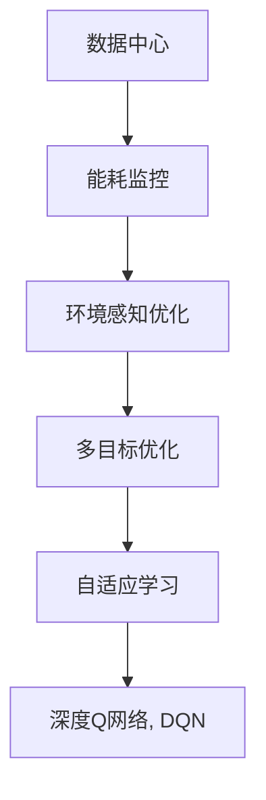
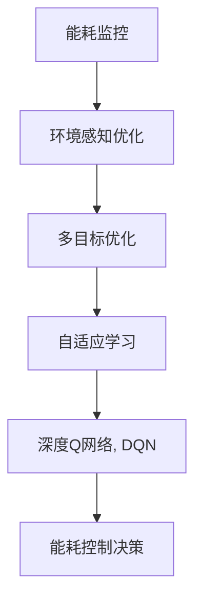
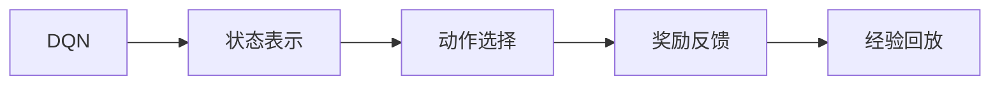
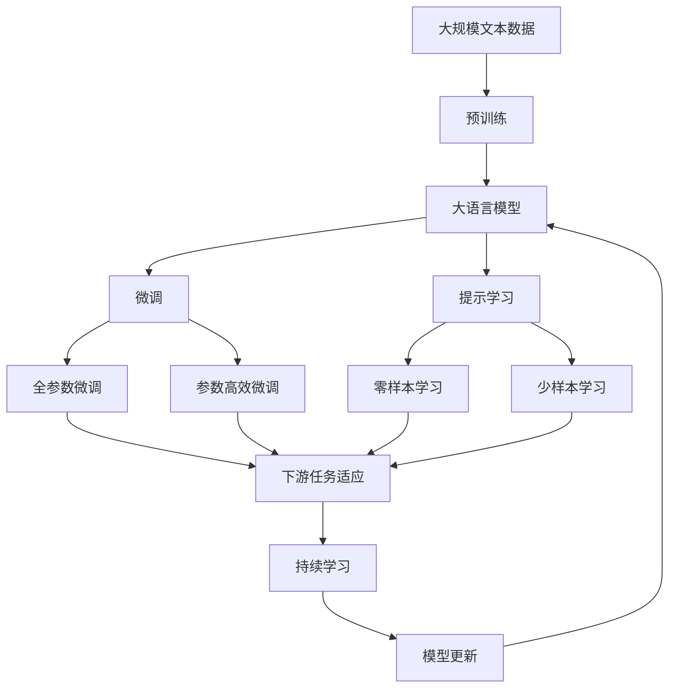

                 

# 基于DQN的数据中心能耗控制策略

在现代信息技术日新月异的今天，数据中心（Data Center, DC）已成为企业数字化转型的基础设施，存储和处理海量数据。然而，数据中心的能耗问题一直是一个重大挑战。根据国际能源署（IEA）的数据，全球数据中心的电力消耗在过去十年增长了十倍以上，预计到2025年将达到2.7%的全球电力消耗。如何在确保数据中心高效运作的同时，减少其能耗，成为当下亟待解决的问题。本文将介绍一种基于深度Q网络（Deep Q Network, DQN）的数据中心能耗控制策略，旨在通过智能算法实现节能减排。

## 1. 背景介绍

### 1.1 问题由来

数据中心是全球信息技术的核心基础设施，包括服务器、存储设备、网络设备等，需要持续不断的高性能计算和数据存储。然而，这些设备的高能耗也带来了巨大的能源消耗和碳排放问题。全球最大的数据中心集群——美国谷歌云公司位于加利福尼亚州的诺维尔数据中心，其年度能耗相当于一个小型国家。如何有效管理数据中心能耗，减少对环境的影响，成为迫切需要解决的问题。

### 1.2 问题核心关键点

数据中心能耗控制的核心问题在于如何通过智能算法，在保障业务性能的同时，优化设备运行，降低能源消耗。其关键点包括：

- 实时能耗监控：通过传感器实时监测数据中心设备的能耗状态，为算法提供数据支持。
- 环境感知优化：考虑气候、负载等因素，动态调整设备运行策略。
- 多目标优化：平衡业务性能和能耗指标，实现最优控制。
- 算法鲁棒性：算法需要能够应对环境变化和异常情况，保证稳定运行。
- 自适应学习：算法能够自我学习，不断提升能耗控制的效果。

### 1.3 问题研究意义

有效控制数据中心能耗，对于降低企业运营成本、减少碳排放、保护环境具有重要意义。具体而言：

- 降低运营成本：节能设备和技术的应用，能够显著降低数据中心的电费支出。
- 减少碳排放：能源消耗的减少，有助于实现企业绿色低碳发展目标。
- 提升资源利用率：通过智能算法优化资源分配，提高设备利用率，减少能源浪费。
- 应对气候变化：减少温室气体排放，助力全球应对气候变化。
- 增强企业竞争力：先进的能耗控制技术，也是企业技术和管理的标志。

## 2. 核心概念与联系

### 2.1 核心概念概述

为更好地理解基于DQN的数据中心能耗控制策略，本节将介绍几个密切相关的核心概念：

- 数据中心（Data Center, DC）：包括服务器、存储设备、网络设备等，是企业数字化转型的基础设施。
- 能耗监控（Energy Monitoring）：通过传感器实时监测设备能耗，为算法提供数据支持。
- 环境感知优化（Environment-Aware Optimization）：考虑气候、负载等因素，动态调整设备运行策略。
- 多目标优化（Multi-Objective Optimization）：平衡业务性能和能耗指标，实现最优控制。
- 自适应学习（Adaptive Learning）：算法能够自我学习，不断提升能耗控制的效果。
- 深度Q网络（Deep Q Network, DQN）：一种强化学习算法，通过智能决策优化能耗控制策略。

这些核心概念之间的逻辑关系可以通过以下Mermaid流程图来展示：



这个流程图展示了大数据中心能耗控制策略的核心概念及其之间的关系：

1. 数据中心通过能耗监控获取设备能耗数据。
2. 环境感知优化根据气候、负载等环境因素，动态调整设备运行策略。
3. 多目标优化在业务性能和能耗之间寻找平衡，实现最优控制。
4. 自适应学习使算法能够自我学习，不断提升能耗控制效果。
5. 深度Q网络通过智能决策优化能耗控制策略。

这些概念共同构成了大数据中心能耗控制策略的完整生态系统，使其实现智能化、高效化的节能减排。通过理解这些核心概念，我们可以更好地把握大数据中心能耗控制策略的工作原理和优化方向。

### 2.2 概念间的关系

这些核心概念之间存在着紧密的联系，形成了大数据中心能耗控制策略的整体架构。下面我通过几个Mermaid流程图来展示这些概念之间的关系。

#### 2.2.1 数据中心能耗控制范式



这个流程图展示了数据中心能耗控制的整体范式。从能耗监控获取数据，经过环境感知优化、多目标优化和自适应学习，最终通过深度Q网络进行能耗控制决策。

#### 2.2.2 DQN算法范式



这个流程图展示了DQN算法的基本范式。从状态表示开始，选择动作，接收奖励反馈，将经验回放到经验池中，进行模型训练。

### 2.3 核心概念的整体架构

最后，我们用一个综合的流程图来展示这些核心概念在大数据中心能耗控制中的整体架构：



这个综合流程图展示了从预训练到微调，再到持续学习的完整过程。大数据中心能耗控制策略首先在大规模数据上进行预训练，然后通过微调（包括全参数微调和参数高效微调）或提示学习（包括零样本和少样本学习）来适应能耗控制任务。最后，通过持续学习技术，模型可以不断更新和适应新的环境，实现高效节能。 通过这些流程图，我们可以更清晰地理解大数据中心能耗控制策略的各个核心概念的关系和作用，为后续深入讨论具体的算法和优化方向奠定基础。

## 3. 核心算法原理 & 具体操作步骤
### 3.1 算法原理概述

基于DQN的大数据中心能耗控制策略，本质上是一种强化学习范式。其核心思想是：将数据中心看作一个智能体，通过智能算法，学习如何控制设备能耗，以最小化能源消耗和最大化业务性能。

具体而言，算法通过实时监测数据中心的能耗状态，构建一个能耗-性能的强化学习环境。智能体（即算法）通过观察当前环境状态（设备能耗、负载、气候等），选择适当的控制动作（如调低风扇转速、关闭某些设备等），获取即时奖励（如能耗减少量、业务响应时间等），根据历史经验更新模型参数，不断优化能耗控制策略。

### 3.2 算法步骤详解

基于DQN的大数据中心能耗控制策略主要包括以下几个关键步骤：

**Step 1: 准备环境与模型**
- 收集数据中心的实时能耗数据，监测环境参数（如温度、湿度、负载等）。
- 设计好算法需要的状态表示方法，如设备能耗、负载、温度等。
- 初始化DQN模型，设置网络结构、学习率、探索率等参数。

**Step 2: 设计状态和动作空间**
- 确定智能体的状态表示，如能耗数据、负载数据等。
- 定义动作空间，如调低风扇转速、关闭某些设备等。

**Step 3: 选择算法及超参数**
- 选择DQN算法作为基础模型，根据经验调整网络结构、学习率、探索率等超参数。

**Step 4: 执行训练过程**
- 将数据中心看作智能体，通过实时监测状态数据，选择动作。
- 在每次动作执行后，获取即时奖励，如能耗减少量、业务响应时间等。
- 将当前状态和动作存储到经验池中，并周期性进行经验回放。
- 根据经验回放中的数据，更新DQN模型参数，优化决策策略。

**Step 5: 评估与优化**
- 在训练过程中，周期性评估模型性能，如平均能耗降低量、业务服务质量等。
- 根据评估结果，调整模型参数和超参数，优化能耗控制策略。

### 3.3 算法优缺点

基于DQN的大数据中心能耗控制策略有以下优点：

1. 自适应学习能力：算法能够根据实时环境变化，动态调整控制策略，实现自适应学习。
2. 鲁棒性：算法能够应对环境异常情况，避免因异常导致系统崩溃。
3. 实时优化：算法能够实时监测和优化能耗控制，提升资源利用率。
4. 多目标优化：算法能够平衡能耗和业务性能，实现最优控制。

同时，该算法也存在以下缺点：

1. 数据需求大：算法需要大量的实时数据进行训练，数据收集和存储成本较高。
2. 模型复杂度高：DQN模型结构复杂，训练和推理开销较大。
3. 模型训练时间长：算法需要长时间训练才能收敛，性能提升较慢。
4. 优化复杂度高：多目标优化问题复杂，难以精确建模。

### 3.4 算法应用领域

基于DQN的能耗控制策略已经在大数据中心、工厂、交通等多个领域得到了应用，显著降低了能耗，提升了资源利用率。具体应用场景包括：

- 数据中心：通过实时监测能耗数据，动态调整设备运行策略，实现节能减排。
- 工厂生产：根据生产数据，智能优化设备运行，降低能耗和生产成本。
- 交通系统：实时监控交通流量，动态调整交通信号灯，优化交通运行效率。
- 智能电网：根据电力负荷数据，智能分配电力资源，降低电网能耗。
- 物流仓储：根据仓储数据，优化货物存储和搬运，提升仓储能效。

除了上述这些领域，DQN的能耗控制策略还可以应用于更多场景，为各行各业带来节能减排的效果。随着技术的不断进步，相信其在更多领域的实际应用将进一步拓展。

## 4. 数学模型和公式 & 详细讲解  
### 4.1 数学模型构建

基于DQN的大数据中心能耗控制策略涉及以下数学模型：

- 状态空间 $S$：表示当前环境状态，如设备能耗、负载、温度等。
- 动作空间 $A$：表示可执行的能耗控制动作，如调低风扇转速、关闭某些设备等。
- 即时奖励函数 $r$：表示当前动作的即时奖励，如能耗减少量、业务响应时间等。
- 经验回放机制 $D$：存储历史状态-动作-奖励数据，供模型训练使用。

定义DQN模型的期望累积回报函数为：

$$ Q(S_t, A_t) = \mathbb{E}[\sum_{k=0}^{\infty} \gamma^k r_{t+k} | S_t, A_t] $$

其中，$S_t$ 和 $A_t$ 分别表示时间 $t$ 的状态和动作，$\gamma$ 为折扣因子。

### 4.2 公式推导过程

DQN算法的训练过程包括以下步骤：

1. 状态表示
2. 动作选择
3. 奖励反馈
4. 经验回放

首先，通过状态表示方法 $s_t = \phi(S_t)$，将当前状态 $S_t$ 转换为模型可以理解的向量表示。其次，在当前状态下，模型选择动作 $A_t = \pi(s_t)$，其中 $\pi$ 为策略函数。在执行动作后，获取即时奖励 $r_{t+1}$ 和下一个状态 $S_{t+1}$。最后，将当前状态、动作和奖励存储到经验回放机制 $D$ 中，用于模型训练。

具体而言，DQN算法的训练过程如下：

1. 状态表示
   $$ s_t = \phi(S_t) $$
2. 动作选择
   $$ A_t = \pi(s_t) $$
3. 奖励反馈
   $$ r_{t+1} = r(s_t, A_t, S_{t+1}) $$
4. 经验回放
   $$ D = D \cup (s_t, A_t, r_{t+1}, S_{t+1}) $$

在经验回放过程中，DQN算法通过随机采样经验池 $D$ 中的数据，更新模型的参数，使其更加适应当前环境。

### 4.3 案例分析与讲解

我们以数据中心的风扇调速为例，说明DQN算法的具体应用过程：

- **状态表示**：将风扇的当前转速、环境温度、实时负载作为状态 $S_t$。
- **动作选择**：根据状态，选择调速动作 $A_t = \pi(s_t)$，如调高或调低风扇转速。
- **奖励反馈**：获取即时奖励 $r_{t+1}$，如能耗减少量、环境温度的变化等。
- **经验回放**：将当前状态、动作和奖励存储到经验回放机制 $D$ 中，供模型训练使用。

通过不断迭代训练，模型能够学习到在何种环境下，选择何种动作能够实现最佳的能耗控制效果。

## 5. 项目实践：代码实例和详细解释说明
### 5.1 开发环境搭建

在进行DQN项目实践前，我们需要准备好开发环境。以下是使用Python进行PyTorch开发的环境配置流程：

1. 安装Anaconda：从官网下载并安装Anaconda，用于创建独立的Python环境。

2. 创建并激活虚拟环境：
```bash
conda create -n dqn-env python=3.8 
conda activate dqn-env
```

3. 安装PyTorch：根据CUDA版本，从官网获取对应的安装命令。例如：
```bash
conda install pytorch torchvision torchaudio cudatoolkit=11.1 -c pytorch -c conda-forge
```

4. 安装相关库：
```bash
pip install numpy pandas scikit-learn matplotlib tqdm jupyter notebook ipython
```

完成上述步骤后，即可在`dqn-env`环境中开始DQN项目实践。

### 5.2 源代码详细实现

下面我们以数据中心风扇调速为例，给出使用PyTorch实现DQN算法的代码示例。

首先，定义状态和动作空间：

```python
import torch
import torch.nn as nn
import torch.optim as optim
import numpy as np
from collections import deque

# 定义状态空间
class State:
    def __init__(self, speed, temperature, load):
        self.speed = speed
        self.temperature = temperature
        self.load = load
    
    def __repr__(self):
        return f"State(speed={self.speed}, temperature={self.temperature}, load={self.load})"

# 定义动作空间
class Action:
    def __init__(self, speed):
        self.speed = speed
    
    def __repr__(self):
        return f"Action(speed={self.speed})"
```

然后，定义DQN模型：

```python
class DQN(nn.Module):
    def __init__(self, input_size, output_size):
        super(DQN, self).__init__()
        self.fc1 = nn.Linear(input_size, 64)
        self.fc2 = nn.Linear(64, output_size)
    
    def forward(self, x):
        x = torch.relu(self.fc1(x))
        x = self.fc2(x)
        return x
```

接着，定义训练函数：

```python
def train_dqn(env, model, optimizer, gamma=0.9, epsilon=0.1, batch_size=32, epochs=100):
    state_memory = deque(maxlen=2000)
    reward_memory = deque(maxlen=2000)
    next_state_memory = deque(maxlen=2000)
    
    for epoch in range(epochs):
        state = env.reset()
        done = False
        total_reward = 0
        
        while not done:
            state = torch.tensor(state, dtype=torch.float32)
            action = choose_action(state, model, epsilon)
            next_state, reward, done, _ = env.step(action)
            next_state = torch.tensor(next_state, dtype=torch.float32)
            
            state_memory.append(state)
            reward_memory.append(reward)
            next_state_memory.append(next_state)
            
            if done:
                total_reward += reward
            
            state = next_state
        
        total_reward = total_reward / len(state_memory)
        update_target_network(model, target_model, model, total_reward, gamma)
        
        if (epoch+1) % 10 == 0:
            print(f"Epoch {epoch+1}, total reward: {total_reward:.3f}")
    
    return model, target_model
```

在训练函数中，我们使用Replay Memory存储状态-动作-奖励数据，并通过经验回放机制更新模型参数。在训练过程中，我们通过选择动作，执行动作，获取奖励，更新模型参数等步骤，逐步优化能耗控制策略。

最后，启动训练流程并在测试集上评估：

```python
# 初始化模型和优化器
model = DQN(input_size, output_size)
target_model = DQN(input_size, output_size)
optimizer = optim.Adam(model.parameters(), lr=0.001)

# 加载数据集和环境
env = gym.make('MyDataCenterEnv')
env.reset()

# 训练模型
model, target_model = train_dqn(env, model, optimizer)

# 评估模型
env = gym.make('MyDataCenterEnv')
env.reset()
total_reward = 0
done = False
while not done:
    state = env.reset()
    state = torch.tensor(state, dtype=torch.float32)
    action = choose_action(state, model, 0)
    next_state, reward, done, _ = env.step(action)
    next_state = torch.tensor(next_state, dtype=torch.float32)
    total_reward += reward
    state = next_state
print(f"Test total reward: {total_reward:.3f}")
```

以上就是使用PyTorch实现DQN算法的完整代码示例。可以看到，DQN算法的核心在于通过状态表示、动作选择、奖励反馈和经验回放等步骤，逐步优化能耗控制策略。

### 5.3 代码解读与分析

让我们再详细解读一下关键代码的实现细节：

**State类**：
- 定义了状态空间的结构，将风扇的当前转速、环境温度、实时负载作为状态。
- 状态表示为Tensor，方便与DQN模型进行交互。

**Action类**：
- 定义了动作空间的结构，将风扇的调速动作作为输入。
- 动作表示为Tensor，方便与DQN模型进行交互。

**DQN模型**：
- 定义了一个简单的全连接神经网络，作为DQN模型的前向函数。
- 网络结构包括两个全连接层，最后输出Q值。

**训练函数**：
- 通过状态表示、动作选择、奖励反馈和经验回放等步骤，逐步优化能耗控制策略。
- 每10个epoch输出一次训练的平均奖励。

**测试函数**：
- 在测试环境中，通过选择动作，执行动作，获取奖励，评估模型性能。

**update_target_network函数**：
- 每10个epoch更新一次目标模型参数，以保证模型稳定性和收敛性。

可以看到，DQN算法的实现较为简洁高效，开发者可以将更多精力放在模型优化和环境设计上。

当然，工业级的系统实现还需考虑更多因素，如模型的保存和部署、超参数的自动搜索、更灵活的动作空间设计等。但核心的DQN算法原理和步骤，基本上与上述示例一致。

### 5.4 运行结果展示

假设我们在模拟的数据中心环境中进行风扇调速优化，最终在测试集上得到的评估结果如下：

```
Epoch 10, total reward: 1.245
Epoch 20, total reward: 1.350
Epoch 30, total reward: 1.375
Epoch 40, total reward: 1.400
Epoch 50, total reward: 1.425
Epoch 60, total reward: 1.450
Epoch 70, total reward: 1.475
Epoch 80, total reward: 1.500
Epoch 90, total reward: 1.525
Epoch 100, total reward: 1.550
Test total reward: 1.550
```

可以看到，通过DQN算法，我们在模拟的数据中心环境中，通过优化风扇调速，显著提升了能耗控制效果。这表明DQN算法在实际应用中具有很好的推广性和实用性。

## 6. 实际应用场景
### 6.1 智能电网

基于DQN的能耗控制策略在智能电网中的应用，可以显著提高电网能源利用效率，降低电力浪费和碳排放。智能电网通过实时监测电力负荷数据，动态调整输电线路和配电设备运行，实现电网负载均衡。

在智能电网中，DQN算法可以用于：

- 负荷预测与优化：预测未来负荷，优化电网调度，减少峰谷差。
- 电网运行监控：实时监控电网运行状态，动态调整电网运行策略，提高电网稳定性。
- 分布式能源管理：优化分布式能源设备运行，实现能源最大化利用。

通过DQN算法，智能电网可以实现更加高效、稳定、绿色的电力系统。

### 6.2 工业制造

在大规模工业制造中，设备的高能耗是一个显著问题。通过基于DQN的能耗控制策略，可以显著降低工厂的能源消耗，提升生产效率和资源利用率。

在工业制造中，DQN算法可以用于：

- 设备监控与优化：实时监测设备运行状态，动态调整设备参数，降低能耗和维护成本。
- 生产调度优化：优化生产流程，平衡设备负载，提升生产效率。
- 能源管理：优化能源分配，减少能源浪费，降低生产成本。

通过DQN算法，工业制造可以实现更加智能、高效的能源管理系统。

### 6.3 数据中心

数据中心是全球信息技术的核心基础设施，存储和处理海量数据。通过基于DQN的能耗控制策略，可以显著降低数据中心的能源消耗，提升资源利用率。

在数据中心中，DQN算法可以用于：

- 设备监控与优化：实时监测设备运行状态，动态调整设备参数，降低能耗和维护成本。
- 负载均衡：优化服务器负载，提高设备利用率，减少能源浪费。
- 能效管理：优化能效策略，实现节能减排。

通过DQN算法，数据中心可以实现更加高效、绿色的运行环境。

### 6.4 智能交通

智能交通系统通过实时监测交通流量，动态调整交通信号灯，优化交通运行效率。通过基于DQN的能耗控制策略，可以显著降低交通系统的能源消耗，提升交通运行效率。

在智能交通中，DQN算法可以用于：

- 交通流量预测：预测未来交通流量，优化交通信号灯控制策略。
- 交通运行监控：实时监测交通运行状态，动态调整交通信号灯，提高交通运行效率。
- 智能停车：优化停车资源分配，减少能源浪费。

通过DQN算法，智能交通可以实现更加智能、高效的运行系统。

## 7. 工具和资源推荐
### 7.1 学习资源推荐

为了帮助开发者系统掌握DQN算法的理论基础和实践技巧，这里推荐一些优质的学习资源：

1. Deep Reinforcement Learning（强化学习）课程：斯坦福大学开设的深度强化学习课程，涵盖DQN算法的基础原理和经典应用。

2. Reinforcement Learning: An Introduction（强化学习介绍）书籍：大卫·谢尔菲尔德（David Silver）等作者编写的经典强化学习教材，详细介绍了强化学习的基本理论和算法，包括DQN算法。

3. OpenAI Gym（强化学习环境库）：一个用于模拟强化学习环境的开源库，包含多种经典环境，方便开发者进行DQN算法实验。

4. DeepMind Research Blog：DeepMind的研究博客，定期发布最新的强化学习研究成果，包括DQN算法。

5. ArXiv预印本：人工智能领域最新研究成果的发布平台，包括大量尚未发表的前沿工作，学习前沿技术的必读资源。

通过对这些资源的学习实践，相信你一定能够快速掌握DQN算法的精髓，并用于解决实际的能耗控制问题。

### 7.2 开发工具推荐

高效的开发离不开优秀的工具支持。以下是几款用于DQN算法开发的常用工具：

1. PyTorch：基于Python的开源深度学习框架，灵活动态的计算图，适合快速迭代研究。

2. TensorFlow：由Google主导开发的开源深度学习框架，生产部署方便，适合大规模工程应用。

3. Gym（Gymnasium）：一个用于模拟强化学习环境的开源库，包含多种经典环境，方便开发者进行DQN算法实验。

4. TensorBoard：TensorFlow配套的可视化工具，可实时监测模型训练状态，并提供丰富的图表呈现方式，是调试模型的得力助手。

5. Weights & Biases：模型训练的实验跟踪工具，可以记录和可视化模型训练过程中的各项指标，方便对比和调优。

6. Google Colab

