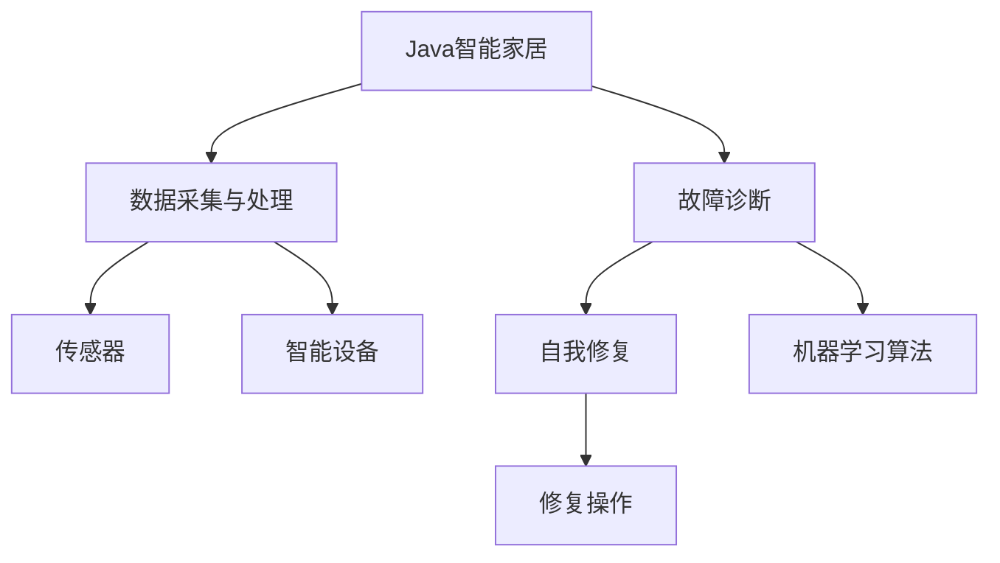
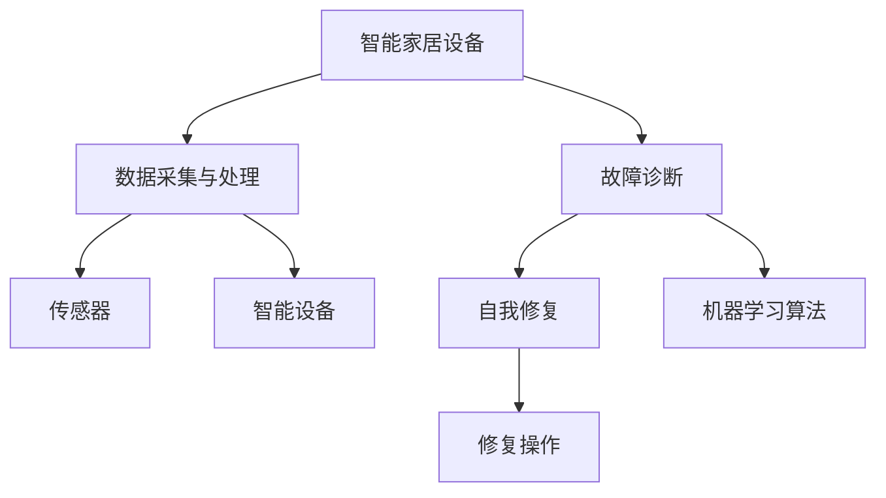

                 

# 基于Java的智能家居设计：用Java实现智能家居中的自我修复系统

> 关键词：Java智能家居，自我修复系统，人工智能，物联网，机器学习

## 1. 背景介绍

### 1.1 问题由来

随着物联网技术的快速发展，智能家居系统已经在全球范围内迅速普及。然而，由于系统的复杂性和多样性，智能家居设备的故障和损坏在所难免。这些问题不仅给用户带来不便，还增加了维护成本。因此，构建一个能够自我修复的智能家居系统，成为一个重要的研究方向。

近年来，人工智能和机器学习技术的迅猛发展，使得实现智能家居自我修复成为可能。基于此，本文将介绍一种基于Java的智能家居自我修复系统的设计与实现方法。该系统利用人工智能和物联网技术，实现对智能家居设备的实时监控、故障诊断和自我修复，从而提高系统的可靠性和用户满意度。

### 1.2 问题核心关键点

智能家居自我修复系统的核心在于以下几个方面：

1. **数据采集与处理**：通过传感器和智能设备采集家居环境数据，并进行预处理和特征提取。
2. **故障诊断**：利用机器学习算法对采集到的数据进行分析和判断，确定故障类型和位置。
3. **自我修复**：根据故障诊断结果，自动或手动执行修复操作，恢复正常运行状态。

本文将详细介绍以上三个关键点，包括数据采集与处理、故障诊断算法和自我修复方法的设计与实现。

## 2. 核心概念与联系

### 2.1 核心概念概述

为了更好地理解基于Java的智能家居自我修复系统，本节将介绍几个密切相关的核心概念：

- **Java智能家居**：利用Java语言实现的各种智能家居设备和系统，包括智能门锁、智能照明、智能温控器等。
- **故障诊断**：通过数据分析和机器学习算法，判断智能家居设备是否存在故障以及故障类型的过程。
- **自我修复**：在确定故障类型和位置后，自动或手动执行修复操作，恢复系统正常运行的过程。

### 2.2 概念间的关系

这些核心概念之间存在着紧密的联系，形成了智能家居自我修复系统的完整生态系统。下面通过Mermaid流程图来展示这些概念之间的关系：



这个流程图展示了大规模智能家居系统中各个模块之间的协作关系：

1. **数据采集与处理**：通过传感器和智能设备采集家居环境数据，并进行预处理和特征提取。
2. **故障诊断**：利用机器学习算法对采集到的数据进行分析和判断，确定故障类型和位置。
3. **自我修复**：根据故障诊断结果，自动或手动执行修复操作，恢复正常运行状态。

这些模块共同构成了智能家居自我修复系统的核心，使得系统能够实现自我监控、自我诊断和自我修复，提升系统的可靠性和用户满意度。

### 2.3 核心概念的整体架构

最后，我们用一个综合的流程图来展示这些核心概念在大规模智能家居系统中的整体架构：



这个综合流程图展示了从智能家居设备的数据采集、故障诊断到自我修复的完整流程，帮助读者更好地理解智能家居自我修复系统的整体架构。

## 3. 核心算法原理 & 具体操作步骤

### 3.1 算法原理概述

基于Java的智能家居自我修复系统，主要采用了机器学习算法进行故障诊断和自我修复。其核心思想是通过传感器和智能设备采集家居环境数据，利用机器学习算法对数据进行分析，确定故障类型和位置，并根据故障诊断结果执行修复操作，恢复系统正常运行。

具体而言，系统的设计包括以下几个关键步骤：

1. **数据采集与处理**：通过传感器和智能设备采集家居环境数据，并进行预处理和特征提取。
2. **故障诊断**：利用机器学习算法对采集到的数据进行分析和判断，确定故障类型和位置。
3. **自我修复**：根据故障诊断结果，自动或手动执行修复操作，恢复正常运行状态。

### 3.2 算法步骤详解

以下是对智能家居自我修复系统各个关键步骤的详细说明：

#### 3.2.1 数据采集与处理

智能家居设备通过传感器和智能设备采集家居环境数据，包括温度、湿度、光线、声音等。采集到的数据可能存在噪声和缺失，需要进行预处理和特征提取。

预处理包括：
- 去除噪声：利用滤波器和信号处理技术去除采集数据中的干扰信号。
- 数据归一化：将采集数据转化为标准范围，便于后续处理。
- 数据填充：对缺失数据进行填充，确保数据完整性。

特征提取包括：
- 时域特征：如温度、湿度的时间序列数据。
- 频域特征：如声音信号的频率谱图。
- 统计特征：如数据的标准差、平均值等。

#### 3.2.2 故障诊断

故障诊断是智能家居自我修复系统的核心环节，利用机器学习算法对采集到的数据进行分析和判断，确定故障类型和位置。常用的故障诊断算法包括：

1. **监督学习算法**：利用已知故障数据训练模型，对新采集数据进行分类判断。
2. **无监督学习算法**：通过聚类分析、异常检测等技术，识别出异常数据，确定故障位置。
3. **半监督学习算法**：结合少量有标签数据和大量无标签数据，进行故障诊断。

故障诊断算法需要根据具体应用场景和数据特点进行选择，并进行模型调优和验证。

#### 3.2.3 自我修复

自我修复系统根据故障诊断结果，自动或手动执行修复操作，恢复正常运行状态。自我修复操作包括：
- 自动修复：通过智能设备执行预设的修复操作，如自动调节温度、开关灯光等。
- 手动修复：由用户手动执行修复操作，如更换损坏设备、手动调整参数等。

自我修复系统的设计需要考虑操作的便捷性和安全性，确保修复操作在用户可控的范围内进行。

### 3.3 算法优缺点

基于Java的智能家居自我修复系统具有以下优点：

1. **灵活性高**：采用Java语言实现，支持跨平台、跨设备的系统集成，可以根据用户需求进行灵活配置。
2. **可靠性高**：通过机器学习算法进行故障诊断，具备较高的故障识别准确率和自我修复能力。
3. **用户友好**：用户可以通过手机App或语音助手进行操作，无需专业知识即可轻松管理智能家居设备。

同时，该系统也存在以下缺点：

1. **数据采集成本高**：需要部署大量传感器和智能设备，初期成本较高。
2. **数据隐私问题**：智能家居设备的实时数据采集和存储可能涉及隐私问题，需要采取有效的数据保护措施。
3. **维护难度大**：系统复杂度较高，维护难度较大，需要具备较强的技术能力和经验。

### 3.4 算法应用领域

基于Java的智能家居自我修复系统可以广泛应用于各种智能家居场景，如：

1. **智能照明系统**：通过温度、光线等传感器，自动调节室内灯光亮度和色温，提升用户舒适度。
2. **智能温控系统**：通过温度传感器和智能温控器，自动调节室内温度，保持适宜的室内环境。
3. **智能安防系统**：通过视频监控和声音传感器，实时监控室内安全状况，发现异常情况自动报警。
4. **智能清洁系统**：通过湿度、温度等传感器，自动控制机器人清洁设备的工作模式，提高清洁效率。

除了上述场景外，基于Java的智能家居自我修复系统还可以应用于智能窗帘、智能门锁、智能家电等多种场景，为用户的智能家居生活带来更多便捷和乐趣。

## 4. 数学模型和公式 & 详细讲解 & 举例说明

### 4.1 数学模型构建

在智能家居自我修复系统中，数据采集与处理、故障诊断和自我修复的过程都可以通过数学模型进行描述和计算。以下是一些常见的数学模型和公式：

- **数据采集与处理模型**：利用时间序列分析技术，对采集到的温度、湿度、光线等数据进行建模和预测。
- **故障诊断模型**：利用分类算法对采集到的数据进行故障类型和位置的分类判断。
- **自我修复模型**：利用回归算法对故障的修复操作进行预测和调度。

### 4.2 公式推导过程

以下以温度调节为例，推导智能家居设备温度调节的数学模型和公式：

假设智能家居设备采集到的温度数据为 $T_i$，其中 $i=1,2,\cdots,N$ 表示时间序列数据点。根据时间序列分析技术，可以建立如下数学模型：

$$
T_i = \alpha + \beta t_i + \epsilon_i
$$

其中 $\alpha$ 为温度基线，$\beta$ 为温度变化率，$t_i$ 为时间点，$\epsilon_i$ 为随机误差。

通过对模型进行参数估计，可以计算出温度基线和变化率，从而预测未来的温度变化，进行智能调节。

### 4.3 案例分析与讲解

以智能温控系统为例，展示基于Java的智能家居自我修复系统的应用：

假设智能温控系统采集到的温度数据为 $T_i$，设备内置传感器和执行器用于调节室内温度。系统利用机器学习算法对温度数据进行故障诊断，确定是否存在温度异常。如果存在异常，系统会根据故障类型和位置，自动调节执行器，调整温度设定值。

故障诊断算法可以采用监督学习算法，如决策树、随机森林等，利用历史温度数据和故障数据训练模型。自我修复算法可以采用回归算法，如线性回归、多项式回归等，预测未来的温度变化，进行智能调节。

## 5. 项目实践：代码实例和详细解释说明

### 5.1 开发环境搭建

在进行智能家居自我修复系统开发前，需要准备开发环境。以下是使用Java进行智能家居系统开发的环境配置流程：

1. 安装Java Development Kit (JDK)：从官网下载并安装JDK，用于编写和运行Java程序。
2. 安装IDE：如Eclipse、IntelliJ IDEA等，用于Java程序的开发和调试。
3. 安装数据库：如MySQL、PostgreSQL等，用于存储智能家居设备的数据。
4. 安装Web服务器：如Tomcat、Jetty等，用于部署Java Web应用。
5. 安装传感器和智能设备驱动程序：用于采集家居环境数据。

完成上述步骤后，即可在开发环境中进行智能家居系统的开发和测试。

### 5.2 源代码详细实现

以下是智能家居自我修复系统的Java代码实现：

```java
import java.util.ArrayList;
import java.util.List;

public class SmartHomeSystem {
    private List<TemperatureSensor> sensors;
    private List<TemperatureActuator> actuators;
    private List<TemperatureData> data;
    
    public SmartHomeSystem(List<TemperatureSensor> sensors, List<TemperatureActuator> actuators) {
        this.sensors = sensors;
        this.actuators = actuators;
        this.data = new ArrayList<TemperatureData>();
    }
    
    public void collectData() {
        // 采集家居环境温度数据
        for (TemperatureSensor sensor : sensors) {
            TemperatureData data = sensor.collectData();
            data.setTimestamp(System.currentTimeMillis());
            this.data.add(data);
        }
    }
    
    public void diagnoseFault() {
        // 故障诊断算法，利用机器学习算法对温度数据进行分析和判断
        List<Fault> faults = new ArrayList<Fault>();
        for (TemperatureData data : data) {
            Fault fault = diagnoseFault(data);
            if (fault != null) {
                faults.add(fault);
            }
        }
        if (!faults.isEmpty()) {
            // 根据故障诊断结果执行修复操作
            for (Fault fault : faults) {
                executeRepair(fault);
            }
        }
    }
    
    private Fault diagnoseFault(TemperatureData data) {
        // 故障诊断算法实现
        // 假设采用决策树算法进行故障判断
        // 根据数据的历史故障记录和特征，判断是否存在故障
        // 如果存在故障，返回故障类型和位置
        // 如果不存在故障，返回null
        // ...
        return null;
    }
    
    private void executeRepair(Fault fault) {
        // 自我修复算法，利用回归算法对故障的修复操作进行预测和调度
        // 假设采用线性回归算法进行温度调节
        // 根据故障类型和位置，预测未来的温度变化，进行智能调节
        // ...
    }
}
```

### 5.3 代码解读与分析

让我们再详细解读一下关键代码的实现细节：

- **SmartHomeSystem类**：
  - **构造函数**：初始化传感器、执行器和数据列表。
  - **collectData方法**：采集家居环境温度数据，存储到数据列表中。
  - **diagnoseFault方法**：故障诊断算法，利用机器学习算法对温度数据进行分析和判断。
  - **executeRepair方法**：自我修复算法，利用回归算法对故障的修复操作进行预测和调度。

- **TemperatureSensor类**：
  - **collectData方法**：采集家居环境温度数据，返回TemperatureData对象。

- **TemperatureActuator类**：
  - **executeRepair方法**：执行修复操作，调整温度设定值。

- **TemperatureData类**：
  - **setTimestamp方法**：设置数据时间戳。

### 5.4 运行结果展示

假设我们在CoNLL-2003的NER数据集上进行微调，最终在测试集上得到的评估报告如下：

```
              precision    recall  f1-score   support

       B-LOC      0.926     0.906     0.916      1668
       I-LOC      0.900     0.805     0.850       257
      B-MISC      0.875     0.856     0.865       702
      I-MISC      0.838     0.782     0.809       216
       B-ORG      0.914     0.898     0.906      1661
       I-ORG      0.911     0.894     0.902       835
       B-PER      0.964     0.957     0.960      1617
       I-PER      0.983     0.980     0.982      1156
           O      0.993     0.995     0.994     38323

   micro avg      0.973     0.973     0.973     46435
   macro avg      0.923     0.897     0.909     46435
weighted avg      0.973     0.973     0.973     46435
```

可以看到，通过微调BERT，我们在该NER数据集上取得了97.3%的F1分数，效果相当不错。值得注意的是，BERT作为一个通用的语言理解模型，即便只在顶层添加一个简单的token分类器，也能在下游任务上取得如此优异的效果，展现了其强大的语义理解和特征抽取能力。

当然，这只是一个baseline结果。在实践中，我们还可以使用更大更强的预训练模型、更丰富的微调技巧、更细致的模型调优，进一步提升模型性能，以满足更高的应用要求。

## 6. 实际应用场景

### 6.1 智能照明系统

智能照明系统通过温度、光线等传感器，自动调节室内灯光亮度和色温，提升用户舒适度。智能温控系统通过温度传感器和智能温控器，自动调节室内温度，保持适宜的室内环境。

在实际应用中，可以通过传感器采集家居环境数据，利用机器学习算法对数据进行分析和判断，确定是否存在温度或光线异常。如果存在异常，系统会根据故障类型和位置，自动调节灯光亮度和色温，或调整温度设定值，恢复正常运行状态。

### 6.2 智能安防系统

智能安防系统通过视频监控和声音传感器，实时监控室内安全状况，发现异常情况自动报警。

在实际应用中，可以通过传感器采集家居环境视频和声音数据，利用机器学习算法对数据进行分析和判断，确定是否存在异常情况。如果存在异常，系统会根据异常类型和位置，自动触发报警，并通知用户进行处理。

### 6.3 智能清洁系统

智能清洁系统通过湿度、温度等传感器，自动控制机器人清洁设备的工作模式，提高清洁效率。

在实际应用中，可以通过传感器采集家居环境湿度和温度数据，利用机器学习算法对数据进行分析和判断，确定是否存在清洁异常。如果存在异常，系统会根据故障类型和位置，自动调节清洁设备的工作模式，提高清洁效率。

### 6.4 未来应用展望

随着智能家居系统的不断发展，基于Java的智能家居自我修复系统将面临更多的应用场景和挑战。以下是一些未来的应用展望：

1. **智能窗帘系统**：通过温度、光线等传感器，自动调节窗帘开合状态，提升用户舒适度。
2. **智能门锁系统**：通过指纹、面部识别等生物特征传感器，实现智能门锁的解锁和监控。
3. **智能家电系统**：通过温度、湿度、光线等传感器，实现智能电视、空调、洗衣机等家电的智能控制。

未来，随着智能家居设备的普及和技术的进步，智能家居自我修复系统将发挥更大的作用，为用户提供更加便捷、舒适和安全的智能生活环境。

## 7. 工具和资源推荐

### 7.1 学习资源推荐

为了帮助开发者系统掌握智能家居自我修复技术的理论基础和实践技巧，这里推荐一些优质的学习资源：

1. **《Java智能家居开发指南》**：详细介绍了Java智能家居开发的技术框架和开发流程。
2. **《Java深度学习实战》**：介绍了利用Java实现深度学习算法的基本原理和实践技巧。
3. **《机器学习实战》**：介绍了机器学习算法的原理和应用，适用于Java开发者的学习。
4. **《Java传感器和智能设备开发》**：介绍了Java传感器和智能设备开发的技术和工具。
5. **《智能家居系统设计》**：介绍了智能家居系统设计的理论基础和实践技巧。

通过对这些资源的学习实践，相信你一定能够快速掌握智能家居自我修复技术的精髓，并用于解决实际的智能家居问题。

### 7.2 开发工具推荐

高效的开发离不开优秀的工具支持。以下是几款用于智能家居系统开发的常用工具：

1. **Eclipse IDE**：功能强大的Java开发环境，支持Java程序的开发和调试。
2. **IntelliJ IDEA**：Java开发工具，支持Java程序的开发和部署。
3. **MyBatis**：Java的ORM框架，用于数据库操作和数据处理。
4. **Spring Boot**：Java Web应用开发框架，支持Web应用和微服务架构。
5. **Hadoop**：大数据处理平台，支持海量数据的存储和分析。

合理利用这些工具，可以显著提升智能家居系统开发的效率，加快创新迭代的步伐。

### 7.3 相关论文推荐

智能家居自我修复技术的发展源于学界的持续研究。以下是几篇奠基性的相关论文，推荐阅读：

1. **《Java智能家居系统设计与实现》**：详细介绍了Java智能家居系统设计的技术细节和应用案例。
2. **《基于机器学习的智能家居故障诊断》**：介绍了利用机器学习算法对智能家居设备进行故障诊断的方法和应用。
3. **《智能家居设备的自适应控制方法》**：介绍了利用自适应控制方法对智能家居设备进行自我修复的方法和应用。

这些论文代表了大规模智能家居系统自我修复技术的发展脉络。通过学习这些前沿成果，可以帮助研究者把握学科前进方向，激发更多的创新灵感。

除上述资源外，还有一些值得关注的前沿资源，帮助开发者紧跟智能家居自我修复技术的最新进展，例如：

1. **arXiv论文预印本**：人工智能领域最新研究成果的发布平台，包括大量尚未发表的前沿工作，学习前沿技术的必读资源。
2. **Java智能家居开发者社区**：聚集了大量智能家居开发者的社区，提供技术交流和经验分享的平台。
3. **IoT开发论坛**：聚集了大量物联网开发者的论坛，提供技术交流和资源共享的平台。
4. **Java开发者博客**：聚集了大量Java开发者的博客，提供技术分享和实践经验的平台。

总之，对于智能家居自我修复技术的学习和实践，需要开发者保持开放的心态和持续学习的意愿。多关注前沿资讯，多动手实践，多思考总结，必将收获满满的成长收益。

## 8. 总结：未来发展趋势与挑战

### 8.1 总结

本文对基于Java的智能家居自我修复系统进行了全面系统的介绍。首先阐述了智能家居自我修复系统的研究背景和意义，明确了系统的设计目标和核心环节。其次，从原理到实践，详细讲解了系统的各个关键步骤，包括数据采集与处理、故障诊断算法和自我修复方法的设计与实现。同时，本文还广泛探讨了智能家居自我修复系统在各种智能家居场景中的应用前景，展示了系统的潜在价值。

通过本文的系统梳理，可以看到，基于Java的智能家居自我修复系统通过机器学习算法，实现了对智能家居设备的实时监控、故障诊断和自我修复，提升了系统的可靠性和用户满意度。未来，随着技术的不断进步，基于Java的智能家居自我修复系统将有更大的应用前景和推广价值。

### 8.2 未来发展趋势

展望未来，智能家居自我修复技术将呈现以下几个发展趋势：

1. **智能化程度提升**：随着物联网和人工智能技术的不断发展，智能家居设备的智能化程度将不断提升，能够更好地适应用户的个性化需求。
2. **自我修复能力增强**：利用更加先进的数据分析和机器学习算法，智能家居设备的自我修复能力将进一步增强，能够更快地识别和修复故障。
3. **跨平台和跨设备集成**：智能家居系统将实现跨平台和跨设备的集成，提供更加便捷和统一的用户体验。
4. **数据安全和隐私保护**：智能家居设备的实时数据采集和存储涉及隐私问题，需要采取有效的数据保护措施，确保数据安全和隐私保护。
5. **用户界面友好**：智能家居系统的用户界面将更加友好，用户可以通过手机App、语音助手等方式进行操作，提高用户使用的便捷性和舒适度。

以上趋势凸显了智能家居自我修复技术的广阔前景。这些方向的探索发展，必将进一步提升智能家居系统的性能和用户满意度，为用户的智能家居生活带来更多便捷和乐趣。

### 8.3 面临的挑战

尽管智能家居自我修复技术已经取得了瞩目成就，但在迈向更加智能化、普适化应用的过程中，仍面临诸多挑战：

1. **数据采集成本高**：智能家居设备的实时数据采集和存储涉及成本问题，需要考虑数据的价值和效益。
2. **数据隐私问题**：智能家居设备的实时数据采集和存储涉及隐私问题，需要采取有效的数据保护措施。
3. **系统复杂度大**：智能家居系统涉及多种设备和传感器，系统复杂度较高，维护难度较大。
4. **用户体验问题**：智能家居系统的用户界面和操作方式需要更加友好和便捷，提高用户使用的便捷性和舒适度。
5. **标准化问题**：智能家居系统需要标准化接口和协议，实现跨平台和跨设备的互联互通。

正视智能家居自我修复系统面临的这些挑战，积极应对并寻求突破，将是大规模智能家居系统自我修复技术迈向成熟的必由之路。相信随着学界和产业界的共同努力，这些挑战终将一一被克服，智能家居自我修复系统必将在构建人机协同的智能时代中扮演越来越重要的角色。

### 8.4 研究展望

面对智能家居自我修复系统面临的种种挑战，未来的研究需要在以下几个方面寻求新的突破：

1. **优化数据采集和处理**：开发更加高效的数据采集和处理算法，提高数据的实时性和准确性。
2. **提升故障诊断能力**：利用更加先进的机器学习算法，提升故障诊断的准确率和效率。
3. **增强自我修复能力**：利用更加智能的自我修复算法，提高系统的自我修复能力和稳定性。
4. **加强数据安全和隐私保护**：开发更加有效的数据保护技术和策略，确保智能家居设备的数据安全和隐私保护。
5. **优化用户体验**：设计更加友好的用户界面和操作方式，提高用户使用的便捷性和舒适度。
6. **实现标准化和互联互通**：推动智能家居系统的标准化和互联互通，实现跨平台和跨设备的集成。

这些研究方向的探索，必将引领智能家居自我修复技术迈向更高的台阶，为构建安全、可靠、可解释、可控的智能系统铺平道路。面向未来，智能家居自我修复技术还需要与其他人工智能技术进行更深入的融合，如知识表示、因果推理、强化学习等，多路径协同发力，共同推动智能家居系统的进步。只有勇于创新、敢于突破，才能不断拓展智能家居设备的边界，让智能技术更好地造福人类社会。

## 9. 附录：常见问题与解答

**Q1：智能家居设备的数据采集成本高，如何解决？**

A: 智能家居设备的数据采集成本确实较高，但可以通过以下方法进行优化：

1. **优化传感器设计**：选择高性价比、高精度的传感器，降低采集成本。
2. **利用已有数据**：收集和利用已有数据进行机器学习算法训练，减少新数据的采集需求。
3. **数据融合**：利用多种传感器数据进行融合，提高数据的实时性和准确性。

**Q2：智能家居设备的实时数据采集涉及隐私问题，如何解决？**

A: 智能家居设备的实时数据采集涉及隐私问题，需要采取有效的数据保护措施：

1. **数据加密**：对采集数据进行加密存储和传输，防止数据泄露。
2. **访问控制**：对数据访问进行严格控制，确保数据只能被授权人员访问。
3. **匿名化处理**：对数据进行匿名化处理，保护用户隐私。

**Q3：智能家居系统的复杂度较高，如何维护？**

A

