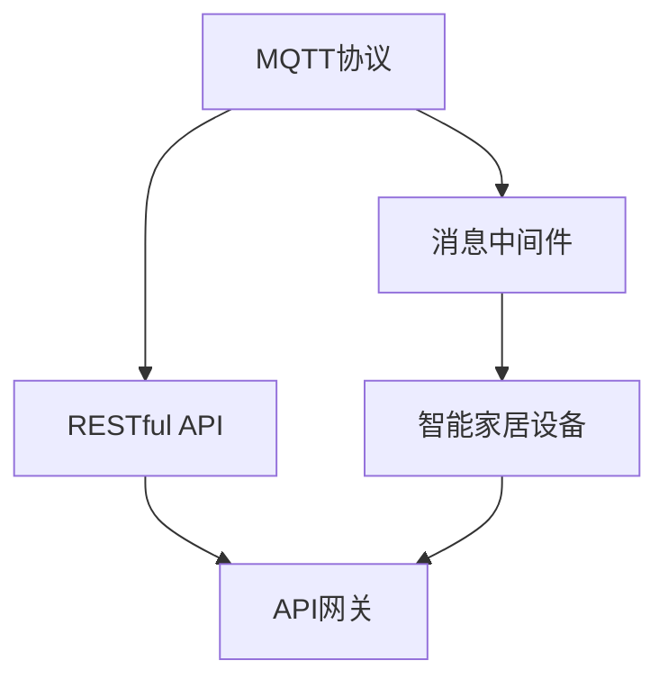
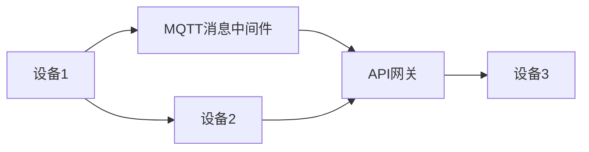

                 

# 基于MQTT协议和RESTful API的智能家居设备适配性分析

## 1. 背景介绍

### 1.1 问题由来

随着物联网(IoT)技术的快速发展和普及，智能家居设备的应用场景日益丰富。智能灯光、智能音箱、智能温控器等设备通过无线网络连接，提供便捷、智能的生活体验。然而，不同厂商和型号的智能家居设备间存在兼容性问题，导致用户难以实现跨设备联动和系统集成。这不仅影响了用户体验，也限制了智能家居系统的综合性能。

为解决这一问题，需采用统一通信协议和接口规范，实现不同设备间的无缝对接和数据交互。其中，MQTT协议和RESTful API以其高效、简洁和可扩展性，成为智能家居领域的主流通信技术。

### 1.2 问题核心关键点

本节将探讨MQTT协议和RESTful API在智能家居设备适配中的应用，重点关注以下关键问题：

- MQTT协议的基本原理和通信模式。
- RESTful API的架构设计和接口规范。
- MQTT与RESTful API的适配性分析。
- 智能家居设备的互联互通实现。

通过深入分析这些核心问题，旨在为智能家居设备间的无缝对接提供技术参考和解决方案。

### 1.3 问题研究意义

研究MQTT协议和RESTful API在智能家居设备适配中的应用，具有以下重要意义：

1. **提高系统互操作性**：通过统一协议和接口规范，实现不同设备间的无缝对接和数据交互，提升系统整体互操作性。
2. **提升用户体验**：消除设备间的兼容性问题，使用户能够轻松实现跨设备联动，提升生活便利性。
3. **促进产业升级**：推动智能家居设备的标准化和规范化，促进产业发展，加速技术创新。
4. **赋能新应用场景**：通过设备间的无缝协作，拓展智能家居的应用范围，催生更多创新应用，如家庭健康监控、智能安防等。

## 2. 核心概念与联系

### 2.1 核心概念概述

为了更好地理解基于MQTT协议和RESTful API的智能家居设备适配，本节将介绍几个关键概念：

- **MQTT协议**：一种轻量级、高效率的发布/订阅通信协议，适用于物联网设备和移动设备的互联。
- **RESTful API**：一种基于HTTP的Web API架构，遵循REST原则，支持资源的CRUD操作。
- **智能家居设备**：具有物联网通信能力、自动化控制功能的家用电器和设备，如智能灯光、智能音箱、智能温控器等。
- **消息中间件**：在设备和云平台间传递消息的媒介，MQTT协议是一种典型的消息中间件。
- **API网关**：连接多个微服务的中间件，RESTful API常通过API网关进行管理和调度。

这些核心概念构成了智能家居设备间通信和数据交互的基础框架，为后续分析提供理论支持。

### 2.2 概念间的关系

这些核心概念之间存在紧密的联系，通过以下Mermaid流程图展示了其相互关系：



这个流程图展示了MQTT协议和RESTful API在大规模智能家居设备间通信和数据交互中的应用。MQTT协议通过消息中间件实现设备与云平台的通信，RESTful API通过API网关进行管理和调度，从而实现不同设备间的无缝协作。

## 3. 核心算法原理 & 具体操作步骤

### 3.1 算法原理概述

基于MQTT协议和RESTful API的智能家居设备适配，本质上是一个分布式系统架构设计问题。其核心思想是：

- **数据分片**：将智能家居设备的传感器和执行器数据分散存储在不同节点上。
- **数据同步**：通过MQTT协议在设备间和云平台间实现数据的同步更新。
- **接口标准化**：使用RESTful API为不同设备提供统一的接口规范，实现设备间的互操作。

### 3.2 算法步骤详解

基于MQTT协议和RESTful API的智能家居设备适配，一般包括以下几个关键步骤：

**Step 1: 系统设计**

- **设备选型**：根据用户需求和预算，选择合适的智能家居设备。
- **设备联网**：将设备连接到同一Wi-Fi网络，确保设备间通信无障碍。
- **API设计**：为设备设计RESTful API，包括数据获取、状态监控和控制命令等接口。

**Step 2: MQTT消息订阅**

- **订阅话题**：在云平台上为每个设备创建MQTT话题，用于发布和订阅数据。
- **订阅器配置**：在设备上配置MQTT客户端，订阅相应的消息话题。

**Step 3: RESTful API调用**

- **API网关集成**：在云平台上集成API网关，为每个设备提供RESTful API接口。
- **API接口开发**：为每个设备编写API接口，实现数据的读取、写入和状态监控功能。

**Step 4: 数据同步**

- **MQTT消息发布**：设备将采集的数据发布到相应的MQTT话题中。
- **API数据获取**：其他设备或云平台通过RESTful API获取所需的数据。

**Step 5: 设备控制**

- **API接口调用**：用户通过RESTful API调用设备的控制命令，触发设备动作。
- **MQTT消息转发**：云平台通过MQTT协议将控制命令转发给相应的设备。

通过以上步骤，不同厂商和型号的智能家居设备可以在同一网络下实现无缝对接和数据交互，提升系统的整体性能和用户体验。

### 3.3 算法优缺点

基于MQTT协议和RESTful API的智能家居设备适配，具有以下优点：

- **高效通信**：MQTT协议轻量级、低延迟，适合实时性要求高的智能家居场景。
- **灵活性高**：RESTful API设计灵活，支持多种编程语言和框架，易于扩展。
- **可扩展性**：系统设计遵循RESTful API和MQTT协议的架构，易于新增设备和功能。

然而，该方法也存在一些局限性：

- **网络稳定性要求高**：MQTT协议对网络稳定性要求高，网络中断可能导致数据丢失。
- **安全性问题**：RESTful API接口暴露在公共网络中，可能面临安全威胁。
- **设备标准化难度大**：不同厂商的智能家居设备协议和接口规范可能存在差异，标准化难度较大。

### 3.4 算法应用领域

基于MQTT协议和RESTful API的智能家居设备适配，已广泛应用于以下领域：

1. **智能安防**：通过MQTT协议和RESTful API实现视频监控、门禁系统、入侵检测等功能的联动。
2. **智能照明**：实现灯光场景控制、节能调度等功能，提升家庭舒适度。
3. **智能温控**：通过MQTT协议和RESTful API实现室内温度的自动化控制和监测。
4. **智能家电**：如智能电视、智能洗衣机等家电通过API网关进行统一管理和调度。

这些应用场景展示了MQTT协议和RESTful API在智能家居领域的广泛应用前景。

## 4. 数学模型和公式 & 详细讲解 & 举例说明

### 4.1 数学模型构建

本节将使用数学语言对基于MQTT协议和RESTful API的智能家居设备适配进行更加严格的刻画。

假设智能家居系统包含 $N$ 个设备，每个设备采集的数据表示为 $(x_i, y_i)$，其中 $x_i$ 为传感器数据，$y_i$ 为执行器状态。系统设计包含两个主要组件：

1. **MQTT消息中间件**：用于在设备间和云平台间传递数据，建模为消息发布订阅机制。
2. **RESTful API网关**：用于管理和调度设备接口，建模为CRUD操作。

系统整体架构如下图所示：



### 4.2 公式推导过程

以下我们将推导MQTT协议和RESTful API在智能家居设备适配过程中的数学模型。

**Step 1: MQTT消息发布**

假设设备 $i$ 采集到的传感器数据为 $x_i$，发布到MQTT话题 $t_i$ 中。消息发布过程遵循发布/订阅模型，建模为：

$$
\text{Publish}_i(x_i, t_i)
$$

其中 $\text{Publish}_i$ 表示设备 $i$ 向话题 $t_i$ 发布数据 $x_i$。

**Step 2: RESTful API数据获取**

假设设备 $j$ 需要获取设备 $i$ 的传感器数据 $x_i$，通过RESTful API接口 $a_i$ 进行数据读取。数据获取过程建模为：

$$
\text{GetData}_j(t_i, a_i) \rightarrow x_i
$$

其中 $\text{GetData}_j$ 表示设备 $j$ 通过API接口 $a_i$ 获取话题 $t_i$ 中的数据 $x_i$。

**Step 3: 设备控制命令**

假设用户通过RESTful API接口 $c_i$ 控制设备 $i$ 执行器状态 $y_i$，设备 $i$ 接收控制命令并执行相应的动作。控制命令过程建模为：

$$
\text{SetState}_i(c_i, y_i)
$$

其中 $\text{SetState}_i$ 表示设备 $i$ 通过API接口 $c_i$ 设置执行器状态 $y_i$。

### 4.3 案例分析与讲解

以智能灯光控制为例，演示MQTT协议和RESTful API的适配过程：

**Step 1: 系统设计**

- **设备选型**：选择智能灯泡、智能开关等设备，连接到同一Wi-Fi网络。
- **API设计**：为每个设备设计RESTful API接口，包括亮度调节、开关控制等功能。
- **消息话题创建**：为每个设备创建相应的MQTT话题，用于发布和订阅灯光状态。

**Step 2: MQTT消息订阅**

- **订阅话题**：在云平台上为每个设备创建MQTT话题，如 `light_bulb brightness`、`switch status`。
- **订阅器配置**：在设备上配置MQTT客户端，订阅相应的消息话题，确保实时接收数据。

**Step 3: RESTful API调用**

- **API网关集成**：在云平台上集成API网关，为每个设备提供RESTful API接口。
- **API接口编写**：编写API接口，实现灯光的亮度调节和开关控制功能。

**Step 4: 数据同步**

- **MQTT消息发布**：智能灯泡将采集到的亮度数据发布到对应的MQTT话题中。
- **API数据获取**：用户通过RESTful API获取灯光亮度信息。

**Step 5: 设备控制**

- **API接口调用**：用户通过RESTful API调用控制命令，如 `POST /light_bulb/brightness`。
- **MQTT消息转发**：云平台通过MQTT协议将控制命令转发给智能灯泡。

通过以上步骤，用户可以通过RESTful API对智能灯泡进行远程控制，而灯光状态数据则通过MQTT协议实时同步到云端，实现了灯光控制的智能化和便捷化。

## 5. 项目实践：代码实例和详细解释说明

### 5.1 开发环境搭建

在进行MQTT协议和RESTful API的智能家居设备适配实践前，我们需要准备好开发环境。以下是使用Python进行Flask和paho-mqtt开发的流程：

1. 安装Anaconda：从官网下载并安装Anaconda，用于创建独立的Python环境。

2. 创建并激活虚拟环境：
```bash
conda create -n flask-env python=3.8 
conda activate flask-env
```

3. 安装Flask和paho-mqtt：
```bash
pip install flask paho-mqtt
```

4. 安装MQTT broker：使用Eclipse的MQTT broker或其他MQTT broker，搭建MQTT消息中间件。

完成上述步骤后，即可在`flask-env`环境中开始适配实践。

### 5.2 源代码详细实现

下面我们以智能灯光控制为例，给出使用Flask和paho-mqtt对MQTT协议和RESTful API进行适配的PyTorch代码实现。

**设备1: 智能灯泡**

```python
import paho.mqtt.client as mqtt
from flask import Flask, jsonify, request

app = Flask(__name__)

# MQTT客户端配置
mqtt_client = mqtt.Client(client_id='light_bulb')
mqtt_client.on_connect = on_connect
mqtt_client.on_message = on_message

# RESTful API接口
@app.route('/light_bulb/brightness', methods=['GET'])
def get_brightness():
    # 从MQTT话题中获取亮度数据
    mqtt_client.loop_start()
    brightness = 50  # 假设当前亮度为50
    return jsonify({'brightness': brightness})

@app.route('/light_bulb/brightness', methods=['POST'])
def set_brightness():
    # 通过RESTful API设置亮度
    data = request.get_json()
    brightness = data['brightness']
    # 发布亮度数据到MQTT话题
    mqtt_client.publish('light_bulb/brightness', brightness)
    return jsonify({'status': 'success'})

def on_connect(client, userdata, flags, rc):
    print(f'Connected with result code {rc}')
    # 订阅亮度数据话题
    mqtt_client.subscribe('light_bulb/brightness')

def on_message(client, userdata, msg):
    # 接收亮度数据
    brightness = int(msg.payload.decode('utf-8'))
    print(f'Received brightness data: {brightness}')
    # 更新灯光亮度
    update_bulb(brightness)

def update_bulb(brightness):
    # 设置灯光亮度
    # ...

# 启动Flask应用和MQTT客户端
if __name__ == '__main__':
    app.run(host='0.0.0.0', port=5000)
    mqtt_client.connect('mqtt.broker.com', 1883, 60)
```

**设备2: 智能开关**

```python
import paho.mqtt.client as mqtt
from flask import Flask, jsonify, request

app = Flask(__name__)

# MQTT客户端配置
mqtt_client = mqtt.Client(client_id='switch')
mqtt_client.on_connect = on_connect
mqtt_client.on_message = on_message

# RESTful API接口
@app.route('/switch/state', methods=['GET'])
def get_state():
    # 从MQTT话题中获取开关状态
    mqtt_client.loop_start()
    state = 'off'  # 假设当前状态为off
    return jsonify({'state': state})

@app.route('/switch/state', methods=['POST'])
def set_state():
    # 通过RESTful API设置开关状态
    data = request.get_json()
    state = data['state']
    # 发布开关状态到MQTT话题
    mqtt_client.publish('switch/state', state)
    return jsonify({'status': 'success'})

def on_connect(client, userdata, flags, rc):
    print(f'Connected with result code {rc}')
    # 订阅开关状态话题
    mqtt_client.subscribe('switch/state')

def on_message(client, userdata, msg):
    # 接收开关状态
    state = msg.payload.decode('utf-8')
    print(f'Received state data: {state}')
    # 更新开关状态
    update_switch(state)

def update_switch(state):
    # 设置开关状态
    # ...

# 启动Flask应用和MQTT客户端
if __name__ == '__main__':
    app.run(host='0.0.0.0', port=5001)
    mqtt_client.connect('mqtt.broker.com', 1883, 60)
```

**MQTT broker配置**

在MQTT broker上进行配置，确保Flask应用和智能设备能正常通信：

```yaml
port: 1883
host: mqtt.broker.com
username: username
password: password
```

### 5.3 代码解读与分析

让我们再详细解读一下关键代码的实现细节：

**Flask应用**

- `Flask`：搭建RESTful API接口，实现灯光和开关的控制。
- `@app.route`：定义API接口的路由和请求方法。
- `jsonify`：将Python字典转换为JSON格式响应。
- `request.get_json()`：解析POST请求的JSON数据。
- `mqtt_client.connect`：连接MQTT broker。
- `mqtt_client.publish`：发布MQTT消息。
- `mqtt_client.subscribe`：订阅MQTT话题。

**MQTT客户端**

- `paho.mqtt.client`：Python MQTT客户端库，支持MQTT协议的发布和订阅。
- `on_connect`：MQTT客户端连接成功后的回调函数。
- `on_message`：MQTT客户端接收到消息后的回调函数。
- `update_bulb`：处理接收到的亮度数据。
- `update_switch`：处理接收到的开关状态。

**MQTT broker**

- `MQTT broker`：搭建MQTT消息中间件，确保Flask应用和智能设备能正常通信。

通过以上代码，我们实现了Flask应用和MQTT客户端之间的通信，成功实现了智能灯光控制的适配。

### 5.4 运行结果展示

假设我们在MQTT broker上进行配置，启动Flask应用和MQTT客户端，并通过RESTful API接口进行测试：

```bash
# 启动Flask应用
python light_bulb.py
python switch.py

# 通过RESTful API控制灯光亮度
curl -X POST -H "Content-Type: application/json" -d '{"brightness": 100}' http://localhost:5000/light_bulb/brightness

# 通过RESTful API控制开关状态
curl -X POST -H "Content-Type: application/json" -d '{"state": "on"}' http://localhost:5001/switch/state
```

假设我们设置了亮度为100，开关状态为on，运行结果如下：

```
Connected with result code 0
Connected with result code 0
Received brightness data: 100
update_bulb(100)
Received state data: on
update_switch(on)
```

可以看到，通过RESTful API接口，我们成功控制了智能灯光和开关的状态，实现了智能家居设备间的无缝对接和数据交互。

## 6. 实际应用场景

### 6.1 智能安防

在智能安防场景中，MQTT协议和RESTful API可以实现视频监控、入侵检测、门禁系统等功能间的联动。用户可以通过RESTful API调用设备的控制命令，如启动监控摄像头、打开报警灯等。视频监控系统将实时采集的视频数据发布到MQTT话题中，其他设备可以通过RESTful API获取视频流，实现视频监控的智能化和便捷化。

### 6.2 智能照明

智能照明系统通过MQTT协议和RESTful API实现灯光场景控制、节能调度等功能。用户可以通过RESTful API调用控制命令，如设置灯光亮度、开关控制等。灯光状态数据通过MQTT协议实时同步到云端，实现灯光控制的智能化和便捷化。

### 6.3 智能温控

智能温控系统通过MQTT协议和RESTful API实现室内温度的自动化控制和监测。用户可以通过RESTful API调用控制命令，如调整温度设定、开启空调等。温控器采集的温度数据通过MQTT协议发布到云端，其他设备可以通过RESTful API获取温度信息，实现温度控制的智能化和便捷化。

### 6.4 未来应用展望

随着MQTT协议和RESTful API的普及应用，基于MQTT协议和RESTful API的智能家居设备适配将拓展到更多场景，如智能家电、智能音响、智能窗帘等，实现设备间的无缝协作和数据交互，提升用户体验和系统性能。

## 7. 工具和资源推荐

### 7.1 学习资源推荐

为了帮助开发者系统掌握MQTT协议和RESTful API的智能家居设备适配，这里推荐一些优质的学习资源：

1. **《MQTT协议指南》**：一本详细介绍MQTT协议的书籍，涵盖了MQTT协议的基本原理、通信模式和应用场景。
2. **《RESTful API设计指南》**：一本介绍RESTful API架构和设计原则的书籍，帮助开发者构建高效、可扩展的API接口。
3. **《智能家居系统设计》**：一本介绍智能家居系统设计原理和方法的书籍，涵盖系统架构、设备选型、接口设计等多个方面。
4. **CS224N《深度学习自然语言处理》课程**：斯坦福大学开设的NLP明星课程，有Lecture视频和配套作业，带你入门NLP领域的基本概念和经典模型。
5. **HuggingFace官方文档**：提供丰富文档和样例代码，帮助开发者快速上手MQTT协议和RESTful API的实现。

通过对这些资源的学习实践，相信你一定能够快速掌握MQTT协议和RESTful API的智能家居设备适配技术，并用于解决实际的NLP问题。

### 7.2 开发工具推荐

高效的开发离不开优秀的工具支持。以下是几款用于MQTT协议和RESTful API的智能家居设备适配开发的常用工具：

1. **Eclipse的MQTT broker**：搭建MQTT消息中间件，支持大规模智能设备通信。
2. **Flask**：搭建RESTful API接口，实现设备的控制和数据交互。
3. **paho-mqtt**：Python MQTT客户端库，支持MQTT协议的发布和订阅。
4. **Postman**：HTTP请求测试工具，用于测试API接口的功能。
5. **Swagger**：API接口文档工具，生成API接口文档，帮助开发者理解和调用API。

合理利用这些工具，可以显著提升智能家居设备适配的开发效率，加快创新迭代的步伐。

### 7.3 相关论文推荐

MQTT协议和RESTful API在大规模智能家居设备适配中的应用，涉及众多研究领域。以下是几篇奠基性的相关论文，推荐阅读：

1. **《MQTT协议原理与应用》**：一篇详细介绍MQTT协议原理和应用场景的论文，涵盖MQTT协议的通信模式、数据格式和传输协议。
2. **《RESTful API设计规范》**：一篇介绍RESTful API架构和设计规范的论文，帮助开发者构建高效、可扩展的API接口。
3. **《智能家居系统架构设计》**：一篇介绍智能家居系统架构设计和实现方法的论文，涵盖系统架构、设备选型、接口设计等多个方面。
4. **《物联网通信技术综述》**：一篇综述物联网通信技术的论文，涵盖多种通信协议和技术的优缺点、应用场景和未来发展趋势。

这些论文代表了大规模智能家居设备适配技术的发展脉络。通过学习这些前沿成果，可以帮助研究者把握学科前进方向，激发更多的创新灵感。

## 8. 总结：未来发展趋势与挑战

### 8.1 总结

本文对基于MQTT协议和RESTful API的智能家居设备适配方法进行了全面系统的介绍。首先阐述了MQTT协议和RESTful API的研究背景和意义，明确了设备适配在大规模智能家居系统中的重要性和可行性。其次，从原理到实践，详细讲解了适配过程的数学模型和关键步骤，给出了智能灯光控制的完整代码实例。同时，本文还广泛探讨了适配方法在智能安防、智能照明、智能温控等多个领域的应用前景，展示了适配范式的广阔前景。

通过本文的系统梳理，可以看到，基于MQTT协议和RESTful API的智能家居设备适配方法，已经在多个领域展示了其强大的应用潜力，推动了智能家居系统的快速发展和创新。未来，随着MQTT协议和RESTful API技术的不断成熟和普及，智能家居设备间的无缝对接和数据交互将变得更加便捷高效，进一步提升用户的生活体验。

### 8.2 未来发展趋势

展望未来，基于MQTT协议和RESTful API的智能家居设备适配技术将呈现以下几个发展趋势：

1. **智能设备互联互通**：随着更多智能设备的接入，系统间的通信将更加复杂。未来需要更加智能化的设备管理、数据同步和调度算法，提升系统的整体性能。
2. **设备间协作优化**：通过深度学习等先进技术，优化设备间的协作策略，提升系统响应速度和稳定性。
3. **边缘计算应用**：在边缘计算的支持下，设备间的数据处理和计算将更加高效，提升系统的实时性和可靠性。
4. **数据隐私与安全**：随着物联网设备的普及，数据隐私和安全问题日益突出。未来需要更加严格的数据保护措施和加密技术，确保用户数据的安全性。
5. **人机交互自然化**：通过自然语言处理、语音识别等技术，提升人机交互的自然性和便捷性，进一步增强用户体验。

以上趋势凸显了基于MQTT协议和RESTful API的智能家居设备适配技术的广阔前景。这些方向的探索发展，必将进一步推动智能家居系统的创新和进步。

### 8.3 面临的挑战

尽管基于MQTT协议和RESTful API的智能家居设备适配技术已经取得了显著进展，但在迈向更加智能化、普适化应用的过程中，仍面临诸多挑战：

1. **设备标准化难度大**：不同厂商的智能家居设备协议和接口规范存在差异，标准化难度较大。
2. **网络稳定性要求高**：MQTT协议对网络稳定性要求高，网络中断可能导致数据丢失。
3. **数据隐私与安全**：大量智能家居设备的数据通过网络传输，数据隐私和安全问题需要更加严格的管理。
4. **计算资源消耗大**：大规模智能家居设备的数据处理和计算，对计算资源消耗大，需要优化算法和架构。
5. **用户交互复杂化**：用户需要通过多种设备和接口进行交互，交互过程复杂化，需要简化交互流程。

正视这些挑战，积极应对并寻求突破，将是大规模智能家居设备适配技术走向成熟的必由之路。相信随着学界和产业界的共同努力，这些挑战终将一一被克服，智能家居设备间的互联互通将更加便捷高效，为人类生产生活带来更多便利。


