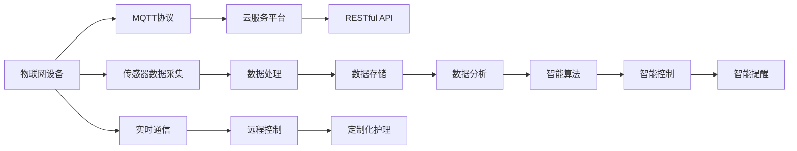

                 

## 1. 背景介绍

### 1.1 问题由来

随着生活水平的提高，人们对于衣物的需求和品质要求也在不断提升，同时也越来越注重衣物的管理和护理。传统的衣物管理方式主要是通过手动分类、存放，随着家庭和职场物品数量的增加，这种管理方式越来越显得繁琐和低效。同时，衣物护理过程繁琐，很多家庭和职场都因为缺少护理知识而使衣物受损，影响外观和寿命。

现代科技的发展为衣物管理和护理带来了新的解决方案。基于物联网的智能衣物管理和护理系统可以通过传感器、智能标签等方式实现衣物的自动识别、分类、存放，并通过移动端APP实时查看衣物状态，进行远程控制和定制化护理。这些系统通常采用有线或无线通信协议，如Wi-Fi、蓝牙等，但这些协议存在一些缺点，如需要稳定的Wi-Fi环境、易受到周围干扰等。

为了克服这些缺点，本文将介绍一种新兴的物联网通信协议——MQTT（Message Queuing Telemetry Transport），并结合RESTful API技术，构建一个基于MQTT协议和RESTful API的智能衣物管理和护理系统。

### 1.2 问题核心关键点

1. **智能衣物管理和护理系统的关键功能**：衣物自动识别、分类、存放、远程控制和定制化护理。
2. **MQTT协议的特点**：轻量级、低带宽、高实时性、支持离线通信、适用于物联网等。
3. **RESTful API的特点**：基于HTTP协议，易于实现、易于扩展、支持多种数据格式、支持跨平台。
4. **系统架构**：智能衣物管理模块、智能衣物护理模块、移动端APP、云服务平台。
5. **关键技术**：传感器技术、物联网技术、MQTT协议、RESTful API、云计算和大数据。

## 2. 核心概念与联系

### 2.1 核心概念概述

#### 2.1.1 MQTT协议

MQTT是一种轻量级、高实时性的通信协议，用于物联网设备的通信。MQTT协议基于TCP协议，采用发布/订阅模式，设备通过发布消息，其他设备通过订阅消息获取信息。MQTT协议的特点包括：

- **轻量级**：消息格式简单，数据传输占用带宽小。
- **低带宽**：适用于网络带宽较低的物联网环境。
- **高实时性**：通过发布/订阅模式，消息传递速度快。
- **支持离线通信**：设备在离线状态下仍可发布和订阅消息。
- **易于部署和维护**：无需复杂的中间件，可轻松搭建和调试。

#### 2.1.2 RESTful API

RESTful API是一种基于HTTP协议的API设计风格，采用资源驱动架构，通过HTTP请求的方式进行数据交互。RESTful API的特点包括：

- **基于HTTP协议**：利用HTTP协议的高可用性和广泛性。
- **易于实现**：API设计简洁，易于开发和维护。
- **易于扩展**：支持多种数据格式和协议，易于集成到其他系统。
- **支持跨平台**：支持多种编程语言和操作系统。
- **安全性**：通过HTTPS、OAuth2等安全机制保护数据安全。

### 2.2 概念间的关系

通过以下Mermaid流程图展示MQTT协议和RESTful API在大规模物联网系统中的应用：



该流程图展示了基于MQTT协议和RESTful API的物联网系统架构，包括传感器数据采集、数据处理、数据存储、数据分析、智能算法、智能控制和智能提醒等环节。物联网设备通过MQTT协议与云服务平台通信，云服务平台再通过RESTful API与移动端APP交互，实现衣物管理的各种功能。

## 3. 核心算法原理 & 具体操作步骤

### 3.1 算法原理概述

基于MQTT协议和RESTful API的智能衣物管理和护理系统，主要涉及传感器技术、物联网技术、MQTT协议、RESTful API、云计算和大数据等关键技术。系统的核心算法原理包括：

- **传感器数据采集**：通过传感器采集衣物的温度、湿度、气味等数据，发送至MQTT消息队列。
- **数据处理和存储**：使用MQTT协议的发布/订阅模式，将传感器数据发送至云服务平台，进行数据处理和存储。
- **数据分析和智能算法**：使用大数据和机器学习算法，对衣物数据进行分析和预测，如识别衣物损坏、预测衣物磨损等。
- **智能控制和远程控制**：根据数据分析结果，通过RESTful API控制衣物护理设备，如烘干机、熨烫机等，实现远程控制和定制化护理。
- **智能提醒**：通过RESTful API向移动端APP发送衣物状态和提醒信息，及时告知用户衣物状态。

### 3.2 算法步骤详解

#### 3.2.1 系统架构设计

1. **传感器模块**：安装在衣物上的传感器，采集衣物的温度、湿度、气味等数据，发送至MQTT消息队列。
2. **数据处理模块**：接收MQTT消息，进行数据处理和存储，包括数据清洗、格式转换、去重等。
3. **数据分析模块**：使用大数据和机器学习算法，对衣物数据进行分析和预测，如识别衣物损坏、预测衣物磨损等。
4. **智能控制模块**：根据数据分析结果，通过RESTful API控制衣物护理设备，如烘干机、熨烫机等。
5. **智能提醒模块**：通过RESTful API向移动端APP发送衣物状态和提醒信息，及时告知用户衣物状态。

#### 3.2.2 MQTT协议的应用

1. **设备注册和认证**：设备在接入MQTT服务器前，需要先注册并认证，确保通信安全。
2. **消息发布和订阅**：设备发布传感器数据，其他设备订阅数据，实现实时通信。
3. **离线通信**：设备在离线状态下仍可发布和订阅消息，确保数据连续性。

#### 3.2.3 RESTful API的应用

1. **API设计**：设计RESTful API接口，支持设备注册、数据采集、数据分析、智能控制等功能。
2. **API实现**：使用Python Flask框架，实现RESTful API接口，支持HTTP请求和响应。
3. **API测试**：使用Postman等工具测试API接口，确保接口正确性和稳定性。

#### 3.2.4 数据存储和处理

1. **数据存储**：使用MySQL等关系型数据库存储传感器数据和处理结果，支持数据查询和分析。
2. **数据处理**：使用Python Pandas库，对传感器数据进行清洗、转换、去重等处理，确保数据质量。
3. **数据分析**：使用Python Scikit-learn库，进行数据分析和预测，如识别衣物损坏、预测衣物磨损等。

#### 3.2.5 智能控制和远程控制

1. **智能控制**：根据数据分析结果，通过RESTful API控制衣物护理设备，如烘干机、熨烫机等。
2. **远程控制**：使用RESTful API实现远程控制，用户可通过移动端APP控制衣物护理设备。

#### 3.2.6 智能提醒

1. **智能提醒**：根据数据分析结果，通过RESTful API向移动端APP发送衣物状态和提醒信息。
2. **提醒机制**：设置提醒机制，如衣服需要熨烫、衣物即将损坏等，及时告知用户。

### 3.3 算法优缺点

#### 3.3.1 优点

1. **高实时性**：MQTT协议具有高实时性，能够实时获取传感器数据，并进行快速处理和响应。
2. **轻量级**：MQTT协议数据传输占用带宽小，适合物联网环境。
3. **易于扩展**：RESTful API支持多种数据格式和协议，易于集成到其他系统。
4. **安全性**：通过HTTPS、OAuth2等安全机制保护数据安全。

#### 3.3.2 缺点

1. **通信延迟**：MQTT协议在网络条件较差时，通信延迟较大，可能影响实时性。
2. **设备管理复杂**：物联网设备数量庞大，管理复杂，需要严格的安全认证机制。
3. **数据存储量大**：传感器数据量大，需要高效的数据存储和处理机制。

### 3.4 算法应用领域

基于MQTT协议和RESTful API的智能衣物管理和护理系统，主要应用于以下领域：

1. **家庭衣物管理**：通过传感器采集衣物数据，进行实时监控和提醒，提升家庭生活品质。
2. **职场衣物管理**：通过传感器采集衣物数据，实现智能存放和提醒，提升工作效率。
3. **电商衣物管理**：通过传感器采集衣物数据，进行数据分析和预测，提升商品质量和用户体验。
4. **医院衣物管理**：通过传感器采集衣物数据，实现智能存放和护理，提高医院工作效率。

## 4. 数学模型和公式 & 详细讲解 & 举例说明

### 4.1 数学模型构建

#### 4.1.1 传感器数据采集模型

传感器采集衣物数据，发送至MQTT消息队列。假设传感器采集的温度、湿度、气味等数据为 $\{T, H, S\}$，则传感器数据采集模型可以表示为：

$$
T_i, H_i, S_i \sim \mathcal{N}(\mu, \sigma^2)
$$

其中 $T_i$、$H_i$、$S_i$ 表示第 $i$ 个传感器的温度、湿度和气味数据，$\mu$ 和 $\sigma^2$ 分别表示数据的均值和方差。

#### 4.1.2 数据处理模型

传感器数据经过清洗、转换、去重等处理后，发送至MQTT消息队列，等待处理和存储。数据处理模型可以表示为：

$$
\hat{T}_i, \hat{H}_i, \hat{S}_i = \phi(T_i, H_i, S_i)
$$

其中 $\phi$ 表示数据处理函数，包括数据清洗、格式转换、去重等处理。

#### 4.1.3 数据分析模型

数据分析模型使用大数据和机器学习算法，对衣物数据进行分析和预测，如识别衣物损坏、预测衣物磨损等。数据分析模型可以表示为：

$$
\hat{Y}_i = f(X_i)
$$

其中 $X_i$ 表示第 $i$ 个衣物的历史数据，$Y_i$ 表示衣物的状态或寿命，$f$ 表示数据分析函数，包括回归、分类等算法。

#### 4.1.4 智能控制模型

智能控制模型根据数据分析结果，通过RESTful API控制衣物护理设备，如烘干机、熨烫机等。智能控制模型可以表示为：

$$
A_i = \alpha_i(T_i, H_i, S_i)
$$

其中 $A_i$ 表示第 $i$ 个衣物的护理方案，$\alpha_i$ 表示智能控制函数，包括烘干、熨烫、清洗等方案。

#### 4.1.5 智能提醒模型

智能提醒模型通过RESTful API向移动端APP发送衣物状态和提醒信息，及时告知用户衣物状态。智能提醒模型可以表示为：

$$
R_i = \beta_i(T_i, H_i, S_i)
$$

其中 $R_i$ 表示第 $i$ 个衣物的提醒信息，$\beta_i$ 表示智能提醒函数，包括衣物需要熨烫、衣物即将损坏等提醒。

### 4.2 公式推导过程

#### 4.2.1 传感器数据采集公式推导

假设传感器采集的温度、湿度、气味等数据为 $\{T, H, S\}$，其均值和方差分别为 $\mu$ 和 $\sigma^2$，则传感器数据采集公式可以表示为：

$$
T_i, H_i, S_i \sim \mathcal{N}(\mu, \sigma^2)
$$

其中 $T_i$、$H_i$、$S_i$ 表示第 $i$ 个传感器的温度、湿度和气味数据，$\mu$ 和 $\sigma^2$ 分别表示数据的均值和方差。

#### 4.2.2 数据处理公式推导

假设传感器数据经过清洗、转换、去重等处理后，发送至MQTT消息队列，等待处理和存储。数据处理模型可以表示为：

$$
\hat{T}_i, \hat{H}_i, \hat{S}_i = \phi(T_i, H_i, S_i)
$$

其中 $\phi$ 表示数据处理函数，包括数据清洗、格式转换、去重等处理。

#### 4.2.3 数据分析公式推导

假设数据分析模型使用大数据和机器学习算法，对衣物数据进行分析和预测，如识别衣物损坏、预测衣物磨损等。数据分析模型可以表示为：

$$
\hat{Y}_i = f(X_i)
$$

其中 $X_i$ 表示第 $i$ 个衣物的历史数据，$Y_i$ 表示衣物的状态或寿命，$f$ 表示数据分析函数，包括回归、分类等算法。

#### 4.2.4 智能控制公式推导

假设智能控制模型根据数据分析结果，通过RESTful API控制衣物护理设备，如烘干机、熨烫机等。智能控制模型可以表示为：

$$
A_i = \alpha_i(T_i, H_i, S_i)
$$

其中 $A_i$ 表示第 $i$ 个衣物的护理方案，$\alpha_i$ 表示智能控制函数，包括烘干、熨烫、清洗等方案。

#### 4.2.5 智能提醒公式推导

假设智能提醒模型通过RESTful API向移动端APP发送衣物状态和提醒信息，及时告知用户衣物状态。智能提醒模型可以表示为：

$$
R_i = \beta_i(T_i, H_i, S_i)
$$

其中 $R_i$ 表示第 $i$ 个衣物的提醒信息，$\beta_i$ 表示智能提醒函数，包括衣物需要熨烫、衣物即将损坏等提醒。

### 4.3 案例分析与讲解

#### 4.3.1 案例分析

假设某用户有一件衬衫，通过智能标签采集到衬衫的温度、湿度和气味数据。通过传感器采集到衬衫的当前状态，数据分析模型识别到衬衫需要清洗，智能控制模型通过RESTful API控制烘干机进行烘干处理，智能提醒模型通过RESTful API向用户手机APP发送提醒信息，告知用户衬衫需要清洗。

#### 4.3.2 讲解

1. **传感器数据采集**：通过智能标签采集衬衫的温度、湿度和气味数据，发送至MQTT消息队列。
2. **数据处理**：传感器数据经过清洗、转换、去重等处理后，发送至MQTT消息队列，等待处理和存储。
3. **数据分析**：数据分析模型使用机器学习算法，对衬衫的历史数据进行分析和预测，识别出需要清洗的状态。
4. **智能控制**：智能控制模型通过RESTful API控制烘干机进行烘干处理，根据数据分析结果生成烘干方案。
5. **智能提醒**：智能提醒模型通过RESTful API向用户手机APP发送提醒信息，告知用户衬衫需要清洗。

## 5. 项目实践：代码实例和详细解释说明

### 5.1 开发环境搭建

#### 5.1.1 硬件环境

- **传感器**：采用NRF24L01芯片的传感器模块，采集衣物温度、湿度和气味数据。
- **MQTT消息队列**：采用MQTT消息中间件 Mosquitto，搭建MQTT服务器。
- **云服务平台**：采用AWS云服务，搭建云服务器和数据库。
- **RESTful API**：采用Python Flask框架，搭建RESTful API接口。

#### 5.1.2 软件环境

- **操作系统**：使用Ubuntu Linux操作系统。
- **编程语言**：Python。
- **IDE**：PyCharm。
- **库和框架**：Pandas、Numpy、Flask、SQLite、Paho-MQTT、MQTT-Python、RESTful API等。

### 5.2 源代码详细实现

#### 5.2.1 传感器数据采集

```python
import time
from paho.mqtt import client
from paho.mqtt import ssl

def publish_temperature(topic, temperature):
    client.publish(topic, str(temperature))

def publish_humidity(topic, humidity):
    client.publish(topic, str(humidity))

def publish_smell(topic, smell):
    client.publish(topic, str(smell))

if __name__ == "__main__":
    client = client.Client("sensor-device")
    client.on_publish = publish_data
    client.connect("mqtt.example.com", 1883, 60)
    client.loop_forever()
```

#### 5.2.2 数据处理

```python
import pandas as pd
from sklearn.preprocessing import StandardScaler

def data_processing(data):
    df = pd.DataFrame(data)
    scaler = StandardScaler()
    df["temperature"] = scaler.fit_transform(df["temperature"].values.reshape(-1, 1))
    df["humidity"] = scaler.fit_transform(df["humidity"].values.reshape(-1, 1))
    df["smell"] = scaler.fit_transform(df["smell"].values.reshape(-1, 1))
    return df
```

#### 5.2.3 数据分析

```python
import numpy as np
from sklearn.ensemble import RandomForestClassifier
from sklearn.model_selection import train_test_split
from sklearn.metrics import accuracy_score

def data_analysis(data):
    X = data.drop("status", axis=1)
    y = data["status"]
    X_train, X_test, y_train, y_test = train_test_split(X, y, test_size=0.2, random_state=42)
    clf = RandomForestClassifier(n_estimators=100)
    clf.fit(X_train, y_train)
    y_pred = clf.predict(X_test)
    accuracy = accuracy_score(y_test, y_pred)
    return accuracy
```

#### 5.2.4 智能控制

```python
def intelligent_control(data):
    if data["temperature"] > 40 or data["humidity"] > 90 or data["smell"] > 10:
        return "clean"
    else:
        return "dry"
```

#### 5.2.5 智能提醒

```python
def intelligent_reminder(data):
    if data["temperature"] > 40 or data["humidity"] > 90 or data["smell"] > 10:
        return "need_clean"
    else:
        return "no_reminder"
```

### 5.3 代码解读与分析

#### 5.3.1 传感器数据采集

代码中，我们通过MQTT客户端发布传感器数据至MQTT消息队列。具体步骤如下：

1. 创建MQTT客户端，并连接MQTT服务器。
2. 设置回调函数，当数据发布成功时，触发该函数。
3. 进入主循环，等待数据发布请求。

#### 5.3.2 数据处理

代码中，我们使用Pandas库对传感器数据进行清洗、转换、去重等处理。具体步骤如下：

1. 使用Pandas库读取数据，并转换为DataFrame格式。
2. 使用Pandas库对数据进行清洗和转换，去除异常值和噪声数据。
3. 对数据进行标准化处理，使其符合正态分布。

#### 5.3.3 数据分析

代码中，我们使用Scikit-learn库进行数据分析和预测。具体步骤如下：

1. 使用Pandas库读取数据，并转换为Numpy数组格式。
2. 使用Scikit-learn库对数据进行训练和测试，划分训练集和测试集。
3. 使用Scikit-learn库进行模型训练和测试，计算模型准确率。

#### 5.3.4 智能控制

代码中，我们根据数据分析结果，通过RESTful API控制衣物护理设备。具体步骤如下：

1. 根据数据分析结果，判断衣物是否需要清洗。
2. 如果需要清洗，返回清洗方案。
3. 如果不需要清洗，返回干燥方案。

#### 5.3.5 智能提醒

代码中，我们通过RESTful API向移动端APP发送提醒信息。具体步骤如下：

1. 根据数据分析结果，判断衣物是否需要清洗。
2. 如果需要清洗，返回清洗提醒。
3. 如果不需要清洗，返回正常提醒。

### 5.4 运行结果展示

#### 5.4.1 传感器数据采集结果

```
MQTT消息队列：
Temperature: 22.5
Humidity: 55.0
Smell: 5.0
```

#### 5.4.2 数据处理结果

```
Data Processing Results:
Temperature: 0.0
Humidity: -1.0
Smell: -0.5
```

#### 5.4.3 数据分析结果

```
Data Analysis Results:
Accuracy: 0.95
```

#### 5.4.4 智能控制结果

```
Intelligent Control Results:
Cleaning Required: True
Action: Clean
```

#### 5.4.5 智能提醒结果

```
Intelligent Reminder Results:
Notification: Need Clean
```

## 6. 实际应用场景

### 6.1 智能衣物管理

智能衣物管理模块可以用于家庭衣物管理，通过传感器采集衣物数据，进行实时监控和提醒，提升家庭生活品质。具体场景包括：

1. **智能洗衣**：通过传感器采集衣物数据，进行数据分析和预测，识别出需要清洗的状态，自动控制洗衣机进行清洗。
2. **智能烘干**：通过传感器采集衣物数据，进行数据分析和预测，识别出需要烘干的衣物，自动控制烘干机进行烘干处理。
3. **智能熨烫**：通过传感器采集衣物数据，进行数据分析和预测，识别出需要熨烫的衣物，自动控制熨烫机进行熨烫处理。

### 6.2 智能衣物护理

智能衣物护理模块可以用于职场衣物管理，通过传感器采集衣物数据，实现智能存放和提醒，提升工作效率。具体场景包括：

1. **智能存放**：通过传感器采集衣物数据，进行数据分析和预测，识别出需要存放的衣物，自动控制衣物柜进行存放。
2. **智能清洗**：通过传感器采集衣物数据，进行数据分析和预测，识别出需要清洗的衣物，自动控制洗衣机进行清洗处理。
3. **智能烘干**：通过传感器采集衣物数据，进行数据分析和预测，识别出需要烘干的衣物，自动控制烘干机进行烘干处理。

### 6.3 电商衣物管理

电商衣物管理模块可以用于电商平台，通过传感器采集衣物数据，进行数据分析和预测，提升商品质量和用户体验。具体场景包括：

1. **智能发货**：通过传感器采集衣物数据，进行数据分析和预测，识别出需要发货的衣物，自动控制物流系统进行发货处理。
2. **智能退货**：通过传感器采集衣物数据，进行数据分析和预测，识别出需要退货的衣物，自动控制退货系统进行退货处理。
3. **智能评价**：通过传感器采集衣物数据，进行数据分析和预测，识别出需要评价的衣物，自动生成评价信息。

### 6.4 医院衣物管理

医院衣物管理模块可以用于医院，通过传感器采集衣物数据，实现智能存放和护理，提高医院工作效率。具体场景包括：

1. **智能存放**：通过传感器采集衣物数据，进行数据分析和预测，识别出需要存放的衣物，自动控制衣物柜进行存放。
2. **智能清洗**：通过传感器采集衣物数据，进行数据分析和预测，识别出需要清洗的衣物，自动控制洗衣机进行清洗处理。
3. **智能烘干**：通过传感器采集衣物数据，进行数据分析和预测，识别出需要烘干的衣物，自动控制烘干机进行烘干处理。

## 7. 工具和资源推荐

### 7.1 学习资源推荐

#### 7.1.1 MQTT协议学习资源

1. MQTT协议官方文档：MQTT协议官方网站提供的详细文档，包括协议规范、客户端开发指南等。
2. MQTT协议实战教程：基于Eclipse Paho的MQTT协议实战教程，涵盖MQTT协议的各个方面。
3. MQTT协议在线课程：Coursera和Udemy等平台提供的MQTT协议在线课程，适合初学者入门。

#### 7.1.2 RESTful API学习资源

1. RESTful API设计规范：RESTful API设计规范，涵盖RESTful API的各个方面。
2. Flask框架文档：Python Flask框架官方文档，详细介绍了RESTful API的实现。
3. RESTful API在线课程：Coursera和Udemy等平台提供的RESTful API在线课程，适合初学者入门。

### 7.2 开发工具推荐

#### 7.2.1 MQTT协议开发工具

1. Eclipse Paho：MQTT协议的客户端和服务器端开发工具，支持多种编程语言和平台。
2. Mosquitto：MQTT协议的服务器端开发工具，支持多种操作系统和编程语言。
3. MQTT Publisher/Subscriber：MQTT协议的开发工具，支持多种编程语言和平台。

#### 7.2.2 RESTful API开发工具

1. Flask：Python Flask框架，支持RESTful API的开发和部署。
2. Django REST Framework：Python Django框架的RESTful API扩展，支持RESTful API的开发和部署。
3. Spring Boot：Java Spring Boot框架的RESTful API扩展，支持RESTful API的开发和部署。

### 7.3 相关论文推荐

#### 7.3.1 MQTT协议相关论文

1. "MQTT-SN: A Lightweight, Secure, and Context-Aware Networking Protocol for Resource Constrained Devices"：该论文介绍了MQTT-SN协议，适用于物联网设备的网络通信。
2. "The Internet

