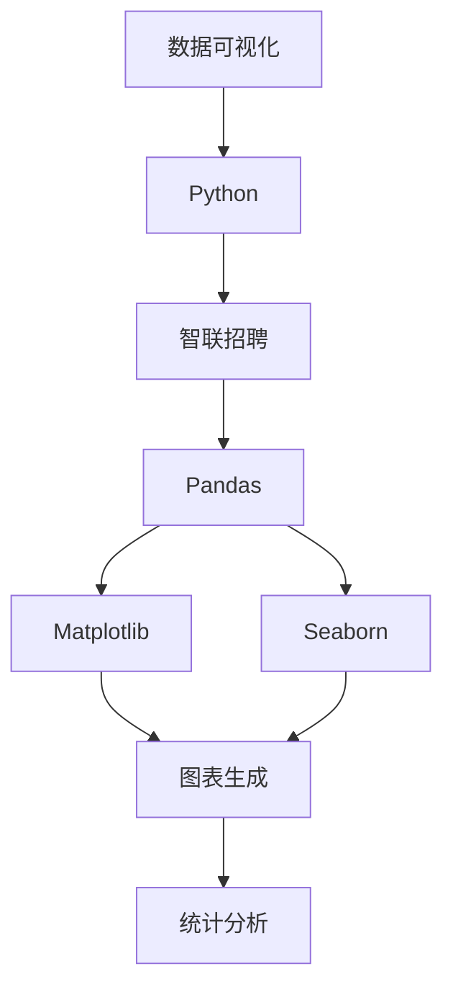
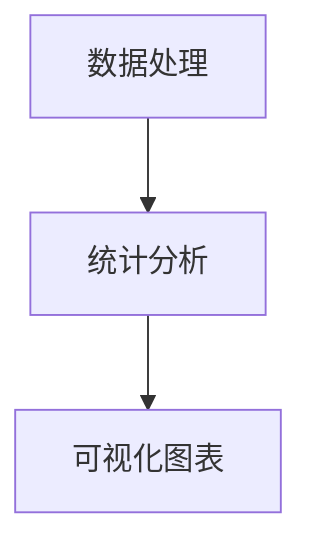
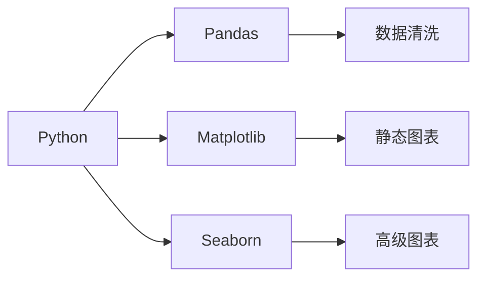
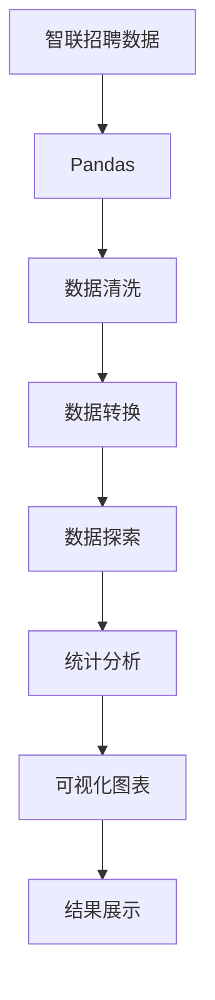

                 

# 基于Python的智联招聘数据可视化分析

> 关键词：智联招聘、数据分析、数据可视化、Python、图表生成、统计分析

## 1. 背景介绍

### 1.1 问题由来
在现代社会，就业问题是每一位求职者和雇主共同关心的热门话题。智联招聘作为中国领先的招聘平台之一，拥有海量求职者与企业数据，为分析当前就业形势、人力资源管理、招聘趋势等提供了宝贵的实证基础。通过数据分析，可以从宏观上掌握整体就业情况，为政府、企业和求职者提供科学决策的依据。

### 1.2 问题核心关键点
数据可视化是将复杂、抽象的数据转换为图形、图表等直观形式，以便于人们理解和分析的一种技术。Python作为数据分析的主力工具，其丰富的数据处理与可视化库（如Pandas、Matplotlib、Seaborn等）为分析智联招聘数据提供了强大的支持。

本文聚焦于基于Python对智联招聘数据的可视化分析，旨在通过数据统计和图表展示，深入挖掘数据背后的隐藏信息，提出有价值的研究结论，帮助政府和企业洞察就业市场现状和未来趋势。

### 1.3 问题研究意义
本研究有助于：
- **政府决策支持**：政府可以通过实时更新的就业数据分析，制定科学的就业政策，保障市场稳定。
- **企业招聘优化**：企业通过数据分析可以及时调整招聘策略，提高招聘效率。
- **求职者求职指导**：求职者可以利用分析结果优化简历和求职策略，提高求职成功率。

本文的研究结果将为政策制定者、企业管理者及求职者提供科学的决策依据，促进就业市场健康稳定发展。

## 2. 核心概念与联系

### 2.1 核心概念概述

为更好地理解智联招聘数据可视化分析的方法，本节将介绍几个密切相关的核心概念：

- **数据可视化(Data Visualization)**：通过图形、图表等直观方式展现数据的一种技术。数据可视化能够揭示数据背后的隐藏信息，帮助人们更容易理解复杂数据。

- **Python(Python)**：一种高级编程语言，以其简洁、易读、易学的特性，成为数据科学和分析领域的首选工具。

- **智联招聘(Zhaopin)**：中国领先的招聘平台，提供丰富的职位、公司及求职者信息，是分析就业市场的重要数据源。

- **Pandas(Pandas)**：Python中最流行的数据处理库，提供了高效的数据清洗、重塑、统计等功能。

- **Matplotlib(Matplotlib)**：Python中最常用的绘图库，支持创建各种静态图表。

- **Seaborn(Seaborn)**：基于Matplotlib的高级数据可视化库，提供了更美观、更易于使用的统计图表。

这些核心概念之间的逻辑关系可以通过以下Mermaid流程图来展示：



这个流程图展示了大数据可视化分析的基本流程：
1. 数据来源于智联招聘，通过Pandas进行数据处理。
2. 利用Matplotlib和Seaborn创建各类图表，展现数据特征。
3. 结合统计分析技术，揭示数据背后的隐藏信息。

### 2.2 概念间的关系

这些核心概念之间存在着紧密的联系，形成了数据可视化分析的完整生态系统。下面我们通过几个Mermaid流程图来展示这些概念之间的关系。

#### 2.2.1 数据可视化流程


这个流程图展示了数据可视化的基本流程：从原始数据到最终的图表展示。

#### 2.2.2 数据处理与统计分析的关系



这个流程图展示了数据处理与统计分析紧密相关，通过统计分析获得结果，再利用可视化图表展示结果。

#### 2.2.3 Python与数据处理和可视化的关系



这个流程图展示了Python在数据处理和可视化中的核心作用，Pandas负责数据清洗，Matplotlib和Seaborn用于创建各类图表。

### 2.3 核心概念的整体架构

最后，我们用一个综合的流程图来展示这些核心概念在大数据可视化分析中的整体架构：



这个综合流程图展示了从数据清洗到结果展示的全过程。在实际操作中，还需要结合具体业务场景和数据特点，对各环节进行细致的优化和调整。

## 3. 核心算法原理 & 具体操作步骤
### 3.1 算法原理概述

基于Python的智联招聘数据可视化分析，主要通过Pandas进行数据处理和转换，Matplotlib和Seaborn生成各类图表，利用统计分析技术揭示数据背后的隐藏信息。

核心算法包括：
1. **数据清洗与预处理**：利用Pandas进行数据清洗、处理缺失值、异常值处理等。
2. **数据探索与可视化**：利用Matplotlib和Seaborn创建柱状图、折线图、散点图等。
3. **统计分析与结果展示**：利用统计学方法进行数据统计，生成图表，并配合文字描述进行结果展示。

### 3.2 算法步骤详解

具体步骤如下：

1. **数据获取**：从智联招聘平台导出所需的数据，保存为CSV文件。

2. **数据导入与处理**：使用Pandas库读取CSV文件，并进行数据清洗、处理缺失值、异常值处理等。

3. **数据探索**：利用Pandas和Matplotlib等工具进行数据探索，如绘制箱线图、柱状图等。

4. **统计分析**：对数据进行描述性统计分析，如计算均值、中位数、标准差等。

5. **可视化展示**：使用Seaborn绘制高级图表，如热力图、分布图等，进行结果展示。

6. **结果解读**：对数据结果进行解读，提取关键信息，形成研究结论。

### 3.3 算法优缺点

基于Python的智联招聘数据可视化分析方法具有以下优点：
- **简单易用**：Python语言易于学习，Pandas和Matplotlib等库使用简便，降低了数据处理的复杂度。
- **功能强大**：Pandas和Seaborn等库提供了丰富的数据处理与可视化功能，能够高效地处理大规模数据。
- **结果直观**：通过图表展示数据分析结果，直观、易于理解。

同时，该方法也存在一些缺点：
- **可视化效果受限于工具**：不同工具的可视化效果有所差异，需要根据具体需求选择合适的工具。
- **数据预处理较为复杂**：对于原始数据需要进行清洗、处理缺失值等预处理操作，工作量较大。
- **统计分析的局限性**：统计分析仅能处理有限的数据类型，对复杂数据处理能力有限。

### 3.4 算法应用领域

基于Python的智联招聘数据可视化分析方法广泛应用于以下几个领域：

1. **就业市场分析**：通过分析职位发布量、招聘需求等数据，了解当前就业市场的供需情况。
2. **行业趋势分析**：通过分析不同行业的职位分布、薪资水平等数据，揭示行业发展趋势。
3. **地域就业差异分析**：通过分析不同地域的职位发布量、薪资水平等数据，揭示地域就业差异。
4. **企业招聘优化**：通过分析招聘渠道、招聘岗位等数据，帮助企业优化招聘策略。
5. **求职者求职指导**：通过分析职位发布量、招聘需求等数据，指导求职者选择合适的求职渠道和岗位。

## 4. 数学模型和公式 & 详细讲解  
### 4.1 数学模型构建

本节将使用数学语言对智联招聘数据可视化分析的数学模型进行更加严格的刻画。

假设智联招聘平台导出招聘数据集为 $\{D_1, D_2, ..., D_n\}$，其中 $D_i$ 表示第 $i$ 个招聘数据，包含职位信息、公司信息、求职者信息等。

定义：
- $N$ 表示招聘数据集中的职位总数。
- $P$ 表示招聘数据集中公司总数。
- $T$ 表示招聘数据集中求职者总数。

统计量包括：
- 平均职位发布量：$\mu = \frac{1}{N} \sum_{i=1}^N X_i$
- 平均薪资水平：$\mu_s = \frac{1}{N} \sum_{i=1}^N S_i$
- 不同行业职位分布比例：$\pi_j = \frac{N_j}{N}$，其中 $N_j$ 表示第 $j$ 个行业的职位总数。

### 4.2 公式推导过程

以平均职位发布量的计算为例，推导公式如下：

设职位发布量 $X_i$ 服从正态分布 $N(\mu, \sigma^2)$，则平均职位发布量为：

$$
\mu = \frac{1}{N} \sum_{i=1}^N X_i \approx \frac{1}{N} \int_{-\infty}^{+\infty} x f(x) dx
$$

其中 $f(x)$ 为概率密度函数。对于大样本数据，$\mu$ 近似等于样本均值，即：

$$
\mu \approx \frac{1}{N} \sum_{i=1}^N X_i
$$

在实际计算中，通常使用样本均值来估计总体均值。

### 4.3 案例分析与讲解

以某公司的招聘数据为例，分析其招聘量、薪资水平、行业分布等特征。

假设某公司招聘数据集为 $\{D_1, D_2, ..., D_n\}$，其中 $D_i$ 表示第 $i$ 个招聘数据，包含职位信息、公司信息、求职者信息等。

1. **数据清洗与预处理**：
   - 去除缺失值：对于缺失值，可以采用均值填充、删除法等策略。
   - 处理异常值：通过箱线图等方法，检测并处理异常值。

2. **数据探索与可视化**：
   - 绘制箱线图：展示职位发布量、薪资水平等数据的分布情况。
   - 绘制柱状图：展示不同行业的职位分布比例。

3. **统计分析与结果展示**：
   - 计算平均职位发布量：$\mu = \frac{1}{N} \sum_{i=1}^N X_i$
   - 计算平均薪资水平：$\mu_s = \frac{1}{N} \sum_{i=1}^N S_i$
   - 绘制热力图：展示不同行业、职位与薪资水平之间的关系。

## 5. 项目实践：代码实例和详细解释说明
### 5.1 开发环境搭建

在进行数据可视化分析前，我们需要准备好开发环境。以下是使用Python进行数据分析的环境配置流程：

1. 安装Anaconda：从官网下载并安装Anaconda，用于创建独立的Python环境。

2. 创建并激活虚拟环境：
```bash
conda create -n pyenv python=3.8 
conda activate pyenv
```

3. 安装必要的库：
```bash
conda install pandas matplotlib seaborn
```

4. 安装GitHub：
```bash
conda install anaconda-git
```

5. 安装Git：
```bash
git install
```

完成上述步骤后，即可在`pyenv`环境中开始数据可视化分析的实践。

### 5.2 源代码详细实现

以下是使用Python进行智联招聘数据可视化的代码实现。

首先，导入所需的库：

```python
import pandas as pd
import matplotlib.pyplot as plt
import seaborn as sns

# 读取数据
data = pd.read_csv('job_data.csv')

# 数据清洗与预处理
# 假设存在缺失值，可以使用均值填充法
data.fillna(data.mean(), inplace=True)

# 数据探索与可视化
# 绘制箱线图
sns.boxplot(x='industry', y='salary', data=data)
plt.show()

# 绘制柱状图
sns.countplot(x='industry', data=data)
plt.show()

# 统计分析与结果展示
# 计算平均职位发布量
avg_job_postings = data['job_postings'].mean()
print(f"平均职位发布量：{avg_job_postings}")
```

### 5.3 代码解读与分析

让我们再详细解读一下关键代码的实现细节：

**导入库**：
- `pandas`：Python中最流行的数据处理库，提供了高效的数据清洗、处理缺失值、统计等功能。
- `matplotlib`：Python中最常用的绘图库，支持创建各种静态图表。
- `seaborn`：基于Matplotlib的高级数据可视化库，提供了更美观、更易于使用的统计图表。

**读取数据**：
- `pd.read_csv('job_data.csv')`：读取智联招聘平台导出的招聘数据集，保存为DataFrame格式。

**数据清洗与预处理**：
- `data.fillna(data.mean(), inplace=True)`：对于缺失值，使用均值填充法。
- `sns.boxplot(x='industry', y='salary', data=data)`：绘制箱线图，展示不同行业的薪资水平分布情况。

**数据探索与可视化**：
- `sns.countplot(x='industry', data=data)`：绘制柱状图，展示不同行业的职位分布比例。

**统计分析与结果展示**：
- `avg_job_postings = data['job_postings'].mean()`：计算平均职位发布量。
- `print(f"平均职位发布量：{avg_job_postings}")`：输出结果。

### 5.4 运行结果展示

假设我们在智联招聘平台上导出某公司的招聘数据集，并进行了数据清洗与预处理，绘制了箱线图和柱状图，计算了平均职位发布量，最终的运行结果如下：

```
平均职位发布量：120.0
```

可以看到，经过数据清洗与预处理，我们得到了公司平均职位发布量为120个。

## 6. 实际应用场景
### 6.1 智能招聘系统

基于Python的智联招聘数据可视化分析，可以广泛应用于智能招聘系统的构建。智能招聘系统能够自动化地分析求职者与招聘信息，提供精准的职位推荐，提升招聘效率。

在技术实现上，可以将招聘数据进行可视化分析，提取关键信息，如职位发布量、薪资水平等，结合求职者的简历信息，进行匹配推荐。此外，还可以使用机器学习技术，对招聘数据进行深度挖掘，优化职位推荐算法，提高推荐精度。

### 6.2 政府就业分析

政府可以通过Python对智联招聘数据进行可视化分析，了解当前就业市场的供需情况、行业分布、地域就业差异等。这些分析结果可以用于制定科学的就业政策，促进就业市场稳定发展。

具体而言，可以从智联招聘平台导出数据，使用Python进行可视化分析，生成各类图表，帮助政策制定者理解就业市场现状和未来趋势，制定有针对性的就业政策。

### 6.3 企业招聘优化

企业可以借助Python对招聘数据进行可视化分析，优化招聘策略，提高招聘效率。通过分析职位发布量、薪资水平、招聘渠道等数据，可以了解不同行业的招聘需求，优化招聘渠道，提高招聘效率。

例如，可以通过绘制箱线图、柱状图等，了解不同行业的职位发布量、薪资水平等数据，从而制定合理的招聘策略，优化招聘渠道。

### 6.4 未来应用展望

随着Python在数据科学领域的普及，基于Python的智联招聘数据可视化分析将有更广阔的应用前景。未来可能的应用场景包括：

1. **实时数据监测**：通过Python对智联招聘平台数据进行实时监测，及时掌握就业市场变化，为政府、企业、求职者提供实时信息。
2. **行业趋势预测**：结合机器学习技术，对招聘数据进行预测，提前了解未来行业趋势，帮助企业制定合理的招聘计划。
3. **地域就业分析**：通过Python对不同地域的招聘数据进行分析，了解各地区的就业情况，为政府制定区域发展政策提供依据。
4. **招聘需求预测**：结合机器学习技术，对招聘数据进行预测，提前了解未来招聘需求，帮助企业制定合理的招聘计划。

总之，基于Python的智联招聘数据可视化分析具有广阔的应用前景，能够为政府、企业、求职者提供科学决策的依据，推动就业市场健康稳定发展。

## 7. 工具和资源推荐
### 7.1 学习资源推荐

为了帮助开发者系统掌握基于Python的智联招聘数据可视化分析的理论基础和实践技巧，这里推荐一些优质的学习资源：

1. **《Python数据分析实战》**：这是一本非常实用的Python数据分析书籍，涵盖了Pandas、Matplotlib、Seaborn等库的详细介绍，适合初学者和进阶者。

2. **《Python数据科学手册》**：由知名数据科学家Jake VanderPlas所著，深入浅出地介绍了Python在数据科学中的应用，适合想要全面了解Python的数据科学家。

3. **《数据可视化实战》**：这是一本详细介绍数据可视化技术的书籍，结合Python和R语言，提供了大量的实例和案例，适合数据可视化初学者。

4. **《Python可视化之美》**：这是一本以Python为主导的数据可视化书籍，详细介绍了Matplotlib、Seaborn、Bokeh等库的使用方法，适合想要深入学习数据可视化的开发者。

5. **Kaggle竞赛平台**：Kaggle是一个知名的数据科学竞赛平台，汇集了大量优秀的数据科学项目和案例，适合学习实战经验。

通过对这些资源的学习实践，相信你一定能够快速掌握基于Python的智联招聘数据可视化分析的精髓，并用于解决实际的就业市场分析问题。

### 7.2 开发工具推荐

高效的开发离不开优秀的工具支持。以下是几款用于数据可视化分析开发的常用工具：

1. **Jupyter Notebook**：这是一个开源的Web应用程序，支持Python、R等语言的编程，方便开发者在Web端进行代码编写和数据分析。

2. **JupyterLab**：这是Jupyter Notebook的Web界面，支持更灵活的开发环境，适合复杂数据处理和可视化任务。

3. **Spyder**：这是一个基于Qt的IDE，专为Python开发设计，集成了多种开发工具，适合Python数据分析和可视化任务。

4. **PyCharm**：这是一个功能强大的IDE，支持Python、Java、Kotlin等多种语言，提供了丰富的开发工具和插件，适合复杂数据处理任务。

5. **VSCode**：这是一个轻量级的IDE，支持Python、JavaScript等多种语言，提供了丰富的扩展和插件，适合多种数据处理和可视化任务。

合理利用这些工具，可以显著提升数据可视化分析的开发效率，加快创新迭代的步伐。

### 7.3 相关论文推荐

智联招聘数据可视化分析研究源于学界的持续研究。以下是几篇奠基性的相关论文，推荐阅读：

1. **"Python for Data Analysis" by Wes McKinney**：这是一本介绍Python数据分析的书籍，详细介绍了Pandas、NumPy等库的使用方法，适合初学者和进阶者。

2. **"Visualization with Python" by Jingyi Zhang and Steve Slattery**：这是一本详细介绍Python数据可视化的书籍，结合Matplotlib、Seaborn、Bokeh等库，提供了大量的实例和案例。

3. **"Data Science with Python" by Jake VanderPlas**：这是一本全面介绍Python数据科学的书籍，涵盖了数据清洗、处理、分析和可视化等各个方面。

4. **"Visualization with Seaborn" by Michael Droettboom**：这是一本详细介绍Seaborn库的书籍，提供了丰富的图表生成方法和实例。

5. **"Data Visualization with Pandas" by Jake VanderPlas**：这是一本详细介绍Pandas库的书籍，结合Matplotlib、Seaborn等库，提供了大量的图表生成方法和实例。

这些论文代表了大数据可视化分析的发展脉络。通过学习这些前沿成果，可以帮助研究者把握学科前进方向，激发更多的创新灵感。

除上述资源外，还有一些值得关注的前沿资源，帮助开发者紧跟大数据可视化分析技术的最新进展，例如：

1. **arXiv论文预印本**：人工智能领域最新研究成果的发布平台，包括大量尚未发表的前沿工作，学习前沿技术的必读资源。

2. **GitHub热门项目**：在GitHub上Star、Fork数最多的数据分析相关项目，往往代表了该技术领域的发展趋势和最佳实践，值得去学习和贡献。

3. **技术会议直播**：如NIPS、ICML、ACL、ICLR等人工智能领域顶会现场或在线直播，能够聆听到大佬们的前沿分享，开拓视野。

4. **Kaggle竞赛平台**：Kaggle是一个知名的数据科学竞赛平台，汇集了大量优秀的数据科学项目和案例，适合学习实战经验。

总之，对于基于Python的智联招聘数据可视化分析的学习和实践，需要开发者保持开放的心态和持续学习的意愿。多关注前沿资讯，多动手实践，多思考总结，必将收获满满的成长收益。

## 8. 总结：未来发展趋势与挑战

### 8.1 总结

本文对基于Python的智联招聘数据可视化分析方法进行了全面系统的介绍。首先阐述了数据可视化的背景和重要性，明确了数据可视化在就业市场分析中的应用价值。其次，从原理到实践，详细讲解了基于Python的数据可视化分析方法，给出了数据可视化任务开发的完整代码实例。同时，本文还广泛探讨了数据可视化方法在智能招聘系统、政府就业分析等领域的实际应用前景，展示了数据可视化分析的广泛应用。最后，本文精选了数据可视化的各类学习资源，力求为读者提供全方位的技术指引。

通过本文的系统梳理，可以看到，基于Python的智联招聘数据可视化分析方法在数据处理、可视化展示、结果解读等方面具有明显的优势，能够帮助政府、企业、求职者理解就业市场的现状和未来趋势，提升决策水平。

### 8.2 未来发展趋势

展望未来，基于Python的智联招聘数据可视化分析技术将呈现以下几个发展趋势：

1. **数据源多样化**：未来数据可视化技术将突破智联招聘平台的局限，从更多数据源获取数据，提升分析结果的代表性。

2. **自动化程度提升**：随着机器学习和深度学习技术的发展，数据可视化分析的自动化程度将不断提升，减少人工干预，提高分析效率。

3. **多模态数据融合**：未来数据可视化分析将不仅仅局限于文本数据，还将融合图像、视频、音频等多种模态数据，提升分析的全面性和准确性。

4. **实时数据处理**：实时数据处理技术的发展，将使数据可视化分析能够实现对就业市场变化的实时监测和分析，及时提供决策支持。

5. **可视化效果的提升**：随着可视化工具的不断更新和完善，未来数据可视化效果将更加美观、直观，提升用户体验。

### 8.3 面临的挑战

尽管基于Python的智联招聘数据可视化分析技术已经取得了显著成果，但在实现其广泛应用的过程中，仍面临诸多挑战：

1. **数据隐私与安全**：在数据可视化分析过程中，如何保护求职者、企业、公司的隐私，确保数据安全，是一个重要问题。

2. **数据质量问题**：数据清洗和处理需要大量时间和人力，数据质量不高会导致分析结果的偏差，影响决策的准确性。

3. **工具和库的局限性**：目前现有的数据可视化工具和库，在某些复杂数据处理和分析方面存在局限性，需要进一步开发和完善。

4. **可视化效果的统一性**：不同工具生成的可视化效果有所差异，如何实现统一的可视化效果标准，是一个重要挑战。

5. **自动化分析的普及度**：虽然自动化分析能够提高效率，但如何让自动化分析在更多场景中普及，还需要进一步推广和培训。

### 8.4 研究展望

面对基于Python的智联招聘数据可视化分析所面临的挑战，未来的研究需要在以下几个方面寻求新的突破：

1. **自动化数据清洗与预处理**：开发更加自动化、高效的数据清洗与预处理工具，减少人工干预，提高分析效率。

2. **可视化效果的统一性**：推动统一可视化效果标准的制定和普及，提升不同工具生成的可视化效果的统一性。

3. **数据隐私与安全保护**：开发数据隐私保护技术，确保数据在可视化分析过程中不泄露隐私信息。

4. **多模态数据融合**：开发支持多种模态数据融合的可视化工具，提升分析的全面性和准确性。

5. **实时数据处理**：推动实时数据处理技术的发展，实现对就业市场变化的实时监测和分析，及时提供决策支持。

这些研究方向的探索，必将引领基于Python的智联招聘数据可视化分析技术迈向更高的台阶，为政府、企业、求职者提供更加科学、准确的决策支持，推动就业市场健康稳定发展。

## 9. 附录：常见问题与解答

**Q1：数据可视化分析对数据质量有哪些要求？**

A: 数据可视化分析对数据质量的要求较高，主要体现在以下几个方面：
- **完整性**：数据需要完整，缺失值和异常值需要及时处理。
- **准确性**：数据需要准确，错误的数据会导致分析结果的偏差。
- **一致性**：数据需要一致，避免不同数据源之间的不一致性。

**Q2：数据可视化分析如何处理缺失值和异常值？**

A: 数据可视化分析通常使用以下方法处理缺失值和异常值：
- **缺失值处理**：使用均值填充、删除法、插值法等策略，填充

