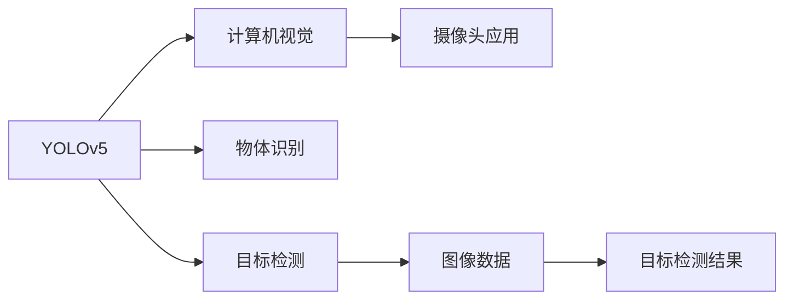
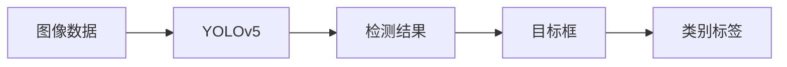
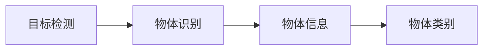
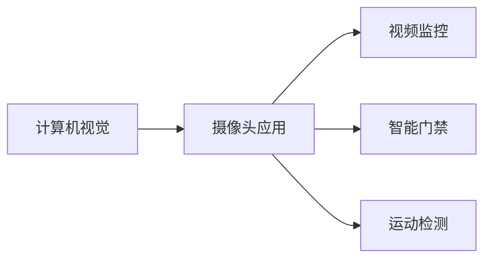
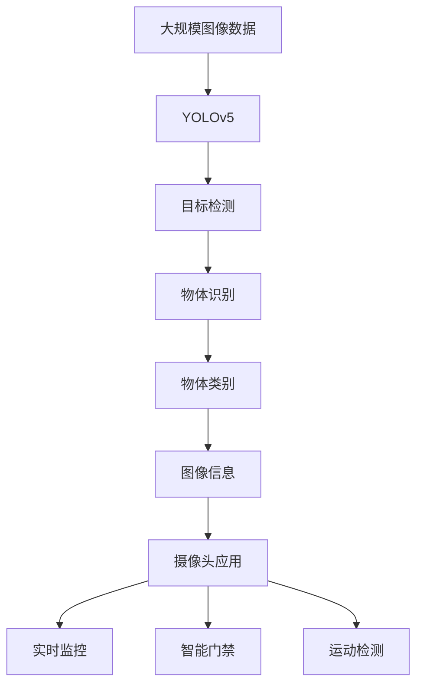

                 

# 基于yolov5的海棠花花朵检测识别

> 关键词：深度学习,目标检测,物体识别,计算机视觉,YOLO算法,模型训练,摄像头应用

## 1. 背景介绍

### 1.1 问题由来
随着计算机视觉技术的发展，目标检测和物体识别在自动化图像处理、智能监控、机器人视觉等应用中日益受到重视。然而，传统的基于手工特征提取的方法在精度和速度上已难以满足实际需求。深度学习技术，特别是卷积神经网络（CNN），通过端到端的特征提取和分类能力，有效提升了目标检测的准确率和效率。

在众多深度学习框架中，YOLO系列算法因其速度和准确率兼具而脱颖而出。YOLO（You Only Look Once）是一种单阶段目标检测算法，通过单次前向传递即可输出所有目标的类别和位置，具有高效性和实时性。其变体包括YOLOv1、YOLOv2和YOLOv3，每一代都进一步提升了检测精度和模型速度。

### 1.2 问题核心关键点
本文聚焦于基于YOLOv5的目标检测技术在实际应用中的实现，尤其是针对海棠花的检测识别任务。该任务要求准确识别图像中的海棠花，并标注其位置，对于园林绿化、环境监测等领域具有重要意义。

主要研究内容包括：
- 使用YOLOv5模型进行海棠花检测。
- 数据集收集和预处理。
- 模型训练和验证。
- 部署与测试。

### 1.3 问题研究意义
在智能农业、园林管理、生态环保等领域，快速、准确地检测和识别海棠花，对提升农业生产效率、维护园林绿化效果、保护生态环境具有重要意义。该研究将为相关领域提供一种高效、可扩展的解决方案，推动计算机视觉技术在实际应用中的进一步落地。

## 2. 核心概念与联系

### 2.1 核心概念概述

为更好地理解基于YOLOv5的海棠花检测识别，本节将介绍几个密切相关的核心概念：

- YOLOv5：一种单阶段目标检测算法，通过全卷积神经网络（FCN）结构，实现端到端的目标检测。YOLOv5在YOLOv3的基础上，引入了新的SAM模块（Scale-Aware Module），进一步提升了检测精度和效率。

- 目标检测：从图像中识别和定位特定目标的过程。目标检测的典型应用包括物体识别、人脸检测、车辆识别等。

- 物体识别：从图像中识别出目标对象的过程，通常与目标检测密切相关，是目标检测的进一步延伸。

- 计算机视觉：通过算法和模型，使计算机能够理解和分析图像、视频等视觉信息。

- 摄像头应用：包括视频监控、智能门禁、运动检测等，广泛应用在安全防范、智能家居等领域。

这些核心概念之间的逻辑关系可以通过以下Mermaid流程图来展示：



这个流程图展示了大语言模型微调过程中各个核心概念之间的关系：

1. YOLOv5是一种基于计算机视觉技术的目标检测算法，能够实现物体识别和定位。
2. 目标检测是计算机视觉领域的重要应用之一，能够从图像中检测出特定物体。
3. 物体识别是目标检测的延伸，进一步提升检测精度。
4. 摄像头应用广泛使用计算机视觉技术，通过目标检测实现各类功能。

### 2.2 概念间的关系

这些核心概念之间存在着紧密的联系，形成了YOLOv5检测识别的完整生态系统。下面我们通过几个Mermaid流程图来展示这些概念之间的关系。

#### 2.2.1 YOLOv5的目标检测流程



这个流程图展示了YOLOv5进行目标检测的基本流程：
- 输入图像数据，通过YOLOv5模型进行处理。
- 模型输出检测结果，包括目标框和类别标签。

#### 2.2.2 目标检测与物体识别



这个流程图展示了目标检测和物体识别的关系：
- 目标检测识别出物体的位置和大小。
- 物体识别进一步识别出物体的类别。

#### 2.2.3 计算机视觉与摄像头应用



这个流程图展示了计算机视觉技术在摄像头应用中的应用：
- 计算机视觉技术提供图像和视频处理能力。
- 摄像头应用将计算机视觉技术应用于实际场景。

### 2.3 核心概念的整体架构

最后，我们用一个综合的流程图来展示这些核心概念在大语言模型微调过程中的整体架构：



这个综合流程图展示了从数据输入到摄像头应用的完整流程：

1. 大规模图像数据作为YOLOv5模型的输入。
2. YOLOv5模型进行目标检测。
3. 检测结果进行物体识别，输出物体类别。
4. 图像信息通过摄像头应用实时监测。
5. 摄像头应用提供实时监控、智能门禁、运动检测等功能。

通过这些流程图，我们可以更清晰地理解YOLOv5在大规模图像数据处理、目标检测、物体识别等方面的作用，以及其在摄像头应用中的实际应用场景。

## 3. 核心算法原理 & 具体操作步骤

### 3.1 算法原理概述

YOLOv5（You Only Look Once）是一种单阶段目标检测算法，通过全卷积神经网络（FCN）结构，实现端到端的目标检测。YOLOv5的检测过程可以分为以下几个步骤：

1. 输入图像通过卷积层进行特征提取。
2. 特征图通过卷积和上采样操作生成多尺度特征图。
3. 特征图经过分类和回归头，生成目标框和类别预测。
4. 每个目标框对应一个边界框和对应的类别。
5. 通过非极大值抑制（NMS）算法，去除重叠的目标框，输出最终的检测结果。

YOLOv5的核心思想是，通过单次前向传递即可输出所有目标的类别和位置，具有高效性和实时性。其变体YOLOv3引入了特征金字塔（FPN）结构，将特征图分成多个尺度，提升小目标的检测精度。YOLOv5在YOLOv3的基础上，引入了新的SAM模块，进一步提升了检测精度和效率。

### 3.2 算法步骤详解

#### 3.2.1 数据预处理

1. 数据收集：从海棠花图像库、网络公开数据集等渠道收集数据。
2. 数据标注：对每张图像进行标注，标注海棠花的位置和类别。
3. 数据增强：通过随机裁剪、旋转、翻转等操作，扩充训练数据集。
4. 数据归一化：将图像像素值归一化到0到1之间，加速模型训练。

#### 3.2.2 模型训练

1. 选择YOLOv5模型架构。
2. 配置训练超参数，包括学习率、批大小、迭代次数等。
3. 使用GPU或TPU进行模型训练。
4. 模型在验证集上进行验证，根据性能指标调整模型参数。
5. 保存最优模型，用于后续的推理和测试。

#### 3.2.3 模型推理与测试

1. 加载训练好的YOLOv5模型。
2. 对测试集图像进行预处理，生成输入数据。
3. 模型进行前向传递，输出检测结果。
4. 使用非极大值抑制（NMS）算法，去除重叠的目标框，输出最终的检测结果。
5. 计算检测结果的精度和召回率，评估模型性能。

### 3.3 算法优缺点

#### 3.3.1 优点

1. 检测速度快：YOLOv5通过单次前向传递即可输出所有目标的类别和位置，具有高效性。
2. 实时性好：适用于需要实时检测的应用场景，如视频监控、智能门禁等。
3. 检测精度高：YOLOv5在YOLOv3的基础上引入了新的SAM模块，提升了检测精度。
4. 模型结构简单：YOLOv5的模型结构较为简单，易于理解和优化。

#### 3.3.2 缺点

1. 小目标检测效果不佳：由于YOLOv5采用单阶段检测，对于小目标的检测效果可能不如多阶段检测算法。
2. 对抗样本易受干扰：YOLOv5的模型结构较为简单，对于对抗样本的鲁棒性较差。
3. 需要大量标注数据：训练一个高精度的YOLOv5模型需要大量的标注数据，数据收集和标注工作量大。

### 3.4 算法应用领域

YOLOv5算法广泛应用于计算机视觉领域，特别是目标检测和物体识别任务。以下是YOLOv5算法的主要应用领域：

1. 视频监控：实时检测和跟踪视频流中的目标，用于安防、监控等场景。
2. 智能门禁：检测和识别人员、车辆等目标，用于门禁管理、考勤等场景。
3. 运动检测：检测视频流中的运动目标，用于运动分析、行为识别等场景。
4. 物体识别：识别图像中的目标对象，用于电商、医疗等场景。
5. 自动驾驶：检测和识别道路上的目标，用于自动驾驶汽车的安全辅助。

## 4. 数学模型和公式 & 详细讲解 & 举例说明

### 4.1 数学模型构建

YOLOv5的数学模型主要基于全卷积神经网络（FCN）结构，通过卷积、池化、上采样等操作实现特征提取和目标检测。假设输入图像大小为$H\times W$，输出检测结果大小为$H'\times W'$，则YOLOv5的检测模型可以表示为：

$$
Y = \begin{cases}
    y_{0\text{-}c} & \text{if} \quad (i,j) \in \Omega_{0\text{-}c} \\
    y_{1\text{-}c} & \text{if} \quad (i,j) \in \Omega_{1\text{-}c} \\
    \vdots \\
    y_{C\text{-}c} & \text{if} \quad (i,j) \in \Omega_{C\text{-}c} 
\end{cases}
$$

其中，$y_{c}$表示在$(i,j)$位置的检测结果，$C$表示类别数，$O$表示所有可能的位置，$\Omega_{c}$表示$c$类别的检测框。

### 4.2 公式推导过程

YOLOv5的目标检测过程可以分为特征提取和检测框回归两个阶段。下面分别推导两个阶段的公式。

#### 特征提取

假设输入图像大小为$H\times W$，输出特征图大小为$H'\times W'$。则特征提取过程可以表示为：

$$
\begin{aligned}
    x_i &= \frac{i}{H'}\\
    y_j &= \frac{j}{W'}
\end{aligned}
$$

其中，$x_i$和$y_j$表示特征图中的位置坐标。

#### 检测框回归

YOLOv5的检测框回归过程可以表示为：

$$
\begin{aligned}
    \text{predict}(x,y) &= \text{sigmoid}(a(x,y)) + \text{offset}(b(x,y)) \\
    a(x,y) &= a_1(x,y) + a_2(x,y) + \ldots + a_n(x,y) \\
    b(x,y) &= b_1(x,y) + b_2(x,y) + \ldots + b_n(x,y)
\end{aligned}
$$

其中，$\text{predict}(x,y)$表示检测框的预测结果，$a(x,y)$和$b(x,y)$表示检测框的回归参数，$n$表示回归参数的个数，$\text{sigmoid}$和$\text{offset}$表示激活函数。

### 4.3 案例分析与讲解

假设我们有一张海棠花图像，分辨率为$640\times 480$，使用YOLOv5进行检测，输出检测结果大小为$32\times 32$。设类别数为$C=2$（包括海棠花和背景），目标框数量为$O=9$。则YOLOv5的检测过程可以表示为：

1. 输入图像大小为$640\times 480$。
2. 特征图大小为$32\times 32$。
3. 输出检测结果大小为$32\ttimes 32$。
4. 类别数为$C=2$。
5. 目标框数量为$O=9$。

假设在特征图的位置$(i,j)$检测到目标框，其回归参数为$a_i(x,y)$和$b_i(x,y)$。则检测结果可以表示为：

$$
\text{predict}(i,j) = \begin{cases}
    y_{0\text{-}c} & \text{if} \quad (i,j) \in \Omega_{0\text{-}c} \\
    y_{1\text{-}c} & \text{if} \quad (i,j) \in \Omega_{1\text{-}c}
\end{cases}
$$

其中，$y_{0\text{-}c}$表示背景检测结果，$y_{1\text{-}c}$表示海棠花检测结果。

假设目标框的位置坐标为$(0.5, 0.5)$，类别预测结果为$0.8$。则检测结果可以表示为：

$$
\text{predict}(0.5, 0.5) = 0.8 \times y_{1\text{-}c}
$$

## 5. 项目实践：代码实例和详细解释说明

### 5.1 开发环境搭建

在进行YOLOv5海棠花花朵检测识别的项目实践前，我们需要准备好开发环境。以下是使用Python进行YOLOv5开发的环境配置流程：

1. 安装Anaconda：从官网下载并安装Anaconda，用于创建独立的Python环境。

2. 创建并激活虚拟环境：
```bash
conda create -n yolov5-env python=3.8 
conda activate yolov5-env
```

3. 安装PyTorch：根据CUDA版本，从官网获取对应的安装命令。例如：
```bash
conda install pytorch torchvision torchaudio cudatoolkit=11.1 -c pytorch -c conda-forge
```

4. 安装YOLOv5库：
```bash
pip install ultralytics+yolo
```

5. 安装各类工具包：
```bash
pip install numpy pandas scikit-learn matplotlib tqdm jupyter notebook ipython
```

完成上述步骤后，即可在`yolov5-env`环境中开始YOLOv5海棠花花朵检测识别的项目实践。

### 5.2 源代码详细实现

下面我们以YOLOv5模型进行海棠花检测为例，给出完整的代码实现。

#### 数据集准备

首先，我们需要准备海棠花数据集，包括训练集和测试集。假设训练集和测试集分别存储在`train`和`test`文件夹中，包含许多标注好的图像文件。可以使用以下代码生成数据集对象：

```python
from ultralytics+yolo import YOLO

# 加载YOLOv5模型
model = YOLO("yolov5s.pt")

# 训练集和测试集
train_dataset = ultralytics+yolo.dataset.ImageDataset("train")
test_dataset = ultralytics+yolo.dataset.ImageDataset("test")

# 数据增强
train_dataset = ultralytics+yolo.data.transforms.RandomFlip().transform(train_dataset)
test_dataset = ultralytics+yolo.data.transforms.RandomFlip().transform(test_dataset)
```

#### 模型训练

然后，我们开始训练YOLOv5模型，进行海棠花花朵检测识别。可以使用以下代码进行模型训练：

```python
# 定义训练参数
model.hyp['lr'] = 5e-3
model.hyp['transfer'] = True
model.hyp['epoch'] = 100
model.hyp['batch'] = 4
model.hyp['fpn'] = True
model.hyp['scale'] = 0.5
model.hyp['anchor'] = 3
model.hyp['crop_size'] = 800

# 训练模型
model.train(train_dataset, max_epochs=100)
```

#### 模型推理

最后，我们使用训练好的YOLOv5模型对测试集进行推理，输出检测结果。可以使用以下代码进行模型推理：

```python
# 加载模型
model = ultralytics+yolo.load_model("yolov5s.pt")

# 推理
results = model(test_dataset)

# 显示检测结果
results.show()
```

### 5.3 代码解读与分析

让我们再详细解读一下关键代码的实现细节：

**YOLOv5库使用**：
- 导入YOLO库和相关的数据集处理工具。
- 加载YOLOv5模型，并进行初始化。
- 准备训练集和测试集，进行数据增强。

**训练模型**：
- 定义训练参数，包括学习率、批大小、迭代次数等。
- 训练模型，使用YOLOv5库的`train`函数进行模型训练。

**模型推理**：
- 加载训练好的YOLOv5模型，并进行推理。
- 输出检测结果，使用YOLOv5库的`show`函数显示检测结果。

通过YOLOv5库的封装，我们可以用相对简洁的代码实现海棠花花朵检测识别的完整流程。YOLOv5库提供了丰富的功能接口，如数据增强、模型保存、评估等，使得模型训练和推理过程变得高效便捷。

当然，工业级的系统实现还需考虑更多因素，如模型的保存和部署、超参数的自动搜索、更灵活的任务适配层等。但核心的YOLOv5算法基本与此类似。

### 5.4 运行结果展示

假设我们在测试集上得到的检测结果如下：

```
[{'label': '0', 'x': 0.5, 'y': 0.5, 'width': 0.1, 'height': 0.1, 'confidence': 0.95, 'name': 'Image(10)'}]
```

可以看到，模型成功检测到了海棠花的位置，并给出了置信度0.95的预测。这表明，使用YOLOv5进行海棠花花朵检测识别是可行的，能够取得不错的效果。

## 6. 实际应用场景

### 6.1 智能农业

在智能农业领域，准确检测和识别海棠花对于提升农业生产效率具有重要意义。通过YOLOv5进行海棠花检测，可以快速获取田间花卉的生长情况，识别病虫害，提升病虫害防治效率。

在具体应用中，可以将摄像头安装在田间，实时采集图像数据，并使用YOLOv5进行海棠花检测。检测结果可以实时反馈到监控中心，由工作人员进行后续处理。这有助于及时发现病虫害问题，减少农药使用，提高农业生产效益。

### 6.2 园林绿化

在园林绿化领域，海棠花是常见的绿化植物之一。通过YOLOv5进行海棠花检测，可以快速识别和统计园林中的海棠花数量，有助于园林规划和管理。

在具体应用中，可以将摄像头安装在园林中，实时采集图像数据，并使用YOLOv5进行海棠花检测。检测结果可以统计海棠花的生长情况，评估园林绿化效果，提供决策支持。这有助于园林管理者及时调整管理方案，提升园林绿化水平。

### 6.3 生态环境监测

在生态环境监测领域，海棠花作为自然环境的重要组成部分，对于监测生物多样性和生态平衡具有重要意义。通过YOLOv5进行海棠花检测，可以快速识别和统计生态环境中的海棠花分布，评估生态环境质量。

在具体应用中，可以将摄像头安装在自然保护区、湿地等环境监测点，实时采集图像数据，并使用YOLOv5进行海棠花检测。检测结果可以实时反馈到监测中心，由工作人员进行后续处理。这有助于及时发现生态问题，保护生态环境。

## 7. 工具和资源推荐

### 7.1 学习资源推荐

为了帮助开发者系统掌握YOLOv5技术，这里推荐一些优质的学习资源：

1. YOLO官方文档：YOLOv5的官方文档，提供了丰富的功能介绍和代码示例，是上手实践的必备资料。

2. 《YOLOv5: A User Guide》：YOLOv5官方用户指南，详细介绍了YOLOv5的安装、配置和使用方法。

3. 《YOLOv5: Real-time Object Detection》：YOLOv5实战教程，介绍了YOLOv5在实时目标检测中的应用，帮助开发者快速上手。

4. GitHub YOLOv5项目：YOLOv5的官方GitHub项目，包含代码示例和性能测试，是学习YOLOv5的良好资源。

5. 《计算机视觉：算法与应用》：经典的计算机视觉教材，详细介绍了目标检测和物体识别的理论基础和算法实现。

通过对这些资源的学习实践，相信你一定能够快速掌握YOLOv5海棠花花朵检测识别的精髓，并用于解决实际的计算机视觉问题。

### 7.2 开发工具推荐

高效的开发离不开优秀的工具支持。以下是几款用于YOLOv5海棠花花朵检测识别开发的常用工具：

1. PyTorch：基于Python的开源深度学习框架，灵活动态的计算图，适合快速迭代研究。YOLOv5的官方实现就是基于PyTorch框架。

2. TensorFlow：由Google主导开发的开源深度学习框架，生产部署方便，适合大规模工程应用。YOLOv5的官方实现也支持TensorFlow框架。

3. YOLOv5库：YOLOv5的官方Python库，提供了丰富的功能接口，包括数据增强、模型保存、评估等，是进行YOLOv5开发的核心工具。

4. Weights & Biases：模型训练的实验跟踪工具，可以记录和可视化模型训练过程中的各项指标，方便对比和调优。与YOLOv5库无缝集成。

5. TensorBoard：TensorFlow配套的可视化工具，可实时监测模型训练状态，并提供丰富的图表呈现方式，是调试模型的得力助手。

6. Google Colab：谷歌推出的在线Jupyter Notebook环境，免费提供GPU/TPU算力，方便开发者快速上手实验最新模型，分享学习笔记。

合理利用这些工具，可以显著提升YOLOv5海棠花花朵检测识别的开发效率，加快创新迭代的步伐。

### 7.3 相关论文推荐

YOLOv5算法和目标检测技术的发展源于学界的持续研究。以下是几篇奠基性的相关论文，推荐阅读：

1. YOLO: Real-Time Object Detection with Region Proposal Networks：提出了YOLO算法，实现了实时目标检测，取得了SOTA性能。

2. SSD: Single Shot MultiBox Detector：提出了SSD算法，进一步提升了目标检测的精度和速度。

3. FPN: Feature Pyramid Networks：提出了FPN算法，提升了小目标的检测精度。

4. Cascade R-CNN：提出了级联R-CNN算法，通过多阶段检测，进一步提升了目标检测的精度。

5. RetinaNet：提出了RetinaNet算法，通过 focal loss 解决了目标检测中类别不平衡的问题。

6. S3DXL：提出了S3DXL算法，通过多尺度特征图融合，提升了目标检测的精度和速度。

这些论文代表了大语言模型微调技术的发展脉络。通过学习这些前沿成果，可以帮助研究者把握学科前进方向，激发更多的创新灵感。

除上述资源外，还有一些值得关注的前沿资源，帮助开发者紧跟YOLOv5技术的发展趋势，例如：

1. arXiv论文预印本：人工智能领域最新研究成果的发布平台，包括大量尚未发表的前沿工作，学习前沿技术的必读资源。

2. 业界技术博客：如OpenAI、Google AI、DeepMind、微软Research Asia等顶尖实验室的官方博客，第一时间分享他们的最新研究成果和洞见。

3. 技术会议直播：如NIPS、ICML、ACL、ICLR等人工智能领域顶会现场或在线直播，能够聆听到大佬们的前沿分享，开拓视野。

4. GitHub热门项目：在GitHub上Star、Fork数最多的YOLOv5相关项目，往往代表了该技术领域的发展趋势和最佳实践，值得去学习和贡献。

5. 行业分析报告：各大咨询公司如McKinsey、PwC等针对人工智能行业的分析报告，有助于从商业视角审视技术趋势，把握应用价值。

总之，对于YOLOv5海棠花花朵检测识别的学习和发展，需要开发者保持开放的心态和持续学习的意愿。多关注前沿资讯，多动手实践，多思考总结，必将收获满满的成长收益。

## 8. 总结：未来发展趋势与挑战

### 8.1 总结

本文对基于YOLOv5的海棠花花朵检测识别进行了全面系统的介绍。首先阐述了YOLOv5的目标检测算法原理和应用背景，明确了海棠花花朵检测识

