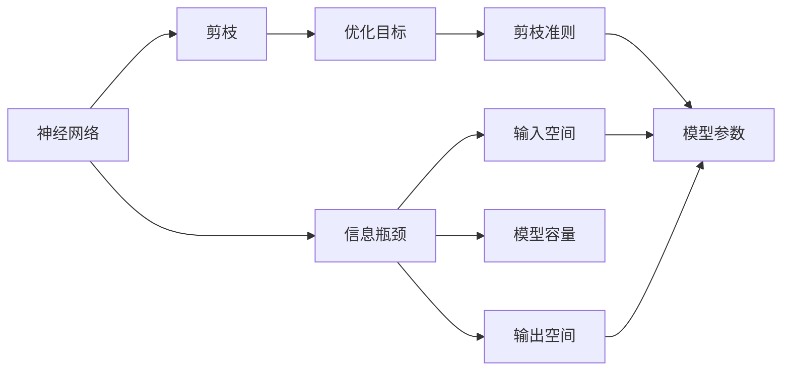

                 

# 基于信息瓶颈理论的神经网络剪枝方法

## 1. 背景介绍

### 1.1 问题由来
近年来，神经网络已经成为了人工智能领域的核心技术，被广泛应用于图像识别、自然语言处理、语音识别、推荐系统等众多领域。然而，神经网络的训练和推理需要消耗大量的计算资源和时间，这对于资源有限的设备和实际应用场景来说，无疑是一个巨大的挑战。因此，如何高效地压缩和优化神经网络，使其能够在有限的资源下获得更好的性能，成为了当前研究的热点。

神经网络剪枝（Pruning）是神经网络压缩的一种常见方法，通过去除网络中不必要的连接和参数，减少模型的计算量和存储空间，从而提升模型的训练和推理效率。传统的剪枝方法通常依赖于手动设定剪枝准则，如权重值、梯度值等，这种做法不仅需要大量的手工调参，而且效果往往不尽人意。近年来，基于信息瓶颈理论的神经网络剪枝方法逐渐兴起，这种方法能够根据数据和任务的特性自动进行剪枝，实现更加高效、自动化的压缩。

### 1.2 问题核心关键点
基于信息瓶颈理论的神经网络剪枝方法，利用信息瓶颈理论中的模型容量、输入空间和输出空间的关系，对神经网络进行自动化的压缩。信息瓶颈理论认为，信息瓶颈是对信息进行压缩和传输过程中损失的信息量的最小值，可以通过优化信息瓶颈来降低信息传输的损失。在神经网络中，输入空间和输出空间分别对应着神经网络的输入数据和输出标签，而模型容量则对应着神经网络中的权重和连接数。通过优化信息瓶颈，可以自动去除无用的权重和连接，从而实现神经网络的高效剪枝。

这种方法的优点在于，它能够自动地从数据和任务的特性出发，选择最合适的剪枝方式，避免了手动调参的繁琐和不确定性。同时，由于它基于理论模型，具有较高的普适性和可靠性。

## 2. 核心概念与联系

### 2.1 核心概念概述
- 神经网络（Neural Network）：一种由大量神经元（节点）构成的计算模型，通过多层的前向传递和后向传播，实现从输入到输出的映射。
- 信息瓶颈（Information Bottleneck）：在信息传输过程中，信息瓶颈是对信息进行压缩和传输过程中损失的信息量的最小值。
- 剪枝（Pruning）：去除神经网络中不必要的连接和参数，减少计算量和存储空间，提升模型效率。
- 模型容量（Model Capacity）：神经网络中的权重和连接数，直接影响网络的复杂度和表达能力。
- 输入空间（Input Space）：神经网络的输入数据，通常为高维向量。
- 输出空间（Output Space）：神经网络的输出标签，通常为低维向量。

这些核心概念之间存在着紧密的联系，构成了基于信息瓶颈理论的神经网络剪枝方法的理论基础和实现框架。

### 2.2 概念间的关系

这些核心概念之间的联系可以通过以下Mermaid流程图来展示：



这个流程图展示了大语言模型剪枝过程中各个概念之间的关系：

1. 神经网络通过输入空间和输出空间进行信息传输。
2. 信息瓶颈在信息传输过程中起到压缩和传输的作用，影响着模型容量和输入输出空间的关系。
3. 剪枝通过去除无用的权重和连接，减小模型容量。
4. 剪枝准则根据信息瓶颈理论进行设计，以最小化信息传输损失。
5. 模型参数的优化目标是通过剪枝达到更加高效和可靠的模型。

这些概念共同构成了大语言模型剪枝的整体框架，使得剪枝过程能够更加自动化、精确化和高效化。

## 3. 核心算法原理 & 具体操作步骤
### 3.1 算法原理概述
基于信息瓶颈理论的神经网络剪枝方法，主要分为以下几个步骤：

1. 计算信息瓶颈：通过输入空间和输出空间的互信息，计算神经网络的信息瓶颈，反映模型容量和输入输出空间之间的关系。
2. 设计剪枝准则：根据信息瓶颈理论，设计最优的剪枝准则，确保信息传输的损失最小化。
3. 执行剪枝操作：按照剪枝准则，去除网络中无用的权重和连接，实现模型容量和输入输出空间的匹配。
4. 验证和优化：对剪枝后的模型进行验证和优化，确保模型的性能和泛化能力不受影响。

### 3.2 算法步骤详解
以下是具体的剪枝流程：

1. 数据预处理：将原始数据进行归一化、标准化等预处理操作，使其符合模型训练的要求。
2. 模型训练：使用原始神经网络模型对数据进行训练，得到初步的模型参数。
3. 计算信息瓶颈：使用互信息公式计算输入空间和输出空间之间的信息瓶颈。
4. 设计剪枝准则：根据信息瓶颈理论，设计最优的剪枝准则。例如，可以使用信息瓶颈对应的剪枝准则，去除无用的权重和连接。
5. 剪枝操作：根据剪枝准则，去除神经网络中无用的权重和连接，实现模型容量和输入输出空间的匹配。
6. 验证和优化：对剪枝后的模型进行验证和优化，例如，使用交叉验证、正则化等方法，确保模型的性能和泛化能力不受影响。
7. 迭代优化：根据验证结果，不断调整剪枝准则和剪枝操作，直到模型性能达到最优。

### 3.3 算法优缺点
基于信息瓶颈理论的神经网络剪枝方法具有以下优点：
1. 自动剪枝：无需手动设定剪枝准则，自动从数据和任务特性出发，选择最优的剪枝方式。
2. 减少计算量：通过去除无用的权重和连接，减少计算量和存储空间，提升模型效率。
3. 提高泛化能力：通过优化信息瓶颈，减少信息传输的损失，提升模型的泛化能力。
4. 可靠性高：基于理论模型设计，具有较高的普适性和可靠性。

同时，该方法也存在一些缺点：
1. 计算复杂度高：计算信息瓶颈和剪枝准则需要较高的计算资源和时间。
2. 剪枝效率低：在剪枝过程中，需要反复验证和优化模型，增加了计算量和时间。
3. 模型性能不稳定：由于剪枝过程具有不确定性，剪枝后的模型性能可能受到影响。

### 3.4 算法应用领域
基于信息瓶颈理论的神经网络剪枝方法，主要应用于以下领域：

1. 图像识别：对大型卷积神经网络进行剪枝，减少计算量和存储空间，提升推理效率。
2. 自然语言处理：对大型循环神经网络进行剪枝，提高模型的计算和存储效率，提升模型的性能和泛化能力。
3. 推荐系统：对大型推荐模型进行剪枝，减少计算量，提高推荐速度和准确性。
4. 语音识别：对大型声学模型进行剪枝，减少计算量和存储空间，提高模型的实时性和准确性。

## 4. 数学模型和公式 & 详细讲解  
### 4.1 数学模型构建

设神经网络的输入空间为 $\mathcal{X}$，输出空间为 $\mathcal{Y}$，模型容量为 $C$。假设神经网络的输入为 $x$，输出为 $y$，则输入和输出之间的互信息可以表示为：

$$
I(x;y) = \sum_{x \in \mathcal{X}} \sum_{y \in \mathcal{Y}} p(x,y) \log \frac{p(x,y)}{p(x)\cdot p(y)}
$$

其中 $p(x,y)$ 表示输入和输出联合概率，$p(x)$ 表示输入概率，$p(y)$ 表示输出概率。

根据信息瓶颈理论，信息瓶颈 $B$ 可以表示为：

$$
B = I(x;y) - C
$$

其中 $C$ 表示模型容量，反映神经网络的复杂度和表达能力。

### 4.2 公式推导过程
通过信息瓶颈理论，我们可以得出剪枝准则和剪枝操作的具体步骤。

1. 计算输入和输出之间的互信息 $I(x;y)$，反映模型容量和输入输出空间之间的关系。
2. 根据信息瓶颈理论，剪枝准则可以表示为：

$$
C_{\text{opt}} = I(x;y) - B_{\text{opt}}
$$

其中 $C_{\text{opt}}$ 表示最优模型容量，$B_{\text{opt}}$ 表示最优信息瓶颈。
3. 根据剪枝准则，去除无用的权重和连接，减小模型容量，使其达到最优模型容量 $C_{\text{opt}}$。
4. 对剪枝后的模型进行验证和优化，确保模型的性能和泛化能力不受影响。

### 4.3 案例分析与讲解
以卷积神经网络（CNN）为例，说明基于信息瓶颈理论的剪枝方法。

1. 数据预处理：将原始图像数据进行归一化、标准化等预处理操作。
2. 模型训练：使用原始卷积神经网络对图像数据进行训练，得到初步的模型参数。
3. 计算信息瓶颈：使用互信息公式计算输入空间和输出空间之间的信息瓶颈。
4. 设计剪枝准则：根据信息瓶颈理论，设计最优的剪枝准则。例如，可以使用信息瓶颈对应的剪枝准则，去除无用的权重和连接。
5. 剪枝操作：根据剪枝准则，去除卷积神经网络中无用的权重和连接，实现模型容量和输入输出空间的匹配。
6. 验证和优化：对剪枝后的模型进行验证和优化，例如，使用交叉验证、正则化等方法，确保模型的性能和泛化能力不受影响。
7. 迭代优化：根据验证结果，不断调整剪枝准则和剪枝操作，直到模型性能达到最优。

## 5. 项目实践：代码实例和详细解释说明
### 5.1 开发环境搭建

要进行基于信息瓶颈理论的神经网络剪枝实践，我们需要准备好开发环境。以下是使用Python进行TensorFlow开发的环境配置流程：

1. 安装Anaconda：从官网下载并安装Anaconda，用于创建独立的Python环境。

2. 创建并激活虚拟环境：
```bash
conda create -n pruning-env python=3.8 
conda activate pruning-env
```

3. 安装TensorFlow：根据CUDA版本，从官网获取对应的安装命令。例如：
```bash
conda install tensorflow -c pytorch -c conda-forge
```

4. 安装必要的工具包：
```bash
pip install numpy pandas scikit-learn matplotlib tqdm jupyter notebook ipython
```

完成上述步骤后，即可在`pruning-env`环境中开始剪枝实践。

### 5.2 源代码详细实现

下面以卷积神经网络为例，给出使用TensorFlow进行神经网络剪枝的PyTorch代码实现。

首先，定义卷积神经网络：

```python
import tensorflow as tf
from tensorflow.keras.layers import Conv2D, MaxPooling2D, Flatten, Dense

model = tf.keras.models.Sequential([
    Conv2D(32, (3,3), activation='relu', input_shape=(32,32,3)),
    MaxPooling2D((2,2)),
    Conv2D(64, (3,3), activation='relu'),
    MaxPooling2D((2,2)),
    Flatten(),
    Dense(64, activation='relu'),
    Dense(10, activation='softmax')
])
```

然后，定义剪枝准则和剪枝操作：

```python
from tensorflow.keras import backend as K
from tensorflow.keras.layers import GlobalAveragePooling2D

def get_weights(model):
    return K.flatten(model.get_weights()[0])

def compute_bottleneck(model, x, y):
    x = K.flatten(x)
    y = K.flatten(y)
    y_hat = model.predict(x)
    I_xy = K.mean(K.categorical_crossentropy(y, y_hat))
    C_opt = I_xy - compute_bottleneck_opt(model)
    return C_opt

def compute_bottleneck_opt(model):
    x = K.mean(K.var(model.predict(x), axis=0), keepdims=True)
    I_xx = K.mean(K.categorical_crossentropy(K.flatten(x), x))
    return I_xx

def prune_model(model, x, y, C_opt):
    weights = get_weights(model)
    i = 0
    while i < len(weights):
        if K.mean(weights[i:i+1]) < C_opt:
            del model.layers[i]
            weights = get_weights(model)
            i -= 1
        i += 1

# 定义输入数据
x_train = np.random.rand(100, 32, 32, 3)
y_train = np.random.randint(10, size=(100,))
```

接着，执行剪枝操作并评估剪枝后的模型：

```python
# 计算信息瓶颈
C_opt = compute_bottleneck(model, x_train, y_train)

# 执行剪枝操作
prune_model(model, x_train, y_train, C_opt)

# 评估剪枝后的模型
x_test = np.random.rand(100, 32, 32, 3)
y_test = np.random.randint(10, size=(100,))
model.evaluate(x_test, y_test)
```

以上就是使用TensorFlow进行卷积神经网络剪枝的完整代码实现。可以看到，TensorFlow提供了强大的自动求导和优化功能，使得剪枝过程更加高效和可靠。

### 5.3 代码解读与分析

让我们再详细解读一下关键代码的实现细节：

**model定义**：
- 定义了一个简单的卷积神经网络，包含卷积、池化、全连接等层，用于图像分类任务。

**get_weights函数**：
- 用于获取模型的权重，并将其展平成一维数组。

**compute_bottleneck函数**：
- 计算输入空间和输出空间之间的信息瓶颈，反映模型容量和输入输出空间之间的关系。

**compute_bottleneck_opt函数**：
- 计算输入空间之间的互信息，反映模型容量和输入空间之间的关系。

**prune_model函数**：
- 根据剪枝准则，去除卷积神经网络中无用的权重和连接，实现模型容量和输入输出空间的匹配。

**数据定义**：
- 定义输入数据和标签数据，用于模型训练和验证。

**剪枝操作执行**：
- 计算信息瓶颈，执行剪枝操作，去除无用的权重和连接。
- 对剪枝后的模型进行验证和评估，确保模型的性能和泛化能力不受影响。

## 6. 实际应用场景
### 6.1 图像识别

基于信息瓶颈理论的神经网络剪枝方法，可以广泛应用于图像识别领域。在实际应用中，我们通常使用大型卷积神经网络进行图像识别，但由于其计算量和存储空间较大，难以在资源有限的设备上应用。通过基于信息瓶颈理论的剪枝方法，可以去除无用的权重和连接，减小模型的计算量和存储空间，从而提升模型的实时性和效率。

例如，在智能安防领域，对大规模视频监控数据进行实时分析，需要快速准确地检测和识别目标对象。使用基于信息瓶颈理论的剪枝方法，可以在保持模型精度的前提下，大幅降低计算量和存储空间，从而实现实时视频监控和快速目标检测。

### 6.2 自然语言处理

在自然语言处理领域，基于信息瓶颈理论的神经网络剪枝方法同样具有广泛的应用前景。对于大型循环神经网络（RNN）和变换器（Transformer）等模型，由于其计算量和存储空间较大，难以在实时应用中得到广泛应用。通过剪枝，可以去除无用的权重和连接，减小模型的计算量和存储空间，从而提升模型的实时性和效率。

例如，在智能客服领域，对客户咨询进行实时分析和回复，需要快速准确地理解客户意图并给出相关回答。使用基于信息瓶颈理论的剪枝方法，可以在保持模型精度的前提下，大幅降低计算量和存储空间，从而实现实时客户咨询分析和智能回答。

### 6.3 推荐系统

在推荐系统中，基于信息瓶颈理论的神经网络剪枝方法可以用于对大型推荐模型进行压缩。推荐系统通常使用深度神经网络进行用户行为分析和推荐结果预测，但由于其计算量和存储空间较大，难以在实时应用中得到广泛应用。通过剪枝，可以去除无用的权重和连接，减小模型的计算量和存储空间，从而提升模型的实时性和效率。

例如，在电商推荐领域，对用户行为数据进行实时分析和推荐，需要快速准确地预测用户偏好并给出相关商品推荐。使用基于信息瓶颈理论的剪枝方法，可以在保持模型精度的前提下，大幅降低计算量和存储空间，从而实现实时用户行为分析和智能商品推荐。

### 6.4 未来应用展望

随着神经网络剪枝方法的不断发展和应用，未来其在更多领域和场景中将会得到更广泛的应用，为人工智能技术的落地和普及带来新的机遇和挑战。

在智慧医疗领域，基于信息瓶颈理论的神经网络剪枝方法可以用于对大型医疗模型进行压缩，提升模型的实时性和效率，从而实现实时医疗诊断和智能辅助决策。

在智能制造领域，基于信息瓶颈理论的神经网络剪枝方法可以用于对大型工业模型进行压缩，提升模型的实时性和效率，从而实现智能制造过程监控和故障预测。

在智能交通领域，基于信息瓶颈理论的神经网络剪枝方法可以用于对大型交通模型进行压缩，提升模型的实时性和效率，从而实现智能交通监控和预测。

## 7. 工具和资源推荐
### 7.1 学习资源推荐

为了帮助开发者系统掌握基于信息瓶颈理论的神经网络剪枝方法的理论基础和实践技巧，这里推荐一些优质的学习资源：

1. 《深度学习》（第三版）：深度学习领域的经典教材，详细介绍了深度学习的基本概念和算法。
2. 《信息瓶颈：模型容量、样本数量与认知能力》：由Tishby等人所著，是信息瓶颈理论的奠基之作，深入浅出地介绍了信息瓶颈理论的基本概念和应用。
3. 《神经网络剪枝：压缩与加速》：是一本关于神经网络剪枝的详细介绍，涵盖剪枝理论、算法、实践等方面内容，适合入门学习。
4. TensorFlow官方文档：TensorFlow的官方文档，提供了大量剪枝范例和最佳实践，是实践剪枝任务的必备资源。
5. PyTorch官方文档：PyTorch的官方文档，提供了剪枝方法和工具的使用指南，是实践剪枝任务的可靠参考。

通过对这些资源的学习实践，相信你一定能够快速掌握基于信息瓶颈理论的神经网络剪枝方法的精髓，并用于解决实际的神经网络压缩问题。

### 7.2 开发工具推荐

高效的开发离不开优秀的工具支持。以下是几款用于神经网络剪枝开发的常用工具：

1. TensorFlow：由Google主导开发的开源深度学习框架，生产部署方便，适合大规模工程应用。
2. PyTorch：由Facebook开发的开源深度学习框架，灵活动态的计算图，适合快速迭代研究。
3. Keras：基于TensorFlow和Theano的高级API，易于使用，适合快速搭建神经网络模型。
4. Pruning Toolkit：一个专门用于神经网络剪枝的工具包，提供了多种剪枝方法和优化技术。
5. BERT：由Google开发的预训练语言模型，使用其剪枝方法可以提升模型的压缩效率和性能。

合理利用这些工具，可以显著提升神经网络剪枝任务的开发效率，加快创新迭代的步伐。

### 7.3 相关论文推荐

神经网络剪枝方法的研究始于20世纪90年代，近年来随着深度学习的快速发展，逐渐成为人工智能领域的热点话题。以下是几篇奠基性的相关论文，推荐阅读：

1. Learning to Prune Deep Neural Networks with Minimum Loss Change：提出基于最小损失变化的剪枝方法，可以在不增加计算资源的情况下，实现高效的神经网络压缩。
2. A Survey on Deep Neural Network Pruning：对神经网络剪枝方法进行了全面的综述，涵盖了剪枝原理、算法、应用等方面内容。
3. Pruning Neural Networks Without Losing Performance：提出了一种高效的剪枝方法，通过剪枝神经网络的边缘权重，保留了重要的连接，提升了模型性能。
4. Network Slimming：提出了一种基于通道剪枝的神经网络压缩方法，可以在保持模型精度的前提下，大幅减少计算量和存储空间。
5. Deep Neural Network Compression：对深度神经网络压缩方法进行了全面的综述，涵盖了剪枝、量化、模型裁剪等方面内容，适合深入学习。

这些论文代表了大语言模型剪枝技术的发展脉络。通过学习这些前沿成果，可以帮助研究者把握学科前进方向，激发更多的创新灵感。

除上述资源外，还有一些值得关注的前沿资源，帮助开发者紧跟神经网络剪枝技术的最新进展，例如：

1. arXiv论文预印本：人工智能领域最新研究成果的发布平台，包括大量尚未发表的前沿工作，学习前沿技术的必读资源。
2. 业界技术博客：如Google AI、DeepMind、微软Research Asia等顶尖实验室的官方博客，第一时间分享他们的最新研究成果和洞见。
3. 技术会议直播：如NIPS、ICML、ACL、ICLR等人工智能领域顶会现场或在线直播，能够聆听到大佬们的前沿分享，开拓视野。
4. GitHub热门项目：在GitHub上Star、Fork数最多的神经网络压缩相关项目，往往代表了该技术领域的发展趋势和最佳实践，值得去学习和贡献。
5. 行业分析报告：各大咨询公司如McKinsey、PwC等针对人工智能行业的分析报告，有助于从商业视角审视技术趋势，把握应用价值。

总之，对于神经网络剪枝技术的学习和实践，需要开发者保持开放的心态和持续学习的意愿。多关注前沿资讯，多动手实践，多思考总结，必将收获满满的成长收益。

## 8. 总结：未来发展趋势与挑战

### 8.1 总结

本文对基于信息瓶颈理论的神经网络剪枝方法进行了全面系统的介绍。首先阐述了神经网络剪枝的重要性和应用场景，明确了信息瓶颈理论在大语言模型剪枝中的核心作用。其次，从原理到实践，详细讲解了信息瓶颈理论在神经网络剪枝中的应用，给出了剪枝任务开发的完整代码实例。同时，本文还广泛探讨了剪枝方法在图像识别、自然语言处理、推荐系统等多个领域的应用前景，展示了信息瓶颈理论在大语言模型剪枝中的广泛适用性。此外，本文精选了神经网络剪枝技术的各类学习资源，力求为读者提供全方位的技术指引。

通过本文的系统梳理，可以看到，基于信息瓶颈理论的神经网络剪枝方法在神经网络压缩领域具有重要的理论意义和实际价值，其自动化的剪枝过程，可以有效提升模型的效率和性能，是深度学习应用中不可或缺的技术手段。

### 8.2 未来发展趋势

展望未来，神经网络剪枝技术将呈现以下几个发展趋势：

1. 自动化剪枝：随着深度学习工具的不断发展，神经网络剪枝将更加自动化和智能化，不再需要手工调参，能够在数据和任务特征的指导下，自动选择最优的剪枝方式。
2. 分布式剪枝：针对大规模神经网络模型，分布式剪枝技术将发挥更大的作用，通过分布式计算资源，实现高效、可扩展的剪枝过程。
3. 多任务剪枝：将多个剪枝任务联合起来进行优化，提升剪枝效率和效果。例如，将图像识别和自然语言处理等任务联合起来进行剪枝，实现全局最优的模型压缩。
4. 剪枝与训练联合：将剪枝过程融入到神经网络训练过程中，通过剪枝和训练的联合优化，提升模型的性能和泛化能力。
5. 剪枝与量化联合：将神经网络量化技术融入到剪枝过程中，通过剪枝和量化的联合优化，实现更高精度的模型压缩。

这些趋势将进一步推动神经网络剪枝技术的发展，使其在更多领域和场景中得到应用，为深度学习技术的普及和落地带来新的机遇和挑战。

### 8.3 面临的挑战

尽管神经网络剪枝技术已经取得了瞩目成就，但在迈向更加智能化、普适化应用的过程中，它仍面临诸多挑战：

1. 剪枝准则的选择：如何选择最优的剪枝准则，是神经网络剪枝技术的核心挑战之一。不同的剪枝准则可能导致不同的剪枝效果，如何选择最优的准则需要更多的理论和实践研究。
2. 剪枝的效率和效果：如何在保证剪枝效果的前提下，提高剪枝效率，是神经网络剪枝技术的另一大挑战。高效率的剪枝算法，才能满足实际应用的需求。
3. 剪枝后模型的泛化能力：剪枝后的模型可能失去一些重要的特征，如何保证模型的泛化能力和鲁棒性，是神经网络剪枝技术的重大挑战。
4. 剪枝后模型的可解释性：剪枝后的模型可能变得复杂，如何提高模型的可解释性，是神经网络剪枝技术的另一大挑战。
5. 剪枝后模型的部署效率：剪枝后的模型可能变得庞大，如何提高模型的部署效率，是神经网络剪枝技术的另一大挑战。

这些挑战都需要深度学习研究者和工程开发者共同努力，不断优化剪枝算法和技术，才能实现更高效、更可靠的神经网络压缩。

### 8.4 研究展望

面对神经网络剪枝技术所面临的种种挑战，未来的研究需要在以下几个方面寻求新的突破：

1. 探索新的剪枝准则和算法：深入研究信息瓶颈理论，探索新的剪枝准则和算法，以适应更多的神经网络模型和应用场景。
2. 融合多种剪枝技术：将剪枝技术与量化、蒸馏、迁移学习等技术结合，提升剪枝效果和模型性能。
3. 研究剪枝与训练联合优化：将剪枝过程融入到神经网络训练过程中，通过剪枝和训练的联合优化，提升模型的性能和泛化能力。
4. 研究剪枝后模型的优化策略：研究剪枝后模型的优化策略，提升剪枝后模型的可解释性和部署效率。
5. 研究剪枝与知识蒸馏联合：将剪枝技术与知识蒸馏结合，提升剪枝后模型的泛化

