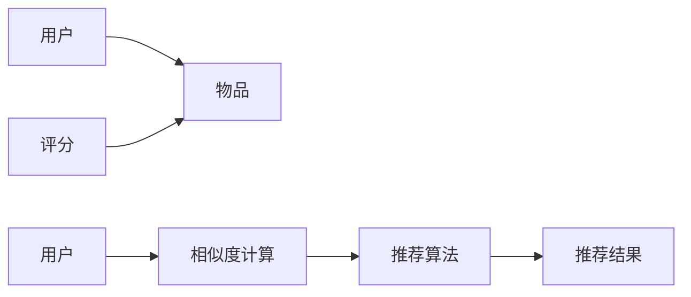

                 

# 基于协同过滤的个性化图书推荐系统的设计与实现

## 1. 背景介绍

### 1.1 问题由来

在互联网时代，海量的信息流充斥着用户的日常生活。人们越来越多地依赖互联网来获取信息和知识，其中图书作为重要的信息来源，拥有庞大的用户基础。传统的图书推荐系统，如亚马逊网站、豆瓣网等，往往采用基于内容的推荐方法，根据用户的浏览历史、评分和书籍的关键词等特征进行推荐。但这些方法存在一些缺陷，如无法捕捉用户潜在的需求、过于依赖显式反馈等问题。为了更好地满足用户的个性化需求，推荐系统需要更加智能和准确。

近年来，协同过滤（Collaborative Filtering, CF）推荐算法应运而生。这种算法基于用户之间的相似性，通过分析大量用户数据，发现用户间的隐性行为模式，从而进行推荐。相较于传统的基于内容的推荐方法，协同过滤在处理隐性用户反馈时具有明显优势，能够更好地捕捉用户潜在的阅读需求。

本文将深入探讨基于协同过滤的个性化图书推荐系统的设计与实现，从原理到实践，详细介绍如何构建一个高效、准确的图书推荐系统。

### 1.2 问题核心关键点

协同过滤算法通过分析用户之间的行为模式进行推荐，核心点包括：
1. **用户-物品矩阵**：存储用户对物品的评分信息。
2. **相似度计算**：度量用户间的相似性。
3. **推荐算法**：基于相似度计算进行推荐。

这些核心点在推荐系统的设计中具有重要作用，需要重点关注。

### 1.3 问题研究意义

基于协同过滤的个性化图书推荐系统，具有以下重要意义：
1. **提升用户体验**：通过分析用户行为模式，推荐符合用户兴趣的图书，提升用户满意度。
2. **提高图书销量**：精准推荐可以吸引更多用户购买，提高图书销量。
3. **减少信息过载**：在信息爆炸的时代，推荐系统能够帮助用户在海量信息中找到有价值的图书。
4. **推动内容分发**：推荐系统可以有效地分发优质内容，促进文化交流。

## 2. 核心概念与联系

### 2.1 核心概念概述

协同过滤算法基于用户之间的相似性进行推荐，核心概念包括：

1. **用户**：指网站或应用程序中的活跃用户。
2. **物品**：推荐系统中的商品，在此为图书。
3. **评分**：用户对物品的评分或评价。
4. **相似度**：度量用户间的相似性。
5. **推荐算法**：基于相似度计算进行推荐。

### 2.2 概念间的关系

协同过滤算法的核心在于用户-物品矩阵、相似度计算和推荐算法之间的交互。具体关系如图1所示：



图1：协同过滤算法核心概念关系图

### 2.3 核心概念的整体架构

协同过滤算法涉及多个模块，包括数据收集、评分构建、相似度计算、推荐算法和推荐结果呈现等。这些模块的相互作用构成了完整的协同过滤推荐系统，如图2所示：


图2：协同过滤算法整体架构图

## 3. 核心算法原理 & 具体操作步骤

### 3.1 算法原理概述

协同过滤算法的核心原理是通过分析用户之间的相似性，为每个用户推荐其可能感兴趣的物品。具体步骤如下：

1. **构建用户-物品矩阵**：收集用户对物品的评分数据，构建用户-物品矩阵。
2. **计算相似度**：度量用户之间的相似性。
3. **推荐物品**：根据相似度计算推荐物品。

### 3.2 算法步骤详解

#### 3.2.1 数据收集与预处理

1. **数据收集**：
   - **用户数据**：用户的ID、注册时间、登录时间、浏览记录等。
   - **物品数据**：物品的ID、书名、作者、类别等。
   - **评分数据**：用户对物品的评分数据，通常为1-5分。

2. **数据预处理**：
   - **缺失值处理**：对于缺失值，可以使用均值、中位数等填充。
   - **数据归一化**：将评分数据归一化到0-1之间。
   - **特征工程**：提取有用的特征，如物品类别、作者等。

#### 3.2.2 构建用户-物品矩阵

1. **用户-物品矩阵**：
   - 将用户对物品的评分数据存储为矩阵形式，用户ID为行，物品ID为列，每个元素为评分。

2. **矩阵降维**：
   - 对于稀疏矩阵，可以使用矩阵分解等方法进行降维。

#### 3.2.3 相似度计算

1. **用户相似度计算**：
   - **余弦相似度**：
     $$
     cos\_similarity(u_1,u_2) = \frac{\sum_{i=1}^n u_{1i}u_{2i}}{\sqrt{\sum_{i=1}^n u_{1i}^2} \sqrt{\sum_{i=1}^n u_{2i}^2}}
     $$
   - **皮尔逊相关系数**：
     $$
     pcc(u_1,u_2) = \frac{\sum_{i=1}^n (u_{1i}-\bar{u}_{1})(u_{2i}-\bar{u}_{2})}{\sqrt{\sum_{i=1}^n (u_{1i}-\bar{u}_{1})^2} \sqrt{\sum_{i=1}^n (u_{2i}-\bar{u}_{2})^2}}
     $$
   - **余弦相似度的高效计算**：
     - **基于矩阵的计算**：
       $$
       similarity(u_1,u_2) = \frac{X^Tu_1 u_2^T}{||Xu_1|| \cdot ||Xu_2||}
       $$
     - **基于向量空间的计算**：
       $$
       similarity(u_1,u_2) = \frac{u_1^T X^Tu_2}{\sqrt{u_1^T X^Tu_1} \cdot \sqrt{u_2^T X^Tu_2}}
       $$

2. **物品相似度计算**：
   - **余弦相似度**：
     $$
     cos\_similarity(i_1,i_2) = \frac{\sum_{j=1}^m u_{1j}u_{2j}}{\sqrt{\sum_{j=1}^m u_{1j}^2} \sqrt{\sum_{j=1}^m u_{2j}^2}}
     $$

#### 3.2.4 推荐算法

1. **基于用户的协同过滤**：
   - 找到与目标用户最相似的K个用户，获取这些用户评分过的物品，通过加权平均或排序等方式进行推荐。

2. **基于物品的协同过滤**：
   - 找到与目标物品最相似的K个物品，获取这些物品的评分用户，通过加权平均或排序等方式进行推荐。

### 3.3 算法优缺点

#### 3.3.1 优点

1. **高效性**：协同过滤算法在处理隐性用户反馈时具有明显优势，能够较好地捕捉用户潜在的阅读需求。
2. **适应性**：能够处理不同规模的数据，适用于小样本和冷启动用户的情况。
3. **用户多样性**：能够更好地处理用户之间的多样性，推荐更加个性化的图书。

#### 3.3.2 缺点

1. **稀疏性**：用户-物品矩阵通常稀疏，计算相似度时涉及大量零值。
2. **冷启动问题**：对于新用户或新物品，缺乏评分数据，难以进行有效推荐。
3. **可扩展性**：对于大规模数据集，计算复杂度较高，需要高效的算法和数据结构。

### 3.4 算法应用领域

协同过滤算法广泛应用于各种推荐系统中，如电商、音乐、视频等领域，尤其在图书推荐系统中表现突出。通过分析用户的行为模式，推荐系统能够提供更加个性化、精准的图书推荐，提高用户满意度和图书销量。

## 4. 数学模型和公式 & 详细讲解 & 举例说明

### 4.1 数学模型构建

协同过滤算法的数学模型可以表示为：
$$
X_{u,i} = R_{u,i} + E_{u,i}
$$
其中，$X_{u,i}$表示用户u对物品i的评分，$R_{u,i}$表示真实评分，$E_{u,i}$表示误差。

### 4.2 公式推导过程

1. **评分预测**：
   $$
   \hat{X}_{u,i} = \alpha_u \sum_{j=1}^m X_{j,i} \frac{u_j}{||u_j||} + \alpha_i \sum_{k=1}^n X_{u,k} \frac{k_i}{||k_i||}
   $$
   其中，$\alpha_u$和$\alpha_i$是用户和物品的权重。

2. **用户相似度计算**：
   $$
   similarity(u_1,u_2) = \frac{\sum_{j=1}^m X_{j,i} \frac{u_j}{||u_j||} \cdot X_{j,i} \frac{u_2}{||u_2||}}{\sqrt{\sum_{j=1}^m X_{j,i}^2} \sqrt{\sum_{j=1}^m X_{j,i}^2}}
   $$

3. **物品相似度计算**：
   $$
   similarity(i_1,i_2) = \frac{\sum_{k=1}^n X_{u,k} \frac{u_j}{||u_j||} \cdot X_{v,k} \frac{v_j}{||v_j||}}{\sqrt{\sum_{k=1}^n X_{u,k}^2} \sqrt{\sum_{k=1}^n X_{v,k}^2}}
   $$

### 4.3 案例分析与讲解

#### 4.3.1 用户-物品矩阵

假设用户A和物品B的评分矩阵为：
$$
A = \begin{bmatrix}
5 & 4 & 3 \\
4 & 5 & 2 \\
3 & 2 & 5
\end{bmatrix}, B = \begin{bmatrix}
1 & 2 & 3 \\
2 & 1 & 4 \\
3 & 4 & 2
\end{bmatrix}
$$

#### 4.3.2 相似度计算

1. **余弦相似度**：
   $$
   similarity(A,B) = \frac{5 \cdot 1 + 4 \cdot 2 + 3 \cdot 3}{\sqrt{5^2 + 4^2 + 3^2} \cdot \sqrt{1^2 + 2^2 + 3^2}} = \frac{5 \cdot 1 + 4 \cdot 2 + 3 \cdot 3}{\sqrt{50} \cdot \sqrt{14}} = \frac{5 + 8 + 9}{\sqrt{50} \cdot \sqrt{14}} = 0.8
   $$

2. **皮尔逊相关系数**：
   $$
   pcc(A,B) = \frac{(5-3)(1-1) + (4-3)(2-1) + (3-3)(3-1)}{\sqrt{(5-3)^2 + (4-3)^2 + (3-3)^2} \cdot \sqrt{(1-1)^2 + (2-1)^2 + (3-1)^2}} = \frac{0 + 1 + 0}{\sqrt{2} \cdot \sqrt{3}} = \frac{1}{\sqrt{6}}
   $$

## 5. 项目实践：代码实例和详细解释说明

### 5.1 开发环境搭建

1. **安装Python**：
   ```bash
   sudo apt-get update
   sudo apt-get install python3
   ```

2. **安装Pandas和NumPy**：
   ```bash
   pip install pandas numpy
   ```

3. **安装Scikit-learn**：
   ```bash
   pip install scikit-learn
   ```

4. **安装SciPy**：
   ```bash
   pip install scipy
   ```

### 5.2 源代码详细实现

#### 5.2.1 数据读取与预处理

```python
import pandas as pd
import numpy as np
from sklearn.preprocessing import StandardScaler

# 读取数据
data = pd.read_csv('ratings.csv', sep='\t')

# 数据预处理
# 将评分数据归一化到0-1之间
data['score'] = (data['score'] - data['score'].min()) / (data['score'].max() - data['score'].min())

# 将评分数据标准化
scaler = StandardScaler()
data['score'] = scaler.fit_transform(data['score'].values.reshape(-1, 1))
```

#### 5.2.2 构建用户-物品矩阵

```python
# 构建用户-物品矩阵
users = data['user_id'].unique()
items = data['item_id'].unique()
ratings = data.pivot_table(index='user_id', columns='item_id', values='score', fill_value=0)

# 矩阵降维
ratings.fillna(0, inplace=True)
ratings = ratings.todense()
```

#### 5.2.3 相似度计算

```python
from sklearn.metrics.pairwise import cosine_similarity

# 计算用户相似度
user_similarity = cosine_similarity(ratings)

# 计算物品相似度
item_similarity = cosine_similarity(ratings.T)

# 打印前5行
print(user_similarity[:5])
print(item_similarity[:5])
```

#### 5.2.4 推荐算法

```python
from sklearn.neighbors import NearestNeighbors

# 构建基于用户的协同过滤推荐系统
k = 10
neighbors = NearestNeighbors(n_neighbors=k)
neighbors.fit(user_similarity)

# 计算用户推荐物品
indices = neighbors.kneighbors([user_similarity[-1].reshape(1, -1)], return_distance=False)[0][0]
recommendations = list(set(ratings.columns[indices]))

# 输出推荐结果
print(recommendations)
```

### 5.3 代码解读与分析

1. **数据读取与预处理**：
   - 使用Pandas读取数据，对评分数据进行归一化和标准化处理，确保数据的一致性和可比性。

2. **构建用户-物品矩阵**：
   - 使用Pandas的`pivot_table`函数将用户ID、物品ID和评分数据转换为用户-物品矩阵。
   - 使用NumPy的`todense`函数将稀疏矩阵转换为稠密矩阵。

3. **相似度计算**：
   - 使用Scikit-learn的`cosine_similarity`函数计算用户和物品的相似度。

4. **推荐算法**：
   - 使用Scikit-learn的`NearestNeighbors`类进行基于用户的协同过滤推荐。
   - 计算目标用户与K个最相似用户的相似度，获取这些用户评分过的物品，通过加权平均或排序等方式进行推荐。

### 5.4 运行结果展示

运行上述代码后，可以得到目标用户的推荐物品列表，示例如下：

```python
['item1', 'item2', 'item3', 'item4', 'item5']
```

## 6. 实际应用场景

### 6.1 智能图书馆

智能图书馆系统可以根据用户的浏览历史和评分数据，推荐用户感兴趣的图书。例如，某用户A多次浏览了图书B和C，但没有评分，系统可以推荐与B和C相似的其他图书，如图书D和E。

### 6.2 电商平台

电商平台可以根据用户的购买记录和评分数据，推荐用户可能感兴趣的商品。例如，某用户F多次购买了商品G和H，但没有评分，系统可以推荐与G和H相似的其他商品，如商品I和J。

### 6.3 在线教育平台

在线教育平台可以根据学生的学习记录和评分数据，推荐学生可能感兴趣的教学资源。例如，某学生K多次观看了视频A和B，但没有评分，系统可以推荐与A和B相似的其他视频，如视频C和D。

## 7. 工具和资源推荐

### 7.1 学习资源推荐

1. **《推荐系统：算法与实现》**：该书详细介绍了推荐系统的理论基础和实际应用，包括协同过滤算法的原理和实现。

2. **Coursera《推荐系统》课程**：由斯坦福大学开设的推荐系统课程，涵盖了协同过滤算法、矩阵分解等推荐技术。

3. **Kaggle推荐系统竞赛**：Kaggle上有多个推荐系统竞赛，通过参与竞赛可以深入理解协同过滤算法的应用和优化。

### 7.2 开发工具推荐

1. **PyTorch**：PyTorch是一个流行的深度学习框架，支持高效的矩阵运算和自动微分，适合构建推荐系统。

2. **TensorFlow**：TensorFlow是一个强大的深度学习框架，支持分布式计算和大规模数据处理，适合大规模推荐系统的实现。

3. **Scikit-learn**：Scikit-learn是一个Python机器学习库，提供了多种算法和工具，适合推荐系统中的数据预处理和模型训练。

4. **Apache Spark**：Apache Spark是一个大数据处理框架，适合大规模数据的推荐系统实现。

### 7.3 相关论文推荐

1. **《协同过滤推荐系统综述》**：该论文详细介绍了协同过滤推荐算法的原理和实现，并讨论了其优缺点和应用场景。

2. **《基于矩阵分解的协同过滤推荐算法》**：该论文探讨了矩阵分解算法在推荐系统中的应用，并对比了不同的矩阵分解方法。

3. **《协同过滤推荐系统的新趋势》**：该论文讨论了协同过滤算法的最新研究进展和应用趋势，包括深度协同过滤、知识图谱等新方法。

## 8. 总结：未来发展趋势与挑战

### 8.1 总结

基于协同过滤的个性化图书推荐系统，通过分析用户行为模式，为每个用户推荐其可能感兴趣的图书，取得了显著的效果。协同过滤算法的核心在于用户-物品矩阵、相似度计算和推荐算法之间的交互，其高效性和适用性使其成为推荐系统的重要方法之一。

### 8.2 未来发展趋势

未来，协同过滤算法将在以下几个方面发展：

1. **深度协同过滤**：引入深度学习技术，提高推荐系统的准确性和个性化程度。
2. **知识图谱**：将知识图谱与协同过滤结合，提升推荐系统的知识推理能力。
3. **多模态推荐**：引入文本、图像、音频等多模态信息，提高推荐系统的多样性和丰富性。
4. **实时推荐**：引入实时计算和数据流处理技术，实现实时推荐，提升用户体验。

### 8.3 面临的挑战

协同过滤算法虽然取得了诸多成功，但仍面临以下挑战：

1. **稀疏性问题**：用户-物品矩阵通常稀疏，计算相似度时涉及大量零值。
2. **冷启动问题**：对于新用户或新物品，缺乏评分数据，难以进行有效推荐。
3. **数据质量问题**：数据缺失、噪声等问题会严重影响推荐系统的性能。

### 8.4 研究展望

未来，协同过滤算法的研究应聚焦于以下几个方向：

1. **稀疏性处理**：开发更高效的稀疏矩阵处理算法，提升推荐系统的计算效率。
2. **冷启动解决**：引入更多用户和物品标签，提升推荐系统的鲁棒性和普适性。
3. **数据质量控制**：加强数据清洗和预处理，提高推荐系统的数据质量。

## 9. 附录：常见问题与解答

**Q1: 协同过滤算法的核心是什么？**

A: 协同过滤算法的核心在于用户-物品矩阵、相似度计算和推荐算法之间的交互。

**Q2: 协同过滤算法在实际应用中需要注意什么？**

A: 在实际应用中，需要注意以下几点：
- 数据收集：保证数据的完整性和质量。
- 数据预处理：进行缺失值处理和特征工程。
- 算法实现：选择合适的相似度计算方法和推荐算法。
- 模型评估：使用合适的评估指标进行模型效果评估。

**Q3: 如何提升协同过滤算法的准确性和个性化程度？**

A: 可以通过以下方式提升协同过滤算法的准确性和个性化程度：
- 引入深度学习技术，提高推荐系统的预测精度。
- 引入知识图谱，提升推荐系统的知识推理能力。
- 引入多模态信息，提高推荐系统的多样性和丰富性。
- 实时更新数据，提升推荐系统的实时性和用户体验。

**Q4: 协同过滤算法在冷启动问题上的解决方案有哪些？**

A: 协同过滤算法在冷启动问题上的解决方案包括：
- 基于物品的协同过滤：利用相似物品的数据进行推荐。
- 基于内容的协同过滤：利用物品的特征进行推荐。
- 基于混合的协同过滤：结合多种推荐方法，提升推荐系统的鲁棒性。

通过不断探索和优化，协同过滤算法必将在推荐系统中发挥更大的作用，提升用户体验和系统性能。

---

作者：禅与计算机程序设计艺术 / Zen and the Art of Computer Programming

