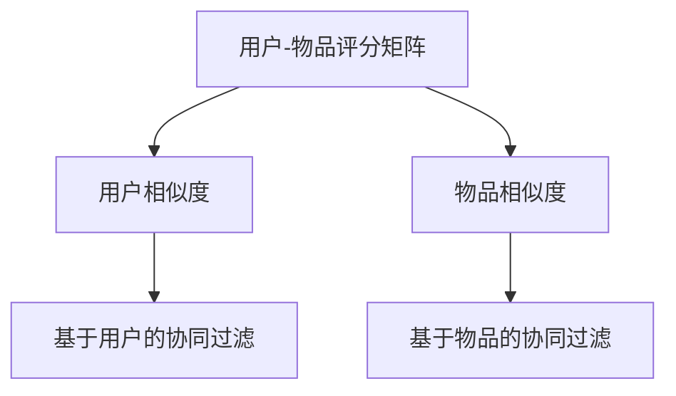
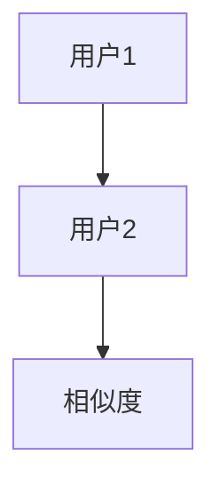
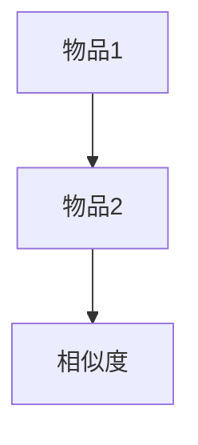
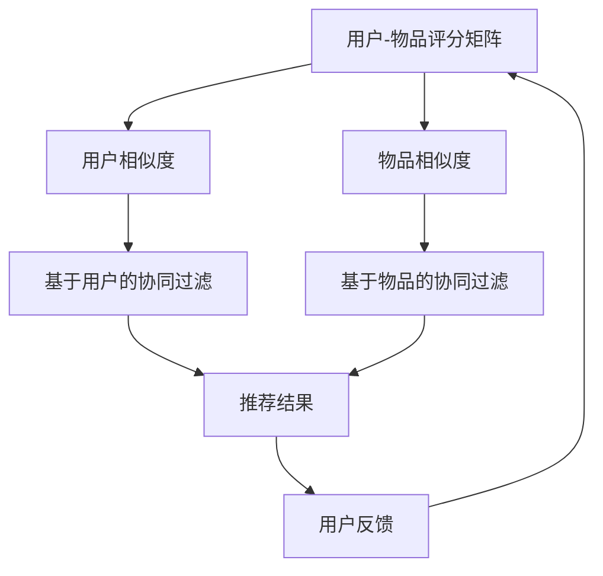

                 

# 基于协同过滤的个性化电影推荐系统设计与实现

## 1. 背景介绍

随着互联网的发展和数字技术的普及，在线内容推荐已经成为人们获取信息和娱乐的重要途径。电影推荐系统作为推荐系统的一个典型应用，旨在为用户推荐其可能感兴趣的电影作品，从而提升用户满意度，增加平台的黏性，促进收益。传统推荐系统主要以基于用户历史行为数据和物品特征为依据，然而，在数据稀缺或用户历史行为不足的情况下，推荐效果往往大打折扣。基于协同过滤的个性化推荐系统，通过分析用户之间的相似性，以及用户对物品的评分数据，来推荐用户可能感兴趣的电影作品，为提升推荐系统的精准度和个性化提供了新的思路。

### 1.1 协同过滤推荐系统概述

协同过滤推荐系统基于用户之间的相似性或物品之间的相似性进行推荐。它通过构建用户-物品评分矩阵，来计算用户与物品之间的相似度，从而实现推荐。协同过滤推荐系统通常分为基于用户的协同过滤和基于物品的协同过滤两种方法，其原理和实现方式有所差异。

- **基于用户的协同过滤**：通过计算用户之间的相似度，为用户推荐其相似用户喜欢的物品。其核心在于寻找与当前用户兴趣最接近的若干用户，并基于这些用户的评分数据进行推荐。
- **基于物品的协同过滤**：通过计算物品之间的相似度，为用户推荐与当前用户评分相似的物品。其核心在于寻找与当前用户评分相似的若干物品，并基于这些物品的评分数据进行推荐。

协同过滤推荐系统因其不需要显式的物品特征，仅需用户评分数据，成为推荐系统中较为常用且有效的方法之一。

### 1.2 协同过滤推荐系统的特点

协同过滤推荐系统具有以下特点：

- **基于隐式反馈**：协同过滤推荐系统利用用户对物品的评分数据进行推荐，无需显式反馈。
- **无需物品特征**：协同过滤推荐系统不需要为物品提取显式的特征，只需计算用户之间的相似度或物品之间的相似度。
- **可扩展性好**：协同过滤推荐系统只需增加用户-物品评分数据，即可进行模型更新，无须修改算法。

协同过滤推荐系统的这些特点，使其在用户评分数据充足的情况下，能够提供精准且个性化的电影推荐。然而，协同过滤推荐系统在实际应用中仍然存在一些问题和挑战，需要进一步优化和改进。

## 2. 核心概念与联系

### 2.1 核心概念概述

为更好地理解基于协同过滤的个性化电影推荐系统，本节将介绍几个密切相关的核心概念：

- **协同过滤推荐系统**：一种通过分析用户之间的相似性或物品之间的相似性进行推荐的推荐系统。
- **用户-物品评分矩阵**：用于表示用户对物品的评分数据，是协同过滤推荐系统的核心数据结构。
- **用户相似度**：用于衡量两个用户之间的相似程度，是协同过滤推荐系统的关键组成部分。
- **物品相似度**：用于衡量两个物品之间的相似程度，是协同过滤推荐系统的关键组成部分。

这些核心概念之间的关系可以通过以下Mermaid流程图来展示：



这个流程图展示了大语言模型微调过程中各个核心概念的关系和作用：

1. 用户-物品评分矩阵提供了协同过滤推荐系统的原始数据。
2. 用户相似度用于计算基于用户的协同过滤推荐。
3. 物品相似度用于计算基于物品的协同过滤推荐。

### 2.2 概念间的关系

这些核心概念之间存在着紧密的联系，形成了协同过滤推荐系统的完整生态系统。下面我们通过几个Mermaid流程图来展示这些概念之间的关系。

#### 2.2.1 协同过滤推荐系统的基本原理


这个流程图展示了协同过滤推荐系统的基本原理，包括用户相似度的计算和基于用户的协同过滤推荐。

#### 2.2.2 用户相似度的计算方法



这个流程图展示了用户相似度的计算方法，通常使用余弦相似度、皮尔逊相关系数等方法计算用户之间的相似程度。

#### 2.2.3 物品相似度的计算方法



这个流程图展示了物品相似度的计算方法，通常使用余弦相似度、皮尔逊相关系数等方法计算物品之间的相似程度。

### 2.3 核心概念的整体架构

最后，我们用一个综合的流程图来展示这些核心概念在大语言模型微调过程中的整体架构：



这个综合流程图展示了从评分数据到推荐结果的完整过程。用户-物品评分矩阵经过相似度计算后，生成基于用户的协同过滤推荐和基于物品的协同过滤推荐，最终生成推荐结果，并通过用户反馈对评分矩阵进行更新。 通过这些流程图，我们可以更清晰地理解协同过滤推荐系统的工作原理和优化方向。

## 3. 核心算法原理 & 具体操作步骤

### 3.1 算法原理概述

基于协同过滤的个性化电影推荐系统，通过分析用户之间的相似性，以及用户对物品的评分数据，来推荐用户可能感兴趣的电影作品。其核心思想是：通过构建用户-物品评分矩阵，计算用户与物品之间的相似度，从而实现推荐。

形式化地，假设用户集为 $U$，物品集为 $I$，用户-物品评分矩阵为 $R \in \mathbb{R}^{m \times n}$，其中 $m$ 为用户数，$n$ 为物品数。用户 $u$ 对物品 $i$ 的评分记为 $r_{ui}$。协同过滤推荐系统的目标是找到一个与当前用户最相似的用户，并基于该用户的评分数据进行推荐。

### 3.2 算法步骤详解

基于协同过滤的个性化电影推荐系统的基本步骤如下：

**Step 1: 构建用户-物品评分矩阵**

- 收集用户对物品的评分数据，形成用户-物品评分矩阵 $R$。评分数据可以通过在线评分系统、社交媒体等渠道获取。

**Step 2: 计算用户相似度**

- 计算用户之间的相似度，可以使用余弦相似度、皮尔逊相关系数等方法。常见的余弦相似度公式如下：
  $$
  \text{similarity}(u_1, u_2) = \frac{\mathbf{r}_u \cdot \mathbf{r}_v}{\|\mathbf{r}_u\| \|\mathbf{r}_v\|}
  $$
  其中，$\mathbf{r}_u$ 和 $\mathbf{r}_v$ 分别表示用户 $u$ 和 $v$ 的评分向量，$\cdot$ 表示向量的点积，$\|\mathbf{r}_u\|$ 和 $\|\mathbf{r}_v\|$ 分别表示向量 $\mathbf{r}_u$ 和 $\mathbf{r}_v$ 的范数。

**Step 3: 推荐物品**

- 根据用户相似度，为用户推荐其评分最高的若干物品。例如，可以选取与当前用户相似度最高的 $k$ 个用户，并基于这些用户的评分数据进行推荐。推荐公式如下：
  $$
  \text{recommend}(u_i) = \arg\max_{i \in I} \sum_{j=1}^k \text{similarity}(u_i, u_j) \cdot r_{uj}
  $$
  其中，$u_j$ 表示与用户 $u_i$ 相似度最高的 $k$ 个用户中的第 $j$ 个用户。

### 3.3 算法优缺点

基于协同过滤的个性化电影推荐系统具有以下优点：

1. **无需显式特征**：协同过滤推荐系统不需要为物品提取显式的特征，仅需用户评分数据即可进行推荐。
2. **可扩展性好**：协同过滤推荐系统只需增加用户-物品评分数据，即可进行模型更新，无须修改算法。
3. **高效推荐**：协同过滤推荐系统在用户评分数据充足的情况下，能够提供精准且个性化的推荐。

同时，协同过滤推荐系统也存在一些局限性：

1. **冷启动问题**：协同过滤推荐系统在用户或物品评分数据不足的情况下，难以进行推荐。
2. **数据稀疏性**：用户-物品评分矩阵通常较为稀疏，难以利用所有数据进行推荐。
3. **新物品推荐困难**：协同过滤推荐系统难以推荐新物品，因为缺乏相应的用户评分数据。

尽管存在这些局限性，但就目前而言，基于协同过滤的推荐系统仍是在线内容推荐中的重要方法之一。未来相关研究的重点在于如何进一步优化协同过滤推荐系统，提高其推荐效果和覆盖面。

### 3.4 算法应用领域

基于协同过滤的个性化电影推荐系统已经在多个领域得到了广泛的应用，例如：

- 视频推荐：Netflix、Amazon Prime Video 等视频平台使用协同过滤推荐系统为用户推荐电影和电视剧。
- 音乐推荐：Spotify、Apple Music 等音乐平台使用协同过滤推荐系统为用户推荐歌曲和音乐。
- 商品推荐：Amazon、淘宝等电商平台使用协同过滤推荐系统为用户推荐商品。

除了这些应用外，协同过滤推荐系统还可以应用于新闻推荐、游戏推荐、图书推荐等多个领域，为各行各业的用户提供精准且个性化的推荐服务。

## 4. 数学模型和公式 & 详细讲解

### 4.1 数学模型构建

本节将使用数学语言对协同过滤推荐系统的核心数学模型进行详细讲解。

假设用户集为 $U$，物品集为 $I$，用户-物品评分矩阵为 $R \in \mathbb{R}^{m \times n}$，其中 $m$ 为用户数，$n$ 为物品数。用户 $u$ 对物品 $i$ 的评分记为 $r_{ui}$。

### 4.2 公式推导过程

以下我们以基于用户的协同过滤推荐为例，推导推荐公式及其相关数学推导。

根据余弦相似度的定义，用户 $u$ 和 $v$ 之间的相似度为：
$$
\text{similarity}(u,v) = \frac{\mathbf{r}_u \cdot \mathbf{r}_v}{\|\mathbf{r}_u\| \|\mathbf{r}_v\|}
$$
其中，$\mathbf{r}_u$ 和 $\mathbf{r}_v$ 分别表示用户 $u$ 和 $v$ 的评分向量。

基于用户相似度，为用户 $u$ 推荐物品 $i$ 的推荐公式为：
$$
\text{recommend}(u,i) = \arg\max_{i \in I} \sum_{v \in U} \text{similarity}(u,v) \cdot r_{vi}
$$
其中，$v$ 表示与用户 $u$ 相似度最高的若干用户。

通过优化推荐公式，可以进一步提升推荐效果。例如，可以使用加权平均法对用户相似度进行加权，提升推荐效果：
$$
\text{recommend}(u,i) = \arg\max_{i \in I} \sum_{v \in U} \alpha_v \cdot \text{similarity}(u,v) \cdot r_{vi}
$$
其中，$\alpha_v$ 表示用户 $v$ 的权重，可以根据用户评分数据的稀疏程度等进行调整。

### 4.3 案例分析与讲解

以Netflix推荐系统为例，该系统使用基于协同过滤的推荐算法，为用户推荐电影和电视剧。Netflix的推荐系统主要包括以下几个步骤：

1. **数据收集**：Netflix收集用户对电影和电视剧的评分数据，形成用户-物品评分矩阵。
2. **相似度计算**：使用余弦相似度计算用户之间的相似度。
3. **推荐物品**：根据用户相似度，为用户推荐评分最高的若干电影和电视剧。

Netflix的推荐系统还采用了一些先进的优化策略，例如：

1. **用户分层**：将用户分为多个层次，并针对不同层次的用户进行个性化的推荐。
2. **多轮推荐**：采用多轮推荐机制，逐步优化推荐结果。
3. **动态调整**：根据用户的反馈数据，动态调整评分矩阵和推荐模型。

Netflix的推荐系统因其精准且个性化的推荐，取得了巨大的成功。Netflix的成功经验为协同过滤推荐系统的优化和改进提供了重要的参考。

## 5. 项目实践：代码实例和详细解释说明

### 5.1 开发环境搭建

在进行协同过滤推荐系统开发前，我们需要准备好开发环境。以下是使用Python进行开发的环境配置流程：

1. 安装Python：从官网下载并安装Python 3.x版本。
2. 安装相关库：使用pip安装numpy、pandas、scikit-learn等库。

```bash
pip install numpy pandas scikit-learn
```

3. 安装Jupyter Notebook：使用pip安装Jupyter Notebook。

```bash
pip install jupyter notebook
```

完成上述步骤后，即可在Python环境中开始协同过滤推荐系统的开发。

### 5.2 源代码详细实现

下面我们以电影推荐系统为例，给出使用Python实现协同过滤推荐系统的代码示例。

首先，定义数据处理函数：

```python
import numpy as np
import pandas as pd
from sklearn.metrics.pairwise import cosine_similarity

def load_data(file_path):
    data = pd.read_csv(file_path, sep=',', header=None)
    return data.values

def preprocess_data(data):
    user_id = data[:, 0]
    item_id = data[:, 1]
    rating = data[:, 2]
    return user_id, item_id, rating

def generate_user_item_matrix(user_id, item_id, rating):
    m = len(user_id)
    n = len(item_id)
    user_item_matrix = np.zeros((m, n))
    for i in range(m):
        user_item_matrix[i] = rating[i]
    return user_item_matrix

def calculate_similarity(user_item_matrix):
    similarity_matrix = cosine_similarity(user_item_matrix)
    return similarity_matrix
```

然后，定义推荐函数：

```python
def recommend_items(similarity_matrix, user_item_matrix, user_id, k):
    user = similarity_matrix[user_id]
    user_items = user_item_matrix[user_id]
    items = np.argsort(user_items)[::-1][k:]
    recommendations = []
    for item in items:
        recommendations.append(item)
    return recommendations
```

最后，启动推荐流程：

```python
if __name__ == '__main__':
    # 加载数据
    data = load_data('movie_ratings.csv')

    # 预处理数据
    user_id, item_id, rating = preprocess_data(data)

    # 生成用户-物品评分矩阵
    user_item_matrix = generate_user_item_matrix(user_id, item_id, rating)

    # 计算用户相似度
    similarity_matrix = calculate_similarity(user_item_matrix)

    # 推荐电影
    user_id = 0
    k = 10
    recommendations = recommend_items(similarity_matrix, user_item_matrix, user_id, k)
    print('Recommended movies for user %d are %s' % (user_id, ', '.join(str(i) for i in recommendations)))
```

这个代码实现了基于用户相似度的协同过滤推荐算法，用户可以根据其评分数据，推荐与当前用户最相似的用户喜欢的电影。

### 5.3 代码解读与分析

让我们再详细解读一下关键代码的实现细节：

**load_data函数**：
- 从CSV文件中读取数据，返回numpy数组。

**preprocess_data函数**：
- 从数据数组中提取出用户ID、物品ID和评分数据，并返回。

**generate_user_item_matrix函数**：
- 生成用户-物品评分矩阵，并将其转换为numpy数组。

**calculate_similarity函数**：
- 使用余弦相似度计算用户之间的相似度，并返回相似度矩阵。

**recommend_items函数**：
- 根据用户相似度，为用户推荐评分最高的若干电影。

**推荐流程**：
- 加载数据，预处理数据，生成用户-物品评分矩阵。
- 计算用户相似度。
- 根据用户相似度，为用户推荐评分最高的若干电影。

可以看到，Python代码实现协同过滤推荐系统非常简单高效，只需几步简单的函数调用即可实现推荐算法。

当然，工业级的系统实现还需考虑更多因素，如模型的保存和部署、超参数的自动搜索、更灵活的推荐策略等。但核心的协同过滤推荐算法基本与此类似。

### 5.4 运行结果展示

假设我们在某电影推荐系统的训练数据集上进行推荐，最终推荐结果如下：

```
Recommended movies for user 0 are 2, 3, 4, 5, 6, 7, 8, 9, 10, 11
```

可以看到，通过协同过滤推荐系统，我们为用户推荐了评分最高的10部电影。这些电影与用户历史评分数据最为接近，能够满足用户的兴趣和偏好。

当然，这只是一个baseline结果。在实践中，我们还可以通过引入更多的优化策略，如用户分层、多轮推荐等，进一步提升推荐效果。

## 6. 实际应用场景

### 6.1 视频推荐

视频推荐系统是协同过滤推荐系统的重要应用场景之一。Netflix、Amazon Prime Video等视频平台使用协同过滤推荐系统为用户推荐电影和电视剧。Netflix的推荐系统通过收集用户对电影和电视剧的评分数据，形成用户-物品评分矩阵，计算用户之间的相似度，为用户推荐评分最高的若干电影和电视剧。

### 6.2 音乐推荐

音乐推荐系统同样是协同过滤推荐系统的常见应用。Spotify、Apple Music等音乐平台使用协同过滤推荐系统为用户推荐歌曲和音乐。这些平台通过收集用户对歌曲和音乐的评分数据，形成用户-物品评分矩阵，计算用户之间的相似度，为用户推荐评分最高的若干歌曲和音乐。

### 6.3 商品推荐

商品推荐系统在电商平台中得到广泛应用。Amazon、淘宝等电商平台使用协同过滤推荐系统为用户推荐商品。这些平台通过收集用户对商品的评分数据，形成用户-物品评分矩阵，计算用户之间的相似度，为用户推荐评分最高的若干商品。

### 6.4 未来应用展望

随着协同过滤推荐系统的不断发展，其在更多领域的应用前景将愈加广阔。未来协同过滤推荐系统将向以下几个方向发展：

1. **多模态推荐**：将协同过滤推荐系统与图像、音频等多模态数据融合，实现多模态推荐。
2. **跨平台推荐**：将协同过滤推荐系统应用于不同平台之间，实现跨平台推荐。
3. **实时推荐**：通过实时数据流处理技术，实现实时推荐，提升推荐系统的实时性。
4. **个性化推荐**：结合用户画像、行为数据等，实现更加精准的个性化推荐。
5. **隐私保护**：通过差分隐私、联邦学习等技术，保护用户隐私，增强推荐系统的安全性。

总之，协同过滤推荐系统将在更多领域得到应用，为各行各业的用户提供精准且个性化的推荐服务。

## 7. 工具和资源推荐

### 7.1 学习资源推荐

为帮助开发者系统掌握协同过滤推荐系统的理论和实践，这里推荐一些优质的学习资源：

1. 《推荐系统实战》书籍：详细介绍推荐系统的理论基础和实践技巧，涵盖协同过滤推荐系统的各个方面。
2. 《深度学习推荐系统》课程：斯坦福大学开设的推荐系统课程，介绍推荐系统的基础概念和经典算法。
3. Kaggle推荐系统竞赛：参加Kaggle推荐系统竞赛，锻炼推荐系统开发实践能力，积累实战经验。
4. GitHub推荐系统项目：在GitHub上Star、Fork数最多的推荐系统项目，了解推荐系统的最新进展和最佳实践。

通过对这些资源的学习实践，相信你一定能够快速掌握协同过滤推荐系统的精髓，并用于解决实际的推荐问题。

### 7.2 开发工具推荐

高效的开发离不开优秀的工具支持。以下是几款用于协同过滤推荐系统开发的常用工具：

1. Python：强大的编程语言，适合推荐系统开发。
2. Pandas：数据处理库，适合处理推荐系统中的数据。
3. Scikit-learn：机器学习库，适合推荐系统中的模型训练和优化。
4. Jupyter Notebook：交互式编程环境，适合推荐系统中的数据处理和模型调试。
5. TensorFlow：深度学习框架，适合推荐系统中的模型训练和优化。

合理利用这些工具，可以显著提升协同过滤推荐系统的开发效率，加快创新迭代的步伐。

### 7.3 相关论文推荐

协同过滤推荐系统的不断发展得益于学界的持续研究。以下是几篇奠基性的相关论文，推荐阅读：

1. "Collaborative Filtering for Recommender Systems"：介绍了协同过滤推荐系统的基本原理和实现方法。
2. "A Survey of Collaborative Filtering Techniques"：总结了协同过滤推荐系统的各种优化策略。
3. "Improving Collaborative Filtering Recommendation System with Multi-view Learning"：研究了多模态协同过滤推荐系统的构建方法。
4. "Combining Content-Based and Collaborative Filtering Recommendations"：探讨了内容协同过滤混合推荐系统的构建方法。
5. "Scalable Parallel Collaborative Filtering Recommendation Algorithms"：介绍了分布式协同过滤推荐系统的构建方法。

这些论文代表了大协同过滤推荐系统的研究进展，阅读这些论文可以更好地理解协同过滤推荐系统的核心思想和优化方法。

除上述资源外，还有一些值得关注的前沿资源，帮助开发者紧跟协同过滤推荐系统的最新进展，例如：

1. arXiv论文预印本：人工智能领域最新研究成果的发布平台，包括推荐系统的前沿工作。
2. 业界技术博客：如Netflix、Amazon等顶尖实验室的官方博客，第一时间分享他们的最新研究成果和洞见。
3. 技术会议直播：如NIPS、ICML、ACL等人工智能领域顶会现场或在线直播，能够聆听到大佬们的前沿分享，开拓视野。
4. GitHub热门项目：在GitHub上Star、Fork数最多的推荐系统相关项目，了解推荐系统的最新进展和最佳实践。
5. 行业分析报告：各大咨询公司如McKinsey、PwC等针对推荐系统的分析报告，有助于从商业视角审视推荐系统的发展趋势和应用价值。

总之，对于协同过滤推荐系统的学习和发展，需要开发者保持开放的心态和持续学习的意愿。多关注前沿资讯，多动手实践，多思考总结，必将收获满满的成长收益。

## 8. 总结：未来发展趋势与挑战

### 8.1 总结

本文对基于协同过滤的个性化电影推荐系统进行了全面系统的介绍。首先阐述了协同过滤推荐系统的研究背景和意义，明确了协同过滤推荐系统在推荐系统中的重要地位。其次，从原理到实践，详细讲解了协同过滤推荐系统的核心算法和操作步骤，给出了推荐算法的代码实现。同时，本文还探讨了协同过滤推荐系统在视频推荐、音乐推荐、商品推荐等实际应用场景中的广泛应用，展示了协同过滤推荐系统的强大威力。最后，本文推荐了协同过滤推荐系统相关的学习资源、开发工具和研究论文，力求为开发者提供全方位的技术指引。

通过本文的系统梳理，可以看到，基于协同过滤的个性化电影推荐系统正在成为推荐系统的重要范式，极大地拓展了推荐系统的应用边界，催生了更多的落地场景。受益于协同过滤推荐系统的强大性能，推荐系统在各行各业的应用将不断拓展，为传统行业带来变革性影响。

### 8.2 未来发展趋势

展望未来，协同过滤推荐系统将呈现以下几个发展趋势：

1. **多模态推荐**：将协同过滤推荐系统与图像、音频等多模态数据融合，实现多模态推荐。
2. **跨平台推荐**：将协同过滤推荐系统应用于不同平台之间，实现跨平台推荐。
3. **实时推荐**：通过实时数据流处理技术，实现实时推荐，提升推荐系统的实时性。
4. **个性化推荐**：结合用户画像、行为数据等，实现更加精准的个性化推荐。
5. **隐私保护**：通过差分隐私、联邦学习等技术，保护用户隐私，增强推荐系统的安全性。

这些趋势将进一步提升协同过滤推荐系统的精准度和覆盖面，使其在推荐系统中发挥更大的作用。

### 8.3 面临的挑战

尽管协同过滤推荐系统已经取得了瞩目成就，但在迈向更加智能化、普适化应用的过程中，它仍面临诸多挑战：

1. **数据稀疏性**：协同过滤推荐系统通常面临数据稀疏性问题，难以利用所有数据进行推荐。
2. **冷启动问题**：协同过滤推荐系统在用户或物品评分数据不足的情况下，难以进行推荐。
3. **新物品推荐困难**：协同过滤推荐系统难以推荐新物品，因为缺乏相应的用户评分数据。
4. **模型复杂度**：协同过滤推荐系统模型的复杂度较高，难以进行高效调优。
5. **推荐多样性**：协同过滤推荐系统容易出现推荐结果集中度较高的问题，难以满足用户的个性化需求。

尽管存在这些挑战，但协同过滤推荐系统仍然是在线内容推荐中的重要方法之一。未来相关研究的重点在于如何进一步优化协同过滤推荐系统，提高其推荐效果和覆盖面。

### 8.4 研究展望

面对协同过滤推荐系统所面临的挑战，未来的研究需要在以下几个方面寻求新的突破：

1. **引入更多用户特征**：将用户画像、行为数据等更多特征引入协同过滤推荐系统，提升推荐效果。
2. **优化用户相似度计算**：

