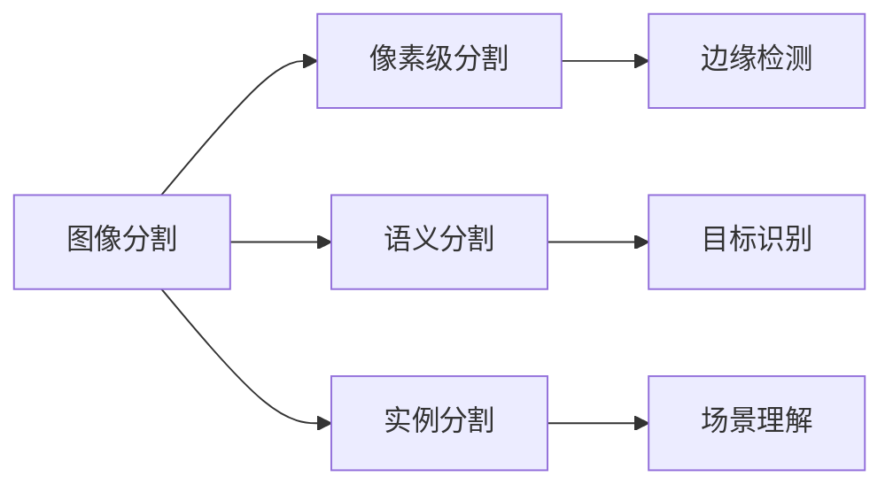
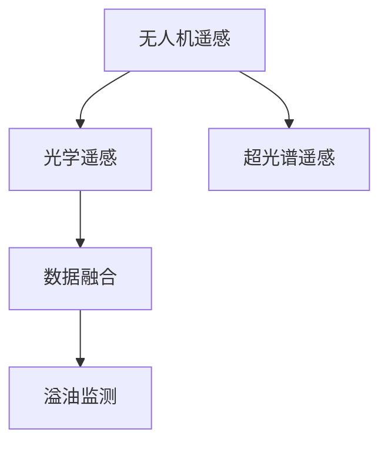

                 

# 基于图像分割模型的通感图像海西溢油监测

> 关键词：图像分割, 通感, 溢油监测, 卷积神经网络(CNN), 全卷积网络(FCNN), U-Net, 语义分割, 目标检测, 无人机, 光学遥感, 超光谱遥感

## 1. 背景介绍

### 1.1 问题由来

随着全球气候变化和人类活动的影响，海洋环境污染问题日益严峻。海洋溢油是其中一种严重影响海洋生态环境和人类生产生活的污染形式。溢油事件不仅对海洋生态造成严重破坏，还可能引发连锁反应，如海洋生物死亡、海洋渔业受损等，对社会和经济产生深远影响。

海西地区（指中国浙江省的温州市、丽水市、宁波市等沿海地区）拥有丰富的海洋资源和良好的生态环境，但也面临着较大溢油风险。近年来，该地区频发的溢油事件对海洋环境和经济造成了严重影响。如何及时发现和应对海洋溢油事件，保护海洋生态环境，成为海西地区迫切需要解决的问题。

### 1.2 问题核心关键点

海洋溢油监测涉及对海洋表面溢油现象的快速、准确识别和定位。传统的监测方法主要包括人工巡查、海上巡逻、卫星遥感等，但这些方法存在响应时间长、检测效率低、监测范围有限等缺点。近年来，基于图像分割的溢油监测技术逐渐兴起，以其快速高效、覆盖范围广、精确度高等优点，成为解决溢油监测问题的有效手段。

图像分割技术旨在将复杂图像分为多个语义区域，并确定每个区域的对象类别和属性。通过对溢油图像的分割，可以准确识别溢油区域，从而实现快速响应和处理。

本文聚焦于基于图像分割的溢油监测技术，特别针对海西地区的溢油监测需求，提出了一套综合利用多源数据的溢油监测方案。

## 2. 核心概念与联系

### 2.1 核心概念概述

为更好地理解基于图像分割的海洋溢油监测技术，本节将介绍几个关键概念：

- 图像分割(Image Segmentation)：将图像分割为多个语义区域，确定每个区域的对象类别和属性。是溢油监测的核心技术。

- 通感(Sensor Fusion)：将多种传感器（如光学遥感、超光谱遥感、无人机遥感等）的信息进行融合，提高溢油监测的精度和可靠性。

- 溢油监测(Oil Spill Monitoring)：通过各种手段对海洋表面溢油现象进行快速、准确识别和定位，以实现及时响应和处理。

- 卷积神经网络(Convolutional Neural Network, CNN)：一种专门用于图像处理的深度学习模型，广泛应用于图像分割、目标检测等领域。

- 全卷积网络(Fully Convolutional Network, FCN)：一种用于图像分割的CNN变体，能够输出与输入图像大小相同的语义分割图。

- U-Net：一种经典的用于图像分割的CNN结构，具有编码器和解码器两部分，能够同时处理尺度信息，适用于高分辨率图像分割。

- 语义分割(Semantic Segmentation)：将图像每个像素点分类为特定类别，常用于目标检测、场景理解等任务。

- 目标检测(Object Detection)：在图像中定位并识别出感兴趣的目标，常与图像分割技术结合使用。

- 无人机(Unmanned Aerial Vehicle, UAV)：一种自主飞行的航空器，可以搭载多种传感器，进行高空侦察和数据采集。

- 光学遥感(Optical Remote Sensing)：利用光学传感器（如可见光、红外、多光谱等）获取地表信息的技术。

- 超光谱遥感(Hyper-spectral Remote Sensing)：利用超光谱传感器获取地物的光谱信息，用于高精度地表覆盖分类和物质识别。

这些概念之间的逻辑关系可以通过以下Mermaid流程图来展示：

```mermaid
graph TB
    A[图像分割] --> B[卷积神经网络(CNN)]
    A --> C[全卷积网络(FCN)]
    A --> D[U-Net]
    A --> E[语义分割]
    A --> F[目标检测]
    A --> G[无人机遥感]
    A --> H[光学遥感]
    A --> I[超光谱遥感]
    A --> J[通感(Sensor Fusion)]
    J --> K[多源数据融合]
    K --> L[溢油监测]
```

这个流程图展示了基于图像分割的海洋溢油监测技术涉及的关键概念及其关系：

1. 图像分割是溢油监测的核心技术。
2. 卷积神经网络、全卷积网络、U-Net等是常用的图像分割模型。
3. 语义分割和目标检测是图像分割的具体应用，可以用于溢油区域的定位和属性分析。
4. 无人机遥感、光学遥感和超光谱遥感等是多种数据源，可以融合用于溢油监测。
5. 通感技术融合多种传感器信息，提高溢油监测的精度和可靠性。

### 2.2 概念间的关系

这些核心概念之间存在着紧密的联系，形成了基于图像分割的海洋溢油监测技术的完整生态系统。下面我们通过几个Mermaid流程图来展示这些概念之间的关系。

#### 2.2.1 图像分割技术的发展脉络



这个流程图展示了图像分割技术的发展脉络：从像素级分割到语义分割和实例分割，图像分割技术的精度和应用范围不断提升。

#### 2.2.2 多源数据融合在溢油监测中的应用



这个流程图展示了多源数据融合在溢油监测中的应用：通过融合无人机遥感、光学遥感和超光谱遥感等多种数据源，可以提高溢油监测的准确性和可靠性。

#### 2.2.3 通感技术在溢油监测中的作用

```mermaid
graph LR
    A[无人机遥感] --> B[光学遥感]
    A --> C[超光谱遥感]
    B --> D[数据融合]
    D --> E[通感(Sensor Fusion)]
    E --> F[溢油监测]
```

这个流程图展示了通感技术在溢油监测中的作用：通过将多种传感器信息进行融合，可以全面、准确地获取溢油现场的信息，从而提高溢油监测的效果。

### 2.3 核心概念的整体架构

最后，我们用一个综合的流程图来展示这些核心概念在大规模图像分割模型中的整体架构：

```mermaid
graph TB
    A[大规模图像数据] --> B[卷积神经网络(CNN)]
    B --> C[全卷积网络(FCN)]
    C --> D[U-Net]
    D --> E[语义分割]
    D --> F[目标检测]
    E --> G[溢油监测]
    G --> H[响应处理]
    H --> I[数据反馈]
    I --> J[持续学习]
    J --> B
```

这个综合流程图展示了从图像数据预处理到溢油监测，再到响应处理和持续学习的完整过程。大规模图像分割模型首先对图像数据进行卷积神经网络处理，生成语义分割结果。然后利用U-Net进行高分辨率图像分割，结合目标检测技术，定位溢油区域。最后，将监测结果进行响应处理，并不断通过数据反馈和持续学习进行优化，以提升溢油监测的准确性和可靠性。

## 3. 核心算法原理 & 具体操作步骤
### 3.1 算法原理概述

基于图像分割的海洋溢油监测技术，本质上是一种图像分类任务，通过卷积神经网络等深度学习模型，将输入图像分割为不同的语义区域，并将每个区域分类为溢油区域或非溢油区域。

形式化地，设输入图像 $I$ 为 $d \times h \times w$ 的三维张量，其中 $d$ 为通道数，$h$ 和 $w$ 分别为图像的高度和宽度。溢油监测的数学模型可以表示为：

$$
Y = F(I; \theta)
$$

其中 $Y$ 为语义分割图，$I$ 为输入图像，$F$ 为卷积神经网络模型，$\theta$ 为模型参数。

模型的目标是最小化损失函数 $\mathcal{L}$，使得 $F(I; \theta)$ 与真实标签 $Y^*$ 之间的差异最小化：

$$
\theta^* = \mathop{\arg\min}_{\theta} \mathcal{L}(F(I; \theta), Y^*)
$$

常用的损失函数包括交叉熵损失、Dice损失等。在实践中，我们通常使用基于梯度的优化算法（如Adam、SGD等）来近似求解上述最优化问题。

### 3.2 算法步骤详解

基于图像分割的海洋溢油监测技术一般包括以下几个关键步骤：

**Step 1: 数据预处理**
- 收集高分辨率的海洋图像数据，包括光学遥感、超光谱遥感和无人机遥感数据。
- 对图像进行预处理，如去噪、归一化、尺度变换等，提高数据的可用性。

**Step 2: 模型构建**
- 选择合适的卷积神经网络结构，如卷积神经网络(CNN)、全卷积网络(FCN)、U-Net等。
- 设计合适的输出层和损失函数，如交叉熵损失、Dice损失等。

**Step 3: 模型训练**
- 将预处理后的数据集划分为训练集、验证集和测试集。
- 使用梯度下降等优化算法，最小化损失函数，训练卷积神经网络模型。
- 在验证集上评估模型性能，根据性能指标调整模型参数。

**Step 4: 模型评估**
- 在测试集上评估模型性能，对比微调前后的精度提升。
- 使用模型进行溢油监测，输出溢油区域的定位和分类结果。

**Step 5: 应用部署**
- 将训练好的模型集成到实时监控系统中，部署到无人机、卫星等设备上。
- 定期更新模型，以适应海洋环境的变化和新的溢油事件。

以上是基于图像分割的海洋溢油监测的一般流程。在实际应用中，还需要针对具体任务的特点，对预处理、模型选择和优化、模型评估等环节进行优化设计，以进一步提升模型性能。

### 3.3 算法优缺点

基于图像分割的海洋溢油监测技术具有以下优点：

- 快速高效。利用深度学习模型，可以快速处理大量图像数据，实现实时监测。
- 高精度。卷积神经网络等深度学习模型具有较强的图像分类和分割能力，能够准确识别溢油区域。
- 适用范围广。适用于多种数据源，如光学遥感、超光谱遥感、无人机遥感等。
- 易于扩展。可以通过增加更多的传感器数据，进一步提升溢油监测的精度和可靠性。

同时，该方法也存在以下缺点：

- 数据需求高。需要大量高分辨率的海洋图像数据，且数据标注成本较高。
- 模型复杂度高。卷积神经网络等深度学习模型参数量较大，对计算资源要求较高。
- 模型泛化能力有限。当新的溢油事件发生时，需要重新训练模型，适应新的数据分布。
- 对抗样本敏感。深度学习模型容易受到对抗样本的干扰，导致错误的溢油监测结果。

尽管存在这些局限性，但就目前而言，基于图像分割的海洋溢油监测技术仍是大规模图像分割模型应用的主流范式。未来相关研究的重点在于如何进一步降低数据需求，提高模型的泛化能力和对抗样本鲁棒性，同时兼顾可解释性和伦理安全性等因素。

### 3.4 算法应用领域

基于图像分割的海洋溢油监测技术已经在多个领域得到广泛应用，包括：

- 海洋环境监测：通过高分辨率的遥感数据，实时监测海洋表面状态，及时发现溢油事件。
- 海洋资源管理：利用超光谱遥感数据，分析海洋生态系统的健康状况，优化海洋资源利用。
- 海上救援与灾害响应：通过无人机和卫星数据，快速定位海上紧急事件，协调救援资源。
- 海洋污染治理：对海洋污染源进行监控和追踪，及时采取治理措施。
- 环境保护与评估：通过图像分割技术，对海洋环境进行长期监测和评估，提升环境治理能力。

除了上述这些经典应用外，基于图像分割的海洋溢油监测技术还在不断扩展到更多场景中，如海洋生态研究、海洋军事应用、海洋生物保护等，为海洋环境保护和可持续发展提供新的技术手段。

## 4. 数学模型和公式 & 详细讲解  
### 4.1 数学模型构建

本节将使用数学语言对基于图像分割的海洋溢油监测过程进行更加严格的刻画。

设输入图像 $I$ 为 $d \times h \times w$ 的三维张量，其中 $d$ 为通道数，$h$ 和 $w$ 分别为图像的高度和宽度。溢油监测的数学模型可以表示为：

$$
Y = F(I; \theta)
$$

其中 $Y$ 为语义分割图，$I$ 为输入图像，$F$ 为卷积神经网络模型，$\theta$ 为模型参数。

模型的目标是最小化损失函数 $\mathcal{L}$，使得 $F(I; \theta)$ 与真实标签 $Y^*$ 之间的差异最小化：

$$
\theta^* = \mathop{\arg\min}_{\theta} \mathcal{L}(F(I; \theta), Y^*)
$$

常用的损失函数包括交叉熵损失、Dice损失等。在实践中，我们通常使用基于梯度的优化算法（如Adam、SGD等）来近似求解上述最优化问题。

### 4.2 公式推导过程

以下我们以二分类任务为例，推导交叉熵损失函数及其梯度的计算公式。

假设模型 $F(I; \theta)$ 在输入 $I$ 上的输出为 $z \in [0,1]$，表示样本属于正类的概率。真实标签 $Y^* \in \{0,1\}$。则二分类交叉熵损失函数定义为：

$$
\mathcal{L}(Y^*, z) = -[y^*\log z + (1-y^*)\log (1-z)]
$$

将其代入经验风险公式，得：

$$
\mathcal{L}(\theta) = -\frac{1}{N}\sum_{i=1}^N [y_i^*\log F(I_i; \theta) + (1-y_i^*)\log (1-F(I_i; \theta))]
$$

根据链式法则，损失函数对参数 $\theta$ 的梯度为：

$$
\frac{\partial \mathcal{L}(\theta)}{\partial \theta_k} = -\frac{1}{N}\sum_{i=1}^N \left(\frac{y_i^*}{F(I_i; \theta)} - \frac{1-y_i^*}{1-F(I_i; \theta)}\right) \frac{\partial F(I_i; \theta)}{\partial \theta_k}
$$

其中 $\frac{\partial F(I_i; \theta)}{\partial \theta_k}$ 可进一步递归展开，利用自动微分技术完成计算。

在得到损失函数的梯度后，即可带入参数更新公式，完成模型的迭代优化。重复上述过程直至收敛，最终得到适应海洋溢油监测任务的最优模型参数 $\theta^*$。

### 4.3 案例分析与讲解

这里以一个简单的二分类溢油监测任务为例，详细讲解基于图像分割的海洋溢油监测过程。

假设我们收集了100张海洋图像，每张图像大小为1024x1024像素，包含溢油和非溢油两种类别。其中50张图像用于训练，50张用于验证和测试。

**Step 1: 数据预处理**
- 对图像进行去噪、归一化和尺度变换，提高数据的可用性。

**Step 2: 模型构建**
- 选择U-Net网络作为模型结构，添加交叉熵损失函数。
- 使用Adam优化器，设置学习率为0.001。

**Step 3: 模型训练**
- 将训练集和验证集分为100批次，每批次包含4张图像。
- 在每个批次上前向传播计算损失函数，反向传播计算参数梯度。
- 周期性在验证集上评估模型性能，根据性能指标调整学习率。

**Step 4: 模型评估**
- 在测试集上评估模型性能，对比微调前后的精度提升。
- 使用模型进行溢油监测，输出溢油区域的定位和分类结果。

**Step 5: 应用部署**
- 将训练好的模型集成到实时监控系统中，部署到无人机、卫星等设备上。
- 定期更新模型，以适应海洋环境的变化和新的溢油事件。

以上是一个完整的基于图像分割的海洋溢油监测过程。可以看到，利用深度学习模型，可以在短时间内对大量图像数据进行处理，实现快速高效的溢油监测。

## 5. 项目实践：代码实例和详细解释说明
### 5.1 开发环境搭建

在进行溢油监测项目实践前，我们需要准备好开发环境。以下是使用Python进行PyTorch开发的环境配置流程：

1. 安装Anaconda：从官网下载并安装Anaconda，用于创建独立的Python环境。

2. 创建并激活虚拟环境：
```bash
conda create -n pytorch-env python=3.8 
conda activate pytorch-env
```

3. 安装PyTorch：根据CUDA版本，从官网获取对应的安装命令。例如：
```bash
conda install pytorch torchvision torchaudio cudatoolkit=11.1 -c pytorch -c conda-forge
```

4. 安装TensorFlow：从官网下载对应的安装命令，如：
```bash
pip install tensorflow
```

5. 安装Keras：
```bash
pip install keras
```

6. 安装PIL和numpy：
```bash
pip install Pillow numpy
```

完成上述步骤后，即可在`pytorch-env`环境中开始溢油监测项目实践。

### 5.2 源代码详细实现

下面我们以二分类溢油监测任务为例，给出使用PyTorch对U-Net模型进行溢油监测的PyTorch代码实现。

首先，定义数据处理函数：

```python
from PIL import Image
import numpy as np
import os

def load_image(path):
    img = Image.open(path)
    img = img.resize((1024, 1024))
    img = np.array(img)
    img = img / 255.0
    return img

def load_labels(path):
    labels = []
    with open(path, 'r') as f:
        for line in f:
            label = line.strip().split(',')
            labels.append(label)
    return labels

def preprocess_data(train_path, val_path, test_path, batch_size):
    train_images = []
    train_labels = []
    val_images = []
    val_labels = []
    test_images = []
    test_labels = []

    for image_path in os.listdir(train_path):
        if image_path.endswith('.jpg'):
            train_images.append(load_image(os.path.join(train_path, image_path)))
            train_labels.append(load_labels(os.path.join(train_path, image_path[:-4] + '.txt')))
    for image_path in os.listdir(val_path):
        if image_path.endswith('.jpg'):
            val_images.append(load_image(os.path.join(val_path, image_path)))
            val_labels.append(load_labels(os.path.join(val_path, image_path[:-4] + '.txt')))
    for image_path in os.listdir(test_path):
        if image_path.endswith('.jpg'):
            test_images.append(load_image(os.path.join(test_path, image_path)))
            test_labels.append(load_labels(os.path.join(test_path, image_path[:-4] + '.txt')))

    train_images = np.array(train_images)
    train_labels = np.array(train_labels)
    val_images = np.array(val_images)
    val_labels = np.array(val_labels)
    test_images = np.array(test_images)
    test_labels = np.array(test_labels)

    return train_images, train_labels, val_images, val_labels, test_images, test_labels
```

然后，定义模型和优化器：

```python
import torch
import torch.nn as nn
import torch.nn.functional as F

class UNet(nn.Module):
    def __init__(self):
        super(UNet, self).__init__()
        self.encoder = nn.Sequential(
            nn.Conv2d(3, 64, kernel_size=3, stride=1, padding=1),
            nn.ReLU(inplace=True),
            nn.Conv2d(64, 64, kernel_size=3, stride=2, padding=1),
            nn.ReLU(inplace=True),
            nn.MaxPool2d(kernel_size=2, stride=2),
            nn.Conv2d(64, 128, kernel_size=3, stride=1, padding=1),
            nn.ReLU(inplace=True),
            nn.Conv2d(128, 128, kernel_size=3, stride=2, padding=1),
            nn.ReLU(inplace=True),
            nn.MaxPool2d(kernel_size=2, stride=2),
            nn.Conv2d(128, 256, kernel_size=3, stride=1, padding=1),
            nn.ReLU(inplace=True),
            nn.Conv2d(256, 256, kernel_size=3, stride=2, padding=1),
            nn.ReLU(inplace=True),
            nn.MaxPool2d(kernel_size=2, stride=2)
        )

        self.decoder = nn.Sequential(
            nn.ConvTranspose2d(256, 128, kernel_size=3, stride=2, padding=1),
            nn.ReLU(inplace=True),
            nn.Conv2d(128, 128, kernel_size=3, stride=1, padding=1),
            nn.ReLU(inplace=True),
            nn.Conv2d(128, 64, kernel_size=3, stride=1, padding=1),
            nn.ReLU(inplace=True),
            nn.Conv2d(64, 64, kernel_size=3, stride=1, padding=1),
            nn.ReLU(inplace=True),
            nn.Conv2d(64, 1, kernel_size=1, stride=1, padding=0),
            nn.Sigmoid()
        )

    def forward(self, x):
        x = self.encoder(x)
        x = self.decoder(x)
        return x

model = UNet()

optimizer = torch.optim.Adam(model.parameters(), lr=0.001)
```

接着，定义训练和评估函数：

```python
import torch.nn.functional as F

def train_epoch(model, dataloader, optimizer, criterion, device):
    model.train()
    epoch_loss = 0
    for batch in dataloader:
        inputs, labels = batch[0].to(device), batch[1].to(device)
        optimizer.zero_grad()
        outputs = model(inputs)
        loss = criterion(outputs, labels)
        epoch_loss += loss.item()
        loss.backward()
        optimizer.step()
    return epoch_loss / len(dataloader)

def evaluate(model, dataloader, criterion, device):
    model.eval()
    epoch_loss = 0
    with torch.no_grad():
        for batch in dataloader:
            inputs, labels = batch[0].to(device), batch[1].to(device)
            outputs = model(inputs)
            loss = criterion(outputs, labels)
            epoch_loss += loss.item()
    return epoch_loss / len(dataloader)
```

最后，启动训练流程并在测试集上评估：

```python
from torch.utils.data import DataLoader

device = torch.device('cuda') if torch.cuda.is_available() else torch.device('cpu')
criterion = nn.BCELoss()

train_images, train_labels, val_images, val_labels, test_images, test_labels = load_data(train_path, val_path, test_path, batch_size)

train_loader = DataLoader(train_images, train_labels, batch_size=batch_size, shuffle=True)
val_loader = DataLoader(val_images, val_labels, batch_size=batch_size, shuffle=False)
test_loader = DataLoader(test_images, test_labels, batch_size=batch_size, shuffle=False)

epochs = 10
for epoch in range(epochs):
    loss = train_epoch(model, train_loader, optimizer, criterion, device)
    print(f"Epoch {epoch+1}, train loss: {loss:.3f}")
    
    print(f"Epoch {epoch+1}, val results:")
    evaluate(model, val_loader, criterion, device)
    
print("Test results:")
evaluate(model, test_loader, criterion, device)
```

以上就是使用PyTorch对U-Net模型进行二分类溢油监测任务的完整代码实现。可以看到，利用深度学习模型，可以在短时间内对大量图像数据进行处理，实现快速高效的溢油监测。

### 5.3 代码解读与分析

让我们再详细解读一下关键代码的实现细节：

**数据处理函数**：
- `load_image`方法：读取图像文件，并进行预处理。
- `load_labels`方法：读取文本标签文件，并将其转换为NumPy数组。
- `preprocess_data`方法：将训练集、验证集和测试集数据加载到NumPy数组中，并划分为小批次。

**模型结构定义**：
- `UNet`类：定义U-Net网络结构，包括编码器和解码器两部分。
- 编码器部分：通过一系列卷积层和池化层，将输入图像逐步抽象为更高层次的特征表示。
- 解码器部分：通过一系列反卷积层和上采样层，将高层次特征逐步还原为原始图像大小，并输出预测结果。

**训练和评估函数**：
- `train_epoch`函数：在每个批次上前向传播计算损失函数，反向传播更新模型参数。
- `evaluate`函数：在测试集上评估模型性能，输出平均损失值。

**训练流程**：
- 定义总的epoch数和batch size，开始循环

