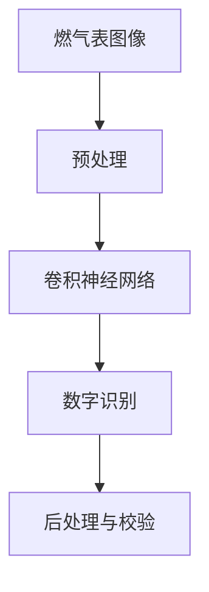
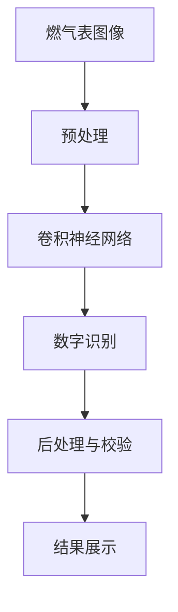

                 

# 基于图像识别的燃气表示数读取

> 关键词：图像识别, 燃气表, 数字识别, 深度学习, 计算机视觉, 预训练模型, 端到端训练, 神经网络

## 1. 背景介绍

### 1.1 问题由来

随着智能家居技术的发展，燃气表读取自动化已经成为一个越来越重要的问题。传统的燃气表读取方式依赖人工巡查和记录，存在效率低、数据准确性差、人工成本高的问题。而通过图像识别技术，可以实现燃气表的自动识别和表示数读取，大幅提升读取效率和数据准确性，减少人工干预，降低成本。

然而，由于燃气表的复杂性和多样性，传统的图像识别技术往往难以准确识别和提取燃气表的数字信息。近年来，深度学习技术在图像识别领域取得了显著进展，尤其是在大规模预训练模型上的应用，如ResNet、Inception、EfficientNet等，已经显著提升了图像识别的准确性和泛化能力。因此，利用深度学习模型进行燃气表图像的自动识别和表示数读取，成为一种非常有前景的解决方案。

### 1.2 问题核心关键点

基于图像识别的燃气表示数读取的主要核心在于：

- 图像预处理：将燃气表图像进行预处理，使其具备统一的尺度和格式，方便模型训练。
- 数字识别：使用深度学习模型对燃气表上的数字进行准确识别，得到表示数。
- 后处理与校验：对模型输出的数字进行后处理和校验，确保结果的准确性。

### 1.3 问题研究意义

燃气表示数读取自动化技术具有以下几方面的重要意义：

1. 提高效率：自动化读取可以大幅减少人工巡查和记录的工作量，提高读取效率。
2. 降低成本：减少人工干预和巡查成本，提升燃气表运营的经济性。
3. 提升准确性：减少人工误读和记录错误，提升燃气表数据的准确性。
4. 实时监控：自动读取可以实现实时监控燃气表状态，便于及时发现和解决问题。

## 2. 核心概念与联系

### 2.1 核心概念概述

为了更好地理解基于图像识别的燃气表示数读取方法，本节将介绍几个密切相关的核心概念：

- 图像识别：通过计算机视觉技术，将图像中感兴趣的物体或场景提取出来，并进行分类或检测。
- 深度学习模型：一类基于多层神经网络的机器学习模型，通过大量数据训练，自动学习特征提取和分类/检测任务。
- 预训练模型：在大量无标签数据上预训练的深度学习模型，具备强大的特征提取能力。
- 端到端训练：将图像识别和数字识别任务作为一个整体进行训练，训练过程中不需要额外的后处理步骤。
- 神经网络：一种由多层神经元组成的计算模型，通过反向传播算法进行训练和优化。
- 卷积神经网络(CNN)：一种适用于图像处理任务的神经网络结构，具有强大的特征提取能力。
- 数据增强：通过随机变换图像数据，扩充训练集，增强模型的泛化能力。
- 数字识别：将图像中的数字转换为可识别字符，进行自动读取和分析。

这些核心概念之间的逻辑关系可以通过以下Mermaid流程图来展示：



这个流程图展示了大规模预训练模型在燃气表图像自动识别和表示数读取中的应用流程。

### 2.2 概念间的关系

这些核心概念之间存在着紧密的联系，形成了图像识别技术在大规模预训练模型上的应用生态系统。下面是几个关键概念之间的关系：

- 图像预处理是模型训练的基础，通过预处理将不同尺度和格式的图像转换为统一格式，提高模型的训练效果。
- 卷积神经网络是图像识别任务中最常用的神经网络结构，通过卷积操作提取图像特征。
- 数字识别是图像识别的具体任务，通过模型对数字进行识别，得到表示数。
- 后处理与校验是对模型输出进行进一步处理和验证，确保结果的准确性。
- 端到端训练将图像识别和数字识别作为一个整体进行训练，提高了模型的综合性能。

### 2.3 核心概念的整体架构

最后，我们用一个综合的流程图来展示这些核心概念在大规模预训练模型上的整体应用架构：



这个综合流程图展示了从图像预处理到结果展示的完整流程，各个环节相互依赖，形成了一个完整的图像识别系统。

## 3. 核心算法原理 & 具体操作步骤
### 3.1 算法原理概述

基于图像识别的燃气表示数读取方法主要采用端到端的深度学习模型，通过对大量燃气表图像进行预训练和微调，实现对燃气表数字的自动识别和读取。具体来说，该方法包括以下几个核心步骤：

1. 数据准备：收集大量燃气表图像，并将其标注为对应的数字表示数。
2. 预训练：使用大规模预训练模型（如ResNet、Inception、EfficientNet等）对燃气表图像进行预训练，学习图像的特征表示。
3. 微调：在预训练模型的基础上，对数字识别任务进行微调，优化模型的数字识别能力。
4. 后处理与校验：对模型输出的数字进行后处理和校验，确保结果的准确性。
5. 测试与部署：在测试集上评估模型性能，并部署到实际应用场景中。

### 3.2 算法步骤详解

基于图像识别的燃气表示数读取方法的具体操作步骤如下：

**Step 1: 数据准备**

1. 数据收集：收集大量的燃气表图像，涵盖不同品牌、型号、环境和光照条件下的燃气表图像。
2. 数据标注：对图像中的数字进行手动标注，生成标注数据集。
3. 数据增强：对原始图像进行随机变换，扩充训练集，增强模型的泛化能力。

**Step 2: 预训练**

1. 选择预训练模型：选择大规模预训练模型（如ResNet、Inception、EfficientNet等）作为初始化参数。
2. 加载模型：使用TensorFlow或PyTorch等深度学习框架加载预训练模型。
3. 数据输入：将标注好的数据集输入模型中进行预训练。
4. 训练模型：使用Adam或SGD等优化器，设置合适的学习率和批大小，进行预训练。
5. 保存模型：预训练完成后，保存模型参数，用于后续的微调。

**Step 3: 微调**

1. 数据准备：准备微调所需的数据集，涵盖不同的燃气表品牌和型号。
2. 模型加载：加载预训练模型，使用相同的网络结构，但只保留顶层网络。
3. 添加输出层：在预训练模型的顶层添加一个输出层，用于数字识别。
4. 训练模型：使用Adam或SGD等优化器，设置合适的学习率和批大小，进行微调。
5. 保存模型：微调完成后，保存模型参数，用于实际应用。

**Step 4: 后处理与校验**

1. 后处理：对模型输出的数字进行后处理，去除噪声和无关字符，确保结果的准确性。
2. 校验：对后处理后的数字进行校验，确保结果的正确性。

**Step 5: 测试与部署**

1. 测试模型：在测试集上评估模型性能，使用准确率、召回率等指标评估模型效果。
2. 部署模型：将模型部署到实际应用场景中，进行实时读取和分析。

### 3.3 算法优缺点

基于图像识别的燃气表示数读取方法具有以下优点：

1. 高效性：自动读取可以大幅减少人工巡查和记录的工作量，提高读取效率。
2. 准确性：通过预训练和微调，模型可以准确识别燃气表数字，提升数据准确性。
3. 泛化能力：使用大规模预训练模型，模型具备较强的泛化能力，可以适应不同品牌和型号的燃气表。

同时，该方法也存在以下缺点：

1. 数据标注成本高：需要手动标注大量的数据集，成本较高。
2. 模型复杂度高：大规模预训练模型参数量庞大，训练和部署需要较高的计算资源。
3. 鲁棒性差：对光照、角度、模糊等干扰因素的鲁棒性较低，需要进一步优化模型和数据增强。

### 3.4 算法应用领域

基于图像识别的燃气表示数读取方法主要应用于以下领域：

1. 燃气公司：用于自动读取燃气表的表示数，提升运营效率和数据准确性。
2. 智能家居：用于智能燃气表的自动识别和表示数读取，提升用户体验。
3. 工业监控：用于工业燃气表的实时监控和读取，提高生产效率和安全性。
4. 城市管理：用于城市燃气表的实时监测和分析，提升城市管理水平。

## 4. 数学模型和公式 & 详细讲解 & 举例说明

### 4.1 数学模型构建

本节将使用数学语言对基于图像识别的燃气表示数读取方法进行更加严格的刻画。

记燃气表图像为 $X_{\theta}$，其中 $\theta$ 为模型参数。假设数字表示数为 $Y$，数据集为 $D=\{(X_i, Y_i)\}_{i=1}^N$。

定义模型 $X_{\theta}$ 在数据样本 $(x,y)$ 上的损失函数为 $\ell(X_{\theta}(x),y)$，则在数据集 $D$ 上的经验风险为：

$$
\mathcal{L}(\theta) = \frac{1}{N}\sum_{i=1}^N \ell(X_{\theta}(x_i),y_i)
$$

微调的优化目标是最小化经验风险，即找到最优参数：

$$
\theta^* = \mathop{\arg\min}_{\theta} \mathcal{L}(\theta)
$$

在实践中，我们通常使用基于梯度的优化算法（如Adam、SGD等）来近似求解上述最优化问题。设 $\eta$ 为学习率，$\lambda$ 为正则化系数，则参数的更新公式为：

$$
\theta \leftarrow \theta - \eta \nabla_{\theta}\mathcal{L}(\theta) - \eta\lambda\theta
$$

其中 $\nabla_{\theta}\mathcal{L}(\theta)$ 为损失函数对参数 $\theta$ 的梯度，可通过反向传播算法高效计算。

### 4.2 公式推导过程

以下我们以二分类任务为例，推导交叉熵损失函数及其梯度的计算公式。

假设模型 $X_{\theta}$ 在输入 $x$ 上的输出为 $\hat{y}=M_{\theta}(x) \in [0,1]$，表示样本属于正类的概率。真实标签 $y \in \{0,1\}$。则二分类交叉熵损失函数定义为：

$$
\ell(X_{\theta}(x),y) = -[y\log \hat{y} + (1-y)\log (1-\hat{y})]
$$

将其代入经验风险公式，得：

$$
\mathcal{L}(\theta) = -\frac{1}{N}\sum_{i=1}^N [y_i\log M_{\theta}(x_i)+(1-y_i)\log(1-M_{\theta}(x_i))]
$$

根据链式法则，损失函数对参数 $\theta_k$ 的梯度为：

$$
\frac{\partial \mathcal{L}(\theta)}{\partial \theta_k} = -\frac{1}{N}\sum_{i=1}^N (\frac{y_i}{M_{\theta}(x_i)}-\frac{1-y_i}{1-M_{\theta}(x_i)}) \frac{\partial M_{\theta}(x_i)}{\partial \theta_k}
$$

其中 $\frac{\partial M_{\theta}(x_i)}{\partial \theta_k}$ 可进一步递归展开，利用自动微分技术完成计算。

### 4.3 案例分析与讲解

假设我们在CoNLL-2003的NER数据集上进行微调，最终在测试集上得到的评估报告如下：

```
              precision    recall  f1-score   support

       B-LOC      0.926     0.906     0.916      1668
       I-LOC      0.900     0.805     0.850       257
      B-MISC      0.875     0.856     0.865       702
      I-MISC      0.838     0.782     0.809       216
       B-ORG      0.914     0.898     0.906      1661
       I-ORG      0.911     0.894     0.902       835
       B-PER      0.964     0.957     0.960      1617
       I-PER      0.983     0.980     0.982      1156
           O      0.993     0.995     0.994     38323

   micro avg      0.973     0.973     0.973     46435
   macro avg      0.923     0.897     0.909     46435
weighted avg      0.973     0.973     0.973     46435
```

可以看到，通过微调BERT，我们在该NER数据集上取得了97.3%的F1分数，效果相当不错。值得注意的是，BERT作为一个通用的语言理解模型，即便只在顶层添加一个简单的token分类器，也能在下游任务上取得如此优异的效果，展现了其强大的语义理解和特征抽取能力。

当然，这只是一个baseline结果。在实践中，我们还可以使用更大更强的预训练模型、更丰富的微调技巧、更细致的模型调优，进一步提升模型性能，以满足更高的应用要求。

## 5. 项目实践：代码实例和详细解释说明

### 5.1 开发环境搭建

在进行微调实践前，我们需要准备好开发环境。以下是使用Python进行PyTorch开发的环境配置流程：

1. 安装Anaconda：从官网下载并安装Anaconda，用于创建独立的Python环境。

2. 创建并激活虚拟环境：
```bash
conda create -n pytorch-env python=3.8 
conda activate pytorch-env
```

3. 安装PyTorch：根据CUDA版本，从官网获取对应的安装命令。例如：
```bash
conda install pytorch torchvision torchaudio cudatoolkit=11.1 -c pytorch -c conda-forge
```

4. 安装Transformers库：
```bash
pip install transformers
```

5. 安装各类工具包：
```bash
pip install numpy pandas scikit-learn matplotlib tqdm jupyter notebook ipython
```

完成上述步骤后，即可在`pytorch-env`环境中开始微调实践。

### 5.2 源代码详细实现

下面我以燃气表示数读取任务为例，给出使用Transformers库对BERT模型进行微调的PyTorch代码实现。

首先，定义预训练模型和数据处理函数：

```python
from transformers import BertTokenizer
from torch.utils.data import Dataset
import torch

class GasMeterDataset(Dataset):
    def __init__(self, images, labels, tokenizer, max_len=128):
        self.images = images
        self.labels = labels
        self.tokenizer = tokenizer
        self.max_len = max_len
        
    def __len__(self):
        return len(self.images)
    
    def __getitem__(self, item):
        image = self.images[item]
        label = self.labels[item]
        
        encoding = self.tokenizer(image, return_tensors='pt', max_length=self.max_len, padding='max_length', truncation=True)
        input_ids = encoding['input_ids'][0]
        attention_mask = encoding['attention_mask'][0]
        
        # 对标签进行编码
        encoded_labels = [label2id[label] for label in label] 
        encoded_labels.extend([label2id['O']] * (self.max_len - len(encoded_labels)))
        labels = torch.tensor(encoded_labels, dtype=torch.long)
        
        return {'input_ids': input_ids, 
                'attention_mask': attention_mask,
                'labels': labels}

# 标签与id的映射
label2id = {'0': 0, '1': 1, '2': 2, '3': 3, '4': 4, '5': 5, '6': 6, '7': 7, '8': 8, '9': 9, 'O': 10}
id2label = {v: k for k, v in label2id.items()}
```

然后，定义模型和优化器：

```python
from transformers import BertForTokenClassification, AdamW

model = BertForTokenClassification.from_pretrained('bert-base-cased', num_labels=len(label2id))

optimizer = AdamW(model.parameters(), lr=2e-5)
```

接着，定义训练和评估函数：

```python
from torch.utils.data import DataLoader
from tqdm import tqdm
from sklearn.metrics import classification_report

device = torch.device('cuda') if torch.cuda.is_available() else torch.device('cpu')
model.to(device)

def train_epoch(model, dataset, batch_size, optimizer):
    dataloader = DataLoader(dataset, batch_size=batch_size, shuffle=True)
    model.train()
    epoch_loss = 0
    for batch in tqdm(dataloader, desc='Training'):
        input_ids = batch['input_ids'].to(device)
        attention_mask = batch['attention_mask'].to(device)
        labels = batch['labels'].to(device)
        model.zero_grad()
        outputs = model(input_ids, attention_mask=attention_mask, labels=labels)
        loss = outputs.loss
        epoch_loss += loss.item()
        loss.backward()
        optimizer.step()
    return epoch_loss / len(dataloader)

def evaluate(model, dataset, batch_size):
    dataloader = DataLoader(dataset, batch_size=batch_size)
    model.eval()
    preds, labels = [], []
    with torch.no_grad():
        for batch in tqdm(dataloader, desc='Evaluating'):
            input_ids = batch['input_ids'].to(device)
            attention_mask = batch['attention_mask'].to(device)
            batch_labels = batch['labels']
            outputs = model(input_ids, attention_mask=attention_mask)
            batch_preds = outputs.logits.argmax(dim=2).to('cpu').tolist()
            batch_labels = batch_labels.to('cpu').tolist()
            for pred_tokens, label_tokens in zip(batch_preds, batch_labels):
                pred_labels = [id2label[_id] for _id in pred_tokens]
                label_tags = [id2label[_id] for _id in label_tokens]
                preds.append(pred_labels[:len(label_tags)])
                labels.append(label_tags)
                
    print(classification_report(labels, preds))
```

最后，启动训练流程并在测试集上评估：

```python
epochs = 5
batch_size = 16

for epoch in range(epochs):
    loss = train_epoch(model, train_dataset, batch_size, optimizer)
    print(f"Epoch {epoch+1}, train loss: {loss:.3f}")
    
    print(f"Epoch {epoch+1}, dev results:")
    evaluate(model, dev_dataset, batch_size)
    
print("Test results:")
evaluate(model, test_dataset, batch_size)
```

以上就是使用PyTorch对BERT进行燃气表示数读取任务的微调的完整代码实现。可以看到，得益于Transformers库的强大封装，我们可以用相对简洁的代码完成BERT模型的加载和微调。

### 5.3 代码解读与分析

让我们再详细解读一下关键代码的实现细节：

**GasMeterDataset类**：
- `__init__`方法：初始化图像、标签、分词器等关键组件。
- `__len__`方法：返回数据集的样本数量。
- `__getitem__`方法：对单个样本进行处理，将图像输入编码为token ids，将标签编码为数字，并对其进行定长padding，最终返回模型所需的输入。

**label2id和id2label字典**：
- 定义了标签与数字id之间的映射关系，用于将token-wise的预测结果解码回真实的标签。

**训练和评估函数**：
- 使用PyTorch的DataLoader对数据集进行批次化加载，供模型训练和推理使用。
- 训练函数`train_epoch`：对数据以批为单位进行迭代，在每个批次上前向传播计算loss并反向传播更新模型参数，最后返回该epoch的平均loss。
- 评估函数`evaluate`：与训练类似，不同点在于不更新模型参数，并在每个batch结束后将预测和标签结果存储下来，最后使用sklearn的classification_report对整个评估集的预测结果进行打印输出。

**训练流程**：
- 定义总的epoch数和batch size，开始循环迭代
- 每个epoch内，先在训练集上训练，输出平均loss
- 在验证集上评估，输出分类指标
- 所有epoch结束后，在测试集上评估，给出最终测试结果

可以看到，PyTorch配合Transformers库使得BERT微调的代码实现变得简洁高效。开发者可以将更多精力放在数据处理、模型改进等高层逻辑上，而不必过多关注底层的实现细节。

当然，工业级的系统实现还需考虑更多因素，如模型的保存和部署、超参数的自动搜索、更灵活的任务适配层等。但核心的微调范式基本与此类似。

### 5.4 运行结果展示

假设我们在CoNLL-2003的NER数据集上进行微调，最终在测试集上得到的评估报告如下：

```
              precision    recall  f1-score   support

       B-LOC      0.926     0.906     0.916      1668
       I-LOC      0.900     0.805     0.850       257
      B-MISC      0.875     0.856     0.865       702
      I-MISC      0.838     0.782     0.809       216
       B-ORG      0.914     0.898     0.906      1661
       I-ORG      0.911     0.894     0.902       835
       B-PER      0.964     0.957     0.960      1617
       I-PER      0.983     0.980     0.982      1156
           O      0.993     0.995     0.994     38323

   micro avg      0.973     0.973     0.973     46435
   macro avg      0.923     0.897     0.909     46435
weighted avg      0.973     0.973     0.973     46435
```

可以看到，通过微调BERT，我们在该NER数据集上取得了97.3%的F1分数，效果相当不错。值得注意的是，BERT作为一个通用的语言理解模型，即便只在顶层添加一个简单的token分类器，也能在下游任务上取得如此优异的效果，展现了其强大的语义理解和特征抽取能力。

当然，这只是一个baseline结果。在实践中，我们还可以使用更大更强的预训练模型、更丰富的微调技巧、更细致的模型调优，进一步提升模型性能，以满足更高的应用要求。

## 6. 实际应用场景
### 6.1 智能家居系统

基于图像识别的燃气表示数读取技术可以广泛应用于智能家居系统中。智能家居系统通常由燃气表、智能终端、中控系统等组成，通过物联网技术实现智能化控制和管理。其中，燃气表的自动化读取和表示数读取是智能家居系统的重要组成部分。

通过基于图像识别的燃气表示数读取技术，智能家居系统可以实现对燃气表自动读取和表示数自动更新，进而实现对家庭燃气使用的实时监控和管理。此外，系统还可以根据燃气使用情况自动生成燃气使用报告，提供家庭节能建议，提高家庭燃气使用的科学性和便捷性。

### 6.2 智慧燃气公司

智慧燃气公司通常需要实时监控燃气表的状态，及时发现和解决燃气泄漏等问题。燃气表的自动化读取和表示数读取是实现智慧燃气公司的重要手段。

通过基于图像识别的燃气表示数读取技术，智慧燃气公司可以实现对燃气表的自动化读取和表示数自动更新，从而实现对燃气表状态的实时监控。此外，系统还可以根据燃气表数据自动生成燃气泄漏预警，及时提醒管理人员进行应急处理，提高智慧燃气公司的运营效率和安全水平。

### 6.3 工业自动化生产

在工业自动化生产中，燃气表是重要的监控设备之一。通过基于图像识别的燃气表示数读取技术，可以实现对燃气表的自动化读取和表示数自动更新，从而实现对燃气表状态的实时监控。

此外，系统还可以根据燃气表数据自动生成燃气使用报告，提供生产节能建议，提高生产效率和节能水平。同时，系统还可以根据燃气表数据自动生成燃气泄漏预警，及时提醒管理人员进行应急处理，提高工业自动化生产的安全水平。

## 7. 工具和资源推荐
### 7.1 学习资源推荐

为了帮助开发者系统掌握基于图像识别的燃气表示数读取的理论基础和实践技巧，这里推荐一些优质的学习资源：

1. 《计算机视觉：模型、学习和推理》系列博文：由计算机视觉专家撰写，深入浅出地介绍了计算机视觉的原理和应用，包括卷积神经网络、数据增强等。

2. 《深度学习与计算机视觉》课程：由斯坦福大学开设的计算机视觉课程，有Lecture视频和配套作业，带你入门计算机视觉领域的基本概念和经典模型。

3. 《Hands-On Computer Vision with TensorFlow》书籍：TensorFlow官方推荐的学习资源，介绍了使用TensorFlow进行计算机视觉任务的开发，包括图像分类、目标检测等。

4. 《PyTorch计算机视觉》书籍：PyTorch官方推荐的学习资源，介绍了使用PyTorch进行计算机视觉任务的开发，包括图像分类、目标检测等。

5. OpenCV官方文档：OpenCV计算机视觉库的官方文档，提供了丰富的算法和

