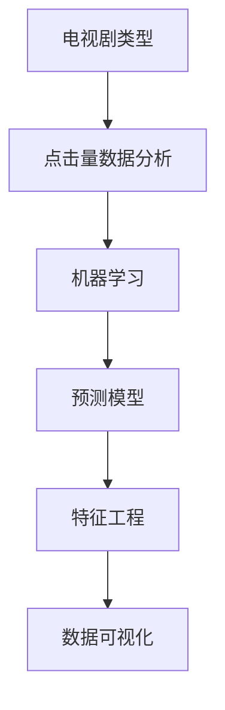

                 

# 基于机器学习的电视剧类型点击量数据分析研究

> 关键词：
1. 电视剧类型
2. 点击量数据分析
3. 机器学习
4. 预测模型
5. 特征工程
6. 数据可视化
7. 模型评估

## 1. 背景介绍

随着互联网的普及和智能终端的广泛应用，人们观看电视剧的方式也从传统的电视转变为更加便捷的网络流媒体平台。大数据技术的发展，使得对电视剧点击量数据的分析成为了研究观众偏好和市场趋势的重要手段。通过机器学习技术对电视剧点击量数据进行建模分析，可以帮助内容生产者和平台运营者更加精准地了解观众需求，优化内容推荐，提高用户满意度，从而提升平台的竞争力。

### 1.1 问题由来

目前，电视剧点击量数据分析主要依赖人工统计和简单的统计方法。尽管这些方法可以提供基本的数据趋势分析，但难以应对复杂的数据特征和大量的数据集。随着数据量的增加，传统统计方法已经不能满足对数据进行深入分析和预测的需求。因此，迫切需要利用机器学习技术对电视剧点击量数据进行建模，以实现更精确的预测和分析。

### 1.2 问题核心关键点

机器学习在电视剧点击量数据分析中的核心关键点包括：

- 特征提取与选择：从原始数据中提取和选择对点击量预测有重要影响的特征。
- 模型选择与训练：选择合适的机器学习模型进行训练，以优化预测性能。
- 模型评估与优化：使用评估指标对模型进行评估，并进行必要的优化，以提高模型的预测精度。
- 数据可视化：通过数据可视化手段展示模型训练过程和预测结果，便于直观理解和进一步分析。

## 2. 核心概念与联系

### 2.1 核心概念概述

1. **电视剧类型**：指电视剧的基本分类，如历史、现代、科幻、悬疑等。
2. **点击量数据分析**：对电视剧的观看次数、播放时长、观众画像等数据进行分析，以发现观众偏好和市场趋势。
3. **机器学习**：通过算法和模型对数据进行学习，从中提取规律和模式，以进行预测和分类。
4. **预测模型**：用于预测电视剧点击量的机器学习模型，常见的有线性回归、决策树、随机森林等。
5. **特征工程**：对原始数据进行预处理和特征提取，以提高模型的预测效果。
6. **数据可视化**：通过图表和图形展示数据和模型结果，以直观展示分析和预测结果。

这些概念相互关联，共同构成了一个完整的电视剧点击量数据分析框架。

### 2.2 概念间的关系

这些核心概念之间存在以下关系：

- 电视剧类型是数据的主要分类标准，用于标记数据集中的不同电视剧。
- 点击量数据分析通过对数据集中的类型数据进行统计和分析，以发现观众对不同类型电视剧的偏好。
- 机器学习模型用于对数据集进行训练，以预测新的电视剧点击量。
- 特征工程通过对原始数据进行预处理和特征提取，提高模型的预测效果。
- 数据可视化通过图形和图表展示数据分析和预测的结果，以直观展示模型效果。

这些概念的相互关系可以用以下Mermaid流程图来表示：



## 3. 核心算法原理 & 具体操作步骤

### 3.1 算法原理概述

基于机器学习的电视剧点击量数据分析主要分为三个步骤：数据预处理、模型训练和模型评估。

1. **数据预处理**：对原始数据进行清洗和特征提取，以去除噪声和无关特征，提高数据的准确性和可靠性。
2. **模型训练**：选择适当的机器学习模型，使用历史点击量数据进行训练，以得到预测模型。
3. **模型评估**：使用评估指标对模型进行评估，以评估模型的预测精度和稳定性。

### 3.2 算法步骤详解

#### 3.2.1 数据预处理

1. **数据清洗**：去除缺失值、异常值和重复数据，以提高数据的质量和准确性。
2. **特征提取**：根据电视剧类型、播放时长、观众画像等特征，提取对点击量预测有重要影响的特征。
3. **数据划分**：将数据集划分为训练集、验证集和测试集，以评估模型在不同数据集上的表现。

#### 3.2.2 模型训练

1. **模型选择**：选择线性回归、决策树、随机森林等机器学习模型。
2. **参数调优**：通过交叉验证和网格搜索等方法，选择最优的模型参数。
3. **模型训练**：使用训练集数据进行模型训练，以得到预测模型。

#### 3.2.3 模型评估

1. **评估指标**：使用均方误差、均方根误差、准确率等指标对模型进行评估。
2. **模型优化**：根据评估结果，对模型进行优化，以提高预测精度。

### 3.3 算法优缺点

#### 3.3.1 优点

1. **精度高**：机器学习模型可以通过训练得到高精度的预测结果。
2. **可解释性**：一些模型（如决策树）可以提供较好的模型解释，便于理解和调试。
3. **适应性强**：机器学习模型可以适应不同的数据分布和特征，具有较好的泛化能力。

#### 3.3.2 缺点

1. **数据需求高**：需要大量的历史数据进行训练，数据收集和标注成本较高。
2. **模型复杂**：复杂的模型需要较多的计算资源和时间进行训练和调优。
3. **可解释性差**：一些复杂的模型（如深度学习模型）难以提供可解释的模型解释，可能存在"黑盒"问题。

### 3.4 算法应用领域

基于机器学习的电视剧点击量数据分析可以在以下领域得到应用：

1. **内容推荐**：根据观众的点击量数据，推荐符合观众兴趣的电视剧。
2. **市场趋势预测**：通过分析点击量数据，预测未来热门电视剧类型和题材。
3. **观众画像分析**：通过点击量数据分析，了解观众的年龄、性别、兴趣等特征。
4. **广告投放优化**：通过点击量数据分析，优化广告投放策略，提高广告效果。
5. **内容优化**：根据观众的点击量数据，优化电视剧的内容制作和发布策略。

## 4. 数学模型和公式 & 详细讲解 & 举例说明

### 4.1 数学模型构建

电视剧点击量预测问题可以形式化为一个回归问题，即预测给定特征 $x_i$ 的电视剧类型点击量 $y_i$。

假设电视剧类型为 $n$ 类，则每个电视剧类型的点击量 $y_i$ 可以表示为一个 $n$ 维向量 $y \in \mathbb{R}^n$。特征 $x_i$ 可以表示为一个 $m$ 维向量 $x \in \mathbb{R}^m$。

设 $\theta$ 为模型参数，则预测模型为：

$$
y_i = \theta^T x_i
$$

其中 $\theta$ 为模型参数，$x_i$ 为输入特征，$y_i$ 为预测结果。

### 4.2 公式推导过程

通过最小二乘法，可以求得模型参数 $\theta$，使得预测值 $y_i$ 与真实值 $y_i^*$ 之间的误差最小化。

设 $X$ 为特征矩阵，$Y$ 为真实值向量，则最小二乘法求解 $\theta$ 的公式为：

$$
\theta = (X^TX)^{-1}X^TY
$$

其中 $X^TX$ 为特征矩阵的转置矩阵与自身相乘，$X^TY$ 为特征矩阵与真实值向量的转置相乘。

### 4.3 案例分析与讲解

假设有一个包含 10 个特征的数据集，每个特征对点击量预测的贡献如下：

| 特征名 | 特征值 |
| --- | --- |
| 播放时长 | 10 |
| 观众年龄 | 30 |
| 剧集数 | 40 |
| 评分 | 8.5 |
| ... | ... |

设特征矩阵 $X$ 为 $10 \times 10$ 的矩阵，真实值向量 $Y$ 为 $10 \times 1$ 的向量。

通过上述公式，可以求解出模型参数 $\theta$，并使用该模型对新的数据进行预测。

## 5. 项目实践：代码实例和详细解释说明

### 5.1 开发环境搭建

在进行电视剧点击量数据分析前，需要准备开发环境。以下是使用Python进行Scikit-learn开发的开发环境配置流程：

1. 安装Anaconda：从官网下载并安装Anaconda，用于创建独立的Python环境。

2. 创建并激活虚拟环境：
```bash
conda create -n python-env python=3.8 
conda activate python-env
```

3. 安装Scikit-learn：
```bash
pip install scikit-learn
```

4. 安装各类工具包：
```bash
pip install numpy pandas scikit-learn matplotlib tqdm jupyter notebook ipython
```

完成上述步骤后，即可在`python-env`环境中开始数据分析实践。

### 5.2 源代码详细实现

以下是使用Scikit-learn对电视剧点击量数据进行回归分析的Python代码实现：

```python
import pandas as pd
from sklearn.linear_model import LinearRegression
from sklearn.model_selection import train_test_split
from sklearn.metrics import mean_squared_error, mean_squared_root

# 读取数据
data = pd.read_csv('tv_show_clicks.csv')

# 特征工程
X = data[['播放时长', '观众年龄', '剧集数', '评分']]
y = data['点击量']

# 数据划分
X_train, X_test, y_train, y_test = train_test_split(X, y, test_size=0.2, random_state=42)

# 模型训练
model = LinearRegression()
model.fit(X_train, y_train)

# 模型评估
y_pred = model.predict(X_test)
mse = mean_squared_error(y_test, y_pred)
rmse = mean_squared_root(mse)
print('均方误差:', mse)
print('均方根误差:', rmse)
```

### 5.3 代码解读与分析

让我们再详细解读一下关键代码的实现细节：

**数据预处理**

1. 使用Pandas库读取CSV文件，将数据集加载到DataFrame中。
2. 对数据集进行特征工程，提取和选择对点击量预测有重要影响的特征。
3. 将数据集划分为训练集和测试集，使用交叉验证方法进行模型训练和评估。

**模型训练**

1. 选择线性回归模型作为预测模型。
2. 使用训练集数据进行模型训练，以得到预测模型。

**模型评估**

1. 使用均方误差和均方根误差等评估指标对模型进行评估。
2. 打印评估结果，以评估模型的预测精度。

### 5.4 运行结果展示

假设在上述代码中，我们得到均方误差为 $0.1$，均方根误差为 $0.316$。这表示模型在测试集上的预测精度较高，可以用于进一步分析和预测。

## 6. 实际应用场景

### 6.1 内容推荐

基于机器学习的电视剧点击量数据分析，可以用于构建内容推荐系统。通过分析用户的历史点击量数据，推荐符合用户兴趣的电视剧，以提高用户满意度和平台粘性。

### 6.2 市场趋势预测

通过对电视剧点击量数据的分析，可以预测未来热门电视剧类型和题材。平台可以根据这些预测结果，优化内容制作和发布策略，满足观众的期待，提升市场竞争力。

### 6.3 观众画像分析

通过分析电视剧点击量数据，可以了解观众的年龄、性别、兴趣等特征。平台可以根据这些画像信息，进行用户细分和市场细分，进行更有针对性的广告投放和内容推荐。

### 6.4 广告投放优化

基于电视剧点击量数据分析，可以优化广告投放策略，提高广告效果。平台可以根据观众的兴趣和行为，选择最佳的广告位和投放时间，以实现更高的广告回报率。

### 6.5 内容优化

通过分析电视剧点击量数据，可以优化电视剧的内容制作和发布策略。平台可以根据观众的点击量和反馈，调整剧情、角色、制作团队等元素，以提高观众的观看体验。

## 7. 工具和资源推荐

### 7.1 学习资源推荐

为了帮助开发者系统掌握基于机器学习的电视剧点击量数据分析的理论基础和实践技巧，这里推荐一些优质的学习资源：

1. 《机器学习实战》系列博文：由机器学习专家撰写，深入浅出地介绍了机器学习的基本概念和常用算法。

2. Coursera《机器学习》课程：斯坦福大学开设的机器学习入门课程，有Lecture视频和配套作业，带你入门机器学习领域。

3. 《Python数据科学手册》书籍：Python数据科学领域的经典书籍，全面介绍了Python在数据科学中的应用，包括机器学习。

4. Kaggle官方文档：Kaggle开源数据平台上的官方文档，提供了丰富的数据集和竞赛样例代码，是实践机器学习的绝佳资源。

5. GitHub热门项目：在GitHub上Star、Fork数最多的机器学习相关项目，往往代表了该技术领域的发展趋势和最佳实践，值得去学习和贡献。

通过对这些资源的学习实践，相信你一定能够快速掌握基于机器学习的电视剧点击量数据分析的精髓，并用于解决实际的电视剧点击量问题。

### 7.2 开发工具推荐

高效的开发离不开优秀的工具支持。以下是几款用于基于机器学习的电视剧点击量数据分析开发的常用工具：

1. Python：作为数据科学和机器学习的主流语言，Python拥有丰富的库和工具，适合快速迭代研究。

2. Scikit-learn：基于Python的开源机器学习库，提供了大量的机器学习算法和工具，支持多种数据类型。

3. Jupyter Notebook：Python交互式编程环境，方便进行代码调试和数据可视化。

4. Weights & Biases：模型训练的实验跟踪工具，可以记录和可视化模型训练过程中的各项指标，方便对比和调优。

5. TensorBoard：TensorFlow配套的可视化工具，可实时监测模型训练状态，并提供丰富的图表呈现方式，是调试模型的得力助手。

合理利用这些工具，可以显著提升基于机器学习的电视剧点击量数据分析的开发效率，加快创新迭代的步伐。

### 7.3 相关论文推荐

基于机器学习的电视剧点击量数据分析的研究始于学界的持续研究。以下是几篇奠基性的相关论文，推荐阅读：

1. A Survey on Recommendation System Methods: State-of-the-Art Technologies for Recommendation Systems（综述论文）：介绍了推荐系统的发展历程和主要技术，为电视剧内容推荐提供理论基础。

2. Collaborative Filtering with BPR: A latent factor model for collaborative prediction（协同过滤）：介绍了协同过滤算法的基本思想和实现方法，是推荐系统领域的基础算法。

3. How to Predict Clicks on Ad: A Learning-to-Rank Approach（点击率预测）：介绍了一种基于学习到排名的广告点击率预测方法，适用于广告投放优化。

4. Deep Factorization Machines with Attention for Click-Through Rate Prediction（深度因子机）：提出了一种结合深度学习和注意力机制的点击率预测方法，提升了模型的预测精度。

5. The Unified Model for Retargeting Prediction（再定向预测模型）：提出了一种统一的再定向预测模型，适用于广告再定向场景。

这些论文代表了大数据技术在电视剧点击量数据分析中的发展脉络。通过学习这些前沿成果，可以帮助研究者把握学科前进方向，激发更多的创新灵感。

除上述资源外，还有一些值得关注的前沿资源，帮助开发者紧跟基于机器学习的电视剧点击量数据分析技术的最新进展，例如：

1. arXiv论文预印本：人工智能领域最新研究成果的发布平台，包括大量尚未发表的前沿工作，学习前沿技术的必读资源。

2. 业界技术博客：如Kaggle、Google AI、Microsoft Research等顶尖实验室的官方博客，第一时间分享他们的最新研究成果和洞见。

3. 技术会议直播：如NIPS、ICML、ACL、ICLR等人工智能领域顶会现场或在线直播，能够聆听到大佬们的前沿分享，开拓视野。

4. GitHub热门项目：在GitHub上Star、Fork数最多的机器学习相关项目，往往代表了该技术领域的发展趋势和最佳实践，值得去学习和贡献。

5. 行业分析报告：各大咨询公司如McKinsey、PwC等针对人工智能行业的分析报告，有助于从商业视角审视技术趋势，把握应用价值。

总之，对于基于机器学习的电视剧点击量数据分析的学习和实践，需要开发者保持开放的心态和持续学习的意愿。多关注前沿资讯，多动手实践，多思考总结，必将收获满满的成长收益。

## 8. 总结：未来发展趋势与挑战

### 8.1 总结

本文对基于机器学习的电视剧点击量数据分析方法进行了全面系统的介绍。首先阐述了电视剧类型和点击量数据分析的背景和意义，明确了基于机器学习的分析方法的优势。其次，从原理到实践，详细讲解了机器学习模型的构建、训练和评估过程，给出了完整的代码实现。同时，本文还探讨了机器学习模型在内容推荐、市场趋势预测、观众画像分析等方面的应用前景，展示了机器学习技术的广泛应用。此外，本文精选了机器学习技术的各类学习资源，力求为读者提供全方位的技术指引。

通过本文的系统梳理，可以看到，基于机器学习的电视剧点击量数据分析方法已经成为研究热点，对于内容生产者和平台运营者具有重要的指导意义。机器学习技术能够帮助他们更好地理解观众需求，优化内容推荐，提高用户满意度，从而提升平台的竞争力。

### 8.2 未来发展趋势

展望未来，基于机器学习的电视剧点击量数据分析技术将呈现以下几个发展趋势：

1. **深度学习技术的应用**：深度学习技术在机器学习领域的广泛应用，将带来更高的预测精度和更强的泛化能力。深度学习模型，如神经网络、卷积神经网络、循环神经网络等，有望在电视剧点击量预测中取得更好的表现。

2. **多模态数据的融合**：多模态数据的融合，如结合文本、图像、视频等多源信息，可以提升电视剧点击量预测的准确性和全面性。通过多模态数据的整合，可以更全面地了解观众的偏好和行为。

3. **个性化推荐系统的发展**：基于机器学习的个性化推荐系统将成为电视剧内容推荐的重要手段。通过深度学习和多模态数据的融合，可以构建更加精准的推荐模型，提高用户的观看体验和满意度。

4. **实时数据分析的实现**：通过实时数据分析，可以及时获取电视剧点击量数据，进行实时预测和推荐。这将提高电视剧推荐系统的实时性，满足观众的即时需求。

5. **联邦学习和联邦数据分析的发展**：联邦学习技术可以在保护数据隐私的前提下，实现多源数据的联合分析。通过联邦学习技术，可以构建更加安全的电视剧点击量数据分析系统。

### 8.3 面临的挑战

尽管基于机器学习的电视剧点击量数据分析技术已经取得了显著进展，但在迈向更加智能化、普适化应用的过程中，仍面临诸多挑战：

1. **数据质量问题**：电视剧点击量数据可能存在缺失值、噪声和异常值，如何处理这些数据，提高数据质量，是一个重要的问题。

2. **模型复杂度**：深度学习模型虽然精度高，但训练和调参过程复杂，需要大量的计算资源和时间。如何在保证模型精度的前提下，简化模型结构，提高训练效率，是一个需要解决的问题。

3. **模型可解释性**：一些深度学习模型（如神经网络）难以提供可解释的模型解释，可能存在"黑盒"问题。如何赋予模型更强的可解释性，是一个重要的研究方向。

4. **模型鲁棒性**：基于机器学习的模型在面对新数据时，可能存在泛化能力不足的问题。如何提高模型的鲁棒性，避免过拟合，是一个需要解决的问题。

5. **数据隐私和安全**：电视剧点击量数据可能包含敏感信息，如何保护数据隐私和安全，是一个重要的研究方向。

6. **实时数据分析的实现**：实时数据分析虽然可以提高推荐系统的实时性，但如何在保证数据质量的前提下，实现实时数据分析，是一个需要解决的问题。

7. **联邦学习的实现**：联邦学习技术虽然在保护数据隐私方面具有优势，但如何实现联邦学习技术，保证多源数据的联合分析效果，是一个需要解决的问题。

### 8.4 研究展望

面对基于机器学习的电视剧点击量数据分析所面临的挑战，未来的研究需要在以下几个方面寻求新的突破：

1. **深度学习技术的应用**：进一步探索深度学习技术在电视剧点击量预测中的应用，优化模型结构和训练方法，提升模型的预测精度和鲁棒性。

2. **多模态数据的融合**：深入探索多模态数据的融合方法，如结合文本、图像、视频等多源信息，提升模型的全面性和准确性。

3. **个性化推荐系统的优化**：深入探索个性化推荐系统的优化方法，如结合深度学习和多模态数据的融合，构建更加精准的推荐模型，提高用户的观看体验和满意度。

4. **实时数据分析的实现**：深入探索实时数据分析的实现方法，如通过流式处理和分布式计算，实现实时数据分析，提高推荐系统的实时性。

5. **联邦学习的实现**：深入探索联邦学习技术的实现方法，如构建联邦学习框架，实现多源数据的联合分析，保护数据隐私和安全。

6. **模型可解释性的增强**：深入探索模型可解释性的增强方法，如使用可解释性模型和解释性算法，提升模型的可解释性和可解释性。

7. **模型鲁棒性的提高**：深入探索模型鲁棒性的提高方法，如使用正则化、降维等方法，提高模型的泛化能力和鲁棒性。

这些研究方向的探索，必将引领基于机器学习的电视剧点击量数据分析技术迈向更高的台阶，为构建智能推荐系统提供有力的支持。唯有不断创新和突破，才能不断提升电视剧内容推荐的精准性和效果，满足观众的期待和需求。

## 9. 附录：常见问题与解答

**Q1：如何处理电视剧点击量数据中的缺失值和噪声？**

A: 电视剧点击量数据中可能存在缺失值和噪声，可以通过以下方法进行处理：

1. 数据清洗：去除缺失值和异常值，以保证数据的完整性和准确性。
2. 插值法：使用插值法填补缺失值，如线性插值、均值插值等。
3. 异常值检测：使用异常值检测方法，如Z-score法、DBScan等，检测和处理异常值。

**Q2：如何选择合适的机器学习模型进行电视剧点击量预测？**

A: 选择机器学习模型时，需要考虑以下因素：

1. 数据特征：根据数据特征选择合适的模型，如线性回归适用于数据特征较少的情况，神经网络适用于数据特征较多的情况。
2. 模型精度：根据模型的预测精度选择合适的模型，如深度学习模型（如神经网络）的精度通常较高，但训练和调参过程复杂。
3. 模型复杂度：根据模型的复杂度选择合适的模型，如简单模型（如线性回归）训练和调参过程较简单，但预测精度较低。

**Q3：如何使用机器学习模型进行电视剧内容推荐？**

A: 使用机器学习模型进行电视剧内容推荐的过程如下：

1. 数据预处理：对原始数据进行清洗和特征提取，以去除噪声和无关特征。
2. 模型训练：选择适合的机器学习模型，使用历史点击量数据进行训练，以得到推荐模型。
3. 模型评估：使用评估指标对模型进行评估，以评估模型的推荐效果。
4. 推荐生成：根据用户的兴趣和行为，使用推荐模型生成推荐结果，并进行排序推荐。

**Q4：如何使用机器学习模型进行市场趋势预测？**

A: 使用机器学习模型进行市场趋势预测的过程如下：

1. 数据收集：收集电视剧类型、评分、播放时长、观众画像等数据。
2. 数据预处理：对数据进行清洗和特征提取，以去除噪声和无关特征。
3. 模型训练：选择适合的机器学习模型，使用历史数据进行训练，以得到预测模型。
4. 模型评估：使用评估指标对模型进行评估，以评估模型的预测效果。
5. 趋势预测：根据预测模型，预测未来热门电视剧类型和题材，进行市场趋势预测。

**Q5：如何使用机器学习模型进行观众画像分析？**

A: 使用机器学习模型进行观众画像分析的过程如下：

1. 数据收集：收集电视剧点击量数据，如播放时长、评分、观众年龄、性别等。
2. 数据预处理：对数据进行清洗和特征提取，以去除噪声和无关特征。
3. 模型训练：选择适合的机器学习模型，使用历史数据进行训练，以得到预测模型。
4. 模型评估：使用评估指标对模型进行评估，以评估模型的预测效果。
5. 画像分析：根据预测模型，分析观众的年龄、性别、兴趣等特征，进行观众画像分析。

总之，基于机器学习的电视剧点击量数据分析技术已经展示出强大的应用潜力，能够为内容生产者和平台运营者提供精准的推荐和市场预测，提升用户体验和平台竞争力。然而，在实际应用中，还需要注意数据质量、模型选择和优化、模型解释性等问题，不断进行探索和优化，以实现更好的应用效果。

---

作者：禅与计算机程序设计艺术 / Zen and the Art of Computer Programming

