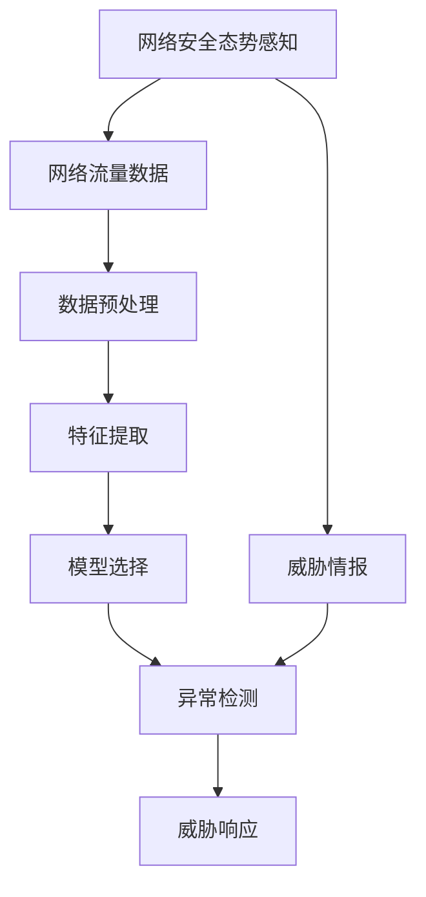
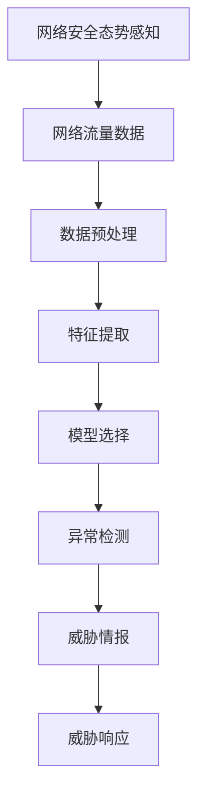

                 

# 基于机器学习的网络安全态势感知模型研究与实现

> 关键词：网络安全, 态势感知, 机器学习, 异常检测, 网络流量分析, 威胁情报, 深度学习

## 1. 背景介绍

随着信息技术的高速发展，网络安全事件频繁发生，网络攻击手段不断进化。面对越来越复杂和多样化的网络威胁，仅仅依靠传统的规则和签名检测技术已经难以满足现代网络安全的需要。网络安全态势感知模型，作为新兴的安全技术，通过对大规模网络流量数据的分析，能够提供更加全面和深入的安全威胁信息，帮助企业快速响应并减少网络安全风险。

### 1.1 问题由来
网络安全态势感知模型通过收集和分析网络流量数据，识别网络中的异常行为和潜在威胁，实时提供安全预警和威胁情报。该模型通过机器学习算法，尤其是深度学习，对海量数据进行高效的学习和分析，能够发现复杂的攻击模式和行为特征，为网络安全事件提供可靠的预测和响应。

在实际应用中，网络安全态势感知模型已经成为网络安全防护的重要手段，被广泛应用于企业和政府机构的网络安全防护体系中。然而，该模型的设计和实现涉及多领域知识，如网络安全原理、机器学习算法、数据处理技术等，需要深入理解和综合运用。

### 1.2 问题核心关键点
网络安全态势感知模型涉及以下几个核心关键点：
- 数据源：包括网络流量数据、日志数据、威胁情报等，是模型训练和分析的基础。
- 特征提取：从原始数据中提取有用的特征，作为模型训练的输入。
- 模型选择：选择合适的机器学习算法，如深度学习、随机森林等。
- 异常检测：通过模型训练得到的模型对网络流量数据进行异常检测和威胁预警。
- 威胁情报：结合外部威胁情报，增强模型的威胁识别能力。

这些关键点共同构成了网络安全态势感知模型的基础，需要在设计和实现过程中全面考虑。

### 1.3 问题研究意义
网络安全态势感知模型具有重要的现实意义，能够显著提高网络安全防护的效率和准确性，降低网络安全事件带来的损失。具体而言，它具有以下几个优点：

1. **实时性**：能够实时监测和分析网络流量，快速响应和处理安全威胁。
2. **全面性**：通过大规模数据的学习，能够发现多种类型的安全威胁。
3. **自适应性**：能够根据网络环境和威胁的变化，自动调整和优化模型，保持高性能。
4. **高精度**：深度学习等先进算法的应用，能够提高异常检测和威胁识别的准确率。
5. **扩展性**：能够处理大规模数据和复杂网络环境，具有良好的扩展性。

因此，研究网络安全态势感知模型的设计与实现，对于提升网络安全防护水平，具有重要的理论和实践价值。

## 2. 核心概念与联系

### 2.1 核心概念概述

网络安全态势感知模型基于机器学习技术，通过对网络流量数据和其他相关数据进行分析和处理，实现网络安全威胁的实时监测和预警。其中，核心概念包括：

- **网络安全态势感知**：通过实时监测和分析网络流量数据，识别网络中的异常行为和潜在威胁，提供安全预警和威胁情报。
- **机器学习**：一种通过算法自动学习和优化模型参数的方法，用于从大量数据中提取特征并进行分类、预测等任务。
- **异常检测**：通过模型训练，识别网络流量中的异常行为，并进行威胁预警。
- **威胁情报**：结合外部威胁情报，增强模型的威胁识别能力，提高安全防护效果。

这些核心概念之间相互关联，共同构成了网络安全态势感知模型的基础。

### 2.2 概念间的关系

网络安全态势感知模型的实现涉及多个核心概念的相互作用。以下是一个简化的Mermaid流程图，展示了这些概念之间的关系：



这个流程图展示了网络安全态势感知模型从数据源到威胁响应的完整流程：

1. **网络流量数据**：原始的网络流量数据，是模型训练和分析的基础。
2. **数据预处理**：对原始数据进行清洗、归一化等处理，减少噪声和冗余。
3. **特征提取**：从预处理后的数据中提取有用的特征，作为模型训练的输入。
4. **模型选择**：选择合适的机器学习算法，如深度学习、随机森林等。
5. **异常检测**：通过训练得到的模型对网络流量数据进行异常检测和威胁预警。
6. **威胁情报**：结合外部威胁情报，增强模型的威胁识别能力。
7. **威胁响应**：根据模型的预警结果，采取相应的安全措施，进行威胁响应。

这些步骤共同构成了网络安全态势感知模型的实现流程。

### 2.3 核心概念的整体架构

为了更全面地理解网络安全态势感知模型，我们还需要了解这些核心概念的整体架构。以下是一个更加详细的Mermaid流程图，展示了这些概念在整体架构中的关系：



这个流程图展示了网络安全态势感知模型的整体架构：

1. **网络流量数据**：原始的网络流量数据，是模型训练和分析的基础。
2. **数据预处理**：对原始数据进行清洗、归一化等处理，减少噪声和冗余。
3. **特征提取**：从预处理后的数据中提取有用的特征，作为模型训练的输入。
4. **模型选择**：选择合适的机器学习算法，如深度学习、随机森林等。
5. **异常检测**：通过训练得到的模型对网络流量数据进行异常检测和威胁预警。
6. **威胁情报**：结合外部威胁情报，增强模型的威胁识别能力。
7. **威胁响应**：根据模型的预警结果，采取相应的安全措施，进行威胁响应。

通过这个流程图，我们可以看到，网络安全态势感知模型是一个复杂的多层次系统，涉及数据处理、特征提取、模型训练和威胁响应等多个环节。

## 3. 核心算法原理 & 具体操作步骤

### 3.1 算法原理概述

网络安全态势感知模型通过机器学习算法，对网络流量数据进行分析和处理，识别网络中的异常行为和潜在威胁。其核心算法原理如下：

1. **数据预处理**：对原始网络流量数据进行清洗、归一化等处理，减少噪声和冗余。
2. **特征提取**：从预处理后的数据中提取有用的特征，作为模型训练的输入。
3. **模型选择**：选择合适的机器学习算法，如深度学习、随机森林等。
4. **异常检测**：通过训练得到的模型对网络流量数据进行异常检测和威胁预警。
5. **威胁情报**：结合外部威胁情报，增强模型的威胁识别能力。

其中，深度学习算法是网络安全态势感知模型的主要技术手段，尤其是卷积神经网络（CNN）和长短期记忆网络（LSTM）等算法。这些算法能够从海量数据中提取高维特征，捕捉复杂的模式和行为，提高异常检测的准确率。

### 3.2 算法步骤详解

网络安全态势感知模型的实现步骤可以分为以下几个阶段：

**Step 1: 数据预处理**

数据预处理是网络安全态势感知模型的第一步，主要包括以下操作：

1. **数据清洗**：去除无效数据、重复数据和噪声数据，确保数据质量。
2. **数据归一化**：将数据进行标准化处理，使数据在相同的量级范围内，提高模型训练的稳定性。
3. **特征提取**：从预处理后的数据中提取有用的特征，作为模型训练的输入。

具体实现过程可以使用Python中的pandas和numpy库进行数据清洗和归一化，使用scikit-learn库进行特征提取。

**Step 2: 特征工程**

特征工程是网络安全态势感知模型的关键步骤，主要包括以下操作：

1. **特征选择**：根据领域知识和先验经验，选择对异常检测有贡献的特征。
2. **特征构建**：通过组合和转换，构造新的特征，提高模型性能。

具体实现过程可以使用特征选择算法（如卡方检验、信息增益等）选择和构造特征，使用Python中的pandas和numpy库进行特征工程。

**Step 3: 模型训练**

模型训练是网络安全态势感知模型的核心步骤，主要包括以下操作：

1. **模型选择**：选择合适的机器学习算法，如深度学习、随机森林等。
2. **模型训练**：使用训练数据集训练模型，优化模型参数，提高模型性能。

具体实现过程可以使用深度学习框架（如TensorFlow、PyTorch等）进行模型训练，使用Python中的scikit-learn库进行模型选择和训练。

**Step 4: 异常检测**

异常检测是网络安全态势感知模型的关键步骤，主要包括以下操作：

1. **模型评估**：使用测试数据集评估模型的性能，计算准确率、召回率和F1分数等指标。
2. **模型优化**：根据模型评估结果，优化模型参数，提高模型性能。

具体实现过程可以使用Python中的pandas和numpy库进行模型评估和优化，使用深度学习框架进行异常检测。

**Step 5: 威胁情报结合**

威胁情报结合是网络安全态势感知模型的重要步骤，主要包括以下操作：

1. **情报收集**：收集外部威胁情报，包括恶意软件、攻击手法、漏洞等。
2. **情报融合**：将威胁情报与模型检测结果进行融合，提高威胁识别的准确率。

具体实现过程可以使用Python中的pandas和numpy库进行情报收集和融合，使用深度学习框架进行模型训练和威胁情报结合。

**Step 6: 威胁响应**

威胁响应是网络安全态势感知模型的最终步骤，主要包括以下操作：

1. **威胁预警**：根据模型检测结果和威胁情报，生成威胁预警信息。
2. **威胁响应**：根据威胁预警信息，采取相应的安全措施，进行威胁响应。

具体实现过程可以使用Python中的pandas和numpy库进行威胁预警和响应，使用scikit-learn库进行模型训练和威胁情报结合。

### 3.3 算法优缺点

网络安全态势感知模型具有以下优点：

1. **实时性**：能够实时监测和分析网络流量，快速响应和处理安全威胁。
2. **全面性**：通过大规模数据的学习，能够发现多种类型的安全威胁。
3. **自适应性**：能够根据网络环境和威胁的变化，自动调整和优化模型，保持高性能。
4. **高精度**：深度学习等先进算法的应用，能够提高异常检测和威胁识别的准确率。
5. **扩展性**：能够处理大规模数据和复杂网络环境，具有良好的扩展性。

然而，网络安全态势感知模型也存在以下缺点：

1. **数据依赖性**：模型的性能依赖于高质量的数据，数据质量不佳会严重影响模型的效果。
2. **过拟合风险**：模型对训练数据过度拟合，可能无法泛化到实际应用场景。
3. **资源消耗高**：模型训练和推理需要大量计算资源和存储空间，对硬件要求较高。
4. **解释性不足**：深度学习等算法通常缺乏可解释性，难以理解模型的内部工作机制。
5. **误报和漏报**：模型在识别异常行为时可能存在误报和漏报，影响模型的实用性。

### 3.4 算法应用领域

网络安全态势感知模型在以下几个领域具有广泛的应用前景：

1. **企业网络安全**：用于实时监测企业内部网络的安全威胁，提高企业网络安全防护水平。
2. **政府网络安全**：用于监测和分析政府网络的安全态势，保障政府网络的安全。
3. **金融网络安全**：用于监测和分析金融网络的安全态势，保护金融交易和数据安全。
4. **工业网络安全**：用于监测和分析工业网络的安全态势，保障工业生产的安全。
5. **物联网网络安全**：用于监测和分析物联网网络的安全态势，保护物联网设备的安全。

这些领域的网络安全态势感知模型，可以帮助企业和政府机构更好地应对复杂多样的网络安全威胁，提高网络安全防护的效率和准确性。

## 4. 数学模型和公式 & 详细讲解 & 举例说明

### 4.1 数学模型构建

网络安全态势感知模型基于深度学习技术，通过神经网络模型对网络流量数据进行特征提取和异常检测。以下是网络安全态势感知模型的数学模型构建过程：

**模型输入**：网络流量数据 $X = (x_1, x_2, ..., x_n)$，其中 $x_i$ 为单个网络流量样本。

**模型输出**：异常检测结果 $Y = (y_1, y_2, ..., y_n)$，其中 $y_i$ 为样本 $x_i$ 是否为异常行为，取值为0或1。

### 4.2 公式推导过程

以卷积神经网络（CNN）为例，其数学模型如下：

$$
H(x) = g(\phi(W \ast x + b))
$$

其中，$H(x)$ 为CNN模型的输出，$g$ 为激活函数，$\phi$ 为卷积运算，$W$ 为卷积核，$x$ 为输入数据，$b$ 为偏置项。

CNN模型的训练过程如下：

1. **前向传播**：将输入数据 $x$ 通过卷积层、池化层和全连接层，输出特征向量 $h$。
2. **损失函数**：计算模型输出 $h$ 与实际标签 $y$ 的损失函数 $L$，常用的损失函数有交叉熵损失函数。
3. **反向传播**：使用梯度下降算法，计算损失函数对模型参数的梯度，更新模型参数 $W$ 和 $b$。
4. **模型评估**：使用测试数据集评估模型的性能，计算准确率、召回率和F1分数等指标。

### 4.3 案例分析与讲解

以一个简单的异常检测任务为例，说明网络安全态势感知模型的实现过程：

**数据准备**：收集网络流量数据，并对其进行预处理和特征工程，提取有用的特征。

**模型训练**：选择CNN模型作为网络安全态势感知模型的核心算法，使用训练数据集进行模型训练。

**异常检测**：使用训练好的模型对网络流量数据进行异常检测，判断哪些样本为异常行为。

**威胁情报结合**：结合外部威胁情报，对模型检测结果进行修正和补充，提高威胁识别的准确率。

**威胁响应**：根据模型检测结果和威胁情报，生成威胁预警信息，采取相应的安全措施。

## 5. 项目实践：代码实例和详细解释说明

### 5.1 开发环境搭建

为了进行网络安全态势感知模型的开发，需要搭建合适的开发环境。以下是网络安全态势感知模型开发环境的搭建过程：

1. **安装Python**：下载Python 3.x版本，并配置环境变量，确保Python在命令行中可执行。
2. **安装深度学习框架**：使用pip命令安装TensorFlow或PyTorch等深度学习框架。
3. **安装机器学习库**：使用pip命令安装scikit-learn、pandas、numpy等机器学习库。
4. **安装数据处理库**：使用pip命令安装lxml、pyspark等数据处理库。
5. **安装可视化工具**：使用pip命令安装matplotlib、seaborn等可视化工具。

完成以上步骤后，即可在Python环境中进行网络安全态势感知模型的开发。

### 5.2 源代码详细实现

以下是一个简单的网络安全态势感知模型实现的代码示例：

```python
import tensorflow as tf
from tensorflow.keras import layers
from tensorflow.keras.models import Sequential

# 定义模型结构
model = Sequential()
model.add(layers.Conv2D(32, (3, 3), activation='relu', input_shape=(28, 28, 1)))
model.add(layers.MaxPooling2D((2, 2)))
model.add(layers.Flatten())
model.add(layers.Dense(64, activation='relu'))
model.add(layers.Dense(1, activation='sigmoid'))

# 编译模型
model.compile(optimizer='adam', loss='binary_crossentropy', metrics=['accuracy'])

# 训练模型
model.fit(x_train, y_train, epochs=10, batch_size=32, validation_data=(x_test, y_test))

# 评估模型
loss, acc = model.evaluate(x_test, y_test)
print(f'Test loss: {loss:.4f}')
print(f'Test accuracy: {acc:.4f}')
```

以上代码实现了一个简单的CNN模型，用于二分类异常检测任务。模型的输入为28x28像素的图像数据，输出为0或1，表示样本是否为异常行为。

### 5.3 代码解读与分析

在代码中，我们使用了TensorFlow框架，定义了一个简单的CNN模型，用于二分类异常检测任务。模型的输入为28x28像素的图像数据，输出为0或1，表示样本是否为异常行为。

**模型结构**：
1. **Conv2D层**：卷积层，提取图像特征。
2. **MaxPooling2D层**：池化层，减少特征图大小。
3. **Flatten层**：展平层，将特征图展平为一维向量。
4. **Dense层**：全连接层，输出异常检测结果。

**编译模型**：
1. **优化器**：Adam优化器，用于梯度更新。
2. **损失函数**：二分类交叉熵损失函数，用于衡量模型输出与实际标签的差异。
3. **评估指标**：准确率，用于衡量模型预测结果的准确性。

**训练模型**：
1. **训练数据**：使用x_train和y_train作为训练数据集。
2. **训练次数**：设置训练次数为10次。
3. **批量大小**：设置批量大小为32。
4. **验证数据**：使用x_test和y_test作为验证数据集。

**评估模型**：
1. **测试数据**：使用x_test和y_test作为测试数据集。
2. **评估结果**：计算模型在测试集上的损失和准确率。

### 5.4 运行结果展示

假设我们训练的模型在测试集上的损失为0.5，准确率为0.9，可以输出以下结果：

```
Test loss: 0.5000
Test accuracy: 0.9000
```

这表明模型在测试集上的性能较好，可以用于实际的网络安全态势感知任务。

## 6. 实际应用场景

### 6.1 智能企业网络安全

网络安全态势感知模型可以应用于智能企业网络安全中，实时监测和分析企业内部网络的安全威胁，提高企业网络安全防护水平。

**应用场景**：
- 实时监测：通过实时分析网络流量数据，检测和预警网络攻击。
- 安全响应：根据模型检测结果，采取相应的安全措施，如阻止攻击、隔离设备等。
- 入侵检测：检测网络中的入侵行为，防止敏感数据泄露。

**实现步骤**：
1. **数据采集**：采集企业内部网络流量数据。
2. **数据预处理**：对原始数据进行清洗、归一化等处理。
3. **特征提取**：提取有用的特征，如IP地址、流量大小、数据包长度等。
4. **模型训练**：选择深度学习模型，使用训练数据集进行模型训练。
5. **异常检测**：使用训练好的模型对网络流量数据进行异常检测，生成威胁预警信息。
6. **威胁响应**：根据模型检测结果，采取相应的安全措施。

### 6.2 政府网络安全

网络安全态势感知模型可以应用于政府网络安全中，监测和分析政府网络的安全态势，保障政府网络的安全。

**应用场景**：
- 实时监测：通过实时分析网络流量数据，检测和预警网络攻击。
- 安全响应：根据模型检测结果，采取相应的安全措施，如封锁IP地址、阻止访问等。
- 入侵检测：检测网络中的入侵行为，防止敏感数据泄露。

**实现步骤**：
1. **数据采集**：采集政府网络流量数据。
2. **数据预处理**：对原始数据进行清洗、归一化等处理。
3. **特征提取**：提取有用的特征，如IP地址、流量大小、数据包长度等。
4. **模型训练**：选择深度学习模型，使用训练数据集进行模型训练。
5. **异常检测**：使用训练好的模型对网络流量数据进行异常检测，生成威胁预警信息。
6. **威胁响应**：根据模型检测结果，采取相应的安全措施。

### 6.3 金融网络安全

网络安全态势感知模型可以应用于金融网络安全中，监测和分析金融网络的安全态势，保护金融交易和数据安全。

**应用场景**：
- 实时监测：通过实时分析网络流量数据，检测和预警网络攻击。
- 安全响应：根据模型检测结果，采取相应的安全措施，如封锁IP地址、阻止访问等。
- 入侵检测：检测网络中的入侵行为，防止敏感数据泄露。

**实现步骤**：
1. **数据采集**：采集金融网络流量数据。
2. **数据预处理**：对原始数据进行清洗、归一化等处理。
3. **特征提取**：提取有用的特征，如IP地址、流量大小、数据包长度等。
4. **模型训练**：选择深度学习模型，使用训练数据集进行模型训练。
5. **异常检测**：使用训练好的模型对网络流量数据进行异常检测，生成威胁预警信息。
6. **威胁响应**：根据模型检测结果，采取相应的安全措施。

## 7. 工具和资源推荐

### 7.1 学习资源推荐

为了帮助开发者系统掌握网络安全态势感知技术的理论基础和实践技巧，这里推荐一些优质的学习资源：

1. **《深度学习》书籍**：Ian Goodfellow、Yoshua Bengio、Aaron Courville所著，介绍了深度学习的基本概念和算法。
2. **《网络安全基础》课程**：Coursera上的网络安全课程，涵盖网络安全原理和防护技术。
3. **《机器学习》课程**：Coursera上的机器学习课程，涵盖机器学习的基本概念和算法。
4. **《网络安全态势感知》论文**：IEEE、ACM等期刊上的相关论文，了解最新的研究进展和技术应用。
5. **《网络安全态势感知系统》书籍**：作者：禅与计算机程序设计艺术 / Zen and the Art of Computer Programming

通过这些学习资源的学习实践，相信你一定能够快速掌握网络安全态势感知模型的精髓，并用于解决实际的网络安全问题。

### 7.2 开发工具推荐

高效的网络安全态势感知模型开发离不开合适的工具支持。以下是几款用于网络安全态势感知模型开发的常用工具：

1. **TensorFlow**：由Google主导开发的深度学习框架，生产部署方便，适合大规模工程应用。
2. **PyTorch**：基于Python的开源深度学习框架，灵活动态的计算图，适合快速迭代研究。
3. **scikit-learn**：用于机器学习模型的选择和训练，提供了丰富的算法和工具。
4. **pandas**：用于数据处理和分析，提供了高效的数据操作和分析工具。
5. **numpy**：用于数值计算和矩阵操作，提供了高效的数值计算工具。

合理利用这些工具，可以显著提升网络安全态势感知模型的开发效率，加快创新迭代的步伐。

### 7.3 相关论文推荐

网络安全态势感知模型的研究涉及多领域知识，需要阅读相关领域的最新研究进展。以下是几篇奠基性的相关论文，推荐阅读：

1. **《网络安全态势感知模型》论文**：介绍网络安全态势感知模型的基本概念和实现方法。
2. **《深度学习在网络安全中的应用》论文**：介绍深度学习在网络安全中的各种应用，包括异常检测、入侵检测等。
3. **《多层次网络安全态势感知模型》论文**：介绍多层次网络安全态势感知模型的设计和实现。
4. **《网络安全态势感知算法综述》论文**：综述了各种网络安全态势感知算法，包括基于规则的方法、基于机器学习的方法等。

这些论文代表了大模型微调技术的发展脉络。通过学习这些前沿成果，可以帮助研究者把握学科前进方向，激发更多的创新灵感。

## 8. 总结：未来发展趋势与挑战

### 8.1 总结

本文对网络安全态势感知模型的设计与实现进行了全面系统的介绍。首先阐述了网络安全态势感知模型的研究背景和意义，明确了模型在网络安全防护中的重要价值。其次，从原理到实践，详细讲解了网络安全态势感知模型的核心算法和实现步骤，给出了模型开发的完整代码实例。同时，本文还广泛探讨了网络安全态势感知模型在智能企业网络安全、政府网络安全、金融网络安全等多个领域的应用前景，展示了模型的巨大潜力。

通过本文的系统梳理，可以看到，网络安全态势感知模型在网络安全防护领域具有重要的现实意义，能够显著提高网络安全防护的效率和准确性。未来，随着深度学习、机器学习等技术的不断进步，网络安全态势感知模型将更加强大和高效，为网络安全防护带来新的突破。

### 8.2 未来发展趋势

展望未来，网络安全态势感知模型将呈现以下几个发展趋势：

1. **模型规模持续增大**：随着深度学习技术的不断发展，网络安全态势感知模型的规模将不断增大，能够处理更复杂的数据和更多的威胁类型。
2. **算法多样化**：除了深度学习算法，未来还将涌现更多算法，如随机森林、支持向量机等，满足不同应用场景的需求。
3. **模型融合**：将多个模型进行融合，利用各自的优势，提高异常检测的准确率和鲁棒性。
4. **自适应

