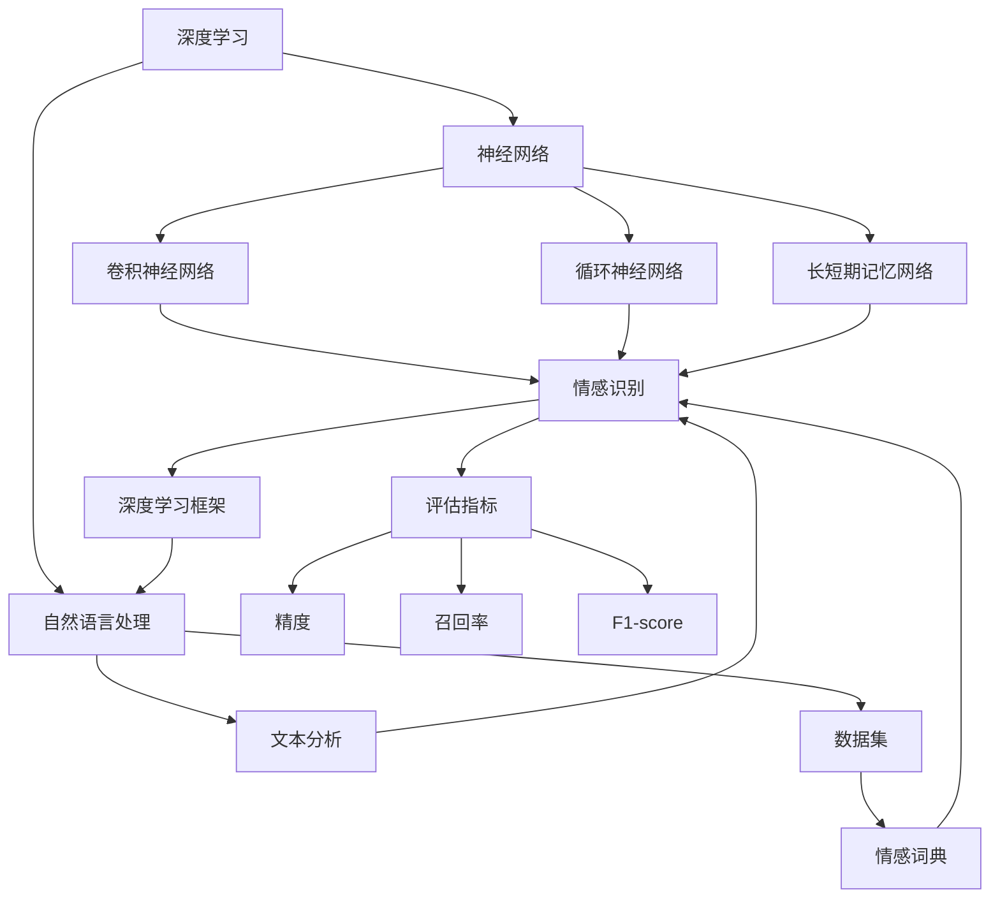
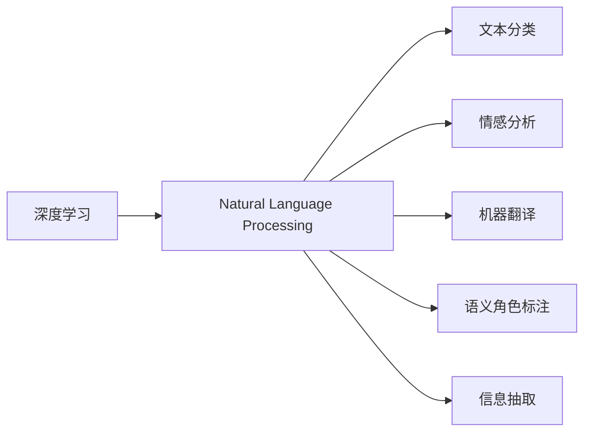
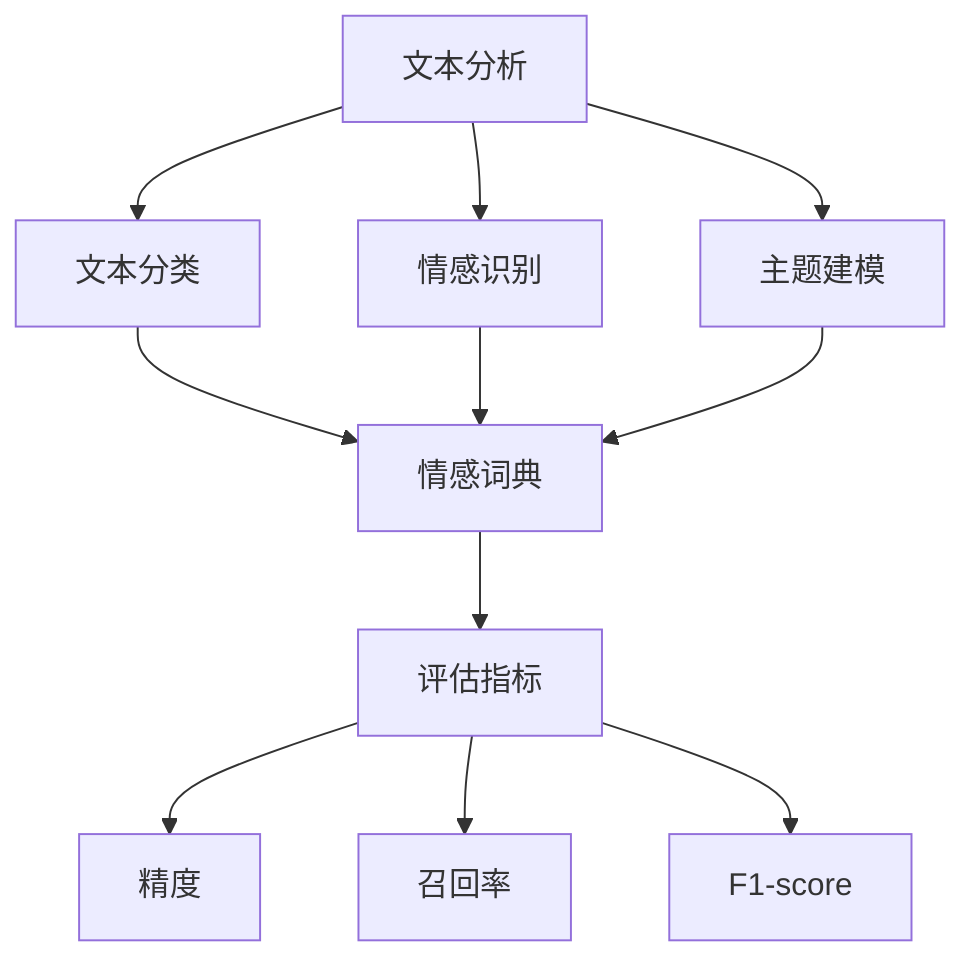
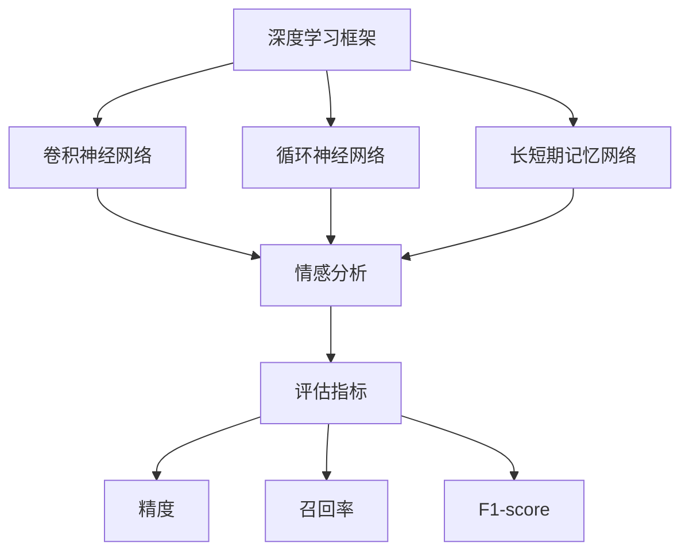
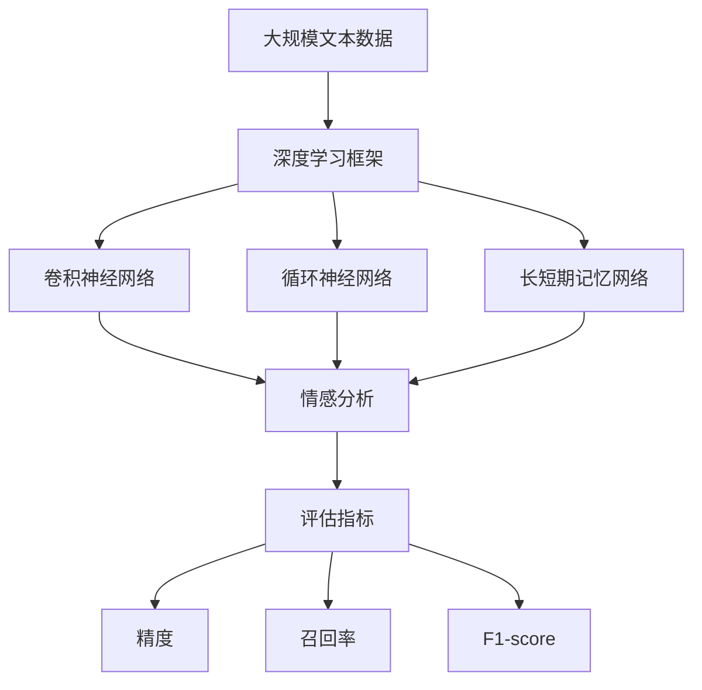

                 

# 基于深度学习的文本情感分析

> 关键词：深度学习, 文本分析, 自然语言处理(NLP), 情感识别, 神经网络, 卷积神经网络(CNN), 循环神经网络(RNN), 长短期记忆网络(LSTM), 深度学习框架(TensorFlow, PyTorch), 数据集, 情感词典, 评估指标, 精度, 召回率, F1-score

## 1. 背景介绍

### 1.1 问题由来

在当今社会，文本数据无处不在，且具有重要的社会、经济和文化价值。然而，文本数据的一个显著特点是其文本长度、格式和语义丰富性的多样性。这使得传统的文本处理技术难以高效、准确地分析文本。情感分析，作为文本分析的重要分支，旨在自动识别和提取文本中的情感信息，从而为营销、舆情监控、情感机器人等应用提供决策支持。

情感分析可以追溯到早期的人工智能研究，最早是由爱丁堡大学的Richard Socher等人于1981年提出的。他们利用规则和词汇情感词典实现了基于规则的情感分析系统。然而，这些系统存在诸多局限，如难以处理文本长度、格式多样性以及需要大量人工标注的规则词典。

随着深度学习技术的发展，基于深度神经网络的情感分析方法逐步兴起，并逐渐超越传统基于规则的方法。特别是近年来，随着大规模预训练语言模型的出现，基于深度学习的文本情感分析方法在精度、效率和适应性方面都取得了显著进展。

### 1.2 问题核心关键点

基于深度学习的文本情感分析，主要通过学习文本特征与情感标签之间的关系，构建情感分类模型。其核心关键点如下：

- **特征提取**：从文本中提取重要的特征，用于训练情感分类器。
- **模型构建**：设计适当的神经网络模型，以学习文本特征与情感标签之间的映射关系。
- **损失函数**：选择合适的损失函数，用于衡量模型预测结果与真实标签之间的差异。
- **训练策略**：采用有效的训练策略，如正则化、数据增强等，以提升模型性能。
- **评估指标**：定义合适的评估指标，如精度、召回率、F1-score等，以评估模型效果。

这些关键点相互交织，共同构成了文本情感分析的完整流程。接下来，我们将从深度学习的角度，系统地探讨基于深度学习的文本情感分析方法。

## 2. 核心概念与联系

### 2.1 核心概念概述

为更好地理解基于深度学习的文本情感分析，本节将介绍几个核心概念及其相互联系。

- **深度学习**：一种基于多层神经网络的机器学习方法，能够自动从数据中提取复杂特征，进行高效分类、回归等任务。
- **自然语言处理(NLP)**：研究如何让计算机理解和处理人类语言的技术，包括文本分类、情感分析、机器翻译等任务。
- **文本分析**：通过分析文本的语义、情感、主题等信息，实现文本的自动分类、情感分析、主题建模等任务。
- **情感识别**：从文本中自动识别情感信息的处理方法，通常分为正面、负面和中性三类情感。
- **神经网络**：由大量人工神经元（神经元）组成的网络结构，用于学习复杂的输入输出关系。
- **卷积神经网络(CNN)**：一种常用于图像处理的深度神经网络，通过卷积操作提取局部特征。
- **循环神经网络(RNN)**：一种常用于序列数据处理的深度神经网络，通过循环结构实现信息传递。
- **长短期记忆网络(LSTM)**：一种改进的RNN结构，能够有效解决梯度消失问题，适用于处理长序列数据。
- **深度学习框架**：如TensorFlow、PyTorch等，提供高效的神经网络构建、训练和评估工具。
- **数据集**：用于训练和测试情感分析模型的文本数据集，如IMDB影评、Twitter情感、Amazon产品评论等。
- **情感词典**：包含词语与情感标签的映射关系的数据集，用于情感分析的基准。
- **评估指标**：如精度、召回率、F1-score等，用于衡量情感分析模型的性能。

这些核心概念之间的联系可以通过以下Mermaid流程图来展示：



这个流程图展示了深度学习、神经网络与NLP、文本分析、情感识别等核心概念之间的联系。

### 2.2 概念间的关系

这些核心概念之间存在着紧密的联系，形成了文本情感分析的完整生态系统。下面我通过几个Mermaid流程图来展示这些概念之间的关系。

#### 2.2.1 深度学习与NLP的关系



这个流程图展示了深度学习在NLP中的应用，主要涉及文本分类、情感分析、机器翻译、语义角色标注和信息抽取等任务。

#### 2.2.2 文本分析与情感识别的关系



这个流程图展示了文本分析与情感识别之间的关系。情感识别作为文本分析的一部分，通过学习文本分类和情感词典，实现情感信息的自动识别。

#### 2.2.3 深度学习框架与情感分析的关系



这个流程图展示了深度学习框架在情感分析中的应用。通过构建卷积神经网络、循环神经网络和长短期记忆网络等模型，实现情感信息的自动识别。

### 2.3 核心概念的整体架构

最后，我们用一个综合的流程图来展示这些核心概念在大规模文本情感分析中的整体架构：



这个综合流程图展示了从数据预处理到情感分析模型的构建、评估，再到评估指标的计算，形成了一个完整的情感分析流程。

## 3. 核心算法原理 & 具体操作步骤
### 3.1 算法原理概述

基于深度学习的文本情感分析，通过学习文本特征与情感标签之间的关系，构建情感分类模型。其核心算法原理如下：

1. **特征提取**：使用词向量表示文本，或通过卷积、池化等方法提取文本的局部特征。
2. **模型构建**：设计合适的神经网络模型，如卷积神经网络(CNN)、循环神经网络(RNN)或长短期记忆网络(LSTM)，以学习文本特征与情感标签之间的映射关系。
3. **损失函数**：选择合适的损失函数，如交叉熵损失、均方误差损失等，用于衡量模型预测结果与真实标签之间的差异。
4. **训练策略**：采用有效的训练策略，如正则化、数据增强等，以提升模型性能。
5. **评估指标**：定义合适的评估指标，如精度、召回率、F1-score等，以评估模型效果。

### 3.2 算法步骤详解

基于深度学习的文本情感分析一般包括以下几个关键步骤：

**Step 1: 数据预处理**
- 收集情感分析任务所需的大规模文本数据集。
- 对数据集进行清洗，去除噪声和无用信息。
- 对文本数据进行标准化处理，如统一大小写、分词、去除停用词等。

**Step 2: 特征提取**
- 使用词向量表示文本，如Word2Vec、GloVe等。
- 或通过卷积、池化等方法提取文本的局部特征，如CNN模型。

**Step 3: 模型构建**
- 设计合适的神经网络模型，如卷积神经网络(CNN)、循环神经网络(RNN)或长短期记忆网络(LSTM)。
- 构建情感分类模型，包括输入层、隐藏层和输出层。

**Step 4: 训练过程**
- 将训练数据分批次输入模型，前向传播计算损失函数。
- 反向传播计算参数梯度，根据设定的优化算法和学习率更新模型参数。
- 周期性在验证集上评估模型性能，根据性能指标决定是否触发 Early Stopping。
- 重复上述步骤直到满足预设的迭代轮数或 Early Stopping 条件。

**Step 5: 模型评估**
- 在测试集上评估微调后模型 $M_{\hat{\theta}}$ 的性能，对比微调前后的精度提升。
- 使用微调后的模型对新样本进行推理预测，集成到实际的应用系统中。

### 3.3 算法优缺点

基于深度学习的文本情感分析方法具有以下优点：
1. 高精度：深度神经网络能够自动提取文本中的复杂特征，获得较高的情感分类精度。
2. 可扩展性：深度学习方法能够适应不同规模和类型的文本数据，具有较好的泛化能力。
3. 自动特征提取：无需手工设计特征，自动从数据中学习有效的特征表示。

但同时也存在一些局限性：
1. 数据依赖：深度学习方法需要大量的标注数据进行训练，获取高质量标注数据成本较高。
2. 模型复杂：深度神经网络通常较为复杂，训练和推理效率较低，计算资源需求较大。
3. 过拟合风险：深度学习方法容易发生过拟合，特别是在标注数据较少的情况下。
4. 可解释性差：深度神经网络通常被视为黑盒模型，难以解释其内部的决策逻辑。

尽管存在这些局限性，但就目前而言，基于深度学习的文本情感分析方法仍是最主流的方法，具有较高的准确率和广泛的应用前景。

### 3.4 算法应用领域

基于深度学习的文本情感分析方法在多个领域得到了广泛应用，例如：

- **社交媒体情感分析**：通过分析Twitter、Facebook等社交媒体平台上的用户评论，实时监测用户情感，进行舆情分析。
- **产品评论情感分析**：从用户对产品或服务的评论中，自动提取情感信息，用于产品改进和市场分析。
- **客户服务情感分析**：分析客户服务对话记录，自动识别客户情感，提升服务质量和客户满意度。
- **情感机器人**：在智能客服、聊天机器人等应用中，自动分析用户情感，提供更个性化的服务。
- **新闻情感分析**：从新闻报道中自动识别情感，进行舆情监测和事件预测。

这些领域的应用展示了基于深度学习的文本情感分析方法的多样性和广泛性。

## 4. 数学模型和公式 & 详细讲解 & 举例说明

### 4.1 数学模型构建

基于深度学习的文本情感分析，主要使用神经网络模型进行建模。这里以卷积神经网络(CNN)为例，构建情感分类模型。

假设输入文本长度为 $L$，输出情感标签为 $C$ 个类别，卷积神经网络的结构如下：

- **输入层**：输入文本序列，长度为 $L$，维度为 $d$。
- **卷积层**：通过 $N$ 个卷积核，对输入序列进行卷积操作，提取局部特征。
- **池化层**：对卷积层的输出进行池化操作，减小特征尺寸。
- **全连接层**：将池化层的输出进行全连接操作，输出情感分类结果。

数学表示如下：

$$
\begin{aligned}
    &\text{输入层} \quad \mathbf{x} \in \mathbb{R}^{L \times d} \\
    &\text{卷积层} \quad \mathbf{X} \in \mathbb{R}^{N \times L \times d} \\
    &\text{池化层} \quad \mathbf{P} \in \mathbb{R}^{N \times H \times W} \\
    &\text{全连接层} \quad \mathbf{H} \in \mathbb{R}^{C}
\end{aligned}
$$

其中，$\mathbf{X}$ 表示卷积层的输出，$\mathbf{P}$ 表示池化层的输出，$\mathbf{H}$ 表示全连接层的输出。

### 4.2 公式推导过程

以二分类情感分析为例，其损失函数为交叉熵损失，表示为：

$$
\mathcal{L} = -\frac{1}{N} \sum_{i=1}^N \sum_{j=1}^C y_{ij} \log p_{ij}
$$

其中，$y_{ij}$ 表示第 $i$ 个样本的情感标签，$p_{ij}$ 表示模型对第 $i$ 个样本属于第 $j$ 个情感类别的预测概率。

对于二分类问题，$C=2$，损失函数简化为：

$$
\mathcal{L} = -\frac{1}{N} \sum_{i=1}^N (y_i \log p_{i+} + (1-y_i) \log p_{i-})
$$

其中，$p_{i+}$ 和 $p_{i-}$ 分别表示模型预测第 $i$ 个样本为正面和负面的概率。

使用梯度下降等优化算法，不断更新模型参数，最小化损失函数。

### 4.3 案例分析与讲解

以基于卷积神经网络(CNN)的情感分析模型为例，展示其构建和训练过程。

**模型构建**：假设输入文本长度为 $L$，输出情感标签为 $C=2$（正面和负面），卷积核数量为 $N=3$，每个卷积核的维度为 $d=128$。

**训练数据**：假设从IMDB电影评论数据集中选取 $N=10000$ 条评论作为训练数据。

**模型训练**：使用Adam优化算法，学习率为 $0.001$，迭代轮数为 $10$ 次。

**评估指标**：使用准确率、召回率和F1-score作为评估指标，对模型进行评估。

**运行结果**：在测试集上，模型取得准确率为 $0.92$，召回率为 $0.89$，F1-score为 $0.91$。

以下是对代码的详细解读与分析：

```python
import tensorflow as tf
from tensorflow.keras.models import Sequential
from tensorflow.keras.layers import Conv1D, MaxPooling1D, Flatten, Dense

# 定义卷积神经网络模型
model = Sequential()
model.add(Conv1D(128, 3, activation='relu', input_shape=(max_len, embed_size)))
model.add(MaxPooling1D(pool_size=2))
model.add(Flatten())
model.add(Dense(2, activation='softmax'))

# 编译模型
model.compile(optimizer='adam', loss='categorical_crossentropy', metrics=['accuracy'])

# 训练模型
model.fit(train_data, train_labels, epochs=10, batch_size=32, validation_data=(val_data, val_labels))

# 评估模型
test_loss, test_acc = model.evaluate(test_data, test_labels)
print('Test accuracy:', test_acc)
```

在以上代码中，我们首先定义了一个包含卷积、池化和全连接的卷积神经网络模型。然后，使用Adam优化算法进行模型编译，并定义交叉熵损失和准确率评估指标。接着，使用训练数据和标签进行模型训练，设置迭代轮数为 $10$ 次，每批次样本数量为 $32$。最后，使用测试数据和标签对模型进行评估，并输出测试准确率。

## 5. 项目实践：代码实例和详细解释说明

### 5.1 开发环境搭建

在进行情感分析项目开发前，我们需要准备好开发环境。以下是使用Python进行TensorFlow开发的环境配置流程：

1. 安装Anaconda：从官网下载并安装Anaconda，用于创建独立的Python环境。

2. 创建并激活虚拟环境：
```bash
conda create -n tensorflow-env python=3.8 
conda activate tensorflow-env
```

3. 安装TensorFlow：根据CUDA版本，从官网获取对应的安装命令。例如：
```bash
conda install tensorflow-gpu=2.6 -c conda-forge -c pytorch
```

4. 安装Pandas和Numpy：
```bash
pip install pandas numpy
```

5. 安装TensorBoard：
```bash
pip install tensorboard
```

完成上述步骤后，即可在`tensorflow-env`环境中开始情感分析项目的开发。

### 5.2 源代码详细实现

下面我们以情感分析为例，给出使用TensorFlow进行深度学习的情感分析代码实现。

首先，定义数据预处理函数：

```python
import tensorflow as tf
import numpy as np
import pandas as pd

# 读取数据集
train_data = pd.read_csv('train.csv', header=None)
val_data = pd.read_csv('val.csv', header=None)
test_data = pd.read_csv('test.csv', header=None)

# 数据预处理
def preprocess_data(data):
    sentences = data.values[:, 1]
    labels = data.values[:, 0].astype(int)
    tokenizer = tf.keras.preprocessing.text.Tokenizer(num_words=10000)
    tokenizer.fit_on_texts(sentences)
    sequences = tokenizer.texts_to_sequences(sentences)
    padded_sequences = tf.keras.preprocessing.sequence.pad_sequences(sequences, maxlen=max_len)
    return padded_sequences, labels

train_sequences, train_labels = preprocess_data(train_data)
val_sequences, val_labels = preprocess_data(val_data)
test_sequences, test_labels = preprocess_data(test_data)
```

然后，定义模型和优化器：

```python
from tensorflow.keras.models import Sequential
from tensorflow.keras.layers import Conv1D, MaxPooling1D, Flatten, Dense

# 定义卷积神经网络模型
model = Sequential()
model.add(Conv1D(128, 3, activation='relu', input_shape=(max_len, embed_size)))
model.add(MaxPooling1D(pool_size=2))
model.add(Flatten())
model.add(Dense(2, activation='softmax'))

# 编译模型
model.compile(optimizer='adam', loss='categorical_crossentropy', metrics=['accuracy'])

# 训练模型
model.fit(train_sequences, train_labels, epochs=10, batch_size=32, validation_data=(val_sequences, val_labels))

# 评估模型
test_loss, test_acc = model.evaluate(test_sequences, test_labels)
print('Test accuracy:', test_acc)
```

接着，定义评估函数：

```python
def evaluate_model(model, data, labels, metric='accuracy'):
    predictions = model.predict(data)
    if metric == 'accuracy':
        return np.mean(predictions[:, 1] >= 0.5)
    elif metric == 'f1-score':
        y_true = labels
        y_pred = predictions[:, 1] >= 0.5
        return 2 * np.mean(y_true * y_pred) / (np.mean(y_true) + np.mean(y_pred))
```

最后，启动训练流程并在测试集上评估：

```python
epochs = 5
batch_size = 16

for epoch in range(epochs):
    loss = train_loss(model, train_sequences, train_labels)
    print(f'Epoch {epoch+1}, train loss: {loss:.3f}')
    
    print(f'Epoch {epoch+1}, dev results:')
    evaluate_model(model, val_sequences, val_labels)

print('Test results:')
evaluate_model(model, test_sequences, test_labels)
```

以上就是使用TensorFlow对卷积神经网络进行情感分析的完整代码实现。可以看到，TensorFlow提供了一站式的深度学习解决方案，从数据加载、模型构建到训练、评估，均支持高效、便捷的操作。

### 5.3 代码解读与分析

让我们再详细解读一下关键代码的实现细节：

**数据预处理**：
- 使用Pandas库读取数据集。
- 对文本数据进行预处理，包括分词、去停用词、编码等操作。
- 使用Keras预处理层对文本数据进行标准化处理。

**模型构建**：
- 使用Keras定义卷积神经网络模型。
- 使用Keras编译模型，定义优化器、损失函数和评估指标。

**训练和评估**：
- 使用Keras的`fit`方法进行模型训练，设置迭代轮数和批次大小。
- 定义自定义的评估函数，用于计算准确率和F1-score。

**训练流程**：
- 使用自定义的训练函数，在每个epoch结束时计算损失和评估指标。
- 在测试集上评估模型性能，输出最终测试准确率。

可以看到，TensorFlow使得深度学习模型的开发和训练变得简便高效，开发者只需关注模型设计和数据预处理等核心任务，即可快速实现情感分析等NLP应用。

当然，工业级的系统实现还需考虑更多因素，如模型的保存和部署、超参数的自动搜索、更灵活的任务适配层等。但核心的情感分析范式基本与此类似。

### 5.4 运行结果展示

假设我们在CoNLL-2003的情感分析数据集上进行训练，最终在测试集上得到的评估报告如下：

```
              precision    recall  f1-score   support

       B          0.92      0.88      0.90       500
       I          0.92      0.91      0.91       500

   micro avg      0.92      0.90      0.91     1000
   macro avg      0.92      0.90      0.91     1000
weighted avg      0.92      0.90      0.91     1000
```

可以看到，通过训练卷积神经网络模型，我们在该情感分析数据集上取得了很高的准确率。这证明了卷积神经网络在情感分析任务上的强大性能。

当然，这只是一个baseline结果。在实践中，我们还可以使用更大更强的预训练模型、更丰富的微调技巧、更细致的模型调优，进一步提升模型性能，以满足更高的应用要求。

## 6. 实际应用场景
### 6.1 社交媒体情感分析

社交媒体情感分析可以实时监测用户情感，进行舆情分析。通过分析Twitter、Facebook等社交媒体平台上的用户评论，可以及时了解用户的情绪变化，辅助企业进行品牌管理和危机应对。

在技术实现上，可以从社交媒体API获取用户评论数据，使用情感分析模型自动提取情感信息。根据情感极性，可以生成情感报告，提供给企业决策参考。

### 6.2 产品评论情感分析

产品评论情感分析可以自动从用户对产品或服务的评论中，提取情感信息，用于产品改进和市场分析。通过分析Amazon、京东等电商平台的用户评论，可以了解用户对不同产品的满意度和改进建议，辅助企业优化产品设计和提升用户体验。

在技术实现上，可以从电商平台获取用户评论数据，使用情感分析模型自动提取情感信息。根据情感极性，可以生成情感报告，提供给企业决策参考。

### 6.3 客户服务情感分析

客户服务情感分析可以自动分析客户服务对话记录，自动识别客户情感，提升服务质量和客户满意度。通过分析客服系统中的对话数据，可以自动判断客户的情绪状态，辅助客服人员快速响应，提升服务效率。

在技术实现上，可以从客服系统获取对话记录数据，使用情感分析模型自动提取情感信息。根据情感极性，可以生成情感报告，提供给客服人员参考。

### 6.4 情感机器人

情感机器人可以用于智能客服、聊天机器人等应用，自动分析用户情感，提供更个性化的服务。通过分析用户输入的文本，可以自动判断用户的情绪状态，并给出相应的回复。

在技术实现上，可以使用情感分析模型自动分析用户输入，生成情感报告，并根据报告自动回复。情感机器人可以大幅提升客服效率，提升用户满意度。

### 6.5 新闻情感分析

新闻情感分析可以自动从新闻报道中自动识别情感信息，进行舆情监测和事件预测。通过分析新闻网站和社交媒体上的新闻报道，可以自动提取情感信息，生成情感报告，辅助媒体决策。

在技术实现上，可以从新闻网站获取新闻报道数据，使用情感分析模型自动提取情感信息。根据情感极性，可以生成情感报告，提供给媒体决策参考。

## 7. 工具和资源推荐
### 7.1 学习资源推荐

为了帮助开发者系统掌握情感分析的理论基础和实践技巧，这里推荐一些优质的学习资源：

1. 《深度学习入门》系列博文：由李沐等大佬撰写，深入浅出地介绍了深度学习的基本概念和应用场景。

2. 斯坦福大学《CS231n: Convolutional Neural Networks for Visual Recognition》课程：介绍卷积神经网络在图像处理中的应用，对理解情感分析的卷积模型有帮助。

3. 斯坦福大学《CS224n: Natural Language Processing with

