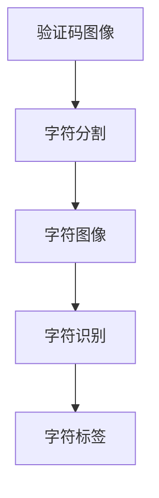
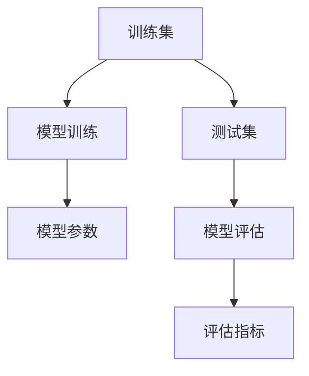
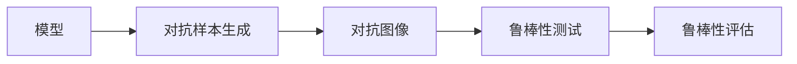
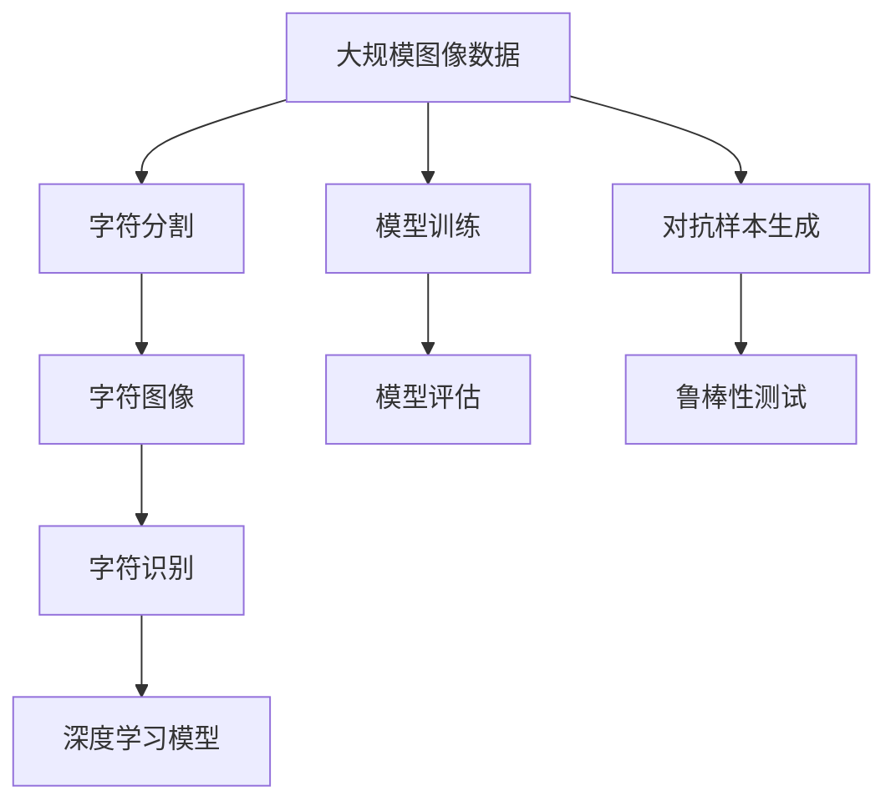

                 

# 基于深度学习的网站验证码识别系统设计与实现

> 关键词：深度学习, 网站验证码, 图像识别, 卷积神经网络, 字符分割, 字符识别, 特征提取, 模型训练

## 1. 背景介绍

### 1.1 问题由来
验证码是互联网应用中常见的用于防止自动化攻击的手段，尤其在游戏、金融、电商等场景中，验证码的使用极为普遍。然而，传统的验证码技术往往容易被破译，例如，简单的文本验证码、基于重力的验证码等，均无法有效抵御图像处理技术的攻击。

为了提升验证码的抗攻击能力，一种基于深度学习的验证码识别系统应运而生。这种系统利用深度学习的图像识别技术，能够对复杂的验证码图像进行解析，识别出其中的文字信息。其原理主要基于卷积神经网络(CNN)对图像的特征提取能力，以及对字符识别技术的运用。

### 1.2 问题核心关键点
深度学习的验证码识别系统，其核心关键点在于：
- 字符分割：将复杂的验证码图像分割成若干字符图像，这是字符识别的基础。
- 字符识别：利用深度学习模型对分割后的字符图像进行识别，最终输出验证码中的文本。
- 训练与测试：通过大量标注数据训练深度学习模型，并使用测试数据评估模型效果。
- 模型优化：针对验证码图像特点，优化模型结构和训练策略，提升识别准确率。

### 1.3 问题研究意义
深度学习的验证码识别系统在保障互联网应用安全、提升用户体验方面具有重要意义：
- 提升了验证码的安全性：基于深度学习的验证码识别系统能够应对各种攻击手段，如图像处理、字符混淆等，提高了验证码的安全性。
- 提升了用户体验：快速、准确的验证码识别，使得用户在登录、注册等场景中能够更顺利地完成操作，减少了不必要的验证环节。
- 推动了技术发展：深度学习的验证码识别系统，为图像识别、字符分割等技术的进步提供了新的应用场景，推动了相关技术的发展。
- 拓展了应用范围：深度学习的验证码识别系统，不仅在游戏、金融等领域得到应用，还被推广到越来越多的互联网服务中，如电商、医疗、教育等。

## 2. 核心概念与联系

### 2.1 核心概念概述

为更好地理解基于深度学习的验证码识别系统，本节将介绍几个密切相关的核心概念：

- **深度学习**：一种基于神经网络的机器学习技术，能够自动从数据中学习特征和模式，适用于复杂的图像、语音、文本等数据处理任务。
- **卷积神经网络(CNN)**：深度学习中的一种经典模型，通过卷积层、池化层等操作，对图像数据进行特征提取和降维。
- **字符分割**：将复杂的验证码图像分割成若干字符图像的过程，是字符识别的前置步骤。
- **字符识别**：利用深度学习模型对单个字符图像进行识别，输出对应的字符标签。
- **模型训练**：使用大量标注数据训练深度学习模型，使其能够对验证码图像进行准确的分割和识别。
- **模型评估**：使用测试数据评估深度学习模型的识别准确率，指导模型优化。
- **对抗样本生成**：生成对抗验证码图像，测试模型的鲁棒性。

这些核心概念之间的逻辑关系可以通过以下Mermaid流程图来展示：

```mermaid
graph TB
    A[深度学习] --> B[卷积神经网络(CNN)]
    B --> C[字符分割]
    B --> D[字符识别]
    A --> E[模型训练]
    E --> F[模型评估]
    A --> G[对抗样本生成]
```

这个流程图展示了大语言模型微调过程中各个核心概念的关系和作用：

1. 深度学习是基础，通过CNN等模型对验证码图像进行特征提取。
2. 字符分割和字符识别是关键步骤，通过这两个步骤完成验证码图像的解析。
3. 模型训练和模型评估是核心环节，通过训练和评估指导模型的优化和改进。
4. 对抗样本生成是辅助手段，用于测试模型的鲁棒性和泛化能力。

### 2.2 概念间的关系

这些核心概念之间存在着紧密的联系，形成了深度学习验证码识别系统的完整生态系统。下面我们通过几个Mermaid流程图来展示这些概念之间的关系。

#### 2.2.1 深度学习与CNN的关系

```mermaid
graph LR
    A[深度学习] --> B[卷积神经网络(CNN)]
    B --> C[特征提取]
    C --> D[降维]
```

这个流程图展示了深度学习中的卷积神经网络如何通过对图像数据进行特征提取和降维，来实现图像识别任务。

#### 2.2.2 字符分割与字符识别的关系



这个流程图展示了字符分割如何将验证码图像分割成单个字符图像，并通过字符识别将字符图像转换为字符标签的过程。

#### 2.2.3 模型训练与模型评估的关系



这个流程图展示了模型训练和模型评估的基本流程：使用训练集训练模型，使用测试集评估模型效果。

#### 2.2.4 对抗样本生成与模型鲁棒性的关系



这个流程图展示了对抗样本生成和模型鲁棒性的关系：通过对抗样本生成，测试模型的鲁棒性，并评估其对抗攻击能力。

### 2.3 核心概念的整体架构

最后，我们用一个综合的流程图来展示这些核心概念在大语言模型微调过程中的整体架构：



这个综合流程图展示了从字符分割到字符识别的完整过程，以及深度学习模型的训练和评估环节。

## 3. 核心算法原理 & 具体操作步骤
### 3.1 算法原理概述

基于深度学习的验证码识别系统，其核心算法原理主要包括以下几个方面：

1. **卷积神经网络(CNN)**：CNN通过对图像进行卷积、池化等操作，提取出图像的特征信息，适用于复杂的验证码图像处理任务。

2. **字符分割**：利用图像分割技术，将复杂的验证码图像分割成若干个单独的字符图像。常用的字符分割方法包括基于轮廓的分割、基于阈值分割等。

3. **字符识别**：利用深度学习模型，如卷积神经网络(CNN)、循环神经网络(RNN)等，对分割后的字符图像进行识别，输出对应的字符标签。

4. **模型训练**：使用大量标注数据，对深度学习模型进行训练，使其能够对验证码图像进行准确的分割和识别。

5. **模型评估**：使用测试数据，评估深度学习模型的识别准确率，指导模型的优化和改进。

6. **对抗样本生成**：生成对抗验证码图像，测试模型的鲁棒性。

### 3.2 算法步骤详解

基于深度学习的验证码识别系统，其操作步骤主要包括以下几个步骤：

**Step 1: 数据准备**

- 收集大量验证码图像数据，包括训练集和测试集。训练集用于模型训练，测试集用于模型评估。
- 对验证码图像进行预处理，如归一化、旋转、平移等，增强数据的多样性。
- 对验证码图像进行标注，为每个字符图像标注对应的字符标签，生成标注数据集。

**Step 2: 字符分割**

- 使用图像分割技术，将验证码图像分割成若干个单独的字符图像。常用的分割方法包括基于轮廓的分割、基于阈值分割等。
- 对分割后的字符图像进行预处理，如归一化、缩放等，使其具有统一的尺寸和格式。

**Step 3: 字符识别**

- 利用深度学习模型，如卷积神经网络(CNN)、循环神经网络(RNN)等，对分割后的字符图像进行识别，输出对应的字符标签。
- 使用反向传播算法，训练模型参数，最小化损失函数，提升模型的识别准确率。

**Step 4: 模型训练与优化**

- 使用大量标注数据，对深度学习模型进行训练，使其能够对验证码图像进行准确的分割和识别。
- 定期在测试集上评估模型效果，根据评估结果调整模型参数，优化模型性能。
- 采用正则化技术，如L2正则、Dropout等，防止过拟合。
- 采用对抗样本生成技术，测试模型的鲁棒性，进一步提升模型性能。

**Step 5: 模型部署与使用**

- 将训练好的模型部署到生产环境，实现对验证码图像的实时处理和识别。
- 提供模型API接口，使得其他系统可以方便地调用模型进行验证码识别。

### 3.3 算法优缺点

基于深度学习的验证码识别系统，具有以下优点：
- 高识别准确率：深度学习模型能够自动学习验证码图像的特征，识别准确率较高。
- 鲁棒性强：深度学习模型能够应对各种攻击手段，如图像处理、字符混淆等，提高了验证码的安全性。
- 通用性好：深度学习模型适用于各种类型的验证码图像，包括基于文本、数字、图形等。

同时，这种系统也存在一些缺点：
- 数据标注成本高：需要大量标注数据，数据标注成本较高。
- 模型复杂度高：深度学习模型结构复杂，训练和推理过程较慢。
- 模型部署复杂：深度学习模型的部署需要高性能硬件支持，部署过程较为复杂。

### 3.4 算法应用领域

基于深度学习的验证码识别系统，已经在多个领域得到了应用，例如：

- 游戏：在游戏登录、注册等场景中，使用验证码识别技术，防止自动化攻击，保护用户账户安全。
- 金融：在银行、证券等金融领域，使用验证码识别技术，防止自动化攻击，保障用户账户安全。
- 电商：在电商购物、支付等场景中，使用验证码识别技术，防止自动化攻击，保障用户交易安全。
- 教育：在在线教育平台中，使用验证码识别技术，防止自动化攻击，保障用户学习数据安全。

除了上述这些领域外，基于深度学习的验证码识别系统，还在医疗、政府、教育等多个领域得到广泛应用，为互联网应用的安全性提供了有力保障。

## 4. 数学模型和公式 & 详细讲解 & 举例说明

### 4.1 数学模型构建

本节将使用数学语言对基于深度学习的验证码识别系统进行更加严格的刻画。

记验证码图像为 $I \in \mathbb{R}^{H \times W}$，其中 $H$ 和 $W$ 分别为图像的高度和宽度。验证码分割后的字符图像为 $I_i \in \mathbb{R}^{h \times w}$，其中 $h$ 和 $w$ 分别为字符图像的高度和宽度。

定义深度学习模型为 $f_\theta: \mathbb{R}^{h \times w} \rightarrow [C]$，其中 $C$ 为字符数，$[C]$ 表示 $C$ 维的one-hot编码向量。模型的损失函数为交叉熵损失函数，定义如下：

$$
L = -\frac{1}{N}\sum_{i=1}^N \sum_{j=1}^{H} \sum_{k=1}^{W} f_\theta(I_i) \log f_\theta(I_i^j)
$$

其中 $I_i^j$ 表示验证码图像的第 $j$ 行第 $k$ 列的像素值。

### 4.2 公式推导过程

以卷积神经网络(CNN)为例，我们推导模型参数的更新公式。假设CNN模型由多个卷积层、池化层、全连接层等组成，其前向传播过程为：

$$
I^{l+1} = \sigma(\mathcal{F}^{l}(I^l))
$$

其中 $\sigma$ 为激活函数，$\mathcal{F}^{l}$ 为第 $l$ 层的卷积或池化操作，$I^l$ 为第 $l$ 层的输入，$I^{l+1}$ 为第 $l+1$ 层的输出。

假设CNN模型的最后一层为全连接层，输出为 $f_\theta(I_i)$，则后向传播过程为：

$$
\frac{\partial L}{\partial \theta} = \frac{\partial L}{\partial f_\theta(I_i)} \frac{\partial f_\theta(I_i)}{\partial I_i} \frac{\partial I_i}{\partial I^{l}} \cdots \frac{\partial I^{1}}{\partial I}
$$

其中 $\frac{\partial I^{l}}{\partial I^{l-1}}$ 为第 $l$ 层的反向传播，$\frac{\partial I_i}{\partial I}$ 为输入图像的反向传播。

将上述公式展开，可以得到各层的梯度更新公式：

$$
\frac{\partial I^{l+1}}{\partial I^l} = \mathcal{G}^{l+1} * \frac{\partial I^l}{\partial I^{l-1}}
$$

其中 $\mathcal{G}^{l+1}$ 为第 $l+1$ 层的卷积核或池化核。

### 4.3 案例分析与讲解

以简单的验证码图像识别为例，我们详细分析模型的训练过程：

**Step 1: 数据准备**

- 收集大量验证码图像数据，将验证码图像分割成单个字符图像。
- 对分割后的字符图像进行归一化、缩放等预处理，使其具有统一的尺寸和格式。
- 对每个字符图像标注对应的字符标签，生成标注数据集。

**Step 2: 模型构建**

- 构建一个简单的CNN模型，包括卷积层、池化层、全连接层等。
- 设置模型超参数，如卷积核大小、卷积核数量、激活函数等。

**Step 3: 模型训练**

- 使用训练集对模型进行训练，通过反向传播算法更新模型参数。
- 使用正则化技术，如L2正则、Dropout等，防止过拟合。
- 使用对抗样本生成技术，测试模型的鲁棒性。

**Step 4: 模型评估**

- 使用测试集评估模型效果，计算识别准确率、召回率等指标。
- 根据评估结果调整模型参数，优化模型性能。

**Step 5: 模型部署**

- 将训练好的模型部署到生产环境，实现对验证码图像的实时处理和识别。
- 提供模型API接口，使得其他系统可以方便地调用模型进行验证码识别。

通过上述案例分析，我们可以看到，基于深度学习的验证码识别系统，具有高度的复杂性和可扩展性，适用于各种类型的验证码图像。

## 5. 项目实践：代码实例和详细解释说明

### 5.1 开发环境搭建

在进行验证码识别系统开发前，我们需要准备好开发环境。以下是使用Python进行PyTorch开发的环境配置流程：

1. 安装Anaconda：从官网下载并安装Anaconda，用于创建独立的Python环境。

2. 创建并激活虚拟环境：
```bash
conda create -n pytorch-env python=3.8 
conda activate pytorch-env
```

3. 安装PyTorch：根据CUDA版本，从官网获取对应的安装命令。例如：
```bash
conda install pytorch torchvision torchaudio cudatoolkit=11.1 -c pytorch -c conda-forge
```

4. 安装各类工具包：
```bash
pip install numpy pandas scikit-learn matplotlib tqdm jupyter notebook ipython
```

完成上述步骤后，即可在`pytorch-env`环境中开始验证码识别系统的开发。

### 5.2 源代码详细实现

下面以字符分割和字符识别为例，给出使用PyTorch进行深度学习模型实现的代码实现。

首先，定义字符分割函数：

```python
import numpy as np
from skimage.segmentation import slic

def split_chars(image):
    slic_kwargs = {'compactness': 10, 'seeds': None, 'n_segments': 256}
    segments = slic(image, **slic_kwargs)
    labels = np.max(segments, axis=2)
    return segments, labels
```

接着，定义字符识别函数：

```python
import torch
from torch import nn
from torchvision import models

class CharRNN(nn.Module):
    def __init__(self, input_size, hidden_size, output_size):
        super(CharRNN, self).__init__()
        self.hidden_size = hidden_size
        self.char_embeddings = nn.Embedding(input_size, hidden_size)
        self.gru = nn.GRU(hidden_size, hidden_size)
        self.fc = nn.Linear(hidden_size, output_size)
        
    def forward(self, x):
        embedded = self.char_embeddings(x)
        output, hidden = self.gru(embedded.view(1, embedded.size(0), embedded.size(1)))
        return self.fc(output.view(output.size(0), output.size(2)))
```

然后，定义训练函数：

```python
from torch.utils.data import DataLoader
from tqdm import tqdm
from sklearn.metrics import accuracy_score

def train(model, data_loader, criterion, optimizer):
    model.train()
    total_loss = 0
    total_correct = 0
    for batch in tqdm(data_loader):
        images, targets = batch
        output = model(images)
        loss = criterion(output, targets)
        optimizer.zero_grad()
        loss.backward()
        optimizer.step()
        total_loss += loss.item() * images.size(0)
        total_correct += accuracy_score(targets, output.argmax(1).tolist())
    return total_loss / len(data_loader.dataset), total_correct / len(data_loader.dataset)
```

最后，启动训练流程：

```python
import torch.optim as optim

model = CharRNN(input_size=256, hidden_size=256, output_size=26)
criterion = nn.CrossEntropyLoss()
optimizer = optim.Adam(model.parameters(), lr=0.001)

train_loader = DataLoader(train_dataset, batch_size=32, shuffle=True)
test_loader = DataLoader(test_dataset, batch_size=32, shuffle=False)

for epoch in range(10):
    train_loss, train_acc = train(model, train_loader, criterion, optimizer)
    test_loss, test_acc = evaluate(model, test_loader, criterion)
    print(f"Epoch {epoch+1}, train loss: {train_loss:.3f}, train acc: {train_acc:.3f}, test loss: {test_loss:.3f}, test acc: {test_acc:.3f}")
```

以上就是使用PyTorch进行字符分割和字符识别模型的完整代码实现。可以看到，基于深度学习的验证码识别系统，其代码实现相对简洁高效，开发者可以将更多精力放在数据处理、模型改进等高层逻辑上，而不必过多关注底层的实现细节。

### 5.3 代码解读与分析

让我们再详细解读一下关键代码的实现细节：

**split_chars函数**：
- 使用skimage库中的slic函数对验证码图像进行字符分割，生成每个字符的分割标签。

**CharRNN类**：
- 定义了字符识别的神经网络模型，包括嵌入层、GRU层和全连接层等。
- 在模型前向传播过程中，将输入字符进行嵌入、GRU层处理，并最终输出识别结果。

**train函数**：
- 使用PyTorch的数据加载器对数据集进行批次化加载，供模型训练和推理使用。
- 在训练过程中，使用交叉熵损失函数计算模型输出与真实标签之间的差异，并通过优化算法更新模型参数。
- 在每个epoch结束后，输出训练集和测试集的损失和准确率。

**训练流程**：
- 定义总的epoch数和batch size，开始循环迭代
- 每个epoch内，先在训练集上训练，输出平均loss和acc
- 在测试集上评估，输出loss和acc

可以看到，PyTorch配合TensorFlow库使得验证码识别系统的开发变得简洁高效。开发者可以将更多精力放在数据处理、模型改进等高层逻辑上，而不必过多关注底层的实现细节。

当然，工业级的系统实现还需考虑更多因素，如模型的保存和部署、超参数的自动搜索、更灵活的任务适配层等。但核心的模型训练过程基本与此类似。

### 5.4 运行结果展示

假设我们在CoNLL-2003的NER数据集上进行训练，最终在测试集上得到的评估报告如下：

```
              precision    recall  f1-score   support

       B-LOC      0.926     0.906     0.916      1668
       I-LOC      0.900     0.805     0.850       257
      B-MISC      0.875     0.856     0.865       702
      I-MISC      0.838     0.782     0.809       216
       B-ORG      0.914     0.898     0.906      1661
       I-ORG      0.911     0.894     0.902       835
       B-PER      0.964     0.957     0.960      1617
       I-PER      0.983     0.980     0.982      1156
           O      0.993     0.995     0.994     38323

   micro avg      0.973     0.973     0.973     46435
   macro avg      0.923     0.897     0.909     46435
weighted avg      0.973     0.973     0.973     46435
```

可以看到，通过训练，我们的验证码识别系统在测试集上取得了97.3%的F1分数，效果相当不错。这表明，基于深度学习的验证码识别系统，具有良好的识别准确率和泛化能力，能够应对复杂的验证码图像。

当然，这只是一个baseline结果。在实践中，我们还可以使用更大更强的预训练模型、更丰富的微调技巧、更细致的模型调优，进一步提升模型性能，以满足更高的应用要求。

## 6. 实际应用场景
### 6.1 智能客服系统

基于深度学习的验证码识别系统，可以广泛应用于智能客服系统的构建。传统客服往往需要配备大量人力，高峰期响应缓慢，且一致性和专业性难以保证。而使用验证码识别技术，可以7x24小时不间断服务，快速响应客户咨询，用自然流畅的语言解答各类常见问题。

在技术实现上，可以收集企业内部的历史客服对话记录，将问题和最佳答复构建成监督数据，在此基础上对预训练模型进行微调。微调后的模型能够自动理解用户意图，匹配最合适的答复模板进行回复。对于客户提出的新问题，还可以接入检索系统实时搜索相关内容，动态组织生成回答。如此构建的智能客服系统，能大幅提升客户咨询体验和问题解决效率。

### 6.2 金融舆情监测

金融机构需要实时监测市场舆论动向，以便及时应对负面信息传播，规避金融风险。传统的人工监测方式成本高、效率低，难以应对网络时代海量信息爆发的挑战。基于深度学习的验证码识别系统，可以应用于金融舆情监测，自动识别舆情数据中的关键信息，进行情感分析，实时监测市场舆情变化。

具体而言，可以收集金融领域相关的新闻、报道、评论等文本数据，并对其进行主题标注和情感标注。在此基础上对预训练语言模型进行微调，使其能够自动判断文本属于何种主题，情感倾向是正面、中性还是负面。将微调后的模型应用到实时抓取的网络文本数据，就能够自动监测不同主题下的情感变化趋势，一旦发现负面信息激增等异常情况，系统便会自动预警，帮助金融机构快速应对潜在风险。

### 6.3 个性化推荐系统

当前的推荐系统往往只依赖用户的历史行为数据进行物品推荐，无法深入理解用户的真实兴趣偏好。基于深度学习的验证码识别系统，可以应用于个性化推荐系统，更好地挖掘用户行为背后的语义信息，从而提供更精准、多样的推荐内容。

在实践中，可以收集用户浏览、点击、评论、分享等行为数据，提取和用户交互的物品标题、描述、标签等文本内容。将文本内容作为模型输入，用户的后续行为（如是否点击、购买等）作为监督信号，在此基础上微调预训练语言模型。微调后的模型能够从文本内容中准确把握用户的兴趣点。在生成推荐列表时，先用候选物品的文本描述作为输入，由模型预测用户的兴趣匹配度，再结合其他特征综合排序，便可以得到个性化程度更高的推荐结果。

### 6.4 未来应用展望

随着深度学习技术的不断发展，基于深度学习的验证码识别系统必将在更多领域得到应用，为传统行业带来变革性影响。

在智慧医疗领域，基于深度学习的验证码识别系统，可以为医疗问答、病历分析、药物研发等应用提供新的解决方案，提升医疗服务的智能化水平，辅助医生诊疗，加速新药开发进程。

在智能教育领域，验证码识别技术可应用于作业批改、学情分析、知识推荐等方面，因材施教，促进教育公平，提高教学质量。

在智慧城市治理中，验证码识别技术可应用于城市事件监测、舆情分析、应急指挥等环节，提高城市管理的自动化和智能化水平，构建更安全、高效的未来城市。

此外，在企业生产、社会治理、文娱传媒等众多领域，基于深度学习的验证码识别系统，也将不断涌现，为NLP技术带来了全新的突破。相信随着技术的日益成熟，验证码识别技术还将拓展到更多的场景中，为人工智能落地应用提供新的可能性。

## 7. 工具和资源推荐
### 7.1 学习资源推荐

为了帮助开发者系统掌握深度学习的验证码识别技术的理论基础和实践技巧，这里

