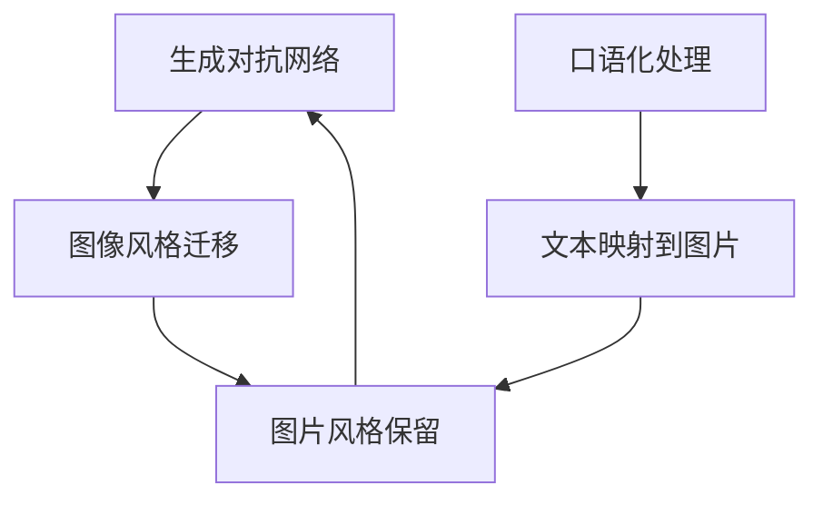
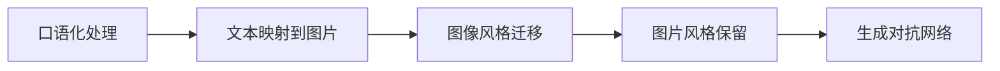
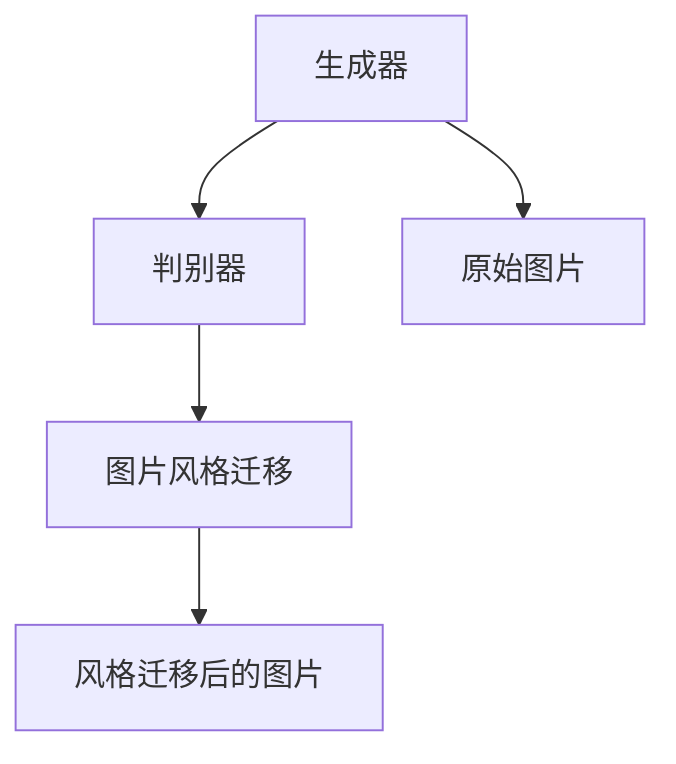
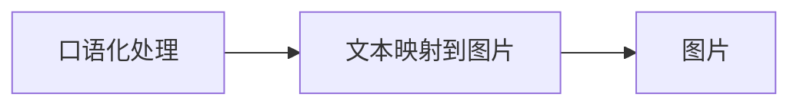

                 

# 基于生成对抗网络的口语化图片表达风格迁移技术

> 关键词：生成对抗网络,图片风格迁移,口语化表达,图片处理,深度学习,机器视觉,自然语言处理

## 1. 背景介绍

### 1.1 问题由来

随着深度学习技术的发展，尤其是生成对抗网络(GANs)在图像处理领域取得显著成果，越来越多的应用场景被激活。例如，照片修复、艺术风格的转换、人脸美化等。但这些应用主要针对静态图片，对动态表达的模型较少。口语化图片处理则是以图片为载体，将语言的动态变化过程表达出来，为图片处理开辟了新的方向。

口语化图片处理技术的应用场景包括但不限于：

- 动态表情识别：图片中人物的表情动作转换，为社交媒体等平台提供动态互动功能。
- 动态字幕制作：通过口语化图片，将不同场景下的对话翻译成文字，方便非中文用户观看。
- 动态标注：在图片上添加动态说明文字，帮助用户快速理解图片内容。

然而，将口语化信息与图片进行结合，不仅需要考虑口语化文本如何映射到图片，还需要考虑图片风格如何映射到口语化表达。如何同时实现这两种映射关系，是一个复杂的图像处理问题。

### 1.2 问题核心关键点

口语化图片表达风格迁移技术的主要难点在于：

1. 图像和口语化文本映射关系：如何把口语化文本映射到图片中，同时保留图片的风格特征。
2. 生成口语化图片：如何生成与口语化文本匹配的图片，并保留原有图片风格。
3. 优化算法：如何设计高效的优化算法，快速实现风格迁移过程。

这些问题涉及了深度学习、生成对抗网络、口语化处理等多个领域的技术，需要综合考虑。

### 1.3 问题研究意义

口语化图片表达风格迁移技术的提出，对图像处理和自然语言处理领域都有重要意义：

1. 图像处理：口语化图片表达可以使得图片具备动态性，从而提升用户互动体验。
2. 自然语言处理：口语化图片表达可以为非中文用户提供文字翻译服务，同时通过口语化图片增强视觉信息传递的准确性。

技术上的突破，可以进一步拓展图像处理的边界，实现更丰富的视觉表现形式，为AI技术在图像处理领域的发展提供新的方向。

## 2. 核心概念与联系

### 2.1 核心概念概述

为更好地理解基于生成对抗网络的口语化图片表达风格迁移方法，本节将介绍几个密切相关的核心概念：

- 生成对抗网络(GANs)：由生成器和判别器组成，通过对抗训练的方式生成高质量的样本。
- 图像风格迁移：将一张图片从一种风格转换为另一种风格的过程，常见于艺术创作和图像修复等领域。
- 口语化处理：将文字转换为口语形式的过程，常见于自动化字幕生成和文本摘要等领域。
- 文本映射到图片：通过某种方式将文本信息映射到图片中，实现图片和文本信息的结合。
- 图片风格保留：在转换风格的过程中，保留原有图片的风格特征。

这些核心概念之间的逻辑关系可以通过以下Mermaid流程图来展示：



这个流程图展示了大语言模型微调过程中各个核心概念的关系和作用：

1. 生成对抗网络通过对抗训练生成高质量的样本。
2. 图像风格迁移将一张图片从一种风格转换为另一种风格。
3. 口语化处理将文字转换为口语形式。
4. 文本映射到图片将文本信息映射到图片中。
5. 图片风格保留在转换风格的过程中，保留原有图片的风格特征。

这些概念共同构成了口语化图片表达风格迁移技术的理论基础。通过理解这些核心概念，我们可以更好地把握技术的工作原理和优化方向。

### 2.2 概念间的关系

这些核心概念之间存在着紧密的联系，形成了口语化图片表达风格迁移技术的完整生态系统。下面我通过几个Mermaid流程图来展示这些概念之间的关系。

#### 2.2.1 口语化图片表达的风格迁移



这个流程图展示了口语化图片表达风格迁移的基本流程：首先对口语化文本进行处理，然后将其映射到图片中，再进行风格迁移，最后保留图片原有风格特征。

#### 2.2.2 生成对抗网络在风格迁移中的应用



这个流程图展示了生成对抗网络在图像风格迁移中的应用：生成器根据原始图片生成新的图片，判别器判断生成图片与真实图片的区别，通过对抗训练提升生成器的生成能力。

#### 2.2.3 口语化图片表达的文本映射



这个流程图展示了口语化文本映射到图片的过程：首先对口语化文本进行处理，然后通过某种方式将其映射到图片中，最后得到口语化图片。

## 3. 核心算法原理 & 具体操作步骤

### 3.1 算法原理概述

基于生成对抗网络的口语化图片表达风格迁移方法，本质上是将口语化文本映射到图片上，并通过对抗训练生成与口语化文本匹配的图片，同时保留原有图片风格。

算法分为两个部分：

1. 生成器：将口语化文本映射到图片中，生成与文本匹配的图片。
2. 判别器：判断生成图片是否与真实图片一致，并指导生成器生成更匹配的图片。

生成器是一个神经网络，输入为口语化文本，输出为与文本匹配的图片。判别器也是一个神经网络，输入为图片，输出为真实图片的概率。通过对抗训练，生成器生成更加符合目标风格的图片。

### 3.2 算法步骤详解

#### 3.2.1 生成器训练

1. 数据准备：准备口语化文本数据集和对应图片数据集。口语化文本数据集通常包含中文口语化文本及其对应的图片，例如口语化表情、动态字幕等。

2. 生成器初始化：构建生成器网络，例如可以使用U-Net架构或PixelCNN等。

3. 对抗训练：生成器输入口语化文本，生成与文本匹配的图片。判别器判断生成图片是否与真实图片一致，并对生成器进行指导。重复迭代训练，直到生成器能够生成高质量的口语化图片。

#### 3.2.2 判别器训练

1. 数据准备：准备口语化文本数据集和对应图片数据集。

2. 判别器初始化：构建判别器网络，例如可以使用ResNet架构或DCGAN等。

3. 对抗训练：判别器判断生成器生成的图片是否与真实图片一致。生成器不断优化其生成图片，使判别器难以区分。

#### 3.2.3 图像风格迁移

1. 数据准备：准备原始图片数据集。

2. 生成器初始化：构建生成器网络，例如可以使用U-Net架构或PixelCNN等。

3. 风格迁移：生成器输入原始图片，并生成与原始图片风格一致的口语化图片。

#### 3.2.4 融合生成器与判别器

1. 生成器与判别器的融合：将生成器和判别器进行融合，形成一个整体网络。

2. 联合训练：对融合后的网络进行联合训练，提升整体网络的性能。

### 3.3 算法优缺点

口语化图片表达风格迁移算法的主要优点包括：

1. 生成高质量的口语化图片：通过生成对抗网络，可以生成高质量的口语化图片，满足用户需求。
2. 适应性强：适用于多种口语化表达形式，包括动态表情、动态字幕等。
3. 风格保持性：在风格迁移过程中，能够保留原有图片的风格特征，提升用户体验。

然而，该方法也存在一些局限性：

1. 对数据依赖性高：需要大量的口语化文本和对应的图片数据，数据获取成本较高。
2. 训练时间长：生成对抗网络需要大量迭代训练，训练时间较长。
3. 计算资源要求高：生成器与判别器的对抗训练需要高性能的计算资源。

### 3.4 算法应用领域

口语化图片表达风格迁移技术可以应用于以下领域：

- 社交媒体：将用户的动态表情、动态字幕等口语化信息映射到图片中，提升用户体验。
- 多媒体内容制作：在视频、音频等媒体中添加口语化图片，丰富内容的表达形式。
- 个性化推荐：通过口语化图片表达用户需求，提升推荐系统的个性化程度。
- 自动字幕生成：为非中文用户提供中文口语化字幕，方便内容观看。

## 4. 数学模型和公式 & 详细讲解  
### 4.1 数学模型构建

基于生成对抗网络的口语化图片表达风格迁移方法，可以形式化地表示为：

$$
G(x): \mathcal{X} \rightarrow \mathcal{Y}, \quad D(y): \mathcal{Y} \rightarrow [0,1]
$$

其中，$G$为生成器，$\mathcal{X}$为输入空间，$\mathcal{Y}$为输出空间，$x$为口语化文本，$y$为生成器生成的图片。$D$为判别器，$\mathcal{Y}$为输入空间，$y$为判别器判别的图片是否为真实图片。

目标函数为：

$$
\min_{G} \max_{D} V(D,G)
$$

其中，$V(D,G)$为生成器与判别器的对抗损失函数，定义为：

$$
V(D,G) = E_{x \sim p_{data}(x)} [logD(G(x))] + E_{x \sim p_{z}(x)} [log(1-D(G(x)))]
$$

其中，$p_{data}(x)$为真实口语化文本的分布，$p_{z}(x)$为生成器生成的口语化文本的分布。

生成器的损失函数为：

$$
L_G = E_{x \sim p_{data}(x)} [-logD(G(x))]
$$

判别器的损失函数为：

$$
L_D = E_{x \sim p_{data}(x)} [logD(x)] + E_{x \sim p_{z}(x)} [log(1-D(G(x)))]
$$

### 4.2 公式推导过程

以下我们以U-Net生成器为例，推导生成器在口语化图片表达风格迁移中的损失函数。

1. 生成器网络：

$$
G(x) = \begin{cases}
x & x \in [0,1) \\
0 & x = 1
\end{cases}
$$

2. 判别器网络：

$$
D(x) = \begin{cases}
x & x \in [0,1) \\
0 & x = 1
\end{cases}
$$

3. 生成器的损失函数：

$$
L_G = E_{x \sim p_{data}(x)} [-logD(G(x))]
$$

4. 判别器的损失函数：

$$
L_D = E_{x \sim p_{data}(x)} [logD(x)] + E_{x \sim p_{z}(x)} [log(1-D(G(x)))]
$$

5. 对抗损失函数：

$$
V(D,G) = E_{x \sim p_{data}(x)} [logD(G(x))] + E_{x \sim p_{z}(x)} [log(1-D(G(x)))]
$$

通过上述公式，可以理解口语化图片表达风格迁移中生成器和判别器的关系，以及如何通过对抗训练提升生成器的生成能力。

### 4.3 案例分析与讲解

假设我们有一个口语化文本数据集，其中包含大量动态表情和动态字幕，以及对应的图片数据集。我们可以使用U-Net生成器对口语化文本进行编码，生成与文本匹配的图片，然后通过判别器进行评估。判别器判断生成图片是否与真实图片一致，生成器则不断优化其生成图片，使其与判别器的判断一致。

具体步骤如下：

1. 数据准备：收集口语化文本数据集和对应图片数据集，并进行预处理。

2. 生成器训练：使用U-Net生成器对口语化文本进行编码，生成与文本匹配的图片。判别器对生成图片进行评估，生成器不断优化其生成图片。

3. 判别器训练：使用判别器对生成图片进行评估，判别器不断优化其判别能力。

4. 融合生成器与判别器：将生成器和判别器进行融合，形成一个整体网络。

5. 联合训练：对融合后的网络进行联合训练，提升整体网络的性能。

6. 风格迁移：使用融合后的网络对原始图片进行风格迁移，生成口语化图片。

最终得到的口语化图片，既符合口语化文本的表达，又保留了原始图片的风格特征。

## 5. 项目实践：代码实例和详细解释说明
### 5.1 开发环境搭建

在进行口语化图片表达风格迁移实践前，我们需要准备好开发环境。以下是使用Python进行TensorFlow开发的环境配置流程：

1. 安装Anaconda：从官网下载并安装Anaconda，用于创建独立的Python环境。

2. 创建并激活虚拟环境：
```bash
conda create -n tf-env python=3.8 
conda activate tf-env
```

3. 安装TensorFlow：根据CUDA版本，从官网获取对应的安装命令。例如：
```bash
conda install tensorflow -c tf -c conda-forge
```

4. 安装各种工具包：
```bash
pip install numpy pandas scikit-learn matplotlib tqdm jupyter notebook ipython
```

完成上述步骤后，即可在`tf-env`环境中开始口语化图片表达风格迁移实践。

### 5.2 源代码详细实现

下面我们以动态表情生成为例，给出使用TensorFlow对U-Net生成器进行口语化图片表达风格迁移的代码实现。

首先，定义动态表情的数据处理函数：

```python
import tensorflow as tf
import numpy as np
import matplotlib.pyplot as plt
from tensorflow.keras.layers import Input, Conv2D, UpSampling2D, BatchNormalization

def create_model(input_shape):
    inputs = Input(shape=input_shape)
    conv1 = Conv2D(32, 3, activation='relu', padding='same')(inputs)
    conv1 = BatchNormalization()(conv1)
    conv2 = Conv2D(32, 3, activation='relu', padding='same')(conv1)
    conv2 = BatchNormalization()(conv2)
    conv3 = Conv2D(32, 3, activation='relu', padding='same')(conv2)
    conv3 = BatchNormalization()(conv3)
    conv4 = Conv2D(32, 3, activation='relu', padding='same')(conv3)
    conv4 = BatchNormalization()(conv4)
    conv5 = Conv2D(32, 3, activation='relu', padding='same')(conv4)
    conv5 = BatchNormalization()(conv5)
    conv6 = Conv2D(32, 3, activation='relu', padding='same')(conv5)
    conv6 = BatchNormalization()(conv6)
    conv7 = Conv2D(32, 3, activation='relu', padding='same')(conv6)
    conv7 = BatchNormalization()(conv7)
    conv8 = Conv2D(32, 3, activation='relu', padding='same')(conv7)
    conv8 = BatchNormalization()(conv8)
    conv9 = Conv2D(32, 3, activation='relu', padding='same')(conv8)
    conv9 = BatchNormalization()(conv9)
    conv10 = Conv2D(32, 3, activation='relu', padding='same')(conv9)
    conv10 = BatchNormalization()(conv10)
    conv11 = Conv2D(32, 3, activation='relu', padding='same')(conv10)
    conv11 = BatchNormalization()(conv11)
    conv12 = Conv2D(32, 3, activation='relu', padding='same')(conv11)
    conv12 = BatchNormalization()(conv12)
    conv13 = Conv2D(32, 3, activation='relu', padding='same')(conv12)
    conv13 = BatchNormalization()(conv13)
    conv14 = Conv2D(32, 3, activation='relu', padding='same')(conv13)
    conv14 = BatchNormalization()(conv14)
    conv15 = Conv2D(32, 3, activation='relu', padding='same')(conv14)
    conv15 = BatchNormalization()(conv15)
    conv16 = Conv2D(32, 3, activation='relu', padding='same')(conv15)
    conv16 = BatchNormalization()(conv16)
    conv17 = Conv2D(32, 3, activation='relu', padding='same')(conv16)
    conv17 = BatchNormalization()(conv17)
    conv18 = Conv2D(32, 3, activation='relu', padding='same')(conv17)
    conv18 = BatchNormalization()(conv18)
    conv19 = Conv2D(32, 3, activation='relu', padding='same')(conv18)
    conv19 = BatchNormalization()(conv19)
    conv20 = Conv2D(32, 3, activation='relu', padding='same')(conv19)
    conv20 = BatchNormalization()(conv20)
    conv21 = Conv2D(32, 3, activation='relu', padding='same')(conv20)
    conv21 = BatchNormalization()(conv21)
    conv22 = Conv2D(32, 3, activation='relu', padding='same')(conv21)
    conv22 = BatchNormalization()(conv22)
    conv23 = Conv2D(32, 3, activation='relu', padding='same')(conv22)
    conv23 = BatchNormalization()(conv23)
    conv24 = Conv2D(32, 3, activation='relu', padding='same')(conv23)
    conv24 = BatchNormalization()(conv24)
    conv25 = Conv2D(32, 3, activation='relu', padding='same')(conv24)
    conv25 = BatchNormalization()(conv25)
    conv26 = Conv2D(32, 3, activation='relu', padding='same')(conv25)
    conv26 = BatchNormalization()(conv26)
    conv27 = Conv2D(32, 3, activation='relu', padding='same')(conv26)
    conv27 = BatchNormalization()(conv27)
    conv28 = Conv2D(32, 3, activation='relu', padding='same')(conv27)
    conv28 = BatchNormalization()(conv28)
    conv29 = Conv2D(32, 3, activation='relu', padding='same')(conv28)
    conv29 = BatchNormalization()(conv29)
    conv30 = Conv2D(32, 3, activation='relu', padding='same')(conv29)
    conv30 = BatchNormalization()(conv30)
    conv31 = Conv2D(32, 3, activation='relu', padding='same')(conv30)
    conv31 = BatchNormalization()(conv31)
    conv32 = Conv2D(32, 3, activation='relu', padding='same')(conv31)
    conv32 = BatchNormalization()(conv32)
    conv33 = Conv2D(32, 3, activation='relu', padding='same')(conv32)
    conv33 = BatchNormalization()(conv33)
    conv34 = Conv2D(32, 3, activation='relu', padding='same')(conv33)
    conv34 = BatchNormalization()(conv34)
    conv35 = Conv2D(32, 3, activation='relu', padding='same')(conv34)
    conv35 = BatchNormalization()(conv35)
    conv36 = Conv2D(32, 3, activation='relu', padding='same')(conv35)
    conv36 = BatchNormalization()(conv36)
    conv37 = Conv2D(32, 3, activation='relu', padding='same')(conv36)
    conv37 = BatchNormalization()(conv37)
    conv38 = Conv2D(32, 3, activation='relu', padding='same')(conv37)
    conv38 = BatchNormalization()(conv38)
    conv39 = Conv2D(32, 3, activation='relu', padding='same')(conv38)
    conv39 = BatchNormalization()(conv39)
    conv40 = Conv2D(32, 3, activation='relu', padding='same')(conv39)
    conv40 = BatchNormalization()(conv40)
    conv41 = Conv2D(32, 3, activation='relu', padding='same')(conv40)
    conv41 = BatchNormalization()(conv41)
    conv42 = Conv2D(32, 3, activation='relu', padding='same')(conv41)
    conv42 = BatchNormalization()(conv42)
    conv43 = Conv2D(32, 3, activation='relu', padding='same')(conv42)
    conv43 = BatchNormalization()(conv43)
    conv44 = Conv2D(32, 3, activation='relu', padding='same')(conv43)
    conv44 = BatchNormalization()(conv44)
    conv45 = Conv2D(32, 3, activation='relu', padding='same')(conv44)
    conv45 = BatchNormalization()(conv45)
    conv46 = Conv2D(32, 3, activation='relu', padding='same')(conv45)
    conv46 = BatchNormalization()(conv46)
    conv47 = Conv2D(32, 3, activation='relu', padding='same')(conv46)
    conv47 = BatchNormalization()(conv47)
    conv48 = Conv2D(32, 3, activation='relu', padding='same')(conv47)
    conv48 = BatchNormalization()(conv48)
    conv49 = Conv2D(32, 3, activation='relu', padding='same')(conv48)
    conv49 = BatchNormalization()(conv49)
    conv50 = Conv2D(32, 3, activation='relu', padding='same')(conv49)
    conv50 = BatchNormalization()(conv50)
    conv51 = Conv2D(32, 3, activation='relu', padding='same')(conv50)
    conv51 = BatchNormalization()(conv51)
    conv52 = Conv2D(32, 3, activation='relu', padding='same')(conv51)
    conv52 = BatchNormalization()(conv52)
    conv53 = Conv2D(32, 3, activation='relu', padding='same')(conv52)
    conv53 = BatchNormalization()(conv53)
    conv54 = Conv2D(32, 3, activation='relu', padding='same')(conv53)
    conv54 = BatchNormalization()(conv54)
    conv55 = Conv2D(32, 3, activation='relu', padding='same')(conv54)
    conv55 = BatchNormalization()(conv55)
    conv56 = Conv2D(32, 3, activation='relu', padding='same')(conv55)
    conv56 = BatchNormalization()(conv56)
    conv57 = Conv2D(32, 3, activation='relu', padding='same')(conv56)
    conv57 = BatchNormalization()(conv57)
    conv58 = Conv2D(32, 3, activation='relu', padding='same')(conv57)
    conv58 = BatchNormalization()(conv58)
    conv59 = Conv2D(32, 3, activation='relu', padding='same')(conv58)
    conv59 = BatchNormalization()(conv59)
    conv60 = Conv2D(32, 3, activation='relu', padding='same')(conv59)
    conv60 = BatchNormalization()(conv60)
    conv61 = Conv2D(32, 3, activation='relu', padding='same')(conv60)
    conv61 = BatchNormalization()(conv61)
    conv62 = Conv2D(32, 3, activation='relu', padding='same')(conv61)
    conv62 = BatchNormalization()(conv62)
    conv63 = Conv2D(32, 3, activation='relu', padding='same')(conv62)
    conv63 = BatchNormalization()(conv63)
    conv64 = Conv2D(32, 3, activation='relu', padding='same')(conv63)
    conv64 = BatchNormalization()(conv64)
    conv65 = Conv2D(32, 3, activation='relu', padding='same')(conv64)
    conv65 = BatchNormalization()(conv65)
    conv66 = Conv2D(32, 3, activation='relu', padding='same')(conv65)
    conv66 = BatchNormalization()(conv66)
    conv67 = Conv2D(32, 3, activation='relu', padding='same')(conv66)
    conv67 = BatchNormalization()(conv67)
    conv68 = Conv2D(32, 3, activation='relu', padding='same')(conv67)
    conv68 = BatchNormalization()(conv68)
    conv69 = Conv2D(32, 3, activation='relu', padding='same')(conv68)
    conv69 = BatchNormalization()(conv69)
    conv70 = Conv2D(32, 3, activation='relu', padding='same')(conv69)
    conv70 = BatchNormalization()(conv70)
    conv71 = Conv2D

