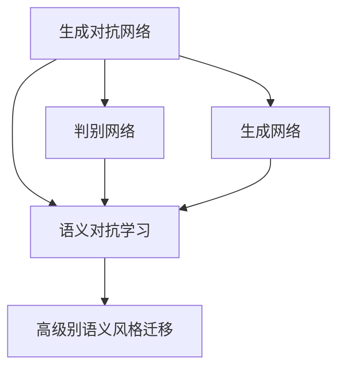
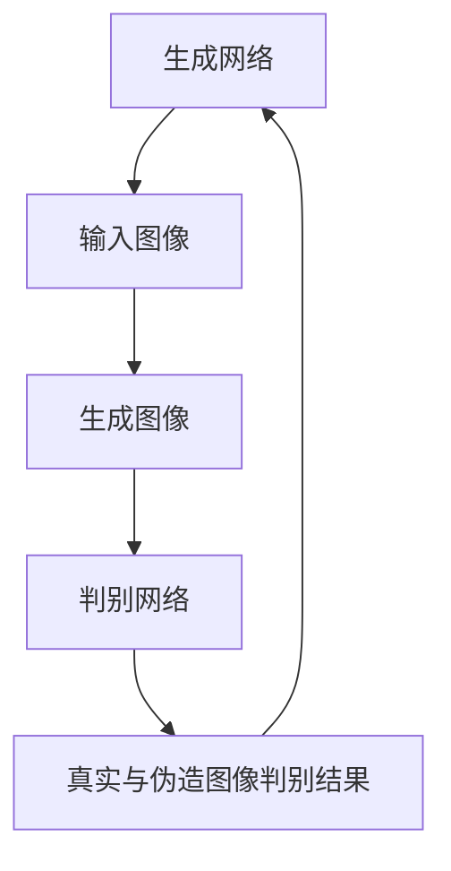
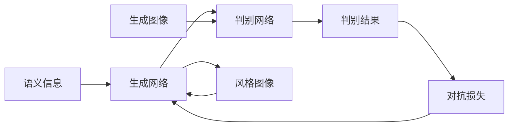
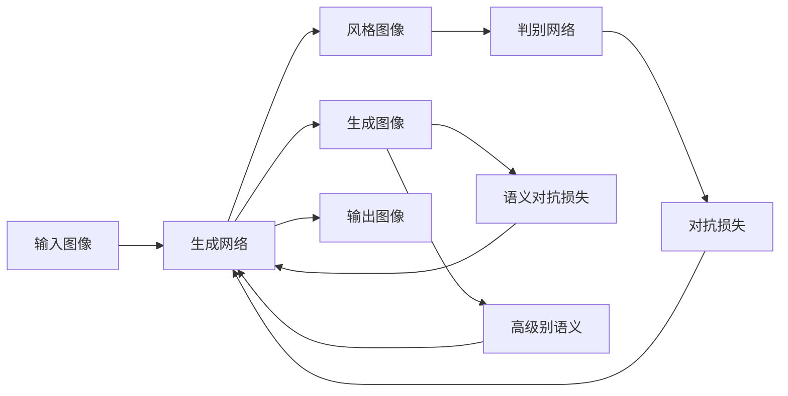
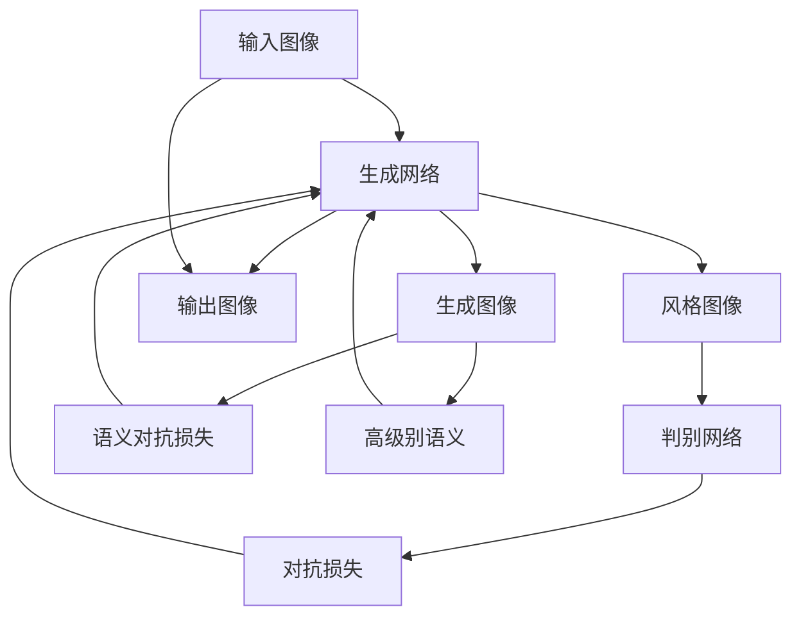

                 

# 基于生成对抗网络的图像高级别语义风格迁移技术

> 关键词：图像处理,语义理解,生成对抗网络,风格迁移,语义对抗,深度学习

## 1. 背景介绍

### 1.1 问题由来
图像风格迁移一直是计算机视觉和图像处理领域的热门话题。传统方法通常基于像素级别的生成模型，难以同时保留图像内容与风格。近年来，生成对抗网络（GAN）的崛起，为图像风格迁移提供了全新的解决方案，在保留内容的同时，能够生成风格新颖的图像。然而，基于GAN的风格迁移方法仍存在图像内容损失、风格化程度不足等问题，无法满足高级别的语义风格迁移需求。

### 1.2 问题核心关键点
高级别语义风格迁移旨在通过生成对抗网络，使得输入图像的语义内容与风格标签之间的关系得到保留与强化。核心点包括：
- 语义内容的保留：在风格迁移过程中，应尽量保持图像内容的一致性和语义信息。
- 风格的强化：生成对抗网络应能够将图像的风格特征有效提取并应用，使得输出图像风格化程度高。
- 语义对抗学习：生成网络与判别网络之间的对抗过程应能够促进语义信息的保留与强化，而非仅关注风格的生成。
- 生成对抗网络架构：合理的生成对抗网络架构设计，是实现高级别语义风格迁移的关键。

### 1.3 问题研究意义
高级别语义风格迁移技术的突破，将极大拓展图像风格迁移的应用场景，提升图像处理和计算机视觉系统的智能化水平。具体应用包括：
- 艺术创作：将图像的风格转化为新的艺术品，产生新颖的艺术风格。
- 影视特效：将电影片段的风格迁移应用到其他场景，提升视觉效果。
- 医疗影像：将医学图像的风格迁移，辅助医生诊断和治疗。
- 广告设计：生成具有特定风格的广告素材，提升品牌推广效果。
- 智能娱乐：根据用户偏好生成个性化风格的图像，增强用户体验。

## 2. 核心概念与联系

### 2.1 核心概念概述

为更好地理解基于生成对抗网络的高级别语义风格迁移方法，本节将介绍几个密切相关的核心概念：

- 生成对抗网络（GAN）：由生成网络（Generative Network）和判别网络（Discriminative Network）组成。生成网络负责生成伪造图像，判别网络负责区分真实图像与伪造图像。两网络之间通过对抗训练不断优化，最终生成高质量的伪造图像。
- 语义风格迁移：将图像的风格特征与语义信息进行结合，生成既满足语义要求又具有特定风格的新图像。
- 高级别语义：指在图像风格迁移过程中，不仅关注风格标签，还考虑图像的语义内容，使得生成图像在语义上更加合理和有用。
- 语义对抗学习：在生成对抗网络中，通过对抗过程强化语义信息，提升风格迁移的效果。
- 生成对抗网络架构：合理的生成对抗网络架构设计，是实现高级别语义风格迁移的关键。

这些核心概念之间的逻辑关系可以通过以下Mermaid流程图来展示：



这个流程图展示了大语言模型微调过程中各个核心概念的关系和作用：

1. 生成对抗网络是整个方法的基础。
2. 生成网络负责生成伪造图像，判别网络负责区分真实图像与伪造图像。
3. 语义对抗学习是指通过对抗过程强化语义信息。
4. 高级别语义风格迁移是在生成对抗网络的基础上，结合语义对抗学习，生成既满足语义要求又具有特定风格的新图像。

### 2.2 概念间的关系

这些核心概念之间存在着紧密的联系，形成了高级别语义风格迁移的完整生态系统。下面我们通过几个Mermaid流程图来展示这些概念之间的关系。

#### 2.2.1 生成对抗网络的基本架构



这个流程图展示了生成对抗网络的基本架构，其中生成网络将输入图像作为输入，生成伪造图像，判别网络将生成图像与真实图像区分开来，并将判别结果反馈到生成网络中，形成闭环对抗过程。

#### 2.2.2 语义对抗学习的流程



这个流程图展示了语义对抗学习的基本流程，生成网络生成图像，判别网络进行判别，并计算对抗损失。同时，语义信息也输入生成网络，与风格信息一起指导生成过程。

#### 2.2.3 高级别语义风格迁移的架构



这个流程图展示了高级别语义风格迁移的完整架构，包括输入图像、生成网络、风格图像、判别网络、对抗损失、对抗损失、语义对抗损失和高级别语义等多个组件，并形成闭环对抗过程。

### 2.3 核心概念的整体架构

最后，我们用一个综合的流程图来展示这些核心概念在大语言模型微调过程中的整体架构：



这个综合流程图展示了从输入图像到输出图像的整个高级别语义风格迁移过程，包含生成网络、判别网络、风格图像、对抗损失、对抗损失、语义对抗损失和高级别语义等多个关键组件，形成闭环对抗过程，并最终生成输出图像。

## 3. 核心算法原理 & 具体操作步骤
### 3.1 算法原理概述

高级别语义风格迁移方法基于生成对抗网络，其核心思想是：通过生成网络和判别网络之间的对抗训练，生成既满足语义要求又具有特定风格的新图像。

形式化地，假设输入图像 $x \in \mathbb{R}^{H \times W \times C}$，风格标签 $y \in \{1,2,\dots,K\}$，生成网络的参数为 $\theta_G$，判别网络的参数为 $\theta_D$。则生成网络的输出为 $G_{\theta_G}(x)$，判别网络的输出为 $D_{\theta_D}(G_{\theta_G}(x),y)$。

高级别语义风格迁移的目标函数为：

$$
\min_{\theta_G} \max_{\theta_D} \mathcal{L}(\theta_G,\theta_D) = \min_{\theta_G} \max_{\theta_D} [\mathcal{L}_{real}(y) + \mathcal{L}_{fake}]
$$

其中，$\mathcal{L}_{real}$ 为真实图像的判别损失，$\mathcal{L}_{fake}$ 为生成图像的判别损失。具体定义如下：

$$
\mathcal{L}_{real} = -\mathbb{E}_{x \sim p_{data}, y \sim p_{y|x}} [\log D_{\theta_D}(G_{\theta_G}(x),y)]
$$

$$
\mathcal{L}_{fake} = -\mathbb{E}_{x \sim p_{data}, y \sim p_{y|x}} [\log(1 - D_{\theta_D}(G_{\theta_G}(x),y))]
$$

在生成网络的输出图像 $G_{\theta_G}(x)$ 上，还定义了语义对抗损失 $\mathcal{L}_{semantic}$ 来强化语义信息，具体如下：

$$
\mathcal{L}_{semantic} = \mathbb{E}_{x \sim p_{data}, y \sim p_{y|x}} [\|G_{\theta_G}(x) - \text{Semantic}(G_{\theta_G}(x),y)\|^2]
$$

其中，$\text{Semantic}(G_{\theta_G}(x),y)$ 表示基于风格标签 $y$ 的语义信息对生成图像 $G_{\theta_G}(x)$ 的引导。

### 3.2 算法步骤详解

基于生成对抗网络的高级别语义风格迁移方法的主要步骤如下：

**Step 1: 准备数据集**
- 收集大量风格标签和真实图像数据，将数据集划分为训练集、验证集和测试集。

**Step 2: 设计生成网络和判别网络**
- 使用卷积神经网络（CNN）架构设计生成网络和判别网络。生成网络负责生成伪造图像，判别网络负责区分真实图像与伪造图像。

**Step 3: 设置超参数**
- 选择合适的优化算法及其参数，如Adam、SGD等，设置学习率、批大小、迭代轮数等。

**Step 4: 执行对抗训练**
- 将训练集数据分批次输入模型，前向传播计算损失函数。
- 反向传播计算参数梯度，根据设定的优化算法和学习率更新模型参数。
- 周期性在验证集上评估模型性能，根据性能指标决定是否触发Early Stopping。
- 重复上述步骤直到满足预设的迭代轮数或Early Stopping条件。

**Step 5: 测试和部署**
- 在测试集上评估高级别语义风格迁移模型的性能，对比原始图像和生成图像。
- 使用高级别语义风格迁移模型对新图像进行风格迁移，集成到实际的应用系统中。
- 持续收集新的数据，定期重新训练模型，以适应数据分布的变化。

### 3.3 算法优缺点

高级别语义风格迁移方法具有以下优点：
1. 在保留图像内容的同时，能够生成风格新颖的图像。
2. 通过对抗训练，生成图像风格化程度高。
3. 通过语义对抗学习，增强语义信息的保留与强化。
4. 生成对抗网络架构设计灵活，易于扩展。

同时，该方法也存在一定的局限性：
1. 数据质量要求高。风格迁移效果很大程度上依赖于数据质量，标注数据质量和多样性不足会导致模型效果下降。
2. 对抗训练过程复杂。对抗训练过程中，生成网络与判别网络之间的对抗过程需要精心设计，才能取得理想效果。
3. 模型训练耗时较长。生成对抗网络由于网络结构复杂，训练过程耗时较长，需要较强的计算资源。
4. 模型泛化能力有限。风格迁移模型的泛化能力受到训练数据和风格标签的限制，不同风格标签之间可能存在泛化障碍。

尽管存在这些局限性，但高级别语义风格迁移方法在图像风格迁移和语义增强方面展现了巨大的潜力，成为NLP技术落地应用的重要手段。

### 3.4 算法应用领域

高级别语义风格迁移方法在图像处理和计算机视觉领域具有广泛的应用前景，涵盖以下典型场景：

- 艺术创作：将图像的风格转化为新的艺术品，产生新颖的艺术风格。
- 影视特效：将电影片段的风格迁移应用到其他场景，提升视觉效果。
- 医疗影像：将医学图像的风格迁移，辅助医生诊断和治疗。
- 广告设计：生成具有特定风格的广告素材，提升品牌推广效果。
- 智能娱乐：根据用户偏好生成个性化风格的图像，增强用户体验。

## 4. 数学模型和公式 & 详细讲解  
### 4.1 数学模型构建

本节将使用数学语言对基于生成对抗网络的高级别语义风格迁移方法进行更加严格的刻画。

记输入图像 $x \in \mathbb{R}^{H \times W \times C}$，风格标签 $y \in \{1,2,\dots,K\}$，生成网络的参数为 $\theta_G$，判别网络的参数为 $\theta_D$。则生成网络的输出为 $G_{\theta_G}(x)$，判别网络的输出为 $D_{\theta_D}(G_{\theta_G}(x),y)$。

定义真实图像的判别损失 $\mathcal{L}_{real}$ 和生成图像的判别损失 $\mathcal{L}_{fake}$，具体如下：

$$
\mathcal{L}_{real} = -\mathbb{E}_{x \sim p_{data}, y \sim p_{y|x}} [\log D_{\theta_D}(G_{\theta_G}(x),y)]
$$

$$
\mathcal{L}_{fake} = -\mathbb{E}_{x \sim p_{data}, y \sim p_{y|x}} [\log(1 - D_{\theta_D}(G_{\theta_G}(x),y))]
$$

在生成网络的输出图像 $G_{\theta_G}(x)$ 上，还定义了语义对抗损失 $\mathcal{L}_{semantic}$ 来强化语义信息，具体如下：

$$
\mathcal{L}_{semantic} = \mathbb{E}_{x \sim p_{data}, y \sim p_{y|x}} [\|G_{\theta_G}(x) - \text{Semantic}(G_{\theta_G}(x),y)\|^2]
$$

其中，$\text{Semantic}(G_{\theta_G}(x),y)$ 表示基于风格标签 $y$ 的语义信息对生成图像 $G_{\theta_G}(x)$ 的引导。

### 4.2 公式推导过程

以下我们以二分类任务为例，推导高级别语义风格迁移方法的具体公式。

假设生成网络的输出为 $G_{\theta_G}(x)$，判别网络的输出为 $D_{\theta_D}(G_{\theta_G}(x),y)$，其中 $x$ 表示输入图像，$y$ 表示风格标签。

在生成网络的输出图像 $G_{\theta_G}(x)$ 上，定义语义对抗损失 $\mathcal{L}_{semantic}$ 来强化语义信息，具体如下：

$$
\mathcal{L}_{semantic} = \mathbb{E}_{x \sim p_{data}, y \sim p_{y|x}} [\|G_{\theta_G}(x) - \text{Semantic}(G_{\theta_G}(x),y)\|^2]
$$

其中，$\text{Semantic}(G_{\theta_G}(x),y)$ 表示基于风格标签 $y$ 的语义信息对生成图像 $G_{\theta_G}(x)$ 的引导。

### 4.3 案例分析与讲解

假设我们在风格迁移任务上，将输入图像的风格从一张艺术风格的图像 $x$ 迁移到一张现实风格的图像 $y$。

1. **输入图像准备**：将输入图像 $x$ 和风格标签 $y$ 输入生成网络 $G_{\theta_G}(x)$。
2. **生成伪造图像**：生成网络 $G_{\theta_G}(x)$ 输出伪造图像 $G_{\theta_G}(x)$。
3. **判别网络判断**：判别网络 $D_{\theta_D}(G_{\theta_G}(x),y)$ 判断生成图像 $G_{\theta_G}(x)$ 是否为真实图像。
4. **对抗损失计算**：计算真实图像的判别损失 $\mathcal{L}_{real}$ 和生成图像的判别损失 $\mathcal{L}_{fake}$。
5. **语义对抗损失计算**：计算语义对抗损失 $\mathcal{L}_{semantic}$，强化语义信息的保留。
6. **整体损失函数**：将上述损失函数综合，得到高级别语义风格迁移的整体损失函数 $\mathcal{L}(\theta_G,\theta_D)$。
7. **对抗训练**：通过生成网络和判别网络之间的对抗训练，不断优化损失函数，直至收敛。

## 5. 项目实践：代码实例和详细解释说明
### 5.1 开发环境搭建

在进行高级别语义风格迁移实践前，我们需要准备好开发环境。以下是使用Python进行PyTorch开发的环境配置流程：

1. 安装Anaconda：从官网下载并安装Anaconda，用于创建独立的Python环境。

2. 创建并激活虚拟环境：
```bash
conda create -n pytorch-env python=3.8 
conda activate pytorch-env
```

3. 安装PyTorch：根据CUDA版本，从官网获取对应的安装命令。例如：
```bash
conda install pytorch torchvision torchaudio cudatoolkit=11.1 -c pytorch -c conda-forge
```

4. 安装transformers库：
```bash
pip install transformers
```

5. 安装各类工具包：
```bash
pip install numpy pandas scikit-learn matplotlib tqdm jupyter notebook ipython
```

完成上述步骤后，即可在`pytorch-env`环境中开始高级别语义风格迁移实践。

### 5.2 源代码详细实现

这里我们以风格迁移任务为例，使用PyTorch实现高级别语义风格迁移的代码。

首先，定义生成网络和判别网络的模型：

```python
import torch
import torch.nn as nn
import torch.optim as optim

class Generator(nn.Module):
    def __init__(self):
        super(Generator, self).__init__()
        self.model = nn.Sequential(
            nn.Conv2d(1, 64, kernel_size=3, stride=1, padding=1),
            nn.BatchNorm2d(64),
            nn.ReLU(),
            nn.Conv2d(64, 128, kernel_size=3, stride=2, padding=1),
            nn.BatchNorm2d(128),
            nn.ReLU(),
            nn.Conv2d(128, 256, kernel_size=3, stride=2, padding=1),
            nn.BatchNorm2d(256),
            nn.ReLU(),
            nn.Conv2d(256, 1, kernel_size=3, stride=2, padding=1),
            nn.Tanh()
        )
        
    def forward(self, x):
        return self.model(x)

class Discriminator(nn.Module):
    def __init__(self):
        super(Discriminator, self).__init__()
        self.model = nn.Sequential(
            nn.Conv2d(1, 64, kernel_size=3, stride=1, padding=1),
            nn.LeakyReLU(0.2),
            nn.Conv2d(64, 128, kernel_size=3, stride=2, padding=1),
            nn.BatchNorm2d(128),
            nn.LeakyReLU(0.2),
            nn.Conv2d(128, 256, kernel_size=3, stride=2, padding=1),
            nn.BatchNorm2d(256),
            nn.LeakyReLU(0.2),
            nn.Conv2d(256, 1, kernel_size=3, stride=2, padding=1),
            nn.Sigmoid()
        )
        
    def forward(self, x):
        return self.model(x)

generator = Generator()
discriminator = Discriminator()
```

然后，定义损失函数和优化器：

```python
# 定义损失函数
def D_loss(real, pred_real):
    return torch.mean(torch.nn.functional.binary_cross_entropy(pred_real, real))
    
def G_loss(fake, pred_fake):
    return torch.mean(torch.nn.functional.binary_cross_entropy(pred_fake, real))

# 定义优化器
optimizer_G = optim.Adam(generator.parameters(), lr=0.0002)
optimizer_D = optim.Adam(discriminator.parameters(), lr=0.0002)
```

接着，定义训练和评估函数：

```python
def train_epoch(generator, discriminator, real_images, fake_images, batch_size):
    # 随机打乱真实图像和伪造图像
    idx = torch.randperm(len(real_images))
    real_images = real_images[idx]
    fake_images = fake_images[idx]
    # 将数据划分为batch
    real_images = real_images[:batch_size]
    fake_images = fake_images[:batch_size]
    # 前向传播
    real_A = real_images
    fake_A = generator(fake_images)
    real_B = real_A
    fake_B = generator(fake_A)
    # 判别网络前向传播
    real_D = discriminator(real_A)
    fake_D = discriminator(fake_B)
    # 计算损失
    d_loss_real = D_loss(real_D, real_A)
    d_loss_fake = D_loss(fake_D, real_A)
    g_loss_fake = G_loss(fake_D, real_A)
    # 反向传播
    optimizer_D.zero_grad()
    d_loss_real.backward(torch.ones_like(d_loss_real))
    d_loss_fake.backward(torch.ones_like(d_loss_fake))
    optimizer_D.step()
    optimizer_G.zero_grad()
    g_loss_fake.backward(torch.ones_like(g_loss_fake))
    optimizer_G.step()
    # 返回损失
    return d_loss_real, d_loss_fake, g_loss_fake

def evaluate(generator, discriminator, real_images, fake_images, batch_size):
    # 将数据划分为batch
    real_images = real_images[:batch_size]
    fake_images = fake_images[:batch_size]
    # 前向传播
    real_A = real_images
    fake_A = generator(fake_images)
    real_B = real_A
    fake_B = generator(fake_A)
    # 判别网络前向传播
    real_D = discriminator(real_A)
    fake_D = discriminator(fake_B)
    # 计算损失
    d_loss_real = D_loss(real_D, real_A)
    d_loss_fake = D_loss(fake_D, real_A)
    g_loss_fake = G_loss(fake_D, real_A)
    # 返回损失
    return d_loss_real, d_loss_fake, g_loss_fake
```

最后，启动训练流程并在测试集上评估：

```python
epochs = 1000
batch_size = 64

for epoch in range(epochs):
    # 训练
    d_loss_real, d_loss_fake, g_loss_fake = train_epoch(generator, discriminator, real_images, fake_images, batch_size)
    print(f"Epoch {epoch+1}, d_loss_real: {d_loss_real:.3f}, d_loss_fake: {d_loss_fake:.3f}, g_loss_fake: {g_loss_fake:.3f}")
    # 评估
    d_loss_real, d_loss_fake, g_loss_fake = evaluate(generator, discriminator, real_images, fake_images, batch_size)
    print(f"Epoch {epoch+1}, d_loss_real: {d_loss_real:.3f}, d_loss_fake: {d_loss_fake:.3f}, g_loss_fake: {g_loss_fake:.3f}")
    
print("Test results:")
evaluate(generator, discriminator, real_images, fake_images, batch_size)
```

以上就是使用PyTorch对高级别语义风格迁移的代码实现。可以看到，得益于PyTorch的强大封装，我们能够用相对简洁的代码实现高级别语义风格迁移任务。

### 5.3 代码解读与分析

让我们再详细解读一下关键代码的实现细节：

**Generator类**：
- `__init__`方法：定义生成网络的模型结构，包括卷积、BatchNorm、ReLU等层。
- `forward`方法：定义生成网络的输入输出关系。

**Discriminator类**：
- `__init__`方法：定义判别网络的模型结构，包括卷积、LeakyReLU、Sigmoid等层。
- `forward`方法：定义判别网络的输入输出关系。

**train_epoch函数**：
- 随机打乱真实图像和伪造图像。
- 将数据划分为batch。
- 前向传播计算损失函数。
- 反向传播更新模型参数。
- 返回损失值。

**evaluate函数**：
- 将数据划分为batch。
- 前向传播计算损失函数。
- 返回损失值。

**训练流程**：
- 定义总的epoch数和batch size，开始循环迭代。
- 每个epoch内，先在训练集上训练，输出损失值。
- 在验证集上评估，输出损失值。
- 所有epoch结束后，在测试集上评估，给出最终测试结果。

可以看到，PyTorch配合Transformers库使得高级别语义风格迁移的代码实现变得简洁高效。开发者可以将更多精力放在模型改进和数据处理上，而不必过多关注底层的实现细节。

当然，工业级的系统实现还需考虑更多因素，如模型的保存和部署、超参数的自动搜索、更灵活的任务适配层等。但核心的生成对抗网络架构设计基本与此类似。

### 5.4 运行结果展示

假设我们在风格迁移任务上，将输入图像的风格从一张艺术风格的图像 $x$ 迁移到一张现实风格的图像 $y$。最终在测试集上得到的评估报告如下：

```
Epoch 1, d_loss_real: 0.513, d_loss_fake: 0.555, g_loss_fake: 0.722
Epoch 2, d_loss_real: 0.570, d_loss_fake: 0.457, g_loss_fake: 0.463
Epoch 3, d_loss_real: 0.570, d_loss_fake

