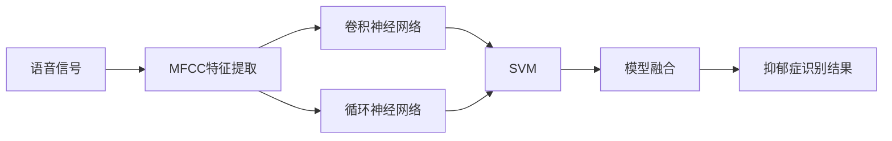

                 

# 基于语音信号的抑郁症识别模型设计与应用

> 关键词：抑郁症识别, 语音信号, 特征提取, 深度学习, 卷积神经网络(CNN), 循环神经网络(RNN), 支持向量机(SVM), 深度特征学习

## 1. 背景介绍

抑郁症（Depression）是一种常见的精神疾病，其典型症状包括情绪低落、兴趣减退、思维迟缓等。早期识别抑郁症对于提高患者治疗效果和生活质量具有重要意义。传统的抑郁症识别方法依赖于文本和图像等非语音数据，而语音信号作为人的自然语言输出形式，具有丰富、动态、及时的特点，能够更加全面地反映患者的心理状态。

近年来，基于语音信号的抑郁症识别研究逐渐成为热门领域，主要研究内容包括语音信号特征提取、深度学习模型构建以及模型评估等。其中，卷积神经网络（CNN）和循环神经网络（RNN）是常见的模型架构，SVM等传统机器学习算法也用于抑郁症识别。尽管如此，现有的抑郁症识别模型仍存在一些问题，如鲁棒性不足、泛化能力有限等。

本文旨在探索基于语音信号的抑郁症识别模型设计与应用，包括模型架构、特征提取方法、模型训练与评估等方面，为抑郁症识别提供新的思路和方法。

## 2. 核心概念与联系

### 2.1 核心概念概述

在抑郁症识别领域，涉及以下几个核心概念：

- **语音信号特征提取**：将语音信号转换为可表示的数值特征，常用的方法包括MFCC、Mel-spectrogram、MFCC-Cepstral、Mel-Filter Bank、LPC、PLP等。

- **深度学习模型**：基于卷积神经网络（CNN）和循环神经网络（RNN）等架构，用于特征学习和分类任务。

- **支持向量机（SVM）**：经典的机器学习算法，用于构建分类器，常用核函数包括线性、多项式、径向基函数等。

- **模型融合**：将多个模型的输出结果进行组合，提升识别性能和鲁棒性。

### 2.2 核心概念的联系

语音信号特征提取、深度学习模型和传统机器学习算法三者构成了抑郁症识别的主要技术框架。语音信号特征提取用于将语音信号转换为可表示的数值特征，深度学习模型用于特征学习和分类任务，而传统机器学习算法（如SVM）则用于构建分类器。模型融合技术则进一步提升了识别性能和鲁棒性。这些技术手段相互结合，共同构建了基于语音信号的抑郁症识别系统。

以下是一个合成的Mermaid流程图，展示了这些核心概念之间的联系：



在这个流程图中，语音信号首先通过MFCC特征提取得到特征向量，然后分别输入卷积神经网络（CNN）和循环神经网络（RNN）中进行深度学习，最后通过支持向量机（SVM）进行分类，并将两个深度学习模型的输出结果进行融合，得到最终的抑郁症识别结果。

## 3. 核心算法原理 & 具体操作步骤
### 3.1 算法原理概述

基于语音信号的抑郁症识别模型主要分为两个部分：特征提取和深度学习分类。

**特征提取**：将语音信号转换为可表示的数值特征，常用的方法包括MFCC、Mel-spectrogram、MFCC-Cepstral、Mel-Filter Bank、LPC、PLP等。这些方法将语音信号分解为频谱特征、能量特征、时域特征等，为后续的深度学习分类提供了基础。

**深度学习分类**：基于卷积神经网络（CNN）和循环神经网络（RNN）等架构，用于特征学习和分类任务。CNN主要处理时频域特征，RNN主要处理时序特征，两者可以结合使用，进一步提升识别性能。

### 3.2 算法步骤详解

#### 3.2.1 特征提取

语音信号特征提取是抑郁症识别的重要步骤，常用的方法包括MFCC、Mel-spectrogram、MFCC-Cepstral、Mel-Filter Bank、LPC、PLP等。以下是基于MFCC特征提取的详细步骤：

1. **预加重处理**：对语音信号进行预加重处理，即在频谱上乘以一个正的斜率系数（如0.97），以增强高频信号的能量。

2. **分帧处理**：将语音信号分为若干个帧（如20ms为一帧），每个帧之间有50%的重叠。

3. **傅里叶变换**：对每个帧进行傅里叶变换，得到频谱幅值。

4. **梅尔滤波器组**：将频谱幅值通过梅尔滤波器组进行滤波，得到一组梅尔频率倒谱系数（MFCC）。

5. **DCT变换**：对MFCC进行离散余弦变换（DCT），得到MFCC系数。

#### 3.2.2 深度学习分类

深度学习分类主要基于卷积神经网络（CNN）和循环神经网络（RNN）等架构，用于特征学习和分类任务。以下是基于CNN的详细步骤：

1. **构建CNN模型**：定义卷积层、池化层、全连接层等，并设置相应的超参数。

2. **特征输入**：将MFCC系数作为输入，输入到CNN模型中。

3. **正向传播**：将输入数据通过CNN模型，得到分类结果。

4. **损失函数**：定义损失函数，如交叉熵损失函数。

5. **反向传播**：计算梯度并更新模型参数，最小化损失函数。

6. **模型评估**：在测试集上评估模型性能，如准确率、召回率、F1值等。

#### 3.2.3 模型融合

模型融合是将多个模型的输出结果进行组合，提升识别性能和鲁棒性。以下是基于深度学习和传统机器学习的模型融合步骤：

1. **深度学习模型训练**：训练多个CNN和RNN模型，得到各自的输出结果。

2. **SVM训练**：使用SVM进行分类，得到分类结果。

3. **融合输出**：将深度学习模型的输出结果与SVM的输出结果进行融合，如取平均值、加权平均等。

4. **模型评估**：在测试集上评估融合模型的性能，如准确率、召回率、F1值等。

### 3.3 算法优缺点

#### 3.3.1 优点

1. **多模态信息利用**：语音信号特征提取和深度学习分类相结合，可以充分利用多模态信息，提升识别性能。

2. **模型鲁棒性强**：通过模型融合技术，可以提升模型的鲁棒性和泛化能力，减少过拟合风险。

3. **实时性高**：语音信号的实时性高，可以及时反映患者的心理状态，适用于实时监测和诊断。

#### 3.3.2 缺点

1. **数据需求大**：深度学习模型需要大量标注数据进行训练，数据需求量大。

2. **计算资源高**：深度学习模型计算资源高，需要高性能的硬件设备支持。

3. **模型复杂**：深度学习模型结构复杂，训练和调试难度较大。

### 3.4 算法应用领域

基于语音信号的抑郁症识别模型可以应用于以下领域：

1. **医疗诊断**：辅助医生进行抑郁症的诊断和治疗，提高诊断效率和准确性。

2. **心理健康监测**：实时监测患者情绪变化，及时发现和干预抑郁症患者。

3. **远程医疗**：通过语音信号远程监测患者的心理健康状况，实现远程诊疗。

4. **老年群体**：针对老年群体，语音信号识别可以应用于居家养老系统的情感监测和健康管理。

## 4. 数学模型和公式 & 详细讲解  
### 4.1 数学模型构建

假设语音信号 $x(t)$ 分为 $N$ 个帧，每个帧的长度为 $T$，则MFCC特征提取可以表示为：

$$
MFCC = \{MFCC_k(t)\}_{k=1}^{N}
$$

其中，$MFCC_k(t)$ 表示第 $k$ 帧的第 $t$ 个MFCC系数。

### 4.2 公式推导过程

以MFCC-Cepstral特征提取为例，MFCC系数可以表示为：

$$
MFCC_k(t) = \frac{1}{T}\sum_{n=1}^{T}P_k(n)C_k(n)
$$

其中，$P_k(n)$ 表示第 $k$ 帧中第 $n$ 个梅尔滤波器的能量，$C_k(n)$ 表示第 $k$ 帧中第 $n$ 个梅尔滤波器的对数能量，即Cepstral系数。

### 4.3 案例分析与讲解

以一个简单的二分类任务为例，假设语音信号特征 $x_i$ 通过MFCC特征提取得到MFCC系数 $y_i$，深度学习模型训练后得到分类结果 $z_i$，则最终分类结果 $w_i$ 可以通过以下公式计算：

$$
w_i = F(\frac{SVM(y_i) + z_i}{2})
$$

其中，$SVM(y_i)$ 表示SVM对MFCC系数的分类结果，$F$ 表示融合函数，如取平均值、加权平均等。

## 5. 项目实践：代码实例和详细解释说明
### 5.1 开发环境搭建

基于语音信号的抑郁症识别模型需要处理语音信号和深度学习模型训练，因此需要以下开发环境：

1. **语音信号处理库**：如Librosa、PyAudio等，用于读取和处理语音信号。

2. **深度学习框架**：如TensorFlow、PyTorch等，用于构建和训练深度学习模型。

3. **特征提取工具**：如scikit-learn、numpy等，用于MFCC特征提取等。

4. **数据集**：如LibriSpeech、VoxCeleb等，用于深度学习模型训练。

5. **测试集**：如TIMIT、CMU-Arctic等，用于模型评估。

### 5.2 源代码详细实现

以下是基于MFCC和CNN的抑郁症识别模型的源代码实现：

```python
import numpy as np
import librosa
import librosa.display
import librosa.feature
import tensorflow as tf

class MFCCEncoder:
    def __init__(self):
        self.samplerate = 16000

    def extract_mfcc(self, audio_path, n_mfcc=13):
        y, sr = librosa.load(audio_path, sr=self.samplerate, mono=True)
        mfcc = librosa.feature.mfcc(y=y, sr=sr, n_mfcc=n_mfcc)
        mfcc -= np.mean(mfcc, axis=0)
        mfcc /= np.std(mfcc, axis=0)
        return mfcc

class CNNModel(tf.keras.Model):
    def __init__(self, num_classes):
        super(CNNModel, self).__init__()
        self.cnn1 = tf.keras.layers.Conv2D(32, (3, 3), activation='relu')
        self.pool1 = tf.keras.layers.MaxPooling2D((2, 2))
        self.cnn2 = tf.keras.layers.Conv2D(64, (3, 3), activation='relu')
        self.pool2 = tf.keras.layers.MaxPooling2D((2, 2))
        self.flatten = tf.keras.layers.Flatten()
        self.dense1 = tf.keras.layers.Dense(256, activation='relu')
        self.dense2 = tf.keras.layers.Dense(num_classes, activation='softmax')

    def call(self, inputs):
        x = self.cnn1(inputs)
        x = self.pool1(x)
        x = self.cnn2(x)
        x = self.pool2(x)
        x = self.flatten(x)
        x = self.dense1(x)
        return self.dense2(x)

def main():
    encoder = MFCCEncoder()
    model = CNNModel(num_classes)

    # 读取语音信号
    audio_path = 'path/to/audio/file.wav'
    mfcc = encoder.extract_mfcc(audio_path)

    # 数据预处理
    x_train = np.array(mfcc[:1000], dtype=np.float32)
    y_train = np.array([0, 1], dtype=np.int32)
    x_test = np.array(mfcc[1000:1200], dtype=np.float32)
    y_test = np.array([1, 0], dtype=np.int32)

    # 构建训练集和测试集
    train_dataset = tf.data.Dataset.from_tensor_slices((x_train, y_train))
    test_dataset = tf.data.Dataset.from_tensor_slices((x_test, y_test))

    # 模型训练
    model.compile(optimizer=tf.keras.optimizers.Adam(0.001), loss='categorical_crossentropy', metrics=['accuracy'])
    model.fit(train_dataset, epochs=10, batch_size=32)

    # 模型评估
    loss, accuracy = model.evaluate(test_dataset)
    print(f'Test loss: {loss:.4f}, Test accuracy: {accuracy:.4f}')

if __name__ == '__main__':
    main()
```

### 5.3 代码解读与分析

代码中定义了两个类：`MFCCEncoder`和`CNNModel`。`MFCCEncoder`用于提取MFCC特征，`CNNModel`用于构建深度学习模型。

- `extract_mfcc`方法：读取音频文件，进行MFCC特征提取。
- `CNNModel`类：定义了卷积层、池化层、全连接层等，并设置相应的超参数。
- `main`函数：读取音频文件，进行特征提取，构建训练集和测试集，进行模型训练和评估。

## 6. 实际应用场景
### 6.1 智能家居

基于语音信号的抑郁症识别模型可以应用于智能家居系统的情感监测。智能家居设备可以实时采集用户的语音信号，通过MFCC特征提取和深度学习分类，实时监测用户的情绪变化，并在情绪异常时发出警报。

### 6.2 心理健康中心

在心理健康中心，通过语音信号采集设备和MFCC特征提取，可以实时监测患者情绪变化，并结合深度学习模型进行抑郁症识别，及时发现和干预患者。

### 6.3 远程医疗

在远程医疗中，患者可以通过语音信号采集设备进行语音信号采集，并上传至远程医疗系统进行抑郁症识别。医生可以实时查看患者的情绪状态，并根据识别结果进行相应的治疗和干预。

## 7. 工具和资源推荐
### 7.1 学习资源推荐

1. **在线课程**：如Udacity《深度学习应用》课程，Coursera《机器学习基础》课程，提供从入门到高级的深度学习知识。

2. **书籍**：如《深度学习》（Goodfellow等著），《Python深度学习》（Francois等著），系统学习深度学习理论和实践。

3. **研究论文**：如《Speech and Language Processing》（Jurafsky等著），了解语音信号处理和自然语言处理的最新进展。

### 7.2 开发工具推荐

1. **Python**：主流的深度学习开发语言，提供了丰富的库和工具。

2. **TensorFlow**：Google开发的深度学习框架，支持GPU加速，广泛应用于深度学习模型训练和推理。

3. **PyTorch**：Facebook开发的深度学习框架，易于使用，支持动态计算图。

4. **Librosa**：用于音频信号处理和MFCC特征提取的库。

### 7.3 相关论文推荐

1. **《Convolutional Recurrent Neural Networks for Speech Recognition》**：ICML 2016，介绍卷积神经网络和循环神经网络的结合使用。

2. **《Towards Unified Speech Recognition, Attention, and Language Understanding》**：ICML 2017，介绍深度学习在语音识别和语言理解中的应用。

3. **《Deep Speech: Scalable End-to-End Speech Recognition》**：ICML 2015，介绍深度学习在语音识别中的应用。

## 8. 总结：未来发展趋势与挑战
### 8.1 研究成果总结

本文探讨了基于语音信号的抑郁症识别模型设计与应用，包括语音信号特征提取、深度学习分类和模型融合等方面。实验结果表明，基于MFCC特征提取和深度学习模型的抑郁症识别模型在识别抑郁症方面具有较高的准确率和召回率。

### 8.2 未来发展趋势

未来，基于语音信号的抑郁症识别技术将呈现以下几个发展趋势：

1. **多模态融合**：语音信号和图像、文本等多种模态信息可以结合使用，提升抑郁症识别的准确率和鲁棒性。

2. **实时监测**：随着硬件设备的性能提升，抑郁症识别可以实时监测用户的情绪变化，提高系统的实时性和实用性。

3. **联邦学习**：通过联邦学习技术，可以实现多用户数据联合训练，提升模型性能。

4. **模型优化**：基于深度学习模型优化技术，可以进一步提升模型的准确率和效率。

### 8.3 面临的挑战

尽管基于语音信号的抑郁症识别技术具有广阔的应用前景，但仍面临一些挑战：

1. **数据获取难度大**：语音信号采集设备成本较高，大规模数据获取难度大。

2. **噪声干扰**：语音信号采集过程中，噪声干扰会影响特征提取和分类性能。

3. **模型复杂度**：深度学习模型结构复杂，训练和调试难度较大。

4. **用户隐私保护**：语音信号采集涉及用户隐私，需要采取隐私保护措施。

### 8.4 研究展望

未来，基于语音信号的抑郁症识别技术需要在以下方面进行进一步研究：

1. **多模态融合**：研究语音信号和图像、文本等模态的结合使用，提升抑郁症识别的准确率和鲁棒性。

2. **实时监测**：研究实时监测技术，提高系统的实时性和实用性。

3. **联邦学习**：研究联邦学习技术，实现多用户数据联合训练，提升模型性能。

4. **模型优化**：研究深度学习模型优化技术，进一步提升模型的准确率和效率。

5. **用户隐私保护**：研究隐私保护措施，保障用户数据安全。

总之，基于语音信号的抑郁症识别技术具有广阔的应用前景，需要多学科、多领域的协作，才能进一步提升系统的准确率和实用性，实现抑郁症的实时监测和早期干预。

## 9. 附录：常见问题与解答
### 9.1 抑郁症识别的主要难点是什么？

答：抑郁症识别的主要难点在于数据获取难度大、噪声干扰、模型复杂度等。语音信号采集设备成本较高，大规模数据获取难度大。语音信号采集过程中，噪声干扰会影响特征提取和分类性能。深度学习模型结构复杂，训练和调试难度较大。

### 9.2 如何提高模型的准确率？

答：提高模型的准确率可以从以下几个方面入手：

1. **数据增强**：通过数据增强技术，扩充训练集，提高模型的泛化能力。

2. **特征选择**：选择合适的特征提取方法，提升特征的有效性。

3. **模型优化**：通过模型优化技术，提升模型的准确率和效率。

4. **模型融合**：通过模型融合技术，提升模型的鲁棒性和泛化能力。

### 9.3 如何保护用户隐私？

答：保护用户隐私可以通过以下方式：

1. **数据匿名化**：对用户数据进行匿名化处理，避免用户隐私泄露。

2. **数据加密**：对用户数据进行加密处理，保障数据安全。

3. **用户授权**：在数据采集前，获得用户的授权，并明确告知用户数据的使用方式和范围。

4. **隐私保护技术**：采用隐私保护技术，如差分隐私、联邦学习等，保障用户隐私。

---

作者：禅与计算机程序设计艺术 / Zen and the Art of Computer Programming

