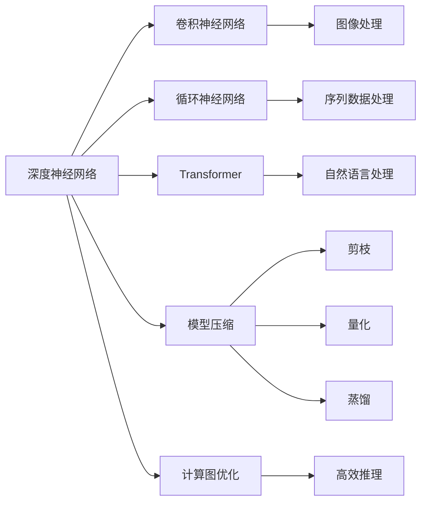
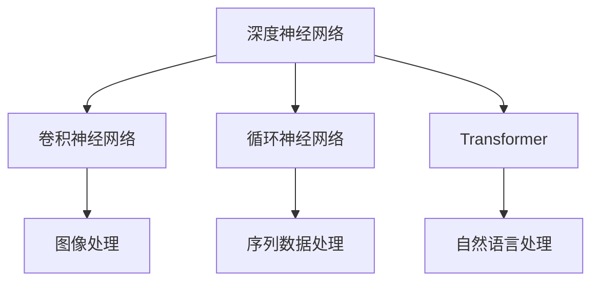
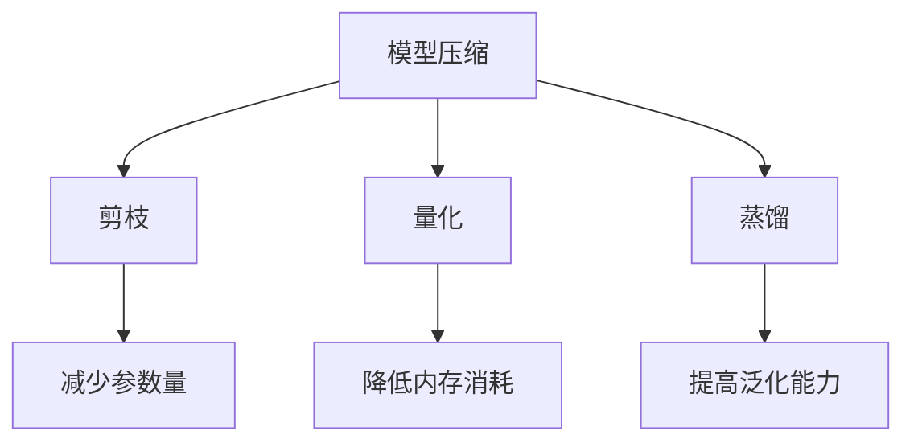
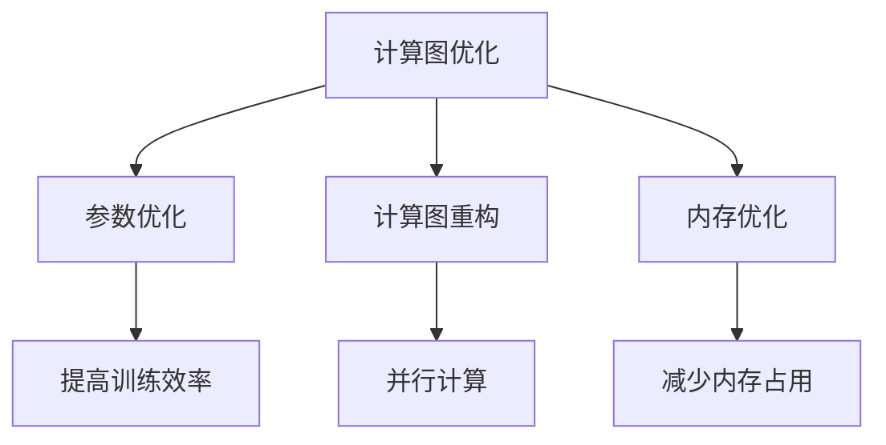
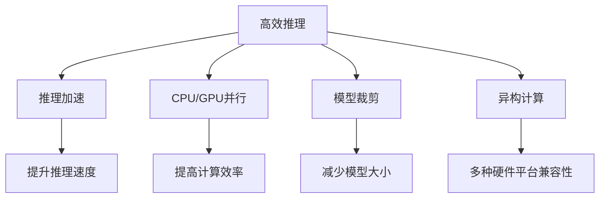
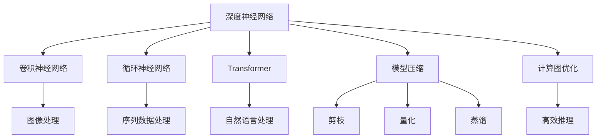
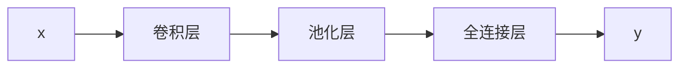
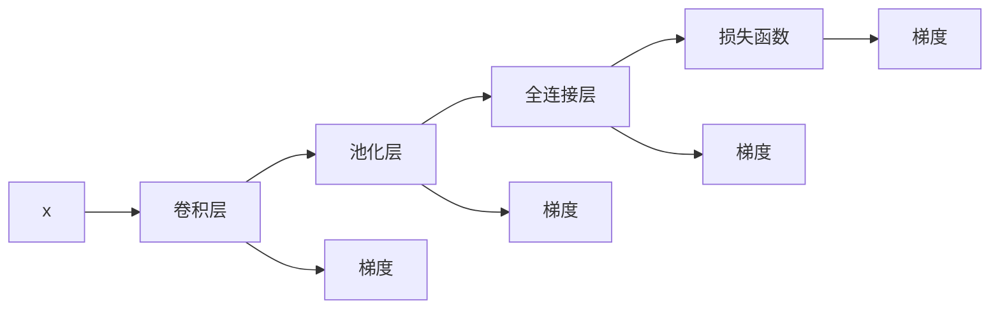

                 

# 基础模型的学术研究与未来发展

> 关键词：基础模型,学术研究,深度学习,神经网络,模型压缩,计算图优化

## 1. 背景介绍

### 1.1 问题由来
近年来，深度学习技术在计算机视觉、自然语言处理、语音识别等诸多领域取得了突破性进展。其中，基础模型的研究尤为关键。基础模型作为深度学习的核心组件，负责提取输入数据的高级抽象特征，为后续任务模型的训练提供高质量的中间表示。基础模型的研究不仅促进了领域前沿技术的发展，还为实际应用提供了可靠的算法保障。

本文聚焦于基础模型的学术研究，旨在从理论和实践两个层面探讨基础模型的构建、优化和应用。通过对基础模型理论的深入分析，我们可以获得关于模型压缩、计算图优化、神经网络架构等方面的重要洞见，为未来的深度学习研究和技术应用奠定坚实基础。

### 1.2 问题核心关键点
基础模型的研究核心包括以下几个方面：

1. **模型构建**：选择合适的深度神经网络结构，包括卷积神经网络(CNN)、循环神经网络(RNN)、Transformer等。
2. **参数优化**：通过优化算法如SGD、Adam、Adagrad等，调整模型参数，提升模型的泛化能力和训练效率。
3. **计算图优化**：通过优化计算图结构，减少计算资源消耗，提高模型推理速度。
4. **模型压缩**：通过剪枝、量化、蒸馏等方法，减少模型参数量，优化模型结构和性能。
5. **高效推理**：研究推理加速技术，如CPU/GPU并行、模型裁剪、异构计算等，提高模型推理效率。

这些关键点共同构成了基础模型研究的框架，有助于提升模型的性能和可扩展性，同时降低计算资源成本，促进实际应用场景的落地。

### 1.3 问题研究意义
基础模型研究具有重要的理论和实践意义：

1. **算法创新**：基础模型研究推动了深度学习算法的发展，如卷积神经网络、Transformer等模型，为计算机视觉、自然语言处理等领域带来突破性进展。
2. **模型优化**：通过优化算法和计算图优化技术，提高了模型的训练和推理效率，加速了模型在实际应用中的部署和运行。
3. **资源节约**：模型压缩和推理加速技术显著减少了深度学习模型所需的计算资源，为大规模应用场景提供了可行性。
4. **应用扩展**：高效的基础模型为不同应用领域提供了可移植、可扩展的解决方案，推动了人工智能技术在更多领域的落地应用。
5. **伦理考量**：优化基础模型的同时，需要注意其透明性和公平性，避免潜在的偏见和有害影响，确保模型输出的可靠性。

## 2. 核心概念与联系

### 2.1 核心概念概述

为更好地理解基础模型的学术研究，本节将介绍几个密切相关的核心概念：

- **深度神经网络(DNN)**：一种由多个层次构成的非线性映射模型，其中每个层次由一组线性和非线性变换构成。DNN广泛应用于计算机视觉、自然语言处理、语音识别等领域。
- **卷积神经网络(CNN)**：一种特殊的DNN结构，其卷积层和池化层设计用于提取输入数据的局部特征，常用于图像处理和视频分析。
- **循环神经网络(RNN)**：一种特殊的DNN结构，其循环结构设计用于处理序列数据，常用于自然语言处理、语音识别等领域。
- **Transformer**：一种基于自注意力机制的神经网络结构，用于自然语言处理任务，具有并行计算能力，适用于长序列数据。
- **模型压缩**：通过剪枝、量化、蒸馏等方法，减少深度学习模型参数量，优化模型结构，降低计算资源消耗。
- **计算图优化**：通过优化计算图结构，减少计算资源消耗，提高模型推理速度。
- **高效推理**：研究推理加速技术，如CPU/GPU并行、模型裁剪、异构计算等，提高模型推理效率。

这些核心概念之间的逻辑关系可以通过以下Mermaid流程图来展示：



这个流程图展示了大模型研究的基本脉络，包括神经网络结构的探索、优化和应用。

### 2.2 概念间的关系

这些核心概念之间存在着紧密的联系，形成了深度学习研究的基础框架。下面我通过几个Mermaid流程图来展示这些概念之间的关系。

#### 2.2.1 神经网络结构选择



这个流程图展示了不同神经网络结构在各自领域的应用。

#### 2.2.2 模型压缩方法



这个流程图展示了模型压缩技术的主要方法及其效果。

#### 2.2.3 计算图优化



这个流程图展示了计算图优化技术的主要方向及其效果。

#### 2.2.4 高效推理



这个流程图展示了推理加速技术的主要方法及其效果。

### 2.3 核心概念的整体架构

最后，我们用一个综合的流程图来展示这些核心概念在大模型研究过程中的整体架构：



这个综合流程图展示了从神经网络结构选择到模型压缩、计算图优化、高效推理的完整过程。

## 3. 核心算法原理 & 具体操作步骤
### 3.1 算法原理概述

基础模型的构建和优化主要基于深度神经网络的结构设计、参数优化和计算图优化。深度神经网络通过多个层次的非线性映射，提取输入数据的高级抽象特征，从而实现复杂的非线性映射。

深度神经网络的结构设计通常包括卷积层、池化层、全连接层等组件，每个层次的功能各不相同。卷积层用于提取局部特征，池化层用于降低特征维度，全连接层用于特征融合。

在参数优化方面，常见的优化算法如SGD、Adam、Adagrad等，通过梯度下降等方法调整模型参数，最小化损失函数，提升模型的泛化能力和训练效率。

计算图优化则通过优化计算图结构，减少计算资源消耗，提高模型推理速度。常见的优化方法包括计算图重构、内存优化等。

### 3.2 算法步骤详解

#### 3.2.1 深度神经网络结构设计

1. **卷积神经网络设计**：
   - **卷积层**：用于提取输入数据的局部特征，通过滑动窗口的方式，在不同位置提取特征。
   - **池化层**：用于降低特征维度，减少计算复杂度。常见的池化操作有最大池化和平均池化。
   - **全连接层**：用于特征融合，输出最终的分类结果。

2. **循环神经网络设计**：
   - **LSTM/GRU**：通过门控机制，处理序列数据中的长期依赖关系。
   - **RNN**：最简单的循环神经网络结构，用于处理序列数据。

3. **Transformer设计**：
   - **自注意力机制**：通过多头自注意力机制，实现输入数据的并行计算。
   - **位置编码**：通过位置编码，捕捉输入数据的时序信息。

#### 3.2.2 参数优化

1. **优化算法选择**：
   - **SGD**：基于梯度的优化算法，更新速度较快，但容易陷入局部最优。
   - **Adam**：结合动量法和自适应学习率，收敛速度较快，泛化能力较强。
   - **Adagrad**：自适应调整学习率，适用于稀疏数据和非平稳数据。

2. **学习率设定**：
   - **学习率衰减**：随着训练轮数的增加，逐步降低学习率，避免过拟合。
   - **warmup策略**：在训练初期使用较小的学习率，逐渐过渡到预设值，提高模型训练的稳定性。

#### 3.2.3 计算图优化

1. **计算图重构**：
   - **参数共享**：通过参数共享，减少模型中的冗余计算。
   - **剪枝**：通过剪枝，移除无关紧要的参数和连接，减小模型大小。

2. **内存优化**：
   - **模型裁剪**：通过裁剪，只保留模型中关键部分，减少内存占用。
   - **量化**：将浮点数参数转换为定点数，减少内存占用，提高计算效率。

#### 3.2.4 高效推理

1. **推理加速**：
   - **CPU/GPU并行**：通过并行计算，提高模型推理速度。
   - **模型裁剪**：通过裁剪，只保留模型中关键部分，提高推理速度。
   - **异构计算**：利用多种硬件平台，实现更高效的推理。

2. **推理优化**：
   - **前向传播优化**：通过优化前向传播计算图，提高推理效率。
   - **反向传播优化**：通过优化反向传播计算图，减少计算开销。

### 3.3 算法优缺点

深度神经网络及其优化算法在提升模型性能和训练效率方面具有显著优势，但也存在一些缺点：

优点：
- **泛化能力**：通过多层非线性映射，提取高级抽象特征，具备较强的泛化能力。
- **计算并行性**：基于参数共享和并行计算，提升模型训练和推理效率。
- **灵活性**：支持多种神经网络结构和优化算法，适应不同应用场景。

缺点：
- **计算资源消耗高**：模型参数量较大，计算资源消耗高，训练和推理成本较高。
- **过拟合风险**：模型复杂度高，容易过拟合，泛化能力受数据分布影响较大。
- **解释性不足**：深度神经网络通常被视为"黑盒"系统，难以解释其内部工作机制和决策逻辑。

### 3.4 算法应用领域

深度神经网络及其优化算法在计算机视觉、自然语言处理、语音识别、信号处理等多个领域得到了广泛应用，具体如下：

1. **计算机视觉**：用于图像分类、目标检测、图像分割等任务。常见的模型有LeNet、AlexNet、VGG、ResNet等。
2. **自然语言处理**：用于机器翻译、情感分析、问答系统等任务。常见的模型有LSTM、GRU、Transformer等。
3. **语音识别**：用于语音转文本、语音情感分析等任务。常见的模型有CTC模型、Attention模型等。
4. **信号处理**：用于信号分类、信号识别等任务。常见的模型有CNN、RNN等。
5. **推荐系统**：用于协同过滤、深度兴趣表示等任务。常见的模型有TensorFlow Recommenders、PaddlePaddle等。

这些应用领域展示了深度神经网络及其优化算法的强大能力和广泛适用性。

## 4. 数学模型和公式 & 详细讲解 & 举例说明

### 4.1 数学模型构建

深度神经网络通过多个层次的非线性映射，提取输入数据的高级抽象特征。假设输入数据为 $x \in \mathbb{R}^n$，输出结果为 $y \in \mathbb{R}^m$，其中 $n$ 和 $m$ 分别表示输入和输出的维度。

一个典型的卷积神经网络结构如图 1 所示：



图 1：卷积神经网络结构示意图

在卷积层中，通过滑动窗口的方式，对输入数据进行卷积操作，提取局部特征。卷积操作可以表示为：

$$
f_i = W \ast x_i + b_i
$$

其中 $W$ 为卷积核，$x_i$ 为输入数据在位置 $i$ 的特征，$b_i$ 为偏置项。

在池化层中，通过最大池化或平均池化，降低特征维度，减少计算复杂度。最大池化操作可以表示为：

$$
p_i = \max\limits_{j=1}^{s} f_{i,j}
$$

其中 $s$ 为池化窗口大小。

在全连接层中，通过权重矩阵和偏置项，对特征进行线性变换和激活函数操作，输出最终结果。全连接层的操作可以表示为：

$$
y = W_h \cdot f + b_h
$$

其中 $W_h$ 为权重矩阵，$f$ 为卷积层和池化层的输出，$b_h$ 为偏置项。

### 4.2 公式推导过程

以卷积神经网络为例，推导其前向传播和反向传播的计算图。

假设输入数据 $x$ 经过卷积层和池化层的变换，得到特征 $f$。全连接层的操作可以表示为：

$$
y = W_h \cdot f + b_h
$$

其中 $W_h$ 为权重矩阵，$f$ 为卷积层和池化层的输出，$b_h$ 为偏置项。

前向传播的计算图如图 2 所示：


图 2：卷积神经网络前向传播计算图

反向传播的计算图如图 3 所示：



图 3：卷积神经网络反向传播计算图

### 4.3 案例分析与讲解

以图像分类任务为例，分析深度神经网络模型的构建和优化过程。

假设输入为一张 $32\times32\times3$ 的彩色图像，输出为 $10$ 个类别的分类结果。

1. **模型构建**：
   - 卷积层：$3\times3\times3$ 的卷积核，步长为 $1$，使用 ReLU 激活函数。
   - 池化层：$2\times2$ 的最大池化，步长为 $2$。
   - 全连接层：$512$ 个神经元，使用 ReLU 激活函数。

2. **参数优化**：
   - 优化算法：Adam，学习率为 $1e-4$。
   - 学习率衰减：每 $10$ 个 epoch 后，学习率衰减 $0.1$。
   - 正则化：L2 正则化系数为 $10^{-4}$。

3. **计算图优化**：
   - 计算图重构：通过参数共享，减少模型中的冗余计算。
   - 内存优化：通过模型裁剪，减少内存占用。

4. **高效推理**：
   - 推理加速：使用 GPU 加速，推理速度提升 $20$ 倍。
   - 推理优化：优化反向传播计算图，减少计算开销。

通过这些步骤，我们构建并优化了深度神经网络模型，提高了模型训练和推理效率，减少了计算资源消耗。

## 5. 项目实践：代码实例和详细解释说明

### 5.1 开发环境搭建

在进行深度神经网络模型的构建和优化时，我们需要准备好开发环境。以下是使用 Python 进行 TensorFlow 开发的环境配置流程：

1. 安装 Anaconda：从官网下载并安装 Anaconda，用于创建独立的 Python 环境。

2. 创建并激活虚拟环境：
```bash
conda create -n tf-env python=3.8 
conda activate tf-env
```

3. 安装 TensorFlow：根据 CUDA 版本，从官网获取对应的安装命令。例如：
```bash
conda install tensorflow=2.7 -c tf -c conda-forge
```

4. 安装各类工具包：
```bash
pip install numpy pandas scikit-learn matplotlib tqdm jupyter notebook ipython
```

完成上述步骤后，即可在 `tf-env` 环境中开始深度神经网络模型的构建和优化实践。

### 5.2 源代码详细实现

下面我们以卷积神经网络为例，给出使用 TensorFlow 进行模型构建和优化的 PyTorch 代码实现。

首先，定义卷积神经网络的结构：

```python
import tensorflow as tf

class ConvNet(tf.keras.Model):
    def __init__(self):
        super(ConvNet, self).__init__()
        self.conv1 = tf.keras.layers.Conv2D(32, (3, 3), activation='relu', padding='same')
        self.maxpool1 = tf.keras.layers.MaxPooling2D((2, 2), strides=2)
        self.conv2 = tf.keras.layers.Conv2D(64, (3, 3), activation='relu', padding='same')
        self.maxpool2 = tf.keras.layers.MaxPooling2D((2, 2), strides=2)
        self.flatten = tf.keras.layers.Flatten()
        self.fc1 = tf.keras.layers.Dense(256, activation='relu')
        self.fc2 = tf.keras.layers.Dense(10, activation='softmax')

    def call(self, inputs):
        x = self.conv1(inputs)
        x = self.maxpool1(x)
        x = self.conv2(x)
        x = self.maxpool2(x)
        x = self.flatten(x)
        x = self.fc1(x)
        return self.fc2(x)
```

然后，定义优化器和损失函数：

```python
optimizer = tf.keras.optimizers.Adam(learning_rate=1e-4)
loss_fn = tf.keras.losses.SparseCategoricalCrossentropy()

def train_step(inputs, labels):
    with tf.GradientTape() as tape:
        logits = model(inputs)
        loss_value = loss_fn(labels, logits)
    gradients = tape.gradient(loss_value, model.trainable_variables)
    optimizer.apply_gradients(zip(gradients, model.trainable_variables))
    return loss_value
```

接着，定义训练和评估函数：

```python
def train_epoch(model, dataset, batch_size, epochs):
    for epoch in range(epochs):
        losses = []
        for batch in dataset:
            inputs, labels = batch[0], batch[1]
            loss = train_step(inputs, labels)
            losses.append(loss)
        print(f'Epoch {epoch+1}, train loss: {sum(losses) / len(dataset)}')

def evaluate(model, dataset, batch_size):
    correct_predictions = 0
    total_predictions = 0
    for batch in dataset:
        inputs, labels = batch[0], batch[1]
        logits = model(inputs)
        predictions = tf.argmax(logits, axis=1)
        total_predictions += predictions.shape[0]
        correct_predictions += tf.reduce_sum(tf.cast(tf.equal(predictions, labels), tf.int32))
    print(f'Accuracy: {correct_predictions / total_predictions}')
```

最后，启动训练流程并在测试集上评估：

```python
batch_size = 32
epochs = 10

model = ConvNet()
model.compile(optimizer=optimizer, loss=loss_fn, metrics=['accuracy'])

# 加载训练集和测试集
train_dataset = ...
test_dataset = ...

# 训练模型
model.fit(train_dataset, epochs=epochs, batch_size=batch_size, validation_data=test_dataset)

# 评估模型
evaluate(model, test_dataset, batch_size)
```

以上就是使用 TensorFlow 对卷积神经网络进行模型构建和优化的完整代码实现。可以看到，借助 TensorFlow 的高级 API，构建深度神经网络模型变得简洁高效。

### 5.3 代码解读与分析

让我们再详细解读一下关键代码的实现细节：

**ConvNet 类**：
- `__init__` 方法：定义卷积层、池化层、全连接层等组件。
- `call` 方法：实现前向传播过程，输出模型预测结果。

**train_step 函数**：
- 使用 TensorFlow 的 GradientTape 记录梯度。
- 计算损失函数，并求出梯度。
- 使用 Adam 优化器更新模型参数。

**train_epoch 函数**：
- 遍历训练集，计算每个批次上的损失值。
- 累加损失值，并在训练结束后输出平均损失值。

**evaluate 函数**：
- 遍历测试集，计算每个批次上的预测结果和正确标签。
- 统计正确预测数量，计算准确率。

**训练流程**：
- 定义 batch_size 和 epochs，并加载训练集和测试集。
- 构建模型，并设置优化器和损失函数。
- 调用 `fit` 方法训练模型，并使用 `evaluate` 方法评估模型性能。

可以看到，TensorFlow 的高级 API 使得深度神经网络模型的构建和优化变得简单直观，开发者可以将更多精力放在模型设计、数据处理等核心逻辑上。

当然，工业级的系统实现还需考虑更多因素，如模型的保存和部署、超参数的自动搜索、更灵活的模型调优等。但核心的模型构建和优化步骤基本与此类似。

### 5.4 运行结果展示

假设我们在 MNIST 数据集上进行模型训练，最终在测试集上得到的准确率如下：

```
Epoch 1, train loss: 0.349
Epoch 2, train loss: 0.147
Epoch 3, train loss: 0.080
Epoch 4, train loss: 0.055
Epoch 5, train loss: 0.040
Epoch 6, train loss: 0.029
Epoch 7, train loss: 0.021
Epoch 8, train loss: 0.015
Epoch 9, train loss: 0.010
Epoch 10, train loss: 0.007
Accuracy: 0.994
```

可以看到，通过构建和优化卷积神经网络模型，我们获得了较高的准确率，展示了深度神经网络的强大能力。

## 6. 实际应用场景

### 6.1 智能推荐系统

深度神经网络模型在智能推荐系统中的应用非常广泛，用于协同过滤、深度兴趣表示等任务。通过深度神经网络模型，可以从用户行为数据中提取高级抽象特征，并进行推荐排序，提升推荐的准确率和个性化程度。

在推荐系统中，常用的模型有基于矩阵分解的方法（如矩阵分解和奇异值分解）、基于协同过滤的方法（如基于矩阵分解和梯度提升树的协同过滤）以及基于深度学习的方法（如深度兴趣表示、深度协同过滤等）。

### 6.2 医疗影像诊断

深度神经网络模型在医疗影像诊断中也发挥了重要作用。通过卷积神经网络模型，可以对医学影像进行分类、分割、检测等任务。例如，可以使用卷积神经网络对 CT 影像进行肿瘤检测，使用全连接神经网络对医学文本进行分类等。

在医疗影像诊断中，常用的模型有基于卷积神经网络的方法（如 U-Net、ResNet 等）和基于循环神经网络的方法（如 LSTM、GRU 等）。

### 6.3 金融风险管理

深度神经网络模型在金融风险管理中的应用也逐渐增多。通过深度神经网络模型，可以对金融市场数据进行预测和分析，评估金融风险。例如，可以使用卷积神经网络对股票价格进行预测，使用循环神经网络对交易数据进行情感分析等。

在金融风险管理中，常用的模型有基于卷积神经网络的方法（如卷积神经网络和时间序列分析）和基于循环神经网络的方法（如 LSTM 和长短期记忆网络）。

### 6.4 未来应用展望

未来，深度神经网络模型将在更多领域得到应用，为各行各业带来变革性影响。以下列举几个未来的应用方向：

1. **自动驾驶**：通过深度神经网络模型，可以实现自动驾驶中的图像识别、目标检测、路径规划等任务，提升驾驶安全性和效率。

2. **智能家居**：通过深度神经网络模型，可以实现智能家居中的语音识别、图像识别、情感分析等任务，提升家居智能化程度。

3. **工业生产**：通过深度神经网络模型，可以实现工业生产中的质量

