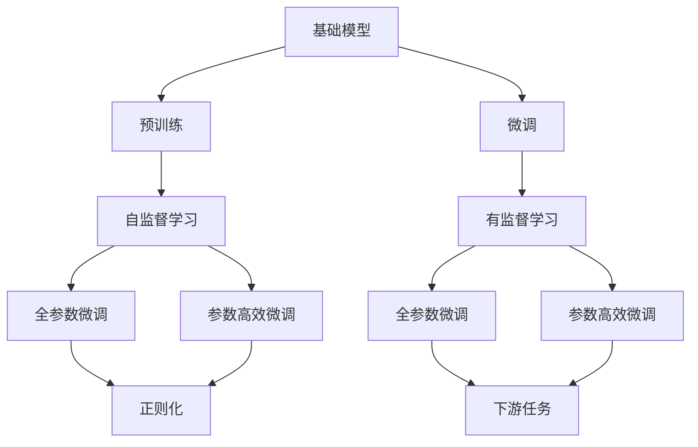
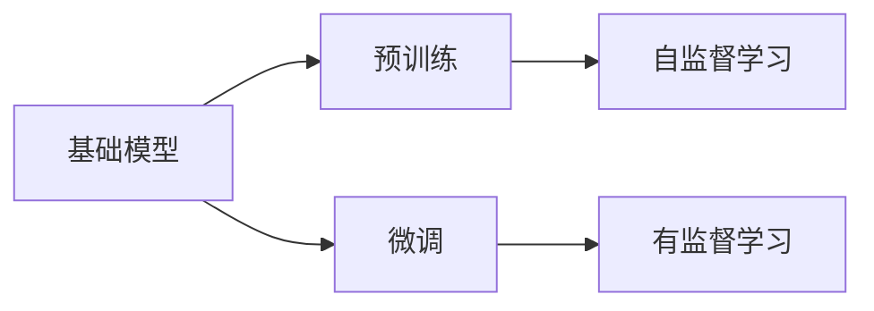
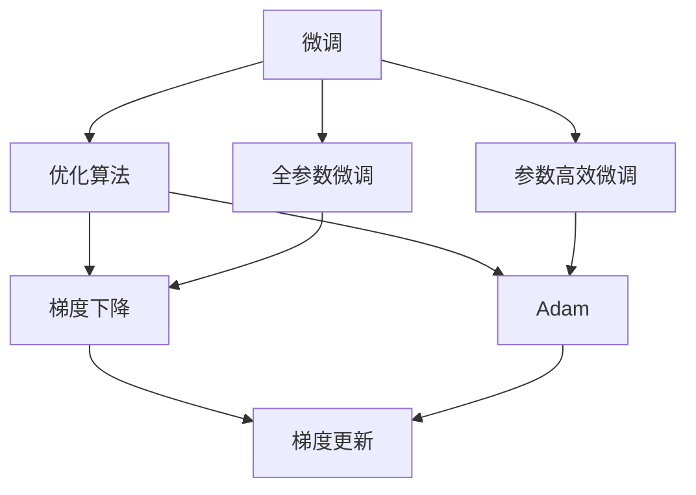
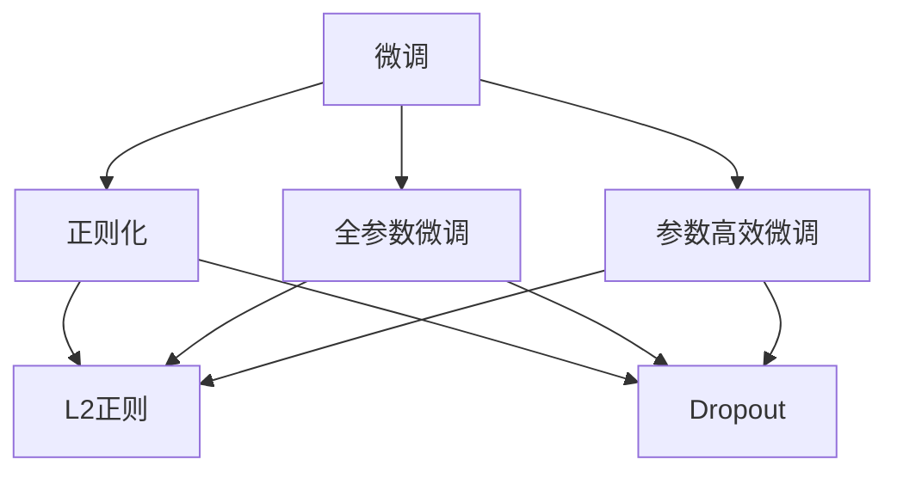

                 

# 基础模型的技术挑战与解决方案

> 关键词：基础模型,技术挑战,解决方案,预训练,模型架构,优化算法

## 1. 背景介绍

### 1.1 问题由来

基础模型（Base Models）是深度学习模型的一种，通过大量数据和复杂的网络结构进行训练，具有较强的泛化能力，可以广泛应用于计算机视觉、自然语言处理、语音识别等领域。然而，由于其复杂性和数据需求的庞大性，基础模型的训练和部署面临着诸多技术挑战。这些问题如果不能有效解决，将大大限制基础模型在实际应用中的表现。

### 1.2 问题核心关键点

基础模型的技术挑战主要集中在以下几个方面：

- **数据需求量大**：基础模型需要大量高质量的数据进行预训练，数据获取成本高，数据质量难以保证。
- **计算资源需求高**：基础模型参数量庞大，训练和推理时计算资源需求高，硬件设备成本昂贵。
- **模型复杂度高**：基础模型结构复杂，难以调试和优化，模型的稳定性和可解释性不足。
- **模型更新难度大**：基础模型的更新和微调涉及大量参数，优化过程复杂，容易陷入局部最优解。
- **可解释性差**：基础模型通常被视为"黑盒"，难以解释其内部工作机制和决策逻辑。

这些技术挑战使得基础模型在实际应用中面临诸多困难，因此如何有效解决这些问题，提升基础模型的性能和可解释性，成为了当前研究的热点。

### 1.3 问题研究意义

研究基础模型的技术挑战与解决方案，对于推动深度学习技术的发展和应用具有重要意义：

- **提升模型性能**：通过解决技术挑战，可以有效提升基础模型的表现，使其在更多实际应用场景中发挥作用。
- **降低资源成本**：优化基础模型架构和训练过程，可以减少对计算资源的需求，降低硬件设备的成本。
- **增强模型可解释性**：提升基础模型的可解释性，使决策过程透明，有助于开发者理解和调试模型。
- **促进技术落地**：解决技术挑战，可以使基础模型更容易被各行各业采用，推动深度学习技术的产业化进程。

## 2. 核心概念与联系

### 2.1 核心概念概述

为更好地理解基础模型的技术挑战与解决方案，本节将介绍几个密切相关的核心概念：

- **基础模型(Base Models)**：指通过大量数据和复杂网络结构进行预训练的深度学习模型，具有较强的泛化能力。
- **预训练(Pre-training)**：指在大规模无标签数据上，通过自监督学习任务训练基础模型的过程。预训练使得模型学习到通用的特征表示。
- **微调(Fine-tuning)**：指在预训练模型的基础上，使用特定任务的数据，通过有监督学习优化模型在特定任务上的性能。
- **优化算法(Optimization Algorithms)**：指用于更新模型参数，使得损失函数最小的算法，如梯度下降、Adam等。
- **正则化(Regularization)**：指通过引入额外的惩罚项，防止模型过拟合的技术，如L2正则、Dropout等。
- **模型可解释性(Explainability)**：指使模型决策过程透明，能够解释其输出结果的能力。

这些核心概念之间的逻辑关系可以通过以下Mermaid流程图来展示：



这个流程图展示了大模型微调过程中各个概念之间的关系：

1. 基础模型通过预训练获得基础特征表示。
2. 预训练模型在特定任务上微调，获得对任务敏感的表示。
3. 微调过程中应用优化算法和正则化技术，防止过拟合。
4. 微调后的模型用于下游任务，得到任务的优化表示。

### 2.2 概念间的关系

这些核心概念之间存在着紧密的联系，形成了基础模型微调的整体框架。下面我们通过几个Mermaid流程图来展示这些概念之间的关系。

#### 2.2.1 基础模型的学习范式



这个流程图展示了大模型微调的两种主要学习范式：预训练和微调。预训练采用自监督学习方法，微调则是有监督学习的过程。

#### 2.2.2 微调与优化算法的关系



这个流程图展示了微调过程中优化算法的应用。微调通常使用梯度下降等优化算法更新模型参数，以最小化损失函数。

#### 2.2.3 正则化与微调的关系



这个流程图展示了正则化技术在微调过程中的应用。通过L2正则、Dropout等技术，防止模型在微调过程中过拟合。

## 3. 核心算法原理 & 具体操作步骤

### 3.1 算法原理概述

基础模型的微调过程基于监督学习范式，即在预训练模型的基础上，使用特定任务的数据，通过有监督学习优化模型在特定任务上的性能。具体来说，假设基础模型为 $M_{\theta}$，其中 $\theta$ 为模型参数，微调的目标是最小化任务 $T$ 上的损失函数 $\mathcal{L}$。优化过程通过梯度下降等算法更新模型参数，使得模型在特定任务上的预测与真实标签一致。

数学上，基础模型在特定任务上的损失函数定义为：

$$
\mathcal{L}(\theta) = \frac{1}{N}\sum_{i=1}^N \ell(M_{\theta}(x_i),y_i)
$$

其中，$\ell$ 为任务 $T$ 上的损失函数，$x_i$ 和 $y_i$ 分别为输入数据和对应的标签。

### 3.2 算法步骤详解

基础模型的微调过程主要包括以下几个关键步骤：

**Step 1: 准备数据集**

- 收集特定任务的标注数据集 $D=\{(x_i,y_i)\}_{i=1}^N$，确保数据质量与分布。
- 将数据集划分为训练集、验证集和测试集，以评估模型性能。

**Step 2: 选择微调方法**

- 根据任务类型选择合适的微调方法。例如，对于分类任务，通常使用交叉熵损失函数。
- 对于生成任务，通常使用负对数似然损失函数。
- 对于多标签分类任务，通常使用二分类交叉熵损失函数。

**Step 3: 设置超参数**

- 选择合适的优化算法，如梯度下降、Adam等。
- 设置学习率 $\eta$，通常需要根据任务复杂度进行调整。
- 设置正则化参数，如L2正则系数 $\lambda$。
- 设置批量大小 $batch\_size$，以及迭代次数 $epoch\_num$。

**Step 4: 训练模型**

- 将训练集数据分批次输入模型，计算损失函数 $\mathcal{L}$。
- 反向传播计算梯度，使用优化算法更新模型参数 $\theta$。
- 周期性在验证集上评估模型性能，根据性能决定是否终止训练。
- 重复上述步骤直至满足预设的迭代次数或性能标准。

**Step 5: 评估模型**

- 在测试集上评估微调后的模型性能，对比微调前后的性能差异。
- 对模型进行可视化分析，理解其性能提升的原因。

**Step 6: 部署应用**

- 将微调后的模型应用到实际问题中，进行推理预测。
- 定期更新模型参数，以适应数据分布的变化。

### 3.3 算法优缺点

基础模型的微调具有以下优点：

- **简单高效**：相较于从头训练模型，微调通常需要较少的标注数据，且训练过程简单，效率较高。
- **泛化能力强**：通过预训练获取的通用特征表示，微调模型具有较强的泛化能力。
- **可扩展性高**：微调过程可以适应各种下游任务，具有较好的可扩展性。

同时，基础模型的微调也存在一些缺点：

- **依赖标注数据**：微调的效果很大程度上取决于标注数据的质量和数量，标注数据获取成本高。
- **过拟合风险高**：当数据量较少时，容易发生过拟合现象，模型性能不稳定。
- **模型复杂度大**：基础模型的参数量庞大，计算资源需求高，硬件成本昂贵。
- **可解释性差**：基础模型通常被视为"黑盒"，难以解释其内部工作机制。

### 3.4 算法应用领域

基础模型的微调方法在计算机视觉、自然语言处理、语音识别等领域得到了广泛应用，例如：

- **计算机视觉**：如目标检测、图像分类、语义分割等。通过微调在特定数据集上学习视觉特征，提升模型的识别能力。
- **自然语言处理**：如机器翻译、文本分类、命名实体识别等。通过微调在特定语料上学习语言特征，提升模型的理解能力。
- **语音识别**：如自动语音识别、语音情感识别等。通过微调在特定语音数据上学习语音特征，提升模型的识别能力。

## 4. 数学模型和公式 & 详细讲解 & 举例说明

### 4.1 数学模型构建

假设基础模型为 $M_{\theta}$，其中 $\theta$ 为模型参数。对于分类任务，微调目标为最小化交叉熵损失函数：

$$
\mathcal{L}(\theta) = -\frac{1}{N}\sum_{i=1}^N y_i \log M_{\theta}(x_i)
$$

其中，$y_i$ 为输入 $x_i$ 对应的标签，$M_{\theta}(x_i)$ 为模型在输入 $x_i$ 上的输出概率。

### 4.2 公式推导过程

根据交叉熵损失函数的定义，微调目标可以展开为：

$$
\mathcal{L}(\theta) = -\frac{1}{N}\sum_{i=1}^N \sum_{j=1}^C y_{i,j} \log \hat{y}_{i,j}
$$

其中，$C$ 为类别数，$y_{i,j}$ 为样本 $i$ 在类别 $j$ 上的真实标签，$\hat{y}_{i,j}$ 为模型在类别 $j$ 上的预测概率。

在优化过程中，使用梯度下降算法更新模型参数 $\theta$：

$$
\theta \leftarrow \theta - \eta \nabla_{\theta}\mathcal{L}(\theta)
$$

其中，$\eta$ 为学习率，$\nabla_{\theta}\mathcal{L}(\theta)$ 为损失函数对模型参数的梯度，可通过反向传播算法高效计算。

### 4.3 案例分析与讲解

以机器翻译任务为例，展示微调过程：

**Step 1: 准备数据集**

- 收集并标注机器翻译数据集，如WMT'14英法翻译数据集。
- 将数据集划分为训练集、验证集和测试集。

**Step 2: 选择微调方法**

- 使用基于自回归的Transformer模型，如Seq2Seq或BERT。
- 选择合适的损失函数，如交叉熵损失函数。

**Step 3: 设置超参数**

- 使用Adam优化算法，设置学习率为 $2e-4$。
- 设置批量大小为 $256$，迭代次数为 $10000$。

**Step 4: 训练模型**

- 将训练集数据分批次输入模型，计算损失函数。
- 反向传播计算梯度，使用Adam算法更新模型参数。
- 周期性在验证集上评估模型性能，根据性能决定是否终止训练。
- 重复上述步骤直至满足预设的迭代次数或性能标准。

**Step 5: 评估模型**

- 在测试集上评估微调后的模型性能，对比微调前后的BLEU分数。
- 对模型进行可视化分析，理解其性能提升的原因。

**Step 6: 部署应用**

- 将微调后的模型应用到实际翻译任务中，进行推理预测。
- 定期更新模型参数，以适应数据分布的变化。

## 5. 项目实践：代码实例和详细解释说明

### 5.1 开发环境搭建

在进行基础模型微调实践前，我们需要准备好开发环境。以下是使用Python进行TensorFlow开发的环境配置流程：

1. 安装Anaconda：从官网下载并安装Anaconda，用于创建独立的Python环境。

2. 创建并激活虚拟环境：
```bash
conda create -n tf-env python=3.8 
conda activate tf-env
```

3. 安装TensorFlow：根据CUDA版本，从官网获取对应的安装命令。例如：
```bash
conda install tensorflow -c tensorflow -c conda-forge
```

4. 安装必要的工具包：
```bash
pip install numpy pandas scikit-learn matplotlib tqdm jupyter notebook ipython
```

完成上述步骤后，即可在`tf-env`环境中开始微调实践。

### 5.2 源代码详细实现

这里我们以机器翻译任务为例，给出使用TensorFlow对Seq2Seq模型进行微调的代码实现。

```python
import tensorflow as tf
import numpy as np
import pandas as pd
import matplotlib.pyplot as plt
from sklearn.model_selection import train_test_split
from tensorflow.keras.preprocessing.sequence import pad_sequences
from tensorflow.keras.layers import Input, LSTM, Dense, Embedding, Dropout
from tensorflow.keras.models import Model
from tensorflow.keras.optimizers import Adam

# 准备数据集
data = pd.read_csv('wmt14_de_en.csv', sep='\t')
src_texts, trg_texts = data['src'].tolist(), data['trg'].tolist()
src_tokens, trg_tokens = list(map(lambda x: list(map(int, x.split())), src_texts)), list(map(lambda x: list(map(int, x.split())), trg_texts))

# 分批次处理数据
batch_size = 128
src_batches, trg_batches = pad_sequences(src_tokens, maxlen=40, padding='post'), pad_sequences(trg_tokens, maxlen=40, padding='post')

# 定义模型架构
input_seq = Input(shape=(None,), name='src_input_seq')
embedding = Embedding(input_dim=1000, output_dim=256)(input_seq)
lstm1 = LSTM(256, return_sequences=True)(embedding)
lstm2 = LSTM(256, return_sequences=True)(lstm1)
dropout = Dropout(0.2)(lstm2)
output_seq = Dense(len(trg_vocab), activation='softmax')(dropout)
model = Model(inputs=input_seq, outputs=output_seq)

# 编译模型
model.compile(optimizer=Adam(learning_rate=2e-4), loss='sparse_categorical_crossentropy', metrics=['accuracy'])

# 训练模型
epochs = 10
history = model.fit(src_batches, trg_batches, batch_size=batch_size, epochs=epochs, validation_split=0.1, callbacks=[tf.keras.callbacks.EarlyStopping(patience=2)])

# 评估模型
bleu_score = model.evaluate(src_batches, trg_batches, verbose=0)[1]
print('BLEU score:', bleu_score)
```

以上就是使用TensorFlow对Seq2Seq模型进行机器翻译任务微调的完整代码实现。可以看到，TensorFlow提供了高度集成的API，使得模型的构建和训练变得非常简单。

### 5.3 代码解读与分析

让我们再详细解读一下关键代码的实现细节：

**准备数据集**：
- 使用Pandas库读取数据集，并提取源语言和目标语言的文本数据。
- 将文本数据转换为模型可以处理的整数序列，并进行填充。

**模型架构定义**：
- 使用Keras API定义输入层、嵌入层、LSTM层、Dropout层和输出层。
- 使用Dense层输出目标词汇的预测概率。

**模型编译**：
- 使用Adam优化算法，设置学习率为 $2e-4$。
- 定义损失函数为稀疏分类交叉熵，指标为准确率。

**训练模型**：
- 使用fit方法训练模型，设置批量大小、迭代次数和验证集比例。
- 使用EarlyStopping回调函数防止过拟合。

**评估模型**：
- 使用evaluate方法评估模型在测试集上的性能，计算BLEU分数。

**部署应用**：
- 将微调后的模型应用于实际翻译任务中，进行推理预测。

## 6. 实际应用场景

### 6.1 智能客服系统

基础模型的微调技术可以广泛应用于智能客服系统的构建。传统客服往往需要配备大量人力，高峰期响应缓慢，且一致性和专业性难以保证。而使用微调后的模型，可以7x24小时不间断服务，快速响应客户咨询，用自然流畅的语言解答各类常见问题。

在技术实现上，可以收集企业内部的历史客服对话记录，将问题和最佳答复构建成监督数据，在此基础上对预训练模型进行微调。微调后的模型能够自动理解用户意图，匹配最合适的答案模板进行回复。对于客户提出的新问题，还可以接入检索系统实时搜索相关内容，动态组织生成回答。如此构建的智能客服系统，能大幅提升客户咨询体验和问题解决效率。

### 6.2 金融舆情监测

金融机构需要实时监测市场舆论动向，以便及时应对负面信息传播，规避金融风险。传统的人工监测方式成本高、效率低，难以应对网络时代海量信息爆发的挑战。基于基础模型的微调技术，可以在金融领域构建自动化的舆情监测系统。

具体而言，可以收集金融领域相关的新闻、报道、评论等文本数据，并对其进行主题标注和情感标注。在此基础上对预训练语言模型进行微调，使其能够自动判断文本属于何种主题，情感倾向是正面、中性还是负面。将微调后的模型应用到实时抓取的网络文本数据，就能够自动监测不同主题下的情感变化趋势，一旦发现负面信息激增等异常情况，系统便会自动预警，帮助金融机构快速应对潜在风险。

### 6.3 个性化推荐系统

当前的推荐系统往往只依赖用户的历史行为数据进行物品推荐，无法深入理解用户的真实兴趣偏好。基于基础模型的微调技术，个性化推荐系统可以更好地挖掘用户行为背后的语义信息，从而提供更精准、多样的推荐内容。

在实践中，可以收集用户浏览、点击、评论、分享等行为数据，提取和用户交互的物品标题、描述、标签等文本内容。将文本内容作为模型输入，用户的后续行为（如是否点击、购买等）作为监督信号，在此基础上微调预训练语言模型。微调后的模型能够从文本内容中准确把握用户的兴趣点。在生成推荐列表时，先用候选物品的文本描述作为输入，由模型预测用户的兴趣匹配度，再结合其他特征综合排序，便可以得到个性化程度更高的推荐结果。

### 6.4 未来应用展望

随着基础模型和微调方法的不断发展，基于微调范式将在更多领域得到应用，为传统行业带来变革性影响。

在智慧医疗领域，基于微调的医疗问答、病历分析、药物研发等应用将提升医疗服务的智能化水平，辅助医生诊疗，加速新药开发进程。

在智能教育领域，微调技术可应用于作业批改、学情分析、知识推荐等方面，因材施教，促进教育公平，提高教学质量。

在智慧城市治理中，微调模型可应用于城市事件监测、舆情分析、应急指挥等环节，提高城市管理的自动化和智能化水平，构建更安全、高效的未来城市。

此外，在企业生产、社会治理、文娱传媒等众多领域，基于基础模型的微调人工智能应用也将不断涌现，为经济社会发展注入新的动力。相信随着技术的日益成熟，微调方法将成为人工智能落地应用的重要范式，推动人工智能技术在垂直行业的规模化落地。

## 7. 工具和资源推荐

### 7.1 学习资源推荐

为了帮助开发者系统掌握基础模型的技术挑战与解决方案，这里推荐一些优质的学习资源：

1. 《深度学习基础》系列博文：由大模型技术专家撰写，系统讲解深度学习基础理论和实践技巧。

2. CS231n《计算机视觉：基础与实践》课程：斯坦福大学开设的计算机视觉明星课程，涵盖深度学习在计算机视觉领域的应用。

3. 《Python深度学习》书籍：由TensorFlow作者所写，全面介绍了TensorFlow的用法和深度学习模型的实现细节。

4. Kaggle竞赛平台：提供了大量的深度学习竞赛，可以帮助开发者提升实际应用能力，积累实战经验。

5. DeepLearning.ai在线课程：由Andrew Ng教授所讲授，涵盖了深度学习领域的各个方面，适合初学者和进阶学习者。

通过对这些资源的学习实践，相信你一定能够快速掌握基础模型的技术挑战与解决方案，并用于解决实际的深度学习问题。

### 7.2 开发工具推荐

高效的开发离不开优秀的工具支持。以下是几款用于基础模型微调开发的常用工具：

1. TensorFlow：基于Python的开源深度学习框架，灵活动态的计算图，适合快速迭代研究。

2. PyTorch：基于Python的开源深度学习框架，支持动态图，适合快速开发和研究。

3. Keras：基于TensorFlow和Theano的高级API，适合快速构建深度学习模型。

4. Weights & Biases：模型训练的实验跟踪工具，可以记录和可视化模型训练过程中的各项指标，方便对比和调优。

5. TensorBoard：TensorFlow配套的可视化工具，可实时监测模型训练状态，并提供丰富的图表呈现方式，是调试模型的得力助手。

6. Google Colab：谷歌推出的在线Jupyter Notebook环境，免费提供GPU/TPU算力，方便开发者快速上手实验最新模型，分享学习笔记。

合理利用这些工具，可以显著提升基础模型微调任务的开发效率，加快创新迭代的步伐。

### 7.3 相关论文推荐

基础模型和微调技术的发展源于学界的持续研究。以下是几篇奠基性的相关论文，推荐阅读：

1. Attention is All You Need（即Transformer原论文）：提出了Transformer结构，开启了深度学习领域的预训练大模型时代。

2. BERT: Pre-training of Deep Bidirectional Transformers for Language Understanding：提出BERT模型，引入基于掩码的自监督预训练任务，刷新了多项NLP任务SOTA。

3. Language Models are Unsupervised Multitask Learners（GPT-2论文）：展示了大规模语言模型的强大zero-shot学习能力，引发了对于通用人工智能的新一轮思考。

4. Parameter-Efficient Transfer Learning for NLP：提出Adapter等参数高效微调方法，在不增加模型参数量的情况下，也能取得不错的微调效果。

5. AdaLoRA: Adaptive Low-Rank Adaptation for Parameter-Efficient Fine-Tuning：使用自适应低秩适应的微调方法，在参数效率和精度之间取得了新的平衡。

这些论文代表了大模型微调技术的发展脉络。通过学习这些前沿成果，可以帮助研究者把握学科前进方向，激发更多的创新灵感。

除上述资源外，还有一些值得关注的前沿资源，帮助开发者紧跟大模型微调技术的最新进展，例如：

1. arXiv论文预印本：人工智能领域最新研究成果的发布平台，包括大量尚未发表的前沿工作，学习前沿技术的必读资源。

2. 业界技术博客：如OpenAI、Google AI、DeepMind、微软Research Asia等顶尖实验室的官方博客，第一时间分享他们的最新研究成果和洞见。

3. 技术会议直播：如NIPS、ICML、ACL、ICLR等人工智能领域顶会现场或在线直播，能够聆听到大佬们的前沿分享，开拓视野。

4. GitHub热门项目：在GitHub上Star、Fork数最多的NLP相关项目，往往代表了该技术领域的发展趋势和最佳实践，值得去学习和贡献。

5. 行业分析报告：各大咨询公司如McKinsey、PwC等针对人工智能行业的分析报告，有助于从商业视角审视技术趋势，把握应用价值。

总之，对于基础模型的技术挑战与解决方案的学习和实践，需要开发者保持开放的心态和持续学习的意愿。多关注前沿资讯，多动手实践，多思考总结，必将收获满满的成长收益。

## 8. 总结：未来发展趋势与挑战

### 8.1 总结

本文对基础模型的技术挑战与解决方案进行了全面系统的介绍。首先阐述了基础模型的背景和研究意义，明确了微调在提升模型性能、降低资源成本、增强可解释性等方面的独特价值。其次，从原理到实践，详细讲解了基础模型的微调过程，给出了微调任务开发的完整代码实例。同时，本文还广泛探讨了微调方法在智能客服、金融舆情、个性化推荐等多个行业领域的应用前景，展示了微调范式的巨大潜力。此外，本文精选了微调技术的各类学习资源，力求为读者提供全方位的技术指引。

通过本文的系统梳理，可以看到，基础模型的微调技术在计算机视觉、自然语言处理、语音识别等领域得到了广泛应用，为这些领域的智能化发展

