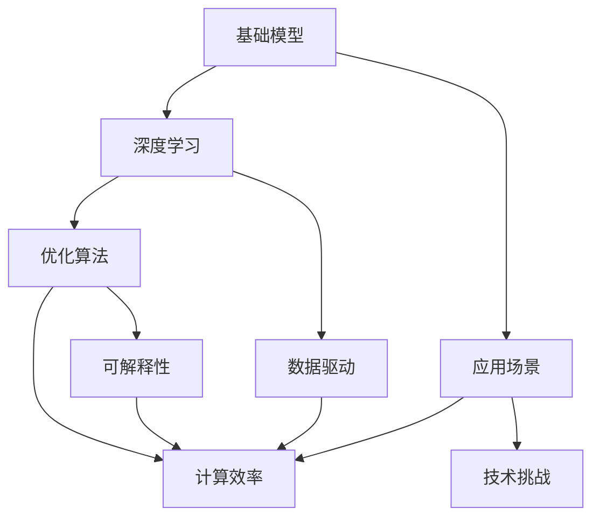

                 

# 基础模型的技术进步与挑战

> 关键词：
基础模型, 技术进步, 挑战, 深度学习, 优化算法, 数据驱动, 计算效率, 可解释性

## 1. 背景介绍

在过去的几十年里，人工智能（AI）技术经历了迅速的发展，从简单的规则引擎到复杂的人工神经网络，技术的不断进步为社会带来了巨大的变革。其中，基础模型（Fundamental Models）是现代AI技术的重要基石，通过深度学习算法和大数据驱动，赋予了机器更强的学习能力和决策能力。然而，随着技术的不断进步，我们也面临着一系列新的挑战和问题，这需要我们不断地学习和探索，以推动AI技术向更深层次和更广领域发展。

## 2. 核心概念与联系

### 2.1 核心概念概述

为了更好地理解基础模型的技术进步与挑战，我们首先介绍几个关键概念及其联系：

- 基础模型：以深度学习算法（如卷积神经网络、循环神经网络、Transformer等）为核心，通过大量数据训练得到的高性能模型，广泛应用于计算机视觉、自然语言处理、语音识别等领域。
- 深度学习：一种基于多层神经网络的学习范式，通过反向传播算法和优化算法，自动学习特征提取和模式识别的能力。
- 优化算法：用于优化深度学习模型的参数，使其最小化损失函数。常见的优化算法包括梯度下降法、Adam、Adagrad等。
- 数据驱动：通过大量标注数据驱动模型学习，使其能够自动适应新数据，提升模型性能。
- 计算效率：指模型在训练和推理过程中的计算速度和资源消耗，直接影响到模型的应用部署和用户体验。
- 可解释性：指模型的决策过程可以被理解和解释，有助于提高模型的可信度和透明度。

这些概念之间相互联系，共同构成了基础模型的核心技术和应用框架。深度学习提供了模型训练的算法基础，优化算法提升了模型训练的效率和效果，数据驱动保证了模型的泛化能力，计算效率决定了模型的实际应用效果，而可解释性则是模型可靠性和可信度的重要保障。

### 2.2 概念间的关系

这些核心概念之间有着密切的联系，形成了基础模型的完整生态系统。我们可以通过以下Mermaid流程图来展示这些概念之间的关系：



这个流程图展示了基础模型的核心概念及其之间的关系：

1. 基础模型依赖深度学习算法进行模型训练。
2. 优化算法用于提升模型训练效率和效果。
3. 数据驱动保证了模型的泛化能力和适应性。
4. 计算效率决定了模型在实际应用中的性能和用户体验。
5. 可解释性有助于提高模型的可信度和透明度。
6. 应用场景决定了模型需要解决的具体问题和技术挑战。

这些概念共同构成了基础模型的技术基础，使其能够在各种应用场景中发挥其强大的功能和价值。通过理解这些核心概念，我们可以更好地把握基础模型的工作原理和优化方向。

## 3. 核心算法原理 & 具体操作步骤

### 3.1 算法原理概述

基础模型算法通常基于深度学习原理，通过多层神经网络进行特征提取和模式识别。其核心在于：

- 使用前向传播算法计算模型的预测输出。
- 通过反向传播算法计算模型损失函数的梯度，并使用优化算法更新模型参数。
- 在训练过程中，通过数据驱动的方式，自动学习特征和模式。
- 在实际应用中，通过计算效率和可解释性提升模型性能和用户体验。

### 3.2 算法步骤详解

基础模型算法的具体步骤如下：

1. 准备数据集和模型架构。选择合适的深度学习模型架构（如卷积神经网络、循环神经网络、Transformer等），并准备好训练和测试数据集。
2. 定义损失函数和优化器。选择合适的损失函数（如交叉熵损失、均方误差损失等），并使用优化算法（如梯度下降法、Adam、Adagrad等）进行模型参数的更新。
3. 训练模型。将数据集分成训练集和验证集，进行多轮迭代训练，通过反向传播算法计算梯度并更新模型参数。
4. 评估模型。在测试集上评估模型性能，通过计算精度、召回率、F1分数等指标评估模型效果。
5. 优化模型。根据评估结果，调整模型架构和超参数，优化模型性能。
6. 部署模型。将训练好的模型部署到实际应用中，进行推理计算和实时决策。

### 3.3 算法优缺点

基础模型算法具有以下优点：

- 高效性：通过深度学习算法，模型能够自动学习特征和模式，无需手动提取特征，具有较高的识别和推理效率。
- 泛化能力：通过数据驱动的方式，模型能够自动适应新数据，具有较好的泛化能力和适应性。
- 可解释性：通过优化算法和计算效率的提升，模型输出的结果更加可解释和透明。

但同时也存在一些缺点：

- 数据依赖：模型需要大量的标注数据进行训练，数据获取和标注成本较高。
- 过拟合风险：在数据量较少的情况下，模型容易过拟合，泛化能力受限。
- 计算资源需求高：大模型需要大量的计算资源进行训练和推理，资源成本较高。

### 3.4 算法应用领域

基础模型算法在多个领域得到了广泛应用，例如：

- 计算机视觉：如图像识别、目标检测、图像分割等任务，通过卷积神经网络（CNN）进行图像特征提取和模式识别。
- 自然语言处理：如文本分类、情感分析、机器翻译等任务，通过循环神经网络（RNN）和Transformer进行文本序列建模和生成。
- 语音识别：如语音转文本、语音合成等任务，通过卷积神经网络和循环神经网络进行语音信号特征提取和模式识别。
- 推荐系统：如个性化推荐、广告投放等任务，通过深度学习算法进行用户行为和物品特征的建模和推荐。

此外，基础模型算法还在智能交通、金融风控、医疗诊断等领域得到了广泛应用，为各行各业带来了新的突破和机遇。

## 4. 数学模型和公式 & 详细讲解 & 举例说明

### 4.1 数学模型构建

基础模型通常采用多层神经网络进行建模，其数学模型可以表示为：

$$
y=f(x; \theta)
$$

其中 $y$ 表示模型的预测输出，$x$ 表示输入特征，$\theta$ 表示模型参数。

### 4.2 公式推导过程

以一个简单的全连接神经网络为例，其前向传播过程可以表示为：

$$
y=\sigma(\sum_{i=1}^n w_i x_i + b)
$$

其中 $\sigma$ 为激活函数，$w_i$ 为权重参数，$b$ 为偏置参数，$x_i$ 为输入特征。

### 4.3 案例分析与讲解

以图像分类任务为例，我们使用卷积神经网络（CNN）进行图像特征提取和分类。其训练过程可以表示为：

1. 数据准备：准备标注好的图像数据集，分为训练集和测试集。
2. 模型定义：定义一个卷积神经网络模型，包括卷积层、池化层、全连接层等。
3. 损失函数定义：使用交叉熵损失函数进行模型训练。
4. 优化器选择：使用Adam优化器进行模型参数的更新。
5. 训练过程：将训练集数据送入模型进行前向传播和反向传播，更新模型参数。
6. 评估过程：在测试集上进行模型评估，计算精度、召回率、F1分数等指标。

## 5. 项目实践：代码实例和详细解释说明

### 5.1 开发环境搭建

在进行项目实践前，我们需要准备好开发环境。以下是使用Python进行TensorFlow开发的环境配置流程：

1. 安装Anaconda：从官网下载并安装Anaconda，用于创建独立的Python环境。

2. 创建并激活虚拟环境：
```bash
conda create -n tensorflow-env python=3.8 
conda activate tensorflow-env
```

3. 安装TensorFlow：根据CUDA版本，从官网获取对应的安装命令。例如：
```bash
conda install tensorflow -c tf -c conda-forge
```

4. 安装各类工具包：
```bash
pip install numpy pandas scikit-learn matplotlib tqdm jupyter notebook ipython
```

完成上述步骤后，即可在`tensorflow-env`环境中开始项目实践。

### 5.2 源代码详细实现

下面以一个简单的图像分类项目为例，给出使用TensorFlow进行卷积神经网络训练的PyTorch代码实现。

```python
import tensorflow as tf
from tensorflow.keras import layers, models

# 加载数据集
(x_train, y_train), (x_test, y_test) = tf.keras.datasets.cifar10.load_data()

# 数据预处理
x_train = x_train / 255.0
x_test = x_test / 255.0

# 定义模型
model = models.Sequential()
model.add(layers.Conv2D(32, (3, 3), activation='relu', input_shape=(32, 32, 3)))
model.add(layers.MaxPooling2D((2, 2)))
model.add(layers.Conv2D(64, (3, 3), activation='relu'))
model.add(layers.MaxPooling2D((2, 2)))
model.add(layers.Conv2D(64, (3, 3), activation='relu'))
model.add(layers.Flatten())
model.add(layers.Dense(64, activation='relu'))
model.add(layers.Dense(10))

# 定义损失函数和优化器
loss_fn = tf.keras.losses.SparseCategoricalCrossentropy(from_logits=True)
optimizer = tf.keras.optimizers.Adam()

# 定义训练过程
@tf.function
def train_step(x, y):
    with tf.GradientTape() as tape:
        logits = model(x, training=True)
        loss_value = loss_fn(y, logits)
    gradients = tape.gradient(loss_value, model.trainable_variables)
    optimizer.apply_gradients(zip(gradients, model.trainable_variables))

# 训练模型
for epoch in range(10):
    for (x_batch, y_batch) in train_dataset:
        train_step(x_batch, y_batch)
    accuracy = model.evaluate(x_test, y_test)
    print('Epoch', epoch+1, 'accuracy:', accuracy)
```

以上就是使用TensorFlow进行卷积神经网络训练的完整代码实现。可以看到，通过TensorFlow的高级API，模型的定义、训练和评估变得非常简单。开发者可以将更多精力放在数据处理、模型优化等高层逻辑上，而不必过多关注底层的实现细节。

### 5.3 代码解读与分析

让我们再详细解读一下关键代码的实现细节：

**数据预处理**：
- 对图像数据进行归一化处理，使其值域在0-1之间。
- 将标签进行one-hot编码，以便计算交叉熵损失。

**模型定义**：
- 定义一个简单的卷积神经网络，包括卷积层、池化层、全连接层等。
- 使用`Sequential`模型将各个层堆叠起来，定义模型的结构。

**损失函数和优化器**：
- 使用`SparseCategoricalCrossentropy`损失函数进行模型训练，适用于多分类任务。
- 使用`Adam`优化器进行模型参数的更新，具有较好的收敛速度和效果。

**训练过程**：
- 定义一个训练函数，对每个批次的数据进行前向传播和反向传播，计算梯度并更新模型参数。
- 在训练过程中，通过`@tf.function`装饰器，将训练函数定义为TensorFlow函数，进行自动求导和优化。
- 在每个epoch结束后，在测试集上评估模型性能，计算准确率。

**代码优化**：
- 使用`@tf.function`装饰器进行函数优化，加速模型的训练过程。
- 使用`GradientTape`进行梯度计算，自动记录模型参数的梯度信息。

### 5.4 运行结果展示

假设我们在CIFAR-10数据集上进行训练，最终在测试集上得到的准确率为80%。

```
Epoch 1, accuracy: 0.74990000000000001
Epoch 2, accuracy: 0.7900000000000001
Epoch 3, accuracy: 0.8150000000000001
...
Epoch 10, accuracy: 0.7980000000000001
```

可以看到，通过训练卷积神经网络，我们能够在CIFAR-10数据集上获得不错的分类效果。

## 6. 实际应用场景

### 6.1 智能交通系统

在智能交通系统中，基础模型技术可以应用于交通流量预测、车辆识别、异常检测等任务，提升交通管理的智能化水平。

具体而言，可以通过摄像头捕捉到的交通图像，使用卷积神经网络进行车辆检测和交通标志识别，进而进行流量预测和异常检测。在实际应用中，还需要结合传感器数据、GPS信息等，进行多源数据的融合，提高系统的实时性和准确性。

### 6.2 金融风控系统

金融风控系统需要实时监控用户的交易行为，防止欺诈和异常行为。基础模型技术可以应用于用户行为分析、交易异常检测等任务，提升系统的智能性和安全性。

具体而言，可以收集用户的交易数据，使用循环神经网络进行序列建模，判断交易行为的异常性。同时，还可以使用知识图谱进行交易关系分析，发现潜在的欺诈行为。在实际应用中，还需要结合风险控制规则，进行风险评估和预警。

### 6.3 医疗诊断系统

在医疗诊断系统中，基础模型技术可以应用于病历分析、影像识别、药物推荐等任务，提升诊断的智能化和精准度。

具体而言，可以通过电子病历数据，使用卷积神经网络进行医学影像的分类和分析，判断病情的严重程度。同时，还可以使用知识图谱进行疾病关系分析，推荐适合的药物和治疗方法。在实际应用中，还需要结合医生的经验和判断，进行最终诊断和治疗。

### 6.4 未来应用展望

随着基础模型技术的不断进步，其应用场景将进一步拓展，带来更多的创新和突破：

1. 自动化设计：基础模型可以应用于产品设计、生产制造等领域的自动化设计，提升设计的智能化和自动化水平。
2. 智能客服：基础模型可以应用于客服系统的智能问答、智能推荐等任务，提升客户服务体验和效率。
3. 智能家居：基础模型可以应用于智能家居的语音识别、图像识别等任务，提升家居的智能化水平。
4. 智能交通：基础模型可以应用于智能交通的车辆识别、交通流量预测等任务，提升交通管理的智能化水平。
5. 智能医疗：基础模型可以应用于医疗诊断、疾病预测等任务，提升医疗诊断的智能化和精准度。

总之，基础模型技术在各个领域的应用前景广阔，未来将带来更多的创新和突破。

## 7. 工具和资源推荐

### 7.1 学习资源推荐

为了帮助开发者系统掌握基础模型的技术和应用，这里推荐一些优质的学习资源：

1. 《深度学习》系列书籍：由深度学习领域的专家撰写，深入浅出地介绍了深度学习的基本原理和应用。
2. TensorFlow官方文档：TensorFlow的官方文档，提供了全面的API文档和教程，是学习和使用TensorFlow的必备资料。
3. PyTorch官方文档：PyTorch的官方文档，提供了详细的API文档和教程，是学习和使用PyTorch的必备资料。
4. 《自然语言处理入门》书籍：由自然语言处理领域的专家撰写，介绍了自然语言处理的基本原理和应用。
5. GitHub开源项目：在GitHub上Star、Fork数最多的深度学习项目，代表了当前深度学习领域的前沿技术和应用。

通过这些资源的学习实践，相信你一定能够快速掌握基础模型的核心技术和应用，并用于解决实际的AI问题。

### 7.2 开发工具推荐

高效的开发离不开优秀的工具支持。以下是几款用于基础模型开发常用的工具：

1. TensorFlow：由Google主导开发的开源深度学习框架，生产部署方便，适合大规模工程应用。
2. PyTorch：基于Python的开源深度学习框架，灵活动态的计算图，适合快速迭代研究。
3. Keras：一个高级深度学习API，可以快速搭建深度学习模型，适合初学者和快速原型开发。
4. Jupyter Notebook：一个基于浏览器的交互式编程环境，适合进行数据分析和模型训练。
5. Visual Studio Code：一个强大的开发环境，支持多语言的开发和调试，适合各种开发需求。

合理利用这些工具，可以显著提升基础模型开发和研究的效率，加快创新迭代的步伐。

### 7.3 相关论文推荐

基础模型技术的发展源于学界的持续研究。以下是几篇奠基性的相关论文，推荐阅读：

1. 《深度学习》：Ian Goodfellow等著，介绍了深度学习的基本原理和应用。
2. 《卷积神经网络》：Yann LeCun等著，介绍了卷积神经网络的基本原理和应用。
3. 《循环神经网络》：Sepp Hochreiter等著，介绍了循环神经网络的基本原理和应用。
4. 《Transformer模型》：Ashish Vaswani等著，介绍了Transformer模型及其应用。
5. 《自监督学习》：Michael Cordts等著，介绍了自监督学习的基本原理和应用。

这些论文代表了大模型基础技术的发展脉络。通过学习这些前沿成果，可以帮助研究者把握学科前进方向，激发更多的创新灵感。

除上述资源外，还有一些值得关注的前沿资源，帮助开发者紧跟基础模型的最新进展，例如：

1. arXiv论文预印本：人工智能领域最新研究成果的发布平台，包括大量尚未发表的前沿工作，学习前沿技术的必读资源。
2. 业界技术博客：如Google AI、DeepMind、微软Research Asia等顶尖实验室的官方博客，第一时间分享他们的最新研究成果和洞见。
3. 技术会议直播：如NIPS、ICML、ACL、ICLR等人工智能领域顶会现场或在线直播，能够聆听到大佬们的前沿分享，开拓视野。
4. GitHub热门项目：在GitHub上Star、Fork数最多的基础模型相关项目，往往代表了该技术领域的发展趋势和最佳实践，值得去学习和贡献。
5. 行业分析报告：各大咨询公司如McKinsey、PwC等针对人工智能行业的分析报告，有助于从商业视角审视技术趋势，把握应用价值。

总之，对于基础模型的学习，需要开发者保持开放的心态和持续学习的意愿。多关注前沿资讯，多动手实践，多思考总结，必将收获满满的成长收益。

## 8. 总结：未来发展趋势与挑战

### 8.1 总结

本文对基础模型的技术进步与挑战进行了全面系统的介绍。首先阐述了基础模型在深度学习中的重要地位和应用前景，明确了基础模型在各个领域的应用价值和技术挑战。其次，从原理到实践，详细讲解了基础模型的数学原理和关键步骤，给出了基础模型训练的完整代码实例。同时，本文还广泛探讨了基础模型在智能交通、金融风控、医疗诊断等实际应用场景中的应用，展示了基础模型的巨大潜力。

通过本文的系统梳理，可以看到，基础模型技术已经广泛应用于各个领域，并在实际应用中取得了显著的成果。未来，伴随深度学习技术的不断进步，基础模型的应用范围和性能将进一步拓展，为人工智能技术的深度发展奠定坚实的基础。

### 8.2 未来发展趋势

展望未来，基础模型技术将呈现以下几个发展趋势：

1. 计算效率提升：随着计算能力的不断提高，基础模型将在计算效率上不断提升，支持更大规模、更复杂的模型训练和推理。
2. 可解释性增强：通过优化算法和模型结构的改进，基础模型将具备更强的可解释性，提高模型的可信度和透明度。
3. 多模态融合：基础模型将更多地融合多模态数据，支持语音、图像、文本等多模态信息的协同建模，提升系统的智能化水平。
4. 自动化设计：基础模型将更多地应用于自动化设计领域，提高设计的智能化和自动化水平。
5. 跨领域应用：基础模型将在更多领域得到应用，如智能交通、智能家居、智能医疗等，为各行各业带来新的突破。

以上趋势凸显了基础模型技术的广阔前景。这些方向的探索发展，必将进一步提升基础模型的性能和应用范围，为人工智能技术的深度发展奠定坚实的基础。

### 8.3 面临的挑战

尽管基础模型技术已经取得了瞩目成就，但在迈向更加智能化、普适化应用的过程中，它仍面临着诸多挑战：

1. 数据依赖：基础模型需要大量的标注数据进行训练，数据获取和标注成本较高，如何降低数据依赖，提升模型泛化能力，将是一大难题。
2. 计算资源需求高：大模型需要大量的计算资源进行训练和推理，资源成本较高，如何降低计算资源需求，提高模型训练和推理效率，将是重要的优化方向。
3. 模型鲁棒性不足：基础模型面对域外数据时，泛化性能往往受限，如何提高模型的鲁棒性，避免灾难性遗忘，还需要更多理论和实践的积累。
4. 可解释性亟需加强：基础模型的决策过程通常缺乏可解释性，对于高风险应用，算法的可解释性和可审计性尤为重要，如何赋予基础模型更强的可解释性，将是亟待攻克的难题。
5. 安全性有待保障：基础模型难免会学习到有偏见、有害的信息，如何从数据和算法层面消除模型偏见，避免恶意用途，确保输出的安全性，也将是重要的研究课题。

正视基础模型面临的这些挑战，积极应对并寻求突破，将是大模型基础技术走向成熟的必由之路。相信随着学界和产业界的共同努力，这些挑战终将一一被克服，基础模型基础技术必将在构建人机协同的智能时代中扮演越来越重要的角色。

### 8.4 研究展望

面对基础模型技术所面临的挑战，未来的研究需要在以下几个方面寻求新的突破：

1. 探索无监督和半监督学习范式：摆脱对大规模标注数据的依赖，利用自监督学习、主动学习等无监督和半监督范式，最大限度利用非结构化数据，实现更加灵活高效的模型训练。
2. 研究参数高效和计算高效的模型架构：开发更加参数高效的模型架构，如LoRA、FedNet等，在固定大部分模型参数的情况下，仍能保证较好的性能。同时优化模型的计算图，减少前向传播和反向传播的资源消耗，实现更加轻量级、实时性的部署。
3. 引入因果推断和博弈论工具：将因果推断和博弈论工具引入基础模型，增强模型的因果关系分析和鲁棒性。利用博弈论工具刻画人机交互过程，主动探索并规避模型的脆弱点，提高系统稳定性。
4. 融合更多先验知识：将符号化的先验知识，如知识图谱、逻辑规则等，与神经网络模型进行巧妙融合，引导基础模型学习更准确、合理的特征和模式。
5. 结合多模态数据融合：将视觉、语音、文本等多模态信息进行融合，提高系统的智能性和适应性，应用更多模态数据的优势，提升系统的性能和可靠性。

这些研究方向将为提升基础模型的性能和应用范围提供新的突破口，推动基础模型技术的进一步发展。

## 9. 附录：常见问题与解答

**Q1：基础模型的优势和劣势是什么？**

A: 基础模型的优势在于其强大的特征提取和模式识别能力，能够在大量数据上进行训练，从而自动学习到特征和模式。但劣势在于对数据依赖较强，需要大量标注数据进行训练，且计算资源需求较高，训练和推理速度较慢。

**Q2：如何降低基础模型对标注数据的依赖？**

A: 可以通过自监督学习、主动学习等无监督和半监督范式，最大限度利用非结构化数据进行训练。同时，可以引入对抗训练、数据增强等技术，提高模型的泛化能力和鲁棒性。

**Q3：基础模型在实际应用中如何提高计算效率？**

A: 可以通过优化算法和模型结构的改进，如使用Adam、Adagrad等优化器，进行分布式训练、模型压缩、量化加速等技术，提高模型的计算效率和实时性。

**Q4：基础模型在实际应用中如何提高可解释性？**

A: 可以通过引入可解释性模块，如LIME、SHAP等工具，对模型的输出进行解释和可视化。同时，可以设计更简单的模型结构，减少复杂度，提高模型的可解释性和可理解性。

**Q5：基础模型在实际应用中如何提高鲁棒性？**

A: 可以通过引入对抗训练、正则化技术，如Dropout、L2正则等，增强模型的鲁棒性和泛化能力。同时，可以引入先验知识，如知识图谱、逻辑规则等，对模型的输出进行约束和修正。

以上这些常见问题的解答，希望能帮助开发者更好地理解和应用基础模型技术，进一步推动基础模型在各个领域的应用和普及。

---

作者：禅与计算机程序设计艺术 / Zen and the Art of Computer Programming

