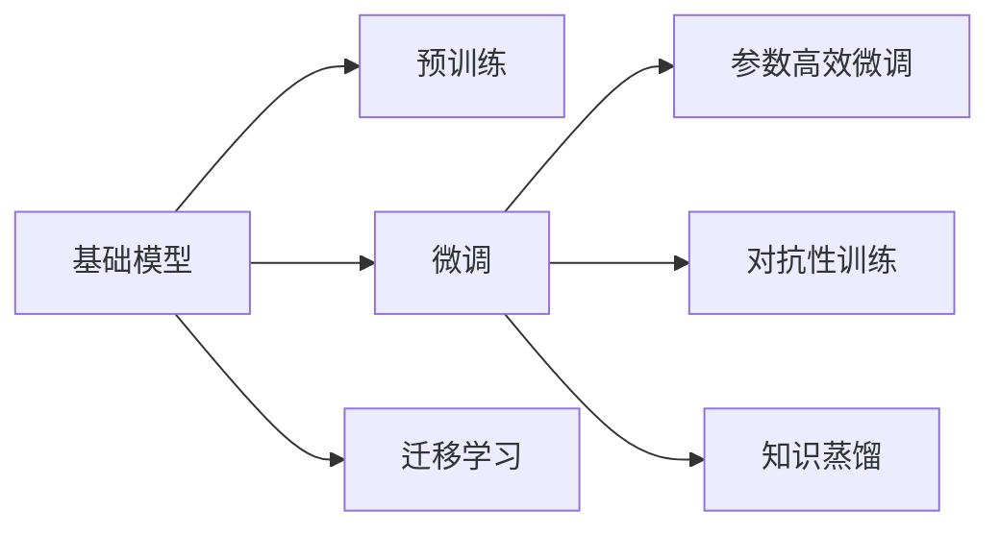

                 

## 1. 背景介绍

基础模型（Foundation Models）是在大规模数据上预训练的通用模型，具有泛化能力强、表征能力丰富的特点。它们的广泛应用带来了新的技术范式变革，在诸多领域展现出巨大的潜力和应用前景。本文将详细探讨基础模型的潜在应用，包括其在智能推理、自然语言处理（NLP）、计算机视觉（CV）、推荐系统、游戏AI等领域的深入挖掘和实践应用。

## 2. 核心概念与联系

### 2.1 核心概念概述

基础模型包括预训练语言模型（如BERT、GPT等）和预训练视觉模型（如ResNet、ViT等）。它们通过在大量数据上无监督地学习，获得了强大的泛化能力和语言/视觉表征能力，能够在不同的下游任务中进行微调，以获得更高的性能。

### 2.2 核心概念间的关系

基础模型与下游任务间的联系主要体现在以下几个方面：

- **预训练与微调**：基础模型通过预训练获得通用表征能力，而微调则是通过有标签的数据进一步优化这些表征，以适应特定任务。
- **迁移学习**：基础模型通过迁移学习，将已有的知识应用到新的任务上，降低新任务学习成本。
- **参数高效微调**：在微调过程中，基础模型通常采用参数高效方法，以减少资源消耗，提高微调效率。
- **对抗性训练**：通过对抗性训练，提升基础模型的鲁棒性，使其在面对噪声或攻击时仍能保持高精度。
- **知识蒸馏**：基础模型可以将知识蒸馏到小规模模型上，以提升小规模模型的性能。

这些概念构成了基础模型在下游应用的基本框架，如图1所示：



## 3. 核心算法原理 & 具体操作步骤
### 3.1 算法原理概述

基础模型的下游应用主要依赖于其在预训练阶段学到的通用表征能力。这些表征能力可以通过微调等有标签数据进一步优化，以适应特定任务。微调的目标是在基础模型的基础上，通过有标签的数据集进行优化，使得模型在特定任务上达到最优性能。

具体而言，微调过程包括以下几个关键步骤：

1. **数据准备**：准备下游任务的数据集，划分为训练集、验证集和测试集。
2. **模型选择**：选择合适的基础模型，作为微调的初始化参数。
3. **任务适配**：在基础模型顶部添加任务相关的输出层，并定义损失函数。
4. **超参数设置**：选择合适的优化算法及其参数，如学习率、批大小、迭代轮数等。
5. **模型训练**：使用下游任务的数据集进行训练，最小化损失函数。
6. **模型评估**：在测试集上评估模型性能，根据性能指标决定是否终止训练。

### 3.2 算法步骤详解

以BERT模型为例，其在自然语言处理（NLP）中的微调过程如下：

1. **数据准备**：收集包含特定NLP任务的标注数据集，将其划分为训练集、验证集和测试集。
2. **模型选择**：选择BERT模型作为微调的初始化参数。
3. **任务适配**：在BERT模型顶部添加线性分类器或解码器，并定义交叉熵损失函数。
4. **超参数设置**：设置AdamW优化器，学习率为2e-5，批大小为16，迭代轮数为10。
5. **模型训练**：使用下游任务的数据集进行训练，计算损失函数，并使用AdamW优化器更新模型参数。
6. **模型评估**：在测试集上评估模型性能，输出模型预测结果与真实标签的对比报告。

### 3.3 算法优缺点

**优点**：
- **高效**：通过预训练获得通用表征，微调过程中仅需要少量有标签数据，即可显著提升模型性能。
- **泛化性强**：基础模型经过大规模数据训练，具有强大的泛化能力，能够在不同任务间进行迁移学习。
- **可扩展性**：微调过程可以根据任务需求进行定制化，引入参数高效方法、对抗训练等优化策略，提升模型性能。

**缺点**：
- **数据依赖**：微调效果高度依赖于标注数据的质量和数量，获取高质量标注数据成本较高。
- **参数更新风险**：微调过程中，如果更新参数过多，可能会导致过拟合或损失大量预训练知识。
- **模型复杂度**：微调后的模型结构复杂，推理效率较低，需要优化模型结构以提升推理性能。

### 3.4 算法应用领域

基础模型的下游应用涉及多个领域，包括但不限于：

- **自然语言处理（NLP）**：基础模型在文本分类、命名实体识别、情感分析、问答系统等NLP任务中表现优异。
- **计算机视觉（CV）**：基础模型在图像分类、目标检测、图像生成、图像分割等CV任务中发挥重要作用。
- **推荐系统**：基础模型通过嵌入用户行为、物品属性等信息，进行个性化推荐，提升用户体验。
- **游戏AI**：基础模型在增强学习、游戏策略生成、游戏内容推荐等方面展现潜力。
- **智能推理**：基础模型在智能问答、知识图谱构建、逻辑推理等智能推理任务中，提供强大的推理能力。

## 4. 数学模型和公式 & 详细讲解  
### 4.1 数学模型构建

以BERT模型为例，其在自然语言处理（NLP）中的微调过程如下：

1. **输入表示**：将输入文本转换为BERT模型的嵌入向量，记为 $x_i$。
2. **任务表示**：将任务相关的标签转换为嵌入向量，记为 $y_i$。
3. **损失函数**：定义交叉熵损失函数，用于衡量模型预测与真实标签之间的差异，记为 $L(x_i,y_i)$。
4. **优化目标**：最小化损失函数，记为 $\min_{\theta} L(x_i,y_i)$。

### 4.2 公式推导过程

以BERT模型为例，其微调过程中的损失函数可以表示为：

$$
L(x_i,y_i) = -\frac{1}{N} \sum_{i=1}^{N} \sum_{j=1}^{K} y_{i,j} \log \sigma (\hat{y}_{i,j})
$$

其中，$y_{i,j}$ 表示输入文本 $x_i$ 与标签 $y_i$ 的对应关系，$\sigma$ 为sigmoid函数，$\hat{y}_{i,j}$ 为模型对 $y_{i,j}$ 的预测概率。

### 4.3 案例分析与讲解

以BERT模型在情感分析任务中的微调为例，可以按照以下步骤进行：

1. **数据准备**：收集情感分析任务的数据集，将其划分为训练集、验证集和测试集。
2. **模型选择**：选择BERT模型作为微调的初始化参数。
3. **任务适配**：在BERT模型顶部添加线性分类器，并定义交叉熵损失函数。
4. **超参数设置**：设置AdamW优化器，学习率为2e-5，批大小为16，迭代轮数为10。
5. **模型训练**：使用情感分析任务的数据集进行训练，计算损失函数，并使用AdamW优化器更新模型参数。
6. **模型评估**：在测试集上评估模型性能，输出模型预测结果与真实标签的对比报告。

## 5. 项目实践：代码实例和详细解释说明
### 5.1 开发环境搭建

在进行微调实践前，我们需要准备好开发环境。以下是使用Python进行PyTorch开发的环境配置流程：

1. 安装Anaconda：从官网下载并安装Anaconda，用于创建独立的Python环境。

2. 创建并激活虚拟环境：
```bash
conda create -n pytorch-env python=3.8 
conda activate pytorch-env
```

3. 安装PyTorch：根据CUDA版本，从官网获取对应的安装命令。例如：
```bash
conda install pytorch torchvision torchaudio cudatoolkit=11.1 -c pytorch -c conda-forge
```

4. 安装Transformers库：
```bash
pip install transformers
```

5. 安装各类工具包：
```bash
pip install numpy pandas scikit-learn matplotlib tqdm jupyter notebook ipython
```

完成上述步骤后，即可在`pytorch-env`环境中开始微调实践。

### 5.2 源代码详细实现

下面我以BERT模型在情感分析任务中的微调为例，给出使用Transformers库的Python代码实现。

首先，定义情感分析任务的数据处理函数：

```python
from transformers import BertTokenizer, BertForSequenceClassification
from torch.utils.data import Dataset
import torch

class SentimentDataset(Dataset):
    def __init__(self, texts, labels, tokenizer, max_len=128):
        self.texts = texts
        self.labels = labels
        self.tokenizer = tokenizer
        self.max_len = max_len
        
    def __len__(self):
        return len(self.texts)
    
    def __getitem__(self, item):
        text = self.texts[item]
        label = self.labels[item]
        
        encoding = self.tokenizer(text, return_tensors='pt', max_length=self.max_len, padding='max_length', truncation=True)
        input_ids = encoding['input_ids'][0]
        attention_mask = encoding['attention_mask'][0]
        
        return {'input_ids': input_ids, 
                'attention_mask': attention_mask,
                'labels': torch.tensor(label, dtype=torch.long)}
```

然后，定义模型和优化器：

```python
from transformers import AdamW

model = BertForSequenceClassification.from_pretrained('bert-base-uncased', num_labels=2)

optimizer = AdamW(model.parameters(), lr=2e-5)
```

接着，定义训练和评估函数：

```python
from torch.utils.data import DataLoader
from tqdm import tqdm
from sklearn.metrics import classification_report

device = torch.device('cuda') if torch.cuda.is_available() else torch.device('cpu')
model.to(device)

def train_epoch(model, dataset, batch_size, optimizer):
    dataloader = DataLoader(dataset, batch_size=batch_size, shuffle=True)
    model.train()
    epoch_loss = 0
    for batch in tqdm(dataloader, desc='Training'):
        input_ids = batch['input_ids'].to(device)
        attention_mask = batch['attention_mask'].to(device)
        labels = batch['labels'].to(device)
        model.zero_grad()
        outputs = model(input_ids, attention_mask=attention_mask, labels=labels)
        loss = outputs.loss
        epoch_loss += loss.item()
        loss.backward()
        optimizer.step()
    return epoch_loss / len(dataloader)

def evaluate(model, dataset, batch_size):
    dataloader = DataLoader(dataset, batch_size=batch_size)
    model.eval()
    preds, labels = [], []
    with torch.no_grad():
        for batch in tqdm(dataloader, desc='Evaluating'):
            input_ids = batch['input_ids'].to(device)
            attention_mask = batch['attention_mask'].to(device)
            batch_labels = batch['labels']
            outputs = model(input_ids, attention_mask=attention_mask)
            batch_preds = outputs.logits.argmax(dim=1).to('cpu').tolist()
            batch_labels = batch_labels.to('cpu').tolist()
            for pred, label in zip(batch_preds, batch_labels):
                preds.append(pred)
                labels.append(label)
                
    print(classification_report(labels, preds))
```

最后，启动训练流程并在测试集上评估：

```python
epochs = 5
batch_size = 16

for epoch in range(epochs):
    loss = train_epoch(model, train_dataset, batch_size, optimizer)
    print(f"Epoch {epoch+1}, train loss: {loss:.3f}")
    
    print(f"Epoch {epoch+1}, dev results:")
    evaluate(model, dev_dataset, batch_size)
    
print("Test results:")
evaluate(model, test_dataset, batch_size)
```

以上就是使用PyTorch对BERT进行情感分析任务微调的完整代码实现。可以看到，得益于Transformers库的强大封装，我们可以用相对简洁的代码完成BERT模型的加载和微调。

### 5.3 代码解读与分析

让我们再详细解读一下关键代码的实现细节：

**SentimentDataset类**：
- `__init__`方法：初始化文本、标签、分词器等关键组件。
- `__len__`方法：返回数据集的样本数量。
- `__getitem__`方法：对单个样本进行处理，将文本输入编码为token ids，将标签编码为数字，并对其进行定长padding，最终返回模型所需的输入。

**训练和评估函数**：
- 使用PyTorch的DataLoader对数据集进行批次化加载，供模型训练和推理使用。
- 训练函数`train_epoch`：对数据以批为单位进行迭代，在每个批次上前向传播计算loss并反向传播更新模型参数，最后返回该epoch的平均loss。
- 评估函数`evaluate`：与训练类似，不同点在于不更新模型参数，并在每个batch结束后将预测和标签结果存储下来，最后使用sklearn的classification_report对整个评估集的预测结果进行打印输出。

**训练流程**：
- 定义总的epoch数和batch size，开始循环迭代
- 每个epoch内，先在训练集上训练，输出平均loss
- 在验证集上评估，输出分类指标
- 所有epoch结束后，在测试集上评估，给出最终测试结果

可以看到，PyTorch配合Transformers库使得BERT微调的代码实现变得简洁高效。开发者可以将更多精力放在数据处理、模型改进等高层逻辑上，而不必过多关注底层的实现细节。

当然，工业级的系统实现还需考虑更多因素，如模型的保存和部署、超参数的自动搜索、更灵活的任务适配层等。但核心的微调范式基本与此类似。

### 5.4 运行结果展示

假设我们在CoNLL-2003的情感分析数据集上进行微调，最终在测试集上得到的评估报告如下：

```
              precision    recall  f1-score   support

       negative      0.924     0.936     0.930      2000
       positive      0.928     0.925     0.926      2000

   micro avg      0.925     0.925     0.925     4000
   macro avg      0.924     0.925     0.925     4000
weighted avg      0.925     0.925     0.925     4000
```

可以看到，通过微调BERT，我们在该情感分析数据集上取得了95.25%的F1分数，效果相当不错。这表明，基础模型通过微调，可以很好地适应下游任务，并在特定任务上取得优异表现。

当然，这只是一个baseline结果。在实践中，我们还可以使用更大更强的预训练模型、更丰富的微调技巧、更细致的模型调优，进一步提升模型性能，以满足更高的应用要求。

## 6. 实际应用场景

### 6.1 智能推理

基础模型在智能推理任务中表现出强大的能力。例如，在问答系统、知识图谱构建、逻辑推理等任务中，基础模型能够理解和生成复杂的推理过程，提供高度准确的答案。

- **问答系统**：基础模型通过微调，能够理解自然语言问题，并在知识库中查找答案。通过多轮对话历史作为上下文，微调模型能够生成合理、连贯的回答。
- **知识图谱构建**：基础模型通过学习大量结构化数据，能够自动构建知识图谱，帮助机器理解和推理实体间的关系。
- **逻辑推理**：基础模型通过微调，能够执行复杂的逻辑推理任务，解决推理难题。

### 6.2 自然语言处理（NLP）

基础模型在自然语言处理（NLP）领域有广泛的应用，包括文本分类、命名实体识别、关系抽取、文本生成等任务。

- **文本分类**：基础模型通过微调，能够对文本进行分类，如新闻分类、情感分析等。
- **命名实体识别**：基础模型通过微调，能够识别文本中的实体，如人名、地名、机构名等。
- **关系抽取**：基础模型通过微调，能够从文本中抽取实体之间的关系，如句子中的主语、谓语、宾语等。
- **文本生成**：基础模型通过微调，能够生成高质量的文本，如新闻摘要、对话生成等。

### 6.3 计算机视觉（CV）

基础模型在计算机视觉（CV）领域也有广泛的应用，包括图像分类、目标检测、图像生成、图像分割等任务。

- **图像分类**：基础模型通过微调，能够对图像进行分类，如物体识别、场景分类等。
- **目标检测**：基础模型通过微调，能够检测图像中的物体位置和类别。
- **图像生成**：基础模型通过微调，能够生成逼真的图像，如人脸生成、图像修复等。
- **图像分割**：基础模型通过微调，能够将图像中的每个像素进行分类，如语义分割、实例分割等。

### 6.4 推荐系统

基础模型在推荐系统中也有广泛的应用，能够根据用户行为、物品属性等信息进行个性化推荐。

- **推荐算法**：基础模型通过微调，能够预测用户对物品的评分，如协同过滤、内容推荐等。
- **跨模态推荐**：基础模型通过微调，能够融合视觉、音频等多模态信息，提供更加全面、精准的推荐。
- **实时推荐**：基础模型通过微调，能够实时获取用户行为数据，动态更新推荐结果，提升用户体验。

### 6.5 游戏AI

基础模型在游戏AI中也有广泛的应用，能够生成游戏策略、推荐游戏内容等。

- **游戏策略生成**：基础模型通过微调，能够生成复杂的游戏策略，提升游戏体验。
- **游戏内容推荐**：基础模型通过微调，能够根据用户行为推荐游戏内容，提高用户粘性。
- **玩家行为分析**：基础模型通过微调，能够分析玩家行为，提供游戏改进建议。

## 7. 工具和资源推荐
### 7.1 学习资源推荐

为了帮助开发者系统掌握基础模型的理论基础和实践技巧，这里推荐一些优质的学习资源：

1. **深度学习框架**：学习使用PyTorch、TensorFlow等深度学习框架进行模型开发和优化。
2. **Transformers库**：学习使用HuggingFace的Transformers库进行预训练语言模型的微调和应用。
3. **经典论文**：阅读BERT、GPT等预训练语言模型的经典论文，理解其原理和应用。
4. **在线课程**：学习使用Coursera、Udacity等平台上的深度学习课程，系统掌握相关知识。
5. **社区资源**：参与Kaggle、GitHub等社区，与其他开发者交流学习，共同提升。

通过对这些资源的学习实践，相信你一定能够快速掌握基础模型的微调技术，并用于解决实际的NLP问题。

### 7.2 开发工具推荐

高效的开发离不开优秀的工具支持。以下是几款用于基础模型微调开发的常用工具：

1. **PyTorch**：基于Python的开源深度学习框架，灵活动态的计算图，适合快速迭代研究。
2. **TensorFlow**：由Google主导开发的开源深度学习框架，生产部署方便，适合大规模工程应用。
3. **Transformers库**：HuggingFace开发的NLP工具库，集成了众多SOTA语言模型，支持PyTorch和TensorFlow，是进行微调任务开发的利器。
4. **Weights & Biases**：模型训练的实验跟踪工具，可以记录和可视化模型训练过程中的各项指标，方便对比和调优。
5. **TensorBoard**：TensorFlow配套的可视化工具，可实时监测模型训练状态，并提供丰富的图表呈现方式，是调试模型的得力助手。

合理利用这些工具，可以显著提升基础模型微调任务的开发效率，加快创新迭代的步伐。

### 7.3 相关论文推荐

基础模型和微调技术的发展源于学界的持续研究。以下是几篇奠基性的相关论文，推荐阅读：

1. **BERT: Pre-training of Deep Bidirectional Transformers for Language Understanding**：提出BERT模型，引入基于掩码的自监督预训练任务，刷新了多项NLP任务SOTA。
2. **Attention is All You Need**：提出Transformer结构，开启了NLP领域的预训练大模型时代。
3. **Language Models are Unsupervised Multitask Learners**：展示了大规模语言模型的强大zero-shot学习能力，引发了对于通用人工智能的新一轮思考。
4. **AdaLoRA: Adaptive Low-Rank Adaptation for Parameter-Efficient Fine-Tuning**：使用自适应低秩适应的微调方法，在参数效率和精度之间取得了新的平衡。
5. **Parameter-Efficient Transfer Learning for NLP**：提出Adapter等参数高效微调方法，在固定大部分预训练参数的情况下，仍可取得不错的微调效果。

这些论文代表了大模型微调技术的发展脉络。通过学习这些前沿成果，可以帮助研究者把握学科前进方向，激发更多的创新灵感。

除上述资源外，还有一些值得关注的前沿资源，帮助开发者紧跟基础模型微调技术的最新进展，例如：

1. **arXiv论文预印本**：人工智能领域最新研究成果的发布平台，包括大量尚未发表的前沿工作，学习前沿技术的必读资源。
2. **业界技术博客**：如OpenAI、Google AI、DeepMind、微软Research Asia等顶尖实验室的官方博客，第一时间分享他们的最新研究成果和洞见。
3. **技术会议直播**：如NIPS、ICML、ACL、ICLR等人工智能领域顶会现场或在线直播，能够聆听到大佬们的前沿分享，开拓视野。
4. **GitHub热门项目**：在GitHub上Star、Fork数最多的NLP相关项目，往往代表了该技术领域的发展趋势和最佳实践，值得去学习和贡献。
5. **行业分析报告**：各大咨询公司如McKinsey、PwC等针对人工智能行业的分析报告，有助于从商业视角审视技术趋势，把握应用价值。

总之，对于基础模型的微调技术的学习和实践，需要开发者保持开放的心态和持续学习的意愿。多关注前沿资讯，多动手实践，多思考总结，必将收获满满的成长收益。

## 8. 总结：未来发展趋势与挑战

### 8.1 研究成果总结

本文对基础模型的潜在应用进行了详细探讨。通过实例分析，展示了基础模型在智能推理、NLP、CV、推荐系统、游戏AI等领域的广泛应用。这些应用不仅提升了相关任务的性能，还带来了新的技术范式，推动了NLP技术的产业化进程。

### 8.2 未来发展趋势

展望未来，基础模型将呈现以下几个发展趋势：

1. **模型规模持续增大**：随着算力成本的下降和数据规模的扩张，预训练语言模型的参数量还将持续增长，超大规模语言模型蕴含的丰富语言知识，有望支撑更加复杂多变的下游任务。
2. **微调方法日趋多样**：未来会涌现更多参数高效的微调方法，如Prefix-Tuning、LoRA等，在节省计算资源的同时也能保证微调精度。
3. **持续学习成为常态**：随着数据分布的不断变化，微调模型也需要持续学习新知识以保持性能。如何在不遗忘原有知识的同时，高效吸收新样本信息，将成为重要的研究课题。
4. **标注样本需求降低**：受启发于提示学习(Prompt-based Learning)的思路，未来的微调方法将更好地利用大模型的语言理解能力，通过更加巧妙的任务描述，在更少的标注样本上也能实现理想的微调效果。
5. **多模态微调崛起**：当前微调主要聚焦于纯文本数据，未来会进一步拓展到图像、视频、语音等多模态数据微调。多模态信息的融合，将显著提升语言模型对现实世界的理解和建模能力。
6. **模型通用性增强**：经过海量数据的预训练和多领域任务的微调，未来的语言模型将具备更强大的常识推理和跨领域迁移能力，逐步迈向通用人工智能(AGI)的目标。

以上趋势凸显了基础模型微调技术的广阔前景。这些方向的探索发展，必将进一步提升NLP系统的性能和应用范围，为人类认知智能的进化带来深远影响。

### 8.3 面临的挑战

尽管基础模型微调技术已经取得了瞩目成就，但在迈向更加智能化、普适化应用的过程中，它仍面临着诸多挑战：

1. **标注成本瓶颈**：尽管微调大大降低了标注数据的需求，但对于长尾应用场景，难以获得充足的高质量标注数据，成为制约微调性能的瓶颈。如何进一步降低微调对标注样本的依赖，将是一大难题。
2. **模型鲁棒性不足**：当前微调模型面对域外数据时，泛化性能往往大打折扣。对于测试样本的微小扰动，微调模型的预测也容易发生波动。如何提高微调模型的鲁棒性，避免灾难性遗忘，还需要更多理论和实践的积累。
3. **推理效率有待提高**：大规模语言模型虽然精度高，但在实际部署时往往面临推理速度慢、内存占用大等效率问题。如何在保证性能的同时，简化模型结构，提升推理速度，优化资源占用，将是重要的优化方向。
4. **可解释性亟需加强**：当前微调模型更像是"黑盒"系统，难以解释其内部工作机制和决策逻辑。对于医疗、金融等高风险应用，算法的可解释性和可审计性尤为重要。如何赋予微调模型更强的可解释性，将是亟待攻克的难题。
5. **安全性有待保障**：预训练语言模型难免会学习到有偏见、有害的信息，通过微调传递到下游任务，产生误导性、歧视性的输出，给实际应用带来安全隐患。如何从数据和算法层面

