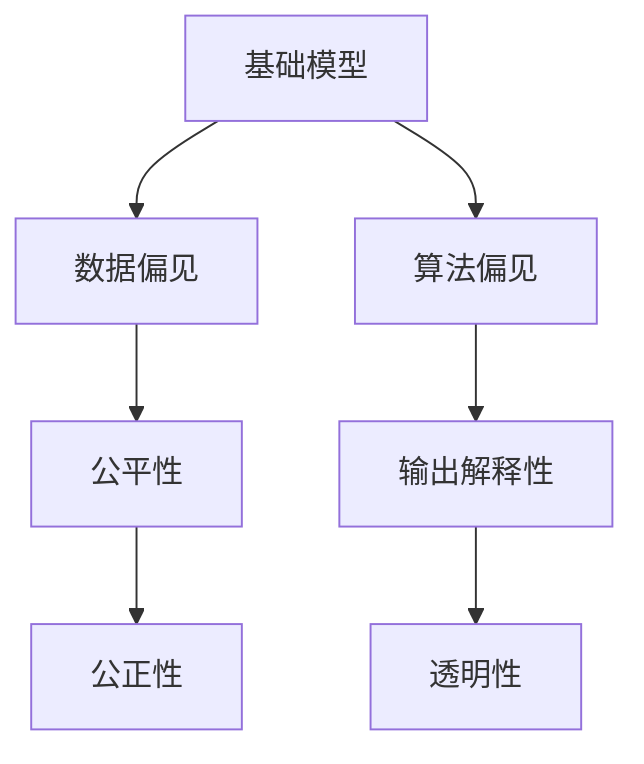
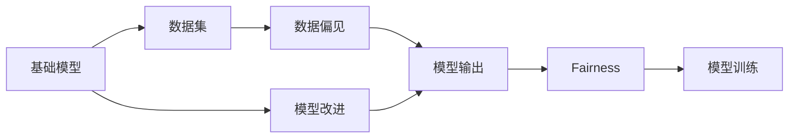
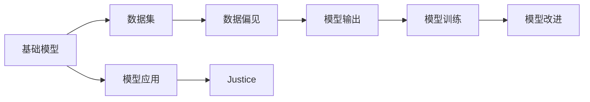
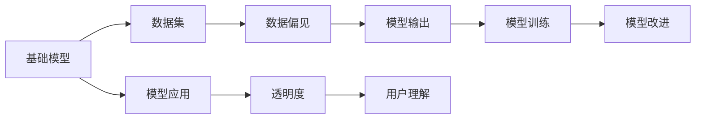
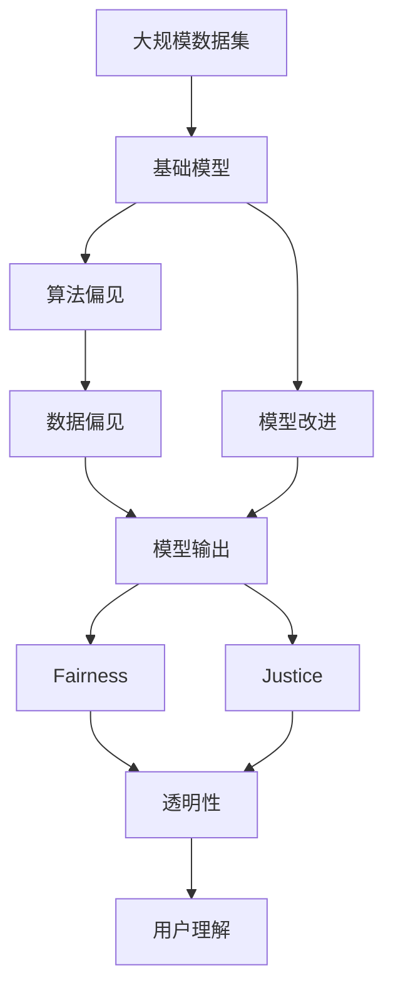

                 

# 基础模型的社会不平等问题

> 关键词：
> 基础模型, 社会不平等, 公平性, 算法偏见, 解释性, 数据偏见, 可解释性, 公正性

## 1. 背景介绍

### 1.1 问题由来
在人工智能领域，基础模型（如深度神经网络）的广泛应用已经极大地推动了科技的发展，为各行各业带来了前所未有的机遇。然而，基础模型的广泛应用也引发了一系列社会问题，其中最引人关注的就是基础模型中的社会不平等现象。

近年来，越来越多的研究显示，基础模型在预测、分类、决策等应用中存在明显的社会不平等现象，导致某些群体被不公正地对待。这种不平等不仅体现在模型输出的结果上，还可能反映在模型训练和部署的各个环节中。例如，基于性别、种族、年龄等敏感特征的歧视性偏见，已经引发了广泛的公众关注和讨论。

本文将详细探讨基础模型中的社会不平等问题，并讨论如何通过算法和数据层面的改进，提升基础模型的公平性和公正性。

### 1.2 问题核心关键点
基础模型中的社会不平等问题主要体现在以下几个方面：

- **算法偏见**：由于数据集的偏差或训练过程的缺陷，基础模型可能学习到有害的偏见，导致对某些群体的不公平对待。

- **数据偏见**：数据集中存在的群体不平衡、性别偏见等问题，会直接影响基础模型的输出结果，加剧社会不平等。

- **输出解释性不足**：基础模型通常是"黑盒"系统，难以解释其决策过程，导致用户对其输出结果缺乏信任，无法发现和纠正不公平现象。

- **模型设计缺陷**：基础模型的架构设计，如神经网络的层数、节点数量、激活函数等，可能对模型产生不公平的影响。

- **实际应用中的不公平现象**：在实际应用中，基础模型可能受到数据隐私、安全、伦理等限制，导致某些群体无法获得公平的服务。

这些核心问题共同构成基础模型中的社会不平等现象，需要在模型设计和应用过程中给予充分重视。

### 1.3 问题研究意义
探讨基础模型中的社会不平等问题，对于提升基础模型的公平性和公正性，具有重要的理论意义和实际应用价值：

1. **推动公平性研究**：社会不平等现象的识别和研究，有助于深入理解基础模型中的不公平机制，为制定公平性原则和算法提供指导。

2. **增强模型鲁棒性**：通过改进模型架构、数据集预处理等手段，减少基础模型中的偏见和歧视，提升模型的鲁棒性和可靠性。

3. **保障数据隐私**：在基础模型的设计和使用过程中，严格遵守数据隐私保护原则，确保不同群体的数据安全，避免因数据不平等导致的不公平现象。

4. **促进模型透明性**：增强基础模型的透明度和可解释性，使用户能够理解和信任模型的输出结果，避免因模型输出不透明而产生的不公平现象。

5. **构建公正性算法**：通过算法和数据层面的改进，构建公正、公平、可解释的AI系统，服务于全社会，造福人类。

## 2. 核心概念与联系

### 2.1 核心概念概述

为了更好地理解基础模型中的社会不平等问题，本节将介绍几个密切相关的核心概念：

- **基础模型(Foundation Model)**：通常指基于深度神经网络的模型，如卷积神经网络（CNN）、循环神经网络（RNN）、变压器（Transformer）等。这些模型在图像、语音、文本等领域的广泛应用，推动了人工智能技术的快速发展。

- **公平性(Fairness)**：指在基础模型的训练和应用过程中，不同群体应获得平等的待遇。公平性通常涉及消除算法偏见、数据偏见等，保证模型输出的公正性。

- **公正性(Justice)**：指在基础模型的设计和应用中，对特定群体或个体进行公正对待。公正性涉及模型透明性、决策解释性等，确保模型输出符合社会伦理和法律规定。

- **算法偏见(Algorithmic Bias)**：指基础模型在训练和应用中，由于数据偏差、模型设计缺陷等原因，学习到有害的偏见，导致对某些群体的不公平对待。

- **数据偏见(Data Bias)**：指在基础模型使用的数据集中，存在性别、种族、年龄等敏感特征的偏见，影响模型的公平性和公正性。

- **输出解释性(Explainability)**：指基础模型输出的结果应具有可解释性，使用户能够理解和信任模型的决策过程，避免因模型"黑盒"特性而产生的不公平现象。

- **透明性(Transparency)**：指基础模型的训练和应用过程应透明，用户应能够理解和跟踪模型的行为和决策过程。

这些核心概念之间的逻辑关系可以通过以下Mermaid流程图来展示：



这个流程图展示了大语言模型中的核心概念及其之间的关系：

1. 基础模型在训练和应用中，可能受到数据偏见和算法偏见的影响。
2. 基础模型输出的结果应具有公平性和公正性，应满足透明性和可解释性要求。

### 2.2 概念间的关系

这些核心概念之间存在着紧密的联系，形成了基础模型设计和应用的核心框架。下面我通过几个Mermaid流程图来展示这些概念之间的关系。

#### 2.2.1 基础模型和公平性的关系



这个流程图展示了基础模型和公平性之间的关系：

1. 基础模型在训练过程中，使用带有数据偏见的数据集，可能学习到有害的偏见。
2. 基础模型输出的结果应满足公平性要求，即对所有群体应一视同仁，避免因偏见导致的不公平现象。
3. 通过模型改进，可以尽量减少数据偏见和算法偏见的影响，提升模型的公平性。

#### 2.2.2 基础模型和公正性的关系



这个流程图展示了基础模型和公正性的关系：

1. 基础模型在训练和应用中，应确保对特定群体或个体进行公正对待，满足公正性要求。
2. 通过模型改进，可以在一定程度上减少数据偏见和算法偏见的影响，提升模型的公正性。
3. 在实际应用中，还应考虑模型的透明性和可解释性，确保用户能够理解和信任模型的决策过程。

#### 2.2.3 基础模型和透明性的关系



这个流程图展示了基础模型和透明性的关系：

1. 基础模型在训练和应用中，应具有透明性，即用户应能够理解和跟踪模型的行为和决策过程。
2. 通过模型改进，可以增强模型的透明性，使用户能够更清楚地理解模型的决策过程。
3. 增强透明性有助于提升模型的可解释性，增强用户对模型的信任。

### 2.3 核心概念的整体架构

最后，我们用一个综合的流程图来展示这些核心概念在大语言模型公平性设计和应用过程中的整体架构：



这个综合流程图展示了从数据集到大模型公平性设计和应用的全过程：

1. 基础模型在训练过程中，使用带有数据偏见的数据集，学习到算法偏见。
2. 基础模型的输出应满足公平性和公正性要求，具有透明性和可解释性。
3. 通过模型改进，减少偏见和提升透明性，增强用户对模型的理解和信任。

## 3. 核心算法原理 & 具体操作步骤
### 3.1 算法原理概述

基础模型中的社会不平等问题，主要源于数据偏见和算法偏见的积累。为了理解这些问题，本节将详细探讨基础模型中的公平性原理。

#### 3.1.1 数据偏见和算法偏见

基础模型在训练和应用中，可能受到数据偏见和算法偏见的影响，导致对某些群体的不公平对待。这些偏见通常源于以下几个方面：

1. **数据集不平衡**：在训练数据集中，某些群体的样本数量明显少于其他群体，导致模型学习到对这些群体的偏见。

2. **敏感特征偏见**：在数据集中，某些敏感特征（如性别、种族、年龄等）被过度表示或被忽视，影响模型的公平性。

3. **数据采集偏差**：在数据采集过程中，某些群体的样本被有意或无意地排除在外，导致模型学习到对这些群体的偏见。

4. **模型设计偏见**：基础模型的架构设计（如神经网络的层数、节点数量、激活函数等）可能对模型产生不公平的影响。

#### 3.1.2 公平性模型

为了消除基础模型中的偏见，研究者提出了多种公平性模型。这些模型通过修改训练目标、约束模型参数等手段，尽量减少模型中的不公平现象。常用的公平性模型包括：

1. **等权分配模型**：对训练数据集中的所有样本，使用相同的权重，以避免数据集不平衡的影响。

2. **采样平衡模型**：通过对训练数据集进行重采样，使得不同群体的样本数量平衡，避免模型学习到对某些群体的偏见。

3. **公平性约束模型**：在训练过程中，引入公平性约束，使得模型对不同群体的输出结果尽量公平。

4. **偏差修正模型**：在训练过程中，引入偏差修正项，调整模型输出，使其对不同群体的公平性尽量一致。

#### 3.1.3 公正性模型

公正性模型通常关注模型的透明性和决策解释性，使用户能够理解和信任模型的决策过程。常用的公正性模型包括：

1. **可解释性模型**：通过增强模型的透明性，使用户能够理解模型的决策过程。

2. **透明性模型**：通过记录和展示模型的训练和推理过程，使用户能够跟踪模型的行为。

3. **反事实推理模型**：通过反事实推理技术，使用户能够了解模型对不同输入的决策过程。

### 3.2 算法步骤详解

基于公平性和公正性原理，本节将详细介绍基础模型中的社会不平等问题的解决步骤。

#### 3.2.1 数据集准备

在基础模型的训练和应用中，数据集的准备是至关重要的。数据集的偏差和偏见会直接影响模型的公平性和公正性。为了减少偏见，应采取以下措施：

1. **数据集平衡**：对训练数据集进行重采样，使得不同群体的样本数量平衡。可以使用过采样、欠采样等方法。

2. **敏感特征处理**：在数据集中，应尽量减少敏感特征的影响，避免模型学习到有害的偏见。

3. **数据隐私保护**：在数据集的准备和使用过程中，应严格遵守数据隐私保护原则，确保数据安全和合法使用。

#### 3.2.2 模型设计

为了提升基础模型的公平性和公正性，应改进模型的架构设计。常用的改进方法包括：

1. **公平性约束**：在模型训练过程中，引入公平性约束，尽量减少模型对某些群体的偏见。

2. **偏差修正**：在模型训练过程中，引入偏差修正项，调整模型输出，使其对不同群体的公平性尽量一致。

3. **可解释性增强**：通过增强模型的透明性和可解释性，使用户能够理解和信任模型的决策过程。

#### 3.2.3 模型训练

在模型训练过程中，应采取以下措施：

1. **公平性目标函数**：在模型训练过程中，使用公平性目标函数，优化模型的公平性。

2. **公正性约束**：在模型训练过程中，引入公正性约束，确保模型对不同群体的输出结果尽量公平。

3. **透明性记录**：在模型训练过程中，记录和展示模型的训练和推理过程，使用户能够跟踪模型的行为。

#### 3.2.4 模型应用

在模型应用过程中，应采取以下措施：

1. **公平性评估**：在模型应用过程中，对模型输出进行公平性评估，确保模型对不同群体的公平性尽量一致。

2. **透明性展示**：在模型应用过程中，展示模型的透明性和可解释性，使用户能够理解和信任模型的决策过程。

#### 3.2.5 模型改进

在模型应用过程中，应不断改进模型，提升其公平性和公正性。常用的改进方法包括：

1. **重新训练**：对模型进行重新训练，优化模型架构和训练目标，提升模型的公平性和公正性。

2. **模型微调**：对模型进行微调，调整模型的参数和超参数，提升模型的性能和公平性。

3. **算法更新**：在模型应用过程中，根据反馈和评估结果，更新算法和模型参数，提升模型的公平性和公正性。

### 3.3 算法优缺点

基础模型中的公平性和公正性模型，具有以下优点：

1. **减少偏见**：通过公平性模型和公正性模型，可以尽量减少基础模型中的偏见和歧视，提升模型的公平性和公正性。

2. **提升可解释性**：通过增强模型的透明性和可解释性，使用户能够理解和信任模型的决策过程，避免因模型"黑盒"特性而产生的不公平现象。

3. **增强鲁棒性**：通过改进模型架构和训练目标，增强模型的鲁棒性和可靠性，避免因数据偏见和算法偏见而产生的不公平现象。

同时，这些模型也存在一些缺点：

1. **复杂度高**：引入公平性约束和偏差修正等手段，会增加模型的复杂度，可能影响模型的性能。

2. **数据依赖性**：模型的公平性和公正性依赖于数据集的平衡和透明性，数据集的不平衡和不透明会导致模型的不公平性。

3. **计算资源需求高**：改进模型的公平性和公正性通常需要更复杂的训练和优化算法，可能需要更多的计算资源。

4. **模型可解释性不足**：尽管通过可解释性模型增强了透明性，但模型的复杂性仍然可能导致其"黑盒"特性，难以解释某些复杂的决策过程。

### 3.4 算法应用领域

基础模型中的社会不平等问题，已经广泛应用于多个领域。以下是几个典型的应用场景：

#### 3.4.1 医疗领域

在医疗领域，基础模型（如深度神经网络）被广泛应用于疾病预测、患者风险评估等任务。然而，由于数据集和模型设计中的偏见，基础模型可能对某些群体的不公平对待，导致医疗资源分配的不公平。

1. **数据集偏见**：在医疗数据集中，某些群体的样本数量少于其他群体，导致模型学习到对这些群体的偏见。

2. **模型偏见**：在疾病预测和患者风险评估中，模型可能对某些群体的健康风险评估不准确，导致不公平的医疗资源分配。

3. **可解释性不足**：在医疗领域，模型的可解释性不足，使得患者和医生难以理解和信任模型的输出结果。

#### 3.4.2 金融领域

在金融领域，基础模型被广泛应用于信用评估、欺诈检测等任务。然而，由于数据集和模型设计中的偏见，基础模型可能对某些群体的不公平对待，导致金融资源分配的不公平。

1. **数据集偏见**：在金融数据集中，某些群体的样本数量少于其他群体，导致模型学习到对这些群体的偏见。

2. **模型偏见**：在信用评估和欺诈检测中，模型可能对某些群体的信用评分和欺诈检测不准确，导致不公平的金融资源分配。

3. **透明性不足**：在金融领域，模型的透明性不足，使得用户难以理解和信任模型的决策过程。

#### 3.4.3 司法领域

在司法领域，基础模型被广泛应用于案件判决、刑罚评估等任务。然而，由于数据集和模型设计中的偏见，基础模型可能对某些群体的不公平对待，导致司法资源分配的不公平。

1. **数据集偏见**：在司法数据集中，某些群体的样本数量少于其他群体，导致模型学习到对这些群体的偏见。

2. **模型偏见**：在案件判决和刑罚评估中，模型可能对某些群体的判决和刑罚评估不准确，导致不公平的司法资源分配。

3. **透明性不足**：在司法领域，模型的透明性不足，使得用户难以理解和信任模型的决策过程。

## 4. 数学模型和公式 & 详细讲解  
### 4.1 数学模型构建

本节将使用数学语言对基础模型中的社会不平等问题进行更加严格的刻画。

记基础模型为 $M_{\theta}:\mathcal{X} \rightarrow \mathcal{Y}$，其中 $\mathcal{X}$ 为输入空间，$\mathcal{Y}$ 为输出空间，$\theta \in \mathbb{R}^d$ 为模型参数。假设模型在训练数据集 $D=\{(x_i,y_i)\}_{i=1}^N$ 上进行训练，其中 $x_i \in \mathcal{X}, y_i \in \mathcal{Y}$。

定义模型 $M_{\theta}$ 在输入 $x$ 上的公平性损失函数为 $L_{fair}(M_{\theta})$，在输入 $x$ 上的公正性损失函数为 $L_{just}(M_{\theta})$。则在数据集 $D$ 上的公平性损失为：

$$
\mathcal{L}_{fair}(\theta) = \frac{1}{N}\sum_{i=1}^N L_{fair}(M_{\theta}(x_i))
$$

定义模型 $M_{\theta}$ 在输入 $x$ 上的公平性约束为 $C_{fair}(M_{\theta})$，即模型输出对不同群体的公平性尽量一致。则在数据集 $D$ 上的公平性约束为：

$$
\mathcal{C}_{fair}(\theta) = \frac{1}{N}\sum_{i=1}^N C_{fair}(M_{\theta}(x_i))
$$

通过最小化公平性损失函数，同时满足公平性约束，可以得到公平性优化目标：

$$
\theta^* = \mathop{\arg\min}_{\theta} \mathcal{L}_{fair}(\theta) \text{ s.t. } \mathcal{C}_{fair}(\theta) = 0
$$

类似地，定义模型 $M_{\theta}$ 在输入 $x$ 上的公正性约束为 $C_{just}(M_{\theta})$，即模型对不同群体的输出结果尽量公正。则在数据集 $D$ 上的公正性约束为：

$$
\mathcal{C}_{just}(\theta) = \frac{1}{N}\sum_{i=1}^N C_{just}(M_{\theta}(x_i))
$$

通过最小化公正性损失函数，同时满足公正性约束，可以得到公正性优化目标：

$$
\theta^* = \mathop{\arg\min}_{\theta} \mathcal{L}_{just}(\theta) \text{ s.t. } \mathcal{C}_{just}(\theta) = 0
$$

### 4.2 公式推导过程

以下我们以二分类任务为例，推导公平性约束的数学表达式。

假设模型 $M_{\theta}$ 在输入 $x$ 上的输出为 $\hat{y}=M_{\theta}(x) \in [0,1]$，表示样本属于正类的概率。定义模型 $M_{\theta}$ 在输入 $x$ 上的公平性约束为 $C_{fair}(M_{\theta}) = E[f(x)]$，其中 $f(x)$ 为公平性函数，可以定义为：

$$
f(x) = |\hat{y} - y|
$$

其中 $y \in \{0,1\}$。定义模型 $M_{\theta}$ 在输入 $x$ 上的公正性约束为 $C_{just}(M_{\theta}) = E[g(x)]$，其中 $g(x)$ 为公正性函数，可以定义为：

$$
g(x) = \hat{y} - y
$$

其中 $y \in \{0,1\}$。

通过上述定义，可以得到公平性约束和公正性约束的数学表达式：

$$
\mathcal{C}_{fair}(\theta) = \frac{1}{N}\sum_{i=1}^N f(M_{\theta}(x_i))
$$

$$
\mathcal{C}_{just}(\theta) = \frac{1}{N}\sum_{i=1}^N g(M_{\theta}(x_i))
$$

在模型训练过程中，可以引入公平性约束和公正性约束，使得模型对不同群体的输出结果尽量公平和公正。

## 5. 项目实践：代码实例和详细解释说明
### 5.1 开发环境搭建

在进行公平性模型实践前，我们需要准备好开发环境。以下是使用Python进行PyTorch开发的环境配置流程：

1. 安装Anaconda：从官网下载并安装Anaconda，用于创建独立的Python环境。

2. 创建并激活虚拟环境：
```bash
conda create -n pytorch-env python=3.8 
conda activate pytorch-env
```

3. 安装PyTorch：根据CUDA版本，从官网获取对应的安装命令。例如：
```bash
conda install pytorch torchvision torchaudio cudatoolkit=11.1 -c pytorch -c conda-forge
```

4. 安装TensorFlow：使用pip安装，根据需求选择对应的版本。

5. 安装TensorBoard：用于可视化模型训练过程，记录和展示模型的透明性和可解释性。

6. 安装transformers：用于加载和使用预训练语言模型。

7. 安装numpy、pandas、scikit-learn等常用库，用于数据处理和模型评估。

完成上述步骤后，即可在`pytorch-env`环境中开始公平性模型的实践。

### 5.2 源代码详细实现

下面我们以医疗领域为例，给出使用PyTorch和transformers库实现公平性模型的代码。

首先，定义数据处理函数：

```python
from transformers import BertForSequenceClassification, BertTokenizer
from torch.utils.data import Dataset, DataLoader
from torch import nn
from sklearn.metrics import roc_auc_score

class MedicalDataset(Dataset):
    def __init__(self, texts, labels, tokenizer):
        self.texts = texts
        self.labels = labels
        self.tokenizer = tokenizer
        
    def __len__(self):
        return len(self.texts)
    
    def __getitem__(self, idx):
        text = self.texts[idx]
        label = self.labels[idx]
        encoding = self.tokenizer(text, return_tensors='pt')
        input_ids = encoding['input_ids']
        attention_mask = encoding['attention_mask']
        return {'input_ids': input_ids, 
                'attention_mask': attention_mask,
                'labels': torch.tensor(label, dtype=torch.long)}
```

然后，定义模型和损失函数：

```python
from transformers import AdamW

model = BertForSequenceClassification.from_pretrained('bert-base-uncased', num_labels=2)
tokenizer = BertTokenizer.from_pretrained('bert-base-uncased')

loss_fn = nn.BCEWithLogitsLoss()
```

接着，定义训练和评估函数：

```python
device = torch.device('cuda') if torch.cuda.is_available() else torch.device('cpu')

def train_epoch(model, dataset, optimizer, scheduler, criterion):
    dataloader = DataLoader(dataset, batch_size=16, shuffle=True)
    model.train()
    epoch_loss = 0
    for batch in dataloader:
        input_ids = batch['input_ids'].to(device)
        attention_mask = batch['attention_mask'].to(device)
        labels = batch['labels'].to(device)
        model.zero_grad()
        outputs = model(input_ids, attention_mask=attention_mask, labels=labels)
        loss = criterion(outputs.logits, labels)
        epoch_loss += loss.item()
        loss.backward()
        optimizer.step()
        scheduler.step()
    return epoch_loss / len(dataloader)

def evaluate(model, dataset):
    dataloader = DataLoader(dataset, batch_size=16, shuffle=False)
    model.eval()
    preds, labels = [], []
    with torch.no_grad():
        for batch in dataloader:
            input_ids = batch['input_ids'].to(device)
            attention_mask = batch['attention_mask'].to(device)
            labels = batch['labels'].to(device)
            outputs = model(input_ids, attention_mask=attention_mask)
            preds.append(outputs.logits.argmax(dim=1).to('cpu').tolist())
            labels.append(labels.to('cpu').tolist())
    return roc_auc_score(labels, preds)
```

最后，启动训练流程并在测试集上评估：

```python
epochs = 5
batch_size = 16
learning_rate = 2e-5
num_epochs = 5
optimizer = AdamW(model.parameters(), lr=learning_rate)
scheduler = torch.optim.lr_scheduler.StepLR(optimizer, step_size=1, gamma=0.1)
scheduler_fn = lambda epoch: 1 if epoch > 2 else 

