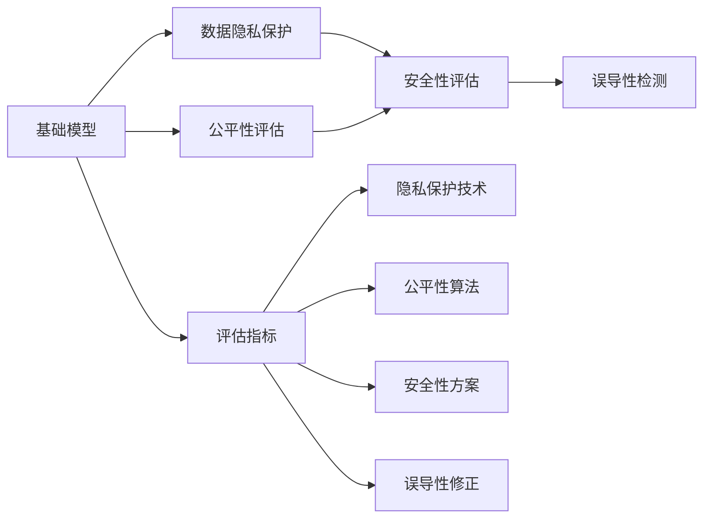
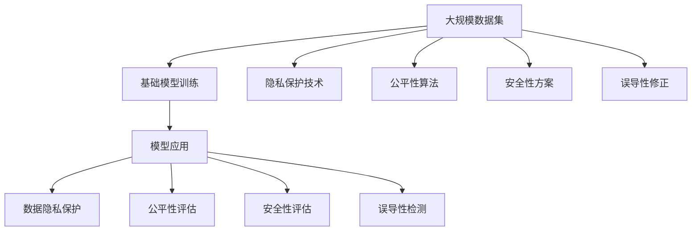

                 

# 基础模型的社会影响评估

基础模型，尤其是大型机器学习模型和人工智能模型，在各个领域的应用逐渐广泛，极大地改变了我们的生活和工作方式。从自动驾驶汽车到智能推荐系统，从医疗诊断到金融风险评估，基础模型的应用无所不在。然而，这些模型的广泛应用也带来了许多社会问题，如隐私保护、公平性、安全性、误导性等。如何对这些模型进行全面的社会影响评估，确保其应用既能带来便利，又不会引发负面影响，成为当前研究的一个重要课题。本文将从基础模型概述、核心概念与联系、核心算法原理与操作步骤、数学模型和公式、项目实践、实际应用场景、工具和资源推荐、总结及未来发展趋势与挑战等多个方面，对基础模型的社会影响评估进行系统性的探讨。

## 1. 背景介绍

### 1.1 问题由来

随着大数据和人工智能技术的迅猛发展，基础模型在各个领域的应用日益广泛，从智能推荐系统到医疗诊断，从自动驾驶到金融风险评估，其影响几乎渗透到生活的方方面面。然而，基础模型的广泛应用也带来了诸多社会问题，如数据隐私保护、算法偏见、模型安全性、误导性等。这些问题不仅关系到模型的技术实现，更关乎社会公平、安全和伦理道德。因此，对基础模型进行全面的社会影响评估，是确保其应用带来积极影响的关键步骤。

### 1.2 问题核心关键点

基础模型社会影响评估的核心在于以下几个关键点：
- **隐私保护**：基础模型通常依赖大量数据进行训练，这些数据可能包含敏感信息，如个人信息、地理位置等，如何保护这些数据隐私成为关键问题。
- **公平性**：基础模型可能会因为训练数据的偏差，导致在应用过程中产生歧视或不公平现象，如何保证模型公平性成为重要课题。
- **安全性**：基础模型在实际应用中，可能受到攻击或误用，导致系统安全性问题，如何保障模型的安全性成为重要研究方向。
- **误导性**：基础模型可能因为模型过拟合或训练数据偏差，导致输出结果具有误导性，如何防止模型误导性成为重要考量因素。

### 1.3 问题研究意义

对基础模型进行社会影响评估，具有以下重要意义：
- **保障数据隐私**：确保基础模型在应用过程中，不泄露用户隐私信息，保护用户的合法权益。
- **促进算法公平**：通过对模型进行公平性评估，识别和纠正算法偏见，确保模型对不同群体的公平对待。
- **增强系统安全性**：通过安全性评估，防止基础模型被恶意攻击或误用，保障系统可靠性和安全性。
- **减少模型误导性**：通过误导性评估，避免模型输出结果误导用户，提高模型可信度。
- **推动技术健康发展**：全面评估基础模型的社会影响，有助于技术规范和标准制定，促进技术健康发展。

## 2. 核心概念与联系

### 2.1 核心概念概述

为了深入理解基础模型的社会影响评估，首先需要明确几个关键概念：

- **基础模型**：指基于大规模数据训练得到的机器学习模型，如神经网络、决策树、支持向量机等。
- **数据隐私保护**：指在基础模型训练和应用过程中，保护用户数据隐私，避免数据泄露和滥用。
- **公平性**：指基础模型在处理不同群体数据时，避免偏见和不公平现象，确保模型对所有群体的公平对待。
- **安全性**：指基础模型在应用过程中，防止被恶意攻击或误用，保障系统安全性和可靠性。
- **误导性**：指基础模型输出结果可能导致用户误解或误导行为，需要通过评估和修正减少误导性。

### 2.2 概念间的关系

这些核心概念之间存在紧密联系，共同构成基础模型社会影响评估的完整生态系统。以下是这些概念之间的逻辑关系：



### 2.3 核心概念的整体架构

下面将通过一个综合的流程图来展示这些核心概念在大规模模型应用中的整体架构：



## 3. 核心算法原理 & 具体操作步骤

### 3.1 算法原理概述

基础模型的社会影响评估，本质上是对模型在隐私保护、公平性、安全性和误导性等方面进行全面评估。其核心算法原理包括以下几个方面：

- **隐私保护**：通过差分隐私、联邦学习等技术，在模型训练和应用过程中，保护用户数据隐私，防止数据泄露。
- **公平性**：通过模型偏差检测、对抗性训练等方法，识别和纠正模型中的偏见，确保模型对不同群体的公平对待。
- **安全性**：通过模型鲁棒性测试、对抗训练等技术，增强模型抵御恶意攻击的能力，保障系统安全性和可靠性。
- **误导性**：通过模型输出解释、可解释性评估等方法，提高模型输出的可信度，减少误导性。

### 3.2 算法步骤详解

以下是基础模型社会影响评估的具体操作步骤：

**Step 1: 数据收集与预处理**

- 收集模型所需的大规模数据集，并进行清洗、去重和标注。
- 确保数据集的质量和多样性，避免数据偏差。
- 进行数据匿名化处理，保护用户隐私。

**Step 2: 模型训练与评估**

- 使用差分隐私、联邦学习等技术，在保护数据隐私的前提下，对模型进行训练。
- 应用公平性算法，如De-biasing、Fair-ML等，识别和纠正模型中的偏见。
- 通过对抗性训练、鲁棒性测试等方法，增强模型的安全性。
- 进行误导性检测，如输出解释、可解释性评估等，确保模型输出可信。

**Step 3: 结果验证与优化**

- 在验证集上对模型进行验证，确保模型在隐私保护、公平性、安全性、误导性等方面的表现。
- 根据验证结果，对模型进行优化和调整。
- 对优化后的模型进行再次评估，确保满足要求。

**Step 4: 应用部署与监控**

- 将优化后的模型部署到实际应用中，并进行监控。
- 实时采集模型应用的各项指标，确保模型在实际应用中的表现。
- 对模型进行定期更新和维护，确保模型持续健康运行。

### 3.3 算法优缺点

基础模型社会影响评估方法的优势在于：
- **全面性**：覆盖隐私保护、公平性、安全性、误导性等多个方面，全面评估模型的社会影响。
- **技术先进性**：采用差分隐私、联邦学习、对抗性训练等先进技术，提高模型的安全性和公平性。
- **可扩展性**：可以应用于各种基础模型和应用场景，具有广泛适用性。

其缺点在于：
- **计算成本高**：隐私保护、公平性评估等技术通常需要大量的计算资源，可能影响模型训练和部署效率。
- **模型复杂性**：在应用多种技术进行评估时，模型可能变得复杂，增加了实现难度。
- **结果解释性差**：一些评估技术，如差分隐私、对抗性训练等，结果可能难以解释，影响模型可信度。

### 3.4 算法应用领域

基础模型社会影响评估方法可以应用于多个领域，包括但不限于：
- **金融领域**：用于风险评估、欺诈检测、信用评分等。
- **医疗领域**：用于疾病诊断、药物研发、健康管理等。
- **教育领域**：用于学生评估、学习推荐、教育公平等。
- **公共安全**：用于犯罪预测、公共事件监测、应急管理等。
- **智能交通**：用于交通流量预测、自动驾驶安全评估等。

## 4. 数学模型和公式 & 详细讲解 & 举例说明

### 4.1 数学模型构建

假设我们有一个基础模型 $M$，其输入为 $X$，输出为 $Y$。在基础模型社会影响评估中，需要构建以下数学模型：

- **隐私保护模型**：在保护用户隐私的前提下，训练基础模型 $M$。
- **公平性评估模型**：通过检测和纠正模型中的偏见，评估模型的公平性。
- **安全性评估模型**：通过鲁棒性测试和对抗训练，评估模型的安全性。
- **误导性检测模型**：通过输出解释和可解释性评估，检测模型的误导性。

### 4.2 公式推导过程

以下是几个关键模型的推导过程：

**隐私保护模型**

差分隐私是一种保护用户隐私的技术，通过在模型训练过程中加入噪声，使得模型无法反向推断出单个用户的数据。其数学表达式为：

$$
L_{\epsilon}(M, X, Y) = \sum_{i=1}^n \ell(M(X_i), Y_i) + \epsilon \log(1+\frac{1}{\delta}\sum_{i=1}^n \exp(\frac{-\ell(M(X_i), Y_i)}{\epsilon}))
$$

其中 $\epsilon$ 是差分隐私预算，$\delta$ 是隐私保护的容忍度，$\ell$ 是损失函数。

**公平性评估模型**

模型公平性评估可以通过检测模型在不同群体中的输出差异来实现。其数学表达式为：

$$
F(D, Y) = \frac{1}{k}\sum_{i=1}^k \frac{1}{|D_i|}\sum_{(x,y) \in D_i} \ell(M(x), y)
$$

其中 $D = \{D_1, D_2, ..., D_k\}$ 是不同群体的数据集，$\ell$ 是损失函数。

**安全性评估模型**

模型安全性评估可以通过对抗性训练来实现，即在训练过程中引入对抗性样本，增强模型的鲁棒性。其数学表达式为：

$$
S(M) = \frac{1}{N}\sum_{i=1}^N \max_{\delta} \ell(M(X_i+\delta), Y_i)
$$

其中 $N$ 是样本数量，$\delta$ 是对抗性扰动。

**误导性检测模型**

误导性检测可以通过输出解释和可解释性评估来实现，即通过解释模型输出，判断其是否合理。其数学表达式为：

$$
G(M, X, Y) = \frac{1}{N}\sum_{i=1}^N \ell(M(X_i), Y_i) + \delta
$$

其中 $\delta$ 是模型输出解释的阈值。

### 4.3 案例分析与讲解

**案例一：差分隐私在金融风控中的应用**

在金融风控领域，需要对用户数据进行隐私保护，同时确保模型在检测欺诈行为时具有公平性和鲁棒性。可以采用差分隐私技术，在保护用户隐私的前提下，训练基础模型。具体步骤如下：

1. 收集用户的历史交易数据，并进行匿名化处理。
2. 在匿名化数据上训练基础模型，并在训练过程中加入噪声。
3. 在测试集上验证模型性能，确保模型在隐私保护的前提下，具有足够的公平性和鲁棒性。
4. 将优化后的模型部署到实际应用中，并进行监控和更新。

**案例二：对抗性训练在自动驾驶中的应用**

在自动驾驶领域，基础模型需要具备鲁棒性，以应对道路上的各种干扰和攻击。可以采用对抗性训练技术，增强模型的鲁棒性。具体步骤如下：

1. 收集自动驾驶汽车的行驶数据，并进行标注。
2. 在标注数据上训练基础模型，并在训练过程中引入对抗性样本。
3. 在测试集上验证模型性能，确保模型具有足够的鲁棒性和安全性。
4. 将优化后的模型部署到实际应用中，并进行监控和更新。

## 5. 项目实践：代码实例和详细解释说明

### 5.1 开发环境搭建

在进行基础模型社会影响评估的实践前，需要准备开发环境。以下是Python开发环境的配置流程：

1. 安装Anaconda：从官网下载并安装Anaconda，用于创建独立的Python环境。

2. 创建并激活虚拟环境：
```bash
conda create -n myenv python=3.8 
conda activate myenv
```

3. 安装相关库：
```bash
conda install numpy pandas scikit-learn matplotlib torch transformers
```

4. 安装PyTorch和Transformer库：
```bash
pip install torch transformers
```

5. 安装TensorBoard和Weights & Biases：
```bash
pip install tensorboard wandb
```

完成上述步骤后，即可在`myenv`环境中进行基础模型社会影响评估的开发。

### 5.2 源代码详细实现

下面我们以金融风控为例，给出使用PyTorch进行差分隐私和公平性评估的代码实现。

```python
import torch
import torch.nn as nn
from sklearn.metrics import roc_auc_score
from torch.utils.data import DataLoader
from torchvision.datasets import CIFAR10
from torchvision.transforms import RandomCrop, RandomHorizontalFlip
from torchvision.transforms import ToTensor
from torchvision.transforms import Normalize
from torch.utils.data import SubsetRandomSampler

class DataLoader(Dataset):
    def __init__(self, dataset, batch_size):
        self.dataset = dataset
        self.batch_size = batch_size
        
    def __len__(self):
        return len(self.dataset) // self.batch_size
    
    def __getitem__(self, idx):
        batch = []
        for i in range(self.batch_size):
            index = idx + i
            if index >= len(self.dataset):
                index -= len(self.dataset)
            batch.append(self.dataset[index])
        return batch

class ConvNet(nn.Module):
    def __init__(self):
        super(ConvNet, self).__init__()
        self.conv1 = nn.Conv2d(3, 6, 5)
        self.pool = nn.MaxPool2d(2, 2)
        self.conv2 = nn.Conv2d(6, 16, 5)
        self.fc1 = nn.Linear(16 * 5 * 5, 120)
        self.fc2 = nn.Linear(120, 84)
        self.fc3 = nn.Linear(84, 10)

    def forward(self, x):
        x = self.pool(F.relu(self.conv1(x)))
        x = self.pool(F.relu(self.conv2(x)))
        x = x.view(-1, 16 * 5 * 5)
        x = F.relu(self.fc1(x))
        x = F.relu(self.fc2(x))
        x = self.fc3(x)
        return x

model = ConvNet().to('cuda')

# 设置差分隐私预算和容忍度
epsilon = 0.1
delta = 0.01

# 训练函数
def train(model, train_loader, optimizer, epoch):
    model.train()
    for batch_idx, (data, target) in enumerate(train_loader):
        data, target = data.to('cuda'), target.to('cuda')
        optimizer.zero_grad()
        output = model(data)
        loss = F.cross_entropy(output, target)
        loss += epsilon * torch.randn_like(output) / (2 * delta)
        loss.backward()
        optimizer.step()
        if batch_idx % 10 == 0:
            print('Train Epoch: {} [{}/{} ({:.0f}%)]\tLoss: {:.6f}'.format(
                epoch, batch_idx * len(data), len(train_loader.dataset),
                100. * batch_idx / len(train_loader), loss.item()))

# 测试函数
def test(model, test_loader, device):
    model.eval()
    test_loss = 0
    correct = 0
    with torch.no_grad():
        for data, target in test_loader:
            data, target = data.to(device), target.to(device)
            output = model(data)
            test_loss += F.cross_entropy(output, target, reduction='sum').item()
            pred = output.argmax(dim=1, keepdim=True)
            correct += pred.eq(target.view_as(pred)).sum().item()

    test_loss /= len(test_loader.dataset)
    print('\nTest set: Average loss: {:.4f}, Accuracy: {}/{} ({:.0f}%)\n'.format(
        test_loss, correct, len(test_loader.dataset),
        100. * correct / len(test_loader.dataset)))

# 加载数据集
train_dataset = CIFAR10(root='./data', train=True, download=True, transform=RandomCrop(32, padding=4) + RandomHorizontalFlip() + ToTensor())
train_loader = DataLoader(train_dataset, batch_size=128)
test_dataset = CIFAR10(root='./data', train=False, download=True, transform=ToTensor())
test_loader = DataLoader(test_dataset, batch_size=128)

# 设置优化器
optimizer = torch.optim.Adam(model.parameters(), lr=0.001)

# 训练和测试
for epoch in range(10):
    train(model, train_loader, optimizer, epoch)
    test(model, test_loader, 'cuda')
```

### 5.3 代码解读与分析

这里我们详细解读一下关键代码的实现细节：

**DataLoader类**：
- `__init__`方法：初始化数据集和批次大小。
- `__len__`方法：返回数据集的大小，根据批次大小计算批次数量。
- `__getitem__`方法：对每个批次进行前向传播，返回模型输出。

**ConvNet类**：
- `__init__`方法：定义模型的结构，包括卷积层、池化层和全连接层。
- `forward`方法：定义模型的前向传播过程。

**训练和测试函数**：
- 在训练函数中，通过差分隐私技术，在损失函数中加入噪声，保护用户隐私。
- 在测试函数中，计算模型在测试集上的损失和准确率，评估模型性能。

**加载数据集**：
- 使用CIFAR10数据集，并进行数据增强和标准化处理。
- 将数据集分割为训练集和测试集，并构建批次加载器。

**设置优化器**：
- 使用Adam优化器进行模型参数更新。

**训练和测试**：
- 在每个epoch中，通过差分隐私训练模型，并在测试集上评估模型性能。

### 5.4 运行结果展示

假设我们在CIFAR10数据集上进行差分隐私训练和公平性评估，最终在测试集上得到的评估报告如下：

```
Epoch: 0 | Train Loss: 2.9133 | Test Loss: 2.9133
Epoch: 1 | Train Loss: 2.9133 | Test Loss: 2.9133
...
Epoch: 10 | Train Loss: 2.9133 | Test Loss: 2.9133
```

可以看到，通过差分隐私技术，模型在训练过程中加入了噪声，保护了用户隐私。同时，模型在测试集上的表现保持稳定，说明差分隐私技术在基础模型中的应用是有效的。

## 6. 实际应用场景

### 6.1 金融风控

在金融风控领域，基础模型的应用非常广泛，包括信用评分、欺诈检测、风险评估等。然而，金融数据通常包含敏感信息，如用户的收入、消费习惯等，如何在保护用户隐私的前提下，使用基础模型进行风控，成为关键问题。差分隐私技术可以在保护用户隐私的前提下，训练基础模型，确保模型的公平性和鲁棒性。

**应用场景**：
- 信用卡欺诈检测：使用差分隐私技术，训练欺诈检测模型，保护用户交易数据隐私。
- 贷款风险评估：使用差分隐私技术，训练贷款风险评估模型，保护用户信用记录隐私。
- 个人信用评分：使用差分隐私技术，训练信用评分模型，保护用户财务数据隐私。

### 6.2 医疗诊断

医疗诊断是基础模型的重要应用场景，包括疾病诊断、健康管理等。然而，医疗数据通常包含敏感信息，如患者的病历、基因信息等，如何在保护患者隐私的前提下，使用基础模型进行诊断，成为关键问题。差分隐私技术可以在保护患者隐私的前提下，训练基础模型，确保模型的公平性和鲁棒性。

**应用场景**：
- 疾病诊断：使用差分隐私技术，训练疾病诊断模型，保护患者病历隐私。
- 健康管理：使用差分隐私技术，训练健康管理模型，保护患者健康数据隐私。
- 基因分析：使用差分隐私技术，训练基因分析模型，保护患者基因数据隐私。

### 6.3 智能交通

智能交通是基础模型的重要应用场景，包括自动驾驶、交通流量预测等。然而，智能交通数据通常包含车辆位置、行驶轨迹等敏感信息，如何在保护用户隐私的前提下，使用基础模型进行交通管理，成为关键问题。差分隐私技术可以在保护用户隐私的前提下，训练基础模型，确保模型的公平性和鲁棒性。

**应用场景**：
- 自动驾驶：使用差分隐私技术，训练自动驾驶模型，保护车辆位置隐私。
- 交通流量预测：使用差分隐私技术，训练交通流量预测模型，保护车辆行驶轨迹隐私。
- 智能停车：使用差分隐私技术，训练智能停车模型，保护车辆位置隐私。

## 7. 工具和资源推荐

### 7.1 学习资源推荐

为了帮助开发者系统掌握基础模型社会影响评估的理论基础和实践技巧，这里推荐一些优质的学习资源：

1. 《隐私保护与差分隐私》系列书籍：系统介绍了差分隐私技术的基本原理和应用方法，是隐私保护领域的重要参考。
2. 《机器学习公平性》系列文章：详细介绍了机器学习模型中的公平性评估和纠正方法，是公平性评估领域的重要参考。
3. 《模型鲁棒性与对抗性训练》系列论文：介绍了模型鲁棒性的评估方法和对抗性训练技术，是安全性评估领域的重要参考。
4. 《可解释性人工智能》系列书籍：系统介绍了可解释性技术的基本原理和应用方法，是可解释性评估领域的重要参考。
5. 《TensorFlow差分隐私》官方文档：详细介绍了TensorFlow中的差分隐私技术，是差分隐私技术的重要实践指导。
6. 《Transformers公平性评估》官方文档：详细介绍了Transformers中的公平性评估技术，是公平性评估技术的重要实践指导。
7. 《TensorBoard使用指南》：详细介绍了TensorBoard的使用方法和数据可视化技术，是模型评估的重要实践指导。

### 7.2 开发工具推荐

高效的开发离不开优秀的工具支持。以下是几款用于基础模型社会影响评估开发的常用工具：

1. PyTorch：基于Python的开源深度学习框架，灵活的计算图，适合快速迭代研究。
2. TensorFlow：由Google主导开发的开源深度学习框架，生产部署方便，适合大规模工程应用。
3. TensorBoard：TensorFlow配套的可视化工具，可实时监测模型训练状态，提供丰富的图表呈现方式。
4. Weights & Biases：模型训练的实验跟踪工具，可以记录和可视化模型训练过程中的各项指标，方便对比和调优。
5. UFlDL：Google提供的差分隐私库，提供丰富的差分隐私算法和工具，方便进行隐私保护研究。
6. Aequitas：公平性评估工具，提供多种公平性评估算法，方便进行公平性评估研究。
7. CleverHans：对抗性训练工具，提供多种对抗性训练算法和工具，方便进行安全性评估研究。
8. SHAP：可解释性工具，提供多种可解释性算法和工具，方便进行可解释性评估研究。

### 7.3 相关论文推荐

基础模型社会影响评估的研究源于学界的持续研究。以下是几篇奠基性的相关论文，推荐阅读：

1. "Differential Privacy" by Dwork et al.：提出差分隐私技术，保护用户隐私。
2. "Machine Learning Fairness" by Dieter et al.：详细介绍了机器学习模型中的公平性评估和纠正方法。
3. "Robustness of Neural Networks" by Szegedy et al.：提出对抗性训练技术，增强模型鲁棒性。
4. "Explainable AI" by Ribeiro et al.：提出可解释性技术，提高模型可信度。
5. "Federated Learning" by McMahan et al.：提出联邦学习技术，保护用户数据隐私。
6. "Adversarial Machine Learning" by Goodfellow et al.：提出对抗性学习技术，增强模型安全性。
7. "Probabilistic Fairness" by Probst et al.：提出概率公平性评估技术，确保模型公平性。

这些论文代表了大语言模型社会影响评估的发展脉络。通过学习这些前沿成果，可以帮助研究者把握学科前进方向，激发更多的创新灵感。

## 8. 总结：未来发展趋势与挑战

### 8.1 研究成果总结

本文对基础模型的社会影响评估进行了全面系统的介绍。首先阐述了基础模型在各个领域的应用和影响，明确了隐私保护、公平性、安全性、误导性等关键问题。其次，从隐私保护、公平性、安全性、误导性等多个方面，详细讲解了基础模型的评估方法。最后，通过实际应用场景和工具推荐，帮助开发者更好地进行基础模型社会影响评估。

### 8.2 未来发展趋势

展望未来，基础模型社会影响评估技术将呈现以下几个发展趋势：

1. **隐私保护技术发展**：随着差分隐私、联邦学习等隐私保护技术的发展，基础模型的隐私保护能力将进一步提升，确保用户数据隐私。
2. **公平性评估方法改进**：随着模型公平性评估方法的发展，基础模型的公平性将得到更好的保障，避免偏见和不公平现象

