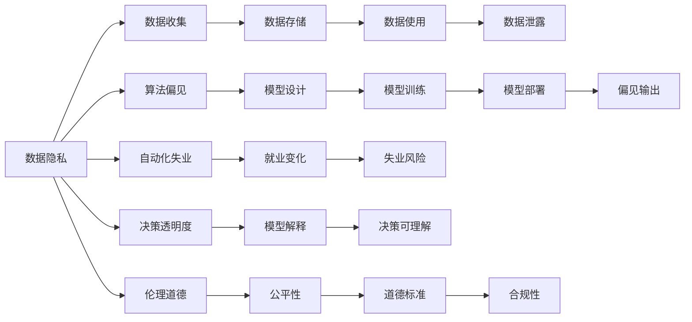
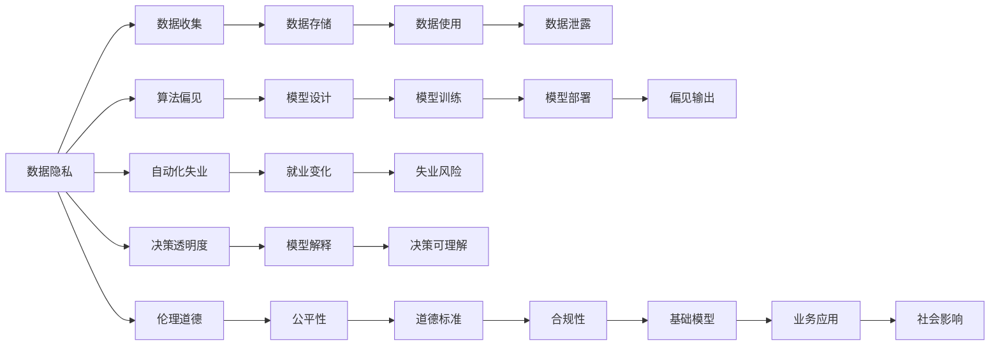

                 

# 基础模型的社会技术性质

在人工智能(AI)和机器学习领域，"基础模型"一词通常指那些构成更高级机器学习模型的底层组件。基础模型可以是简单的线性回归模型，也可以是复杂的深度神经网络。这些模型的构建和训练通常依赖于大量的数据和计算资源，并在特定的技术框架和工具下进行。本文将深入探讨基础模型的社会技术性质，特别是它们在社会和政治方面的影响，以及如何通过负责任的技术实践来指导这些模型的使用。

## 1. 背景介绍

### 1.1 问题由来

基础模型的广泛应用已经改变了各个行业的工作方式，包括医疗保健、金融服务、教育和零售。它们在许多应用中提供了更加精准的预测和决策支持，大大提升了效率和生产力。然而，这种技术进步也带来了一些社会问题，如数据隐私、算法偏见、自动化失业等。因此，在享受技术红利的同时，也需要对基础模型的社会技术性质进行深入思考和反思。

### 1.2 问题核心关键点

基础模型的社会技术性质主要包括以下几个方面：
1. **数据隐私**：基础模型依赖大量数据进行训练，这些数据可能包含个人敏感信息，如何保护这些数据不被滥用是一个重要问题。
2. **算法偏见**：基础模型可能会因为训练数据的不平衡性而产生偏见，如何识别和消除这种偏见是模型公平性的关键。
3. **自动化失业**：基础模型在自动完成重复性、低价值工作的同时，也可能会造成某些职业的消失，如何平衡自动化与人类就业是社会关注的焦点。
4. **决策透明度**：基础模型通常被视为"黑箱"，难以解释其内部工作机制，如何在满足业务需求的同时提升模型的可解释性是一个挑战。
5. **伦理道德**：基础模型的应用可能涉及到伦理道德问题，如医疗诊断、司法判决等，如何确保模型的决策符合伦理标准是社会责任的重要内容。

## 2. 核心概念与联系

### 2.1 核心概念概述

为了更好地理解基础模型的社会技术性质，本节将介绍几个关键概念：

- **数据隐私**：指个人和组织在处理个人信息时的隐私权利，通常包括数据收集、存储、使用和共享等环节。
- **算法偏见**：指由于数据不平衡、模型设计缺陷等因素，导致模型输出出现偏差，这种偏差可能对特定群体产生不公平的影响。
- **自动化失业**：指自动化技术导致某些职业的需求减少，甚至消失，进而造成失业问题。
- **决策透明度**：指模型决策的解释性和可理解性，能够使决策过程透明化，避免"黑箱"效应。
- **伦理道德**：指在基础模型开发和使用过程中，需遵循的道德规范和社会价值观，确保技术服务于人类福祉。

这些概念之间存在紧密的联系，形成一个相互影响的基础模型使用框架。

### 2.2 概念间的关系

这些核心概念之间存在着复杂的关系，可以通过以下Mermaid流程图来展示：



这个流程图展示了几类核心概念之间的关系：

1. 数据隐私保护措施包括数据收集、存储、使用等环节，旨在防止数据泄露。
2. 模型设计、训练和部署过程中可能产生算法偏见，影响模型公平性。
3. 自动化失业与就业变化和失业风险相关，需要通过适当的技术和社会政策来平衡。
4. 决策透明度要求模型具有可解释性，增强决策的公平性和合法性。
5. 伦理道德关注模型的公平性和合法性，确保模型符合社会价值观。

这些概念共同构成了基础模型使用的完整框架，对模型的开发和应用具有指导意义。

### 2.3 核心概念的整体架构

最后，我们用一个综合的流程图来展示这些核心概念在大模型使用中的整体架构：



这个综合流程图展示了基础模型在数据收集、模型设计、训练、部署和使用过程中的社会技术性质，以及这些性质对社会和政治的影响。

## 3. 核心算法原理 & 具体操作步骤

### 3.1 算法原理概述

基础模型通常基于统计学习理论，通过大量数据学习数据的分布特征，从而进行预测或决策。其中，监督学习、无监督学习和半监督学习是三种主要的学习范式。监督学习通过有标签的数据进行训练，无监督学习利用无标签数据，半监督学习则结合少量有标签和大量无标签数据。

### 3.2 算法步骤详解

基于基础模型的学习过程通常包括以下几个步骤：

**Step 1: 数据准备**
- 收集和预处理数据，确保数据质量和代表性。
- 对数据进行清洗、标注和划分，分为训练集、验证集和测试集。

**Step 2: 模型选择与设计**
- 选择合适的模型结构，如线性回归、决策树、神经网络等。
- 根据任务需求进行模型设计，包括输入、输出、损失函数、优化器等。

**Step 3: 模型训练**
- 使用训练集对模型进行迭代优化，最小化损失函数。
- 采用适当的正则化技术，如L2正则、Dropout等，避免过拟合。

**Step 4: 模型评估**
- 使用验证集对模型进行性能评估，调整超参数以优化模型。
- 在测试集上评估模型的泛化能力，确保模型在新数据上表现稳定。

**Step 5: 模型部署**
- 将模型封装成API或服务，方便其他系统调用。
- 进行模型监控和维护，及时更新模型以适应新的数据。

### 3.3 算法优缺点

基础模型的优点包括：
- 通用性强，适用于各种类型的预测和决策任务。
- 学习能力强，能够在大量数据上进行训练，获取丰富的特征表示。
- 可扩展性强，可以通过添加更多层或节点来提升模型能力。

基础模型的缺点包括：
- 对数据质量要求高，需要高质量的数据进行训练。
- 模型复杂度高，训练和部署需要大量的计算资源。
- 难以解释，黑箱效应可能导致决策透明度不足。

### 3.4 算法应用领域

基础模型广泛应用于以下领域：

- **金融风控**：用于信用评分、欺诈检测、风险管理等。
- **医疗诊断**：用于疾病预测、影像分析、药物研发等。
- **零售推荐**：用于商品推荐、客户分析、营销优化等。
- **制造业预测**：用于设备维护、产量预测、供应链管理等。

## 4. 数学模型和公式 & 详细讲解 & 举例说明

### 4.1 数学模型构建

假设有一个线性回归模型，用于预测房价 $y$ 和特征向量 $x$ 之间的关系。设模型为 $y = \theta^T x + b$，其中 $\theta$ 为模型参数，$b$ 为截距。模型的损失函数通常采用均方误差（Mean Squared Error, MSE）：

$$
\mathcal{L}(\theta) = \frac{1}{N}\sum_{i=1}^N (y_i - \theta^T x_i - b)^2
$$

### 4.2 公式推导过程

根据梯度下降法，模型参数的更新公式为：

$$
\theta \leftarrow \theta - \eta \nabla_{\theta}\mathcal{L}(\theta)
$$

其中 $\eta$ 为学习率，$\nabla_{\theta}\mathcal{L}(\theta)$ 为损失函数对参数 $\theta$ 的梯度。具体计算如下：

$$
\frac{\partial \mathcal{L}(\theta)}{\partial \theta_k} = \frac{2}{N}\sum_{i=1}^N (y_i - \theta^T x_i - b)x_{ik}
$$

### 4.3 案例分析与讲解

以房价预测为例，假设有一个包含1000个样本的训练集，用于训练线性回归模型。模型参数 $\theta$ 包含10个特征，每个特征的权重 $\theta_k$ 的初始值设为0。通过梯度下降法迭代训练，可以逐渐调整每个特征的权重，使得模型能够更好地拟合训练数据，最小化预测误差。

## 5. 项目实践：代码实例和详细解释说明

### 5.1 开发环境搭建

在进行项目实践前，我们需要准备好开发环境。以下是使用Python进行Scikit-learn开发的常见环境配置流程：

1. 安装Anaconda：从官网下载并安装Anaconda，用于创建独立的Python环境。

2. 创建并激活虚拟环境：
```bash
conda create -n sklearn-env python=3.8 
conda activate sklearn-env
```

3. 安装Scikit-learn：
```bash
pip install scikit-learn
```

4. 安装其他依赖：
```bash
pip install numpy pandas matplotlib seaborn jupyter notebook ipython
```

完成上述步骤后，即可在`sklearn-env`环境中开始项目实践。

### 5.2 源代码详细实现

下面以线性回归模型为例，给出使用Scikit-learn进行房价预测的Python代码实现。

首先，定义数据处理函数：

```python
import pandas as pd
from sklearn.model_selection import train_test_split

def load_data(filename):
    data = pd.read_csv(filename)
    X = data.drop('price', axis=1)
    y = data['price']
    return train_test_split(X, y, test_size=0.2, random_state=42)
```

然后，定义模型训练函数：

```python
from sklearn.linear_model import LinearRegression
from sklearn.metrics import mean_squared_error
from sklearn.preprocessing import StandardScaler

def train_model(X_train, y_train, test_size=0.2, random_state=42):
    scaler = StandardScaler()
    X_train_scaled = scaler.fit_transform(X_train)
    X_test_scaled = scaler.transform(X_test)
    
    model = LinearRegression()
    model.fit(X_train_scaled, y_train)
    y_pred = model.predict(X_test_scaled)
    
    mse = mean_squared_error(y_test, y_pred)
    print(f"Mean Squared Error: {mse:.2f}")
    return model
```

接着，加载数据并训练模型：

```python
X_train, X_test, y_train, y_test = load_data('housing.csv')
model = train_model(X_train, y_train, X_test, y_test)
```

### 5.3 代码解读与分析

让我们再详细解读一下关键代码的实现细节：

**load_data函数**：
- 定义了数据加载和预处理过程，将数据集分为训练集和测试集。

**train_model函数**：
- 对特征进行标准化处理，减少不同特征之间的尺度差异。
- 使用线性回归模型进行训练，输出模型预测值。
- 计算均方误差，评估模型性能。

**数据加载和模型训练**：
- 加载数据集并训练模型，输出模型评估结果。

## 6. 实际应用场景

### 6.1 金融风控

在金融风控领域，线性回归模型被广泛应用于信用评分、欺诈检测和风险管理。金融机构可以利用历史信贷数据训练模型，评估借款人的信用风险，预测贷款违约率，并识别潜在的欺诈行为。

### 6.2 医疗诊断

在医疗诊断领域，线性回归模型可用于预测疾病发生概率、评估影像数据中的异常情况，以及分析药物效果等。医生可以利用模型提供的预测结果，辅助诊断和治疗决策。

### 6.3 零售推荐

在零售推荐领域，线性回归模型可用于分析用户行为数据，预测用户购买意愿，并推荐相关商品。电商平台可以利用模型提供的推荐结果，提升用户满意度和销售额。

### 6.4 制造业预测

在制造业预测领域，线性回归模型可用于预测设备维护需求、评估生产效率、优化供应链管理等。制造企业可以利用模型提供的预测结果，优化生产计划，提高生产效率和产品质量。

### 6.5 未来应用展望

未来，随着数据量的增加和计算能力的提升，线性回归模型将更广泛地应用于各个领域，帮助企业和机构做出更精准的预测和决策。

## 7. 工具和资源推荐

### 7.1 学习资源推荐

为了帮助开发者系统掌握线性回归模型的理论和实践，这里推荐一些优质的学习资源：

1. 《机器学习实战》系列书籍：由机器学习专家撰写，深入浅出地介绍了机器学习的基础知识和实践技巧。

2. Coursera《机器学习》课程：斯坦福大学开设的机器学习课程，涵盖了机器学习的基本概念和经典算法。

3. Scikit-learn官方文档：提供了丰富的学习资源和样例代码，是学习Scikit-learn的必备资料。

4. Kaggle数据集和竞赛：提供了大量真实数据和实际问题，帮助开发者在实际场景中应用线性回归模型。

通过对这些资源的学习实践，相信你一定能够快速掌握线性回归模型的精髓，并用于解决实际的机器学习问题。

### 7.2 开发工具推荐

高效的开发离不开优秀的工具支持。以下是几款用于Scikit-learn开发的常用工具：

1. Jupyter Notebook：免费的交互式编程环境，适合进行数据探索和模型实验。

2. Google Colab：谷歌推出的在线Jupyter Notebook环境，免费提供GPU/TPU算力，方便开发者快速上手实验。

3. PyCharm：功能强大的Python IDE，支持Scikit-learn等机器学习库的开发。

4. Anaconda Navigator：用于管理和创建虚拟环境，方便项目管理。

合理利用这些工具，可以显著提升Scikit-learn开发的效率，加快创新迭代的步伐。

### 7.3 相关论文推荐

线性回归模型的研究历史悠久，以下是几篇奠基性的相关论文，推荐阅读：

1. Linear Regression Analysis: Theory and Procedures by Robert E. Hadi（线性回归分析：理论和程序）
2. Linear Regression: A Tutorial by Mark Thoma（线性回归：入门教程）
3. A New Approach to Datasets for Linear Regression by George E. P. Box（线性回归数据集的新方法）
4. Linear Regression: What It Is and How It Works by Dave Meyer（线性回归：概念和机制）
5. Linear Regression: A Tutorial by Eric Xu（线性回归：入门教程）

这些论文代表了大模型微调技术的发展脉络。通过学习这些前沿成果，可以帮助研究者把握学科前进方向，激发更多的创新灵感。

## 8. 总结：未来发展趋势与挑战

### 8.1 总结

本文对线性回归模型的社会技术性质进行了全面系统的介绍。首先阐述了线性回归模型在金融风控、医疗诊断、零售推荐等领域的广泛应用，明确了模型在社会和技术方面的影响。其次，从原理到实践，详细讲解了线性回归模型的数学模型构建、公式推导过程，以及实际项目中的实现细节。同时，本文还广泛探讨了线性回归模型在实际应用场景中的应用，展示了模型在各行各业中的巨大潜力。

通过本文的系统梳理，可以看到，线性回归模型在数据分析和决策支持中扮演了重要角色。它以简单、通用、易于理解和解释的特性，广泛应用于各个领域。但同时，模型的数据隐私、算法偏见、自动化失业等社会问题，也需要我们引起足够重视，并在技术实践中进行合理的约束和引导。

### 8.2 未来发展趋势

展望未来，线性回归模型将呈现以下几个发展趋势：

1. **数据来源多样化**：线性回归模型将从单一的数据源扩展到多种数据源，包括传感器数据、社交媒体数据等，以提升模型的预测能力和应用范围。

2. **自动化模型构建**：通过自动化模型构建技术，如AutoML、自动化特征工程等，减少模型构建的时间和成本，提升模型的可扩展性和易用性。

3. **多模型集成**：线性回归模型将与其他机器学习模型（如决策树、神经网络等）进行多模型集成，融合不同模型的优势，提升预测精度和鲁棒性。

4. **模型解释和可解释性**：线性回归模型的可解释性是其一大优势，未来将进一步加强模型的解释和可解释性，提升决策透明度和可信度。

5. **模型评估和优化**：通过自动化模型评估和优化技术，如模型诊断、模型选择、超参数优化等，提升模型的性能和稳定性。

以上趋势凸显了线性回归模型的广阔前景。这些方向的探索发展，必将进一步提升模型的预测能力和应用范围，为各行各业带来更广泛的技术红利。

### 8.3 面临的挑战

尽管线性回归模型已经取得了显著成就，但在迈向更加智能化、普适化应用的过程中，它仍面临诸多挑战：

1. **数据质量问题**：高质量的数据是模型训练的基础，但数据采集、清洗、标注等环节存在诸多挑战，如何获取高质量数据，保证数据的准确性和代表性，是模型应用的前提。

2. **模型复杂度**：复杂的模型通常需要更多的计算资源和时间，如何简化模型结构，降低计算复杂度，是模型应用的一大挑战。

3. **模型泛化能力**：线性回归模型在处理高维数据和非线性关系时，可能存在泛化能力不足的问题，如何提升模型的泛化能力，扩展模型的应用场景，是模型优化的重要内容。

4. **模型鲁棒性**：模型在处理噪声数据、异常值等情况时，可能出现鲁棒性不足的问题，如何增强模型的鲁棒性，确保模型在不同数据场景下表现稳定，是模型优化的一个重要方向。

5. **模型公平性**：线性回归模型可能存在算法偏见，如何识别和消除偏见，提升模型公平性，是模型应用的一个重要保障。

6. **模型可解释性**：线性回归模型的可解释性是其一大优势，但在实际应用中，如何更好地解释模型的决策过程，增强决策的透明性和可信度，是模型应用的一个重要内容。

这些挑战需要我们在数据采集、模型设计、模型优化、模型评估等各个环节进行全面思考和改进，方能确保模型在实际应用中的效果和稳定性。

### 8.4 研究展望

面对线性回归模型所面临的挑战，未来的研究需要在以下几个方面寻求新的突破：

1. **数据增强技术**：通过数据增强技术，如数据合成、数据扩充等，提升模型的数据利用率和泛化能力。

2. **模型简化技术**：通过模型简化技术，如特征选择、模型压缩等，减少模型复杂度，提升模型计算效率。

3. **多模型融合**：通过多模型融合技术，将不同模型的优势进行互补，提升模型的预测精度和鲁棒性。

4. **模型公平性保障**：通过模型公平性保障技术，如公平性评估、公平性约束等，提升模型的公平性和可靠性。

5. **模型可解释性提升**：通过模型可解释性提升技术，如可解释模型、可解释特征等，增强模型的决策透明性和可信度。

这些研究方向的探索，必将引领线性回归模型迈向更高的台阶，为各行各业带来更可靠、更高效、更智能的预测和决策支持。面向未来，线性回归模型需要与其他机器学习模型进行更深入的融合，共同推动机器学习技术的发展。

## 9. 附录：常见问题与解答

**Q1：如何判断线性回归模型是否适用？**

A: 线性回归模型的适用性主要取决于以下几个方面：
1. 数据是否符合线性关系，可以通过散点图、回归残差图等方法进行判断。
2. 数据是否存在异常值和噪声，可以通过异常值检测、数据清洗等方法进行处理。
3. 数据是否具有足够的样本量，可以通过样本量评估方法进行判断。

**Q2：线性回归模型的训练过程有哪些步骤？**

A: 线性回归模型的训练过程包括以下几个步骤：
1. 数据预处理，包括数据清洗、特征选择等。
2. 模型初始化，选择合适的参数。
3. 模型训练，使用梯度下降等优化算法进行迭代优化。
4. 模型评估，使用验证集评估模型性能，调整超参数。
5. 模型应用，使用测试集评估模型泛化能力，进行实际应用。

**Q3：线性回归模型在实际应用中需要注意哪些问题？**

A: 线性回归模型在实际应用中需要注意以下几个问题：
1. 数据质量问题，保证数据的准确性和代表性。
2. 模型复杂度问题，避免过度拟合和欠拟合。
3. 模型泛化能力问题，提升模型的泛化能力和鲁棒性。
4. 模型公平性问题，识别和消除算法偏见。
5. 模型可解释性问题，增强模型的决策透明性和可信度。

**Q4：如何提高线性回归模型的预测精度？**

A: 提高线性回归模型的预测精度主要可以通过以下方法：
1. 增加样本量，提升模型的泛化能力。
2. 特征工程，选择和构造高质量的特征。
3. 模型优化，使用正则化、交叉验证等技术。
4. 模型集成，使用集成学习技术提升模型性能。

这些方法可以帮助提高线性回归模型的预测精度，满足实际应用需求。

**Q5：线性回归模型在金融风控中有哪些应用？**

A: 线性回归模型在金融风控中的应用包括：
1. 信用评分，通过历史信贷数据评估借款人的信用风险。
2. 欺诈检测，利用历史交易数据识别异常交易行为。
3. 风险管理，通过历史数据预测贷款违约率。

这些应用展示了线性回归模型在金融风控领域的广泛应用和巨大潜力。

---

作者：禅与计算机程序设计艺术 / Zen and the Art of Computer Programming

