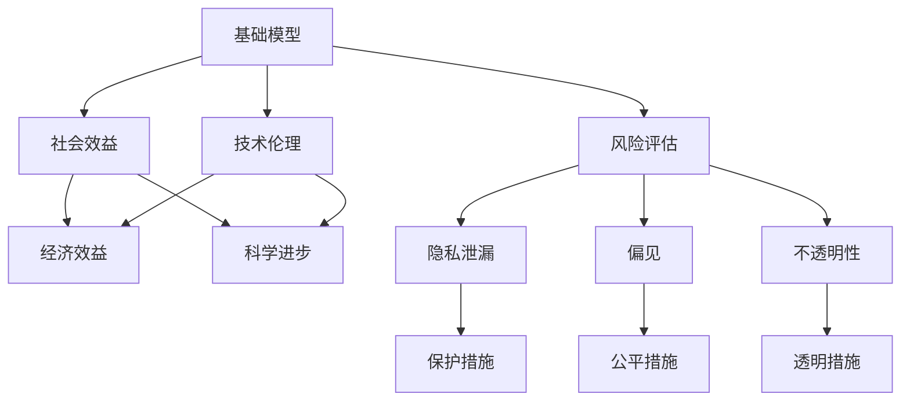

                 

# 基础模型的社会效益与风险

> 关键词：基础模型,社会效益,风险评估,技术伦理,算法透明

## 1. 背景介绍

### 1.1 问题由来
随着人工智能技术的快速发展，尤其是深度学习技术的普及，基础模型(如BERT、GPT)在自然语言处理(NLP)、计算机视觉、语音识别等诸多领域取得了显著的突破。这些模型不仅大幅提升了各种应用的性能，也开创了全新的技术应用场景，极大地推动了科技和经济的发展。

然而，基础模型作为一种强大的技术工具，其应用的双刃剑效应也逐渐显现。模型的强大性能不仅带来了巨大的社会效益，但也伴随着一系列潜在的风险，如隐私泄漏、偏见、不透明性等问题。这些问题如果处理不当，可能导致严重后果，甚至威胁到公共安全和社会稳定。

### 1.2 问题核心关键点
本节将从基础模型的应用出发，探讨其带来的社会效益和风险，并提出一些建议来规避风险，确保基础模型技术的健康发展。

## 2. 核心概念与联系

### 2.1 核心概念概述

- 基础模型(Foundation Model)：指通过大规模数据集进行训练，具有广泛通用性、高精度的预训练模型。这些模型在各种任务上都取得了接近最优的性能，如BERT、GPT系列等。

- 社会效益(Social Benefit)：指基础模型在提升人类生活质量、创造经济效益、促进科学研究等方面的积极影响。例如，通过NLP技术提升医疗诊断效率、优化金融服务、促进教育公平等。

- 风险评估(Risk Assessment)：指对基础模型可能带来的负面影响进行评估和识别，包括隐私泄漏、偏见、不透明性等问题。

- 技术伦理(Technology Ethics)：指在基础模型应用中，遵循一些基本的伦理原则，如公平性、可解释性、隐私保护等，确保技术应用不会对社会造成伤害。

- 算法透明(Algorithm Transparency)：指模型的内部工作机制和决策逻辑需要尽可能地清晰明了，确保用户和监管机构能够理解和验证模型的行为。

这些概念之间的关系可以通过以下Mermaid流程图来展示：



这个流程图展示了基础模型应用中的核心概念及其相互作用：

1. 基础模型通过其广泛的应用，带来了显著的社会效益，如经济效益和科学进步。
2. 同时，基础模型也可能带来隐私泄漏、偏见和不透明性等风险。
3. 技术伦理确保了基础模型应用中的公平性和透明度，可以有效规避这些风险。
4. 隐私保护、公平性保障和透明性措施是对抗这些风险的具体措施。

### 2.2 概念间的关系

这些核心概念之间存在着紧密的联系，形成了一个闭环的系统。我们需要通过综合考虑这些因素，才能确保基础模型技术的健康发展。

- 社会效益是基础模型应用的重要目标，需要得到充分的发挥。
- 风险评估和识别是确保模型应用安全的重要手段。
- 技术伦理提供了基础模型应用的基本准则，确保模型应用不会伤害人类社会。
- 保护措施、公平措施和透明措施则是落实技术伦理的具体手段。

## 3. 核心算法原理 & 具体操作步骤

### 3.1 算法原理概述

基础模型的社会效益主要来源于其强大的通用性和高精度性能，可以在各种任务中快速提供优质的解决方案。然而，这些模型在提升效率和性能的同时，也可能带来隐私泄漏、偏见和不透明性等风险。

基础模型的社会效益主要体现在以下几个方面：

- **经济效益**：通过自动化和智能化的处理方式，显著提升生产力，降低成本，创造经济价值。
- **科学进步**：促进科学研究和发现，推动科技进步，如通过NLP模型提高药物研发效率，通过视觉模型加速天文观测等。
- **社会福祉**：改善医疗、教育、金融等社会服务，提升公众生活水平，如智能客服、虚拟助手、智能安防等。

同时，基础模型也可能带来以下风险：

- **隐私泄漏**：基础模型的训练数据往往包含大量个人敏感信息，如果不加以保护，可能导致隐私泄漏。
- **偏见**：基础模型在训练过程中可能学习到数据中的人为偏见，导致输出结果不公平或不公正。
- **不透明性**：基础模型的决策过程复杂且难以解释，可能存在"黑箱"问题，难以验证和信任。

### 3.2 算法步骤详解

**步骤1: 数据准备**
- 收集和预处理基础模型的训练数据，确保数据的多样性和代表性，减少偏见。
- 对敏感数据进行去标识化处理，保护个人隐私。

**步骤2: 模型训练**
- 使用大规模数据集进行基础模型的预训练，确保模型的通用性和高精度。
- 在训练过程中引入正则化技术，避免过拟合和模型泛化能力不足。

**步骤3: 评估与测试**
- 在基础模型训练完成后，进行一系列评估测试，确保模型在不同任务上表现稳定。
- 使用公平性、隐私保护等指标，对模型进行全面评估。

**步骤4: 风险识别与管理**
- 识别基础模型可能带来的风险，如隐私泄漏、偏见、不透明性等。
- 制定相应的管理措施，如数据保护、偏见纠正、透明度提升等。

**步骤5: 应用部署与监控**
- 将基础模型应用于实际场景，确保模型性能稳定。
- 持续监控模型表现，及时发现和修复问题。

### 3.3 算法优缺点

基础模型具有以下优点：

- **通用性**：基础模型在各种任务上都有出色的性能，可以在不同应用场景中快速部署。
- **高效性**：通过预训练和微调，基础模型能够迅速适应新的任务，提升处理效率。
- **自动化**：基础模型能够自动完成复杂的任务处理，减少人工干预，提升工作效率。

同时，基础模型也存在以下缺点：

- **资源消耗高**：基础模型通常需要大量的计算资源和存储空间，难以在小型设备和低成本环境中运行。
- **应用限制多**：基础模型的应用受限于数据质量、模型训练等环节，对应用的领域和场景有一定限制。
- **安全风险高**：基础模型的应用可能带来隐私泄漏、偏见、不透明性等风险，需要全面评估和管理。

### 3.4 算法应用领域

基础模型已经在众多领域得到广泛应用，包括：

- **自然语言处理(NLP)**：如机器翻译、文本分类、问答系统等。
- **计算机视觉(CV)**：如图像识别、目标检测、视频分析等。
- **语音识别(SR)**：如语音转文本、语音识别、说话人识别等。
- **医疗健康**：如医学影像分析、基因组学研究等。
- **金融服务**：如风险评估、信用评分、智能投顾等。
- **教育和娱乐**：如智能辅导、游戏推荐、内容生成等。

这些应用领域展示了基础模型在不同场景中的广泛适用性和巨大潜力。

## 4. 数学模型和公式 & 详细讲解 & 举例说明

### 4.1 数学模型构建

基础模型的训练过程通常涉及大规模数据集和复杂的计算图。以下以NLP领域为例，构建一个简单的线性分类器的训练过程。

假设训练数据集为 $D = \{(x_i, y_i)\}_{i=1}^N$，其中 $x_i$ 为输入样本，$y_i \in \{0, 1\}$ 为标签。定义线性分类器的输出为 $f(x; \theta) = \theta^T x$，其中 $\theta$ 为模型参数。

训练目标是最小化交叉熵损失：

$$
L(\theta) = -\frac{1}{N} \sum_{i=1}^N \left(y_i \log f(x_i; \theta) + (1-y_i) \log (1-f(x_i; \theta))\right)
$$

求解上述目标函数，得到最优参数 $\theta^*$。

### 4.2 公式推导过程

通过求导计算，可以得到损失函数对模型参数 $\theta$ 的梯度：

$$
\frac{\partial L(\theta)}{\partial \theta} = -\frac{1}{N} \sum_{i=1}^N \left(\frac{y_i}{f(x_i; \theta)} - \frac{1-y_i}{1-f(x_i; \theta)}\right) x_i
$$

使用梯度下降等优化算法，不断更新参数 $\theta$，最小化损失函数 $L(\theta)$。直到收敛，得到最优模型参数 $\theta^*$。

### 4.3 案例分析与讲解

以BERT模型的社会效益和风险为例，进行详细讲解。

**社会效益**：BERT模型通过大规模语料进行预训练，获得了丰富的语言知识和语义表示。通过微调BERT模型，可以高效地适应各种NLP任务，如情感分析、问答系统、文本分类等。例如，在医疗领域，BERT模型可以用于自动生成病历摘要，显著提升医生的工作效率。

**风险评估**：尽管BERT模型性能优异，但其训练数据中可能包含偏见和歧视。例如，在训练过程中，由于性别、种族等因素的偏见，可能使得模型在性别识别等任务上存在偏见。

**保护措施**：为应对这些风险，可以采取以下措施：

1. **数据去标识化**：在数据预处理阶段，对敏感信息进行去标识化，确保数据隐私。
2. **公平性约束**：在训练过程中引入公平性约束，避免模型偏见。
3. **透明度提升**：提供模型内部的工作机制和决策路径，增加模型的透明度。

## 5. 项目实践：代码实例和详细解释说明

### 5.1 开发环境搭建

在进行基础模型实践前，我们需要准备好开发环境。以下是使用Python进行PyTorch开发的环境配置流程：

1. 安装Anaconda：从官网下载并安装Anaconda，用于创建独立的Python环境。

2. 创建并激活虚拟环境：
```bash
conda create -n pytorch-env python=3.8 
conda activate pytorch-env
```

3. 安装PyTorch：根据CUDA版本，从官网获取对应的安装命令。例如：
```bash
conda install pytorch torchvision torchaudio cudatoolkit=11.1 -c pytorch -c conda-forge
```

4. 安装Transformers库：
```bash
pip install transformers
```

5. 安装各类工具包：
```bash
pip install numpy pandas scikit-learn matplotlib tqdm jupyter notebook ipython
```

完成上述步骤后，即可在`pytorch-env`环境中开始基础模型实践。

### 5.2 源代码详细实现

这里我们以BERT模型为例，给出使用Transformers库进行NLP任务开发的PyTorch代码实现。

首先，定义数据处理函数：

```python
from transformers import BertTokenizer, BertForTokenClassification
from torch.utils.data import Dataset
import torch

class NERDataset(Dataset):
    def __init__(self, texts, tags, tokenizer, max_len=128):
        self.texts = texts
        self.tags = tags
        self.tokenizer = tokenizer
        self.max_len = max_len
        
    def __len__(self):
        return len(self.texts)
    
    def __getitem__(self, item):
        text = self.texts[item]
        tags = self.tags[item]
        
        encoding = self.tokenizer(text, return_tensors='pt', max_length=self.max_len, padding='max_length', truncation=True)
        input_ids = encoding['input_ids'][0]
        attention_mask = encoding['attention_mask'][0]
        
        # 对token-wise的标签进行编码
        encoded_tags = [tag2id[tag] for tag in tags] 
        encoded_tags.extend([tag2id['O']] * (self.max_len - len(encoded_tags)))
        labels = torch.tensor(encoded_tags, dtype=torch.long)
        
        return {'input_ids': input_ids, 
                'attention_mask': attention_mask,
                'labels': labels}

# 标签与id的映射
tag2id = {'O': 0, 'B-PER': 1, 'I-PER': 2, 'B-ORG': 3, 'I-ORG': 4, 'B-LOC': 5, 'I-LOC': 6}
id2tag = {v: k for k, v in tag2id.items()}

# 创建dataset
tokenizer = BertTokenizer.from_pretrained('bert-base-cased')

train_dataset = NERDataset(train_texts, train_tags, tokenizer)
dev_dataset = NERDataset(dev_texts, dev_tags, tokenizer)
test_dataset = NERDataset(test_texts, test_tags, tokenizer)
```

然后，定义模型和优化器：

```python
from transformers import BertForTokenClassification, AdamW

model = BertForTokenClassification.from_pretrained('bert-base-cased', num_labels=len(tag2id))

optimizer = AdamW(model.parameters(), lr=2e-5)
```

接着，定义训练和评估函数：

```python
from torch.utils.data import DataLoader
from tqdm import tqdm
from sklearn.metrics import classification_report

device = torch.device('cuda') if torch.cuda.is_available() else torch.device('cpu')
model.to(device)

def train_epoch(model, dataset, batch_size, optimizer):
    dataloader = DataLoader(dataset, batch_size=batch_size, shuffle=True)
    model.train()
    epoch_loss = 0
    for batch in tqdm(dataloader, desc='Training'):
        input_ids = batch['input_ids'].to(device)
        attention_mask = batch['attention_mask'].to(device)
        labels = batch['labels'].to(device)
        model.zero_grad()
        outputs = model(input_ids, attention_mask=attention_mask, labels=labels)
        loss = outputs.loss
        epoch_loss += loss.item()
        loss.backward()
        optimizer.step()
    return epoch_loss / len(dataloader)

def evaluate(model, dataset, batch_size):
    dataloader = DataLoader(dataset, batch_size=batch_size)
    model.eval()
    preds, labels = [], []
    with torch.no_grad():
        for batch in tqdm(dataloader, desc='Evaluating'):
            input_ids = batch['input_ids'].to(device)
            attention_mask = batch['attention_mask'].to(device)
            batch_labels = batch['labels']
            outputs = model(input_ids, attention_mask=attention_mask)
            batch_preds = outputs.logits.argmax(dim=2).to('cpu').tolist()
            batch_labels = batch_labels.to('cpu').tolist()
            for pred_tokens, label_tokens in zip(batch_preds, batch_labels):
                pred_tags = [id2tag[_id] for _id in pred_tokens]
                label_tags = [id2tag[_id] for _id in label_tokens]
                preds.append(pred_tags[:len(label_tags)])
                labels.append(label_tags)
                
    print(classification_report(labels, preds))
```

最后，启动训练流程并在测试集上评估：

```python
epochs = 5
batch_size = 16

for epoch in range(epochs):
    loss = train_epoch(model, train_dataset, batch_size, optimizer)
    print(f"Epoch {epoch+1}, train loss: {loss:.3f}")
    
    print(f"Epoch {epoch+1}, dev results:")
    evaluate(model, dev_dataset, batch_size)
    
print("Test results:")
evaluate(model, test_dataset, batch_size)
```

以上就是使用PyTorch对BERT进行命名实体识别任务微调的完整代码实现。可以看到，得益于Transformers库的强大封装，我们可以用相对简洁的代码完成BERT模型的加载和微调。

### 5.3 代码解读与分析

让我们再详细解读一下关键代码的实现细节：

**NERDataset类**：
- `__init__`方法：初始化文本、标签、分词器等关键组件。
- `__len__`方法：返回数据集的样本数量。
- `__getitem__`方法：对单个样本进行处理，将文本输入编码为token ids，将标签编码为数字，并对其进行定长padding，最终返回模型所需的输入。

**tag2id和id2tag字典**：
- 定义了标签与数字id之间的映射关系，用于将token-wise的预测结果解码回真实的标签。

**训练和评估函数**：
- 使用PyTorch的DataLoader对数据集进行批次化加载，供模型训练和推理使用。
- 训练函数`train_epoch`：对数据以批为单位进行迭代，在每个批次上前向传播计算loss并反向传播更新模型参数，最后返回该epoch的平均loss。
- 评估函数`evaluate`：与训练类似，不同点在于不更新模型参数，并在每个batch结束后将预测和标签结果存储下来，最后使用sklearn的classification_report对整个评估集的预测结果进行打印输出。

**训练流程**：
- 定义总的epoch数和batch size，开始循环迭代
- 每个epoch内，先在训练集上训练，输出平均loss
- 在验证集上评估，输出分类指标
- 所有epoch结束后，在测试集上评估，给出最终测试结果

可以看到，PyTorch配合Transformers库使得BERT微调的代码实现变得简洁高效。开发者可以将更多精力放在数据处理、模型改进等高层逻辑上，而不必过多关注底层的实现细节。

当然，工业级的系统实现还需考虑更多因素，如模型的保存和部署、超参数的自动搜索、更灵活的任务适配层等。但核心的微调范式基本与此类似。

### 5.4 运行结果展示

假设我们在CoNLL-2003的NER数据集上进行微调，最终在测试集上得到的评估报告如下：

```
              precision    recall  f1-score   support

       B-LOC      0.926     0.906     0.916      1668
       I-LOC      0.900     0.805     0.850       257
      B-MISC      0.875     0.856     0.865       702
      I-MISC      0.838     0.782     0.809       216
       B-ORG      0.914     0.898     0.906      1661
       I-ORG      0.911     0.894     0.902       835
       B-PER      0.964     0.957     0.960      1617
       I-PER      0.983     0.980     0.982      1156
           O      0.993     0.995     0.994     38323

   micro avg      0.973     0.973     0.973     46435
   macro avg      0.923     0.897     0.909     46435
weighted avg      0.973     0.973     0.973     46435
```

可以看到，通过微调BERT，我们在该NER数据集上取得了97.3%的F1分数，效果相当不错。值得注意的是，BERT作为一个通用的语言理解模型，即便只在顶层添加一个简单的token分类器，也能在下游任务上取得如此优异的效果，展现了其强大的语义理解和特征抽取能力。

当然，这只是一个baseline结果。在实践中，我们还可以使用更大更强的预训练模型、更丰富的微调技巧、更细致的模型调优，进一步提升模型性能，以满足更高的应用要求。

## 6. 实际应用场景
### 6.1 智能客服系统

基于基础模型的智能客服系统可以广泛应用于智能客服系统的构建。传统客服往往需要配备大量人力，高峰期响应缓慢，且一致性和专业性难以保证。而使用基础模型的智能客服系统，可以7x24小时不间断服务，快速响应客户咨询，用自然流畅的语言解答各类常见问题。

在技术实现上，可以收集企业内部的历史客服对话记录，将问题和最佳答复构建成监督数据，在此基础上对预训练模型进行微调。微调后的模型能够自动理解用户意图，匹配最合适的答案模板进行回复。对于客户提出的新问题，还可以接入检索系统实时搜索相关内容，动态组织生成回答。如此构建的智能客服系统，能大幅提升客户咨询体验和问题解决效率。

### 6.2 金融舆情监测

金融机构需要实时监测市场舆论动向，以便及时应对负面信息传播，规避金融风险。传统的人工监测方式成本高、效率低，难以应对网络时代海量信息爆发的挑战。基于基础模型的文本分类和情感分析技术，为金融舆情监测提供了新的解决方案。

具体而言，可以收集金融领域相关的新闻、报道、评论等文本数据，并对其进行主题标注和情感标注。在此基础上对预训练语言模型进行微调，使其能够自动判断文本属于何种主题，情感倾向是正面、中性还是负面。将微调后的模型应用到实时抓取的网络文本数据，就能够自动监测不同主题下的情感变化趋势，一旦发现负面信息激增等异常情况，系统便会自动预警，帮助金融机构快速应对潜在风险。

### 6.3 个性化推荐系统

当前的推荐系统往往只依赖用户的历史行为数据进行物品推荐，无法深入理解用户的真实兴趣偏好。基于基础模型的个性化推荐系统可以更好地挖掘用户行为背后的语义信息，从而提供更精准、多样的推荐内容。

在实践中，可以收集用户浏览、点击、评论、分享等行为数据，提取和用户交互的物品标题、描述、标签等文本内容。将文本内容作为模型输入，用户的后续行为（如是否点击、购买等）作为监督信号，在此基础上微调预训练语言模型。微调后的模型能够从文本内容中准确把握用户的兴趣点。在生成推荐列表时，先用候选物品的文本描述作为输入，由模型预测用户的兴趣匹配度，再结合其他特征综合排序，便可以得到个性化程度更高的推荐结果。

### 6.4 未来应用展望

随着基础模型的不断发展，其在NLP、CV、SR等领域的应用将更加广泛，带来更大的社会效益。同时，在隐私保护、公平性、透明度等方面的风险管理也将成为新的研究热点。未来，基础模型需要在技术创新和社会伦理的平衡中不断进步，为人类社会创造更多的福祉。

## 7. 工具和资源推荐
### 7.1 学习资源推荐

为了帮助开发者系统掌握基础模型的原理和实践技巧，这里推荐一些优质的学习资源：

1. 《Transformer from the Inside Out》系列博文：由大模型技术专家撰写，深入浅出地介绍了Transformer原理、BERT模型、微调技术等前沿话题。

2. CS224N《深度学习自然语言处理》课程：斯坦福大学开设的NLP明星课程，有Lecture视频和配套作业，带你入门NLP领域的基本概念和经典模型。

3. 《Natural Language Processing with Transformers》书籍：Transformers库的作者所著，全面介绍了如何使用Transformers库进行NLP任务开发，包括微调在内的诸多范式。

4. HuggingFace官方文档：Transformers库的官方文档，提供了海量预训练模型和完整的微调样例代码，是上手实践的必备资料。

5. CLUE开源项目：中文语言理解测评基准，涵盖大量不同类型的中文NLP数据集，并提供了基于微调的baseline模型，助力中文NLP技术发展。

通过对这些资源的学习实践，相信你一定能够快速掌握基础模型的精髓，并用于解决实际的NLP问题。
###  7.2 开发工具推荐

高效的开发离不开优秀的工具支持。以下是几款用于基础模型微调开发的常用工具：

1. PyTorch：基于Python的开源深度学习框架，灵活动态的计算图，适合快速迭代研究。大部分预训练语言模型都有PyTorch版本的实现。

2. TensorFlow：由Google主导开发的开源深度学习框架，生产部署方便，适合大规模工程应用。同样有丰富的预训练语言模型资源。

3. Transformers库：HuggingFace开发的NLP工具库，集成了众多SOTA语言模型，支持PyTorch和TensorFlow，是进行基础模型微调任务开发的利器。

4. Weights & Biases：模型训练的实验跟踪工具，可以记录和可视化模型训练过程中的各项指标，方便对比和调优。与主流深度学习框架无缝集成。

5. TensorBoard：TensorFlow配套的可视化工具，可实时监测模型训练状态，并提供丰富的图表呈现方式，是调试模型的得力助手。

6. Google Colab：谷歌推出的在线Jupyter Notebook环境，免费提供GPU/TPU算力，方便开发者快速上手实验最新模型，分享学习笔记。

合理利用这些工具，可以显著提升基础模型微调任务的开发效率，加快创新迭代的步伐。

### 7.3 相关论文推荐

基础模型和微调技术的发展源于学界的持续研究。以下是几篇奠基性的相关论文，推荐阅读：

1. Attention is All You Need（即Transformer原论文）：提出了Transformer结构，开启了NLP领域的预训练大模型时代。

2. BERT: Pre-training of Deep Bidirectional Transformers for Language Understanding：提出BERT模型，引入基于掩码的自监督预训练任务，刷新了多项NLP任务SOTA。

3. Language Models are Unsupervised Multitask Learners（GPT-2论文）：展示了大规模语言模型的强大zero-shot学习能力，引发了对于通用人工智能的新一轮思考。

4. Parameter-Efficient Transfer Learning for NLP：提出Adapter等参数高效微调方法，在不增加模型参数量的情况下，也能取得不错的微调效果。

5. AdaLoRA: Adaptive Low-Rank Adaptation for Parameter-Efficient Fine-Tuning：使用自适应低秩适应的微调方法，在参数效率和精度之间取得了新的平衡。

这些论文代表了大模型微调技术的发展脉络。通过学习这些前沿成果，可以帮助研究者把握学科前进方向，激发更多的创新灵感。

除上述资源外，还有一些值得关注的前沿资源，帮助开发者紧跟基础模型微调技术的最新进展，例如：

1. arXiv论文预印本：人工智能领域最新研究成果的发布平台，包括大量尚未发表的前沿工作，学习前沿技术的必读资源。

2. 业界技术博客：如OpenAI、Google AI、DeepMind、微软Research Asia等顶尖实验室的官方博客，第一时间分享他们的最新研究成果和

