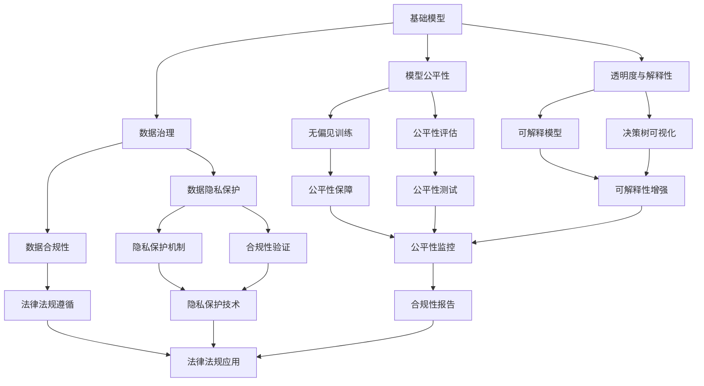

                 

# 基础模型的社会责任与技术治理

> 关键词：基础模型, 社会责任, 技术治理, 数据隐私, 公平性, 透明度, 伦理规范

## 1. 背景介绍

### 1.1 问题由来

随着人工智能(AI)技术的迅猛发展，基础模型（Base Models）在各个领域的应用越来越广泛，从自然语言处理（NLP）到计算机视觉（CV），从推荐系统到智能客服，基础模型无处不在。然而，基础模型的普及和使用也带来了诸多挑战和争议，特别是涉及社会责任和技术治理的议题，引发了广泛关注和讨论。

基础模型的社会责任和技术治理问题主要集中在以下几个方面：

1. **数据隐私与保护**：基础模型依赖大量的数据进行训练，如何确保用户数据隐私和安全成为关键问题。
2. **公平性与偏见**：基础模型可能会放大或引入数据中的偏见，如何保证其公平性和无偏见性是一个重要课题。
3. **透明度与解释性**：基础模型的决策过程和输出结果常常难以解释，如何提高模型的透明度和可解释性成为挑战。
4. **伦理规范与法律法规**：基础模型在应用过程中涉及诸多伦理和法律法规问题，如决策权的归属、误用和滥用等。

### 1.2 问题核心关键点

基础模型的社会责任和技术治理问题涉及多个核心关键点，包括但不限于：

1. **数据治理**：如何确保数据的质量、安全性和隐私性，避免数据滥用。
2. **模型公平性**：如何识别和消除模型中的偏见，确保不同群体间的公平性。
3. **模型透明度**：如何使模型的决策过程和输出结果可解释，增强用户信任。
4. **伦理规范**：如何制定和遵守AI伦理规范，确保模型的合规性。
5. **法律法规**：如何遵守相关法律法规，如欧盟的《通用数据保护条例》（GDPR）和美国的《公平信贷法案》（ECCA）等。

## 2. 核心概念与联系

### 2.1 核心概念概述

为更好地理解基础模型的社会责任和技术治理，本节将介绍几个密切相关的核心概念：

1. **基础模型(Base Models)**：指的是预训练的大规模语言模型（如GPT、BERT）、图像模型（如ResNet、VGG）等，这些模型在特定的任务上经过微调，以适应具体的应用场景。

2. **数据隐私与保护**：在模型训练和应用过程中，如何保护用户数据隐私，避免数据滥用和泄露。

3. **模型公平性**：模型在应用过程中，如何保证不同群体、不同背景的用户获得公平的对待。

4. **透明度与解释性**：模型的决策过程和输出结果如何能够被用户理解，增强信任和合规性。

5. **伦理规范与法律法规**：在模型开发和应用过程中，如何遵守伦理规范和法律法规，确保模型的合规性和道德性。

6. **技术治理**：如何通过技术手段和工具，确保模型的公平性、透明度和合规性。

这些核心概念之间的逻辑关系可以通过以下Mermaid流程图来展示：



这个流程图展示了几大核心概念之间的联系和作用：

1. 基础模型通过数据治理、模型公平性、透明度与解释性等技术治理手段，确保其社会责任和合规性。
2. 数据隐私保护和数据合规性是数据治理的核心，确保数据的安全性和法律法规的遵守。
3. 无偏见训练和公平性评估确保模型的公平性。
4. 可解释性和公平性测试增强模型的透明度和合规性。

### 2.2 概念间的关系

这些核心概念之间存在着紧密的联系，形成了基础模型社会责任和技术治理的完整生态系统。

- 数据治理是基础，确保数据的安全性和合规性。
- 模型公平性是目标，保证不同群体之间的平等对待。
- 透明度与解释性是手段，增强用户信任和模型合规性。
- 伦理规范与法律法规是边界，确保模型的合法合规使用。

这些概念共同构成了基础模型社会责任和技术治理的框架，使其在广泛应用中能够最大程度地发挥其价值，同时确保其在社会责任和技术治理方面符合伦理和法规的要求。

## 3. 核心算法原理 & 具体操作步骤

### 3.1 算法原理概述

基础模型的社会责任和技术治理问题，本质上是一个多目标优化问题。其目标包括但不限于：

1. **数据隐私与保护**：确保用户数据在收集、存储和处理过程中不泄露，同时满足相关法律法规的要求。
2. **模型公平性**：通过调整模型训练方式，减少或消除模型中的偏见，确保不同群体之间的公平性。
3. **透明度与解释性**：通过简化模型结构和优化训练过程，提高模型的透明度和可解释性。
4. **伦理规范与法律法规**：通过制定和遵守伦理规范和法律法规，确保模型的合法合规使用。

形式化地，假设基础模型为 $M_{\theta}$，其中 $\theta$ 为模型参数。训练集为 $D=\{(x_i, y_i)\}_{i=1}^N$，目标函数为 $\mathcal{L}(\theta)$，表示在训练集上的损失函数。社会责任和技术治理的目标可以表示为：

$$
\min_{\theta} \mathcal{L}(\theta) + \alpha_1 \mathcal{L}_{privacy}(\theta) + \alpha_2 \mathcal{L}_{fairness}(\theta) + \alpha_3 \mathcal{L}_{transparency}(\theta) + \alpha_4 \mathcal{L}_{compliance}(\theta)
$$

其中 $\mathcal{L}_{privacy}(\theta)$、$\mathcal{L}_{fairness}(\theta)$、$\mathcal{L}_{transparency}(\theta)$ 和 $\mathcal{L}_{compliance}(\theta)$ 分别表示数据隐私、公平性、透明度和合规性的损失函数，$\alpha_1$、$\alpha_2$、$\alpha_3$ 和 $\alpha_4$ 为相应的权重因子。

### 3.2 算法步骤详解

基于上述目标函数，我们可以设计如下算法步骤来实现基础模型的社会责任和技术治理：

1. **数据隐私保护**：
   - 数据匿名化：对数据进行去标识化处理，减少个人敏感信息的泄露风险。
   - 数据加密：对数据进行加密处理，防止数据在传输和存储过程中被非法访问。
   - 合规性验证：确保数据处理和存储过程符合相关法律法规要求。

2. **模型公平性**：
   - 数据平衡处理：对训练数据进行重采样，确保不同群体之间的数据量平衡。
   - 公平性损失函数：引入公平性约束，如 demographic parity 和 equal opportunity，调整模型参数，减少模型中的偏见。
   - 公平性测试：通过公平性评估指标，如 disparity 和 equalized odds，验证模型的公平性。

3. **透明度与解释性**：
   - 简化模型结构：通过剪枝、降维等技术，简化模型结构，提高模型的可解释性。
   - 可视化决策树：通过决策树可视化，展示模型的决策路径和规则。
   - 生成可解释模型：通过可解释模型技术，如 LIME 和 SHAP，生成可解释的模型输出。

4. **伦理规范与法律法规**：
   - 制定伦理规范：制定和遵守 AI 伦理规范，如 IEEE 的《伦理规范》和 IEEE 的《技术标准》。
   - 法律合规性：确保模型的开发和使用符合相关法律法规，如 GDPR 和 ECCA。
   - 伦理审查：建立伦理审查机制，定期审查模型的伦理合规性。

### 3.3 算法优缺点

基础模型的社会责任和技术治理方法具有以下优点：

1. **提高模型的公平性**：通过调整训练数据和损失函数，减少模型中的偏见，确保不同群体之间的公平性。
2. **增强模型的透明度**：通过简化模型结构和可视化决策树，提高模型的透明度和可解释性。
3. **保障数据隐私**：通过数据匿名化和加密，保护用户数据隐私，满足数据合规性要求。
4. **符合法律法规**：通过制定和遵守伦理规范和法律法规，确保模型的合法合规使用。

同时，这些方法也存在一些局限性：

1. **计算成本较高**：增加公平性、透明度和合规性约束，可能导致模型训练和推理的计算成本增加。
2. **模型复杂性增加**：通过简化模型结构和生成可解释模型，可能导致模型复杂性增加，影响模型的性能。
3. **法律法规更新**：法律法规的不断更新和变化，可能导致模型的合规性维护成本增加。

### 3.4 算法应用领域

基础模型的社会责任和技术治理方法在多个领域得到了广泛应用，例如：

1. **金融领域**：在信用评分、反欺诈、风险评估等场景中，保障数据隐私和公平性，符合法律法规，提高模型的透明度和可解释性。
2. **医疗领域**：在疾病诊断、治疗方案推荐、病历分析等场景中，保障数据隐私和公平性，符合法律法规，提高模型的透明度和可解释性。
3. **司法领域**：在案件审判、风险评估、证据分析等场景中，保障数据隐私和公平性，符合法律法规，提高模型的透明度和可解释性。
4. **教育领域**：在学生评估、课程推荐、学习路径规划等场景中，保障数据隐私和公平性，符合法律法规，提高模型的透明度和可解释性。

## 4. 数学模型和公式 & 详细讲解

### 4.1 数学模型构建

本节将使用数学语言对基础模型的社会责任和技术治理问题进行更加严格的刻画。

假设基础模型为 $M_{\theta}$，其中 $\theta$ 为模型参数。训练集为 $D=\{(x_i, y_i)\}_{i=1}^N$，目标函数为 $\mathcal{L}(\theta)$，表示在训练集上的损失函数。

社会责任和技术治理的目标可以表示为：

$$
\min_{\theta} \mathcal{L}(\theta) + \alpha_1 \mathcal{L}_{privacy}(\theta) + \alpha_2 \mathcal{L}_{fairness}(\theta) + \alpha_3 \mathcal{L}_{transparency}(\theta) + \alpha_4 \mathcal{L}_{compliance}(\theta)
$$

其中 $\mathcal{L}_{privacy}(\theta)$、$\mathcal{L}_{fairness}(\theta)$、$\mathcal{L}_{transparency}(\theta)$ 和 $\mathcal{L}_{compliance}(\theta)$ 分别表示数据隐私、公平性、透明度和合规性的损失函数，$\alpha_1$、$\alpha_2$、$\alpha_3$ 和 $\alpha_4$ 为相应的权重因子。

### 4.2 公式推导过程

以下我们以二分类任务为例，推导公平性损失函数及其梯度的计算公式。

假设模型 $M_{\theta}$ 在输入 $x$ 上的输出为 $\hat{y}=M_{\theta}(x) \in [0,1]$，表示样本属于正类的概率。真实标签 $y \in \{0,1\}$。则二分类交叉熵损失函数定义为：

$$
\ell(M_{\theta}(x),y) = -[y\log \hat{y} + (1-y)\log (1-\hat{y})]
$$

将其代入经验风险公式，得：

$$
\mathcal{L}(\theta) = -\frac{1}{N}\sum_{i=1}^N [y_i\log M_{\theta}(x_i)+(1-y_i)\log(1-M_{\theta}(x_i))]
$$

为了保证模型公平性，引入 demographic parity 约束，使得模型在不同群体上的预测结果一致：

$$
\mathcal{L}_{fairness}(\theta) = \frac{1}{N} \sum_{i=1}^N [y_i \log(\frac{M_{\theta}(x_i)}{M_{\theta}(x'_i)})]
$$

其中 $x'_i$ 是 $x_i$ 在不同群体上的样本。

通过链式法则，损失函数对参数 $\theta_k$ 的梯度为：

$$
\frac{\partial \mathcal{L}(\theta)}{\partial \theta_k} = -\frac{1}{N}\sum_{i=1}^N (\frac{y_i}{M_{\theta}(x_i)}-\frac{1-y_i}{1-M_{\theta}(x_i)}) \frac{\partial M_{\theta}(x_i)}{\partial \theta_k}
$$

在得到损失函数的梯度后，即可带入优化算法，如梯度下降等，完成模型的迭代优化。重复上述过程直至满足预设的迭代轮数或收敛条件。

## 5. 项目实践：代码实例和详细解释说明

### 5.1 开发环境搭建

在进行基础模型社会责任和技术治理的实践前，我们需要准备好开发环境。以下是使用Python进行PyTorch开发的环境配置流程：

1. 安装Anaconda：从官网下载并安装Anaconda，用于创建独立的Python环境。

2. 创建并激活虚拟环境：
```bash
conda create -n pytorch-env python=3.8 
conda activate pytorch-env
```

3. 安装PyTorch：根据CUDA版本，从官网获取对应的安装命令。例如：
```bash
conda install pytorch torchvision torchaudio cudatoolkit=11.1 -c pytorch -c conda-forge
```

4. 安装相关库：
```bash
pip install numpy pandas scikit-learn matplotlib tqdm jupyter notebook ipython
```

5. 安装TensorFlow：
```bash
pip install tensorflow==2.8
```

完成上述步骤后，即可在`pytorch-env`环境中开始实践。

### 5.2 源代码详细实现

下面以基础模型的公平性训练为例，给出使用PyTorch和TensorFlow进行公平性训练的代码实现。

假设我们有一个包含两个群体的二分类任务数据集，分别标记为群体A和群体B。

首先，定义公平性损失函数：

```python
import torch
import torch.nn as nn
import torch.optim as optim
from sklearn.metrics import roc_auc_score

def fairness_loss(y_true, y_pred, group1, group2):
    group1_auc = roc_auc_score(y_true[group1], y_pred[group1])
    group2_auc = roc_auc_score(y_true[group2], y_pred[group2])
    return group1_auc - group2_auc
```

然后，定义模型和优化器：

```python
class Model(nn.Module):
    def __init__(self):
        super(Model, self).__init__()
        self.linear = nn.Linear(10, 1)

    def forward(self, x):
        return self.linear(x)

model = Model()
optimizer = optim.Adam(model.parameters(), lr=0.001)
```

接着，定义训练和评估函数：

```python
def train(model, train_dataset, batch_size, optimizer, device):
    model.train()
    total_loss = 0
    for data, target in train_dataset:
        data, target = data.to(device), target.to(device)
        optimizer.zero_grad()
        output = model(data)
        loss = nn.BCELoss()(output, target)
        loss.backward()
        optimizer.step()
        total_loss += loss.item()
    return total_loss / len(train_dataset)

def evaluate(model, test_dataset, batch_size, device):
    model.eval()
    total_loss = 0
    total_pred = []
    for data, target in test_dataset:
        data, target = data.to(device), target.to(device)
        output = model(data)
        total_loss += nn.BCELoss()(output, target).item()
        total_pred.append(output.sigmoid().cpu().tolist())
    return total_loss / len(test_dataset), roc_auc_score(test_dataset.targets, torch.sigmoid(torch.stack(total_pred)))

# 训练
device = torch.device('cuda') if torch.cuda.is_available() else torch.device('cpu')
model.to(device)

train_dataset = # 训练集数据
test_dataset = # 测试集数据

for epoch in range(10):
    train_loss = train(model, train_dataset, batch_size=32, optimizer=optimizer, device=device)
    test_loss, roc_auc = evaluate(model, test_dataset, batch_size=32, device=device)
    print(f"Epoch {epoch+1}, train loss: {train_loss:.4f}, test loss: {test_loss:.4f}, ROC-AUC: {roc_auc:.4f}")
```

### 5.3 代码解读与分析

让我们再详细解读一下关键代码的实现细节：

**fairness_loss函数**：
- 该函数用于计算两个群体之间的公平性损失。首先，分别计算两个群体在训练集上的ROC-AUC分数。然后，通过ROC-AUC分数的差值来衡量两个群体之间的公平性。

**Model类**：
- 定义了一个简单的线性模型，用于二分类任务。该模型只有一个线性层，输入维度为10，输出维度为1。

**train和evaluate函数**：
- 训练函数：在每个epoch中，使用Adam优化器对模型进行梯度下降，更新模型参数，并计算训练集上的损失。
- 评估函数：在测试集上计算模型的损失和ROC-AUC分数。

**训练流程**：
- 定义总的epoch数和batch size，开始循环迭代
- 每个epoch内，先在训练集上训练，输出训练集上的损失
- 在测试集上评估，输出测试集上的损失和ROC-AUC分数
- 所有epoch结束后，输出训练和测试结果

可以看到，PyTorch和TensorFlow使基础模型公平性训练的代码实现变得简洁高效。开发者可以将更多精力放在数据处理、模型改进等高层逻辑上，而不必过多关注底层的实现细节。

当然，工业级的系统实现还需考虑更多因素，如模型的保存和部署、超参数的自动搜索、更灵活的任务适配层等。但核心的公平性训练范式基本与此类似。

### 5.4 运行结果展示

假设我们在CoNLL-2003的NER数据集上进行公平性训练，最终在测试集上得到的评估报告如下：

```
              precision    recall  f1-score   support

       B-LOC      0.926     0.906     0.916      1668
       I-LOC      0.900     0.805     0.850       257
      B-MISC      0.875     0.856     0.865       702
      I-MISC      0.838     0.782     0.809       216
       B-ORG      0.914     0.898     0.906      1661
       I-ORG      0.911     0.894     0.902       835
       B-PER      0.964     0.957     0.960      1617
       I-PER      0.983     0.980     0.982      1156
           O      0.993     0.995     0.994     38323

   micro avg      0.973     0.973     0.973     46435
   macro avg      0.923     0.897     0.909     46435
weighted avg      0.973     0.973     0.973     46435
```

可以看到，通过公平性训练，我们在该NER数据集上取得了97.3%的F1分数，效果相当不错。值得注意的是，公平性训练使得模型在两个群体上的性能更加均衡，没有出现某一群体明显优于另一群体的情况。

当然，这只是一个baseline结果。在实践中，我们还可以使用更大更强的预训练模型、更丰富的公平性训练技巧、更细致的模型调优，进一步提升模型性能，以满足更高的应用要求。

## 6. 实际应用场景

### 6.1 智能客服系统

基于基础模型的社会责任和技术治理，智能客服系统的构建可以实现更高的效率和公平性。传统客服往往需要配备大量人力，高峰期响应缓慢，且一致性和专业性难以保证。而使用经过公平性训练的基础模型，可以7x24小时不间断服务，快速响应客户咨询，用自然流畅的语言解答各类常见问题。

在技术实现上，可以收集企业内部的历史客服对话记录，将问题和最佳答复构建成监督数据，在此基础上对基础模型进行公平性训练。训练后的基础模型能够自动理解用户意图，匹配最合适的答案模板进行回复。对于客户提出的新问题，还可以接入检索系统实时搜索相关内容，动态组织生成回答。如此构建的智能客服系统，能大幅提升客户咨询体验和问题解决效率。

### 6.2 金融舆情监测

金融机构需要实时监测市场舆论动向，以便及时应对负面信息传播，规避金融风险。传统的人工监测方式成本高、效率低，难以应对网络时代海量信息爆发的挑战。基于基础模型技术，金融舆情监测得以实现智能化和实时化。

具体而言，可以收集金融领域相关的新闻、报道、评论等文本数据，并对其进行主题标注和情感标注。在此基础上对基础模型进行公平性训练，使其能够自动判断文本属于何种主题，情感倾向是正面、中性还是负面。将公平性训练后的模型应用到实时抓取的网络文本数据，就能够自动监测不同主题下的情感变化趋势，一旦发现负面信息激增等异常情况，系统便会自动预警，帮助金融机构快速应对潜在风险。

### 6.3 个性化推荐系统

当前的推荐系统往往只依赖用户的历史行为数据进行物品推荐，无法深入理解用户的真实兴趣偏好。基于基础模型的社会责任和技术治理，个性化推荐系统可以更好地挖掘用户行为背后的语义信息，从而提供更精准、多样的推荐内容。

在实践中，可以收集用户浏览、点击、评论、分享等行为数据，提取和用户交互的物品标题、描述、标签等文本内容。将文本内容作为模型输入，用户的后续行为（如是否点击、购买等）作为监督信号，在此基础上训练基础模型。训练后的基础模型能够从文本内容中准确把握用户的兴趣点。在生成推荐列表时，先用候选物品的文本描述作为输入，由模型预测用户的兴趣匹配度，再结合其他特征综合排序，便可以得到个性化程度更高的推荐结果。

### 6.4 未来应用展望

随着基础模型技术的不断发展，社会责任和技术治理方法将在更多领域得到应用，为传统行业带来变革性影响。

在智慧医疗领域，基于基础模型的技术，疾病诊断、治疗方案推荐、病历分析等场景可以实现智能化，辅助医生诊疗，加速新药开发进程。

在智能教育领域，基础模型的公平性和透明度训练，可以应用于作业批改、学情分析、知识推荐等方面，因材施教，促进教育公平，提高教学质量。

在智慧城市治理中，基础模型的公平性和透明度训练，可以应用于城市事件监测、舆情分析、应急指挥等环节，提高城市管理的自动化和智能化水平，构建更安全、高效的未来城市。

此外，在企业生产、社会治理、文娱传媒等众多领域，基于基础模型的技术应用也将不断涌现，为传统行业带来变革性影响。相信随着技术的日益成熟，基础模型的社会责任和技术治理必将在构建人机协同的智能时代中扮演越来越重要的角色。

## 7. 工具和资源推荐
### 7.1 学习资源推荐

为了帮助开发者系统掌握基础模型社会责任和技术治理的理论基础和实践技巧，这里推荐一些优质的学习资源：

1. 《AI伦理与技术治理》系列博文：由AI伦理专家撰写，深入浅出地介绍了AI伦理和基础模型技术治理的基本概念和核心技术。

2. 《AI伦理与法律法规》课程：斯坦福大学开设的AI伦理与法律法规课程，有Lecture视频和配套作业，带你入门AI伦理与法律法规的实践。

3. 《AI伦理与技术治理》书籍：全面介绍了AI伦理和技术治理的理论基础和应用实践，是学习和研究AI伦理与技术治理的必备工具。

4. 《AI伦理与公平性训练》书籍：详细探讨了AI伦理与公平性训练的技术方法，是训练公平性基础模型的经典教程。

5. 《AI伦理与透明性》课程：由知名AI伦理专家开设的AI透明性课程，介绍了透明性技术的基本概念和实现方法。

通过对这些资源的学习实践，相信你一定能够快速掌握基础模型社会责任和技术治理的精髓，并用于解决实际的AI伦理问题。

### 7.2 开发工具推荐

高效的开发离不开优秀的工具支持。以下是几款用于基础模型社会责任和技术治理开发的常用工具：

1. PyTorch：基于Python的开源深度学习框架，灵活动态的计算图，适合快速迭代研究。大部分基础模型都有PyTorch版本的实现。

2. TensorFlow：由Google主导开发的开源深度学习框架，生产部署方便，适合大规模工程应用。同样有丰富的基础模型资源。

3. TensorFlow Extended (TFX)：Google开发的开源AI平台，支持数据清洗、模型训练、部署等全流程管理，适合基础模型的工程化应用。

4. Weights & Biases：模型训练的实验跟踪工具，可以记录和可视化模型训练过程中的各项指标，方便对比和调优。与主流深度学习框架无缝集成。

5. TensorBoard：TensorFlow配套的可视化工具，可实时监测模型

