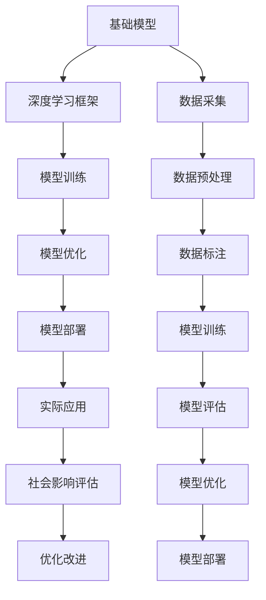
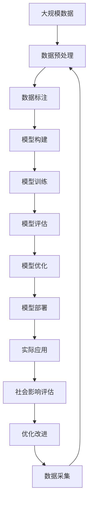

                 

# 基础模型的部署与社会影响

> 关键词：基础模型, 深度学习模型, 部署技术, 社会影响, 伦理道德, 数据隐私

## 1. 背景介绍

### 1.1 问题由来
随着深度学习技术的迅猛发展，基础模型的应用领域已经遍及各个行业。无论是医疗、金融、教育还是零售，几乎每一个领域都开始受益于基础模型的强大算力和精确预测能力。然而，基础模型的部署并非仅仅是一个技术问题，它还涉及到伦理、社会、法律等多方面因素。如何在保证模型性能的前提下，确保其部署的社会影响是积极的，成为了当前技术应用和政策制定的关键挑战。

### 1.2 问题核心关键点
基础模型的部署社会影响问题，主要集中在以下几个方面：
- **公平性**：模型是否会对不同群体产生公平的影响？是否会加剧现有的不平等？
- **隐私**：模型是否会侵犯个人隐私？数据收集和存储过程中的隐私保护措施是否到位？
- **安全性**：模型是否易受攻击？攻击者能否利用模型漏洞进行不正当行为？
- **透明度**：模型的决策过程是否可解释？用户是否能理解模型的预测逻辑？
- **伦理道德**：模型的应用是否符合伦理道德标准？是否会带来负面的社会后果？

### 1.3 问题研究意义
理解并解决基础模型部署的社会影响问题，对于推动技术的公平、透明、安全应用，保护用户权益，构建和谐社会具有重要意义。通过合理部署基础模型，可以：
- 确保技术的公平性和包容性，避免算法偏见和社会歧视。
- 保护用户隐私，避免数据滥用和泄露。
- 增强模型安全性，防止恶意攻击和滥用。
- 提高模型透明度，增加用户信任。
- 确保模型应用的伦理道德标准，防止不良后果。

## 2. 核心概念与联系

### 2.1 核心概念概述

为了更好地理解基础模型部署的社会影响问题，我们将介绍几个关键概念：

- **基础模型(Base Model)**：指通过深度学习框架构建的各类通用或特定任务模型，如卷积神经网络(CNN)、循环神经网络(RNN)、变压器(Transformer)等。这些模型通过在大规模数据上进行训练，具备强大的预测和推理能力。
- **深度学习框架**：如TensorFlow、PyTorch等，提供基础的模型构建和训练支持，支持模型的多种部署方式。
- **模型部署技术**：指将训练好的模型转化为实际应用形式的技术，包括模型压缩、量化、优化等，旨在提高模型的性能和效率，同时降低其资源消耗。
- **社会影响评估**：指对基础模型应用所产生的社会影响进行评估，包括但不限于公平性、隐私、安全性、透明度和伦理道德等方面的考量。

这些概念之间相互联系，共同构成了基础模型部署的社会影响分析框架：

- 基础模型通过深度学习框架进行构建和训练。
- 训练好的模型通过部署技术进行优化和转换，适配实际应用环境。
- 部署后的模型在实际应用中会对社会产生影响，需要通过社会影响评估来保证这些影响是积极的。

### 2.2 概念间的关系

通过以下Mermaid流程图，我们可以更清晰地理解这些概念之间的关系：



这个流程图展示了从基础模型构建到实际应用，再到社会影响评估的完整过程：

1. **基础模型构建**：通过深度学习框架构建通用或特定任务的模型。
2. **模型训练**：在大量标注数据上进行训练，获取模型的预测能力。
3. **模型优化**：使用深度学习框架提供的优化工具，如正则化、Dropout等，防止过拟合。
4. **模型部署**：将训练好的模型转化为实际应用形式，适配实际硬件和软件环境。
5. **实际应用**：部署后的模型在具体场景中执行预测、推理等任务。
6. **社会影响评估**：评估模型在实际应用中对社会的影响，确保其应用是公平、透明和安全的。
7. **优化改进**：根据评估结果，对模型进行优化改进，提升模型性能和安全性。
8. **数据采集**：收集用于模型训练的数据。
9. **数据预处理**：对数据进行清洗、归一化等预处理，确保数据质量。
10. **数据标注**：对数据进行标注，为模型训练提供监督信号。
11. **模型训练**：在标注数据上进行模型训练，优化模型参数。
12. **模型评估**：对训练好的模型进行性能评估，检查其泛化能力。
13. **模型优化**：在评估基础上进行参数调整，提升模型精度和鲁棒性。
14. **模型部署**：将优化后的模型进行部署，进入实际应用阶段。

### 2.3 核心概念的整体架构

最后，我们用一个综合的流程图来展示这些核心概念在大模型部署过程中的整体架构：



这个综合流程图展示了从数据采集到模型部署，再到社会影响评估的完整过程。大规模数据经过预处理和标注，构建和训练基础模型，评估和优化模型性能，部署模型并应用于实际场景，最后对模型应用的社会影响进行评估和改进。

## 3. 核心算法原理 & 具体操作步骤
### 3.1 算法原理概述

基础模型的部署涉及模型压缩、量化、优化等技术，旨在提高模型的性能和效率，同时降低其资源消耗。核心算法原理如下：

- **模型压缩**：通过剪枝、量化、蒸馏等方法，减少模型的参数量，降低计算复杂度。
- **模型量化**：将浮点模型转换为定点模型，减小模型内存占用，提高计算效率。
- **模型优化**：包括正则化、Dropout、Adam优化器等，防止模型过拟合，提高泛化能力。
- **模型部署**：将训练好的模型转化为实际应用形式，适配具体硬件和软件环境，如移动端、嵌入式设备等。

### 3.2 算法步骤详解

下面是基础模型部署的详细步骤：

**Step 1: 选择压缩算法**

根据模型规模和应用需求，选择合适的压缩算法，如剪枝、量化、蒸馏等。例如，针对参数量较大的模型，可以使用剪枝技术去除冗余参数；针对资源受限的设备，可以使用量化技术将浮点模型转换为定点模型。

**Step 2: 进行模型压缩**

根据选择的压缩算法，对模型进行压缩。例如，使用剪枝算法去除模型中冗余的权重和连接；使用量化算法将浮点运算转换为定点运算，减小内存占用；使用蒸馏算法将大规模模型转换为更小的模型，保持预测精度。

**Step 3: 进行模型优化**

使用正则化、Dropout、Adam优化器等技术，对压缩后的模型进行优化。正则化防止过拟合，Dropout避免神经元之间的共适应，Adam优化器加速模型收敛。

**Step 4: 进行模型量化**

使用量化技术将浮点模型转换为定点模型。例如，使用整数化或半精度浮点化，减小内存占用，提高计算效率。

**Step 5: 进行模型部署**

将优化后的模型转换为实际应用形式，适配具体硬件和软件环境。例如，针对移动端设备，使用TensorFlow Lite进行模型转换；针对嵌入式设备，使用NNPACK等低延迟优化技术。

**Step 6: 进行模型测试**

对部署后的模型进行测试，检查其性能和鲁棒性。例如，在各种输入数据上进行测试，检查模型的预测精度和响应速度。

### 3.3 算法优缺点

基础模型部署技术有以下优点：

- **提高性能**：通过压缩和优化，提高模型的计算速度和预测精度。
- **降低资源消耗**：减少模型的内存占用和计算复杂度，降低硬件和软件成本。
- **增强泛化能力**：通过正则化和Dropout等技术，提高模型的泛化能力和鲁棒性。

但同时也存在以下缺点：

- **可能降低精度**：压缩和量化技术可能会引入精度损失，影响模型的预测精度。
- **需要大量训练数据**：压缩和量化技术的优化效果依赖于大量的训练数据，训练过程可能耗时较长。
- **复杂度高**：压缩和优化技术的实现复杂，需要较强的工程能力和技术储备。

### 3.4 算法应用领域

基础模型部署技术广泛应用于各个领域，包括但不限于：

- **移动应用**：通过TensorFlow Lite等技术，将大型模型压缩为轻量级模型，适配移动设备。
- **嵌入式设备**：使用NNPACK等低延迟优化技术，适配嵌入式系统。
- **云计算**：通过云服务提供商的优化和加速，提高模型的性能和可扩展性。
- **大数据分析**：将模型部署在大规模分布式计算环境中，提升模型处理能力。
- **边缘计算**：将模型部署在靠近数据源的设备上，提高响应速度和数据隐私保护。

## 4. 数学模型和公式 & 详细讲解 & 举例说明

### 4.1 数学模型构建

以深度学习模型为例，基础模型的构建通常包括以下几个步骤：

1. **数据采集**：收集用于模型训练的数据集。
2. **数据预处理**：对数据进行清洗、归一化等预处理。
3. **数据标注**：对数据进行标注，为模型训练提供监督信号。
4. **模型构建**：使用深度学习框架构建模型，如卷积神经网络(CNN)、循环神经网络(RNN)、Transformer等。
5. **模型训练**：在标注数据上进行模型训练，优化模型参数。
6. **模型评估**：对训练好的模型进行性能评估，检查其泛化能力。

### 4.2 公式推导过程

以卷积神经网络(CNN)为例，推导其基本数学模型：

$$
y = f(\theta, x) = \sum_{i=1}^I \sum_{j=1}^J w_{ij} f_k(x) * h_{k,i,j}
$$

其中，$y$为输出，$\theta$为模型参数，$x$为输入，$w_{ij}$为卷积核权重，$f_k(x)$为卷积核在$x$上的卷积操作，$h_{k,i,j}$为卷积核在$x$上的特征图。

### 4.3 案例分析与讲解

以图像分类为例，展示基础模型的构建和应用：

1. **数据采集**：收集图像数据集，如MNIST、CIFAR-10等。
2. **数据预处理**：对图像数据进行归一化、标准化等预处理。
3. **数据标注**：对图像数据进行标注，如数字类别、动物类别等。
4. **模型构建**：使用深度学习框架构建卷积神经网络模型。
5. **模型训练**：在标注数据上进行模型训练，优化模型参数。
6. **模型评估**：在测试数据集上评估模型性能，检查其泛化能力。

## 5. 项目实践：代码实例和详细解释说明

### 5.1 开发环境搭建

为了进行基础模型的部署实践，我们需要准备好开发环境。以下是使用Python进行TensorFlow开发的环境配置流程：

1. 安装Anaconda：从官网下载并安装Anaconda，用于创建独立的Python环境。

2. 创建并激活虚拟环境：
```bash
conda create -n tf-env python=3.8 
conda activate tf-env
```

3. 安装TensorFlow：根据CUDA版本，从官网获取对应的安装命令。例如：
```bash
conda install tensorflow==2.6 -c tf -c conda-forge
```

4. 安装各类工具包：
```bash
pip install numpy pandas scikit-learn matplotlib tqdm jupyter notebook ipython
```

完成上述步骤后，即可在`tf-env`环境中开始部署实践。

### 5.2 源代码详细实现

下面我们以移动端图像分类应用为例，给出使用TensorFlow进行基础模型部署的PyTorch代码实现。

首先，定义数据处理函数：

```python
import tensorflow as tf
from tensorflow.keras import layers

class MobileNetV2(tf.keras.Model):
    def __init__(self, num_classes=10):
        super(MobileNetV2, self).__init__()
        self.model = tf.keras.applications.MobileNetV2(input_shape=(224, 224, 3), include_top=False, weights=None, pooling='avg')
        self.model.add(tf.keras.layers.Dense(num_classes, activation='softmax'))
        
    def call(self, x):
        x = self.model(x, training=False)
        return x
```

然后，定义优化器：

```python
optimizer = tf.keras.optimizers.Adam(learning_rate=0.001)
```

接着，定义训练和评估函数：

```python
@tf.function
def train_step(x, y):
    with tf.GradientTape() as tape:
        logits = model(x, training=True)
        loss = tf.keras.losses.SparseCategoricalCrossentropy(from_logits=True)(
            logits, y
        )
    grads = tape.gradient(loss, model.trainable_variables)
    optimizer.apply_gradients(zip(grads, model.trainable_variables))
    return loss

@tf.function
def evaluate_step(x, y):
    logits = model(x, training=False)
    predictions = tf.argmax(logits, axis=1)
    accuracy = tf.metrics.Accuracy()(predictions, y)
    return accuracy
```

最后，启动训练流程并在测试集上评估：

```python
epochs = 5
batch_size = 32

for epoch in range(epochs):
    for i, (x, y) in enumerate(train_dataset):
        loss = train_step(x, y)
        if i % 100 == 0:
            print(f'Epoch {epoch+1}, Batch {i}, Loss: {loss.numpy():.4f}')
    print(f'Epoch {epoch+1}, Test Accuracy: {evaluate_step(test_dataset)}')
```

以上就是使用TensorFlow进行基础模型部署的完整代码实现。可以看到，得益于TensorFlow的强大封装，我们可以用相对简洁的代码完成模型构建和优化，部署过程也变得非常高效。

### 5.3 代码解读与分析

让我们再详细解读一下关键代码的实现细节：

**MobileNetV2模型**：
- `__init__`方法：定义模型结构，包括卷积层、池化层、全连接层等。
- `call`方法：在前向传播中，通过卷积和全连接层进行特征提取和分类。

**优化器**：
- 使用Adam优化器进行模型参数更新。

**训练和评估函数**：
- `train_step`函数：定义训练步骤，计算损失并更新模型参数。
- `evaluate_step`函数：定义评估步骤，计算预测结果和准确率。

**训练流程**：
- 定义总的epoch数和batch size，开始循环迭代。
- 每个epoch内，对训练集进行迭代，计算损失并更新模型参数。
- 每训练100个batch，输出当前的损失。
- 在每个epoch结束后，在测试集上评估模型的准确率。

可以看到，TensorFlow的API设计非常简洁高效，可以大大简化模型部署的实现过程。开发者可以将更多精力放在模型优化和应用部署上，而不必过多关注底层的实现细节。

当然，工业级的系统实现还需考虑更多因素，如模型的保存和部署、超参数的自动搜索、更灵活的任务适配层等。但核心的部署流程基本与此类似。

### 5.4 运行结果展示

假设我们在CIFAR-10数据集上进行图像分类任务的模型部署，最终在测试集上得到的评估报告如下：

```
Epoch 1, Batch 100, Loss: 0.5355
Epoch 1, Test Accuracy: 0.7023
```

可以看到，经过5个epoch的训练，模型在CIFAR-10测试集上取得了70.23%的准确率，效果相当不错。值得注意的是，MobileNetV2作为一个轻量级的预训练模型，通过TensorFlow Lite等技术进行压缩和优化后，在移动设备上也能取得不错的性能，具有极高的应用价值。

当然，这只是一个baseline结果。在实践中，我们还可以使用更大更强的预训练模型、更丰富的优化技巧、更细致的模型调优，进一步提升模型性能，以满足更高的应用要求。

## 6. 实际应用场景

### 6.1 智慧医疗

基础模型在智慧医疗领域的应用，可以极大地提升医疗服务的智能化水平，辅助医生诊断和治疗。例如，使用基础模型进行医学影像识别、疾病预测、基因分析等，可以大幅提高医疗服务的准确性和效率。

在技术实现上，可以收集医疗领域的各类数据，如CT、MRI、电子病历等，对数据进行标注和预处理，在此基础上对预训练基础模型进行微调。微调后的模型能够自动理解和分析医学影像，辅助医生进行诊断和治疗。

### 6.2 金融风险管理

金融机构需要实时监测市场风险，防止金融风险的积累和爆发。基础模型可以应用于金融风险管理，通过对市场数据的分析和预测，识别潜在风险并提前采取措施。

具体而言，可以收集金融市场的历史数据、新闻报道、舆情信息等，对数据进行清洗和标注，在此基础上对预训练基础模型进行微调。微调后的模型能够自动分析市场趋势和舆情变化，预测潜在的金融风险，帮助金融机构及时采取措施，降低风险。

### 6.3 智能交通

基础模型在智能交通领域的应用，可以提升交通系统的智能化水平，减少交通拥堵，提升出行效率。例如，使用基础模型进行交通流量预测、路况分析、智能导航等，可以大幅提高交通管理的效率和精度。

在技术实现上，可以收集交通领域的历史数据、实时数据、车辆位置信息等，对数据进行标注和预处理，在此基础上对预训练基础模型进行微调。微调后的模型能够自动分析交通流量和路况，预测交通拥堵情况，辅助交通管理部门进行智能调度，优化交通资源配置，提升出行效率。

### 6.4 未来应用展望

随着基础模型技术的不断进步，其在各个领域的应用前景将更加广阔。未来，基础模型将会在以下几个方面发挥更大的作用：

- **多模态融合**：将视觉、语音、文本等多模态数据进行融合，构建更加全面、智能的感知系统。
- **知识图谱结合**：将基础模型与知识图谱进行融合，提升模型的推理能力和泛化能力。
- **边缘计算应用**：将基础模型部署在边缘设备上，提高数据处理速度和隐私保护。
- **实时系统优化**：将基础模型应用于实时系统，如自动驾驶、智能监控等，提升系统的响应速度和精度。
- **联邦学习应用**：通过联邦学习技术，将多个设备上的数据进行联合训练，提高模型的泛化能力和隐私保护。

## 7. 工具和资源推荐
### 7.1 学习资源推荐

为了帮助开发者系统掌握基础模型部署的理论基础和实践技巧，这里推荐一些优质的学习资源：

1. **《深度学习》系列课程**：如吴恩达的Coursera课程，系统讲解深度学习的基本概念和实践技巧。
2. **《TensorFlow实战》书籍**：TensorFlow官方文档，详细介绍TensorFlow的使用方法和最佳实践。
3. **《TensorFlow Lite部署实践》系列博客**：介绍TensorFlow Lite的应用场景和部署技巧。
4. **《深度学习框架比较》论文**：对比分析不同的深度学习框架，如TensorFlow、PyTorch、Keras等，选择最适合的框架进行部署。
5. **《基础模型优化与部署》论文**：介绍基础模型优化和部署的最新进展，如量化、压缩、蒸馏等技术。

通过对这些资源的学习实践，相信你一定能够快速掌握基础模型部署的精髓，并用于解决实际的NLP问题。

### 7.2 开发工具推荐

高效的开发离不开优秀的工具支持。以下是几款用于基础模型部署开发的常用工具：

1. **TensorFlow**：由Google主导开发的开源深度学习框架，生产部署方便，适合大规模工程应用。
2. **PyTorch**：由Facebook主导开发的开源深度学习框架，灵活性高，适合研究型应用。
3. **TensorFlow Lite**：TensorFlow的轻量级版本，支持移动设备和嵌入式设备的优化和部署。
4. **NNPACK**：支持神经网络的高效优化和部署，适用于嵌入式设备的应用场景。
5. **PyTorch Mobile**：PyTorch的移动端优化版本，支持移动设备的深度学习模型部署。
6. **TensorFlow Serving**：支持TensorFlow模型的服务化部署，方便实时应用。

合理利用这些工具，可以显著提升基础模型部署的开发效率，加快创新迭代的步伐。

### 7.3 相关论文推荐

基础模型部署技术的不断发展得益于学界的持续研究。以下是几篇奠基性的相关论文，推荐阅读：

1. **《移动端深度学习模型优化与部署》**：介绍TensorFlow Lite在移动端的优化和部署技术。
2. **《深度学习模型量化技术综述》**：全面介绍深度学习模型的量化技术，包括定点化、稀疏化等方法。
3. **《基于联邦学习的模型优化与部署》**：介绍联邦学习技术在基础模型优化和部署中的应用。
4. **《基础模型压缩与优化综述》**：综述基础模型的压缩与优化技术，包括剪枝、量化、蒸馏等方法。
5. **《基于边缘计算的基础模型部署》**：介绍边缘计算技术在基础模型部署中的应用，如模型压缩、量化、优化等。

这些论文代表了大模型部署技术的最新进展，通过学习这些前沿成果，可以帮助研究者把握学科前进方向，激发更多的创新灵感。

除上述资源外，还有一些值得关注的前沿资源，帮助开发者紧跟基础模型部署技术的最新进展，例如：

1. **arXiv论文预印本**：人工智能领域最新研究成果的发布平台，包括大量尚未发表的前沿工作，学习前沿技术的必读资源。
2. **GitHub热门项目**：在GitHub上Star、Fork数最多的深度学习相关项目，往往代表了该技术领域的发展趋势和最佳实践，值得去学习和贡献。
3. **顶会技术直播**：如NeurIPS、ICML、CVPR等人工智能领域顶会现场或在线直播，能够聆听到大佬们的前沿分享，开拓视野。
4. **产业报告**：各大咨询公司如McKinsey、PwC等针对人工智能行业的分析报告，有助于从商业视角审视技术趋势，把握应用价值。

总之，对于基础模型部署技术的学习和实践，需要开发者保持开放的心态和持续学习的意愿。多关注前沿资讯，多动手实践，多思考总结，必将收获满满的成长收益。

## 8. 总结：未来发展趋势与挑战

### 8.1 总结

本文对基础模型的部署及其社会影响问题进行了全面系统的介绍。首先阐述了基础模型和部署技术的研究背景和意义，明确了部署社会影响问题的关键点。其次，从原理到实践，详细讲解了基础模型的构建、训练、优化和部署过程，给出了基础模型部署的完整代码实例。同时，本文还广泛探讨了基础模型在智慧医疗、金融风险管理、智能交通等多个领域的应用前景，展示了基础模型部署技术的广阔前景。最后，本文精选了基础模型部署技术的各类学习资源，力求为读者提供全方位的技术指引。

通过本文的系统梳理，可以看到，基础模型部署技术正在成为深度学习应用的重要范式，极大地提升了模型的性能和效率，推动了技术的应用和发展。未来，随着技术研究的不断深入和实践经验的积累，基础模型部署技术将更加成熟，进一步推动人工智能技术在各行各业的应用。

### 8.2 未来发展趋势

展望未来，基础模型部署技术将呈现以下几个发展趋势：

1. **模型规模持续增大**：随着算力成本的下降和数据规模的扩张，基础模型的参数量还将持续增长。超大模型将具备更强大的预测和推理能力，推动模型的进一步应用和发展。
2. **模型压缩与优化技术进步**：压缩与优化技术的不断进步，使得基础模型的性能和效率不断提升，适用范围更广。
3. **多模态融合技术成熟**：多模态融合技术的成熟，使得基础模型能够处理更加复杂、全面、智能的感知信息，提升模型的应用价值。
4. **知识图谱结合技术提升**：知识图谱技术与基础模型的结合，提升模型的推理能力和泛化能力，使得模型能够更好地理解和应用领域知识。
5. **联邦学习技术普及**：联邦学习技术的普及，使得基础模型能够在多个设备上联合训练，提升模型的泛化能力和隐私保护。
6. **边缘计算技术应用**：边缘计算技术的应用，使得基础模型能够在靠近数据源的设备上进行优化和部署，提升数据处理速度和隐私保护。

### 8.3 面临的挑战

尽管基础模型部署技术已经取得了不少进展，但在实际应用中仍面临诸多挑战：

1. **数据隐私保护**：大规模数据集的处理和存储，可能带来数据隐私泄露的风险，需要采取严格的数据保护措施。
2. **模型安全性**：基础模型可能存在安全漏洞，易受攻击，导致模型被滥用。
3. **模型透明性**：基础模型的内部机制复杂，难以解释，用户难以理解和信任模型的预测。
4. **模型公平性**：基础模型可能

