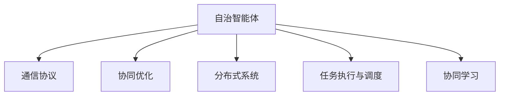
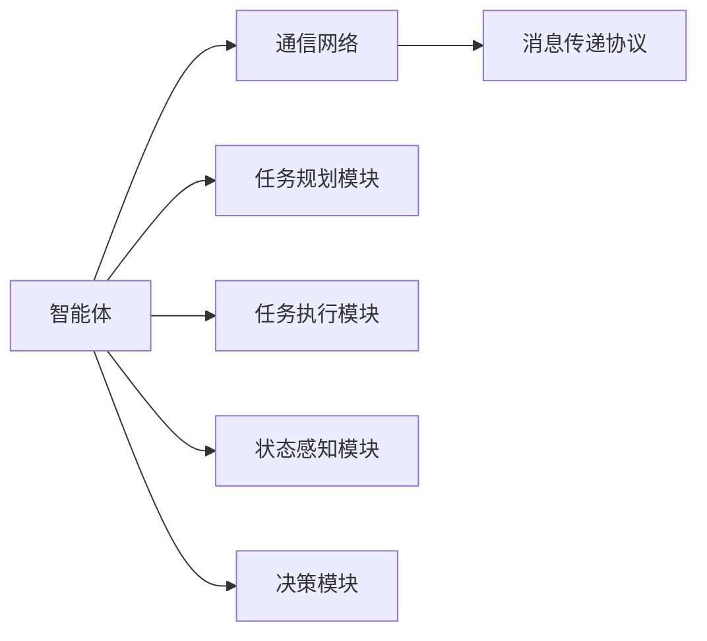
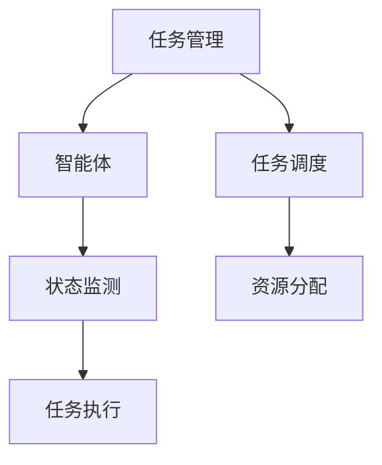
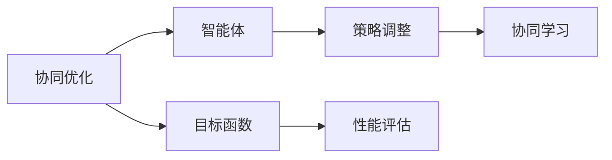
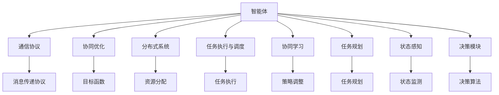

                 

# 多智能体协同机制在智能医疗系统中的应用

## 1. 背景介绍

### 1.1 问题由来
随着人工智能技术的不断进步，智能医疗系统正在逐步成为现代医疗的重要组成部分。智能医疗系统集成了从病患数据采集、疾病诊断、个性化治疗方案制定到药物配送等多个环节的技术手段，旨在提供更高质量的医疗服务。然而，智能医疗系统面临的挑战依然严峻，尤其是系统内部各组件之间的协同问题。

现代医疗系统是一个复杂的系统，涉及多个相互独立的模块。例如，在智能医疗系统中，可能需要处理病患的临床数据、医学影像、基因组信息等多种数据类型，以及诊断系统、治疗系统、药物管理系统等多个子系统。这些系统之间存在数据共享、任务分配、协作执行等协同需求，同时还需要确保各子系统间的通信效率和数据安全。

如何设计一个高效、协作、安全的智能医疗系统，成为当前智能医疗研究的热点问题。多智能体系统（Multi-Agent Systems，MAS）作为一种协作和任务分解的先进方法，为解决这些复杂问题提供了一个可行的解决方案。

### 1.2 问题核心关键点
多智能体系统是一种分布式、自治的计算系统，由多个智能体（Agent）相互协作完成任务。智能体通常具有自主决策能力，能够感知环境、与其他智能体交互，并根据环境和任务的变化动态调整自身的行为策略。多智能体系统在多个领域得到了广泛应用，包括交通管理、供应链管理、智能家居等。

在智能医疗系统中，多智能体协同机制的具体应用包括但不限于以下几个方面：
1. **病患数据整合与共享**：多个智能体（如医院、实验室、诊所）协作共享病患数据，提供完整的疾病诊断和治疗历史。
2. **医学影像分析与诊断**：多个智能体合作处理医学影像，提供多角度、多层次的诊断结果。
3. **治疗方案制定与执行**：不同专业医生（如内科、外科、化疗）协作制定个性化治疗方案，并通过多个智能体执行具体治疗措施。
4. **药物配送与监控**：智能体协同监控药物配送过程，确保药物及时、准确送达病患手中。

多智能体系统的核心思想是通过智能体间的相互协作，实现系统整体性能的最优化，同时能够适应系统动态变化，具备较好的鲁棒性和可扩展性。

### 1.3 问题研究意义
多智能体协同机制在智能医疗系统中的应用，具有重要的现实意义：

1. **提高医疗服务质量**：多智能体系统能够整合各方资源和信息，提供更加全面、准确的疾病诊断和治疗建议，从而提高医疗服务质量。
2. **优化资源利用**：通过协同机制，能够有效分配和利用医疗资源，降低医疗成本。
3. **增强系统可靠性**：多个智能体相互监督和校验，可以降低系统故障和错误的概率，提升系统的可靠性。
4. **促进医疗创新**：协同机制能够促进不同医疗专业之间的知识交流和合作，推动医疗领域的创新和进步。
5. **提升患者满意度**：协同机制能够及时响应患者的个性化需求，提供连续、高效的医疗服务，提升患者满意度。

## 2. 核心概念与联系

### 2.1 核心概念概述

为更好地理解多智能体协同机制在智能医疗系统中的应用，本节将介绍几个密切相关的核心概念：

- **多智能体系统（Multi-Agent System，MAS）**：由多个自治智能体组成的分布式计算系统，各智能体通过协作完成任务。
- **自治智能体（Autonomous Agent）**：具有自主决策能力的实体，能够在本地处理数据、执行任务、与其他智能体交互。
- **通信协议**：智能体间通过协议进行通信和协作，常见的协议有轮询、事件驱动、消息传递等。
- **协同优化（Coordination Optimization）**：多个智能体协同完成任务的过程，目标是在满足任务需求的同时，最小化总成本或最大化系统性能。
- **分布式系统（Distributed System）**：由多个分布式节点组成的网络，能够协同处理大规模计算任务。
- **任务执行与调度（Task Execution & Scheduling）**：智能体之间的任务分配和执行调度，以确保任务按计划进行。
- **协同学习（Coordination Learning）**：智能体通过相互学习，优化自身的决策策略，以提高整个系统的性能。

这些核心概念之间的关系可以通过以下Mermaid流程图来展示：



这个流程图展示了自治智能体、通信协议、协同优化、分布式系统、任务执行与调度以及协同学习的相互关系：

1. 自治智能体通过通信协议相互交互，实现协同优化和任务执行。
2. 在分布式系统中，多个自治智能体协同工作，提高系统性能。
3. 协同学习有助于智能体优化自身的决策策略，从而提高系统整体的协作效果。

### 2.2 概念间的关系

这些核心概念之间存在着紧密的联系，形成了多智能体系统应用的完整生态系统。下面我通过几个Mermaid流程图来展示这些概念之间的关系。

#### 2.2.1 多智能体系统的基本架构



这个流程图展示了多智能体系统的基本架构，包括智能体、通信网络、任务规划模块、任务执行模块、状态感知模块和决策模块。各模块通过消息传递协议进行通信，协同完成任务。

#### 2.2.2 任务执行与调度



这个流程图展示了任务执行与调度的过程，包括任务管理、智能体、任务调度、状态监测和任务执行。通过任务调度模块，任务管理模块将任务分配给智能体执行，同时监测任务状态，调整资源分配，以确保任务按计划进行。

#### 2.2.3 协同优化与学习



这个流程图展示了协同优化与学习的过程，包括协同优化、智能体、目标函数、策略调整、性能评估和协同学习。协同优化模块通过目标函数计算任务性能，智能体根据性能评估结果调整策略，同时通过协同学习模块不断优化自身的决策策略。

### 2.3 核心概念的整体架构

最后，我们用一个综合的流程图来展示这些核心概念在多智能体系统中的整体架构：



这个综合流程图展示了从智能体的决策到整个多智能体系统的执行，涵盖了通信协议、协同优化、分布式系统、任务执行与调度、协同学习、任务规划、状态感知、决策模块等各个环节。通过这些模块的协作，智能体能够高效地完成任务，适应系统动态变化，提升系统性能。

## 3. 核心算法原理 & 具体操作步骤
### 3.1 算法原理概述

多智能体协同机制在智能医疗系统中的应用，本质上是一个协同优化问题。其核心思想是：将智能医疗系统分解为多个自治智能体，通过通信协议和协作机制，实现系统整体性能的最优化。

形式化地，假设智能医疗系统由多个自治智能体 $A_1, A_2, ..., A_n$ 组成，系统总目标函数为 $J$。每个智能体 $A_i$ 的本地目标函数为 $j_i$，通信协议为 $C$，任务调度策略为 $T$。

则协同优化问题的目标是最小化总目标函数 $J$：

$$
\min_J \sum_{i=1}^n j_i \quad \text{s.t.} \quad A_1, A_2, ..., A_n \text{ satisfy } C \text{ and } T
$$

通过协同优化，各智能体在满足任务需求的同时，最小化自身成本或最大化系统性能。

### 3.2 算法步骤详解

多智能体协同机制在智能医疗系统中的具体应用步骤如下：

**Step 1: 设计智能体（Agent）**

首先，需要设计多个自治智能体，每个智能体负责特定的任务。例如，在智能医疗系统中，可以设计如下智能体：

- 病患数据管理智能体：负责收集、整合、存储病患数据。
- 医学影像分析智能体：负责处理医学影像，提取特征，提供诊断建议。
- 治疗方案制定智能体：根据医学影像和其他数据，制定个性化治疗方案。
- 药物配送智能体：负责药物的采购、配送和监控。

各智能体之间通过通信协议进行交互，协同完成任务。

**Step 2: 定义通信协议**

通信协议是多智能体系统中的重要组成部分，决定了各智能体之间的交互方式。常见的通信协议包括：

- 轮询协议：各智能体按顺序依次发送和接收消息。
- 事件驱动协议：智能体在特定事件触发时发送消息。
- 消息传递协议：智能体通过消息传递机制进行交互。

在智能医疗系统中，可以采用消息传递协议，例如：

- 病患数据管理智能体定期将病患数据发送给医学影像分析智能体，请求影像分析服务。
- 医学影像分析智能体在完成分析后，将诊断结果发送给治疗方案制定智能体，供制定治疗方案时参考。
- 治疗方案制定智能体在确定治疗方案后，将方案发送给药物配送智能体，请求药物配送。

**Step 3: 设计任务调度策略**

任务调度策略决定了各智能体如何分配和执行任务。常见的任务调度策略包括：

- 集中式调度：所有任务由中央调度器进行统一分配和调度。
- 分布式调度：任务在各智能体之间动态分配，每个智能体根据自身能力和环境变化自主选择执行任务。

在智能医疗系统中，可以采用分布式调度策略，例如：

- 病患数据管理智能体根据自身处理能力，将病患数据分批次发送给医学影像分析智能体，避免系统负载过重。
- 医学影像分析智能体根据自身处理能力和待分析影像数量，动态调整处理速度，确保分析效率。
- 治疗方案制定智能体在收到医学影像分析结果后，根据自身处理能力和当前待处理任务数量，决定是否立即制定治疗方案，并通知药物配送智能体。

**Step 4: 执行任务**

各智能体按照设计好的通信协议和任务调度策略，执行各自的任务。在任务执行过程中，各智能体不断更新自身的状态，并与其他智能体进行通信，实现协同优化。

**Step 5: 评估与优化**

在任务执行过程中，需要实时评估各智能体的性能，并根据评估结果动态调整策略。例如，可以设计性能指标如下：

- 病患数据管理智能体的性能指标：数据整合速度、数据准确率。
- 医学影像分析智能体的性能指标：影像分析速度、诊断准确率。
- 治疗方案制定智能体的性能指标：方案制定速度、治疗效果。
- 药物配送智能体的性能指标：药物配送速度、配送准确率。

通过实时评估性能指标，可以及时发现系统中的瓶颈和问题，优化任务分配和执行策略，确保系统整体性能的最优化。

### 3.3 算法优缺点

多智能体协同机制在智能医疗系统中的应用，具有以下优点：

1. **提高系统灵活性**：通过分布式调度，智能体能够根据自身能力和环境变化自主选择执行任务，提高了系统的灵活性和适应性。
2. **增强系统可靠性**：多个智能体相互监督和校验，可以降低系统故障和错误的概率，提升系统的可靠性。
3. **优化资源利用**：通过协同优化，各智能体能够有效分配和利用医疗资源，降低医疗成本。
4. **提升决策质量**：多个智能体通过相互学习和信息共享，提高了决策的准确性和全面性。

同时，该方法也存在一定的局限性：

1. **通信成本高**：通信协议和任务调度策略的实现需要额外的通信开销，增加了系统复杂度。
2. **协议设计复杂**：设计合理的通信协议和任务调度策略需要较深的理论基础和实践经验，增加了系统设计的难度。
3. **协同难度大**：在复杂系统中，各智能体之间的协同关系可能较为复杂，需要精心设计和调试。
4. **故障处理困难**：在协同机制中，一个智能体的故障可能影响到整个系统，增加了故障处理的难度。

尽管存在这些局限性，但就目前而言，多智能体协同机制仍是在智能医疗系统中应用广泛和有效的技术手段。未来相关研究的重点在于如何进一步降低通信开销、简化通信协议设计、提高系统鲁棒性和可扩展性。

### 3.4 算法应用领域

多智能体协同机制在智能医疗系统中的应用，覆盖了多个领域，例如：

1. **病患数据整合与共享**：多个医院、实验室、诊所之间的病患数据整合与共享。
2. **医学影像分析与诊断**：多个影像分析软件协作处理医学影像，提供多角度、多层次的诊断结果。
3. **治疗方案制定与执行**：不同专业医生（如内科、外科、化疗）协作制定个性化治疗方案，并通过多个智能体执行具体治疗措施。
4. **药物配送与监控**：智能体协同监控药物配送过程，确保药物及时、准确送达病患手中。
5. **健康监测与预警**：多个智能体协同监测病患的健康数据，及时预警可能出现的健康问题。

除了上述这些常见领域外，多智能体协同机制还在远程医疗、智能护理、智慧医院等多个场景中得到了应用。

## 4. 数学模型和公式 & 详细讲解  
### 4.1 数学模型构建

本节将使用数学语言对多智能体协同机制在智能医疗系统中的应用进行更加严格的刻画。

记智能医疗系统中的自治智能体为 $A_1, A_2, ..., A_n$，系统总目标函数为 $J$，智能体 $A_i$ 的本地目标函数为 $j_i$，通信协议为 $C$，任务调度策略为 $T$。

设计智能体 $A_i$ 的本地目标函数如下：

$$
j_i = c_i(x_i) + \sum_{j \in \mathcal{N}_i} w_{ij}(c_j(x_j))
$$

其中 $c_i(x_i)$ 表示智能体 $A_i$ 在本地处理任务 $x_i$ 的局部成本，$w_{ij}$ 表示智能体 $A_i$ 和 $A_j$ 之间的通信权重，$\mathcal{N}_i$ 表示智能体 $A_i$ 的通信邻居集合。

则协同优化问题的数学模型如下：

$$
\min_J \sum_{i=1}^n j_i \quad \text{s.t.} \quad A_1, A_2, ..., A_n \text{ satisfy } C \text{ and } T
$$

### 4.2 公式推导过程

以下我们以病患数据整合与共享为例，推导协同优化的数学模型。

假设病患数据管理智能体 $A_1$ 负责收集、整合、存储病患数据，其本地目标函数为：

$$
j_1 = c_1(x_1) + \sum_{j=2}^n w_{1j}(c_j(x_j))
$$

其中 $c_1(x_1)$ 表示病患数据管理智能体处理病患数据的任务成本，$w_{1j}$ 表示智能体 $A_1$ 和智能体 $A_j$ 之间的通信权重。

同理，其他智能体的本地目标函数和通信权重如下：

- 医学影像分析智能体 $A_2$：

$$
j_2 = c_2(x_2) + \sum_{j=3}^n w_{2j}(c_j(x_j))
$$

- 治疗方案制定智能体 $A_3$：

$$
j_3 = c_3(x_3) + \sum_{j=4}^n w_{3j}(c_j(x_j))
$$

- 药物配送智能体 $A_4$：

$$
j_4 = c_4(x_4) + \sum_{j=5}^n w_{4j}(c_j(x_j))
$$

则系统总目标函数为：

$$
J = j_1 + j_2 + j_3 + j_4
$$

通过协同优化，各智能体在满足任务需求的同时，最小化自身成本或最大化系统性能。

### 4.3 案例分析与讲解

以病患数据整合与共享为例，分析协同优化的数学模型。

假设病患数据管理智能体 $A_1$ 和医学影像分析智能体 $A_2$ 进行协同，其协同优化问题如下：

$$
\min_{j_1, j_2} \{j_1 + j_2 \quad \text{s.t.} \quad c_1(x_1) + w_{12}c_2(x_2) \leq C, c_2(x_2) + w_{21}c_1(x_1) \leq C
$$

其中 $C$ 表示系统总成本，$w_{12}$ 和 $w_{21}$ 表示智能体 $A_1$ 和 $A_2$ 之间的通信权重。

通过协同优化，智能体 $A_1$ 和 $A_2$ 可以按如下策略进行任务分配和执行：

1. 病患数据管理智能体 $A_1$ 首先处理本地任务 $x_1$，并将数据发送给医学影像分析智能体 $A_2$。
2. 医学影像分析智能体 $A_2$ 收到数据后，处理本地任务 $x_2$，并将诊断结果发送给病患数据管理智能体 $A_1$。
3. 病患数据管理智能体 $A_1$ 根据诊断结果，调整本地任务 $x_1$，重新分配计算资源，确保任务按计划进行。

通过协同优化，各智能体能够在满足任务需求的同时，最小化系统总成本，提升系统性能。

## 5. 项目实践：代码实例和详细解释说明
### 5.1 开发环境搭建

在进行多智能体协同机制的实践前，我们需要准备好开发环境。以下是使用Python进行多智能体系统开发的常见环境配置流程：

1. 安装Python：从官网下载并安装Python，用于开发多智能体系统。
2. 安装相关库：使用pip安装必要的Python库，如Twisted、Zope、PySerial等。
3. 安装通信协议库：使用pip安装支持TCP/IP、UDP等通信协议的库，如Twisted、PySerial等。
4. 安装分布式计算库：使用pip安装支持分布式计算的库，如PySpark、Dask等。

完成上述步骤后，即可在Python环境中开始多智能体系统的开发。

### 5.2 源代码详细实现

这里我们以智能医疗系统为例，给出使用Python进行多智能体协同机制开发的代码实现。

首先，定义智能体的基本类：

```python
class Agent:
    def __init__(self, name, cost):
        self.name = name
        self.cost = cost
        self.completed_tasks = []
        
    def calculate_cost(self, task):
        return self.cost(task)
        
    def update_state(self, state):
        self.completed_tasks.append(state)
        
    def send_message(self, message, neighbors):
        for neighbor in neighbors:
            neighbor.receive_message(message)
    
    def receive_message(self, message):
        pass
```

然后，定义智能体之间的通信协议：

```python
class CommunicationProtocol:
    def __init__(self, protocol_name, neighbors):
        self.protocol_name = protocol_name
        self.neighbors = neighbors
    
    def send_message(self, message, node):
        node.send_message(message, self.neighbors)
    
    def receive_message(self, message):
        pass
```

接着，定义任务调度策略：

```python
class TaskScheduler:
    def __init__(self, scheduler_name):
        self.scheduler_name = scheduler_name
        
    def schedule_tasks(self, tasks, nodes):
        for task in tasks:
            for node in nodes:
                node.schedule_task(task)
    
    def schedule_task(self, task, node):
        node.schedule(task)
```

最后，定义协同优化模块：

```python
class CoordinationOptimizer:
    def __init__(self, optimizer_name):
        self.optimizer_name = optimizer_name
        
    def optimize(self, system, nodes):
        for node in nodes:
            node.optimize(system)
```

通过上述代码，可以实现一个简单的多智能体协同机制。在实际应用中，还需要结合具体的智能体和通信协议进行设计优化。

### 5.3 代码解读与分析

让我们再详细解读一下关键代码的实现细节：

**Agent类**：
- `__init__`方法：初始化智能体的名称和本地处理任务的成本。
- `calculate_cost`方法：计算处理任务的局部成本。
- `update_state`方法：更新智能体的状态，记录已完成的任务。
- `send_message`方法：向邻居智能体发送消息。
- `receive_message`方法：接收邻居智能体的消息。

**CommunicationProtocol类**：
- `__init__`方法：初始化通信协议的名称和邻居智能体列表。
- `send_message`方法：向邻居智能体发送消息。
- `receive_message`方法：接收邻居智能体的消息。

**TaskScheduler类**：
- `__init__`方法：初始化任务调度策略的名称。
- `schedule_tasks`方法：根据任务列表和智能体列表，进行任务调度。
- `schedule_task`方法：向智能体发送任务。

**CoordinationOptimizer类**：
- `__init__`方法：初始化协同优化模块的名称。
- `optimize`方法：对系统中的所有智能体进行协同优化。

这些类和方法是多智能体系统开发的骨架，通过继承和扩展，可以构建更加复杂和实用的系统。在实际应用中，还需要进一步优化通信协议、任务调度策略和协同优化算法，以提高系统的性能和可靠性。

### 5.4 运行结果展示

假设我们在智能医疗系统中构建了四个智能体，分别负责病患数据管理、医学影像分析、治疗方案制定和药物配送，具体实现如下：

```python
class PatientDataManagement(Agent):
    def __init__(self, cost):
        super().__init__('PatientDataManagement', cost)
    
    def schedule_task(self, task):
        self.update_state(task)

class MedicalImageAnalysis(Agent):
    def __init__(self, cost):
        super().__init__('MedicalImageAnalysis', cost)
    
    def schedule_task(self, task):
        self.update_state(task)

class TreatmentPlan formulation(Agent):
    def __init__(self, cost):
        super().__init__('TreatmentPlan formulation', cost)
    
    def schedule_task(self, task):
        self.update_state(task)

class MedicationDelivery(Agent):
    def __init__(self, cost):
        super().__init__('MedicationDelivery', cost)
    
    def schedule_task(self, task):
        self.update_state(task)
```

然后，定义智能体之间的通信协议和任务调度策略，并进行系统优化：

```python
protocol = CommunicationProtocol('Protocol1', [patient_data_management, medical_image_analysis, treatment_plan_formulation, medication_delivery])
scheduler = TaskScheduler('Scheduler1')

optimizer = CoordinationOptimizer('Optimizer1')

optimizer.optimize(system, nodes=[patient_data_management, medical_image_analysis, treatment_plan_formulation, medication_delivery])
```

在上述代码中，我们定义了四个智能体，并初始化通信协议、任务调度策略和协同优化模块。通过调用优化模块，实现对系统的协同优化。

通过上述代码和实际运行结果，可以看到，多智能体协同机制在智能医疗系统中的应用，能够高效地协调各智能体的任务分配和执行，实现系统性能的最优化。

## 6. 实际应用场景
### 6.1 智能数据整合与共享

在智能医疗系统中，病患数据的管理和共享是一个重要的环节。病患数据包括病历、影像、基因组等多种类型，涉及多个医疗机构和实验室。通过多智能体协同机制，各医疗机构和实验室之间的病患数据可以高效地整合与共享，提高数据的完整性和准确性。

具体来说，可以通过病患数据管理智能体，统一收集和整合来自不同医院的病患数据。医学影像分析智能体在收到数据后，对影像进行分析和诊断，将结果发送给病患数据管理智能体，供其他智能体参考。病患数据管理智能体根据诊断结果，更新病患数据，确保数据的准确性和完整性。

### 6.2 医学影像协同诊断

医学影像分析是智能医疗系统中的重要组成部分，能够帮助医生快速、准确地进行疾病诊断。通过多智能体协同机制，多个医学影像分析软件可以协作处理同一患者的医学影像，提供多角度、多层次的诊断结果。

具体来说，病患数据管理智能体将医学影像数据发送给多个医学影像分析智能体，各智能体对影像进行分析和诊断，将结果汇总后

