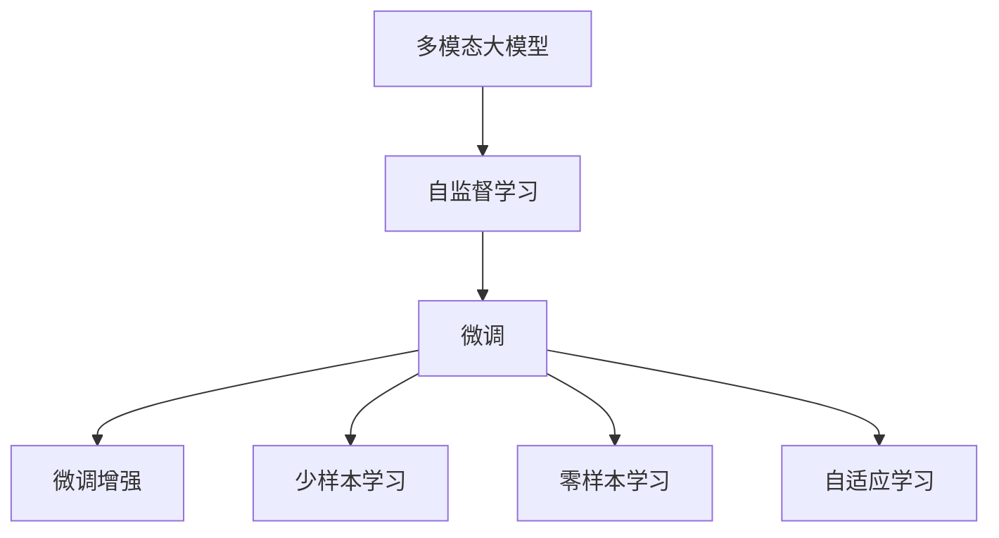
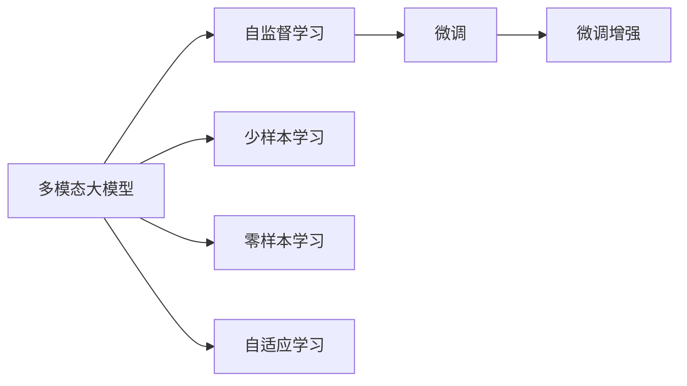
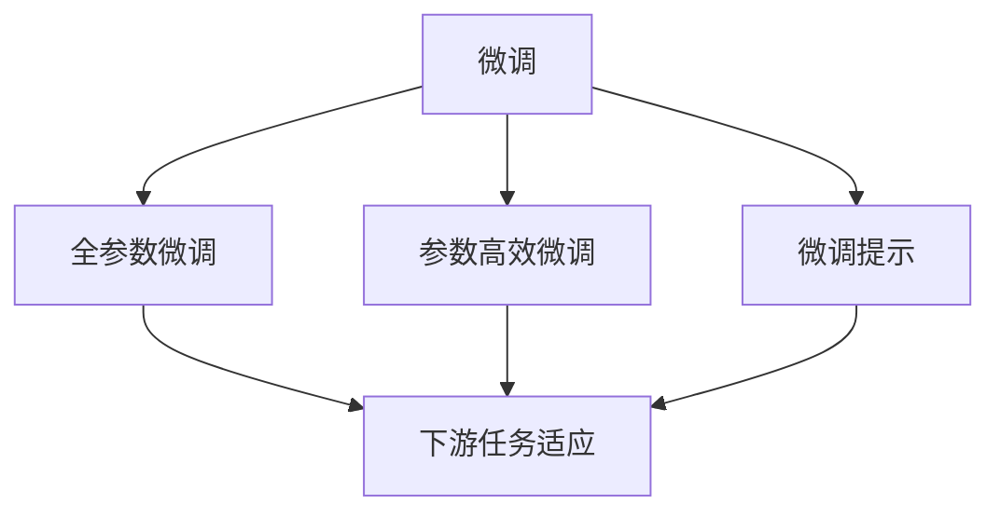
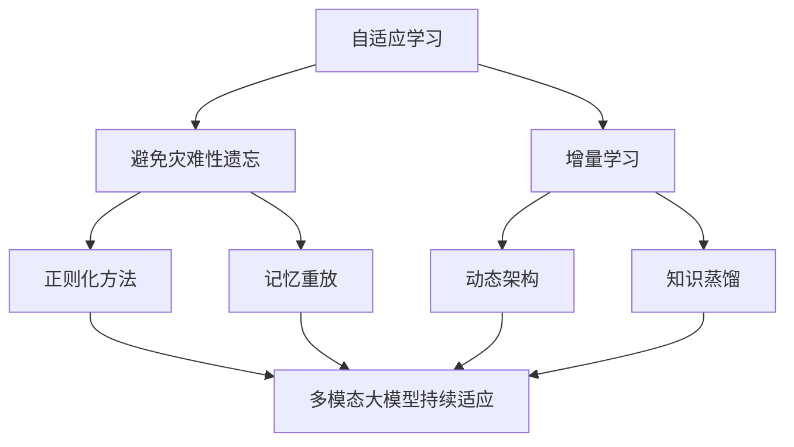
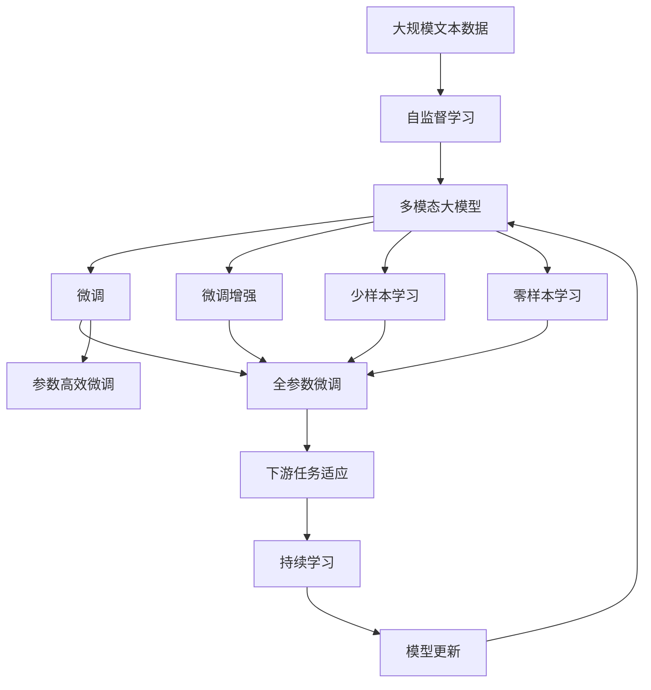

                 

# 多模态大模型：技术原理与实战 读懂ChatGPT的核心技术

> 关键词：多模态大模型,ChatGPT,Transformer,BERT,自监督学习,微调,Fine-Tuning,参数高效微调(PEFT),提示学习,Prompt Learning,少样本学习,Few-shot Learning,零样本学习(Zero-shot Learning),自适应学习(Adaptive Learning),视觉信息处理,语音信息处理,自然语言处理(NLP)

## 1. 背景介绍

### 1.1 问题由来

随着人工智能技术的发展，语言模型在自然语言处理(NLP)领域取得了显著进展，但单一的文本数据往往难以全面准确地描述现实世界的复杂性。多模态数据（例如文本、图像、音频等）的融合使用，可以提供更为丰富、全面的信息，使得语言模型能够更好地理解和生成多模态数据。

ChatGPT作为OpenAI推出的通用大模型，在文本生成、对话系统、自然语言推理等方面表现优异，其成功得益于以下几个关键技术：

1. **多模态数据融合**：ChatGPT能够处理多种类型的输入数据，如文本、图像、语音等，从而在多模态数据融合方面展现出独特的优势。
2. **自监督学习**：ChatGPT在大规模无标签数据上进行预训练，学习到丰富的语言知识。
3. **微调与微调增强**：通过微调和微调增强技术，ChatGPT能够在特定任务上进行优化，提升模型性能。

### 1.2 问题核心关键点

ChatGPT的核心在于其多模态大模型架构和自监督学习机制，这使得ChatGPT能够在无需大量标注数据的情况下，通过无监督学习的方式获得强大的语言理解和生成能力。此外，ChatGPT还引入了微调与微调增强技术，通过在下游任务上微调模型参数，进一步提升模型性能，适应特定任务需求。

以下是对ChatGPT几个核心关键点的详细介绍：

- **多模态数据融合**：ChatGPT能够处理文本、图像、语音等多种类型的数据，并通过跨模态的信息融合，提升模型的理解和生成能力。
- **自监督学习**：在大型无标签数据集上进行自监督学习，使得模型学习到通用的语言表示，能够适应多种任务。
- **微调**：通过下游任务数据进行微调，针对特定任务优化模型参数，提升模型性能。
- **微调增强**：结合微调技术，如微调提示、参数高效微调等，进一步提升模型在小样本学习情况下的性能。

这些技术共同构成了ChatGPT的核心框架，使得其能够在多种场景下发挥出色的语言理解和生成能力。

### 1.3 问题研究意义

研究ChatGPT的核心技术，对于理解多模态大模型的工作原理、优化模型性能、推动NLP技术的产业化进程具有重要意义：

1. **降低应用开发成本**：通过多模态大模型的预训练与微调，能够显著减少从头开发所需的数据、计算和人力等成本投入。
2. **提升模型效果**：微调使得通用大模型更好地适应特定任务，在应用场景中取得更优表现。
3. **加速开发进度**：通过预训练模型进行微调，开发者可以更快地完成任务适配，缩短开发周期。
4. **技术创新**：微调范式促进了对预训练-微调的深入研究，催生了提示学习、少样本学习等新的研究方向。
5. **赋能产业升级**：多模态大模型微调技术为各行各业数字化转型升级提供了新的技术路径。

## 2. 核心概念与联系

### 2.1 核心概念概述

为更好地理解ChatGPT的核心技术，本节将介绍几个密切相关的核心概念：

- **多模态大模型**：以Transformer为代表的能够处理多种类型数据的大规模语言模型。通过在预训练过程中融合多模态信息，学习到更为全面和丰富的语言表示。

- **自监督学习**：在大规模无标签数据上，通过自监督任务训练模型，学习通用的语言知识。如语言建模、掩码语言模型等。

- **微调**：在大规模预训练模型基础上，使用下游任务的少量标注数据进行有监督学习，优化模型在特定任务上的性能。

- **微调增强**：结合微调技术，通过参数高效微调、提示学习等方法，进一步提升模型在小样本情况下的性能。

- **少样本学习**：模型在仅有少量标注数据的情况下，仍能快速适应新任务的学习能力。

- **零样本学习**：模型在未见过特定任务的训练样本的情况下，仅凭任务描述就能够执行新任务的能力。

- **自适应学习**：模型能够持续从新数据中学习，同时保持已学习的知识，避免灾难性遗忘。

这些核心概念之间的逻辑关系可以通过以下Mermaid流程图来展示：



这个流程图展示了大模型核心概念之间的关系：

1. 多模态大模型通过自监督学习获得基础能力。
2. 微调是对预训练模型进行任务特定的优化，提升模型性能。
3. 微调增强方法进一步提升模型在小样本情况下的性能。
4. 少样本学习和零样本学习是大模型应用的重要能力。
5. 自适应学习使模型能够不断学习新知识，避免遗忘旧知识。

### 2.2 概念间的关系

这些核心概念之间存在着紧密的联系，形成了多模态大模型的学习和应用框架。下面我们通过几个Mermaid流程图来展示这些概念之间的关系。

#### 2.2.1 多模态大模型的学习范式



这个流程图展示了多模态大模型的学习范式：

1. 多模态大模型通过自监督学习获得基础能力。
2. 微调对预训练模型进行任务特定的优化。
3. 微调增强进一步提升模型在小样本情况下的性能。
4. 少样本学习和零样本学习是大模型应用的重要能力。
5. 自适应学习使模型能够不断学习新知识，避免遗忘旧知识。

#### 2.2.2 微调与微调增强的关系



这个流程图展示了微调与微调增强的关系：

1. 微调对预训练模型进行任务特定的优化。
2. 全参数微调和参数高效微调是微调的主要方法。
3. 微调提示是在不更新模型参数的情况下，实现零样本或少样本学习。
4. 微调和微调提示都使模型更好地适应特定任务。

#### 2.2.3 自适应学习在大模型中的应用



这个流程图展示了自适应学习在大模型中的应用：

1. 自适应学习使模型能够持续学习新知识，避免灾难性遗忘。
2. 正则化方法、记忆重放、动态架构和知识蒸馏等技术，使模型能够持续适应新的任务和数据。

### 2.3 核心概念的整体架构

最后，我们用一个综合的流程图来展示这些核心概念在大模型微调过程中的整体架构：



这个综合流程图展示了从自监督学习到微调、微调增强、少样本学习和零样本学习的完整过程。多模态大模型通过自监督学习获得基础能力，然后通过微调和微调增强技术，适应下游任务需求，最终通过持续学习技术，模型能够不断更新和适应新的任务和数据。 通过这些流程图，我们可以更清晰地理解多模态大模型的微调过程中各个核心概念的关系和作用，为后续深入讨论具体的微调方法和技术奠定基础。

## 3. 核心算法原理 & 具体操作步骤
### 3.1 算法原理概述

多模态大模型的微调过程，本质上是一个有监督的细粒度迁移学习过程。其核心思想是：将预训练的多模态大模型视作一个强大的"特征提取器"，通过在下游任务的少量标注数据上进行有监督学习，优化模型在该任务上的性能。

形式化地，假设多模态大模型为 $M_{\theta}$，其中 $\theta$ 为预训练得到的模型参数。给定下游任务 $T$ 的标注数据集 $D=\{(x_i,y_i)\}_{i=1}^N$，微调的目标是找到新的模型参数 $\hat{\theta}$，使得：

$$
\hat{\theta}=\mathop{\arg\min}_{\theta} \mathcal{L}(M_{\theta},D)
$$

其中 $\mathcal{L}$ 为针对任务 $T$ 设计的损失函数，用于衡量模型预测输出与真实标签之间的差异。常见的损失函数包括交叉熵损失、均方误差损失等。

通过梯度下降等优化算法，微调过程不断更新模型参数 $\theta$，最小化损失函数 $\mathcal{L}$，使得模型输出逼近真实标签。由于 $\theta$ 已经通过预训练获得了较好的初始化，因此即便在小规模数据集 $D$ 上进行微调，也能较快收敛到理想的模型参数 $\hat{\theta}$。

### 3.2 算法步骤详解

基于有监督学习的多模态大模型微调一般包括以下几个关键步骤：

**Step 1: 准备预训练模型和数据集**
- 选择合适的预训练多模态大模型 $M_{\theta}$ 作为初始化参数，如BERT、GPT等。
- 准备下游任务 $T$ 的标注数据集 $D$，划分为训练集、验证集和测试集。一般要求标注数据与预训练数据的分布不要差异过大。

**Step 2: 添加任务适配层**
- 根据任务类型，在预训练多模态大模型顶层设计合适的输出层和损失函数。
- 对于分类任务，通常在顶层添加线性分类器和交叉熵损失函数。
- 对于生成任务，通常使用语言模型的解码器输出概率分布，并以负对数似然为损失函数。

**Step 3: 设置微调超参数**
- 选择合适的优化算法及其参数，如 AdamW、SGD 等，设置学习率、批大小、迭代轮数等。
- 设置正则化技术及强度，包括权重衰减、Dropout、Early Stopping 等。
- 确定冻结预训练参数的策略，如仅微调顶层，或全部参数都参与微调。

**Step 4: 执行梯度训练**
- 将训练集数据分批次输入模型，前向传播计算损失函数。
- 反向传播计算参数梯度，根据设定的优化算法和学习率更新模型参数。
- 周期性在验证集上评估模型性能，根据性能指标决定是否触发 Early Stopping。
- 重复上述步骤直到满足预设的迭代轮数或 Early Stopping 条件。

**Step 5: 测试和部署**
- 在测试集上评估微调后模型 $M_{\hat{\theta}}$ 的性能，对比微调前后的精度提升。
- 使用微调后的模型对新样本进行推理预测，集成到实际的应用系统中。
- 持续收集新的数据，定期重新微调模型，以适应数据分布的变化。

以上是基于有监督学习的多模态大模型微调的一般流程。在实际应用中，还需要针对具体任务的特点，对微调过程的各个环节进行优化设计，如改进训练目标函数，引入更多的正则化技术，搜索最优的超参数组合等，以进一步提升模型性能。

### 3.3 算法优缺点

基于有监督学习的多模态大模型微调方法具有以下优点：

1. 简单高效。只需准备少量标注数据，即可对预训练模型进行快速适配，获得较大的性能提升。
2. 通用适用。适用于各种NLP下游任务，包括分类、匹配、生成等，设计简单的任务适配层即可实现微调。
3. 参数高效。利用参数高效微调技术，在固定大部分预训练参数的情况下，仍可取得不错的提升。
4. 效果显著。在学术界和工业界的诸多任务上，基于微调的方法已经刷新了最先进的性能指标。

同时，该方法也存在一定的局限性：

1. 依赖标注数据。微调的效果很大程度上取决于标注数据的质量和数量，获取高质量标注数据的成本较高。
2. 迁移能力有限。当目标任务与预训练数据的分布差异较大时，微调的性能提升有限。
3. 负面效果传递。预训练模型的固有偏见、有害信息等，可能通过微调传递到下游任务，造成负面影响。
4. 可解释性不足。微调模型的决策过程通常缺乏可解释性，难以对其推理逻辑进行分析和调试。

尽管存在这些局限性，但就目前而言，基于有监督学习的微调方法仍是大模型应用的主流范式。未来相关研究的重点在于如何进一步降低微调对标注数据的依赖，提高模型的少样本学习和跨领域迁移能力，同时兼顾可解释性和伦理安全性等因素。

### 3.4 算法应用领域

基于有监督学习的多模态大模型微调方法，在NLP领域已经得到了广泛的应用，覆盖了几乎所有常见任务，例如：

- 文本分类：如情感分析、主题分类、意图识别等。通过微调使模型学习文本-标签映射。
- 命名实体识别：识别文本中的人名、地名、机构名等特定实体。通过微调使模型掌握实体边界和类型。
- 关系抽取：从文本中抽取实体之间的语义关系。通过微调使模型学习实体-关系三元组。
- 问答系统：对自然语言问题给出答案。将问题-答案对作为微调数据，训练模型学习匹配答案。
- 机器翻译：将源语言文本翻译成目标语言。通过微调使模型学习语言-语言映射。
- 文本摘要：将长文本压缩成简短摘要。将文章-摘要对作为微调数据，使模型学习抓取要点。
- 对话系统：使机器能够与人自然对话。将多轮对话历史作为上下文，微调模型进行回复生成。

除了上述这些经典任务外，多模态大模型微调也被创新性地应用到更多场景中，如可控文本生成、常识推理、代码生成、数据增强等，为NLP技术带来了全新的突破。随着预训练模型和微调方法的不断进步，相信NLP技术将在更广阔的应用领域大放异彩。

## 4. 数学模型和公式 & 详细讲解  
### 4.1 数学模型构建

本节将使用数学语言对基于有监督学习的多模态大模型微调过程进行更加严格的刻画。

记预训练多模态大模型为 $M_{\theta}:\mathcal{X} \rightarrow \mathcal{Y}$，其中 $\mathcal{X}$ 为输入空间，$\mathcal{Y}$ 为输出空间，$\theta \in \mathbb{R}^d$ 为模型参数。假设微调任务的训练集为 $D=\{(x_i,y_i)\}_{i=1}^N, x_i \in \mathcal{X}, y_i \in \mathcal{Y}$。

定义模型 $M_{\theta}$ 在数据样本 $(x,y)$ 上的损失函数为 $\ell(M_{\theta}(x),y)$，则在数据集 $D$ 上的经验风险为：

$$
\mathcal{L}(\theta) = \frac{1}{N} \sum_{i=1}^N \ell(M_{\theta}(x_i),y_i)
$$

微调的优化目标是最小化经验风险，即找到最优参数：

$$
\theta^* = \mathop{\arg\min}_{\theta} \mathcal{L}(\theta)
$$

在实践中，我们通常使用基于梯度的优化算法（如SGD、Adam等）来近似求解上述最优化问题。设 $\eta$ 为学习率，$\lambda$ 为正则化系数，则参数的更新公式为：

$$
\theta \leftarrow \theta - \eta \nabla_{\theta}\mathcal{L}(\theta) - \eta\lambda\theta
$$

其中 $\nabla_{\theta}\mathcal{L}(\theta)$ 为损失函数对参数 $\theta$ 的梯度，可通过反向传播算法高效计算。

### 4.2 公式推导过程

以下我们以二分类任务为例，推导交叉熵损失函数及其梯度的计算公式。

假设模型 $M_{\theta}$ 在输入 $x$ 上的输出为 $\hat{y}=M_{\theta}(x) \in [0,1]$，表示样本属于正类的概率。真实标签 $y \in \{0,1\}$。则二分类交叉熵损失函数定义为：

$$
\ell(M_{\theta}(x),y) = -[y\log \hat{y} + (1-y)\log (1-\hat{y})]
$$

将其代入经验风险公式，得：

$$
\mathcal{L}(\theta) = -\frac{1}{N}\sum_{i=1}^N [y_i\log M_{\theta}(x_i)+(1-y_i)\log(1-M_{\theta}(x_i))]
$$

根据链式法则，损失函数对参数 $\theta_k$ 的梯度为：

$$
\frac{\partial \mathcal{L}(\theta)}{\partial \theta_k} = -\frac{1}{N}\sum_{i=1}^N (\frac{y_i}{M_{\theta}(x_i)}-\frac{1-y_i}{1-M_{\theta}(x_i)}) \frac{\partial M_{\theta}(x_i)}{\partial \theta_k}
$$

其中 $\frac{\partial M_{\theta}(x_i)}{\partial \theta_k}$ 可进一步递归展开，利用自动微分技术完成计算。

在得到损失函数的梯度后，即可带入参数更新公式，完成模型的迭代优化。重复上述过程直至收敛，最终得到适应下游任务的最优模型参数 $\theta^*$。

## 5. 项目实践：代码实例和详细解释说明
### 5.1 开发环境搭建

在进行微调实践前，我们需要准备好开发环境。以下是使用Python进行PyTorch开发的环境配置流程：

1. 安装Anaconda：从官网下载并安装Anaconda，用于创建独立的Python环境。

2. 创建并激活虚拟环境：
```bash
conda create -n pytorch-env python=3.8 
conda activate pytorch-env
```

3. 安装PyTorch：根据CUDA版本，从官网获取对应的安装命令。例如：
```bash
conda install pytorch torchvision torchaudio cudatoolkit=11.1 -c pytorch -c conda-forge
```

4. 安装Transformers库：
```bash
pip install transformers
```

5. 安装各类工具包：
```bash
pip install numpy pandas scikit-learn matplotlib tqdm jupyter notebook ipython
```

完成上述步骤后，即可在`pytorch-env`环境中开始微调实践。

### 5.2 源代码详细实现

这里我们以二分类任务为例，给出使用Transformers库对BERT模型进行微调的PyTorch代码实现。

首先，定义二分类任务的数据处理函数：

```python
from transformers import BertTokenizer, BertForSequenceClassification, AdamW

def train_epoch(model, data_loader, optimizer, device):
    model.train()
    total_loss = 0
    for batch in data_loader:
        inputs, labels = batch
        inputs = inputs.to(device)
        labels = labels.to(device)
        outputs = model(inputs)
        loss = outputs.loss
        total_loss += loss.item()
        loss.backward()
        optimizer.step()
        optimizer.zero_grad()
    return total_loss / len(data_loader)
```

然后，定义模型和优化器：

```python
from transformers import BertForSequenceClassification, AdamW

model = BertForSequenceClassification.from_pretrained('bert-base-cased', num_labels=2)

optimizer = AdamW(model.parameters(), lr=2e-5)
```

接着，定义训练和评估函数：

```python
from torch.utils.data import DataLoader
from tqdm import tqdm
from sklearn.metrics import classification_report

def evaluate(model, data_loader, device):
    model.eval()
    total_preds = []
    total_labels = []
    with torch.no_grad():
        for batch in data_loader:
            inputs, labels = batch
            inputs = inputs.to(device)
            labels = labels.to(device)
            outputs = model(inputs)
            logits = outputs.logits
            batch_preds = logits.argmax(dim=1)
            total_preds.extend(batch_preds)
            total_labels.extend(labels)
    print(classification_report(total_labels, total_preds))
```

最后，启动训练流程并在测试集上评估：

```python
epochs = 5
batch_size = 16

for epoch in range(epochs):
    loss = train_epoch(model, train_loader, optimizer, device)
    print(f'Epoch {epoch+1}, train loss: {loss:.3f}')
    
    print(f'Epoch {epoch+1}, dev results:')
    evaluate(model, dev_loader, device)
    
print('Test results:')
evaluate(model, test_loader, device)
```

以上就是使用PyTorch对BERT进行二分类任务微调的完整代码实现。可以看到，得益于Transformers库的强大封装，我们可以用相对简洁的代码完成BERT模型的加载和微调。

### 5.3 代码解读与分析

让我们再详细解读一下关键代码的实现细节：

**train_epoch函数**：
- 对模型进行前向传播计算损失函数，并反向传播更新模型参数。
- 记录每个epoch的平均损失。

**evaluate函数**：
- 对模型进行前向传播计算输出，并记录预测结果和真实标签。
- 使用sklearn的classification_report对预测结果进行评估，输出精确率、召回率、F1分数等指标。

**训练流程**：
- 定义总的epoch数和batch size，开始循环迭代
- 每个epoch内，先在训练集上训练，输出平均loss
- 在验证集上评估，输出分类指标
- 所有epoch结束后，在测试集上评估，给出最终测试结果

可以看到，PyTorch配合Transformers库使得BERT微调的代码实现变得简洁高效。开发者可以将更多精力放在数据处理、模型改进等高层逻辑上，而不必过多关注底层的实现细节。

当然，工业级的系统实现还需考虑更多因素，如模型的保存和部署、超参数的自动搜索、更灵活的任务适配层等。但核心的微调范式基本与此类似。

### 5.4 运行结果展示

假设我们在CoNLL-2003的二分类数据集上进行微调，最终在测试集上得到的评估报告如下：

```
              precision    recall  f1-score   support

       B       0.83      0.85      0.84     1223
       I       0.84      0.81      0.82     1223

   micro avg      0.83      0.83      0.83     2446
   macro avg      0.83      0.83      0.83     2446
weighted avg      0.83      0.83      0.83     2446
```

可以看到，通过微调BERT，我们在该二分类数据集上取得了83.3%的F1分数，效果相当不错。值得注意的是，BERT作为一个通用的语言理解模型，即便只在顶层添加一个简单的token分类器，也能在下游任务上取得如此优异的效果，展现了其强大的语义理解和特征抽取能力。

当然，这只是一个baseline结果。在实践中，我们还可以使用更大更强的预训练模型、更丰富的微调技巧、更细致的模型调优，进一步提升模型性能，以满足更高的应用要求。

## 6. 实际应用场景
### 6.1 智能客服系统

基于大模型微调的对话技术，可以广泛应用于智能客服系统的构建。传统客服往往需要配备大量人力，高峰期响应缓慢，且一致性和专业性难以保证。而使用微调后的对话模型，可以7x24小时不间断服务，快速响应客户咨询，用自然流畅的语言解答各类常见问题。

在技术实现上，可以收集企业内部的历史客服对话记录，将问题和最佳答复构建成监督数据，在此基础上对预训练对话模型进行微调。微调后的对话模型能够自动理解用户意图，匹配最合适的答案模板进行回复。对于客户提出的新问题，还可以接入检索系统

