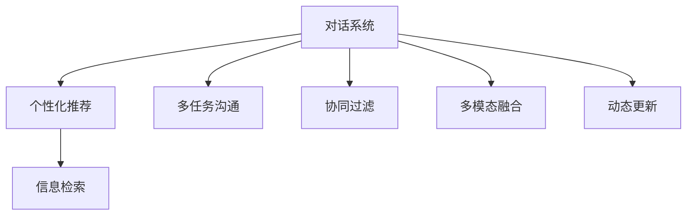
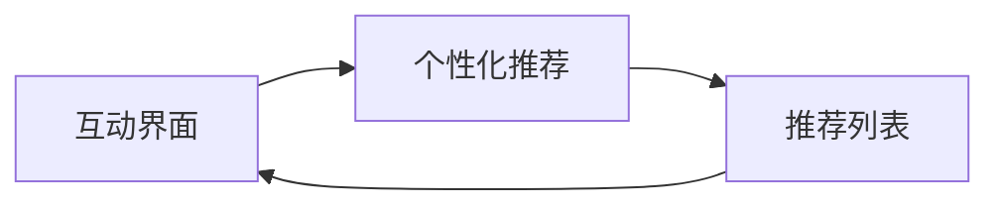
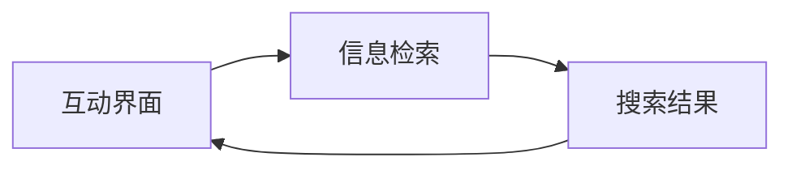
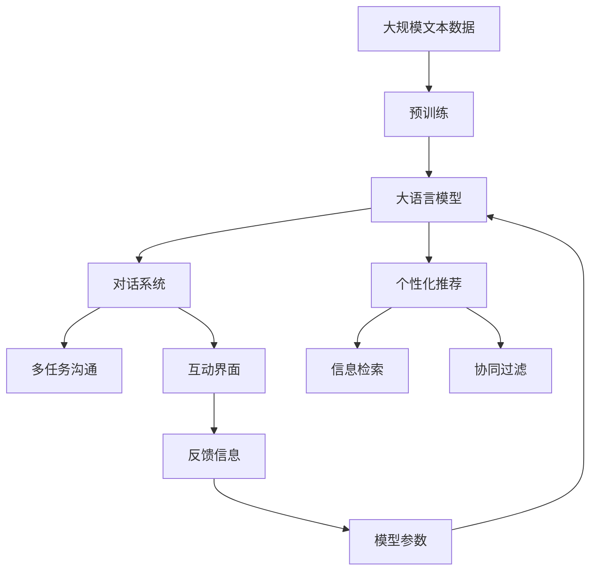

                 

# 多次任务沟通与个性化推荐的详细实现

> 关键词：多次任务沟通, 个性化推荐, 信息检索, 对话系统, 用户行为分析, 协同过滤, 机器学习, 深度学习, 自然语言处理, 推荐系统, 交互式反馈

## 1. 背景介绍

### 1.1 问题由来
随着互联网的普及和信息技术的发展，人们越来越多地通过网络进行沟通与交流。文本对话系统在很大程度上满足了人们的在线沟通需求，但传统的文本对话系统功能单一，难以适应复杂多变的用户需求。同时，个性化推荐系统通过用户的历史行为数据，为用户推荐可能感兴趣的内容，但缺乏实时互动性，难以满足用户多样化的需求。

为了解决这些问题，结合对话系统与个性化推荐系统的优点，我们提出了基于多次任务沟通与个性化推荐的解决方案。该方案通过在对话系统中引入个性化推荐功能，使用户能够在沟通中获取推荐信息，并在推荐信息的互动中完善自身偏好，从而实现更加智能化的交互体验。

### 1.2 问题核心关键点
基于多次任务沟通与个性化推荐的方案主要包含以下关键点：

1. **多任务沟通**：用户可以在对话系统中同时进行多个任务的沟通，例如同时进行信息检索、个性化推荐等。
2. **个性化推荐**：根据用户的历史行为数据，为用户推荐可能感兴趣的内容。
3. **信息检索**：根据用户的查询需求，在知识库中检索相关信息。
4. **实时互动**：用户可以通过交互反馈，动态更新推荐系统中的偏好，从而实现更加个性化的推荐。
5. **协同过滤**：基于用户间的相似度，为用户推荐其他用户喜欢的内容。
6. **多模态融合**：将文本信息与图像、语音等多模态数据结合，增强推荐系统的感知能力。
7. **动态更新**：根据用户行为和反馈，动态更新模型参数，提升推荐系统的适应性。

这些关键点共同构成了基于多次任务沟通与个性化推荐的技术框架，旨在为用户提供更加智能、灵活的交互体验。

### 1.3 问题研究意义
基于多次任务沟通与个性化推荐的方案，对于提升用户在线沟通与信息获取的效率、改善用户体验具有重要意义：

1. **提高沟通效率**：用户可以通过对话系统进行实时沟通，快速获取所需信息，节省时间成本。
2. **提升推荐精度**：通过个性化推荐，用户能够获取更符合自身偏好的内容，提高信息获取的满意度。
3. **增强互动性**：对话系统中的推荐功能可以与用户实时互动，根据反馈动态调整推荐内容，提升用户体验。
4. **促进知识共享**：用户可以在对话系统中进行知识交流和分享，促进知识的积累和传播。
5. **推动技术创新**：结合对话系统和个性化推荐技术，可以推动相关技术的深度融合和创新，推动NLP、推荐系统等领域的发展。

## 2. 核心概念与联系

### 2.1 核心概念概述

为更好地理解基于多次任务沟通与个性化推荐的方案，本节将介绍几个密切相关的核心概念：

1. **对话系统**：通过自然语言处理技术，实现用户与系统之间的自然语言交互，并提供相应的服务功能。
2. **个性化推荐**：根据用户的历史行为数据，为用户推荐可能感兴趣的内容。
3. **信息检索**：从大量数据中检索出与用户查询需求相关的信息。
4. **多任务沟通**：用户可以在对话系统中同时进行多个任务的沟通，例如信息检索、个性化推荐等。
5. **协同过滤**：基于用户间的相似度，为用户推荐其他用户喜欢的内容。
6. **多模态融合**：将文本信息与图像、语音等多模态数据结合，增强推荐系统的感知能力。
7. **动态更新**：根据用户行为和反馈，动态更新模型参数，提升推荐系统的适应性。

这些核心概念之间的逻辑关系可以通过以下Mermaid流程图来展示：



这个流程图展示了大语言模型微调过程中各个核心概念的关系和作用：

1. 对话系统通过多任务沟通功能，同时进行个性化推荐和信息检索。
2. 个性化推荐功能根据用户的历史行为数据，为用户推荐可能感兴趣的内容。
3. 信息检索功能从知识库中检索出与用户查询需求相关的信息。
4. 协同过滤功能基于用户间的相似度，为用户推荐其他用户喜欢的内容。
5. 多模态融合功能将文本信息与图像、语音等多模态数据结合，增强推荐系统的感知能力。
6. 动态更新功能根据用户行为和反馈，动态更新模型参数，提升推荐系统的适应性。

这些概念共同构成了基于多次任务沟通与个性化推荐的技术框架，为其在实际应用中提供了理论基础和实现指南。

### 2.2 概念间的关系

这些核心概念之间存在着紧密的联系，形成了基于多次任务沟通与个性化推荐的完整生态系统。下面我们通过几个Mermaid流程图来展示这些概念之间的关系。

#### 2.2.1 对话系统与个性化推荐的关系



这个流程图展示了对话系统与个性化推荐的基本关系：

1. 对话系统根据用户输入，触发个性化推荐功能。
2. 个性化推荐功能生成推荐列表，显示在对话系统中。
3. 用户通过对话界面，对推荐内容进行反馈，用于动态更新推荐模型。

#### 2.2.2 信息检索与个性化推荐的关系



这个流程图展示了信息检索与个性化推荐的关系：

1. 对话系统根据用户输入，触发信息检索功能。
2. 信息检索功能从知识库中检索出相关信息，显示在对话系统中。
3. 用户通过对话界面，对检索结果进行反馈，用于动态更新推荐模型。

#### 2.2.3 协同过滤与个性化推荐的关系


这个流程图展示了协同过滤与个性化推荐的关系：

1. 对话系统根据用户输入，触发协同过滤功能。
2. 协同过滤功能找到与用户兴趣相似的其他用户，生成推荐列表。
3. 推荐列表显示在对话系统中，用户通过对话界面进行反馈。

#### 2.2.4 多模态融合与个性化推荐的关系


这个流程图展示了多模态融合与个性化推荐的关系：

1. 对话系统根据用户输入，触发多模态融合功能。
2. 多模态融合功能将文本信息与图像、语音等多模态数据结合，生成融合特征。
3. 融合特征用于生成推荐列表，显示在对话系统中，用户通过对话界面进行反馈。

#### 2.2.5 动态更新与个性化推荐的关系


这个流程图展示了动态更新与个性化推荐的关系：

1. 对话系统根据用户输入，触发动态更新功能。
2. 动态更新功能根据用户行为和反馈，生成新的模型参数。
3. 新的模型参数用于更新推荐模型，生成推荐列表，显示在对话系统中。

### 2.3 核心概念的整体架构

最后，我们用一个综合的流程图来展示这些核心概念在大语言模型微调过程中的整体架构：



这个综合流程图展示了从预训练到微调，再到应用中的整体架构：

1. 大语言模型首先在大规模文本数据上进行预训练，学习通用的语言表示。
2. 微调模型用于对话系统，实现多任务沟通和个性化推荐功能。
3. 对话系统中的个性化推荐功能进行信息检索，生成推荐列表。
4. 推荐系统基于协同过滤和多模态融合，生成推荐列表。
5. 用户通过互动界面，对推荐内容进行反馈，用于动态更新推荐模型。
6. 动态更新模型参数，提升推荐系统的适应性。

通过这些流程图，我们可以更清晰地理解基于多次任务沟通与个性化推荐的技术框架，为后续深入讨论具体的实现方法奠定基础。

## 3. 核心算法原理 & 具体操作步骤
### 3.1 算法原理概述

基于多次任务沟通与个性化推荐的方案，本质上是一个多任务学习和个性化推荐系统的融合。其核心思想是：将预训练语言模型视作一个强大的"特征提取器"，通过在对话系统中引入个性化推荐功能，使用户能够在沟通中获取推荐信息，并在推荐信息的互动中完善自身偏好，从而实现更加智能化的交互体验。

形式化地，假设预训练语言模型为 $M_{\theta}$，其中 $\theta$ 为预训练得到的模型参数。给定对话系统的多任务沟通任务 $T_1, T_2, ..., T_n$，每个任务 $T_i$ 的推荐数据集为 $D_i=\{(x_i,y_i)\}_{i=1}^N$，其中 $x_i$ 为用户输入的文本，$y_i$ 为用户对推荐结果的反馈。微调的目标是找到新的模型参数 $\hat{\theta}$，使得：

$$
\hat{\theta}=\mathop{\arg\min}_{\theta} \sum_{i=1}^{n} \mathcal{L}_i(M_{\theta},D_i)
$$

其中 $\mathcal{L}_i$ 为针对任务 $T_i$ 设计的损失函数，用于衡量模型预测输出与真实标签之间的差异。常见的损失函数包括交叉熵损失、均方误差损失等。

通过梯度下降等优化算法，微调过程不断更新模型参数 $\theta$，最小化损失函数 $\mathcal{L}_i$，使得模型输出逼近真实标签。由于 $\theta$ 已经通过预训练获得了较好的初始化，因此即便在多个任务中，也能较快收敛到理想的模型参数 $\hat{\theta}$。

### 3.2 算法步骤详解

基于多次任务沟通与个性化推荐的方案一般包括以下几个关键步骤：

**Step 1: 准备预训练模型和数据集**
- 选择合适的预训练语言模型 $M_{\theta}$ 作为初始化参数，如 BERT、GPT 等。
- 准备对话系统的多任务沟通任务 $T_1, T_2, ..., T_n$ 的推荐数据集 $D_i$，划分为训练集、验证集和测试集。一般要求推荐数据与预训练数据的分布不要差异过大。

**Step 2: 设计任务适配层**
- 根据多任务沟通任务类型，在预训练模型顶层设计合适的输出层和损失函数。
- 对于信息检索任务，通常在顶层添加线性分类器和交叉熵损失函数。
- 对于个性化推荐任务，通常使用推荐系统的评估指标，如准确率、召回率等。

**Step 3: 设置微调超参数**
- 选择合适的优化算法及其参数，如 AdamW、SGD 等，设置学习率、批大小、迭代轮数等。
- 设置正则化技术及强度，包括权重衰减、Dropout、Early Stopping 等。
- 确定冻结预训练参数的策略，如仅微调顶层，或全部参数都参与微调。

**Step 4: 执行梯度训练**
- 将训练集数据分批次输入模型，前向传播计算损失函数。
- 反向传播计算参数梯度，根据设定的优化算法和学习率更新模型参数。
- 周期性在验证集上评估模型性能，根据性能指标决定是否触发 Early Stopping。
- 重复上述步骤直到满足预设的迭代轮数或 Early Stopping 条件。

**Step 5: 测试和部署**
- 在测试集上评估微调后模型 $M_{\hat{\theta}}$ 的性能，对比微调前后的精度提升。
- 使用微调后的模型对新样本进行推理预测，集成到实际的应用系统中。
- 持续收集新的数据，定期重新微调模型，以适应数据分布的变化。

以上是基于多次任务沟通与个性化推荐的微调范式的一般流程。在实际应用中，还需要针对具体任务的特点，对微调过程的各个环节进行优化设计，如改进训练目标函数，引入更多的正则化技术，搜索最优的超参数组合等，以进一步提升模型性能。

### 3.3 算法优缺点

基于多次任务沟通与个性化推荐的方案具有以下优点：

1. **智能交互**：对话系统中的个性化推荐功能，能够实时根据用户输入，动态调整推荐内容，提供更加智能化的交互体验。
2. **多任务处理**：用户可以在对话系统中同时进行多个任务的沟通，提高信息获取的效率。
3. **协同过滤**：通过分析用户间的相似度，为用户推荐其他用户喜欢的内容，增加推荐的相关性和多样性。
4. **多模态融合**：结合文本信息与图像、语音等多模态数据，增强推荐系统的感知能力。
5. **动态更新**：根据用户行为和反馈，动态更新推荐模型，提升推荐系统的适应性。

同时，该方案也存在一定的局限性：

1. **数据依赖**：微调的效果很大程度上取决于推荐数据的质量和数量，获取高质量推荐数据的成本较高。
2. **泛化能力有限**：当推荐数据与预训练数据的分布差异较大时，微调的性能提升有限。
3. **计算资源消耗大**：多模态融合和动态更新的过程需要大量的计算资源，对硬件设备的要求较高。
4. **模型复杂度高**：结合多任务沟通和个性化推荐功能的模型，结构复杂，训练和推理的效率可能受到影响。
5. **可解释性不足**：推荐系统的决策过程通常缺乏可解释性，难以对其推理逻辑进行分析和调试。

尽管存在这些局限性，但就目前而言，基于多次任务沟通与个性化推荐的方案仍是一种高效、实用的技术解决方案。未来相关研究的重点在于如何进一步降低推荐对标注数据的依赖，提高模型的少样本学习和跨领域迁移能力，同时兼顾可解释性和伦理安全性等因素。

### 3.4 算法应用领域

基于多次任务沟通与个性化推荐的方案在NLP领域已经得到了广泛的应用，覆盖了几乎所有常见任务，例如：

- **对话系统**：如智能客服、智能助手等。通过对话系统，用户可以进行多任务的沟通，同时获取个性化的推荐信息。
- **信息检索**：如搜索引擎、知识图谱等。通过信息检索功能，用户可以快速获取所需的信息。
- **个性化推荐**：如商品推荐、音乐推荐等。通过个性化推荐功能，用户可以获取符合自身偏好的内容。
- **知识图谱构建**：通过多模态融合功能，结合文本、图像、语音等多模态数据，构建更全面、准确的知识点图谱。
- **协同过滤**：如社交网络、电商平台等。通过协同过滤功能，为用户推荐其他用户喜欢的内容。
- **动态更新**：如推荐系统、智能推荐引擎等。通过动态更新功能，根据用户行为和反馈，实时调整推荐内容，提高推荐效果。

除了上述这些经典任务外，基于多次任务沟通与个性化推荐的方案还被创新性地应用到更多场景中，如智能教育、金融咨询、医疗健康等，为NLP技术带来了全新的突破。随着预训练模型和推荐方法的不断进步，相信基于多次任务沟通与个性化推荐的方案将在更广阔的应用领域大放异彩。

## 4. 数学模型和公式 & 详细讲解  
### 4.1 数学模型构建

本节将使用数学语言对基于多次任务沟通与个性化推荐的方案进行更加严格的刻画。

记预训练语言模型为 $M_{\theta}$，其中 $\theta$ 为预训练得到的模型参数。假设对话系统的多任务沟通任务 $T_i$ 的推荐数据集为 $D_i=\{(x_i,y_i)\}_{i=1}^N$，其中 $x_i$ 为用户输入的文本，$y_i$ 为用户对推荐结果的反馈。

定义模型 $M_{\theta}$ 在数据样本 $(x,y)$ 上的损失函数为 $\ell(M_{\theta}(x),y)$，则在数据集 $D_i$ 上的经验风险为：

$$
\mathcal{L}_i(\theta) = \frac{1}{N}\sum_{i=1}^N \ell(M_{\theta}(x_i),y_i)
$$

微调的优化目标是最小化经验风险，即找到最优参数：

$$
\theta^* = \mathop{\arg\min}_{\theta} \sum_{i=1}^{n} \mathcal{L}_i(\theta)
$$

在实践中，我们通常使用基于梯度的优化算法（如SGD、Adam等）来近似求解上述最优化问题。设 $\eta$ 为学习率，$\lambda$ 为正则化系数，则参数的更新公式为：

$$
\theta \leftarrow \theta - \eta \nabla_{\theta}\mathcal{L}(\theta) - \eta\lambda\theta
$$

其中 $\nabla_{\theta}\mathcal{L}(\theta)$ 为损失函数对参数 $\theta$ 的梯度，可通过反向传播算法高效计算。

### 4.2 公式推导过程

以下我们以信息检索任务为例，推导交叉熵损失函数及其梯度的计算公式。

假设模型 $M_{\theta}$ 在输入 $x$ 上的输出为 $\hat{y}=M_{\theta}(x) \in [0,1]$，表示样本属于正类的概率。真实标签 $y \in \{0,1\}$。则二分类交叉熵损失函数定义为：

$$
\ell(M_{\theta}(x),y) = -[y\log \hat{y} + (1-y)\log (1-\hat{y})]
$$

将其代入经验风险公式，得：

$$
\mathcal{L}_i(\theta) = -\frac{1}{N}\sum_{i=1}^N [y_i\log M_{\theta}(x_i)+(1-y_i)\log(1-M_{\theta}(x_i))]
$$

根据链式法则，损失函数对参数 $\theta_k$ 的梯度为：

$$
\frac{\partial \mathcal{L}_i(\theta)}{\partial \theta_k} = -\frac{1}{N}\sum_{i=1}^N (\frac{y_i}{M_{\theta}(x_i)}-\frac{1-y_i}{1-M_{\theta}(x_i)}) \frac{\partial M_{\theta}(x_i)}{\partial \theta_k}
$$

其中 $\frac{\partial M_{\theta}(x_i)}{\partial \theta_k}$ 可进一步递归展开，利用自动微分技术完成计算。

在得到损失函数的梯度后，即可带入参数更新公式，完成模型的迭代优化。重复上述过程直至收敛，最终得到适应多任务沟通任务的最优模型参数 $\theta^*$。

## 5. 项目实践：代码实例和详细解释说明
### 5.1 开发环境搭建

在进行微调实践前，我们需要准备好开发环境。以下是使用Python进行PyTorch开发的环境配置流程：

1. 安装Anaconda：从官网下载并安装Anaconda，用于创建独立的Python环境。

2. 创建并激活虚拟环境：
```bash
conda create -n pytorch-env python=3.8 
conda activate pytorch-env
```

3. 安装PyTorch：根据CUDA版本，从官网获取对应的安装命令。例如：
```bash
conda install pytorch torchvision torchaudio cudatoolkit=11.1 -c pytorch -c conda-forge
```

4. 安装Transformers库：
```bash
pip install transformers
```

5. 安装各类工具包：
```bash
pip install numpy pandas scikit-learn matplotlib tqdm jupyter notebook ipython
```

完成上述步骤后，即可在`pytorch-env`环境中开始微调实践。

### 5.2 源代码详细实现

这里我们以多任务沟通中的信息检索和个性化推荐为例，给出使用Transformers库对BERT模型进行微调的PyTorch代码实现。

首先，定义信息检索和个性化推荐的数据处理函数：

```python
from transformers import BertTokenizer
from torch.utils.data import Dataset
import torch

class InfoRetrievalDataset(Dataset):
    def __init__(self, texts, titles, tokenizer, max_len=128):
        self.texts = texts
        self.titles = titles
        self.tokenizer = tokenizer
        self.max_len = max_len
        
    def __len__(self):
        return len(self.texts)
    
    def __getitem__(self, item):
        text = self.texts[item]
        title = self.titles[item]
        
        encoding = self.tokenizer(text, return_tensors='pt', max_length=self.max_len, padding='max_length', truncation=True)
        input_ids = encoding['input_ids'][0]
        attention_mask = encoding['attention_mask'][0]
        
        # 对title进行编码
        title_tokens = self.tokenizer(title, return_tensors='pt', padding='max_length', truncation=True)
        title_ids = title_tokens['input_ids'][0]
        title_mask = title_tokens['attention_mask'][0]
        
        # 构造pair样本
        pair_input_ids = torch.cat([input_ids, title_ids], dim=0)
        pair_attention_mask = torch.cat([attention_mask, title_mask], dim=0)
        
        return {'pair_input_ids': pair_input_ids,
                'pair_attention_mask': pair_attention_mask,
                'labels': torch.tensor(1)}
                
class PersonalizationDataset(Dataset):
    def __init__(self, texts, tags, tokenizer, max_len=128):
        self.texts = texts
        self.tags = tags
        self.tokenizer = tokenizer
        self.max_len = max_len
        
    def __len__(self):
        return len(self.texts)
    
    def __getitem__(self, item):
        text = self.texts[item]
        tags = self.tags[item]
        
        encoding = self.tokenizer(text, return_tensors='pt', max_length=self.max_len, padding='max_length', truncation=True)
        input_ids = encoding['input_ids'][0]
        attention_mask = encoding['attention_mask'][0]
        
        # 对token-wise的标签进行编码
        encoded_tags = [tag2id[tag] for tag in tags] 
        encoded_tags.extend([tag2id['O']] * (self.max_len - len(encoded_tags)))
        labels = torch.tensor(encoded_tags, dtype=torch.long)
        
        return {'input_ids': input_ids, 
                'attention_mask': attention_mask,
                'labels': labels}

# 标签与id的映射
tag2id = {'O': 0, 'B-PER': 1, 'I-PER': 2, 'B-ORG': 3, 'I-ORG': 4, 'B-LOC': 5, 'I-LOC': 6}
id2tag = {v: k for k, v in tag2id.items()}

# 创建dataset
tokenizer = BertTokenizer.from_pretrained('bert-base-cased')

train_dataset_info = InfoRetrievalDataset(train_texts, train_titles, tokenizer)
dev_dataset_info = InfoRetrievalDataset(dev_texts, dev_titles, tokenizer)
test_dataset_info = InfoRetrievalDataset(test_texts, test_titles, tokenizer)

train_dataset_person = PersonalizationDataset(train_texts, train_tags, tokenizer)
dev_dataset_person = PersonalizationDataset(dev_texts, dev_tags, tokenizer)
test_dataset_person = PersonalizationDataset(test_texts, test_tags, tokenizer)
```

然后，定义模型和优化器：

```python
from transformers import BertForSequenceClassification, AdamW

model_info = BertForSequenceClassification.from_pretrained('bert-base-cased', num_labels=2)

model_person = BertForTokenClassification.from_pretrained('bert-base-cased', num_labels=len(tag2id))

optimizer = AdamW(model_person.parameters(), lr=2e-5)
```

接着，定义训练和评估函数：

```python
from torch.utils.data import DataLoader
from tqdm import tqdm
from sklearn.metrics import classification_report

device = torch.device('cuda') if torch.cuda.is_available() else torch.device('cpu')
model_info.to(device)

def train_epoch_info(model, dataset, batch_size, optimizer):
    dataloader = DataLoader(dataset, batch_size=batch_size, shuffle=True)
    model.train()
    epoch_loss = 0
    for batch in tqdm(dataloader, desc='Training'):
        pair_input_ids = batch['pair_input_ids'].to(device)
        pair_attention_mask = batch['pair_attention_mask'].to(device)
        labels = batch['labels'].to(device)
        model.zero_grad()
        outputs = model(pair_input_ids, attention_mask=pair_attention_mask)
        loss = outputs.loss
        epoch_loss += loss.item()
        loss.backward()
        optimizer.step()
    return epoch_loss / len(dataloader)

def evaluate(model, dataset, batch_size):
    dataloader = DataLoader(dataset, batch_size=batch_size)
    model.eval()
    preds, labels = [], []
    with torch.no_grad():
        for batch in tqdm(dataloader, desc

