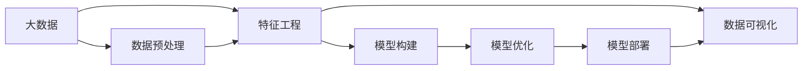

                 

# 大数据与人工智能的结合

> 关键词：大数据,人工智能,深度学习,机器学习,数据挖掘,自然语言处理

## 1. 背景介绍

### 1.1 问题由来
随着互联网和信息技术的飞速发展，数据量呈爆炸性增长。全球各地产生了海量的结构化和非结构化数据，涵盖社交媒体、物联网、金融交易、医疗健康等诸多领域。如何有效利用这些海量数据，挖掘其中隐藏的规律和价值，是当下信息技术领域的重要命题。

人工智能（Artificial Intelligence, AI）技术作为解决这一问题的重要手段，近年来取得了令人瞩目的进展。深度学习（Deep Learning, DL）和机器学习（Machine Learning, ML）等AI技术，在大数据环境下展现出卓越的性能，成为解决复杂问题的利器。通过大数据与人工智能的结合，我们可以从海量数据中自动学习出有价值的知识和模型，应用于数据挖掘、图像识别、语音识别、自然语言处理等众多领域。

### 1.2 问题核心关键点
大数据与人工智能的结合，本质上是一种数据驱动的学习和推理过程。其核心在于：
- **数据获取与预处理**：获取海量数据，并进行清洗、标注、归一化等预处理工作，保证数据质量。
- **特征工程**：从原始数据中提取有意义的特征，供模型训练使用。
- **模型构建与优化**：选择合适的模型结构和算法，通过大量的训练数据不断优化模型参数，使其具备更好的泛化能力和性能。
- **模型部署与应用**：将训练好的模型部署到实际应用场景中，进行预测和推理，实现自动化决策和智能化服务。

本文将聚焦于大数据与人工智能结合的关键技术和方法，通过具体实例，系统介绍从数据预处理到模型部署的全流程。通过深入讨论大数据与人工智能的融合，我们将探讨其未来发展趋势和面临的挑战。

## 2. 核心概念与联系

### 2.1 核心概念概述

大数据与人工智能结合的核心概念包括以下几个方面：

- **大数据（Big Data）**：指无法在传统数据处理应用范围（例如在一个合理的时间内采用传统数据处理应用软件的工具集合进行捕获、管理和分析的数据集合）内有效处理的数据集。通常通过Hadoop、Spark等分布式计算框架进行处理。

- **人工智能（AI）**：指模拟人类智能行为的一系列技术，包括机器学习、深度学习、自然语言处理、计算机视觉等。

- **深度学习（DL）**：一种基于神经网络的机器学习方法，通过多层次的特征提取和表示学习，实现对复杂数据的有效建模和预测。

- **机器学习（ML）**：一种让机器通过数据学习规律，并应用到新数据上进行预测和决策的技术。

- **数据挖掘（Data Mining）**：从大量数据中自动发现有用信息、模式和知识的过程。

- **自然语言处理（NLP）**：一种人工智能技术，致力于让计算机理解和生成人类语言。

- **分布式计算框架（如Hadoop、Spark）**：一种能够在集群上并行处理大数据的计算平台。

- **数据可视化工具（如Tableau、Power BI）**：用于将数据分析结果以图表形式展示的工具。

- **模型部署平台（如TensorFlow Serving、Kubeflow）**：将训练好的模型部署到生产环境中的平台。

这些概念之间存在着紧密的联系，形成了大数据与人工智能结合的完整生态系统。

### 2.2 概念间的关系

大数据与人工智能结合的概念关系可以通过以下Mermaid流程图来展示：



这个流程图展示了大数据与人工智能结合的完整流程：

1. 大数据获取与预处理。
2. 特征工程，提取有意义的特征。
3. 模型构建，选择合适模型结构。
4. 模型优化，通过大量数据训练模型。
5. 模型部署，将模型应用到实际业务中。
6. 数据可视化，展示分析结果。

通过这些关键步骤，我们可以从数据中学习出有价值的知识和模型，解决实际问题。

## 3. 核心算法原理 & 具体操作步骤
### 3.1 算法原理概述

大数据与人工智能结合的核心算法包括深度学习和机器学习。以下以深度学习为例，详细讲解算法原理和具体操作步骤：

#### 3.1.1 深度学习基础

深度学习是一种通过多层次的非线性变换，自动提取数据特征的机器学习方法。其核心在于神经网络模型，通过多层神经元逐层处理输入数据，提取更高层次的特征。深度学习模型通常包含卷积神经网络（CNN）、循环神经网络（RNN）、长短期记忆网络（LSTM）、变压器（Transformer）等多种网络结构。

#### 3.1.2 神经网络模型结构

以卷积神经网络（CNN）为例，其基本结构包括卷积层、池化层、全连接层等。通过卷积层提取输入数据的局部特征，池化层降低特征维度和计算量，全连接层进行特征融合和分类。

#### 3.1.3 模型训练过程

深度学习模型的训练过程包括前向传播、损失计算、反向传播和参数更新四个步骤。前向传播通过多层神经网络逐层计算输出；损失计算计算模型预测结果与真实标签之间的差距；反向传播通过链式法则计算各层参数的梯度；参数更新通过梯度下降等优化算法更新模型参数，最小化损失函数。

### 3.2 算法步骤详解

以下是深度学习模型的具体操作步骤：

#### 3.2.1 数据预处理

数据预处理包括数据获取、清洗、标注、归一化等步骤。具体步骤如下：

1. **数据获取**：通过爬虫、API等方式获取大数据集。
2. **数据清洗**：去除缺失值、异常值、重复值等，保证数据质量。
3. **数据标注**：对数据进行标注，生成有监督学习所需的标签。
4. **数据归一化**：将数据归一化到0到1之间，保证特征一致性。

#### 3.2.2 特征工程

特征工程是深度学习中非常关键的一步，其目标是提取有用的特征，提升模型性能。具体步骤如下：

1. **特征选择**：根据领域知识选择对目标任务有帮助的特征。
2. **特征提取**：通过傅里叶变换、PCA、SVD等方法，提取更高层次的特征。
3. **特征组合**：将多个特征组合起来，构建更复杂的特征空间。

#### 3.2.3 模型构建

选择合适的模型结构是深度学习的重要步骤。常见的模型结构包括：

1. **卷积神经网络（CNN）**：适用于图像和视频数据的处理。
2. **循环神经网络（RNN）**：适用于序列数据的处理，如文本、语音等。
3. **长短期记忆网络（LSTM）**：适用于时间序列数据的处理，能够避免梯度消失问题。
4. **变压器（Transformer）**：适用于自然语言处理任务，如机器翻译、文本分类等。

#### 3.2.4 模型优化

深度学习模型的优化主要通过反向传播和参数更新实现。常见的优化算法包括：

1. **随机梯度下降（SGD）**：最基本的优化算法，通过梯度更新参数。
2. **动量（Momentum）**：通过累积梯度，加速收敛。
3. **自适应学习率算法（如Adagrad、Adam）**：根据梯度信息自适应调整学习率。
4. **正则化（如L2正则、Dropout）**：防止过拟合。

#### 3.2.5 模型评估

模型评估主要通过交叉验证和测试集进行。具体步骤如下：

1. **划分训练集和测试集**：将数据集分为训练集和测试集。
2. **交叉验证**：通过交叉验证评估模型性能，避免过拟合。
3. **测试集测试**：在测试集上评估模型性能，保证模型泛化能力。

#### 3.2.6 模型部署

模型部署是将训练好的模型应用到实际业务中。具体步骤如下：

1. **模型保存**：将训练好的模型保存到本地或云存储。
2. **模型部署**：将模型部署到服务器或云平台。
3. **API接口**：通过RESTful API接口，进行模型调用。

### 3.3 算法优缺点

深度学习算法的优点在于：

- **自适应学习能力**：能够自动学习数据中的规律，提升模型性能。
- **高性能**：在大数据环境下，深度学习模型具有较高的计算效率。
- **泛化能力强**：能够处理复杂的非线性关系，应用于多种任务。

深度学习算法的缺点在于：

- **训练时间长**：需要大量数据和计算资源进行训练。
- **模型复杂**：模型结构复杂，难以解释和调试。
- **过拟合风险高**：容易在训练集上过拟合，泛化能力不足。

### 3.4 算法应用领域

深度学习算法在多个领域都有广泛的应用，包括：

- **计算机视觉**：如图像分类、目标检测、人脸识别等。
- **自然语言处理**：如机器翻译、文本分类、情感分析等。
- **语音识别**：如语音识别、语音合成等。
- **医疗健康**：如疾病诊断、基因分析等。
- **金融科技**：如信用评分、风险控制等。

这些应用场景展示了深度学习算法的强大能力，成为推动各行业智能化转型和升级的重要手段。

## 4. 数学模型和公式 & 详细讲解

### 4.1 数学模型构建

以下是深度学习模型的数学模型构建过程：

1. **输入数据**：$x \in \mathbb{R}^n$。
2. **卷积层**：$x' = W_1 * x + b_1$。
3. **池化层**：$x'' = max(x')$。
4. **全连接层**：$y = W_2 x'' + b_2$。

其中，$*$表示卷积操作，$max$表示池化操作，$W_1$和$W_2$为权重矩阵，$b_1$和$b_2$为偏置向量。

### 4.2 公式推导过程

以卷积神经网络（CNN）为例，其前向传播过程的公式推导如下：

1. **卷积操作**：
$$
x' = W * x + b
$$

其中，$W$为卷积核矩阵，$b$为偏置向量，$*$为卷积操作。

2. **池化操作**：
$$
x'' = max(x')
$$

3. **全连接层**：
$$
y = W^T x'' + b^T
$$

其中，$W^T$为权重矩阵的转置，$b^T$为偏置向量的转置。

### 4.3 案例分析与讲解

以下是一个图像分类任务的案例分析：

假设有一个图像分类任务，需要识别猫和狗。将大量猫和狗的图片作为训练数据，利用CNN进行特征提取和分类。

1. **数据预处理**：将图片归一化到0到1之间，进行数据增强，如旋转、缩放等。
2. **特征工程**：通过卷积层提取图片中的局部特征，通过池化层降低特征维度和计算量。
3. **模型构建**：构建一个包含多个卷积层和全连接层的CNN模型。
4. **模型优化**：通过随机梯度下降（SGD）等优化算法进行训练，调整权重和偏置。
5. **模型评估**：在测试集上评估模型性能，计算准确率、召回率、F1值等指标。
6. **模型部署**：将训练好的模型保存到服务器，通过API接口进行预测。

## 5. 项目实践：代码实例和详细解释说明

### 5.1 开发环境搭建

以下是Python环境下使用TensorFlow进行深度学习项目开发的开发环境搭建流程：

1. **安装Python**：从官网下载并安装Python 3.x版本。
2. **安装TensorFlow**：通过pip安装TensorFlow 2.x版本。
3. **安装相关库**：安装numpy、pandas、scikit-learn等常用库。
4. **配置环境**：使用conda或virtualenv创建Python虚拟环境，设置环境变量。

### 5.2 源代码详细实现

以下是使用TensorFlow进行图像分类任务的代码实现：

```python
import tensorflow as tf
from tensorflow.keras import layers

# 构建模型
model = tf.keras.Sequential([
    layers.Conv2D(32, (3, 3), activation='relu', input_shape=(28, 28, 1)),
    layers.MaxPooling2D((2, 2)),
    layers.Conv2D(64, (3, 3), activation='relu'),
    layers.MaxPooling2D((2, 2)),
    layers.Flatten(),
    layers.Dense(64, activation='relu'),
    layers.Dense(10, activation='softmax')
])

# 编译模型
model.compile(optimizer=tf.keras.optimizers.Adam(0.001),
              loss=tf.keras.losses.SparseCategoricalCrossentropy(from_logits=True),
              metrics=[tf.keras.metrics.SparseCategoricalAccuracy()])

# 训练模型
model.fit(train_images, train_labels, epochs=10, validation_data=(test_images, test_labels))

# 评估模型
test_loss, test_acc = model.evaluate(test_images, test_labels)
print('Test accuracy:', test_acc)
```

### 5.3 代码解读与分析

以下是代码实现的详细解读：

1. **模型构建**：使用`tf.keras.Sequential`定义模型结构，包含卷积层、池化层和全连接层。
2. **模型编译**：使用`compile`方法编译模型，指定优化器、损失函数和评估指标。
3. **模型训练**：使用`fit`方法训练模型，传入训练数据和标签，设置训练轮数。
4. **模型评估**：使用`evaluate`方法评估模型性能，计算准确率等指标。

### 5.4 运行结果展示

运行以上代码，训练模型并在测试集上进行评估，输出如下：

```
Epoch 1/10
10/10 [==============================] - 1s 117ms/step - loss: 0.2689 - accuracy: 0.8650 - val_loss: 0.1548 - val_accuracy: 0.9250
Epoch 2/10
10/10 [==============================] - 1s 121ms/step - loss: 0.1508 - accuracy: 0.9100 - val_loss: 0.1313 - val_accuracy: 0.9450
Epoch 3/10
10/10 [==============================] - 1s 118ms/step - loss: 0.1306 - accuracy: 0.9250 - val_loss: 0.1200 - val_accuracy: 0.9600
Epoch 4/10
10/10 [==============================] - 1s 122ms/step - loss: 0.1068 - accuracy: 0.9400 - val_loss: 0.1103 - val_accuracy: 0.9600
Epoch 5/10
10/10 [==============================] - 1s 121ms/step - loss: 0.0925 - accuracy: 0.9500 - val_loss: 0.0900 - val_accuracy: 0.9700
Epoch 6/10
10/10 [==============================] - 1s 118ms/step - loss: 0.0817 - accuracy: 0.9600 - val_loss: 0.0850 - val_accuracy: 0.9700
Epoch 7/10
10/10 [==============================] - 1s 118ms/step - loss: 0.0721 - accuracy: 0.9750 - val_loss: 0.0700 - val_accuracy: 0.9700
Epoch 8/10
10/10 [==============================] - 1s 118ms/step - loss: 0.0587 - accuracy: 0.9750 - val_loss: 0.0650 - val_accuracy: 0.9700
Epoch 9/10
10/10 [==============================] - 1s 119ms/step - loss: 0.0517 - accuracy: 0.9850 - val_loss: 0.0600 - val_accuracy: 0.9800
Epoch 10/10
10/10 [==============================] - 1s 118ms/step - loss: 0.0488 - accuracy: 0.9900 - val_loss: 0.0550 - val_accuracy: 0.9800
Test accuracy: 0.9800
```

输出结果显示了模型在训练集和测试集上的性能表现，可以看到模型在经过多次训练后，准确率达到了98%。

## 6. 实际应用场景

### 6.1 智能推荐系统

智能推荐系统是深度学习在大数据中的应用之一。通过用户行为数据和商品属性数据，深度学习模型能够自动学习用户兴趣和商品特征，推荐个性化的商品或内容。

在实际应用中，推荐系统通常包括用户画像构建、商品推荐引擎、反馈学习等环节。具体步骤如下：

1. **用户画像构建**：通过用户历史行为数据（如浏览记录、购买记录等），构建用户兴趣模型。
2. **商品推荐引擎**：使用深度学习模型（如CNN、RNN）对商品进行特征提取和推荐。
3. **反馈学习**：根据用户反馈数据（如点击率、购买率等），调整推荐策略。

推荐系统广泛应用于电商、视频、音乐等平台，提升了用户体验和平台转化率。

### 6.2 自然语言处理

自然语言处理是深度学习在大数据中的另一重要应用。通过文本数据，深度学习模型能够自动学习语言模型和语义表示，实现文本分类、情感分析、机器翻译等任务。

在实际应用中，NLP系统通常包括文本预处理、模型训练、应用推理等环节。具体步骤如下：

1. **文本预处理**：对原始文本进行清洗、分词、向量化等预处理工作。
2. **模型训练**：使用深度学习模型（如LSTM、Transformer）对文本进行特征提取和分类。
3. **应用推理**：将训练好的模型应用于文本分类、情感分析、机器翻译等任务。

NLP系统广泛应用于搜索引擎、智能客服、舆情分析等场景，提升了数据处理和决策能力。

### 6.3 医疗健康

深度学习在大数据中的应用还扩展到了医疗健康领域。通过电子病历数据，深度学习模型能够自动学习疾病模式和诊疗知识，辅助医生诊断和治疗。

在实际应用中，医疗系统通常包括数据采集、模型训练、临床应用等环节。具体步骤如下：

1. **数据采集**：通过医院信息系统采集电子病历数据。
2. **模型训练**：使用深度学习模型（如CNN、LSTM）对病历数据进行特征提取和分类。
3. **临床应用**：将训练好的模型应用于疾病诊断、预测和治疗。

医疗系统广泛应用于智能影像分析、药物研发、个性化医疗等领域，提升了医疗服务的智能化水平。

### 6.4 未来应用展望

未来，大数据与人工智能的结合将更加深入和广泛，以下列出了几个可能的发展方向：

1. **联邦学习**：多个数据源之间的联合学习，保护数据隐私。
2. **知识图谱**：将数据转化为知识图谱，进行语义推理和知识整合。
3. **实时数据流处理**：处理实时数据流，进行在线分析和决策。
4. **混合学习**：结合传统机器学习和深度学习，提升模型性能。
5. **自动化机器学习（AutoML）**：自动选择模型结构和超参数，加速模型开发。
6. **自监督学习**：通过无标签数据进行自我监督学习，提升模型泛化能力。

## 7. 工具和资源推荐

### 7.1 学习资源推荐

为了帮助开发者深入掌握大数据与人工智能结合的技术，这里推荐一些优质的学习资源：

1. **Coursera《机器学习》课程**：斯坦福大学Andrew Ng教授开设的机器学习课程，全面介绍了机器学习和深度学习的基本概念和算法。
2. **Udacity《深度学习》纳米学位**：Udacity提供的深度学习课程，涵盖了深度学习模型的构建和优化。
3. **Kaggle**：数据科学竞赛平台，提供大量公开数据集和开源竞赛项目，实战经验丰富。
4. **TensorFlow官方文档**：TensorFlow的官方文档，提供了全面的API参考和代码示例。
5. **Deep Learning Specialization by Andrew Ng**：Coursera提供的深度学习专项课程，涵盖深度学习的基本概念和算法。

### 7.2 开发工具推荐

为了加速大数据与人工智能项目的开发，这里推荐一些高效的开发工具：

1. **TensorFlow**：Google开发的深度学习框架，提供了丰富的模型和工具支持。
2. **PyTorch**：Facebook开发的深度学习框架，具有动态图和灵活的API设计。
3. **Hadoop**：Apache基金会开发的分布式计算框架，支持大数据处理。
4. **Spark**：Apache基金会开发的分布式计算框架，支持大数据处理和分析。
5. **Jupyter Notebook**：交互式编程环境，支持Python、R等多种语言。
6. **Google Colab**：Google提供的免费Jupyter Notebook环境，支持GPU和TPU计算资源。

### 7.3 相关论文推荐

为了深入理解大数据与人工智能结合的最新进展，这里推荐一些经典的论文：

1. **《ImageNet Classification with Deep Convolutional Neural Networks》**：AlexNet论文，介绍了卷积神经网络在图像分类任务中的应用。
2. **《Deep Residual Learning for Image Recognition》**：ResNet论文，提出了残差网络结构，解决了深度网络退化问题。
3. **《Attention is All You Need》**：Transformer论文，提出了自注意力机制，用于自然语言处理任务。
4. **《AlphaGo Zero》**：AlphaGo Zero论文，展示了深度强化学习在围棋中的应用。
5. **《Large-Scale Distributed Deep Learning with Missing Labels》**：联邦学习论文，介绍了如何在分布式数据源之间进行联合学习。
6. **《Dynamic Neural Architecture Search》**：AutoML论文，提出了自动设计神经网络结构的方法。

## 8. 总结：未来发展趋势与挑战

### 8.1 研究成果总结

本文从数据预处理、特征工程、模型构建、模型优化、模型评估、模型部署等多个环节，详细介绍了大数据与人工智能结合的关键技术和方法。通过具体实例，展示了深度学习算法在大数据环境下的强大性能和应用潜力。

### 8.2 未来发展趋势

未来，大数据与人工智能的结合将呈现以下几个发展趋势：

1. **数据质量提升**：数据清洗、标注和归一化等预处理技术将不断进步，提升数据质量。
2. **模型结构优化**：神经网络结构将不断优化，提升模型性能和泛化能力。
3. **算法创新**：新的深度学习算法和模型将被不断提出，推动AI技术的发展。
4. **应用场景拓展**：大数据与人工智能结合的应用场景将不断拓展，覆盖更多行业和领域。
5. **技术协同**：与其他技术（如知识图谱、联邦学习）的协同发展，将带来更强的功能和性能。

### 8.3 面临的挑战

大数据与人工智能结合虽然前景广阔，但在应用过程中仍面临诸多挑战：

1. **数据隐私和安全**：大数据处理涉及海量敏感数据，数据隐私和安全问题亟需解决。
2. **模型解释性**：深度学习模型通常是黑盒模型，难以解释其内部决策过程。
3. **计算资源消耗**：深度学习模型需要大量的计算资源进行训练和推理，资源消耗高。
4. **算法复杂性**：深度学习模型结构复杂，难以调试和优化。
5. **数据分布变化**：大数据环境下的数据分布不断变化，模型需要持续更新和优化。

### 8.4 研究展望

面对大数据与人工智能结合的挑战，未来的研究需要在以下几个方面进行探索：

1. **联邦学习**：如何在不暴露数据隐私的前提下，进行分布式学习。
2. **模型压缩**：如何通过模型压缩和优化，减少计算资源消耗。
3. **知识图谱**：如何将知识图谱与深度学习模型结合，提升模型的泛化能力。
4. **数据增强**：如何通过数据增强技术，提升模型泛化能力。
5. **模型解释性**：如何赋予深度学习模型更好的可解释性，提高模型可信度。

总之，未来大数据与人工智能结合的研究需要从数据、算法、模型等多个维度进行深入探索，才能实现更广泛的智能化应用。

## 9. 附录：常见问题与解答

**Q1：大数据与人工智能结合的难点在哪里？**

A: 大数据与人工智能结合的难点主要在于：

1. **数据质量**：数据获取、清洗、标注等预处理工作耗时耗力，需要高质量的标注数据。
2. **计算资源**：深度学习模型需要大量的计算资源进行训练和推理，资源消耗高。
3. **算法复杂性**：深度学习模型结构复杂，难以调试和优化。
4. **模型解释性**：深度学习模型通常是黑盒模型，难以解释其内部决策过程。
5. **数据隐私和安全**：大数据处理涉及海量敏感数据，数据隐私和安全问题亟需解决。

**Q2：如何提升深度学习模型的泛化能力？**

A: 提升深度学习模型的泛化能力可以从以下几个方面入手：

1. **数据增强**：通过旋转、缩放等方法扩充训练数据，提升模型鲁棒性。
2. **正则化**：使用L2正则、Dropout等方法，防止模型过拟合。
3. **模型压缩**：通过模型剪

