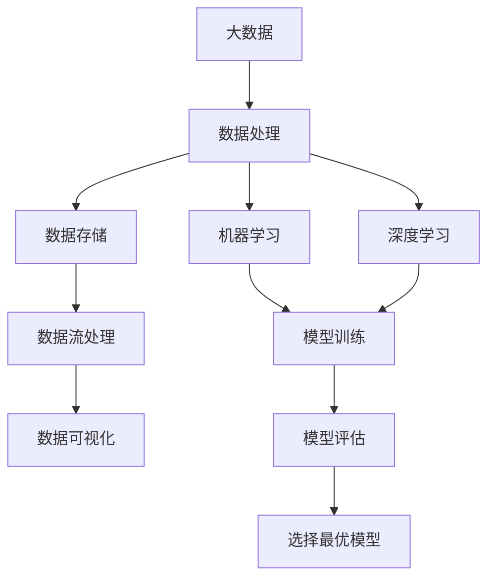
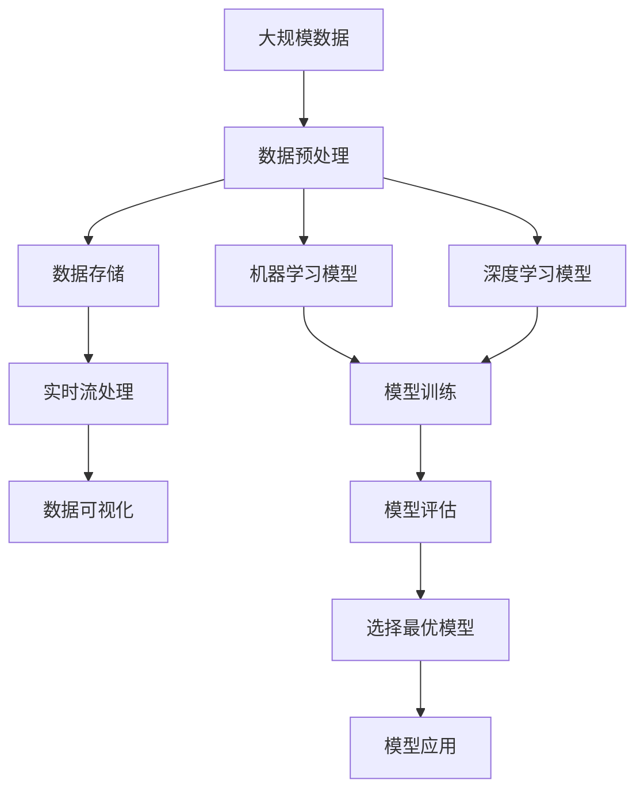

                 

# 大数据对AI学习的重要性

> 关键词：大数据, AI学习, 机器学习, 深度学习, 数据科学, 模型训练, 数据标注, 数据集构建

## 1. 背景介绍

### 1.1 问题由来
在人工智能(AI)领域，数据被誉为是“AI的生命线”。无论是传统的机器学习(ML)模型，还是新兴的深度学习(DL)模型，都需要大量的数据来进行训练和优化。大数据不仅提供了数据量上的保证，更是推动AI技术不断突破的强大动力。

当前，AI应用已经渗透到了各个行业领域，从金融、医疗、教育到交通、零售，其成功离不开高质量、规模化的数据支持。然而，数据获取、清洗、标注和存储的过程繁琐复杂，且成本高昂。如何有效利用和处理大数据，构建高质量的数据集，是大数据对AI学习重要性的核心所在。

### 1.2 问题核心关键点
大数据在AI学习中的核心作用主要体现在以下几个方面：

- **数据量**：海量数据提供了足够的统计样本，帮助模型更好地捕捉数据规律和特征。
- **多样性**：多样化的数据集可以提升模型的泛化能力，防止过拟合。
- **实时性**：实时数据能够及时反馈AI模型的表现，为模型优化提供参考。
- **标注质量**：高精度的数据标注是模型学习的基础，直接影响模型性能。

这些关键点共同构成了大数据在AI学习中的重要性，使得其在模型训练、调优和应用部署中扮演着不可或缺的角色。

### 1.3 问题研究意义
研究大数据对AI学习的重要性，不仅有助于深化对AI技术的理解，还能为大数据应用实践提供指导，推动AI技术的普及和产业化进程。具体而言：

- **技术革新**：大数据技术的应用，推动了ML、DL等模型的发展，带来了更高效、更精准的AI解决方案。
- **应用场景**：大数据支持下的AI模型，可以在更多复杂多变的场景下实现落地应用，提高工作效率和决策质量。
- **成本降低**：有效利用大数据，可以大幅降低AI应用的开发和维护成本，加速AI技术的普及。
- **技术壁垒**：掌握大数据处理技术，提升AI模型的性能和可解释性，有助于打破行业壁垒，促进跨领域融合。
- **伦理合规**：大数据驱动的AI学习，需关注数据隐私和伦理问题，促进AI技术的健康发展。

## 2. 核心概念与联系

### 2.1 核心概念概述

大数据在AI学习中的应用，涉及多个关键概念：

- **大数据**：指规模庞大、复杂多样、实时更新的数据集合。
- **数据处理**：包括数据清洗、标注、归一化、采样等预处理步骤。
- **数据存储**：使用高效的数据库、分布式存储系统，如Hadoop、Spark等。
- **数据流处理**：处理实时产生的大数据，如Storm、Flink等。
- **数据可视化**：通过图表等形式，展示数据分布和特征。
- **机器学习**：利用数据训练模型，进行模式识别和预测。
- **深度学习**：使用深度神经网络，进行高级特征提取和表示学习。
- **数据标注**：为数据添加标签，如图像分类、文本标注等。
- **模型训练**：通过优化算法调整模型参数，提高模型性能。
- **模型评估**：使用测试集评估模型表现，选择最优模型。

这些核心概念通过以下Mermaid流程图来展示它们之间的联系：



这个流程图展示了大数据在AI学习过程中各个环节的衔接关系。

### 2.2 概念间的关系

这些核心概念之间存在着紧密的联系，构成了大数据在AI学习中的完整生态系统。下面是一些关键概念之间的关系描述：

- **大数据与数据处理**：大数据规模庞大，需要经过清洗、标注等预处理步骤，才能用于模型训练。
- **数据存储与数据流处理**：数据需要被存储和管理，才能进行实时处理和分析。
- **数据可视化与机器学习**：通过可视化手段理解数据特性，可帮助选择合适的模型进行训练。
- **机器学习与深度学习**：机器学习提供传统模型，深度学习提供高级模型，两者互为补充。
- **模型训练与模型评估**：模型训练后需要进行评估，选择性能最优的模型应用到实际场景。
- **模型选择与模型训练**：基于模型评估结果，选择最合适的模型进行重新训练和优化。

通过这些概念的关系，可以更清晰地理解大数据在AI学习中的整体作用和流程。

### 2.3 核心概念的整体架构

最后，我们用一个综合的流程图来展示这些核心概念在大数据应用中的整体架构：



这个综合流程图展示了从数据预处理到模型应用的完整流程，突出了大数据在各个环节中的关键作用。

## 3. 核心算法原理 & 具体操作步骤
### 3.1 算法原理概述

在大数据背景下，AI学习的算法原理可以概括为以下几个步骤：

1. **数据获取与预处理**：从各类数据源收集数据，进行清洗、标注等预处理，构建高质量的数据集。
2. **模型训练与优化**：利用预处理后的数据集，训练和优化机器学习或深度学习模型，提高模型泛化能力和性能。
3. **模型评估与选择**：使用测试集评估模型表现，选择最优模型进行应用。
4. **模型部署与应用**：将训练好的模型部署到生产环境，进行实际应用和迭代优化。

这些步骤共同构成了基于大数据的AI学习算法框架。

### 3.2 算法步骤详解

接下来，我们将详细介绍每个步骤的具体操作步骤。

#### 3.2.1 数据获取与预处理

1. **数据源选择**：根据应用场景，选择合适的数据源，如网络爬虫、API接口、数据库等。
2. **数据清洗**：去除重复、缺失、错误的数据，提高数据质量。
3. **数据标注**：为数据添加标签，如分类、回归、标注等。
4. **数据增强**：通过数据变换、回译、合成等技术，扩充数据集，提升模型泛化能力。
5. **数据采样**：使用随机采样、分层采样等技术，构建合理的数据集分布。

#### 3.2.2 模型训练与优化

1. **模型选择**：根据任务需求，选择合适的机器学习或深度学习模型。
2. **模型初始化**：使用预训练模型或随机初始化模型参数。
3. **优化算法**：选择合适的优化算法，如SGD、Adam等，调整模型参数，最小化损失函数。
4. **正则化**：使用L2正则、Dropout等技术，防止过拟合。
5. **超参数调优**：通过网格搜索、贝叶斯优化等技术，寻找最优超参数组合。

#### 3.2.3 模型评估与选择

1. **测试集划分**：将数据集分为训练集、验证集和测试集，保证模型评估的公正性。
2. **评估指标**：根据任务需求，选择合适的评估指标，如精度、召回率、F1分数等。
3. **模型选择**：选择性能最优的模型进行应用。

#### 3.2.4 模型部署与应用

1. **模型封装**：将模型封装为服务接口，便于集成调用。
2. **模型优化**：通过模型压缩、剪枝等技术，提高模型推理速度。
3. **系统集成**：将模型集成到实际应用系统中，进行性能优化和迭代升级。

### 3.3 算法优缺点

大数据驱动的AI学习算法具有以下优点：

- **数据丰富**：大数据提供了丰富的训练样本，帮助模型捕捉更复杂的模式和规律。
- **泛化能力强**：多样化的数据集能够提升模型的泛化能力，防止过拟合。
- **实时反馈**：实时数据能够及时反馈模型表现，便于优化调整。
- **可解释性强**：大数据驱动的模型，往往具有更好的可解释性，便于理解和调试。

但同时，也存在一些缺点：

- **成本高**：数据收集、清洗、标注和存储的成本较高，限制了大数据的应用。
- **数据隐私**：大规模数据处理可能涉及隐私问题，需采取相应的数据保护措施。
- **模型复杂**：大数据驱动的模型往往结构复杂，调试和维护难度大。
- **数据噪声**：大数据中可能存在噪声数据，影响模型性能。

### 3.4 算法应用领域

基于大数据的AI学习算法，已经广泛应用于以下多个领域：

- **金融风险管理**：通过大数据分析，实时监测市场风险，预测金融市场变化。
- **医疗健康管理**：利用患者医疗数据，进行疾病预测和健康管理。
- **智能交通系统**：通过交通大数据，优化交通流量，提升道路安全。
- **智能客服系统**：使用用户反馈数据，优化客服对话模型，提升客户满意度。
- **零售推荐系统**：根据用户行为数据，提供个性化的商品推荐。
- **自然语言处理**：利用大规模文本数据，训练语言模型，进行文本分类、情感分析等任务。

此外，大数据在智慧城市、智能制造、智能家居等领域的应用前景广阔，正逐步推动各行各业的数字化转型。

## 4. 数学模型和公式 & 详细讲解 & 举例说明

### 4.1 数学模型构建

基于大数据的AI学习，可以建立如下数学模型：

设大数据集为 $D=\{x_1, x_2, ..., x_n\}$，其中 $x_i$ 表示第 $i$ 条数据，$y_i$ 表示对应的标签。模型的目标是学习一个映射函数 $f(x)$，使得 $f(x_i)$ 能够最好地预测 $y_i$。数学上，可以定义损失函数 $\mathcal{L}$ 来衡量模型预测与真实标签之间的差异：

$$
\mathcal{L}(f) = \frac{1}{n} \sum_{i=1}^n \ell(f(x_i), y_i)
$$

其中 $\ell$ 为损失函数，如均方误差、交叉熵等。

### 4.2 公式推导过程

以二分类任务为例，假设模型使用sigmoid函数作为输出层，损失函数为交叉熵损失：

$$
\ell(f(x_i), y_i) = -(y_i \log f(x_i) + (1-y_i) \log (1-f(x_i)))
$$

则模型的训练目标为最小化交叉熵损失：

$$
\min_{\theta} \mathcal{L}(\theta) = \frac{1}{n} \sum_{i=1}^n \ell(f(x_i; \theta), y_i)
$$

其中 $f(x_i; \theta)$ 为模型在参数 $\theta$ 下的预测输出。

### 4.3 案例分析与讲解

假设我们有一个二分类任务，使用大数据集进行训练，模型使用sigmoid函数作为输出层。训练过程中，使用交叉熵损失函数：

1. **数据获取与预处理**：
   - 从多个数据源收集数据，并进行清洗和标注。
   - 使用数据增强技术扩充数据集，如图像回译、文本近义替换等。
   - 将数据集分为训练集、验证集和测试集，保证模型评估的公正性。

2. **模型训练与优化**：
   - 选择合适的网络结构，如多隐层神经网络。
   - 初始化模型参数，如随机初始化或使用预训练模型。
   - 使用优化算法（如Adam）调整模型参数，最小化交叉熵损失。
   - 使用正则化技术（如L2正则）防止过拟合。
   - 使用超参数调优技术（如网格搜索）寻找最优超参数。

3. **模型评估与选择**：
   - 在测试集上评估模型表现，计算精度、召回率和F1分数。
   - 选择性能最优的模型进行应用。

4. **模型部署与应用**：
   - 将模型封装为服务接口，便于集成调用。
   - 进行模型压缩和剪枝，提高模型推理速度。
   - 集成到实际应用系统中，进行性能优化和迭代升级。

## 5. 项目实践：代码实例和详细解释说明

### 5.1 开发环境搭建

在进行大数据驱动的AI学习实践前，需要准备好开发环境。以下是使用Python和PyTorch进行深度学习开发的环境配置流程：

1. 安装Anaconda：从官网下载并安装Anaconda，用于创建独立的Python环境。
2. 创建并激活虚拟环境：
```bash
conda create -n pytorch-env python=3.8 
conda activate pytorch-env
```
3. 安装PyTorch：根据CUDA版本，从官网获取对应的安装命令。例如：
```bash
conda install pytorch torchvision torchaudio cudatoolkit=11.1 -c pytorch -c conda-forge
```
4. 安装TensorFlow：如果需要使用TensorFlow，请按照官方文档进行安装。
5. 安装各类工具包：
```bash
pip install numpy pandas scikit-learn matplotlib tqdm jupyter notebook ipython
```
完成上述步骤后，即可在`pytorch-env`环境中开始大数据驱动的AI学习实践。

### 5.2 源代码详细实现

这里以二分类任务为例，使用PyTorch和TensorFlow进行模型训练。

```python
import torch
from torch import nn
import torch.optim as optim

# 定义模型
class Model(nn.Module):
    def __init__(self):
        super(Model, self).__init__()
        self.fc1 = nn.Linear(784, 128)
        self.fc2 = nn.Linear(128, 64)
        self.fc3 = nn.Linear(64, 1)
        self.sigmoid = nn.Sigmoid()
        
    def forward(self, x):
        x = self.fc1(x)
        x = self.fc2(x)
        x = self.fc3(x)
        x = self.sigmoid(x)
        return x

# 准备数据集
train_dataset = torchvision.datasets.MNIST(root='./data', train=True, transform=transforms.ToTensor(), download=True)
test_dataset = torchvision.datasets.MNIST(root='./data', train=False, transform=transforms.ToTensor(), download=True)

# 定义训练参数
batch_size = 64
epochs = 10
learning_rate = 0.01

# 定义优化器和损失函数
model = Model()
optimizer = optim.Adam(model.parameters(), lr=learning_rate)
loss_fn = nn.BCELoss()

# 训练模型
for epoch in range(epochs):
    for batch_idx, (data, target) in enumerate(train_loader):
        optimizer.zero_grad()
        output = model(data.view(-1, 784))
        loss = loss_fn(output, target)
        loss.backward()
        optimizer.step()
        print(f'Epoch {epoch+1}, batch {batch_idx+1}/{len(train_loader)}, loss: {loss.item():.4f}')

# 评估模型
correct = 0
total = 0
with torch.no_grad():
    for data, target in test_loader:
        output = model(data.view(-1, 784))
        _, predicted = torch.max(output.data, 1)
        total += target.size(0)
        correct += (predicted == target).sum().item()
print(f'Accuracy: {100 * correct / total:.2f}%')
```

以上代码展示了使用PyTorch进行二分类任务模型的训练和评估。

### 5.3 代码解读与分析

让我们再详细解读一下关键代码的实现细节：

**Model类**：
- `__init__`方法：定义模型的层结构，包括输入层、隐藏层和输出层。
- `forward`方法：前向传播，计算模型输出。

**train_dataset和test_dataset**：
- 从MNIST数据集中加载训练集和测试集。

**训练参数**：
- 定义批量大小、训练轮数和学习率。

**优化器和损失函数**：
- 使用Adam优化器和二分类交叉熵损失函数。

**训练过程**：
- 使用for循环进行多轮训练，每次迭代一个batch数据。
- 在前向传播中，计算模型的输出和损失。
- 使用反向传播更新模型参数。

**评估过程**：
- 在测试集上评估模型性能，计算准确率。

## 6. 实际应用场景

### 6.1 智能推荐系统

大数据在智能推荐系统中具有重要应用。通过对用户行为数据进行建模，可以预测用户对物品的偏好，提供个性化的推荐。

在实际应用中，可以通过收集用户的浏览、购买、评分等行为数据，构建用户行为数据集。使用深度学习模型（如神经网络、协同过滤等）对数据集进行训练，得到用户与物品之间的关系模型。在推荐时，根据用户输入的查询或历史行为，快速计算出与其兴趣相关的物品，进行推荐。

### 6.2 金融风险管理

大数据在金融风险管理中具有重要应用。通过对金融市场的历史数据进行分析，可以预测市场的波动和风险。

在实际应用中，可以收集股票、债券、期货等金融产品的历史价格数据，构建金融市场数据集。使用深度学习模型（如时间序列模型、生成对抗网络等）对数据集进行训练，得到市场风险预测模型。在实时预测时，根据市场最新的数据，快速计算出市场波动情况，进行风险预警。

### 6.3 医疗健康管理

大数据在医疗健康管理中具有重要应用。通过对患者医疗数据进行分析，可以进行疾病预测和健康管理。

在实际应用中，可以收集患者的电子病历、医疗影像、生命体征等数据，构建患者健康数据集。使用深度学习模型（如卷积神经网络、循环神经网络等）对数据集进行训练，得到疾病预测模型。在实时预测时，根据患者输入的最新数据，快速计算出疾病风险情况，进行健康预警。

## 7. 工具和资源推荐

### 7.1 学习资源推荐

为了帮助开发者系统掌握大数据驱动的AI学习技术，这里推荐一些优质的学习资源：

1. **《深度学习》课程**：由吴恩达教授开设的Coursera深度学习课程，系统介绍了深度学习的基本概念和实现技术。
2. **《Python深度学习》书籍**：弗朗索瓦·巴隆(François Chollet)的深度学习书籍，介绍了TensorFlow和Keras的实现细节，适合初学者和进阶者阅读。
3. **《机器学习实战》书籍**：Peter Harrington的机器学习实战书籍，介绍了多种机器学习算法的实现和应用，适合实践操作。
4. **Kaggle竞赛平台**：提供大量的机器学习竞赛数据集和社区讨论，有助于提升实战能力。
5. **GitHub开源项目**：搜索相关主题的GitHub项目，参考他人的实现代码，进行学习和改进。

### 7.2 开发工具推荐

高效的开发离不开优秀的工具支持。以下是几款用于大数据驱动的AI学习开发的常用工具：

1. **Jupyter Notebook**：Jupyter Notebook是一个交互式的数据分析工具，支持Python、R等语言，适合数据探索和模型验证。
2. **TensorFlow**：由Google主导开发的开源深度学习框架，支持分布式训练和部署，适合大规模数据集处理。
3. **PyTorch**：由Facebook开发的开源深度学习框架，灵活的动态计算图设计，适合研究和原型开发。
4. **Apache Spark**：Apache Spark是一个分布式计算框架，支持大数据处理和分析，适合大规模数据集存储和处理。
5. **Apache Hadoop**：Apache Hadoop是一个分布式存储和处理框架，支持大规模数据存储和处理，适合大数据处理和分析。
6. **Apache Kafka**：Apache Kafka是一个实时数据流处理平台，支持高吞吐量的数据传输和处理，适合实时数据处理和分析。

### 7.3 相关论文推荐

大数据驱动的AI学习技术不断发展，以下几篇奠基性的相关论文，推荐阅读：

1. **《深度学习》书籍**：Ian Goodfellow等著，系统介绍了深度学习的基本概念和实现技术。
2. **《大规模在线学习》论文**：Nathan Srebro等著，介绍了大规模在线学习的算法和应用。
3. **《数据驱动的机器学习》书籍**：Raj Rajaratnam等著，介绍了数据驱动的机器学习的基本概念和应用。
4. **《深度学习》书籍**：Ian Goodfellow等著，介绍了深度学习的基本概念和实现技术。
5. **《大数据机器学习》书籍**：Michael Stonebraker等著，介绍了大数据机器学习的基本概念和应用。

这些论文代表了大数据在AI学习中的发展脉络。通过学习这些前沿成果，可以帮助研究者把握学科前进方向，激发更多的创新灵感。

## 8. 总结：未来发展趋势与挑战

### 8.1 总结

本文对大数据在AI学习中的重要性进行了全面系统的介绍。首先阐述了大数据对AI学习的重要作用，明确了其在数据量、多样性、实时性和标注质量等方面的核心价值。其次，从原理到实践，详细讲解了大数据在AI学习中的应用流程，给出了大数据驱动的AI学习项目的完整代码实例。同时，本文还广泛探讨了大数据在智能推荐系统、金融风险管理、医疗健康管理等多个领域的应用前景，展示了大数据驱动的AI学习技术的巨大潜力。此外，本文精选了大数据处理、深度学习、机器学习等多个学习资源，力求为读者提供全方位的技术指引。

通过本文的系统梳理，可以看到，大数据在AI学习中扮演了重要角色，其核心价值在于提供丰富的训练数据、提升模型的泛化能力、实时反馈模型表现，以及确保模型的可解释性。大数据驱动的AI学习技术已经广泛应用到金融、医疗、智能推荐等多个领域，具有巨大的应用前景和发展空间。

### 8.2 未来发展趋势

展望未来，大数据驱动的AI学习技术将呈现以下几个发展趋势：

1. **模型规模持续增大**：随着算力成本的下降和数据规模的扩张，预训练语言模型和深度学习模型的参数量还将持续增长，带来更强大的模型表现。
2. **数据流处理技术提升**：实时数据流的处理能力提升，能够更快地反馈模型的表现，促进模型的实时优化。
3. **模型解释性增强**：大数据驱动的模型往往具有更好的可解释性，未来的研究将进一步提升模型的透明性和可理解性。
4. **数据隐私保护**：大数据应用中的数据隐私保护技术不断进步，能够更好地保护用户数据安全。
5. **多模态数据融合**：融合视觉、语音、文本等多模态数据，提升模型的多模态表示能力，增强模型在复杂场景下的应用。

这些趋势凸显了大数据在AI学习中的重要地位和应用前景。通过不断优化模型训练过程和数据处理技术，大数据驱动的AI学习技术将逐步迈向成熟和普及，为更多行业带来智能化解决方案。

### 8.3 面临的挑战

尽管大数据驱动的AI学习技术已经取得了瞩目成就，但在其发展过程中也面临诸多挑战：

1. **数据获取难度大**：高质量、大规模数据获取难度大，限制了大数据应用的推广。
2. **数据隐私保护**：大规模数据处理可能涉及隐私问题，需采取相应的数据保护措施。
3. **模型复杂度高**：大数据驱动的模型往往结构复杂，调试和维护难度大。
4. **模型泛化能力不足**：大数据中可能存在噪声数据，影响模型的泛化能力。
5. **数据标注成本高**：大规模数据标注成本高，限制了大数据应用的普及。

### 8.4 未来突破

面对大数据驱动的AI学习技术面临的挑战，未来的研究需要在以下几个方面寻求新的突破：

1. **无监督和半监督学习**：摆脱对大规模标注数据的依赖，利用自监督学习、主动学习等无监督和半监督范式，最大限度利用非结构化数据。
2. **分布式计算技术**：发展分布式计算技术，提升大数据处理和分析能力，支持大规模数据集存储和处理。
3. **模型压缩和剪枝**：通过模型压缩和剪枝技术，提高模型的推理速度和存储效率。
4. **多模态数据融合**：融合视觉、语音、文本等多模态数据，提升模型的多模态表示能力。
5. **数据隐私保护技术**：发展数据隐私保护技术，确保大数据应用中的数据安全。

这些研究方向的探索，必将引领大数据驱动的AI学习技术迈向更高的台阶，为构建安全、可靠、可解释、可控的智能系统铺平道路。

## 9. 附录：常见问题与解答

**Q1：大数据驱动的AI学习对数据量要求高吗？**

A: 是的，大数据驱动的AI学习对数据量要求很高。足够的训练数据能够帮助模型捕捉更多的模式和规律，提升模型的泛化能力。

**Q2：大数据驱动的AI学习中，数据清洗和标注成本高吗？**

A: 是的，大数据驱动的AI学习中，数据清洗和标注成本很高。数据清洗和标注需要大量的手工操作，工作量巨大。

**Q3：大数据驱动的AI学习中，模型复杂度高吗？**

A: 是的，大数据驱动的AI学习中，模型复杂度高。特别是深度学习模型，参数量巨大，结构复杂，调试和维护难度大。

**Q4：大数据驱动

