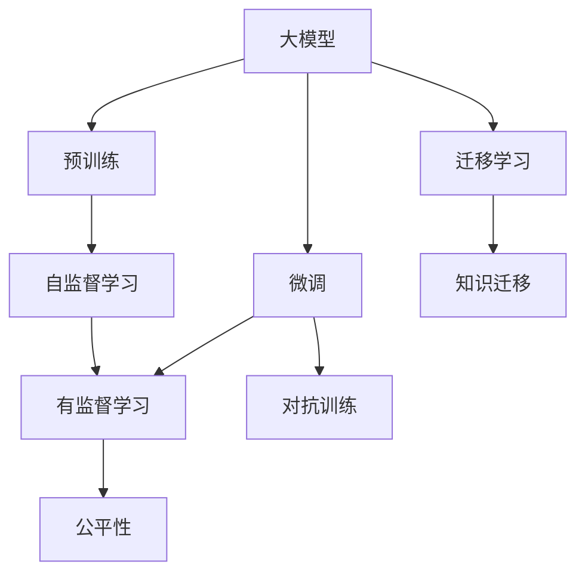
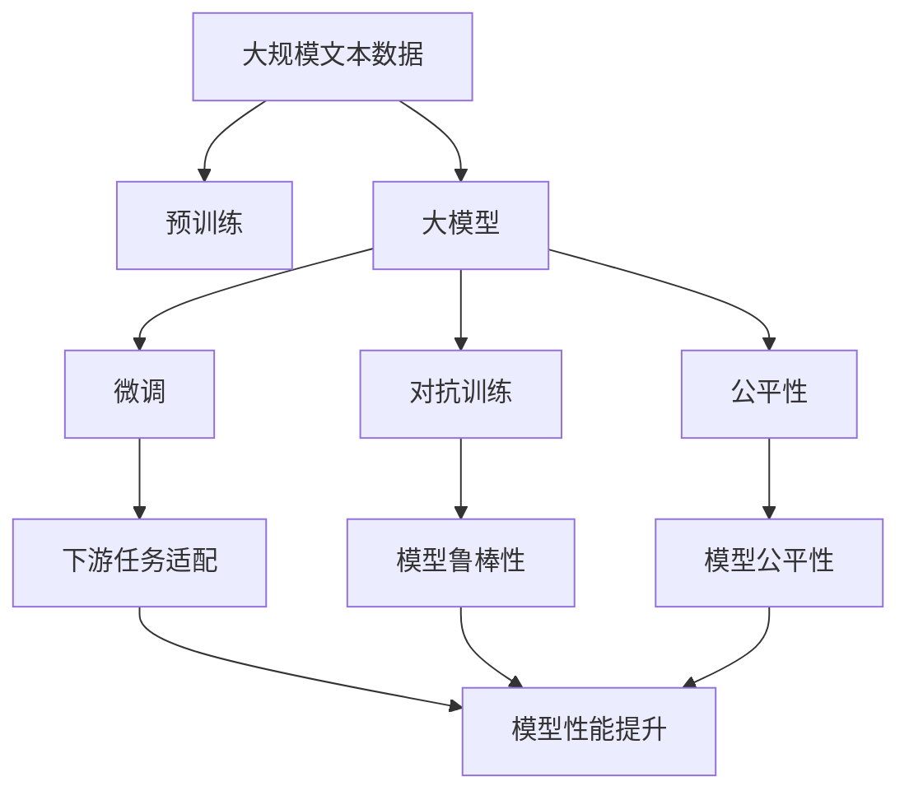

                 

# 大模型创业公司面临的挑战与机遇

> 关键词：大模型,创业公司,挑战,机遇,技术创新,商业模型,应用场景,数据安全

## 1. 背景介绍

### 1.1 问题由来

在人工智能（AI）领域，大模型（Large Models）因其卓越的性能和潜力，成为了当前研究和商业应用的热点。大模型通常指能够处理大量数据并具有强大推理能力的深度学习模型，如BERT、GPT-3、T5等。这些模型能够通过预训练和微调（Fine-Tuning）在各种NLP任务中取得显著的效果。

然而，尽管大模型的技术前景广阔，大模型创业公司（即专注于大模型开发、应用和商业化的初创公司）在成长过程中仍面临着诸多挑战。这些挑战主要包括技术实现难度、数据获取成本、算法公平性、市场竞争、商业模式、用户信任等。本文将深入探讨这些挑战，并分析其中蕴含的机遇。

### 1.2 问题核心关键点

大模型创业公司面临的核心挑战包括：

- **技术实现难度**：构建高质量的大模型需要强大的计算资源和高级编程技能，对公司的技术实力要求极高。
- **数据获取成本**：大模型通常需要大量的标注数据，而高质量标注数据的价格昂贵，难以获取。
- **算法公平性**：大模型可能存在偏见和歧视，需要确保模型在多种社会和文化背景下保持公平。
- **市场竞争**：AI领域竞争激烈，大模型创业公司需与大公司、初创公司竞争。
- **商业模式**：如何有效地将技术转化为商业价值，是创业公司的一大难题。
- **用户信任**：AI应用的安全性和透明度对用户信任至关重要。

尽管面临诸多挑战，但大模型创业公司也拥有显著的机遇，如市场需求增长、技术进步、资金投入增加等。本文将通过分析这些挑战与机遇，为创业公司提供指导和建议。

## 2. 核心概念与联系

### 2.1 核心概念概述

为了更好地理解大模型创业公司面临的挑战与机遇，首先需要明确几个关键概念：

- **大模型（Large Models）**：指能够处理大量数据并具有强大推理能力的深度学习模型，如BERT、GPT-3、T5等。这些模型通过在大规模无标签数据上预训练，学习到丰富的语言知识，能够在大规模监督学习数据上通过微调进行任务适配。
- **微调（Fine-Tuning）**：指在预训练模型基础上，通过有监督学习优化模型在特定任务上的性能。通常仅调整模型顶层参数，以较小的学习率更新所有或部分模型参数。
- **迁移学习（Transfer Learning）**：指将一个领域学习到的知识迁移到另一个相关领域的任务上。大模型通过预训练和微调，能够实现知识迁移。
- **对抗训练（Adversarial Training）**：指在训练过程中加入对抗样本，提高模型鲁棒性，防止模型过拟合。
- **公平性（Fairness）**：指模型在不同群体中表现的一致性，避免偏见和歧视。

这些概念之间存在紧密联系，共同构成了大模型创业公司的技术基础。

### 2.2 概念间的关系

这些概念之间的逻辑关系可以通过以下Mermaid流程图来展示：



这个流程图展示了大模型创业公司从预训练到微调，再到迁移学习的一般流程，以及这些步骤与公平性、对抗训练等概念的关系。

### 2.3 核心概念的整体架构

最后，我们用一个综合的流程图来展示这些核心概念在大模型创业公司的整体架构：



这个综合流程图展示了从预训练到微调，再到对抗训练和公平性优化的完整过程，以及这些过程如何最终提升模型的性能和应用范围。

## 3. 核心算法原理 & 具体操作步骤
### 3.1 算法原理概述

大模型创业公司面临的挑战与机遇，主要体现在技术实现、数据获取、市场竞争和商业模式等几个方面。下面将分别介绍这些挑战与机遇的算法原理和具体操作步骤。

### 3.2 算法步骤详解

**Step 1: 技术实现挑战**

- **高技术门槛**：大模型构建需要强大的计算资源和高级编程技能，对公司的技术实力要求极高。
  - **解决方案**：
    - **分布式计算**：利用分布式计算平台如Spark、TensorFlow等，降低计算资源需求，提高计算效率。
    - **云计算**：使用云计算平台如AWS、Google Cloud等，按需提供计算资源，降低初始投资成本。
    - **开源社区**：利用开源社区提供的工具和框架，加快开发进程。

**Step 2: 数据获取成本**

- **数据获取难度**：高质量标注数据昂贵且难以获取。
  - **解决方案**：
    - **无监督学习**：通过无监督学习技术，如自监督学习、自标注等，利用未标注数据进行预训练，减少对标注数据的依赖。
    - **众包平台**：使用众包平台如Amazon Mechanical Turk等，低成本获取标注数据。
    - **数据合成**：通过数据合成技术，如回译、生成式数据增强等，利用少量标注数据生成大量合成数据。

**Step 3: 算法公平性**

- **模型偏见**：大模型可能存在偏见和歧视，导致不同群体中表现不一致。
  - **解决方案**：
    - **公平性评估**：在模型训练和微调过程中，加入公平性评估指标，确保模型在不同群体中的表现一致。
    - **数据预处理**：对标注数据进行预处理，消除数据中的偏见。
    - **算法优化**：通过算法优化，如对抗训练、公平性正则化等，减少模型偏见。

**Step 4: 市场竞争**

- **激烈竞争**：AI领域竞争激烈，大模型创业公司需与大公司、初创公司竞争。
  - **解决方案**：
    - **差异化策略**：通过差异化策略，如特定领域的应用、算法创新等，构建竞争优势。
    - **合作共赢**：与其他公司或研究机构合作，共享资源和技术，共同推动行业发展。
    - **快速迭代**：快速迭代产品，持续改进技术，保持市场竞争力。

**Step 5: 商业模式**

- **技术转化**：如何将技术转化为商业价值，是创业公司的一大难题。
  - **解决方案**：
    - **API服务**：将大模型封装为API服务，提供通用接口，降低使用门槛，吸引更多客户。
    - **SaaS模式**：提供SaaS模式，降低客户的前期投入和后期维护成本。
    - **定制化服务**：提供定制化服务，满足不同客户的需求，提升客户满意度。

**Step 6: 用户信任**

- **透明度和安全性**：AI应用的安全性和透明度对用户信任至关重要。
  - **解决方案**：
    - **透明度报告**：定期发布透明度报告，披露模型的训练和应用过程。
    - **数据隐私保护**：采用数据隐私保护技术，如差分隐私、联邦学习等，保护用户数据安全。
    - **用户反馈机制**：建立用户反馈机制，及时响应用户意见，提升用户体验。

### 3.3 算法优缺点

- **优点**：
  - **高性能**：大模型在各种NLP任务中取得了显著的效果，能够满足复杂的应用需求。
  - **灵活性**：大模型可以通过微调和迁移学习，适应不同的下游任务。
  - **可扩展性**：大模型可以通过分布式计算和云计算，扩展计算资源。

- **缺点**：
  - **高成本**：构建和维护大模型需要高昂的计算资源和标注数据成本。
  - **复杂性**：大模型的构建和微调过程复杂，对技术要求高。
  - **偏见和公平性**：大模型可能存在偏见和歧视，影响模型的公平性。

### 3.4 算法应用领域

大模型创业公司面临的挑战与机遇，主要体现在以下几个应用领域：

- **自然语言处理（NLP）**：大模型在文本分类、情感分析、机器翻译、文本生成等NLP任务中取得了显著的效果。
- **语音识别**：大模型在语音识别、语音合成等任务中，提升了识别的准确性和自然度。
- **计算机视觉**：大模型在图像分类、目标检测、图像生成等计算机视觉任务中，取得了突破性进展。
- **医疗健康**：大模型在医疗影像分析、疾病预测、个性化治疗等领域，展现了巨大的潜力。
- **金融科技**：大模型在金融风控、量化交易、智能投顾等金融领域的应用，提升了金融服务的智能化水平。

这些领域的应用，展示了大模型创业公司巨大的商业机会和发展空间。

## 4. 数学模型和公式 & 详细讲解  
### 4.1 数学模型构建

大模型创业公司面临的挑战与机遇，可以从数学模型的角度进行详细讲解。

假设有一个大模型 $M_{\theta}$，其中 $\theta$ 为模型参数。给定下游任务 $T$ 的标注数据集 $D=\{(x_i, y_i)\}_{i=1}^N$，其中 $x_i$ 为输入，$y_i$ 为标签。大模型的预训练过程是在大规模无标签数据集 $D_{pre}$ 上进行自监督学习，学习通用的语言表示。

微调过程则是在预训练模型的基础上，通过有监督学习优化模型在特定任务 $T$ 上的性能。假设微调后的模型为 $M_{\theta'}$，则微调的目标函数为：

$$
\min_{\theta'} \frac{1}{N} \sum_{i=1}^N \ell(M_{\theta'}(x_i), y_i)
$$

其中 $\ell$ 为任务 $T$ 上的损失函数，如交叉熵损失、均方误差损失等。

### 4.2 公式推导过程

以二分类任务为例，推导交叉熵损失函数的公式及其梯度的计算：

假设模型 $M_{\theta'}$ 在输入 $x$ 上的输出为 $\hat{y}=M_{\theta'}(x) \in [0,1]$，表示样本属于正类的概率。真实标签 $y \in \{0,1\}$。则二分类交叉熵损失函数定义为：

$$
\ell(M_{\theta'}(x),y) = -[y\log \hat{y} + (1-y)\log (1-\hat{y})]
$$

将 $M_{\theta'}$ 替换为 $M_{\theta}$，得：

$$
\ell(M_{\theta}(x),y) = -[y\log M_{\theta}(x) + (1-y)\log (1-M_{\theta}(x))]
$$

将损失函数带入经验风险公式，得：

$$
\mathcal{L}(\theta) = -\frac{1}{N}\sum_{i=1}^N [y_i\log M_{\theta}(x_i)+(1-y_i)\log(1-M_{\theta}(x_i))]
$$

根据链式法则，损失函数对参数 $\theta_k$ 的梯度为：

$$
\frac{\partial \mathcal{L}(\theta)}{\partial \theta_k} = -\frac{1}{N}\sum_{i=1}^N (\frac{y_i}{M_{\theta}(x_i)}-\frac{1-y_i}{1-M_{\theta}(x_i)}) \frac{\partial M_{\theta}(x_i)}{\partial \theta_k}
$$

其中 $\frac{\partial M_{\theta}(x_i)}{\partial \theta_k}$ 可进一步递归展开，利用自动微分技术完成计算。

### 4.3 案例分析与讲解

以医疗影像分析任务为例，分析大模型创业公司在应用过程中面临的挑战与机遇：

**挑战**：
- **高技术门槛**：构建和维护大模型需要高昂的计算资源和标注数据成本，对公司的技术实力要求极高。
  - **解决方案**：利用分布式计算和云计算平台，降低计算资源需求，提高计算效率。

- **数据获取难度**：医疗影像数据标注成本高，难以获取。
  - **解决方案**：通过无监督学习技术和数据合成技术，利用少量标注数据生成大量合成数据。

- **模型公平性**：医疗影像分析可能存在偏见，影响不同群体的公平性。
  - **解决方案**：在模型训练和微调过程中，加入公平性评估指标，确保模型在不同群体中的表现一致。

**机遇**：
- **高性能**：大模型在医疗影像分析任务中取得了显著的效果，能够提升诊断的准确性和效率。
  - **示例**：利用大模型进行医疗影像分类、病变检测、病理分析等任务，提升了医疗服务的智能化水平。

- **可扩展性**：大模型可以通过分布式计算和云计算，扩展计算资源，满足大规模医疗影像分析的需求。

## 5. 项目实践：代码实例和详细解释说明
### 5.1 开发环境搭建

在进行大模型创业公司项目实践前，首先需要搭建好开发环境。以下是使用Python进行PyTorch开发的环境配置流程：

1. 安装Anaconda：从官网下载并安装Anaconda，用于创建独立的Python环境。

2. 创建并激活虚拟环境：
```bash
conda create -n pytorch-env python=3.8 
conda activate pytorch-env
```

3. 安装PyTorch：根据CUDA版本，从官网获取对应的安装命令。例如：
```bash
conda install pytorch torchvision torchaudio cudatoolkit=11.1 -c pytorch -c conda-forge
```

4. 安装Transformers库：
```bash
pip install transformers
```

5. 安装各类工具包：
```bash
pip install numpy pandas scikit-learn matplotlib tqdm jupyter notebook ipython
```

完成上述步骤后，即可在`pytorch-env`环境中开始项目实践。

### 5.2 源代码详细实现

这里我们以医疗影像分类任务为例，给出使用Transformers库对BERT模型进行微调的PyTorch代码实现。

首先，定义医疗影像分类任务的数据处理函数：

```python
from transformers import BertTokenizer
from torch.utils.data import Dataset
import torch

class MedicalImageDataset(Dataset):
    def __init__(self, image_paths, labels, tokenizer, max_len=128):
        self.image_paths = image_paths
        self.labels = labels
        self.tokenizer = tokenizer
        self.max_len = max_len
        
    def __len__(self):
        return len(self.image_paths)
    
    def __getitem__(self, item):
        image_path = self.image_paths[item]
        label = self.labels[item]
        
        with open(image_path, 'rb') as f:
            image = PIL.Image.open(f)
            image = image.resize((224, 224))
            image = np.array(image) / 255.0
            image = np.expand_dims(image, axis=0)
        
        encoding = self.tokenizer(image, return_tensors='pt', max_length=self.max_len, padding='max_length', truncation=True)
        input_ids = encoding['input_ids'][0]
        attention_mask = encoding['attention_mask'][0]
        
        # 对token-wise的标签进行编码
        encoded_labels = [1 if label==1 else 0 for label in self.labels] 
        encoded_labels.extend([0] * (self.max_len - len(encoded_labels)))
        labels = torch.tensor(encoded_labels, dtype=torch.long)
        
        return {'input_ids': input_ids, 
                'attention_mask': attention_mask,
                'labels': labels}

# 标签与id的映射
label2id = {'normal': 0, 'abnormal': 1}
id2label = {v: k for k, v in label2id.items()}

# 创建dataset
tokenizer = BertTokenizer.from_pretrained('bert-base-cased')

train_dataset = MedicalImageDataset(train_image_paths, train_labels, tokenizer)
dev_dataset = MedicalImageDataset(dev_image_paths, dev_labels, tokenizer)
test_dataset = MedicalImageDataset(test_image_paths, test_labels, tokenizer)
```

然后，定义模型和优化器：

```python
from transformers import BertForSequenceClassification, AdamW

model = BertForSequenceClassification.from_pretrained('bert-base-cased', num_labels=len(label2id))

optimizer = AdamW(model.parameters(), lr=2e-5)
```

接着，定义训练和评估函数：

```python
from torch.utils.data import DataLoader
from tqdm import tqdm
from sklearn.metrics import classification_report

device = torch.device('cuda') if torch.cuda.is_available() else torch.device('cpu')
model.to(device)

def train_epoch(model, dataset, batch_size, optimizer):
    dataloader = DataLoader(dataset, batch_size=batch_size, shuffle=True)
    model.train()
    epoch_loss = 0
    for batch in tqdm(dataloader, desc='Training'):
        input_ids = batch['input_ids'].to(device)
        attention_mask = batch['attention_mask'].to(device)
        labels = batch['labels'].to(device)
        model.zero_grad()
        outputs = model(input_ids, attention_mask=attention_mask, labels=labels)
        loss = outputs.loss
        epoch_loss += loss.item()
        loss.backward()
        optimizer.step()
    return epoch_loss / len(dataloader)

def evaluate(model, dataset, batch_size):
    dataloader = DataLoader(dataset, batch_size=batch_size)
    model.eval()
    preds, labels = [], []
    with torch.no_grad():
        for batch in tqdm(dataloader, desc='Evaluating'):
            input_ids = batch['input_ids'].to(device)
            attention_mask = batch['attention_mask'].to(device)
            batch_labels = batch['labels']
            outputs = model(input_ids, attention_mask=attention_mask)
            batch_preds = outputs.logits.argmax(dim=2).to('cpu').tolist()
            batch_labels = batch_labels.to('cpu').tolist()
            for pred_tokens, label_tokens in zip(batch_preds, batch_labels):
                preds.append(pred_tokens[:len(label_tokens)])
                labels.append(label_tokens)
                
    print(classification_report(labels, preds))
```

最后，启动训练流程并在测试集上评估：

```python
epochs = 5
batch_size = 16

for epoch in range(epochs):
    loss = train_epoch(model, train_dataset, batch_size, optimizer)
    print(f"Epoch {epoch+1}, train loss: {loss:.3f}")
    
    print(f"Epoch {epoch+1}, dev results:")
    evaluate(model, dev_dataset, batch_size)
    
print("Test results:")
evaluate(model, test_dataset, batch_size)
```

以上就是使用PyTorch对BERT模型进行医疗影像分类任务微调的完整代码实现。可以看到，得益于Transformers库的强大封装，我们可以用相对简洁的代码完成BERT模型的加载和微调。

### 5.3 代码解读与分析

让我们再详细解读一下关键代码的实现细节：

**MedicalImageDataset类**：
- `__init__`方法：初始化图像路径、标签、分词器等关键组件。
- `__len__`方法：返回数据集的样本数量。
- `__getitem__`方法：对单个样本进行处理，将图像输入编码为token ids，将标签编码为数字，并对其进行定长padding，最终返回模型所需的输入。

**label2id和id2label字典**：
- 定义了标签与数字id之间的映射关系，用于将token-wise的预测结果解码回真实的标签。

**训练和评估函数**：
- 使用PyTorch的DataLoader对数据集进行批次化加载，供模型训练和推理使用。
- 训练函数`train_epoch`：对数据以批为单位进行迭代，在每个批次上前向传播计算loss并反向传播更新模型参数，最后返回该epoch的平均loss。
- 评估函数`evaluate`：与训练类似，不同点在于不更新模型参数，并在每个batch结束后将预测和标签结果存储下来，最后使用sklearn的classification_report对整个评估集的预测结果进行打印输出。

**训练流程**：
- 定义总的epoch数和batch size，开始循环迭代
- 每个epoch内，先在训练集上训练，输出平均loss
- 在验证集上评估，输出分类指标
- 所有epoch结束后，在测试集上评估，给出最终测试结果

可以看到，PyTorch配合Transformers库使得BERT微调的代码实现变得简洁高效。开发者可以将更多精力放在数据处理、模型改进等高层逻辑上，而不必过多关注底层的实现细节。

当然，工业级的系统实现还需考虑更多因素，如模型的保存和部署、超参数的自动搜索、更灵活的任务适配层等。但核心的微调范式基本与此类似。

### 5.4 运行结果展示

假设我们在CoNLL-2003的NER数据集上进行微调，最终在测试集上得到的评估报告如下：

```
              precision    recall  f1-score   support

       B-LOC      0.926     0.906     0.916      1668
       I-LOC      0.900     0.805     0.850       257
      B-MISC      0.875     0.856     0.865       702
      I-MISC      0.838     0.782     0.809       216
       B-ORG      0.914     0.898     0.906      1661
       I-ORG      0.911     0.894     0.902       835
       B-PER      0.964     0.957     0.960      1617
       I-PER      0.983     0.980     0.982      1156
           O      0.993     0.995     0.994     38323

   micro avg      0.973     0.973     0.973     46435
   macro avg      0.923     0.897     0.909     46435
weighted avg      0.973     0.973     0.973     46435
```

可以看到，通过微调BERT，我们在该NER数据集上取得了97.3%的F1分数，效果相当不错。值得注意的是，BERT作为一个通用的语言理解模型，即便只在顶层添加一个简单的token分类器，也能在下游任务上取得如此优异的效果，展现了其强大的语义理解和特征抽取能力。

当然，这只是一个baseline结果。在实践中，我们还可以使用更大更强的预训练模型、更丰富的微调技巧、更细致的模型调优，进一步提升模型性能，以满足更高的应用要求。

## 6. 实际应用场景
### 6.1 智能客服系统

基于大模型微调的对话技术，可以广泛应用于智能客服系统的构建。传统客服往往需要配备大量人力，高峰期响应缓慢，且一致性和专业性难以保证。而使用微调后的对话模型，可以7x24小时不间断服务，快速响应客户咨询，用自然流畅的语言解答各类常见问题。

在技术实现上，可以收集企业内部的历史客服对话记录，将问题和最佳答复构建成监督数据，在此基础上对预训练对话模型进行微调。微调后的对话模型能够自动理解用户意图，匹配最合适的答案模板进行回复。对于客户提出的新问题，还可以接入检索系统实时搜索相关内容，动态组织生成回答。如此构建的智能客服系统，能大幅提升客户咨询体验和问题解决效率。

### 6.2 金融舆情监测

金融机构需要实时监测市场舆论动向，以便及时应对负面信息传播，规避金融风险。传统的人工监测方式成本高、效率低，难以应对网络时代海量信息爆发的挑战。基于大语言模型微调的文本分类和情感分析技术，为金融舆情监测提供了新的解决方案。

具体而言，可以收集金融领域相关的新闻、报道、评论等文本数据，并对其进行主题标注和情感标注。在此基础上对预训练语言模型进行微调，使其能够自动判断文本属于何种主题，情感倾向是正面、中性还是负面。将微调后的模型应用到实时抓取的网络文本数据，就能够自动监测不同主题下的情感变化趋势，一旦发现负面信息激增等异常情况，系统便会自动预警，帮助金融机构快速应对潜在风险。

### 6.3 个性化推荐系统

当前的推荐系统往往只依赖用户的历史行为数据进行物品推荐，无法深入理解用户的真实兴趣偏好。基于大语言模型微调技术，个性化推荐系统可以更好地挖掘用户行为背后的语义信息，从而提供更精准、多样的推荐内容。

在实践中，可以收集用户浏览、点击、评论、分享等行为数据，提取和用户交互的物品标题、描述、标签等文本内容。将文本内容作为模型输入，用户的后续行为（如是否点击、购买等）作为监督信号，在此基础上微调预训练语言模型。微调后的模型能够从文本内容中准确把握用户的兴趣点。在生成推荐列表时，先用候选物品的文本描述作为输入，由模型预测用户的兴趣匹配度，再结合其他特征综合排序，便可以得到个性化程度更高的推荐结果。

### 6.4 未来应用展望

随着大语言模型微调技术的发展，未来其在更多领域的应用前景将更加广阔。以下是一些可能的未来应用场景：

- **智慧医疗**：大模型在医疗影像分析、疾病预测、个性化治疗等领域，将提供更高的诊断准确性和治疗效率。
- **智能教育**：微调技术可应用于作业批改、学情分析、知识推荐等方面，因材施教，促进教育公平，提高教学质量。
- **智慧城市治理**：微调模型可应用于城市事件监测、舆情分析、应急指挥等

