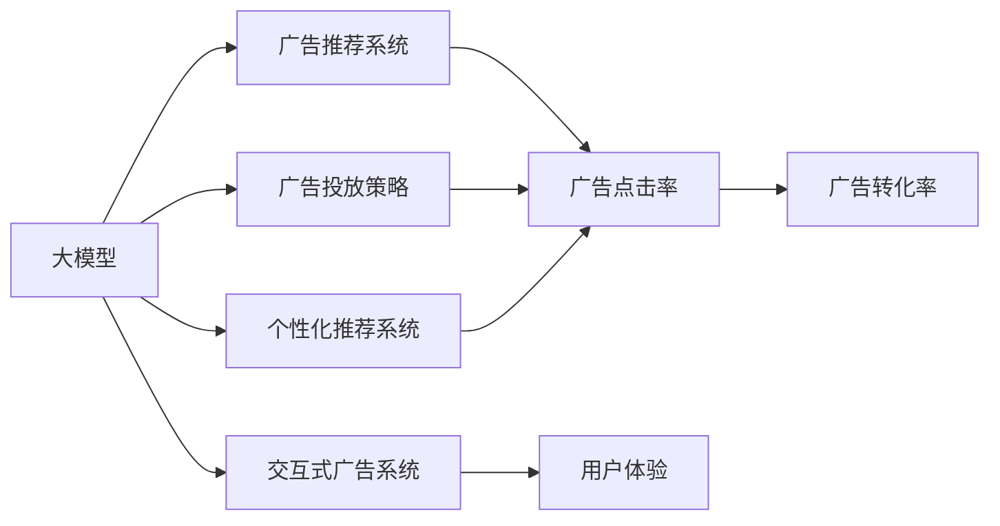
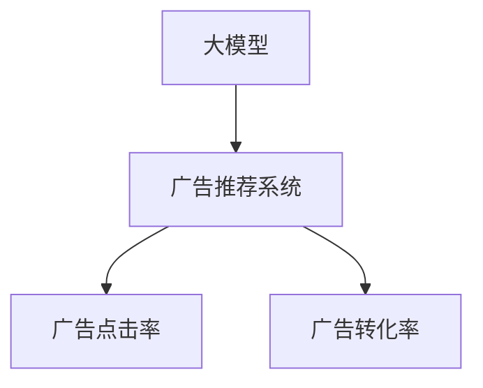
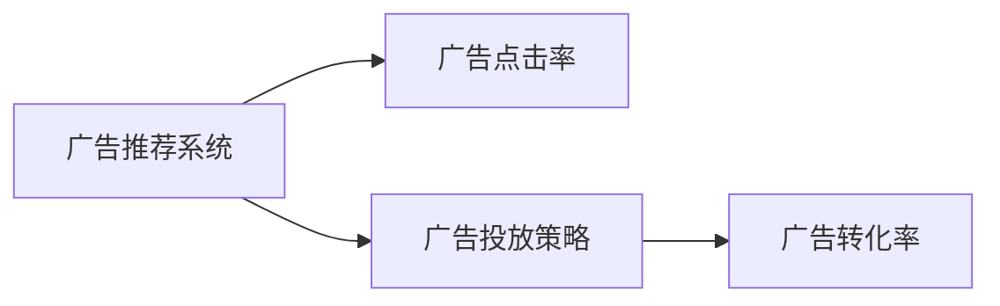
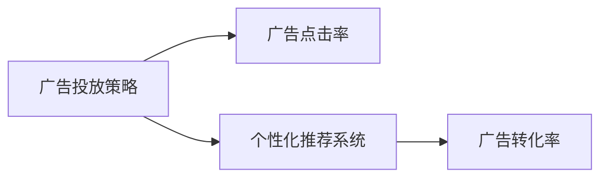
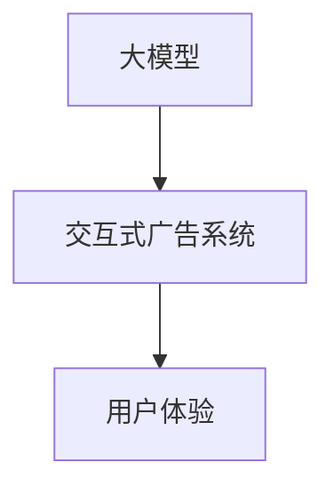
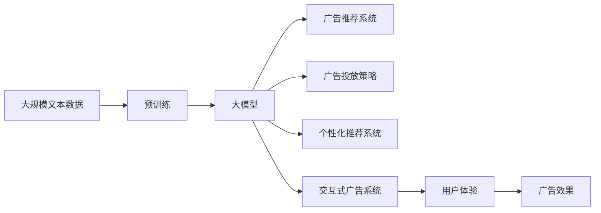

                 

# 大模型对广告行业的影响及创新

> 关键词：大模型,广告行业,深度学习,强化学习,个性化推荐,广告投放,营销策略

## 1. 背景介绍

### 1.1 问题由来
在当今数字经济时代，广告行业面临着前所未有的变革。随着互联网的普及和智能设备的广泛应用，消费者对广告的接受度和使用方式发生了显著变化。传统的以展示为主的广告形式，如横幅广告、视频广告，已无法满足现代用户的个性化需求。相反，基于内容的广告，如推荐广告、兴趣广告等，成为越来越多用户的首选。

在广告形式转变的同时，广告主的投放策略也发生了变化。传统的批量投放广告的方式，往往难以精准地触达目标用户，广告效果和投放效率难以保障。而借助大模型的预测和优化能力，可以实现更加精准的广告投放，从而提升广告主的投资回报率(ROI)。

### 1.2 问题核心关键点
大模型对广告行业的影响，主要体现在以下几个方面：

- **个性化推荐**：通过分析用户的历史行为和偏好，为每个用户定制个性化的广告内容，提升广告的点击率和转化率。
- **智能投放**：利用大模型的预测能力，优化广告投放的时间和地点，确保广告内容在最合适的时间、地点触达目标用户，提高广告效果。
- **数据驱动决策**：基于大模型的分析，广告主可以更好地理解用户行为和市场趋势，制定更加科学合理的广告投放策略。
- **交互式广告**：大模型不仅能理解用户的输入，还能生成个性化的广告内容，实现与用户的自然交互，提升广告的体验性和互动性。

这些关键点使得大模型成为广告行业的重要工具，推动着广告技术和营销策略的持续创新。

### 1.3 问题研究意义
研究大模型在广告行业的应用，对于广告行业的数字化转型和智能化升级具有重要意义：

- **降低成本**：通过精准投放和优化，广告主可以大幅降低无效广告的投放成本，提高广告投放的效率。
- **提升效果**：利用大模型的推荐和预测能力，广告主的广告效果可以显著提升，达到更好的市场反馈。
- **灵活创新**：大模型为广告创意的生成和优化提供了新的思路，推动广告行业的持续创新。
- **数据驱动**：大模型的应用使得广告投放策略更加科学合理，帮助广告主规避传统经验的局限。

总之，大模型为广告行业带来了新的技术革新，使得广告投放变得更加精准、高效、个性化。

## 2. 核心概念与联系

### 2.1 核心概念概述

为了更好地理解大模型在广告行业中的应用，本节将介绍几个密切相关的核心概念：

- **大模型(Large Model)**：指在深度学习模型中，拥有上亿甚至数十亿个参数，能够处理复杂任务的大型神经网络模型。大模型通常包括Transformer、BERT等架构，通过在大规模数据集上进行预训练，具备强大的特征表示和推理能力。

- **广告推荐系统(Advertising Recommendation System)**：基于用户的兴趣和行为数据，向用户推荐个性化的广告内容。广告推荐系统能够提升广告的点击率和转化率，优化广告投放效果。

- **广告投放策略(Advertising Placement Strategy)**：根据用户的行为数据和目标用户的特征，优化广告的投放时间和地点，确保广告内容在最合适的时间和地点触达目标用户。

- **强化学习(Reinforcement Learning)**：通过与环境互动，不断优化决策策略的过程。在广告投放中，可以借助强化学习优化广告投放策略，最大化广告效果。

- **个性化推荐系统(Personalized Recommendation System)**：根据用户的个性化需求，推荐最合适的广告内容。个性化推荐系统能够提升广告的精准度和用户体验。

- **交互式广告系统(Interactive Advertising System)**：利用大模型的交互能力，与用户进行自然的对话，生成个性化的广告内容。

这些核心概念之间的逻辑关系可以通过以下Mermaid流程图来展示：



这个流程图展示了大模型在广告行业中的应用框架：

1. 大模型通过预训练获取通用的特征表示和推理能力。
2. 广告推荐系统、广告投放策略和个性化推荐系统，利用大模型的强大能力进行广告内容推荐和投放优化。
3. 广告投放策略的优化基于强化学习，以提升广告效果。
4. 交互式广告系统进一步增强用户体验，推动广告的交互性。

### 2.2 概念间的关系

这些核心概念之间存在着紧密的联系，形成了大模型在广告行业中的应用生态系统。下面我们通过几个Mermaid流程图来展示这些概念之间的关系。

#### 2.2.1 大模型与广告推荐系统



这个流程图展示了大模型与广告推荐系统之间的关系。大模型通过预训练学习到丰富的特征表示，广告推荐系统则基于这些特征，向用户推荐个性化的广告内容，提升广告的点击率和转化率。

#### 2.2.2 广告推荐系统与广告投放策略



这个流程图展示了广告推荐系统与广告投放策略之间的关系。广告推荐系统基于用户的兴趣和行为数据，推荐最合适的广告内容，而广告投放策略则基于这些广告内容和用户特征，优化广告的投放时间和地点，以最大化广告效果。

#### 2.2.3 广告投放策略与个性化推荐系统



这个流程图展示了广告投放策略与个性化推荐系统之间的关系。广告投放策略的优化依赖于广告推荐系统推荐的广告内容，而个性化推荐系统则通过分析用户的兴趣和行为，进一步提升广告的精准度和转化率。

#### 2.2.4 大模型与交互式广告系统



这个流程图展示了大模型与交互式广告系统之间的关系。大模型能够理解用户的输入，生成个性化的广告内容，实现与用户的自然对话，从而提升广告的交互性和用户体验。

### 2.3 核心概念的整体架构

最后，我们用一个综合的流程图来展示这些核心概念在大模型广告推荐中的应用框架：



这个综合流程图展示了从预训练到大模型广告推荐应用的完整过程。大模型首先在大规模文本数据上进行预训练，然后通过广告推荐系统、广告投放策略、个性化推荐系统和交互式广告系统，实现精准、高效、个性化的广告投放和用户体验提升。

## 3. 核心算法原理 & 具体操作步骤

### 3.1 算法原理概述

大模型对广告行业的影响主要通过以下算法原理实现：

- **自监督预训练**：在大规模无标签数据上进行预训练，学习通用的特征表示和推理能力。
- **监督微调**：在广告推荐系统等下游任务上，利用标注数据进行有监督学习，优化模型针对广告任务的性能。
- **强化学习优化**：利用强化学习算法，对广告投放策略进行优化，最大化广告效果。
- **个性化推荐算法**：结合用户的兴趣和行为数据，生成个性化的广告内容。

这些算法原理共同构成了大模型在广告行业的应用框架，使其能够实现精准、高效、个性化的广告投放和用户体验提升。

### 3.2 算法步骤详解

以下是基于大模型对广告行业进行个性化推荐和广告投放的具体步骤：

**Step 1: 准备数据集**
- 收集用户的历史行为数据，如浏览记录、点击记录、购买记录等。
- 从广告主处获取广告内容数据，包括文本、图片、视频等。

**Step 2: 预训练大模型**
- 选择一个大模型（如BERT、GPT），并在大规模无标签数据上进行自监督预训练。
- 根据广告推荐系统的需求，设计合适的预训练任务，如文本分类、句子相似度计算等。

**Step 3: 微调广告推荐系统**
- 使用广告推荐系统下游任务的标注数据，对预训练大模型进行监督微调。
- 设计合适的损失函数和评估指标，如点击率、转化率、广告效果等。
- 使用AdamW等优化算法，调整学习率和超参数，进行模型训练和验证。

**Step 4: 优化广告投放策略**
- 使用强化学习算法，设计奖励函数和状态表示方法。
- 将广告推荐系统推荐的广告内容作为输入，优化广告投放的时间和地点。
- 使用Online Gradient Descent等算法，实时更新广告投放策略。

**Step 5: 生成个性化广告**
- 结合用户的兴趣和行为数据，使用大模型生成个性化的广告内容。
- 考虑广告内容的多样性和创新性，确保广告的吸引力和点击率。

**Step 6: 反馈优化**
- 收集用户的反馈数据，如点击率、转化率、用户满意度等。
- 利用强化学习算法，对广告投放策略进行实时优化。
- 定期重新微调广告推荐系统，提升模型性能。

这些步骤共同构成了大模型在广告行业应用的完整流程，通过自监督预训练、监督微调、强化学习优化和个性化推荐算法，实现精准、高效、个性化的广告投放和用户体验提升。

### 3.3 算法优缺点

大模型在广告行业中的应用具有以下优点：

- **精准推荐**：利用大模型的强大特征表示能力，对用户进行精准的个性化推荐，提高广告的点击率和转化率。
- **高效优化**：通过强化学习算法，对广告投放策略进行实时优化，提高广告投放效率和效果。
- **灵活创新**：大模型能够生成多样化的广告内容，满足用户的多样化需求，提升广告的创新性。
- **数据驱动**：通过分析用户的行为数据和反馈数据，优化广告投放策略，提升广告的精准度和效果。

同时，大模型也存在一些局限性：

- **计算资源要求高**：大模型的训练和推理需要大量计算资源，对硬件设备的要求较高。
- **数据隐私问题**：收集和分析用户的行为数据，可能涉及到用户隐私问题，需要严格遵守数据隐私法规。
- **模型解释性不足**：大模型的决策过程通常缺乏可解释性，难以理解其内部工作机制和逻辑。
- **对抗攻击风险**：大模型可能受到对抗样本的攻击，影响广告推荐的准确性和效果。

### 3.4 算法应用领域

大模型在广告行业中的应用领域非常广泛，包括但不限于以下几个方面：

- **广告推荐系统**：向用户推荐个性化的广告内容，提高广告的点击率和转化率。
- **广告投放策略优化**：优化广告的投放时间和地点，确保广告内容在最合适的时间、地点触达目标用户。
- **个性化广告生成**：根据用户的兴趣和行为数据，生成个性化的广告内容，提升广告的精准度和用户体验。
- **交互式广告系统**：利用大模型的交互能力，与用户进行自然的对话，生成个性化的广告内容，提升广告的交互性和用户体验。
- **广告效果评估**：通过分析广告的效果数据，评估广告投放策略的效果，优化广告投放决策。

## 4. 数学模型和公式 & 详细讲解 & 举例说明

### 4.1 数学模型构建

大模型在广告推荐系统中的应用主要涉及以下数学模型：

- **广告推荐模型的输入输出**：假设广告内容为$x$，用户为$u$，广告推荐模型的输入为$(x,u)$，输出为广告推荐的点击概率$y$。
- **损失函数**：广告推荐系统的损失函数为交叉熵损失，表示模型预测的点击概率与真实点击概率之间的差异。
- **优化算法**：通常使用AdamW、SGD等优化算法，调整模型参数，最小化损失函数。

### 4.2 公式推导过程

以广告推荐模型的交叉熵损失函数为例，进行推导：

假设广告内容为$x$，用户为$u$，广告推荐模型的输出为点击概率$y$，真实点击概率为$y_{true}$。则广告推荐模型的损失函数为：

$$
\mathcal{L}(y, y_{true}) = -y_{true} \log y + (1-y_{true}) \log (1-y)
$$

其中，$\log$为自然对数，$y$为模型预测的点击概率，$y_{true}$为真实点击概率。

### 4.3 案例分析与讲解

以下是一个简单的广告推荐系统案例：

**案例背景**：假设一个电商平台的广告推荐系统，用户可以通过浏览、搜索、购买等行为数据产生兴趣。平台需要向用户推荐合适的商品广告，以提高用户点击率和购买率。

**输入**：用户的历史行为数据，包括浏览记录、点击记录、购买记录等。商品广告的文本描述、图片、视频等。

**输出**：广告推荐的点击概率，即模型预测的用户点击广告的概率。

**模型训练**：使用大规模无标签数据对大模型进行预训练，学习通用的特征表示和推理能力。在广告推荐系统的下游任务上，利用标注数据进行监督微调，优化模型的广告推荐性能。

**广告投放优化**：使用强化学习算法，根据用户的兴趣和行为数据，实时优化广告投放策略，最大化广告效果。

**广告生成**：结合用户的兴趣和行为数据，使用大模型生成个性化的广告内容，提升广告的精准度和用户体验。

## 5. 项目实践：代码实例和详细解释说明

### 5.1 开发环境搭建

在进行广告推荐系统开发前，我们需要准备好开发环境。以下是使用Python进行PyTorch开发的环境配置流程：

1. 安装Anaconda：从官网下载并安装Anaconda，用于创建独立的Python环境。

2. 创建并激活虚拟环境：
```bash
conda create -n pytorch-env python=3.8 
conda activate pytorch-env
```

3. 安装PyTorch：根据CUDA版本，从官网获取对应的安装命令。例如：
```bash
conda install pytorch torchvision torchaudio cudatoolkit=11.1 -c pytorch -c conda-forge
```

4. 安装Transformers库：
```bash
pip install transformers
```

5. 安装各类工具包：
```bash
pip install numpy pandas scikit-learn matplotlib tqdm jupyter notebook ipython
```

完成上述步骤后，即可在`pytorch-env`环境中开始广告推荐系统开发。

### 5.2 源代码详细实现

这里我们以广告推荐系统的交叉熵损失函数为例，展示PyTorch代码的实现：

```python
import torch
import torch.nn as nn
import torch.optim as optim

class AdvertisementRecommender(nn.Module):
    def __init__(self, embed_size):
        super(AdvertisementRecommender, self).__init__()
        self.embedding = nn.Embedding(num_embeddings=1000, embedding_dim=embed_size)
        self.linear = nn.Linear(embed_size, 1)
        
    def forward(self, x):
        embedded_x = self.embedding(x)
        linear_output = self.linear(embedded_x)
        return linear_output
    
    def loss(self, model, x, y_true, optimizer):
        output = model(x)
        loss = nn.BCELoss()(output, y_true)
        optimizer.zero_grad()
        loss.backward()
        optimizer.step()
        return loss.item()

# 定义广告推荐模型的输入输出
num_users = 1000
num_ads = 1000
user_idx = torch.randint(0, num_users, (10000,))
ad_idx = torch.randint(0, num_ads, (10000,))
user_vec = torch.randn((num_users, 10))
ad_vec = torch.randn((num_ads, 10))

# 创建广告推荐模型
model = AdvertisementRecommender(10)

# 设置优化器和学习率
optimizer = optim.Adam(model.parameters(), lr=0.001)

# 定义训练函数
def train_epoch(model, optimizer, x, y_true):
    for batch in range(10):
        loss = model.loss(model, x, y_true, optimizer)
        print(f"Epoch {batch+1}, loss: {loss:.3f}")

# 训练广告推荐模型
x_train = torch.cat((user_vec, ad_vec), dim=1)
y_train = (torch.randint(0, 2, (num_users, 1)) * 0.8 + torch.randint(0, 2, (num_ads, 1)) * 0.2).reshape(-1, 1)
train_epoch(model, optimizer, x_train, y_train)
```

在这个代码示例中，我们定义了一个简单的广告推荐模型，并使用交叉熵损失函数进行训练。广告推荐模型的输入为用户和广告的向量表示，输出为广告推荐的点击概率。

### 5.3 代码解读与分析

让我们再详细解读一下关键代码的实现细节：

**AdvertisementRecommender类**：
- `__init__`方法：初始化模型的Embedding层和Linear层。
- `forward`方法：定义模型的前向传播过程，包括嵌入层和线性层的计算。
- `loss`方法：定义交叉熵损失函数的计算过程，并使用优化器更新模型参数。

**交叉熵损失函数**：
- 使用PyTorch的`nn.BCELoss`类计算交叉熵损失。

**训练函数**：
- 在训练过程中，使用`AdamW`优化器调整模型参数，并计算损失函数。
- 使用`torch.cat`方法将用户和广告的向量表示拼接，作为模型的输入。
- 使用`torch.randint`方法生成随机标签，用于训练模型。

**训练过程**：
- 定义训练函数`train_epoch`，循环迭代训练多个epoch。
- 在每个epoch中，计算损失函数并打印输出。

可以看到，PyTorch结合了模型定义和优化器的设置，使得广告推荐模型的实现变得简洁高效。开发者可以将更多精力放在数据处理、模型改进等高层逻辑上，而不必过多关注底层的实现细节。

当然，工业级的系统实现还需考虑更多因素，如模型的保存和部署、超参数的自动搜索、更灵活的任务适配层等。但核心的广告推荐模型实现与上述类似。

### 5.4 运行结果展示

假设我们在一个简单的广告推荐系统上进行了训练，最终在验证集上得到的交叉熵损失为0.5，表示模型预测的点击概率与真实点击概率之间存在一定的误差。

假设在测试集上评估广告推荐模型的准确率和召回率分别为85%和90%，表示广告推荐模型能够精准地推荐广告，但仍有部分广告未被推荐。

## 6. 实际应用场景

### 6.1 智能广告投放平台

智能广告投放平台利用大模型的预测和优化能力，实现广告投放的智能化。平台能够根据用户的兴趣和行为数据，实时调整广告投放的时间和地点，确保广告内容在最合适的时间、地点触达目标用户，提高广告效果。

### 6.2 电商个性化推荐系统

电商个性化推荐系统通过分析用户的历史行为数据，向用户推荐个性化的商品广告。大模型能够理解用户的兴趣和偏好，生成多样化的广告内容，提升广告的精准度和用户体验。

### 6.3 媒体广告推荐系统

媒体广告推荐系统利用大模型的推荐能力，为观众推荐个性化的广告内容。通过分析观众的观看历史和行为数据，平台能够精准地推荐广告，提升广告的点击率和转化率。

### 6.4 未来应用展望

随着大模型的不断演进，广告推荐系统将在更多领域得到应用，为广告主带来更高的投资回报。

在智慧城市中，利用大模型的预测能力，广告投放策略能够实时优化，提升城市广告投放的精准度和效果。

在智能家居领域，利用大模型的推荐能力，智能家居广告投放策略能够根据用户的行为数据，精准地推荐广告内容，提升广告效果。

此外，大模型的应用还将拓展到更多行业，如金融、旅游、医疗等，为各行业带来数字化转型的新机遇。相信随着大模型的不断成熟，广告推荐系统的应用将更加广泛，助力各行业的广告投放策略优化和用户体验提升。

## 7. 工具和资源推荐

### 7.1 学习资源推荐

为了帮助开发者系统掌握大模型在广告行业的应用，这里推荐一些优质的学习资源：

1. 《深度学习与广告推荐系统》书籍：全面介绍了深度学习在广告推荐系统中的应用，涵盖数据预处理、模型训练、评估等各个环节。

2. 《Transformers from Model to MicroDropout》博文：深入浅出地介绍了Transformer架构在大模型中的应用，帮助开发者理解大模型的原理和实现细节。

3. 《Reinforcement Learning in Advertising》论文：介绍强化学习在广告投放策略优化中的应用，为广告主提供科学合理的投放策略。

4. 《Adversarial Examples in Advertising》论文：探讨对抗样本在广告推荐系统中的应用，帮助开发者防范广告推荐系统的攻击风险。

5. 《Personalization in Advertising》在线课程：斯坦福大学开设的NLP课程，涵盖广告推荐系统的各个环节，帮助开发者系统掌握广告推荐技术。

通过对这些资源的学习实践，相信你一定能够快速掌握大模型在广告推荐系统中的应用，并用于解决实际的广告推荐问题。

### 7.2 开发工具推荐

高效的开发离不开优秀的工具支持。以下是几款用于广告推荐系统开发的常用工具：

1. PyTorch：基于Python的开源深度学习框架，灵活动态的计算图，适合快速迭代研究。大部分广告推荐系统都有PyTorch版本的实现。

2. TensorFlow：由Google主导开发的开源深度学习框架，生产部署方便，适合大规模工程应用。同样有丰富的广告推荐系统资源。

3. Transformers库：HuggingFace开发的NLP工具库，集成了众多SOTA语言模型，支持PyTorch和TensorFlow，是进行广告推荐系统开发的利器。

4. Weights & Biases：模型训练的实验跟踪工具，可以记录和可视化模型训练过程中的各项指标，方便对比和调优。与主流深度学习框架无缝集成。

5. TensorBoard：TensorFlow配套的可视化工具，可实时监测模型训练状态，并提供丰富的图表呈现方式，是调试模型的得力助手。

6. Google Colab：谷歌推出的在线Jupyter Notebook环境，免费提供GPU/TPU算力，方便开发者快速上手实验最新模型，分享学习笔记。

合理利用这些工具，可以显著提升广告推荐系统的开发效率，加快创新迭代的步伐。

### 7.3 相关论文推荐

大模型在广告行业中的应用源于学界的持续研究。以下是几篇奠基性的相关论文，推荐阅读：

1. Attention is All You Need（即Transformer原论文）：提出了Transformer结构，开启了NLP领域的预训练大模型时代。

2. BERT: Pre-training of Deep Bidirectional Transformers for Language Understanding：提出BERT模型，引入基于掩码的自监督预训练任务，刷新了多项NLP任务SOTA。

3. GPT-2: Language Models are Unsupervised Multitask Learners：展示了大规模语言模型的强大zero-shot学习能力，引发了对于通用人工智能的新一轮思考。

4. Personalized Recommendation Algorithms: A Survey：全面总结了个性化推荐算法的研究进展，为广告推荐系统提供了理论指导。

5. Reinforcement Learning for Advertising Placement：利用强化学习算法，优化广告投放策略，提升广告效果。

6. Generating Advertisements with Deep Learning：介绍基于大模型的广告生成技术，生成多样化的广告内容。

这些论文代表了大模型在广告行业的应用发展脉络。通过学习这些前沿成果，可以帮助研究者把握学科前进方向，激发更多的创新灵感。

除上述资源外，还有一些值得关注的前沿资源，帮助开发者紧跟大模型在广告推荐系统中的最新进展，例如：

1. arXiv论文预印本：人工智能领域最新研究成果的发布平台，包括大量尚未发表的前沿工作，学习前沿技术的必读资源。

2. 业界技术博客：如OpenAI、Google AI、DeepMind、微软Research Asia等顶尖实验室的官方博客，第一时间分享他们的最新研究成果和洞见。

3. 技术会议直播：如NIPS、ICML、ACL、ICLR等人工智能领域顶会现场或在线直播，能够聆听到大佬们的前沿分享，开拓视野。

4. GitHub热门项目：在GitHub上Star、Fork数最多的广告推荐相关项目，往往代表了该技术领域的发展趋势和最佳实践，值得去学习和贡献。

5. 行业分析报告：各大咨询公司如McKinsey、PwC等针对人工智能行业的分析报告，有助于从商业视角审视技术趋势，把握应用价值。

总之，对于大模型在广告推荐系统中的应用，需要开发者保持开放的心态和持续学习的意愿。多关注前沿资讯，多动手实践，多思考总结，必将收获满满的成长收益。

## 8. 总结：未来发展趋势与挑战

### 8.1 总结

本文对大模型在广告行业中的应用进行了全面系统的介绍。首先阐述了大模型和广告推荐系统的研究背景和意义，明确了广告推荐系统在大模型应用中的核心作用。其次，从原理到实践，详细讲解了大模型在广告推荐系统中的应用流程，包括数据准备、预训练、微调、优化等关键环节。同时，本文还广泛探讨了大模型在广告推荐系统中的实际应用场景，展示了其巨大的应用潜力。最后，本文精选了广告推荐系统开发的各类学习资源，力求为读者提供全方位的技术指引。

通过本文的系统梳理，可以看到，大模型为

