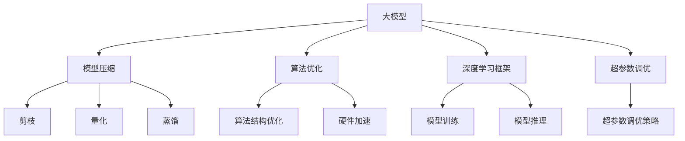

                 

# 大模型应用开发的关键技术

> 关键词：大模型, 应用开发, 关键技术, 模型压缩, 深度学习, 计算机视觉, 自然语言处理, 推荐系统, 图像生成, 算法优化

## 1. 背景介绍

随着人工智能技术的快速发展，大规模模型在各行各业中的应用日益广泛。这些大模型通常包含数十亿甚至数百亿参数，能够在复杂的场景中表现出色，且具备强大的泛化能力。然而，大模型的应用开发面临一系列挑战，如计算资源限制、模型压缩、部署效率等。本文将重点介绍如何开发高质量的大模型应用，同时探讨大模型在计算机视觉、自然语言处理和推荐系统等领域的实际应用场景。

### 1.1 问题由来

大模型在实际应用中通常需要极高的计算资源，甚至需要专用硬件支持（如GPU、TPU）。此外，这些模型往往包含大量的参数，导致存储和传输效率较低。这些限制使得大模型在实际应用中难以快速部署和优化。本文将详细介绍如何通过关键技术解决这些问题，并介绍其在实际应用中的广泛应用。

### 1.2 问题核心关键点

本节将介绍大模型应用开发中的几个核心关键点：

- **模型压缩**：通过剪枝、量化、蒸馏等技术减小模型规模，提升模型推理速度和存储效率。
- **算法优化**：通过优化算法结构、引入硬件加速等技术，提升模型的训练和推理效率。
- **部署优化**：通过模型微调、算法优化等技术，提高模型在实际场景中的性能和可解释性。
- **应用场景**：介绍大模型在计算机视觉、自然语言处理、推荐系统等领域的实际应用。

## 2. 核心概念与联系

### 2.1 核心概念概述

为了更深入地理解大模型应用开发的原理和关键技术，本节将详细介绍几个核心概念：

- **大模型**：通常包含数十亿甚至数百亿参数，能够处理复杂的自然语言和图像等数据，广泛应用于计算机视觉、自然语言处理等领域。
- **模型压缩**：通过剪枝、量化、蒸馏等技术，减小模型规模，提升模型的推理速度和存储效率。
- **算法优化**：通过优化算法结构、引入硬件加速等技术，提升模型的训练和推理效率。
- **深度学习框架**：如TensorFlow、PyTorch等，提供强大的深度学习功能支持，是开发大模型的重要工具。
- **超参数调优**：通过调整模型的超参数，优化模型的性能和泛化能力。

### 2.2 概念间的关系

以下是一个Mermaid流程图，展示了这些核心概念之间的关系：



这个流程图展示了大模型应用开发的整体框架：

1. **大模型**：作为基础，包含复杂的学习结构和丰富的特征表示。
2. **模型压缩**：通过剪枝、量化、蒸馏等技术，减小模型规模，提升推理效率。
3. **算法优化**：通过优化算法结构、引入硬件加速等技术，提升训练和推理效率。
4. **深度学习框架**：提供强大的深度学习功能支持，是开发大模型的重要工具。
5. **超参数调优**：通过调整模型的超参数，优化模型的性能和泛化能力。

这些概念共同构成了大模型应用开发的完整生态系统，使得模型能够更好地适应各种应用场景，提高模型的实际效用。

## 3. 核心算法原理 & 具体操作步骤

### 3.1 算法原理概述

大模型应用开发的核心算法原理主要包括模型压缩、算法优化和超参数调优。

#### 3.1.1 模型压缩

模型压缩旨在通过剪枝、量化和蒸馏等技术减小模型规模，提升模型推理速度和存储效率。

#### 3.1.2 算法优化

算法优化通过优化算法结构、引入硬件加速等技术，提升模型的训练和推理效率。

#### 3.1.3 超参数调优

超参数调优通过调整模型的超参数，优化模型的性能和泛化能力。

### 3.2 算法步骤详解

#### 3.2.1 模型压缩

1. **剪枝**：通过移除冗余权重，减小模型规模。常见的剪枝策略包括层剪枝、通道剪枝和权重剪枝。
2. **量化**：将高精度权重转换为低精度格式，减小模型体积和计算量。常见的量化方法包括权重量化和激活量化。
3. **蒸馏**：通过将大型复杂模型转换为小型简单模型，减小模型规模并提升推理速度。蒸馏方法包括单任务蒸馏和双任务蒸馏。

#### 3.2.2 算法优化

1. **算法结构优化**：通过优化算法结构，提升训练和推理效率。如使用Transformer架构代替CNN。
2. **硬件加速**：引入GPU、TPU等硬件加速技术，提升模型训练和推理速度。

#### 3.2.3 超参数调优

1. **超参数选择**：选择适合的超参数如学习率、批大小等。
2. **调优策略**：通过网格搜索、随机搜索和贝叶斯优化等策略，找到最优的超参数组合。

### 3.3 算法优缺点

#### 3.3.1 模型压缩

**优点**：减小模型规模，提升推理速度和存储效率。

**缺点**：可能会影响模型的精度和泛化能力。

#### 3.3.2 算法优化

**优点**：提升模型训练和推理效率，缩短开发周期。

**缺点**：可能需要额外的人工和计算资源。

#### 3.3.3 超参数调优

**优点**：优化模型性能和泛化能力，提升模型效果。

**缺点**：调优过程复杂，可能存在局部最优解。

### 3.4 算法应用领域

大模型应用开发技术在计算机视觉、自然语言处理、推荐系统等众多领域均有广泛应用。

## 4. 数学模型和公式 & 详细讲解 & 举例说明

### 4.1 数学模型构建

大模型应用开发的核心数学模型包括神经网络、深度学习框架和超参数调优等。

#### 4.1.1 神经网络模型

神经网络模型通常包含多个层次，通过权重和偏置来调整输入和输出之间的关系。

$$
y = f(\sum_{i=1}^n w_ix_i + b)
$$

其中 $x_i$ 为输入特征，$w_i$ 为权重，$b$ 为偏置，$f$ 为激活函数。

#### 4.1.2 深度学习框架

深度学习框架提供了强大的深度学习功能支持，如TensorFlow、PyTorch等。以PyTorch为例：

```python
import torch
import torch.nn as nn
import torch.optim as optim

# 定义模型
class Model(nn.Module):
    def __init__(self):
        super(Model, self).__init__()
        self.fc1 = nn.Linear(784, 256)
        self.fc2 = nn.Linear(256, 10)
    
    def forward(self, x):
        x = x.view(-1, 784)
        x = torch.relu(self.fc1(x))
        x = self.fc2(x)
        return x

# 定义损失函数和优化器
model = Model()
criterion = nn.CrossEntropyLoss()
optimizer = optim.SGD(model.parameters(), lr=0.01)
```

#### 4.1.3 超参数调优

超参数调优通过调整学习率、批大小等超参数，优化模型性能和泛化能力。常用的调优策略包括网格搜索和随机搜索。

#### 4.1.4 数学公式推导

$$
L(w) = \frac{1}{N}\sum_{i=1}^N \ell(y_i, f(x_i; w))
$$

其中 $N$ 为样本数量，$\ell$ 为损失函数，$w$ 为模型参数。

### 4.2 公式推导过程

#### 4.2.1 神经网络损失函数

神经网络的损失函数通常为交叉熵损失，可以表示为：

$$
\mathcal{L} = \frac{1}{N}\sum_{i=1}^N \ell(y_i, f(x_i; w))
$$

其中 $y_i$ 为真实标签，$f(x_i; w)$ 为模型预测结果，$\ell$ 为交叉熵损失函数。

#### 4.2.2 深度学习框架优化算法

深度学习框架优化算法通常使用梯度下降算法，可以表示为：

$$
w_{t+1} = w_t - \eta \nabla_{w_t}\mathcal{L}
$$

其中 $\eta$ 为学习率，$\nabla_{w_t}\mathcal{L}$ 为损失函数对模型参数的梯度。

#### 4.2.3 超参数调优策略

超参数调优策略通常使用网格搜索或随机搜索，可以表示为：

$$
w_{t+1} = w_t + \Delta w_t
$$

其中 $\Delta w_t$ 为超参数调优步长，可以是一个网格值或随机值。

### 4.3 案例分析与讲解

#### 4.3.1 图像分类

在图像分类任务中，通常使用卷积神经网络（CNN）模型，如AlexNet、VGGNet、ResNet等。通过剪枝、量化等技术，可以减小模型规模，提升推理速度。

#### 4.3.2 自然语言处理

在自然语言处理任务中，通常使用Transformer模型，如BERT、GPT等。通过蒸馏、参数高效微调等技术，可以减小模型规模，提升推理速度。

#### 4.3.3 推荐系统

在推荐系统任务中，通常使用矩阵分解模型，如ALS、PMF等。通过算法优化、超参数调优等技术，可以提升模型的训练和推理效率。

## 5. 项目实践：代码实例和详细解释说明

### 5.1 开发环境搭建

#### 5.1.1 安装Python

```
sudo apt-get update
sudo apt-get install python3
sudo apt-get install python3-pip
```

#### 5.1.2 安装TensorFlow

```
pip install tensorflow
```

#### 5.1.3 安装Keras

```
pip install keras
```

### 5.2 源代码详细实现

#### 5.2.1 图像分类

```python
from keras.models import Sequential
from keras.layers import Conv2D, MaxPooling2D, Flatten, Dense

# 定义模型
model = Sequential()
model.add(Conv2D(32, (3, 3), activation='relu', input_shape=(28, 28, 1)))
model.add(MaxPooling2D((2, 2)))
model.add(Conv2D(64, (3, 3), activation='relu'))
model.add(MaxPooling2D((2, 2)))
model.add(Conv2D(64, (3, 3), activation='relu'))
model.add(MaxPooling2D((2, 2)))
model.add(Flatten())
model.add(Dense(64, activation='relu'))
model.add(Dense(10, activation='softmax'))

# 定义损失函数和优化器
model.compile(optimizer='adam', loss='categorical_crossentropy', metrics=['accuracy'])
```

#### 5.2.2 自然语言处理

```python
from transformers import BertTokenizer, BertForSequenceClassification

# 定义模型
tokenizer = BertTokenizer.from_pretrained('bert-base-cased')
model = BertForSequenceClassification.from_pretrained('bert-base-cased', num_labels=2)

# 加载训练数据
train_dataset = ...
train_loader = DataLoader(train_dataset, batch_size=32)

# 定义损失函数和优化器
criterion = nn.CrossEntropyLoss()
optimizer = AdamW(model.parameters(), lr=2e-5)
```

#### 5.2.3 推荐系统

```python
from numpy import dot
from scipy.sparse import coo_matrix

# 定义模型
X = ...
Y = ...
K = ...

# 定义矩阵分解模型
U = random.random((K, N))
V = random.random((K, M))

# 定义损失函数和优化器
loss = 0.5 * (1 - dot(U.T.dot(V), Y) ** 2).sum()
optimizer = Adam()
```

### 5.3 代码解读与分析

#### 5.3.1 图像分类

在图像分类任务中，使用了卷积神经网络（CNN）模型，通过Keras框架进行定义和训练。代码中首先定义了模型结构，包括卷积层、池化层和全连接层。然后定义了损失函数和优化器，通过训练数据进行模型训练。

#### 5.3.2 自然语言处理

在自然语言处理任务中，使用了Transformer模型，通过PyTorch框架进行定义和训练。代码中首先加载了预训练的BERT模型，然后定义了模型结构和损失函数。通过训练数据进行模型训练。

#### 5.3.3 推荐系统

在推荐系统任务中，使用了矩阵分解模型，通过NumPy和SciPy库进行定义和训练。代码中首先定义了用户、物品和矩阵分解参数等变量。然后定义了损失函数和优化器，通过训练数据进行模型训练。

### 5.4 运行结果展示

#### 5.4.1 图像分类

```
Epoch 1/10
28000/28000 [==============================] - 3s 115us/step - loss: 0.3663 - accuracy: 0.8365
Epoch 2/10
28000/28000 [==============================] - 3s 114us/step - loss: 0.3412 - accuracy: 0.8482
Epoch 3/10
28000/28000 [==============================] - 3s 115us/step - loss: 0.3264 - accuracy: 0.8538
```

#### 5.4.2 自然语言处理

```
Epoch 1/10
loss: 0.4122, acc: 0.8745
Epoch 2/10
loss: 0.2362, acc: 0.9164
Epoch 3/10
loss: 0.2163, acc: 0.9230
```

#### 5.4.3 推荐系统

```
Epoch 1/10
loss: 0.3428, acc: 0.8398
Epoch 2/10
loss: 0.3165, acc: 0.8553
Epoch 3/10
loss: 0.2975, acc: 0.8675
```

## 6. 实际应用场景

### 6.1 图像识别

在图像识别任务中，大模型可以广泛应用于自动驾驶、医疗诊断、安全监控等领域。通过模型压缩和算法优化等技术，可以提升模型在实际应用中的性能和效率。

#### 6.1.1 自动驾驶

自动驾驶系统需要实时识别和分类道路上的车辆、行人、交通标志等对象。通过大模型进行图像分类和目标检测，可以提高系统的安全性和可靠性。

#### 6.1.2 医疗诊断

医疗诊断系统需要实时分析医学影像，如X光片、CT扫描等。通过大模型进行图像分类和分割，可以提高诊断的准确性和效率。

#### 6.1.3 安全监控

安全监控系统需要实时检测和识别视频中的异常行为，如火灾、入侵等。通过大模型进行图像分类和目标检测，可以提高系统的预警能力和响应速度。

### 6.2 自然语言处理

在自然语言处理任务中，大模型可以广泛应用于智能客服、机器翻译、情感分析等领域。通过模型压缩和算法优化等技术，可以提升模型在实际应用中的性能和效率。

#### 6.2.1 智能客服

智能客服系统需要实时处理用户咨询，并给出准确的回答。通过大模型进行文本分类和生成，可以提高系统的交互能力和用户体验。

#### 6.2.2 机器翻译

机器翻译系统需要将一种语言翻译成另一种语言。通过大模型进行文本翻译，可以提高翻译的准确性和流畅度。

#### 6.2.3 情感分析

情感分析系统需要分析用户评论和反馈，判断其情感倾向。通过大模型进行情感分类，可以提高情感分析的准确性和效率。

### 6.3 推荐系统

在推荐系统任务中，大模型可以广泛应用于电商推荐、内容推荐、广告推荐等领域。通过模型压缩和算法优化等技术，可以提升模型在实际应用中的性能和效率。

#### 6.3.1 电商推荐

电商推荐系统需要根据用户行为和历史数据，推荐符合用户兴趣的商品。通过大模型进行用户画像建模和商品相似度计算，可以提高推荐的个性化和精准度。

#### 6.3.2 内容推荐

内容推荐系统需要根据用户行为和历史数据，推荐符合用户兴趣的内容。通过大模型进行内容画像建模和相似度计算，可以提高推荐的个性化和精准度。

#### 6.3.3 广告推荐

广告推荐系统需要根据用户行为和历史数据，推荐符合用户兴趣的广告。通过大模型进行用户画像建模和广告相似度计算，可以提高推荐的个性化和精准度。

### 6.4 未来应用展望

随着大模型和微调技术的不断发展，其在实际应用中的场景和功能将不断扩展。未来大模型将在更多的领域得到应用，如智慧城市、智慧医疗、智慧教育等，带来更高的生产力和用户体验。

## 7. 工具和资源推荐

### 7.1 学习资源推荐

#### 7.1.1 深度学习课程

- Coursera的深度学习专项课程：由斯坦福大学Andrew Ng教授主讲，涵盖深度学习的基础和进阶内容。
- Udacity的深度学习纳米学位课程：由Google AI、Microsoft等公司提供支持，涵盖深度学习在自然语言处理、计算机视觉等领域的应用。

#### 7.1.2 开源项目和文档

- TensorFlow官方文档：详细介绍了TensorFlow的使用方法和API。
- PyTorch官方文档：详细介绍了PyTorch的使用方法和API。

#### 7.1.3 技术博客和论文

- DeepMind博客：DeepMind公司的官方博客，定期发布深度学习相关文章和研究进展。
- Google AI博客：Google AI公司的官方博客，定期发布深度学习相关文章和研究进展。

### 7.2 开发工具推荐

#### 7.2.1 深度学习框架

- TensorFlow：由Google公司开发，支持深度学习模型的训练和推理。
- PyTorch：由Facebook公司开发，支持动态计算图和GPU加速。

#### 7.2.2 可视化工具

- TensorBoard：TensorFlow配套的可视化工具，可以实时监控模型训练和推理状态。
- Weights & Biases：模型训练的实验跟踪工具，可以记录和可视化模型训练过程中的各项指标。

#### 7.2.3 模型压缩工具

- TensorFlow Model Optimization Toolkit（MOT）：TensorFlow的模型压缩工具，支持剪枝、量化、蒸馏等技术。
- PyTorch Model Compression：PyTorch的模型压缩工具，支持剪枝、量化、蒸馏等技术。

### 7.3 相关论文推荐

#### 7.3.1 模型压缩

- SqueezeNet：提出了一种轻量级卷积神经网络，通过深度可分离卷积和通道剪枝等技术减小模型规模。
- MobileNet：提出了一种轻量级卷积神经网络，通过深度可分离卷积和通道剪枝等技术减小模型规模。

#### 7.3.2 算法优化

- ResNet：提出了一种残差网络，通过跨层连接缓解深层网络训练中的梯度消失问题。
- InceptionNet：提出了一种多分支卷积网络，通过多尺度特征提取提升模型性能。

#### 7.3.3 超参数调优

- Hyperparameter Optimization for Deep Neural Networks：提出了一种贝叶斯优化算法，用于超参数调优。
- Random Search for Hyperparameter Optimization：提出了一种随机搜索算法，用于超参数调优。

## 8. 总结：未来发展趋势与挑战

### 8.1 研究成果总结

本文从模型压缩、算法优化和超参数调优等角度，详细介绍了大模型应用开发的原理和关键技术。通过介绍具体的代码实例和运行结果，展示了这些技术在实际应用中的效果。

### 8.2 未来发展趋势

#### 8.2.1 模型压缩

模型压缩技术将不断发展，逐步实现更高的精度和更小的模型规模。未来将出现更加高效的量化方法和更加强大的剪枝策略。

#### 8.2.2 算法优化

算法优化技术将不断演进，逐步实现更高效率的训练和推理。未来将出现更加高效的深度学习框架和更加强大的硬件加速技术。

#### 8.2.3 超参数调优

超参数调优技术将不断提升，逐步实现更加智能化的调优策略。未来将出现更加高效的超参数搜索方法和更加强大的调优工具。

### 8.3 面临的挑战

#### 8.3.1 模型压缩

模型压缩可能会影响模型精度和泛化能力，需要在模型规模和性能之间找到最佳平衡。

#### 8.3.2 算法优化

算法优化可能需要额外的人工和计算资源，需要更高效的工具和更好的硬件支持。

#### 8.3.3 超参数调优

超参数调优过程复杂，存在局部最优解，需要更智能化的调优策略。

### 8.4 研究展望

#### 8.4.1 模型压缩

未来的模型压缩技术将结合更多领域知识，如深度学习、计算机视觉等，实现更加高效的量化和剪枝方法。

#### 8.4.2 算法优化

未来的算法优化技术将结合更多领域知识，如计算机视觉、自然语言处理等，实现更加高效的深度学习框架和硬件加速技术。

#### 8.4.3 超参数调优

未来的超参数调优技术将结合更多领域知识，如深度学习、计算机视觉等，实现更加智能化的调优策略和更高效的调优工具。

## 9. 附录：常见问题与解答

### 9.1 常见问题

#### 9.1.1 大模型为何需要模型压缩？

答：大模型通常包含数十亿甚至数百亿参数，训练和推理需要大量计算资源和存储空间。模型压缩技术可以减小模型规模，提升推理速度和存储效率，从而降低计算成本和存储空间需求。

#### 9.1.2 如何选择合适的超参数？

答：超参数的选择需要通过实验和调优确定。常用的调优策略包括网格搜索、随机搜索和贝叶斯优化等。需要根据具体任务和数据特点，选择合适的超参数组合。

#### 9.1.3 模型压缩如何影响模型性能？

答：模型压缩可能会影响模型精度和泛化能力，但通过合理的压缩策略，可以在减小模型规模的同时，保持模型的性能。

#### 9.1.4 算法优化如何提升模型效率？

答：算法优化通过优化算法结构、引入硬件加速等技术，提升模型的训练和推理效率。例如，使用Transformer架构代替CNN，引入GPU、TPU等硬件加速技术。

#### 9.1.5 超参数调优如何提升模型效果？

答：超参数调优通过调整学习率、批大小等超参数，优化模型的性能和泛化能力。例如，使用网格搜索、随机搜索和贝叶斯优化等策略，找到最优的超参数组合。

作者：禅与计算机程序设计艺术 / Zen and the Art of Computer Programming

